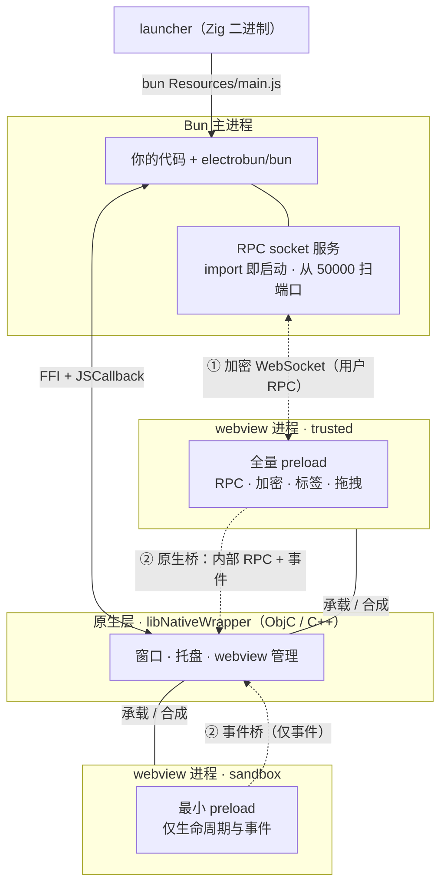
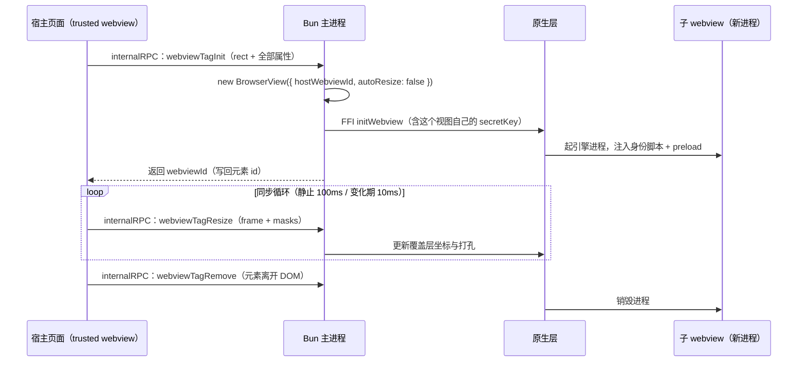
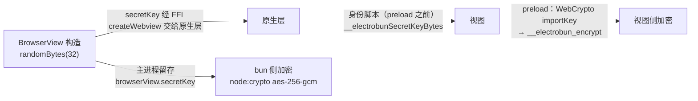

import { Canvas, Controls, Meta } from '@storybook/addon-docs/blocks';
import * as ArchitectureStories from './architecture.stories';

<Meta of={ArchitectureStories} name="Docs" />

# 架构原理

前面各课分别用过窗口、视图、RPC 与 webview 标签，但每个机制背后都是同一套架构。本课把这套架构完整拆开：一次运行里机器上到底有哪些进程；主进程与 webview 之间的边界靠什么维持、信任如何分级；一条消息跨过边界时走哪条通道、这条通道为什么逐条加密；`<electrobun-webview>` 的 OOPIF 又是怎么用「DOM 锚点 + 原生覆盖层」合成出来的。机制性结论均与 electrobun 1.18.1 包内实现核对，进程清单来自本机（macOS）实测。读完你能预测三件事：`ps` 里会看到什么、一条消息会走哪条路、`sandbox` 到底挡住了什么。



回查时先看通道总表——这是本课最常查的矩阵（各行依据见「通信通道」小节）：

| 通道 | 走向 | 谁在用 | 线上形态 | sandbox 视图 |
| --- | --- | --- | --- | --- |
| 加密 WebSocket | 视图 ↔ bun | 用户 RPC 主路径 | AES-256-GCM 密文包（base64 三元组） | 无端口无密钥，不参与 |
| postMessage 桥 | 视图 → bun | 用户 RPC 回落 | 明文 JSON | 桥未注册，不可用 |
| 脚本注入 / 脚本执行 | bun → 视图 | 用户 RPC 回落 · `executeJavascript` | 注入或下发的一段 JS | RPC 回落无效（收信桥不存在）；`executeJavascript` 本身不受限 |
| internalBridge | 视图 → bun | 框架机制（webview 标签、拖拽区） | 批量明文 JSON | 桥未注册，且无产生消息的代码 |
| eventBridge | 视图 → bun | 事件上报（`dom-ready` 等） | 明文 JSON（只认 `webviewEvent`） | 可用——唯一保留的通道 |
| FFI / JSCallback | bun ↔ 原生层 | 一切主进程 API | 进程内调用，不出进程 | 不涉及 |

## 进程模型

### 主进程

一个运行中的 Electrobun 应用首先是一个 Bun 应用：随应用分发的 launcher（Zig 二进制）只做一件事——用内置的 bun 运行时执行编译后的入口。启动后主进程里有三块东西：

- **你的代码**：`src/bun` 的编译产物，普通 TypeScript，跑在 Bun 运行时上；
- **electrobun 的 JS API 层**：`import electrobun/bun` 加载 `BrowserWindow`、`BrowserView` 等类，并**顺带启动 RPC socket 服务**——`dist/api/bun/core/Socket.ts` 在模块顶层就执行 `startRPCServer()`，从 50000 起找首个可用端口，不是按需创建；
- **原生绑定**：`dlopen` 加载 `libNativeWrapper`（macOS 上是 ObjC/C++，对接 `NSWindow`、`WKWebView` 等系统 API）。调用方向走 Bun FFI，原生回调用 threadsafe `JSCallback` 送回 JS。

线程布局采用官方 Architecture Overview 的表述：原生 GUI 需要阻塞式主线程事件循环，因此 Bun 主线程先创建一个 worker 运行你的代码，再经 FFI 初始化原生事件循环——包内 FFI 符号名 `createWindowWithFrameAndStyleFromWorker` 就是这个布局留下的痕迹。这对应用代码没有影响：照常在入口模块顶层写业务，不需要感知线程。

在本机把 tester 工程跑起来即可核对（macOS + Bun，electrobun 1.18.1）：

```bash
cd tester && bun start          # 任一 Electrobun 工程均可
# 另开一个终端：
ps aux | grep -E "launcher|Resources/main" | grep -v grep
```

实测输出（路径截短）：

```text
.../hello-world-dev.app/Contents/MacOS/launcher           # ① launcher（Zig）
./bun .../hello-world-dev.app/Contents/Resources/main.js  # ② bun 运行时 + 应用代码
```

dev 启动日志同时印证两件事——launcher 的职责，与 socket 服务的端口扫描：

```text
Spawning: ./bun .../Resources/main.js
Port 50000 in use, trying next port...
Server started at http://localhost:50001
```

dev 构建用开发版 launcher 把 bun、原生层的输出汇到终端；发布版的 launcher 则是[构建与分发](?path=/docs/build-basics--docs)里自解压流程的入口。

### webview 进程

视图代码不是主进程里的线程，而是**操作系统 webview 引擎的独立进程**。macOS 实测，开一个窗口会带来引擎自己的伴随进程：

```text
com.apple.WebKit.WebContent    # 页面执行——你的视图代码在这里跑
com.apple.WebKit.Networking    # 网络栈
com.apple.WebKit.GPU           # 合成渲染
```

进程名是引擎的、不是应用的——`ps` 里找不到以你应用命名的视图进程，属正常现象。由此得到三条推论：

- **每视图一进程**：进程隔离与崩溃保护（一个视图崩溃不拖垮其他视图与主进程）都来自这里，内存与启动成本也来自这里；
- **跨进程必然走 IPC**：视图与主进程之间没有函数调用可打，全部通信走下文的显式通道；
- **全应用只有一种视图对象**：窗口自带的视图也是 `BrowserView`（`BrowserWindow` 构造时内部 `new BrowserView`，经 `win.webview` 取回），`<electrobun-webview>` 的子视图同样是（`webviewTagInit` 处理器里 `new BrowserView({ hostWebviewId, autoResize: false })`）。用法见 [BrowserView](?path=/docs/browser-view--docs)。

## 进程隔离

进程隔离的安全含义：文件、网络、系统能力默认都在 bun 一侧，视图侧拿不到任何桌面能力，除非经显式通道过境——而每条通道的另一端都有主进程代码把关（`rpcHandler`、`internalRpcHandlers`、事件总线）。

隔离之上还有第二层分级：**同一进程隔离下按内容可信度分 trusted / sandbox 两档**，差异全部落在 preload。这是加载不可信内容时的核心开关，与 [webview 标签](?path=/docs/webview-tag--docs)的 `sandbox` 属性是同一个机制。

### 信任分级

档位在创建视图时决定（`BrowserView` 的 `sandbox` 选项或标签属性），此后不可更改。原生层在 preload **之前**注入一小段身份脚本（`native.ts` 的 `dynamicPreload`），两档注入的差异：

| 注入项 | trusted | sandbox |
| --- | --- | --- |
| `__electrobunWebviewId` / `__electrobunWindowId` | 有 | 有 |
| `__electrobunRpcSocketPort` / `__electrobunSecretKeyBytes` | 有 | 无 |
| `__electrobunBunBridge`（用户 RPC 回落桥） | 有 | 无 |
| `__electrobunInternalBridge`（内部 RPC 桥） | 有 | 无 |
| `__electrobunEventBridge`（事件桥） | 有 | 有 |
| 随后加载的内置 preload | 全量：RPC、加密、webview 标签、拖拽区、生命周期 | 最小：仅生命周期与事件 |

断点是双保险：视图侧最小 preload 里**根本没有** RPC 与加密代码；原生侧创建 webview 时对 sandbox **不注册** `bunBridge` 与 `internalBridge` 两个回调（`initWebview` 的 `sandbox` 参数）。即使页面脚本尝试伪造 `__electrobunBunBridge`，原生层也没有接收方。事件是刻意保留的底线通道：事件桥的接收回调只认 `id === "webviewEvent"` 的消息，其余类型静默忽略——它上报事实，不能当 RPC 用。

### 引擎收敛

同一段 preload 契约要落在 WKWebView、WebView2 与 CEF 三个引擎上，靠的是注入脚本里的桥接 fallback 链（`native.ts`）：

```js
window.__electrobunBunBridge =
  window.webkit?.messageHandlers?.bunBridge ||            // WKWebView
  window.bunBridge ||                                     // CEF（OnContextCreated 注入）
  window.chrome?.webview?.hostObjects?.bunBridge;         // WebView2
```

上层 JS 只看到统一的 `__electrobunBunBridge`，引擎差异被收敛在原生层。这也是加密通道、webview 标签这些机制对三种 renderer 行为一致的原因——它们依赖的是「桥 + 原生层」，而不是某个引擎的私有特性。

## webview 标签

### 为什么不是 iframe

官方 Webview Tag Architecture 页给出不用普通 iframe 的四条理由：浏览器对跨域 iframe 的安全限制、无法绕过同源策略带来的控制受限、与父页面共享进程（无隔离、无独立资源）、进阶特性不可用。Electron 的 `<webview>` 标签同样不被采纳——它依赖 Chromium 的实现，官方页面提到该实现已被 Chromium 列入移除计划；Electrobun 的版本是完全自研的机制，不依赖引擎内置的任何 webview 标签能力。

由此得到的设计选择是：**把「看起来像 iframe」和「实际是独立进程」拆成两层**——DOM 里只放一个锚点元素，真正的内容进程由主进程另行创建，两层钉在同一坐标上。收益是进程隔离、崩溃保护与跨引擎一致（WebKit / WebView2 / CEF 都只有「原生视图 + 坐标」这一种玩法）；代价是覆盖层与 DOM 的同步有粒度、锚点一移就要销毁重建——这些使用层后果在 [webview 标签](?path=/docs/webview-tag--docs)处理，这里看机制本身。

### 嵌合流程

一个标签从插入 DOM 到销毁的完整链路（每一步的消息都走 internalBridge 这条框架内部通道，见下一节）：



三个架构要点：子 webview 是**全尺寸的 `BrowserView`**，拥有自己的密钥、自己的进程、自己的可选 preload——OOPIF 不是一个降级容器；宿主与子视图**没有直接通道**，跨进程通信只有事件回流与各自的 RPC，全部经过主进程；**DOM 生命周期即子进程生命周期**，元素移除即销毁、重新插入是全新初始化。

## 通信通道

`native.ts` 里有一段注释把通道分成三层，原文照录——这是理解全部通信的骨架：

```text
// internalRPC (bun <-> browser internal stuff)
// BrowserView.rpc (user defined bun <-> browser rpc unique to each webview)
// nativeRPC (internal bun <-> native rpc)
```

第三层（bun ↔ 原生层）是 FFI，不出主进程。前两层跨进程，方向与形态见开场总表。三个输入决定一条消息的路径：**消息类型（属于哪一层）、视图信任级、socket 状态**。下面的示意在浏览器里复现这个判定矩阵；真实窗口里的消息行为可在任一 Electrobun 工程（如工作区 `tester/`）里核对。

<Canvas of={ArchitectureStories.MessageRouting} />
<Controls of={ArchitectureStories.MessageRouting} />

| 读者操作 | 可观察证据 |
| --- | --- |
| 把「消息类型」切到「事件上报」 | 通道变为 eventBridge；再把「视图信任级」切到 sandbox，路径不变——事件是 sandbox 唯一保留的通道 |
| 保持「用户 RPC · 视图 → bun」+ trusted，把「socket 状态」切到断开 | 站点序列从四站加密路径换成三站 postMessage 桥，线上形态从密文包变明文 JSON |
| 把「视图信任级」切到 sandbox（用户 RPC 两个方向、框架内部） | 路径变灰：无端口无密钥、桥未注册，结论变为消息到不了 / 不会发生 |
| 把「消息类型」切到「脚本执行」 | 全程不经 socket，切换信任级只有结论条在变——这是主进程侧的 FFI 原生能力，不属于视图的通道 |
| 打开 Show code | 看到该 Canvas 实际执行的 `message-routing.ts`，判定矩阵集中在 `routeFor()` |

### 用户 RPC

业务代码的通道，`RPCSchema` 约束类型，包格式与 `send` / `request` / handler 的完整用法在[自定义 RPC](?path=/docs/rpc--docs)，视图侧接线在 [Electroview](?path=/docs/electroview--docs)。这里只补架构视角的两个事实：主路径（加密 WebSocket）与回落（postMessage 桥 / 脚本注入）**同时存在于两端**——视图发 bun、bun 发视图各有各的主路径与回落，选择依据只有一个（socket 是否 OPEN）；回落是自动的、业务无感，socket 恢复后回到加密通道。

### 框架内部与事件

框架机制自己也要跨进程，但刻意与用户 RPC 分开：

- **internalBridge**：webview 标签（`webviewTagInit` / `webviewTagResize` / `webviewTagRemove`…）、拖拽区（`startWindowMove` / `stopWindowMove`）走这里。发送侧批量——消息先入队，整批 `JSON.stringify` 后一次过桥，配 2ms 节流；接收侧 `internalBridgeHandler` 拆批分发到 `internalRpcHandlers`。它**不走 socket**：标签的尺寸同步不依赖用户 RPC 通道的状态。
- **eventBridge**：事件上报专用，单向，只认 `webviewEvent`。全部视图可用（含 sandbox）。
- **脚本执行**：`view.executeJavascript(js)` 经 FFI `evaluateJavascriptWithNoCompletion` 完成，fire-and-forget；它同时也是 bun → 视图方向用户 RPC 的回落载体。要拿返回值就走 RPC。

## 加密链路

### 密钥生命周期

「每个视图一把密钥」不是一句口号，是一条完整的分发链（三个环节的代码位置都在包内可查）：



密钥随视图构造随机生成、随视图销毁作废，不落盘、不共享：窗口自带的视图、每个标签子视图、每个手动创建的 `BrowserView` 各有一把。此后每条消息独立加密——12 字节随机 IV，AES-256-GCM，认证标签取密文末 16 字节，线上是三个 base64 字段的 JSON。逐条消息加密格式与 `ws://` 不加 TLS 的完整论证在 [Electroview](?path=/docs/electroview--docs)的「加密通道」小节，这里不重复。

### 信任模型

这条链路防的是什么？**本机上能看到回环流量的其他进程**。本地 WebSocket 没有加密时，同机任意进程连上去就能读到（甚至伪造）RPC 流量；逐条加密之后，密码学身份落到密钥上：

- **key 即身份**：socket 服务按连接带来的 `webviewId` 找到对应视图的密钥解密——能解开就证明发送方持有该视图的密钥，消息才被交给这个视图的 `rpcHandler`（`Socket.ts` 内的注释原话：解密成功即 "we can trust that this message can be passed to this browserview's rpc methods"）。
- **GCM 自带认证**：密钥不对或密文被篡改，解密直接失败，包被丢弃——不需要额外的校验字段。
- **回落路径不降级安全性**：postMessage 桥与脚本注入都经原生层直达，不经过网络，本机其他进程碰不到。
- **端点之内是明文**：加密只覆盖传输层。DevTools 里能看到自己视图的消息是正常的；页面被注入恶意脚本时，威胁在端点内，传输加密不解决——那是 `sandbox` 与导航白名单要解决的事。

## 最佳实践

- 按内容信任度选隔离形态：自家 `views://` 内容用 trusted 视图（要 RPC、要标签都行）；加载远程或不可信内容一律 sandbox + 导航白名单 + 独立 `partition`（操作组合见 [webview 标签](?path=/docs/webview-tag--docs)的最佳实践）。原则反过来说更短：隔离是默认，信任是显式授予——凡是不需要 RPC 的视图，都不该给它。
- 通信故障分层排查，一次只挪一层：先进程层（视图还在吗，`BrowserView.getById(id)` 能否取回）→ 再通道层（socket 是否 OPEN、回落是否可达）→ 最后 handler 层（方法名拼写、`rpc` 是否传进了 `BrowserWindow` 选项）。跨层同时改两个变量，定位会变难。
- 把「每视图一把密钥」纳入数据流设计：密钥随视图销毁作废，视图重建后是新的密钥与新的 `webviewId`。不要把「视图身份」缓存成长期凭证——用 `webviewId` 做运行期路由可以，做持久化标识不可以。

## 常见问题

- dev 启动时打出 `Port 50000 in use, trying next port... Server started at http://localhost:50001`，是出错了吗？
  不是。RPC socket 服务从 50000 起扫首个可用端口，端口被占（同机另一个 Electrobun 应用、或残留服务）就顺延，直到 65535。日志里 `Server started at` 后面的端口就是本实例的实际端口，无需配置。
- 本机其他进程直接连上这个端口，能不能伪造 RPC 消息？
  不能读到也不能注入有效消息。所有用户 RPC 消息逐条 AES-256-GCM 加密，没有该视图的 32 字节密钥就解不开（GCM 认证失败，包被丢弃）；而密钥只存在于主进程内存与该视图的注入环境里。信任判定是「key 即身份」，不依赖网络层凭证。
- 消息明明是加密的，为什么在 DevTools 里还能看到明文？
  加密覆盖的是传输层（socket 上的线上包是 `{encryptedData, iv, tag}` 密文）；端点之内——rpcHandler 收到之后、DevTools 的控制台与断点——本来就是明文。这不是漏洞，是边界：防的是路上的窃听与伪造，不防端点内部的代码。
- 视图页面脚本死循环，整个应用卡死了吗？
  没有。每个 webview 是独立进程，页面无响应只影响那个进程；主进程与其他视图照常运行，窗口移动、菜单、托盘都由原生层与主进程持有。恢复手段是重载或销毁重建该视图（`reload()` / 移除再插入标签）。

## 总结回顾

摘要：

一次运行里有四类角色：launcher（Zig）只负责拉起 bun；主进程（Bun 运行时）装着你的代码、electrobun 的 JS API 层（import 即启动的 RPC socket 服务）与经 FFI 对接的原生层（`libNativeWrapper`）；每个 webview 是系统引擎的独立进程，全应用只有 `BrowserView` 一种视图对象。隔离分两层：进程隔离是基线（系统能力全在 bun 一侧），其上按内容可信度分 trusted / sandbox 两档 preload——sandbox 无端口、无密钥、无 RPC 桥，只保留事件通道，且断点是视图侧与原生侧双保险。通信分三层：bun ↔ 原生走 FFI；框架内部（webview 标签、拖拽）走 internalBridge 批量过桥；用户 RPC 走每视图一把密钥的加密 WebSocket，socket 断开时自动回落原生桥或脚本注入。`<electrobun-webview>` 的 OOPIF 是「DOM 锚点 + 主进程创建的覆盖层」两层合成：不是 iframe、不依赖任何引擎的标签实现，锚点一移即销毁重建。加密链路的信任模型是「key 即身份」：密钥随视图构造随机生成、经 FFI 与身份脚本分发到两端、随视图销毁作废；GCM 认证让伪造与篡改的包直接被丢弃，`ws://` 不加 TLS 是因为消息已逐条加密。

一句话：

> Electrobun 的架构只有一个核心动作：把信任从「进程边界」细化到「每视图一把密钥的显式通道」——主进程持有一切能力，视图按档位拿通道，跨界的每条消息都有唯一可查的路由。

知识要点：

- 一次运行里有哪些进程？launcher、bun 主进程、原生层、webview 进程各自的职责是什么？
- `import electrobun/bun` 时主进程里额外发生了什么？RPC socket 服务的端口怎么定？
- trusted 与 sandbox 两档 preload 的注入差异是什么？断点为什么是双保险？
- 用户 RPC、框架内部消息、事件上报分别走哪条通道？socket 断开影响哪几条？
- sandbox 视图还能用哪条通道？事件桥为什么不能被当成 RPC 用？
- OOPIF 的两层合成是什么？为什么不用 iframe 或引擎自带的 webview 标签？
- 密钥从生成到作废经过哪些环节？「key 即身份」的信任判定发生在哪里？
- 这条加密链路防什么、不防什么？

## 参考资料

- [Electrobun 文档：Architecture Overview](https://framework.blackboard.sh/electrobun/guides/architecture/overview/)：launcher→bun 启动链、worker 线程布局、IPC 机制总述（postMessage、FFI、encrypted web sockets）。
- [Electrobun 文档：Webview Tag Architecture](https://framework.blackboard.sh/electrobun/guides/architecture/webview-tag/)：不用普通 iframe 的四条理由、Electron webview 标签的弃用风险、OOPIF 的隔离与层合成表述。
- [Electrobun 文档：What is Electrobun?](https://framework.blackboard.sh/electrobun/guides/what-is-electrobun/)：进程隔离默认开启、加密类型安全 RPC、最小攻击面的设计目标。
- electrobun 1.18.1 包内实现（`dist/api/bun/core/Socket.ts` 的 RPC 服务与信任判定注释、`dist/api/bun/core/BrowserView.ts` 的密钥生成与传输回落、`dist/api/bun/core/BrowserWindow.ts` 的内部 `BrowserView`、`dist/api/bun/proc/native.ts` 的 `dynamicPreload` 两档注入 / `initWebview` 的 sandbox 参数 / 三层通道注释 / `internalRpcHandlers`、`dist/api/bun/preload/index.ts` 与 `index-sandboxed.ts` 的双 preload、`dist/api/bun/preload/internalRpc.ts` 的批量与节流、`dist/api/browser/index.ts` 的 Electroview 路径选择）：通道矩阵、注入差异与默认值的一手依据。
- 本机实测（macOS ARM64，electrobun 1.18.1，tester 工程）：进程清单（`launcher` / `bun …/Resources/main.js` / `com.apple.WebKit.*`）与 dev 日志（`Spawning: ./bun`、端口扫描输出）。
