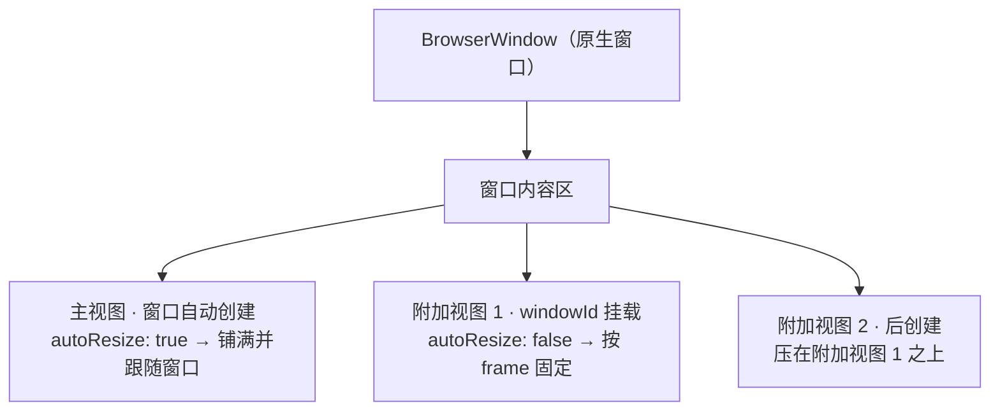

import { Canvas, Controls, Meta } from '@storybook/addon-docs/blocks';
import * as BrowserViewCourse from './browser-view.stories';

<Meta of={BrowserViewCourse} name="Docs" />

# BrowserView

窗口里每一块网页内容都是一个 BrowserView：`new BrowserWindow` 会自动创建一个铺满窗口的主视图，附加视图由主进程 `new BrowserView({...})` 创建、用 `windowId` 挂到某个窗口上。三件事决定一个视图长什么样：`frame`（在窗口内容区里的位置和尺寸）、`autoResize`（铺满跟随窗口，还是按 frame 固定）、创建顺序（决定它压在谁上面）。本课讲清这三件事与多视图组合方式；读完后你能预测"在窗口里再开一块视图"每个参数会带来什么结果。



回查时先看这组构造选项默认值（均与 1.18.1 包内类型定义核对过）：

| 构造选项 | 默认值 | 回查要点 |
| --- | --- | --- |
| `frame` | `800×600`，位置 `(0, 0)` | 相对窗口内容区左上角，y 向下；分量可部分传入合并；仅 `autoResize: false` 时生效 |
| `autoResize` | `true` | `true`：铺满并跟随窗口尺寸（frame 被忽略）；`false`：按 frame 固定、不跟随 resize |
| `windowId` | `0`（无效值） | 附加视图的挂载方式；必须传存活窗口的 id，否则构造即抛错 |
| `url` | `null` | 远程 `https://` 或 `views://` 地址；与 `html` 同传时 `html` 生效 |
| `html` | `null` | 整页 HTML 字符串，不经构建装配 |
| `renderer` | 构建的 `defaultRenderer`（未配置时 `native`） | `native` 用系统 WebView（macOS 为 WKWebView），`cef` 用打包的 CEF |
| `partition` | `null`（原生按 `persist:default` 处理） | 会话隔离与持久化，见[会话与存储](?path=/docs/session-storage--docs) |
| `preload` | `null` | 先于页面脚本执行；配合通信见[自定义 RPC](?path=/docs/rpc--docs) |
| `rpc` | 空通道 | 与该视图的通信句柄，见[自定义 RPC](?path=/docs/rpc--docs) |
| `navigationRules` | `null`（不限制导航） | glob 规则数组，`^` 前缀拒绝，自上而下最后匹配生效 |
| `sandbox` | `false` | `true` 关闭 RPC 只保留事件，用于不可信远程内容 |
| `hostWebviewId` | 无 | 仅 `<electrobun-webview>` 标签（OOPIF）内部使用，见[webview 标签](?path=/docs/webview-tag--docs) |
| `startTransparent` / `startPassthrough` | `false` | 创建时（首帧前）即设为透明 / 鼠标穿透 |

## 快速上手

沿用 [第一个窗口](?path=/docs/first-window--docs) 的 hello-world 工程，把 `src/bun/index.ts` 换成下面这段（`tester/` 工程同理，跑 `bunx electrobun dev`），即可在一个窗口里得到两块内容：

```ts
import { BrowserWindow, BrowserView } from "electrobun/bun";

const win = new BrowserWindow({
	title: "Hello, Electrobun!",
	url: "views://mainview/index.html",
	frame: { width: 1000, height: 640, x: 200, y: 200 },
});

const sidebar = new BrowserView({
	windowId: win.id, // 挂载：告诉视图挂在哪个窗口上
	autoResize: false, // 关掉铺满，frame 才会生效
	frame: { x: 0, y: 0, width: 280, height: 600 }, // 内容区左上角起算
	url: "https://electrobun.dev",
});
```

`bun start` 后逐条核对：

- 窗口左侧 280px 是 electrobun.dev（第 2 个视图），右侧是主视图页面（窗口自带的第 1 个视图）。
- 拖大窗口：主视图跟着变大铺满；侧栏原地不动。
- 关闭窗口：两个视图随窗口一起清理，应用退出。

## 挂到窗口

### 窗口自带的主视图

`new BrowserWindow({...})` 一次做两件事：创建原生窗口，同时创建一个 `BrowserView` 作为它的主视图。窗口选项里的 `url`（或 `html`）、`preload`、`renderer`、`rpc`、`navigationRules`、`sandbox` 都原样转发给这个视图；它 `autoResize: true`，铺满窗口内容区并跟随 resize。构造完成后用两个入口拿到它：

```ts
const webview = win.webview; // BrowserView 实例，可调用 loadURL 等视图方法
const id = win.webviewId; // 数字 id，等价于 webview.id
```

所以"窗口加载页面"本质是主视图在加载；大多数单视图应用到这一步就够了，不需要自己 `new BrowserView`。

### windowId 挂载

附加视图没有单独的 `addBrowserView` 一类的方法——挂载就发生在构造时：给 `new BrowserView` 传 `windowId: win.id`，视图创建后直接出现在该窗口的内容区里。两个边界：

- `windowId` 不传（默认 `0`）或指向已关闭的窗口，构造当场抛错 `Can't add webview to window. window no longer exists`——1.18.1 里不存在"先创建、后挂载"的用法。
- 窗口关闭时会自动 `remove()` 该窗口的全部视图（按 `view.windowId` 匹配），不需要手动清理；主动撤掉单个视图调用 `view.remove()`，之后该视图不再渲染、RPC 通道被断开。

## 内容加载

视图显示什么由 `url` 和 `html` 决定，二选一：

| 给法 | 适用 | 要点 |
| --- | --- | --- |
| `url: "views://…"` | 本地打包 UI | 文件需先装配进 `views/`，见[第一个窗口](?path=/docs/first-window--docs) |
| `url: "https://…"` | 远程站点 | 不可信内容配合 `sandbox: true` |
| `html: "<!DOCTYPE html>…"` | 一次性小视图、徽标 | 整页 HTML 内联，免装配 |
| 都不传 | 先建视图后填内容 | 创建后调用 `loadURL` / `loadHTML` |

两个细节：`url` 与 `html` 同时传时 `html` 生效（传给原生的 url 会被置空）；运行时换内容用 `view.loadURL(url)` 或 `view.loadHTML(html)`，CEF 渲染器下 `loadHTML` 经内部地址 `views://internal/index.html` 生效，调试时看到它不是异常。

## 视图方法

`BrowserView` 上其余方法都作用于单个视图，按回查表收录（完整签名以官方 API 页为准）：

| 方法 | 用途 | 关键影响 |
| --- | --- | --- |
| `loadURL(url)` / `loadHTML(html)` | 运行时替换内容 | 触发导航类事件 |
| `executeJavascript(js)` | 在视图里执行 JS | 无返回值；要拿结果用 `view.rpc.request.evaluateJavascriptWithResponse({ script })` |
| `setNavigationRules(rules)` | 限制可导航地址 | glob 通配，`^` 前缀拒绝，最后匹配生效，`[]` 清空 |
| `findInPage(text, opts)` / `stopFindInPage()` | 页内查找 | `opts` 仅 `forward`（默认 `true`）、`matchCase`（默认 `false`）；重复调用逐个跳转 |
| `openDevTools()` / `closeDevTools()` / `toggleDevTools()` | 打开开发者工具 | macOS CEF 渲染器为独立 DevTools 窗口 |
| `setPageZoom(z)` / `getPageZoom()` | 页面缩放，`1.0` 为 100% | 仅 WebKit（`native` 渲染器）生效；CEF 下恒 `1.0` |
| `on(name, handler)` | 订阅视图事件 | `will-navigate`、`did-navigate`、`did-navigate-in-page`、`did-commit-navigation`、`dom-ready`、`download-started` 等 |
| `remove()` | 移除视图 | 见上文挂载小节 |
| 静态 `BrowserView.getById(id)` / `getAll()` | 按 id 查视图、枚举全部视图 | 包含窗口主视图、webview 标签视图和手动创建的视图 |

窗口级的 `resize`、`close` 等是另一组事件，见[窗口事件](?path=/docs/window-events--docs)。

## frame 与 autoResize

`frame` 是视图的 bounds：`{ x, y, width, height }` 相对**窗口内容区左上角**，y 向下（与 CSS 习惯一致；macOS 原生坐标从底部起算，Electrobun 在原生层做了翻转，翻转公式为 `内容区高 − y − 高`）。默认 `800×600`、`(0, 0)`，分量可部分传入、缺省按默认合并。内容区不含标题栏，比窗口略小。

`autoResize` 决定 frame 是否被使用，这是最容易踩的差异点：

- **`true`（默认）**：视图铺满整个内容区并跟随窗口 resize；传入的 `frame` 被忽略。主视图就是这种。
- **`false`**：视图按 `frame` 固定放置；窗口 resize 时它**不动**，并且被原生强制置顶（见下一节）。

所以"附加视图忘了传 `autoResize: false`"不是"不自动调整大小"，而是"铺满窗口、盖住主视图"。另外 1.18.1 的 `BrowserView` 没有运行时 `setBounds` / `setFrame`——frame 只在创建时生效，要改位置或尺寸就 `remove()` 后按新 frame 重建（窗口自身的 `setSize` / `setFrame` 存在，见[窗口选项](?path=/docs/window-options--docs)；`WGPUView.setFrame` 存在，见 [WebGPU](?path=/docs/webgpu--docs)；HTML 里的 [webview 标签](?path=/docs/webview-tag--docs)也支持运行时 resize）。

下面的示意在浏览器里复现 frame 与层级的计算规则；真实窗口行为以课程目录的 `multi-view-window.ts` 运行结果为准。

<Canvas of={BrowserViewCourse.ViewFrameLayout} />
<Controls of={BrowserViewCourse.ViewFrameLayout} />

| 读者操作 | 可观察证据 |
| --- | --- |
| 把「子视图 y」从 0 调到 200 | 子视图矩形从内容区顶部下移；「原生 adjustedY」读数同步变小，为负时矩形底部超出内容区、被窗口裁剪 |
| 打开「子视图 autoResize」 | 子视图立即铺满整个内容区，主视图标注变为「被完全遮挡」，子视图 frame 读数变为 `0, 0, 窗口宽, 窗口高`（输入 frame 被忽略）——正是常见问题里"新视图盖住窗口"的现象 |
| 调大「窗口宽」 | 主视图跟随铺满新宽度；`autoResize: false` 的子视图位置纹丝不动（不跟随窗口 resize） |
| 把「子视图宽」调到 800 | 侧栏形态消失，变成大块面板；「遮挡主视图」读数随之上升，量化遮挡程度 |
| 打开 Show code | 看到该 Canvas 实际执行的 `view-frame-layout.ts` |

## 层级

同一窗口的多个视图按创建顺序叠放，规则来自原生实现（macOS 每个新视图都以"加在现有视图之上"的方式进入窗口）：

- **后创建的在上**：主视图最先创建、在最底层；之后每 `new` 一个视图就压在已有视图之上。
- **固定子视图恒在主视图之上**：`autoResize: false` 的视图创建时被原生赋予置顶标记（zPosition 抬升），即使它比主视图先创建也压在主视图上面；多个固定子视图之间再按创建顺序排。
- **没有重排 API**：1.18.1 不提供调整 z 序的方法，要换顺序同样只能 `remove()` 后按新的创建顺序重建。

HTML 内嵌内容的层级不走这套规则：`<electrobun-webview>` 标签的视图跟随页面布局参与排版，见[webview 标签](?path=/docs/webview-tag--docs)。

## 多视图组合

课程目录的 `multi-view-window.ts` 是完整的主进程范例：主视图（`views://` 本地页面）+ 远程侧栏 + 内联 `html` 的置顶徽标，三个视图同属一个窗口。把它的内容放进 hello-world 工程的 `src/bun/index.ts` 后 `bun start`，可以核对：

- 左侧侧栏加载 electrobun.dev，右侧是主视图，右上角浮着徽标视图——三者按创建顺序分层，徽标最后创建、在最上。
- 拖大窗口：主视图铺满变大，侧栏与徽标原地不动。
- 终端打印 `BrowserView.getAll()` 里三个视图的 `id` 与 `windowId`，确认它们挂在同一窗口上。
- 取消注释文件末尾的 `badge.remove()` 定时器，8 秒后徽标消失、下方主视图重新可见。

组合时每个视图独立拥有自己的 `url` / `html`、`partition`、`preload`、`rpc`、`sandbox` 与 `navigationRules`——侧栏加载远程站点、主视图跑本地 UI、给远程侧栏单独开沙箱，互不影响。远程内容默认能通过 RPC 触达主进程，不可信来源务必 `sandbox: true`（关闭 RPC、只留事件）；跨视图的数据流经主进程中转，见[自定义 RPC](?path=/docs/rpc--docs)。

## 最佳实践

- **嵌入另一块网页内容，优先级从轻到重**：内容能直接放进页面（普通 HTML/CSS，或 iframe 够用且目标站点允许被嵌）时留在主视图里布局即可；需要在页面流里声明式嵌入（可滚动、可随 CSS 布局移动）用 `<electrobun-webview>` 标签，官方文档也推荐把它作为嵌入起点；只有需要主进程直接控制（确定性布局、独立会话、独立沙箱策略、避开页面脚本环境）时才用 `new BrowserView({ windowId })` 组合。两种嵌入方式的机制差异见[webview 标签](?path=/docs/webview-tag--docs)。
- **窗口会 resize 的应用**：让主视图吸收尺寸变化（固定子视图遮不住的部分自然露出），布局自适应写在主视图页面里；侧栏必须精确贴边、贴底时，订阅窗口 `resize` 事件（见[窗口事件](?path=/docs/window-events--docs)）在回调里 `remove()` 旧子视图、按新窗口尺寸重建新子视图——1.18.1 没有 setBounds，这是唯一的动态改 bounds 途径。

## 常见问题

- 新建的第二个视图把整个窗口界面盖住了，主视图看不见。
  `autoResize` 默认 `true`：新视图会铺满内容区并加在最上层，`frame` 完全被忽略。给附加视图传 `autoResize: false` 加 `frame`，它就固定在指定矩形里。
- `new BrowserView({...})` 直接抛错 `Can't add webview to window. window no longer exists`。
  没传 `windowId`（默认 `0` 不是任何窗口），或传入的窗口已被关闭。挂载只能发生在构造时：用存活窗口的 `win.id`。若窗口确实可能已关，先检查 `BrowserWindow` 状态再创建视图。
- 想拖拽或随窗口动态调整视图大小，找不到 `setBounds`。
  1.18.1 的 `BrowserView` 没有 bounds 修改 API（窗口的 `setSize` / `setFrame` 有）。动态调整的现成路径：`remove()` 后按新 `frame` 重建该视图；需要 HTML 内随布局缩放的嵌入改用 [webview 标签](?path=/docs/webview-tag--docs)（支持运行时 resize）。

## 总结回顾

摘要：

窗口里的每块网页内容都是一个视图。`new BrowserWindow` 自带一个铺满窗口的主视图（`win.webview`），窗口的 `url` 等内容选项实际由它消费；附加视图用 `new BrowserView({ windowId: win.id })` 在构造时挂进同一窗口，不传 `windowId` 或窗口已关会当场抛错。`autoResize` 默认 `true` 表示铺满并跟随窗口、忽略 frame，`false` 才按 `frame`（相对内容区左上角、y 向下、默认 `800×600`）固定放置且不跟随 resize；frame 只在创建时生效，1.18.1 没有运行时 setBounds，改动靠 remove 后重建。层级由创建顺序决定、后创建的在上，固定子视图恒被原生置顶于主视图之上。多视图组合时每个视图独立拥有内容、会话、preload、RPC 与沙箱策略，窗口关闭时全部视图自动清理。

一句话：

> BrowserView 是窗口里一块独立可控的网页：`windowId` 决定它挂在哪个窗口，`autoResize` 决定它铺满还是按 frame 固定，创建顺序决定它压在谁上面。

知识要点：

- 窗口自动创建的主视图怎么拿到、它和窗口选项是什么关系？
- 附加视图靠哪个选项挂到窗口？不传或传已关窗口的 id 会怎样？
- `autoResize` 默认值是什么？`true` / `false` 分别让 `frame` 产生什么结果？
- `frame` 的 x/y 原点在哪里、默认值是多少、部分传入怎么合并？
- 1.18.1 里怎么改变已创建视图的位置、尺寸或层级？
- 主视图、附加视图、webview 标签视图在层级规则上有什么差别？
- 窗口关闭时它的视图会被清理吗？

## 参考资料

- [Electrobun 文档：BrowserView API](https://framework.blackboard.sh/electrobun/apis/browser-view/)
- [Electrobun 文档：BrowserWindow API](https://framework.blackboard.sh/electrobun/apis/browser-window/)
- [Electrobun 文档：Creating UI（webview 标签嵌入方式）](https://framework.blackboard.sh/electrobun/guides/creating-ui/)
- electrobun 1.18.1 包内类型定义（`dist/api/bun/core/BrowserView.ts`、`dist/api/bun/core/BrowserWindow.ts`、`dist/api/bun/proc/native.ts` 的 `createWebview`）：选项默认值、方法签名与挂载抛错行为的最终依据。
- [electrobun 仓库 macOS 原生实现 nativeWrapper.mm](https://github.com/blackboardsh/electrobun/blob/main/package/src/native/macos/nativeWrapper.mm)：`autoResize` 铺满与置顶、frame 的 y 翻转、创建顺序层级的源码依据。
