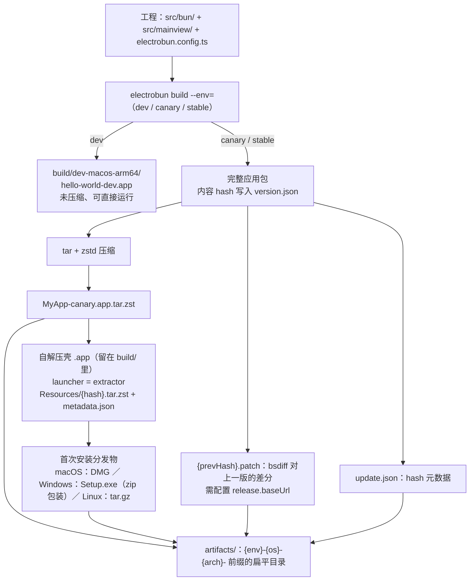

import { Meta } from '@storybook/addon-docs/blocks';

<Meta id="build-basics" title="上手/构建与分发入门" name="Docs" />

# 构建与分发入门

`electrobun dev` 服务于日常迭代，`electrobun build` 把同一份工程变成能交给用户的文件。本课沿构建流水线走一遍：`build/` 里的应用包、`artifacts/` 里的分发文件、自解压 bundle 的结构、体积从哪来、`--env` 通道如何贯穿命名与元数据，以及第一次分发要做的事。构建配置全量、CLI 参数速查、代码签名与自动更新由「构建配置」「CLI 参数」「代码签名」「自动更新」课展开。

| 输入 | 默认值 | 要点 |
| --- | --- | --- |
| `--env` | `dev` | 三档通道 `dev` / `canary` / `stable`，决定产物目录、命名与打包流程（见「env 通道」） |
| `build.buildFolder` | `"build"` | 构建产物根目录，子目录按 `{env}-{os}-{arch}` 命名 |
| `build.artifactFolder` | `"artifacts"` | 分发文件目录，仅 canary / stable 通道生成 |
| `release.baseUrl` | 未设置 | 更新文件的下载根地址；未设置时跳过补丁生成 |
| `release.generatePatch` | `true` | 是否对上一版生成 `.patch` 差分 |
| `build.useAsar` | `false` | 是否把 `app/` 目录打进单个 `app.asar` |
| `build.mac.createDmg` | `true` | macOS 是否额外产出 DMG 安装镜像 |
| `build.mac.codesign` | `false` | canary / stable 是否签名；dev 通道永不签名 |
| `app.name` | — | 产物文件名中去除空格：`My Cool App` → `MyCoolApp` |

## 快速上手

在工作区 `tester/`（hello-world 工程，electrobun 1.18.1）依次执行，看到两类产物即跑通闭环。首次构建会先从 GitHub Releases 下载平台核心二进制，需要网络（见常见问题）：

```bash
bunx electrobun build                        # 默认 dev 通道
ls build/dev-macos-arm64/                    # hello-world-dev.app：未压缩、双击即可运行
bunx electrobun build --env=canary           # 走 release 流水线
ls artifacts/                                # 分发文件：*.dmg、*.app.tar.zst、*-update.json
```

dev 产物就是 `electrobun dev` 每次构建后启动的那个应用包；canary 产物是能直接交给用户的分发文件。两者的差异由下一节展开。

## 产物形态

`electrobun build` 只在当前主机平台与架构上构建（1.18.1 的 CLI 不提供目标平台参数——配置类型里预留的 `build.targets` 字段当前也未被 CLI 读取，跨平台靠各平台 CI 执行同一命令）。产物分两层：`build/` 里的应用包，以及 canary / stable 通道额外生成的 `artifacts/` 分发目录。



### dev 产物

dev 通道只做一步：装配出可直接运行的应用包，写入 `build/dev-macos-arm64/`。以下是 `tester/` 里 `hello-world-dev.app` 的实测构成（macOS ARM64，未压缩共 72MB）：

| 位置 | 大小 | 是什么 |
| --- | --- | --- |
| `Contents/MacOS/bun` | 60 MB | Bun 运行时，原样复制自 electrobun 包内平台二进制 |
| `Contents/Resources/app/bun/index.js` | 8.7 MB | 你的主进程代码 dev 打包（未压缩，含 electrobun 库与其依赖源码） |
| `Contents/MacOS/libNativeWrapper.dylib` | 2.0 MB | objc/c++ 原生绑定层 |
| `Contents/MacOS/zig-zstd` | 665 KB | zstd 压缩 / 解压工具 |
| `Contents/MacOS/bspatch` | 289 KB | bsdiff 补丁应用器，供更新使用 |
| `Contents/MacOS/libasar.dylib` | 147 KB | asar 打包支持库 |
| `Contents/MacOS/launcher` | 131 KB | Zig 启动器，负责拉起 Bun 主进程 |
| `Contents/Resources/main.js` | 6 KB | electrobun 的启动辅助模块 |
| `Contents/Resources/app/views/` | 约 4 KB | 视图产物，由 `build.copy` 装配（见「打包资源与图标」课） |
| `Contents/Resources/version.json`、`build.json` | < 1 KB | 构建元数据 |

两个元数据文件值得回查（`tester/` 实测内容）：

- `version.json`：`{"version":"0.0.1","hash":"dev","channel":"dev",...}`。dev 通道的 `hash` 恒为字符串 `"dev"`——不计算内容哈希，更新器在 dev 下没有意义。
- `build.json`：`{"defaultRenderer":"native","availableRenderers":["native"],"runtime":{},"bunVersion":"1.3.13"}`。记录渲染器可用性与 Bun 版本，供运行时读取。

dev 产物为迭代速度牺牲体积：不压缩、不签名（CLI 强制跳过，日志打印 `skipping codesign`）、不产 `artifacts/`。产物名固定带 `-dev` 后缀，因此可与用户正式安装的应用共存。

### 自解压 bundle

canary / stable 通道在完整应用包之后走一条五步流水线（依据 CLI 源码中的构建注释）：

1. 装配完整应用包，对全部内容计算 wyhash 哈希写入 `version.json`（这一步是后续更新的比对基准）；
2. 可选签名与公证（`codesign` / `notarize` 开启时）；
3. 把应用包打成 tar 再用 zstd 压缩，得到 `MyApp-canary.app.tar.zst`；
4. 另建一个「自解压壳」应用包：launcher 位置放的是专用 `extractor` 二进制，`Resources/` 里放压缩包与 `metadata.json`；
5. 壳再按平台包装成 DMG（macOS）、自解压 `Setup.exe`（Windows）或安装包（Linux），与压缩包、补丁、`update.json` 一起归入 `artifacts/`。

工作区 `vite-tester/`（vanilla-vite 工程）留有一份 canary 实测产物，壳的结构与文档宣称一致：

| 位置（`build/canary-macos-arm64/vanilla-vite-canary.app/`） | 实测 | 说明 |
| --- | --- | --- |
| `Contents/MacOS/launcher` | 181,416 字节 | 与 electrobun 包内 `dist-macos-arm64/extractor` 二进制完全同大小——壳的 launcher 就是解压器 |
| `Contents/Resources/qobvgl0nku17.tar.zst` | 17.7 MB | 压缩包以内容 hash 命名；与 `artifacts/` 里的 `.app.tar.zst` 内容相同（sha256 一致，同一份文件的两处落点） |
| `Contents/Resources/metadata.json` | `{"identifier":...,"name":...,"channel":"canary","hash":"qobvgl0nku17"}` | 壳的元数据 |
| `Contents/Info.plist` | — | 标准 macOS 包描述，可执行文件指向 `launcher` |

这就是「自解压」的含义：用户拿到的是壳，首次启动时由 extractor 解压出完整应用再运行；解压流程官方文档未逐步描述，判断依据是壳的产物结构与 extractor 二进制。完整应用包在打 tar 后即从 `build/` 删除，所以 release 构建后 `build/` 里只剩下壳——完整应用在压缩包里。

### artifacts 目录

canary / stable 构建结束时会清空并重建 `artifacts/`，所有分发文件平铺、统一加 `{env}-{os}-{arch}-` 前缀。`vite-tester/` 的 canary 实测清单：

| 文件 | 大小 | 用途 |
| --- | --- | --- |
| `canary-macos-arm64-vanilla-vite-canary.dmg` | 18.2 MB | 首次安装：内含自解压壳与 `/Applications` 快捷方式 |
| `canary-macos-arm64-vanilla-vite-canary.app.tar.zst` | 17.7 MB | 全量更新与兜底下载 |
| `canary-macos-arm64-update.json` | 75 B | `{"version":"0.0.1","hash":"qobvgl0nku17","platform":"macos","arch":"arm64"}`，更新比对的远端清单 |

补丁文件（`{prevHash}.patch`）在配置了 `release.baseUrl` 且能取到上一版时才会出现。命名规则来自包内 `dist/api/shared/naming.ts`：应用名去空格；dev / canary 通道带 `-canary` 等后缀，stable 通道不带后缀（但平台前缀 `stable-macos-arm64-` 保留）。扁平命名是为了兼容 GitHub Releases 这类没有目录语义的托管——上传后下载 URL 就是 `{baseUrl}/{文件名}`。

## 体积构成

官方目标是「压缩安装包 ~14MB」，实测数据能说清这个数字怎么来。72MB 的 dev 应用包拆开（见「dev 产物」表，来自 `tester/`）：Bun 运行时 60MB 占约八成，是体积地基；其余是原生库与你自己的代码。压缩后（`vite-tester/` 的 canary 产物）：全量包 17.7MB、DMG 18.2MB。两个数字来自不同示例工程但同为 hello-world 规模，压缩前后的差距全部来自 zstd。

zstd 是被显式挑选的压缩器。CLI 源码注释记录了 playground 应用（约 48MB）在 M1 Max 上的对比：brotli 压到 11.1MB 但耗时 1 分 38 秒，zstd 压到 12.1MB 只要 15 秒——每次构建节省约 1 分 15 秒，比多省 1MB 更划算。官方 ~14MB 的口径与 playground 这类基准应用压缩后的量级一致，你的实际体积取决于依赖。

三点体积判断：

- **压缩发生在分发层，不在应用包内。** `build/` 里的 `.app` 永远是未压缩的；小的分发物（`.tar.zst`、DMG）在 `artifacts/` 里。比较体积时看后者。
- **代码默认不 minify。** 1.18.1 的 CLI 未启用压缩 JS（源码中标注为待办）；需要时在 `build.bun` / `build.views` 里传 Bun.build 的 `minify` 等选项（见「构建配置」课）。dev 下主进程打包 8.7MB 偏大，正是未压缩且包含 electrobun 库源码所致。
- **可选部件会显著回升体积。** `bundleCEF`（内嵌 Chromium）与 `bundleWGPU`（WebGPU 支持库）默认关闭，开启后体积明显增加，取舍见「跨平台与兼容性」「WebGPU 与 3D 适配器」课。不捆绑浏览器内核正是 ~14MB 目标的地基。

## env 通道

`--env` 是构建的行为开关，它贯穿三处：`build/` 子目录名、产物文件名、应用内 `version.json` 的 `channel` 字段（后者是更新器识别通道的依据）。

### 三档通道

| 通道 | 进入方式 | 产物名 | `build/` 子目录 | 签名 | `artifacts/` |
| --- | --- | --- | --- | --- | --- |
| `dev`（默认） | `electrobun build` 或 `electrobun dev` | `hello-world-dev.app` | `dev-macos-arm64` | 强制跳过 | 不生成 |
| `canary` | `electrobun build --env=canary` | `MyApp-canary.app` 等 | `canary-macos-arm64` | 按配置 | 生成 |
| `stable` | `electrobun build --env=stable` | `MyApp.app`（无通道后缀） | `stable-macos-arm64` | 按配置 | 生成 |

dev 与 canary / stable 是两条不同的流水线，不只是名字差异：dev 不算哈希（`hash` 恒为 `"dev"`）、不打 tar、不做自解压壳。canary 与 stable 走同一条 release 流水线，差异只在命名与用途——canary 用于预发布验证，stable 用于正式分发。

### 构建钩子环境变量

`electrobun.config.ts` 的 `scripts` 字段可挂四个生命周期钩子，按构建顺序执行：`preBuild`（构建前，做校验与准备）→ `postBuild`（应用包装配完成后、ASAR 打包与签名前，改包内资源）→ `postWrap`（自解压壳创建后、签名前，仅 release 通道）→ `postPackage`（全部产物就绪后，做上传与通知）。

钩子脚本用宿主机的 Bun 运行，并注入一组 `ELECTROBUN_*` 环境变量（官方 Build Configuration 文档与 CLI 源码一致）：

| 变量 | 含义 |
| --- | --- |
| `ELECTROBUN_BUILD_ENV` | 当前通道：`dev` / `canary` / `stable` |
| `ELECTROBUN_OS` / `ELECTROBUN_ARCH` | 目标平台与架构：`macos` / `win` / `linux`，`arm64` / `x64` |
| `ELECTROBUN_BUILD_DIR` / `ELECTROBUN_ARTIFACT_DIR` | 产物目录与分发目录的绝对路径 |
| `ELECTROBUN_APP_NAME` / `ELECTROBUN_APP_VERSION` / `ELECTROBUN_APP_IDENTIFIER` | 应用名（含通道后缀）、版本、标识符 |
| `ELECTROBUN_WRAPPER_BUNDLE_PATH` | 仅 `postWrap`：自解压壳的路径 |

课程目录里的 `print-build-env.ts` 是可直接运行的探针：复制进工程、配置 `scripts.preBuild` 指向它，再跑 `bunx electrobun build`，终端会打印全部变量在当前通道下的取值；换 `--env=canary` 再跑一次，能看到 `ELECTROBUN_BUILD_ENV` 与 `ELECTROBUN_APP_NAME`（如 `hello-world-dev` → `hello-world-canary`）随之切换。

```ts
// electrobun.config.ts（片段）：挂接构建钩子
export default {
  // ...app 与 build 配置
  scripts: {
    preBuild: "scripts/print-build-env.ts",
  },
} satisfies ElectrobunConfig;
```

## 首次分发

Electrobun 的分发模型是纯静态文件托管，不需要更新服务器。最小动作：

1. 在 `electrobun.config.ts` 配置 `release.baseUrl`（如 `"https://your-bucket.example.com/myapp/"`），有它才会生成补丁，更新器也靠它拼下载地址；
2. 运行 `electrobun build --env=stable`（或先发 canary 验证）；
3. 把 `artifacts/` 里的全部文件上传到任意静态托管——官方示例是 S3 / Google Cloud Storage，R2、GitHub Releases 同样可行；下载 URL 就是 `{baseUrl}/{文件名}`。

各文件的分工：新用户拿安装包（DMG / zip / tar.gz），已安装用户由 Updater 按 `update.json` 的 hash 走补丁或全量更新，链路细节见「自动更新」课。补丁只对紧邻的上一版生成，落后多个版本会回退全量包，所以历史补丁要保留。

两件首次分发要知道的事：

- **多平台要各平台构建。** CLI 只构建当前主机平台；macOS、Windows、Linux 的产物分别在对应系统的 CI 上跑同一命令得到，`{env}-{os}-{arch}-` 前缀让它们可以平铺进同一个目录互不冲突。
- **默认不签名。** `codesign` 默认关闭，未签名未公证的 macOS 应用会被 Gatekeeper 拦截，用户需要手动放行；正式分发前按「代码签名」课配置签名与公证。

## 最佳实践

- **发布时上传整个 `artifacts/` 目录，而不是只挑安装包。** `update.json` 与 `.tar.zst` 是自动更新的根，缺了更新链就断；历史补丁也要留存，供落后一个版本以上的用户逐级追赶。
- **本地验证 release 用 canary，且先不配 `baseUrl`。** 没有 baseUrl 时 CLI 自动跳过补丁生成（日志明说 `No baseUrl configured, skipping patch generation`），构建不依赖网络取上一版；正式发版前再补上 baseUrl 并确认上一版产物已在远端。也可用 `release.generatePatch: false` 显式关闭。
- **把三档通道写进 `package.json` scripts。** 官方推荐形态：`"dev": "electrobun dev"`、`"build:canary": "electrobun build --env=canary"`、`"build:stable": "electrobun build --env=stable"`，CI 每平台直接调用同名脚本。
- **只要应用包和更新包时关掉 DMG。** 本地原型验证设 `mac.createDmg: false`，省掉 DMG 生成时间（配置项注释即为此场景设计）。

## 常见问题

- 构建出的 `.app` 有 72MB，不是说安装包 ~14MB 吗？
  两个数字指不同的东西：72MB 是 `build/` 里未压缩的应用包，~14MB 是压缩后分发物（`.tar.zst`、DMG）的官方基准。看 `artifacts/` 里压缩文件的实际大小；hello-world 级别实测约 18MB。
- `artifacts/` 里没有 `.patch` 文件，是构建失败了吗？
  不是。补丁生成需要配置 `release.baseUrl`，且能从远端取到上一版的 `update.json` 与全量包；未配置时日志输出 `No baseUrl configured, skipping patch generation`。首次发布本来也没有上一版可做差分，属预期行为。
- `electrobun.config.ts` 里配了 `codesign`，为什么日志还是 `skipping codesign`？
  当前是 dev 通道。CLI 规定签名只发生在 canary / stable（且 macOS 目标），dev 构建强制跳过；要验证签名流程，用 `--env=canary` 或 `--env=stable` 重跑。签名本身的配置与失败排查见「代码签名」课。
- 首次构建在下载核心二进制时卡住或失败？
  构建前 CLI 会检查 electrobun 包内的平台核心文件（`bun`、`bsdiff`、`launcher`、原生库等），缺失时从 GitHub Releases 下载 `electrobun-core-{platform}-{arch}.tar.gz`。需要网络可达 `github.com`（代理环境下配置标准代理环境变量）；下载成功后后续构建离线可用。

## 总结回顾

摘要：

`electrobun build` 只构建当前主机平台，产物分两层：`build/{env}-{os}-{arch}/` 里的应用包与 canary / stable 通道生成的 `artifacts/` 分发目录。dev 通道一步装配出未压缩、可直接运行的 `.app`（hello-world 实测 72MB，Bun 运行时占约八成），不签名、不算哈希；canary / stable 走五步流水线——完整应用包、tar + zstd 压缩、自解压壳（launcher 换成 extractor，`Resources/` 里放以 hash 命名的压缩包）、平台安装包、补丁与 `update.json`，全部以 `{env}-{os}-{arch}-` 前缀平铺进 `artifacts/`。压缩发生在分发层，实测全量包约 18MB，官方 ~14MB 基准来自 playground 应用；`bundleCEF` 等可选部件会让体积回升。`--env` 通道贯穿目录名、文件名与 `version.json` 的 `channel`，并经 `ELECTROBUN_*` 环境变量注入四个生命周期钩子。首次分发只需静态托管：配置 `release.baseUrl`，上传整个 `artifacts/` 目录；多平台各平台 CI 分别构建，签名默认关闭。

一句话：

> dev 通道交付能跑的 `.app`，canary / stable 通道交付能托管的压缩分发物——同一份工程、两条流水线，靠 `--env` 切换。

知识要点：

- `electrobun build` 产出哪两层目录？dev 与 canary / stable 的流水线差在哪？
- 自解压 bundle 的内部结构是什么？它的 launcher 与普通应用包有何不同？
- `artifacts/` 里有哪些文件，扁平命名规则是什么，为什么这样设计？
- 72MB 的应用包由什么构成？压缩后多大？~14MB 的官方口径指什么？
- `--env` 三档通道分别影响产物名、目录名与 `version.json` 的哪些字段？
- 构建钩子有哪四个？能读到哪些 `ELECTROBUN_*` 环境变量？
- 首次分发的最小动作是什么？为什么多平台要各平台构建？

## 参考资料

- [Bundling & Distribution — 官方打包与分发指南](https://framework.blackboard.sh/electrobun/guides/bundling-and-distribution/)
- [CLI Arguments — 命令与参数、构建环境说明](https://framework.blackboard.sh/electrobun/apis/cli/cli-args/)
- [Build Configuration — 钩子环境变量与构建选项](https://framework.blackboard.sh/electrobun/apis/cli/build-configuration/)
- [Updates — 更新机制与产物分工](https://framework.blackboard.sh/electrobun/guides/updates/)
- [What is Electrobun? — 体积与更新目标口径](https://framework.blackboard.sh/electrobun/guides/what-is-electrobun/)
- [blackboardsh/electrobun — GitHub 仓库（自解压与 bsdiff 特性）](https://github.com/blackboardsh/electrobun)
