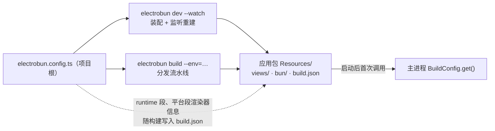

import { Canvas, Controls, Meta } from '@storybook/addon-docs/blocks';
import * as BuildConfigStories from './build-config.stories';

<Meta of={BuildConfigStories} name="Docs" />

# 构建配置

`electrobun.config.ts` 是工程里唯一的装配与分发配置：`dev` 装配视图与主进程、`build` 走分发流水线、应用运行时读取其中的运行时段，都由这一个文件驱动。认识它要抓住两个名字的分工——**写侧类型 `ElectrobunConfig`**（配置文件默认导出的对象用它校验，从 `electrobun` 包导入）与**读侧 API `BuildConfig`**（主进程运行时读构建期生成的 `build.json`）。本课把配置的每个键过一遍：views 构建、copy 装配、watch 监听、平台段部件，以及 runtime / scripts / release / app 段的职责与去向；记不清某个键时，跳转到类型定义看注释就是最快的回查方式。



回查先看这组核心默认值（均与 1.18.1 包内类型定义核对过）：

| 键 | 默认值 | 回查要点 |
| --- | --- | --- |
| `build.bun.entrypoint` | `"src/bun/index.ts"` | 沿用默认目录结构时可省略整段 `build.bun` |
| `build.views.<视图名>.entrypoint` | 必填，无默认 | 键即视图名，进入 `views://` 路径第一段；整段也可省略（外部构建模式） |
| `build.copy` | 未设置 | 源 → 目标映射；目标以 `views/` 开头才有 `views://` 地址 |
| `build.buildFolder` / `build.artifactFolder` | `"build"` / `"artifacts"` | 应用包与分发文件的根目录 |
| `build.watch` / `build.watchIgnore` | 未设置 | 额外监听路径 / 排除 glob；`build/`、`artifacts/`、`node_modules/` 永远自动忽略 |
| `build.useAsar` | `false` | 开启后 `app/` 打进单个 `app.asar` |
| `build.asarUnpack` | `["*.node", "*.dll", "*.dylib", "*.so"]` | 不进 asar 的原生文件，解包到 `app.asar.unpacked` |
| `build.locales` | `"*"` | ICU 语言数据裁剪；仅 Linux / Windows 生效 |
| 平台段 `mac` / `win` / `linux` | `bundleCEF`、`bundleWGPU` 均 `false`，`defaultRenderer` 为 `'native'` | mac 另有 `createDmg: true`、`codesign` / `notarize: false`、`icons: "icon.iconset"` |
| `runtime.exitOnLastWindowClosed` | `true` | 托盘常驻应用设 `false` |
| `release.generatePatch` | `true` | 是否对上一版生成 `.patch` 差分 |
| `build.targets` | 未设置 | 类型里预留的跨平台目标；1.18.1 CLI 未读取（见常见问题） |

## 快速上手

在 `tester/`（或[第一个窗口](?path=/docs/first-window--docs)的 hello-world 工程）的 `electrobun.config.ts` 上做两个最小实验，跑通「改配置 → 看到行为变化」的闭环。

**实验一：类型即文档（不需要运行）。** 在 `mac` 段里加一行拼写错误的 `bundleCef: false`，编辑器立刻报类型错误——`bundleCEF` 才是合法键。`satisfies ElectrobunConfig` 让所有键名和取值在保存前就被拦下；按住定义跳转（`ElectrobunConfig.ts`）还能看到每个键的官方注释与默认值。确认后删掉这行。

**实验二：配置驱动输出位置。** 在 `build` 段加 `buildFolder: "out"`：

```ts
build: {
  buildFolder: "out", // 默认 "build"
  // ...其余保持原样
}
```

运行 `bun start`，可观察结果：终端先打印 `Using config file: electrobun.config.ts`，随后产物出现在 `out/dev-macos-arm64/` 而不是 `build/`。看完改回 `"build"` 或删除该键，后续课程按默认路径讲述。

## 配置文件与消费链

配置文件固定为项目根的 `electrobun.config.ts`，CLI 没有提供自定义路径的参数（1.18.1 文档与 CLI 页均无此能力）。它是真正的 TS 模块：可以读 `package.json`、用 `process.env` 动态构造字段——官方示例就把 `version` 从 `package.json` 读入，避免两处维护。形态上默认导出一个对象，用 `satisfies ElectrobunConfig` 收尾（类型从 `electrobun` 导入；`satisfies` 保留字面量类型推断，比 `as` 更适合配置）。

五个段落的职责与消费者：

| 段 | 职责 | 主要消费者 |
| --- | --- | --- |
| `app` | 应用元信息与系统集成声明 | 包描述、`version.json`、产物命名 |
| `build` | 装配（bun / views / copy）、输出、平台部件、监听 | dev 装配与 build 流水线 |
| `runtime` | 运行时行为与自定义键 | 构建期写入 `build.json`，运行时被 `BuildConfig` 读取 |
| `scripts` | 四个生命周期钩子 | dev 每轮重建与 build 流水线 |
| `release` | 分发地址与差分开关 | build 的 canary / stable 通道 |

类型里还有 `bunny` 与 `build.carrot` 两段，属于 Blackboard 宿主产品的 Carrot 分发形态，不是通用框架能力，本手册不展开。配置由 `dev` 与 `build` 两条命令消费，命令行参数本身（`--watch`、`--env` 等）见[CLI 参数](?path=/docs/cli--docs)。

### BuildConfig 运行时读取

`BuildConfig` 从 `electrobun/bun` 导入，只在主进程可用，回答「构建时定下的配置，运行中怎么拿」：

```ts
import { BuildConfig } from "electrobun/bun";

const config = await BuildConfig.get(); // 首次读应用包 ../Resources/build.json，之后返回缓存
const cached = BuildConfig.getCached(); // 同步取缓存；没调用过 get() 时为 null
```

返回的 `BuildConfigType` 字段（与官方 BuildConfig API 页及类型定义一致）：

| 字段 | 含义 |
| --- | --- |
| `defaultRenderer` | 平台段 `defaultRenderer` 的落点；窗口 / 视图未显式指定 renderer 时用它 |
| `availableRenderers` | 恒含 `"native"`；仅当构建时 `bundleCEF` 开启才含 `"cef"` |
| `cefVersion` | 仅捆绑 CEF 时出现 |
| `bunVersion` | 构建使用的 Bun 运行时版本 |
| `runtime` | 配置 `runtime` 段整体，含自定义键 |

`build.json` 在 dev 产物里同样存在。`tester/` 实测（三平台 `bundleCEF` 全 false）：

```json
{"defaultRenderer":"native","availableRenderers":["native"],"runtime":{},"bunVersion":"1.3.13"}
```

`get()` 读不到文件时返回兜底值 `{ defaultRenderer: "native", availableRenderers: ["native"] }`（类型注释标注用于 dev 兜底）。`BuildConfig` 不从 `electrobun/view` 导出——视图侧需要配置值时，在主进程读取后经 RPC 传过去（见[自定义 RPC](?path=/docs/rpc--docs)）。

### runtime 段

`runtime` 是「写给运行时」的段：构建时整段快照进 `build.json`，主进程用 `BuildConfig.get().runtime` 读取。

- `exitOnLastWindowClosed` 默认 `true`：最后一个窗口关闭即退出应用；托盘常驻形态设 `false`（见[系统托盘](?path=/docs/tray--docs)、[应用生命周期](?path=/docs/app-lifecycle--docs)）。
- 其余键随意自定义，原样透传：

```ts
runtime: {
  exitOnLastWindowClosed: true,
  featureFlags: { betaUi: true }, // 自定义键：构建时进入 build.json
},
```

```ts
// 主进程读取自定义键
const flags = (await BuildConfig.get()).runtime?.featureFlags;
```

## build 段

`build` 是本课主体，键按职责分四组：**装配**（`bun`、`views`、`copy`，决定什么东西进应用包）、**输出**（`buildFolder`、`artifactFolder`、`targets`、`useAsar`、`asarUnpack`）、**部件与体积**（`cefVersion`、`wgpuVersion`、`bunVersion`、`locales` 与平台段）、**监听**（`watch`、`watchIgnore`，只影响 `dev --watch`）。输出组里除 `targets` 外的键默认值见开场参考表：`useAsar` 开启后整个 `app/` 目录打进单个 `app.asar`，`asarUnpack` 的 glob 让原生模块等需要以普通文件存在的资源解包到 `app.asar.unpacked`；`targets` 虽在类型里定义为 `"current"` / `"all"` 或逗号分隔的目标列表，但 1.18.1 的 CLI 并不读取它（见常见问题）。

### bun 与 views 构建

`bun` 与 `views` 两段同构：`{ entrypoint }` 加上透传给 `Bun.build` 的选项。Electrobun 固定控制 `entrypoints`、`outdir`、`target` 三项，其余选项原样直通——官方文档列出的透传键有 `plugins`、`external`、`sourcemap`、`minify`、`splitting`、`define`、`loader`、`format`、`naming`、`banner`、`drop`、`env`、`jsx`、`packages`，语义以 [Bun Bundler 文档](https://bun.sh/docs/bundler)为准（Bun 本身是相邻主题，这里只讲集成点）。

- `bun.entrypoint` 默认 `"src/bun/index.ts"`，沿用默认目录时整段 `build.bun` 可省略。
- `views` 的每个键是一个视图：键名即视图名，决定产物 `views/<视图名>/index.js` 与 `views://<视图名>/…` 地址的第一段；`entrypoint` 必填、没有默认值。窗口 `url` 与页面内引用必须与键名一致，判断链见[第一个窗口](?path=/docs/first-window--docs)。
- 整段 `views` 也可以省略：`vite-tester/` 的配置就没有 views 段——TS 全部交给 Vite 打进 `dist/`，Electrobun 只负责 `copy` 装配。是否需要 Electrobun 转译视图代码，取决于工程形态（双进程工作流见[Vite 集成与 HMR](?path=/docs/vite-hmr--docs)）。

```ts
build: {
  bun: {
    // entrypoint 沿用默认 src/bun/index.ts
    minify: true,      // 压缩主进程产物；1.18.1 CLI 默认不压缩
    drop: ["console"], // 移除 console.* 调用
  },
  views: {
    mainview: {
      entrypoint: "src/mainview/index.ts",
      define: { __APP_VERSION__: JSON.stringify("0.1.0") }, // 编译期常量注入
    },
    settings: { entrypoint: "src/settings/index.ts" }, // 多视图：多一个键即可
  },
},
```

观察方式（需 macOS + Bun 的真实工程）：配 `minify` 前后各跑一次 `bun start`，对比 `build/dev-macos-arm64/<应用名>-dev.app/Contents/Resources/app/bun/index.js` 的大小——默认未压缩时 hello-world 的这份产物约 8.7MB（[构建与分发入门](?path=/docs/build-basics--docs)实测）。

### copy 装配

`copy` 是「源路径 → 目标路径」的映射，把不参与打包的文件原样复制进应用包：

- 键和值都相对项目根；**文件和目录都可以**——`tester/` 复制的是单个 html / css 文件，`vite-tester/` 直接映射整个目录：

```ts
// vite-tester/electrobun.config.ts：Vite 产物整体装配进 views/
copy: {
  "dist/index.html": "views/mainview/index.html",
  "dist/assets": "views/mainview/assets",
},
```

- 目标路径决定文件在应用包内的位置；要被窗口以 `views://` 访问，目标必须落在 `views/` 下（机制见[第一个窗口](?path=/docs/first-window--docs)，图片、字体等打包资源的组织见[打包资源与图标](?path=/docs/bundled-assets--docs)）。
- `copy` 的源会自动进入 `dev --watch` 的监听范围——外部构建产物（如 Vite 的 `dist/`）因此需要配 `watchIgnore`，见下一节。

### watch 与 watchIgnore

这两个键只影响 `electrobun dev --watch` 的监听判断，`electrobun build` 是一次性构建、无监听概念：

- **监听范围从配置推导**：`build.bun.entrypoint` 所在目录、各 views entrypoint 所在目录、`build.copy` 的源路径，加上 `build.watch` 显式声明的额外路径，递归监听（推导表见[初始化项目](?path=/docs/init--docs)）。
- `watch`：字符串数组，补上「影响构建但不在推导集里」的路径——最典型的是被主进程和视图共享的 `src/shared/` 这类目录。
- `watchIgnore`：glob 数组，按项目相对路径匹配，命中的变更不触发重建；`build/`、`artifacts/`、`node_modules/` 三个目录永远自动忽略，不用写。目录要递归排除时用 `dist/**` 写法（官方模板即如此）。

下面的示意在浏览器里复现「保存一个文件 → 三道闸门 → 触发重建 / 忽略 / 无反应」的判定链；两个预设对应 `tester/` 与 `vite-tester/` 的真实配置形态。真实监听行为以工程里 `dev --watch` 的日志为准。

<Canvas of={BuildConfigStories.WatchVerdict} />
<Controls of={BuildConfigStories.WatchVerdict} />

| 读者操作 | 可观察证据 |
| --- | --- |
| 默认状态（vanilla-vite + `dist/assets/index-*.js` + 模板 watchIgnore） | watchIgnore 闸门命中：Vite 重建不会触发 Electrobun 重建重启 |
| 关闭「模板 watchIgnore」，文件不变 | 落入监听目录 `dist`（copy 源）：每次 Vite 构建都会触发整轮重建重启——模板配 `dist/**` 正是为避免这个 |
| 切到 hello-world 工程，文件改成 `src/shared/util.ts` | 不在任何监听目录：保存无反应 |
| 在「build.watch 追加」填 `src/shared`，再看同一文件 | 监听目录闸门命中：保存触发重建 |
| hello-world 工程下文件改成 `src/mainview/index.html` | 命中 copy 源所在目录：保存触发重建 |
| 文件改成 `build/dev-macos-arm64/xxx` | 第一道闸门命中：固定忽略目录永不触发 |
| 打开 Show code | 看到该 Canvas 实际执行的 `watch-verdict.ts` |

判定链按官方 CLI 文档的监听规则实现；glob 匹配是通用语义示意（支持 `**` 与 `*`），与 CLI 实际实现的边界差异以真实 `--watch` 日志为准。

### 平台段

`mac`、`win`、`linux` 三段同构，成员及其默认值：

| 成员 | 默认 | 要点 |
| --- | --- | --- |
| `bundleCEF` | `false` | 捆绑 CEF（约 +100MB 量级）。不捆绑时各平台用系统 webview：mac 是 WKWebView、win 是 WebView2、linux 是 GTKWebKit；linux 的类型注释推荐为高级层合成开启。取舍见[跨平台与兼容性](?path=/docs/cross-platform--docs) |
| `bundleWGPU` | `false` | 捆绑 Dawn（WebGPU 部件），用途见[WebGPU 与 3D 适配器](?path=/docs/webgpu--docs) |
| `defaultRenderer` | `'native'` | 窗口 / 视图未显式指定 renderer 时用的默认后端；可按窗口覆盖（见跨平台课） |
| `chromiumFlags` | 未设置 | 传给 CEF 的命令行参数，见下方说明与示例 |

`chromiumFlags` 是 `Record<string, string | boolean>`：键为去掉 `--` 前缀的 flag 名，`true` 表示只有开关、字符串表示带值、`false` 表示移除 Electrobun 默认设置的某个 flag。它随构建写入 `Resources/build.json`，在 Electrobun 内置 flag 之后应用（后写胜出），只在 CEF 渲染路径上被消费：

```ts
mac: {
  bundleCEF: true,
  chromiumFlags: {
    "disable-gpu": false,             // 移除 Electrobun 默认加的 --disable-gpu
    "remote-debugging-port": "9333",  // --remote-debugging-port=9333
  },
},
```

mac 段特有的成员：

| 成员 | 默认 | 要点 |
| --- | --- | --- |
| `codesign` | `false` | 签名，仅 canary / stable 通道生效；见[代码签名](?path=/docs/code-signing--docs) |
| `notarize` | `false` | 公证，需要 `codesign` 先开启 |
| `createDmg` | `true` | 是否产出 DMG；本地原型验证可关闭省时间（见[构建与分发入门](?path=/docs/build-basics--docs)） |
| `entitlements` | 未设置 | 签名权限声明，见代码签名课 |
| `icons` | `"icon.iconset"` | `.iconset` 目录或 Icon Composer 的 `.icon` 文件；见[打包资源与图标](?path=/docs/bundled-assets--docs) |

win 与 linux 段还各有 `icon`（win 用含多尺寸的 `.ico`，linux 用 ≥256×256 的 `.png`），同样见打包资源与图标课。平台段默认全关是「压缩安装包 ~14MB」体积目标的地基（见构建与分发入门课）。

### 版本覆盖与 locales

四个键默认都不设置——使用 electrobun 发行版内置的版本与全量语言数据：

| 键 | 默认 | 要点 |
| --- | --- | --- |
| `cefVersion` | 内置 CEF 版本 | 格式如 `"144.0.11+ge135be2+chromium-144.0.7559.97"`；覆盖前先查 electrobun-cef-compat 兼容矩阵，未测试的组合可能运行异常 |
| `wgpuVersion` | 最新 electrobun-dawn release | semver 或 tag，如 `"0.2.3"` / `"v0.2.3-beta.0"`；场景见 WebGPU 课 |
| `bunVersion` | 内置 Bun 版本 | 从 GitHub Releases 下载指定版本，缓存在 `node_modules/.electrobun-cache/bun-override/`；删除该键即恢复内置版本 |
| `locales` | `"*"` | 子集如 `["en", "zh"]` 裁剪 ICU 数据、减小体积；仅 Linux / Windows 生效，macOS 用系统 ICU |

## scripts 与 release 段

`scripts` 挂四个构建钩子，都是用宿主机的 Bun（不是打包进应用的 Bun）执行的脚本文件：

| 钩子 | 时机 |
| --- | --- |
| `preBuild` | 构建开始前：校验与准备 |
| `postBuild` | 应用包装配完成后、ASAR 打包与签名前：改包内资源 |
| `postWrap` | 自解压壳创建后、签名前，仅 canary / stable 通道 |
| `postPackage` | 全部产物就绪后：上传与通知 |

每个钩子都注入一组 `ELECTROBUN_*` 环境变量；变量清单、执行细节与可直接运行的探针脚本 `print-build-env.ts` 见[构建与分发入门](?path=/docs/build-basics--docs)。`dev --watch` 的每轮重建同样会执行 `preBuild` / `postBuild`（见初始化项目课）。

`release` 段服务自动更新与差分：`baseUrl` 是分发文件的静态托管根地址（未设置时 CLI 跳过补丁生成），`generatePatch` 默认 `true` 控制是否对上一版生成 `.patch`。两键的完整行为与首次分发动作见构建与分发入门课、[自动更新](?path=/docs/updater--docs)。

## app 段

`app` 是必填段：`name`（应用显示名，构建时去空格进产物文件名）、`identifier`（平台唯一标识，反向域名式）、`version`（写进 `version.json`），可选 `description`。最小用法见[第一个窗口](?path=/docs/first-window--docs)；两个较新的可选键承担系统级集成：

```ts
app: {
  name: "my-app",
  identifier: "dev.learn.myapp",
  version: "0.1.0",
  urlSchemes: ["myapp", "myapp-dev"],  // 深链：myapp://some/path
  fileAssociations: [
    {
      ext: ["dotlock", "json"],   // 扩展名不带前导点
      name: "DotLock Document",
      role: "Viewer",             // 默认值，可省
      icon: "assets/dotlock.icns", // 构建时自动复制进 Resources
    },
  ],
},
```

- `urlSchemes` 注册自定义 URL 协议；`fileAssociations` 注册文件类型关联（生成 macOS 的 `CFBundleDocumentTypes`）。两者目前都只在 macOS 完整支持，且应用需位于 `/Applications` 注册才可靠。
- 深链与被打开的文件都以 `open-url` 事件到达主进程（文件是 `file://` 地址），处理方式见[应用生命周期](?path=/docs/app-lifecycle--docs)。

## 最佳实践

- **永远用 `satisfies ElectrobunConfig` 收尾。** 拼写错误与非法取值在编辑器即暴露；跳转到类型定义看注释，比翻文档站更快拿到默认值与限制。
- **外部构建产物进 `copy` 时，同时配 `watchIgnore`。** 否则 Vite 这类外部工具每次构建都会触发 Electrobun 整轮重建重启，两边互相打断；vanilla-vite 模板的 `copy` + `watchIgnore: ["dist/**"]` 就是这个组合。
- **共享代码目录用 `build.watch` 显式声明**，而不是挪动入口去迁就监听推导；同时确认没有哪个 `watchIgnore` glob 把它误伤。
- **平台段默认保持全关。** 确需一致渲染（跨平台同一 Chromium、linux 高级合成）再开 `bundleCEF`，并接受约 +100MB 的体积；仅个别窗口需要时优先考虑按窗口指定 renderer 而不是全局切换。

## 常见问题

- `build.targets` 配了目标平台，构建却只出当前平台的产物？
  1.18.1 的 CLI 不读取该字段（构建与分发入门课的实测结论，官方 CLI 页也写明「构建始终面向当前主机平台」）。类型里保留它代表规划中的能力；跨平台分发靠在各自系统的 CI 上跑同一条构建命令。
- `runtime` 里的自定义键，在视图代码里读不到？
  `BuildConfig` 只从 `electrobun/bun`（主进程）导出，`electrobun/view` 没有这个 API。视图侧需要配置值时，在主进程读取后经 RPC 传给视图。
- `chromiumFlags` 配了却没有效果？
  它是传给 CEF 的初始化参数，只在 CEF 渲染路径上被消费；`defaultRenderer` 为默认的 `'native'` 或未捆绑 CEF 时用不到。需要 CEF 行为先开 `bundleCEF`（体积代价见跨平台课）。
- 覆盖 `cefVersion` 后应用渲染行为异常？
  类型注释明确警告：未经 electrobun-cef-compat 兼容矩阵测试的组合可能出问题。覆盖前先查矩阵；回退只需删除该键，恢复 electrobun 发行版内置版本。

## 总结回顾

摘要：

`electrobun.config.ts` 固定在项目根、默认导出 + `satisfies ElectrobunConfig`，是真正的 TS 模块。五个段落里，`build` 是主体：`bun` / `views` 以 entrypoint 加透传 Bun.build 选项完成打包（键即视图名，整段可省略交给外部工具），`copy` 把文件与目录按源 → 目标装配进应用包（目标须在 `views/` 下才有 `views://` 地址），`watch` / `watchIgnore` 只作用于 `dev --watch` 的监听判断（固定忽略三目录、glob 按项目相对路径匹配），平台段 `mac` / `win` / `linux` 同构地控制 `bundleCEF`、`bundleWGPU`、`defaultRenderer` 与 `chromiumFlags`，另有 mac 特有的签名、DMG、entitlements、icons。`runtime` 段构建时快照进 `build.json`，主进程用 `BuildConfig.get()` / `getCached()` 读取（含自定义键；`availableRenderers` 恒含 native，捆绑 CEF 才含 cef）。`scripts` 四钩子与 `release` 的 baseUrl / generatePatch 服务构建流水线与自动更新，`app` 段的 `urlSchemes` / `fileAssociations` 承担 macOS 深链与文件关联。

一句话：

> 一份 electrobun.config.ts 同时告诉 CLI 装配什么（views / copy）、监听什么（watch / watchIgnore）、带什么部件（平台段），并把 runtime 段快照进 build.json 交给主进程的 BuildConfig 读取——键名写错与否，`satisfies ElectrobunConfig` 在编辑器里就给出答案。

知识要点：

- `ElectrobunConfig` 与 `BuildConfig` 各自是哪一侧？`build.json` 是什么时候、由谁生成的？
- `build.views` 的键名决定哪三处必须一致？什么情况下整段 `views` 可以省略？
- `copy` 的键和值各是什么？文件与目录都能映射吗？目标不在 `views/` 下会怎样？
- `dev --watch` 的监听目录从哪些配置推导？`watchIgnore` 匹配什么路径、哪些目录永远自动忽略？
- 平台段四个共同成员的默认值是什么？`chromiumFlags` 的三种取值形式各是什么含义？
- `runtime` 自定义键怎么写、主进程怎么读？`availableRenderers` 什么时候包含 `"cef"`？
- `build.targets` 在 1.18.1 里配了为什么没用？

## 参考资料

- [Build Configuration — 官方构建配置文档](https://framework.blackboard.sh/electrobun/apis/cli/build-configuration/)
- [BuildConfig API — 官方运行时读取文档](https://framework.blackboard.sh/electrobun/apis/build-config/)
- [CLI Arguments — dev / build 命令与 watch 监听规则](https://framework.blackboard.sh/electrobun/apis/cli/cli-args/)
- [Bun Bundler — 透传给 build.bun / build.views 的选项语义](https://bun.sh/docs/bundler)
- electrobun 1.18.1 包内类型定义（`dist/api/bun/ElectrobunConfig.ts`、`dist/api/bun/core/BuildConfig.ts`）：键、默认值与注释的最终依据。
