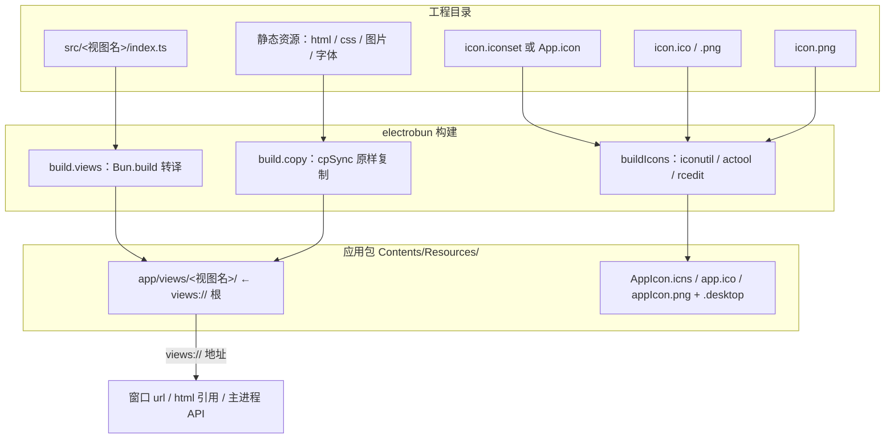
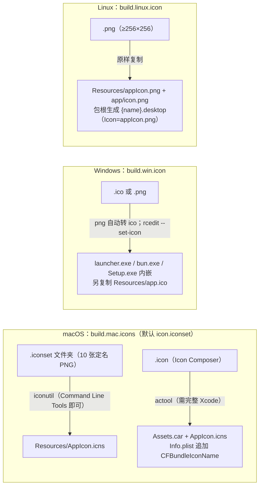

import { Canvas, Controls, Meta } from '@storybook/addon-docs/blocks';
import * as BundledAssets from './bundled-assets.stories';

<Meta of={BundledAssets} name="Docs" />

# 打包资源与图标

窗口里能加载的本地文件和系统各处显示的应用图标，都不会因为放在 `src/` 里就自动生效：前者要先装配进应用包的 `views/` 命名空间、经 `views://` 寻址（基础加载见[第一个窗口](?path=/docs/first-window--docs)），后者要走各平台段的图标配置、由构建期工具加工成平台要的形态。本课把两件事讲透：一条 copy 映射把文件放进包内哪里、得到什么地址、谁来访问；一张图在 macOS / Windows / Linux 分别经历什么构建步骤、落到包内哪个位置。读完能预测：改一行 copy 目标后地址怎么变，配好图标后产物里该检查哪个文件。



回查先看这组关键输入（默认值均与 1.18.1 包内类型定义及 CLI 源码核对过）：

| 关键输入 | 默认值 | 回查要点 |
| --- | --- | --- |
| `build.copy` | 未设置 | 源 → 目标映射；目标以 `views/` 开头才有 `views://` 地址；源可以是目录，整棵复制 |
| `build.views.<视图名>` | 未设置 | TS 入口转译进 `views/<视图名>/`，产物名跟随入口文件名 |
| `views://` 根 | `Resources/app/views` | dev 与 release 同一个根；dev 在 `build/dev-<os>-<arch>/<name>-dev.app` 内 |
| `build.mac.icons` | `"icon.iconset"` | 目录不存在时**静默跳过**，应用保持系统默认图标 |
| `build.win.icon` | 未设置 | `.ico`（建议 16/32/48/256 多尺寸）或 `.png`（构建时自动转 ico） |
| `build.linux.icon` | 未设置 | PNG，至少 256×256 |
| `build.useAsar` | `false` | 开启后 `app/` 整体打成 `app.asar`，`views://` 地址不变 |
| `build.asarUnpack` | `["*.node", "*.dll", "*.dylib", "*.so"]` | 匹配的文件留在 `app.asar.unpacked/`，按普通文件访问 |
| `build.watch` | 未设置 | 追加 `dev --watch` 监听目录；copy 源所在目录默认已在监听集合里 |

## 快速上手

在[第一个窗口](?path=/docs/first-window--docs)的 hello-world 工程根目录（或任何跑得起来的工程根目录）里加一个图片资产并引用它。三步：

```bash
# 1. 放一张图片（任意 PNG 即可）
mkdir -p src/mainview/assets
cp ~/Downloads/logo.png src/mainview/assets/
```

```ts
// 2. electrobun.config.ts 的 build.copy 加一行目录映射
copy: {
	"src/mainview/index.html": "views/mainview/index.html",
	"src/mainview/assets": "views/mainview/assets", // 整目录一行装下
},
```

```html
<!-- 3. src/mainview/index.html 里引用 -->

```

```bash
bun start # 即 electrobun dev
```

预期结果，逐条可核对：

- 窗口里图片显示出来；
- 构建输出存在 `build/dev-macos-arm64/hello-world-dev.app/Contents/Resources/app/views/mainview/assets/logo.png`（平台与架构随环境变化）——包内落点与 `views://` 地址逐段对应。

## views:// 的落点与解析

`views://` 是 Electrobun 注册的本地内容协议，官方建议把它当 `https://` 用：窗口 `url`、页面里的 `script` / `link` / `img`、CSS 的 `url(...)` 都能写。它指向应用包内固定的资源根 `Contents/Resources/app/views/`——dev 与 release 是同一个根，dev 产物就在构建输出 `build/dev-<os>-<arch>/<name>-dev.app` 里。落点是包内公开常量（`dist/api/bun/core/Paths.ts`）：

```ts
import { PATHS } from "electrobun/bun";

PATHS.RESOURCES_FOLDER; // resolve("../Resources/")
PATHS.VIEWS_FOLDER; // .../Resources/app/views —— views:// 的根
```

框架内部对 `views://` 的解析就是把前缀替换成这个根再拼接。Tray 图标路径的实现原文（`dist/api/bun/core/Tray.ts`）：

```ts
resolveImagePath(imgPath: string) {
	if (imgPath.startsWith("views://")) {
		return join(VIEWS_FOLDER, imgPath.replace("views://", ""));
	}
	return imgPath; // 其余按文件路径原样处理
}
```

两个直接推论：

- `views://` 只能访问**落进 `views/` 目录**的文件。`copy` 目标写在 `views/` 外的文件同样进包，但没有视图层地址（见下一节）。
- 主进程里遇到接受文件路径的 API，先试 `views://`——做了前缀替换的直接可用（Tray 如上）；不做的用 `PATHS.VIEWS_FOLDER` 自己拼。

`PATHS` 常量的完整说明见[路径与工具](?path=/docs/paths-and-utils--docs)；构建产物的完整形态见[构建与分发入门](?path=/docs/build-basics--docs)。

## 装配打包资源

文件进入包内有两条通道，产物在 `Resources/app/` 下合流；第三小节讲 `useAsar` 开启后这些文件的物理形态。

### build.copy 复制

`copy` 是「源路径 → 目标路径」映射，构建时原样复制——不转译、不 hash、不改文件名：

```ts
copy: {
	// 单文件：一张一张映射
	"src/mainview/index.html": "views/mainview/index.html",
	// 目录：一行装下一整棵子树
	"src/mainview/assets": "views/mainview/assets",
},
```

规则（对照 1.18.1 CLI 源码的 copy 循环）：

- 源与目标都相对工程根；目标是 `Resources/app/` 之后的路径；
- 源是目录时递归整棵复制（`cpSync` recursive）——资源多了就升级成目录映射，清单不再逐文件膨胀；
- 源不存在时终端打印 `failed to copy ... because it doesn't exist.`，**构建继续**——路径打错不阻断构建，只能靠这条终端错误发现（见常见问题）；
- 目标以 `views/` 开头才有 `views://` 地址。目标写在 `views/` 外（如 `"data/seed.json"`）文件同样进包，但只有主进程经文件系统能读——正好用来放视图层不该触碰的只读数据。

工作区 `vite-tester/` 的真实配置是目录映射的标准用法（Vite 产物整体装配）：

```ts
copy: {
	"dist/index.html": "views/mainview/index.html",
	"dist/assets": "views/mainview/assets",
},
watchIgnore: ["dist/**"], // dist 由 Vite 负责重建，不让 electrobun --watch 重复触发
```

Vite 双进程工作流本身见[Vite 集成与 HMR](?path=/docs/vite-hmr--docs)。下面的示意在浏览器里复现「一条 copy 映射 → 包内落点 → 地址与可达性」的判定链；真实装配结果以构建输出目录为准。

<Canvas of={BundledAssets.AssetDestinationMap} />
<Controls of={BundledAssets.AssetDestinationMap} />

| 读者操作 | 可观察证据 |
| --- | --- |
| 把「映射目标」改成 `assets/data.json`（去掉 `views/` 前缀） | 包内落点变为 `Resources/app/assets/data.json`；「views:// 地址」读数变为「无（目标不在 views/ 下）」，结论卡提示仅主进程可达 |
| 恢复 `views/mainview/assets` | 地址恢复为 `views://mainview/assets/`，视图层可加载 |
| 关闭「源是目录」 | 复制注记变为单文件；「--watch 监听目录」读数从 `src/assets` 变为 `src` |
| 打开 Show code | 看到该 Canvas 实际执行的 `asset-destination-map.ts` |

copy 源目录同时影响 `dev --watch` 的监听集合：源是目录监听目录自身，是文件监听所在目录（CLI 的 watchDirs 推导）；额外目录用 `build.watch` 追加，排除用 `watchIgnore`。监听判定的全貌见[构建配置](?path=/docs/build-config--docs)。

### build.views 转译

`build.views.<视图名>.entrypoint` 指向的 TS 由 Bun.build 转译（target browser），产物固定落在 `views/<视图名>/`，文件名跟随入口（`index.ts` → `index.js`）。它和 copy 装配的静态文件合流在同一目录——hello-world 工程构建输出的实测：

```text
Resources/app/views/mainview/
├── index.html   ← build.copy 复制
├── index.css    ← build.copy 复制
└── index.js     ← build.views 转译产物
```

视图名（`build.views` 的键）任意、可以配多个，它就是 `views://` 地址的第一段。入口与转译的基础用法见[第一个窗口](?path=/docs/first-window--docs)；透传给 Bun.build 的选项（`minify`、`sourcemap`、`plugins` 等）与配置全量见[构建配置](?path=/docs/build-config--docs)。

### asar 归档

`build.useAsar`（默认 `false`）开启后，构建把整个 `Resources/app/`——bun、views、copy 目标全在其中——打成单个 `app.asar` 并删除 `app/` 目录；`build.asarUnpack`（默认 `["*.node", "*.dll", "*.dylib", "*.so"]`）匹配的文件留在 `app.asar.unpacked/`，供原生库与外部进程按普通文件路径访问。对资源使用的影响只有一个：**`views://` 地址与引用写法完全不变**——归档改变物理存储，不改变命名空间。官方列出的收益：更快的 I/O、把代码抽取到带自动清理的随机临时目录的安全性、以及分发完整性。配置字段本身见[构建配置](?path=/docs/build-config--docs)。

## 引用打包资源

引用位置决定写法。共同模型：页面自身已位于 `views://` 命名空间内，所以相对路径与绝对路径都解析到包内文件。

### 视图层引用

| 位置 | 写法 | 说明 |
| --- | --- | --- |
| 窗口 / 视图初始加载 | `url: "views://mainview/index.html"` | `BrowserWindow` / `BrowserView` 构造参数 |
| 运行时换地址 | `win.webview.loadURL("views://…")` | 换页面不换窗口 |
| HTML 内引用 | `<script src="views://mainview/index.js">`、`<link href="views://mainview/index.css">`、`` | 文档口径：任何常规 URL 位置都能用 `views://` |
| CSS 内引用 | `background: url(views://mainview/bg.png)` | 文档示例明确覆盖内联 CSS 的 `url()` |
| 相对路径 | `<link rel="stylesheet" href="index.css">` | 页面已在 `views://` 下，相对路径在同一命名空间内解析；官方 hello-world 模板即用相对 css |

### 主进程读取

- 接受 `views://` 的 API 直接写：`new Tray({ image: "views://tray-assets/icon.png" })`（前缀替换见上文 `resolveImagePath`）；
- 通用读取用 `PATHS` 拼：`Bun.file(join(PATHS.VIEWS_FOLDER, "mainview/assets/data.json"))`；
- `copy` 目标在 `views/` 外的文件从 `Resources` 起拼：`join(PATHS.RESOURCES_FOLDER, "app/data/seed.json")`。

主进程读打包资源是普通只读文件操作；用户可写数据不要放包里，走 `Utils.paths` 的 OS 目录（见[路径与工具](?path=/docs/paths-and-utils--docs)）。

## 应用图标

图标不属于 `views://` 资源：它由各平台段的图标配置驱动，构建期经平台工具加工后落进应用包的约定位置。三个平台字段不同、管线不同，共同判断是：**配置写的是工程内源文件，构建负责转成平台要的形态；不配置时使用系统默认图标**。



### macOS：build.mac.icons

默认值 `"icon.iconset"`——工程根放一个这个名字的文件夹即被采用；**目录不存在时构建静默跳过**（无报错、无警告），应用保持系统默认图标（见常见问题）。两种源：

**`.iconset` 文件夹**（iconutil 路线，Command Line Tools 即可）。文件夹里放精确命名的 10 张 PNG：

| 文件 | 尺寸 |
| --- | --- |
| `icon_16x16.png` | 16×16 |
| `icon_16x16@2x.png` | 32×32 |
| `icon_32x32.png` | 32×32 |
| `icon_32x32@2x.png` | 64×64 |
| `icon_128x128.png` | 128×128 |
| `icon_128x128@2x.png` | 256×256 |
| `icon_256x256.png` | 256×256 |
| `icon_256x256@2x.png` | 512×512 |
| `icon_512x512.png` | 512×512 |
| `icon_512x512@2x.png` | 1024×1024 |

构建时执行 `iconutil -c icns` 把它转成 `Resources/AppIcon.icns`；`Info.plist` 恒定写 `CFBundleIconFile = AppIcon`。自定义路径用 `mac: { icons: "assets/app.iconset" }`。

课程目录的 `make-iconset.sh` 用 macOS 自带的 `sips` 从单张 1024×1024 PNG 一键生成这 10 张，默认输出到当前目录的 `icon.iconset`（正好是 `build.mac.icons` 的默认路径）：

```bash
# 在工程根目录执行；脚本可从课程目录复制过去，或用路径直接指向它
bash <课程目录>/make-iconset.sh ~/artwork/logo-1024.png
# ./icon.iconset 生成后重新构建，核对产物
bunx electrobun build
ls build/dev-macos-arm64/hello-world-dev.app/Contents/Resources/
# AppIcon.icns 出现；启动 dev 产物后 Dock 与 Finder 显示新图标
```

**`.icon` 文件**（Icon Composer 路线，需要完整 Xcode）。`icons: "App.icon"` 时构建用 `actool` 编译，产出 `Assets.car`（macOS 26+ 的 Liquid Glass）与 `.icns` 兜底——actool 产物按源文件名命名，构建会把它重命名为 `AppIcon.icns` 让 `CFBundleIconFile` 继续命中，并在 `Info.plist` 追加 `CFBundleIconName = App`。actool 不随 Command Line Tools 提供，缺失时构建直接报错，原文即建议：装 Xcode，或把 `mac.icons` 改指 `.iconset` 文件夹。

另有一个图标入口：`app.fileAssociations[].icon`（仅 macOS）为文档类型指定 `.icns`，构建时复制进 `Resources/` 并写入 `Info.plist` 的 `CFBundleTypeIconFile`；文件缺失时打警告并跳过该引用。

### Windows：build.win.icon

推荐 `.ico`，内含 16×16、32×32、48×48、256×256 多尺寸；传 `.png` 也可以——构建自动转成 ico（单尺寸）。图标经 rcedit `--set-icon` 嵌进三个 EXE：`launcher.exe`、`bun.exe` 与安装器 `Setup.exe`（自解压壳），并复制一份到 `Resources/app.ico`。生效面：任务栏、桌面快捷方式、资源管理器与安装器。不配置则全部保持系统默认。

```ts
win: {
	icon: "assets/icon.ico", // 或直接指向 iconset 里的 PNG
},
```

### Linux：build.linux.icon

PNG，至少 256×256。构建原样复制到两处：`Resources/appIcon.png` 与 `Resources/app/icon.png`（后者给解压器用），并在应用包根生成 `{app.name}.desktop`（`Icon=appIcon.png`、`Exec=launcher`、`StartupWMClass={app.name}`）；解压安装后该文件进入 XDG 应用目录，应用菜单、任务栏与窗口图标都由它取图。源文件不存在时构建打警告 `Linux icon not found: ...` 并继续。

```ts
linux: {
	icon: "assets/icon.png",
},
```

## 最佳实践

- **资源集中、目录级映射。** 静态资源归拢到 `src/<视图名>/assets/`（或独立 `src/assets/`），`copy` 里一行目录映射装下全部：新增文件零配置改动，且天然落在 `dev --watch` 的默认监听范围内。
- **视图层不该访问的文件放 `views/` 外。** `copy` 目标写 `data/` 之类的目录，文件进包但无 `views://` 地址，主进程经 `PATHS.RESOURCES_FOLDER` 读取；与 `views/` 内资源形成一道可达性边界。
- **一张 1024 方图供应三平台。** `make-iconset.sh` 生成 iconset 供 macOS；`win.icon` / `linux.icon` 直接指向 iconset 里的 PNG——官方文档明确推荐这种复用，不必维护三套源图。
- **CI 决定 macOS 图标路线。** 构建机只装了 Command Line Tools 就固定用 `.iconset`；用 `.icon` 必须装完整 Xcode。此外 iconutil 仅存在于 macOS，非 macOS 主机构建 mac 包时图标直接跳过（CLI 打警告），跨平台构建见[跨平台与兼容性](?path=/docs/cross-platform--docs)。
- **外部构建器的输出目录交给它的开发服务器。** `vite-tester` 用 `watchIgnore: ["dist/**"]` 排除 Vite 产物，避免 Vite 重建触发 electrobun 全量重启（双进程工作流见[Vite 集成与 HMR](?path=/docs/vite-hmr--docs)）。

## 常见问题

- 构建成功了，应用图标还是系统默认的。
  最常见原因：工程根没有 `icon.iconset`，而默认配置就指向它——构建静默跳过，不报错。先看产物里有没有 `Contents/Resources/AppIcon.icns`：没有就是没配上或源不存在。配上了则核对 iconset 内的文件名与上表逐字一致——iconutil 按约定名取图，不合约定会转换失败，构建报 `iconutil failed to convert ...`。
- 用 `.icon` 图标构建报 actool 相关错误。
  `.icon` 编译用的 actool 需要完整 Xcode，Command Line Tools 不够；错误信息本身就给出两条路：装 Xcode，或把 `mac.icons` 改指 `.iconset` 文件夹。
- 新加的图片在窗口里加载不到（404 或空白）。
  先翻构建终端有没有 `failed to copy ... because it doesn't exist.`——copy 源路径打错只打这一条错误，构建照常完成。路径没打错就按三处核对：`copy` 目标、`views://` 引用、构建输出 `views/` 下的实际文件，并确认目标以 `views/` 开头。
- 主进程要读的资源，copy 目标该放 `views/` 里还是外？
  只有视图层需要加载的文件放 `views/` 下；主进程专用、不想让页面触碰的只读数据放 `views/` 外，经 `PATHS.RESOURCES_FOLDER` + `"app/…"` 读取。放 `views/` 里主进程也能读，但会多暴露一个视图层可达的地址。
- 改了 copy 的资源文件，`dev --watch` 没有反应？
  监听集合来自配置推导：copy 源是目录监听目录自身，是文件监听所在目录。资源放在映射源目录之外就不会触发——用 `build.watch` 追加该目录，并检查没被 `build.watchIgnore` 命中（监听判定与排除规则见[构建配置](?path=/docs/build-config--docs)）。

## 总结回顾

摘要：

`views://` 指向应用包内固定的 `Resources/app/views/`，dev 与 release 同根，主进程用 `PATHS.VIEWS_FOLDER` 拿到它；框架内部的解析就是前缀替换再拼接。文件进包走两条通道：`build.copy` 原样复制（单文件或整目录，源缺失只打终端错误不阻断），`build.views` 转译 TS 到 `views/<视图名>/`，两者在同一目录合流。copy 目标以 `views/` 开头才有 `views://` 地址，写在 `views/` 外的文件只有主进程可达；页面内任何常规 URL 位置都能写 `views://`，相对路径因页面本身就在命名空间内而可用。`useAsar` 开启后 `app/` 整体打成 `app.asar`，地址与写法不变，原生库经 `asarUnpack` 留在外面。图标走独立管线：macOS 默认找工程根 `icon.iconset`（缺失静默跳过），经 iconutil 转 `AppIcon.icns`，或用 `.icon` 经 actool 产出 Assets.car 但需要完整 Xcode；Windows 的 `.ico` / `.png` 被 rcedit 嵌进三个 EXE；Linux 的 PNG 复制到 `Resources/appIcon.png` 并生成 `.desktop` 入口。

一句话：

> copy 目标开头的 `views/` 一段决定资源有没有 `views://` 地址；图标与资源分道，由各平台段配置经平台工具加工落进包内约定位置，缺失时静默用系统默认。

知识要点：

- `views://` 的根指向包内哪个目录？主进程用什么常量拿到它？
- 一条 copy 映射怎么决定文件的包内落点与访问地址？目标不在 `views/` 下时谁能访问？
- 目录级映射解决什么问题？copy 源不存在时构建会发生什么？
- html、CSS、主进程分别怎么引用打包资源？相对路径为什么可用？
- `useAsar` 开启后资源的地址与物理形态分别怎么变？`asarUnpack` 留给谁？
- 三平台的图标字段、可接受的源格式与构建工具各是什么？默认值分别是什么？
- macOS 默认 `icon.iconset` 不存在时，构建行为与图标各是什么结果？

## 参考资料

- [Bundled Assets（views://）— 官方打包资源指南](https://framework.blackboard.sh/electrobun/apis/bundled-assets/)
- [Application Icons — 官方应用图标指南](https://framework.blackboard.sh/electrobun/apis/application-icons/)
- [Build Configuration — useAsar / asarUnpack / watch 字段](https://framework.blackboard.sh/electrobun/apis/cli/build-configuration/)
- [Hello World — 官方模板的相对路径资源引用](https://framework.blackboard.sh/electrobun/guides/hello-world/)
- electrobun 1.18.1 包内实现：`src/cli/index.ts`（copy / views 装配、buildIcons 三平台分支、ASAR 打包、`--watch` 目录推导）、`dist/api/bun/ElectrobunConfig.ts`（`mac.icons` / `win.icon` / `linux.icon` / `useAsar` 默认值）、`dist/api/bun/core/Paths.ts` 与 `dist/api/bun/core/Tray.ts`（`views://` 落点与前缀替换）
