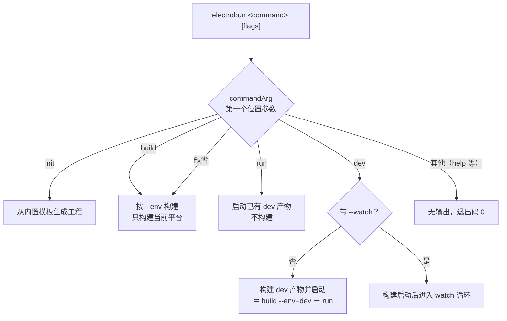
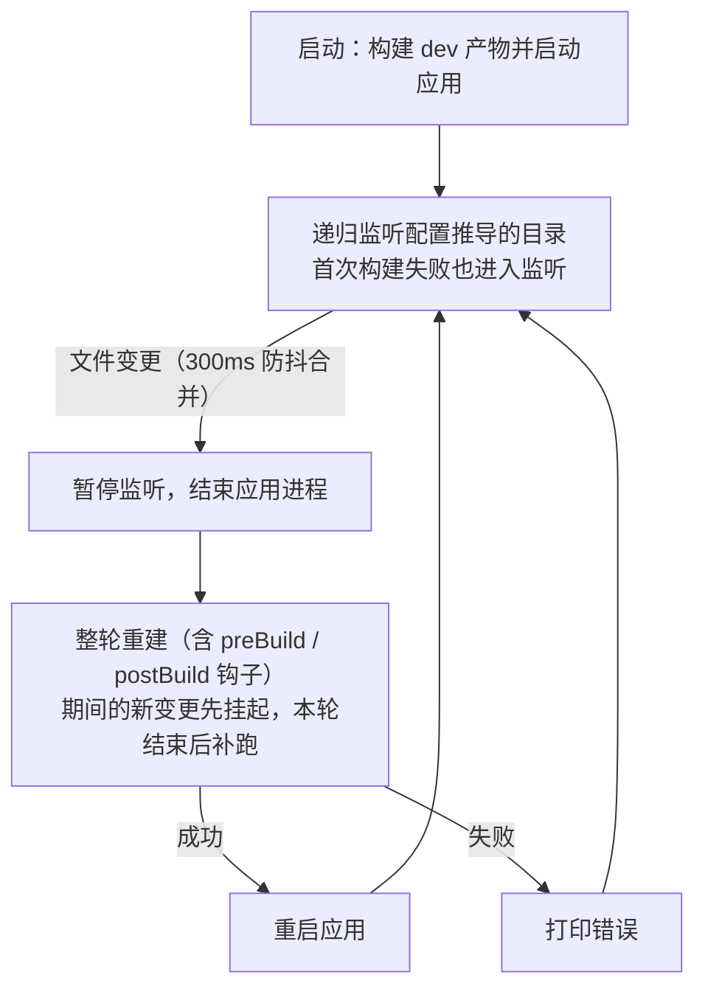

import { Meta } from '@storybook/addon-docs/blocks';

<Meta id="cli" title="构建与分发/构建/CLI 参数" name="Docs" />

# CLI 参数

`electrobun` 命令行只有 4 个命令、3 个旗标，没有帮助系统，也不对无效输入报警——不少"没生效"的情况其实是静默回退成了默认行为。本课给出命令面的完整速查：每个命令做什么、`--watch` 循环怎么转、`--env` 怎么传、CLI 从哪读配置，最后是一份"不报错但行为变了"的静默行为清单。脚手架细节在[初始化项目](?path=/docs/init--docs)，`--env` 三档通道的产物语义在[构建与分发入门](?path=/docs/build-basics--docs)，配置文件字段在[构建配置](?path=/docs/build-config--docs)，本课只讲命令行这一层；行为以 1.18.1 包内 CLI（内嵌源码与本地实测）为准，官方文档只列出了命令与旗标，静默回退等细节均出自源码核对。

| 输入 | 默认 / 形式 | 要点 |
| --- | --- | --- |
| `electrobun`（不带参数） | 命令缺省为 `build` | 等价 `electrobun build`，走 dev 通道 |
| `electrobun dev` | — | 构建 dev 产物并启动；唯一读取 `--watch` 的命令 |
| `electrobun build` | `--env` 缺省 `dev` | 唯一读取 `--env` 的命令；只构建当前平台 |
| `electrobun run` | 无旗标 | 不构建，直接启动已有的 dev 产物 |
| `electrobun init` | 交互式 | `--template=` 与项目名规则见「初始化项目」课 |
| `--env` 的值 | `dev` / `canary` / `stable` | 只认 `--env=值` 连写；非法值静默回退 `dev` |
| `--watch` | 关闭 | 只在 `dev` 上生效 |
| `--template` | 交互选择 | 只在 `init` 上生效 |
| 配置文件 | `./electrobun.config.ts` | 只在当前目录找这一个文件，找不到静默用内置默认 |
| 帮助 | 不存在 | `--help` / `help` 无输出、退出码 0 |

## 命令一览

命令取第一个位置参数，只认 `init` / `build` / `run` / `dev` 四个，缺省当作 `build`；其余任何输入（包括 `help`、`--help`、拼错的命令）都不匹配任何分支，无输出地以退出码 0 结束。旗标与命令一一绑定：`--watch` 只被 `dev` 读取，`--env` 只被 `build` 读取，`--template` 只被 `init` 读取，绑错的旗标被静默忽略。

`init` 的三种用法、13 个内置模板与生成的目录结构由[初始化项目](?path=/docs/init--docs)课展开；`init` 只做文件生成，不读取 `electrobun.config.ts`。其余三个命令都先读配置再行动，配置定位规则见「配置定位」。

### dev

日常迭代的主力命令：读配置 → 构建 dev 产物 → 启动应用。它等价于 `electrobun build --env=dev` 之后立刻执行 `electrobun run`——官方文档就是这样定义的，源码里也确实依次调用这两个步骤的实现。

- **通道固定为 dev。** `dev` 不读取 `--env`，`electrobun dev --env=canary` 里的旗标会被静默忽略，构建的仍是 dev 产物；要产分发物用 `build`。
- **退出行为。** 在终端按 `Ctrl+C`：第一次打印 `[electrobun dev] Shutting down gracefully... (press Ctrl+C again to force quit)` 并等待应用自行结束；卡住时按第二次，打印 `Force quitting...` 并对整个进程组发 `SIGKILL`。
- 应用自己退出（如主进程调用退出 API）时，CLI 以应用的退出码结束。

tester 工程的写法就是最常用的两个脚本：`"start": "electrobun dev"`（跑一次）、`"dev": "electrobun dev --watch"`（持续迭代）。

### build

把工程构建成产物：读配置 → 按通道构建 → 失败时打印 `Build failed:` 并以退出码 1 结束。构建过程会执行 `electrobun.config.ts` 里配置的 `scripts` 钩子并注入 `ELECTROBUN_*` 环境变量，钩子顺序与变量清单见[构建与分发入门](?path=/docs/build-basics--docs)。

`--env` 的解析规则（依据 1.18.1 CLI 源码）：在参数表里找以 `--env=` 开头的项，取 `=` 后的值；值必须是 `dev` / `canary` / `stable` 三者之一，**不是就静默按 `dev` 构建**。三档通道一句话区分：

- `dev`（默认）：不签名，只写 `build/`，不生成分发物，为迭代速度服务；
- `canary`：走 release 流水线，生成 `artifacts/` 分发物，用于预发布验证；
- `stable`：同一条流水线，命名不带通道后缀，用于正式分发。

通道对产物名、目录名、签名与更新文件的影响是 `--env` 的另一半语义，展开在[构建与分发入门](?path=/docs/build-basics--docs)。另一个硬边界：`build` 只构建当前主机的平台与架构，CLI 没有目标平台参数；多平台产物靠各平台 CI 跑同一条命令，见[跨平台与兼容性](?path=/docs/cross-platform--docs)。

### run

跳过构建，直接启动 `build/dev-<os>-<arch>/` 里已有的 dev 产物（macOS 上启动的是 `<name>-dev.app/Contents/MacOS/launcher`）。适合没有代码变化、只想快速重跑的场景——省掉 `dev` 每次必做的整轮构建。

通道在实现里写死为 dev：`run` 没有任何参数，启动不了 canary / stable 产物。产物不存在时启动失败，所以 `run` 总是跟在一次 `build` 或 `dev` 之后才有意义。`Ctrl+C` 的双击退出行为与 `dev` 相同。

## watch 循环

`--watch` 只被 `dev` 读取：先完成一轮"构建 + 启动"，然后持续监听、变更后整轮重来。一轮循环的完整路径（依据 1.18.1 CLI 源码）：

回查要点：

- **监听范围从配置推导**：主进程入口所在目录、各视图入口所在目录、`build.copy` 源路径、`build.watch` 额外声明，递归监听并去重；推导表在[初始化项目](?path=/docs/init--docs)，字段语义在[构建配置](?path=/docs/build-config--docs)。始终忽略 `build/`、`artifacts/`、`node_modules/` 与 `build.watchIgnore` 匹配的 glob。
- **横幅可核对监听目录。** 启动时打印 `ELECTROBUN DEV --watch` 与 `Watching N directories` 并逐行列出目录；改了文件没触发重建，先对照这张清单。
- **构建期间监听暂停**，期间的新变更挂起，本轮结束后补跑一轮，不会丢失也不会并发构建。
- **失败不退出循环。** 重建失败只打印 `Build failed:` 与 `Waiting for file changes...`，修好文件保存即自动恢复；首次构建失败同样如此。
- **没有可监听目录时启动即报错**（`No directories to watch. Check your config entrypoints.`，退出码 1）——通常意味着配置里没有入口。
- **退出。** 第一次 `Ctrl+C` 打印 `[electrobun dev --watch] Shutting down...`、停掉应用与监听，最多 2 秒后自行退出；按第二次立即对进程组发 `SIGKILL`。

## 配置定位

`build` / `run` / `dev` 都先读配置，规则很短：**只在进程当前目录找 `electrobun.config.ts` 这一个文件**，动态 import 后取 `default` 导出，与内置默认逐段合并。没有 `.js` / `.json` 等备选文件名，也没有 `--config` 参数。

三种结果对应三种行为：

- 找到且能加载：打印 `Using config file: electrobun.config.ts` 后正常进行——这条日志是核对"是否在正确目录运行"的第一手段。
- 找不到：**不报错**，静默使用内置默认配置（`app.name` 为 `MyApp`、主进程入口 `src/bun/index.ts`、`buildFolder` 为 `build`、`artifactFolder` 为 `artifacts`），构建多半在打包入口时才失败。
- 找到但未导出 default 对象或加载出错：打印错误与 `using default config instead`，同样回退默认配置。

结论：命令必须在工程根目录运行。通过 `bun run` / `npm run` 执行 scripts 时工作目录就是 `package.json` 所在目录，天然满足。

## 静默行为

这份清单汇总所有"不报错但行为和预期不同"的输入，是本课最值得回查的部分。依据 1.18.1 CLI 源码核对，其中无参数调用与 `help` / `--help` 均在本机实测验证：

| 输入 | 实际行为 | 判断 / 处理 |
| --- | --- | --- |
| 不带参数运行 `electrobun` | 等价 `build`（dev 通道） | 想启动应用用 `dev` |
| 未知命令、`help`、`--help`、`-h` | 无输出，退出码 0 | 正常现象；参数查本课或官方 CLI 页 |
| `--env` 用空格形式（`--env canary`） | 参数不被识别，按 `dev` 构建 | 只认 `--env=值` 连写 |
| `--env=prod` 等三档以外的值 | 静默回退 `dev` | 值只能 `dev` / `canary` / `stable` |
| `build --watch` | `--watch` 被忽略，构建完就退出 | 持续迭代用 `dev --watch` |
| `dev --env=canary` | `--env` 被忽略，仍构建 dev 产物 | 产分发物用 `build` |
| 当前目录没有 `electrobun.config.ts` | 静默用内置默认配置 | 看有没有 `Using config file` 日志 |

判断通道是否生效，看产物而不是看终端：CLI 不回显参数解析结果，dev 产物名带 `-dev` 后缀且只落在 `build/`，canary / stable 会生成 `artifacts/`。

## 最佳实践

- **把命令固化进 `package.json` scripts。** 官方脚本示例：`"start": "electrobun run"`、`"dev": "electrobun dev --watch"`、`"build:canary": "electrobun build --env=canary"`、`"build:stable": "electrobun build --env=stable"`。工作区 `tester/` 用的是 `"start": "electrobun dev"`、`"dev": "electrobun dev --watch"` 的等价变体。固定写法还能避开空格形式、拼错值这类静默回退。
- **多平台用各平台 CI 跑同一命令。** CLI 没有目标平台参数，macOS / Windows / Linux 产物分别在对应系统的 runner 上执行同一条 `build` 得到；`{env}-{os}-{arch}-` 前缀让它们可以平铺进同一目录互不冲突。
- **外部资产先构建再交给 electrobun。** 视图由 Vite 等工具产出时，用 `&&` 串起来（`vite-tester` 的 `"build:canary": "vite build && electrobun build --env=canary"`）；开发期的双进程 HMR 工作流见[Vite 集成与 HMR](?path=/docs/vite-hmr--docs)。
- **验证通道与工作目录用日志和产物，不靠命令回显。** `Using config file` 确认目录、产物后缀与 `artifacts/` 确认通道；两者都没有时先怀疑静默回退。

## 常见问题

- `electrobun build --env=prod` 或 `--env canary` 跑完了，但没有 `artifacts/`，产物还是 `-dev` 后缀？
  两种写法都会静默回退 dev：空格形式根本不被识别；值不在 `dev` / `canary` / `stable` 三档内时回退 `dev` 且无任何警告。改成 `--env=canary` 连写形式重跑，用 `artifacts/` 是否出现来确认。
- `electrobun build --watch` 构建完直接退出了，没有监听？
  `--watch` 只被 `dev` 读取，`build` 分支不解析它。持续迭代用 `electrobun dev --watch`；`build` 的定位是产出产物，构建完退出是预期行为。
- `electrobun --help` / `electrobun help` 没有任何输出？
  正常。1.18.1 的 CLI 没有帮助命令，未知输入统一无输出、退出码 0。参数速查用本课开场表或官方 CLI Arguments 页。
- 在子目录里运行 `dev` / `build`，行为不对，甚至生成了陌生的 `MyApp`？
  CLI 只在当前目录找 `electrobun.config.ts`，找不到就静默用内置默认配置（应用名 `MyApp`）。回到工程根目录运行，确认开头有 `Using config file: electrobun.config.ts` 日志。
- 按了一次 `Ctrl+C`，终端还挂着？
  第一次是优雅退出，会等应用自行结束；再按一次立即对整个进程组强制结束。watch 模式第一次按下后最多 2 秒会自行退出，不必连按。

## 总结回顾

摘要：

`electrobun` 命令面由四个命令构成：`dev` 构建 dev 产物并启动（等价 `build --env=dev` ＋ `run`）、`build` 按 `--env` 通道产出、`run` 不构建地重跑 dev 产物、`init` 从 13 个模板生成工程。旗标与命令一一绑定——`--watch` 属于 `dev`、`--env` 属于 `build`、`--template` 属于 `init`。watch 循环监听配置推导的目录（始终忽略 `build/`、`artifacts/`、`node_modules/`），变更经 300ms 防抖后走"杀进程 → 含钩子的整轮重建 → 重启"，构建期间暂停监听并挂起新变更，失败不退出循环；双击 `Ctrl+C` 退出。配置只在当前目录找 `electrobun.config.ts`，找不到静默用内置默认。CLI 没有帮助系统，未知命令、非法 `--env`、绑错的旗标、缺失的配置全部静默处理，判断要靠启动日志与产物形态。

一句话：

> 旗标跟着命令走——`--watch` 只属于 `dev`、`--env` 只属于 `build`；一切无效输入都不报错，默认回到 dev 构建。

知识要点：

- 四个命令各自做什么？`dev` 与 `build --env=dev` ＋ `run` 是什么关系？
- `--env` 的合法形式与取值有哪些？写错时会发生什么、怎么判断？
- `--watch` 一轮循环的完整路径是什么？构建失败、构建期间又有变更分别怎么处理？
- 监听目录从哪里推导、始终忽略哪些？启动横幅能核对什么？
- CLI 从哪里找配置文件？找不到时行为是什么？用什么日志核对？
- 哪些输入会静默回退？多平台构建为什么靠各平台 CI 跑同一命令？

## 参考资料

- [CLI Arguments — 官方命令与参数、构建环境说明](https://framework.blackboard.sh/electrobun/apis/cli/cli-args/)
- [Build Configuration — scripts 钩子与注入的环境变量](https://framework.blackboard.sh/electrobun/apis/cli/build-configuration/)
- [blackboardsh/electrobun — GitHub 仓库（CLI 实现，`package/src/cli/index.ts`）](https://github.com/blackboardsh/electrobun)
