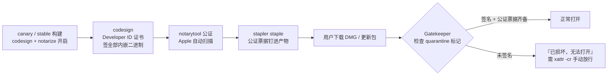
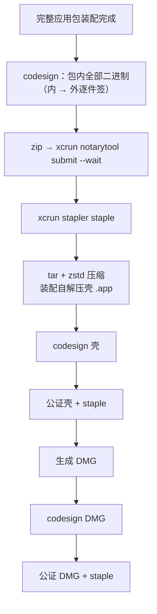

import { Canvas, Controls, Meta } from '@storybook/addon-docs/blocks';
import * as CodeSigningStories from './code-signing.stories';

<Meta of={CodeSigningStories} name="Docs" />

# 代码签名

代码签名让 macOS 确认「这个应用确实出自你、分发途中没被篡改」；公证（notarization）再让 Apple 自动扫描一遍并发放票据，两者合起来决定用户下载你的应用后是直接打开，还是被 Gatekeeper 拦成「已损坏，无法打开」。Electrobun 1.18.1 内置的只有 macOS 这条链：`build.mac.codesign` / `notarize` 两个开关加一组 `ELECTROBUN_*` 环境变量，CLI 在 canary / stable 构建里自动完成签名、公证与 staple；Windows 与 Linux 产物没有内置签名步骤，靠 `scripts` 钩子接外部工具。本课讲清证书与凭据准备、生效判定链、签名顺序、entitlements 机制、验证命令与高频失败。



回查先看这组键与变量（默认值均与 1.18.1 包内类型定义、CLI 源码核对过）：

| 键 / 变量 | 默认值 | 回查要点 |
| --- | --- | --- |
| `build.mac.codesign` | `false` | 签名总开关；dev 通道永不签名，非 macOS 主机或目标也不签 |
| `build.mac.notarize` | `false` | 公证并 staple；依赖 `codesign` 同开，单独开启被忽略 |
| `build.mac.entitlements` | 三条 `com.apple.security.cs.*` 默认 | 与默认逐键合并、无法删除；隐私键自动生成 Info.plist 用途说明 |
| `ELECTROBUN_DEVELOPER_ID` | 未设置则签名即退出 | 签名身份：开发者门户里证书的名称（通常为公司名） |
| `ELECTROBUN_APPLEID` / `ELECTROBUN_APPLEIDPASS` / `ELECTROBUN_TEAMID` | 三者齐全才启用 | Apple ID 公证通道：Apple ID + 应用专用密码 + 团队 ID |
| `ELECTROBUN_APPLEAPIKEYPATH` / `ELECTROBUN_APPLEAPIKEY` / `ELECTROBUN_APPLEAPIISSUER` | 三者齐全才启用 | App Store Connect API key 公证通道；与 Apple ID 组同时设置时优先 |

## 快速上手

前提：已加入 Apple Developer Program 的 macOS 主机、完整 Xcode（`notarytool` 随命令行工具提供）、能联网到 Apple。四步跑通「签名 → 公证 → 验证」闭环：

**第一步：证书与标识（一次性）。** 装完整 Xcode 后，Settings → Accounts → Manage Certificates → 加一个 **Developer ID Application** 证书（官方指南提醒：Apple 机器常带过期证书，装完整 Xcode 再生成）。再到开发者门户给应用添加 Identifier，官方指南要求**勾选 App Attest**，Electrobun 的 CLI 才能完成签名与公证。最后在 account.apple.com 的 App Specific Passwords 里生成一个应用专用密码。

**第二步：环境变量。** 写进 `~/.zshrc` 后 `source`，用 `echo $ELECTROBUN_TEAMID` 确认生效：

```bash
export ELECTROBUN_DEVELOPER_ID="My Corp Inc. (BGU899NB8T)"   # 证书名称
export ELECTROBUN_TEAMID="BGU899NB8T"                         # Identifier 页的 App ID Prefix
export ELECTROBUN_APPLEID="name@example.com"                  # Apple ID 邮箱
export ELECTROBUN_APPLEIDPASS="your-app-specific-password"    # 应用专用密码
```

**第三步：配置并构建。** 在 `electrobun.config.ts` 的 `build.mac` 打开两个开关，跑 canary 通道（dev 通道强制跳过签名）：

```ts
build: {
  mac: {
    codesign: true,
    notarize: true,
    // ...其余保持原样
  },
},
```

```bash
bunx electrobun build --env=canary
```

**第四步：看日志、验产物。** 终端依次出现 `code signing...` → `notarizing...` → `stapling...` 即成功；公证的 `--wait` 会同步阻塞到 Apple 扫描完成。构建后 `build/canary-macos-arm64/` 里剩下的是自解压壳 `.app`（完整应用包已打进压缩包），用它或 `artifacts/` 里的 DMG 验证（在工程根目录执行，脚本在本课课程目录）：

```bash
bash <本课课程目录>/verify-signature.sh build/canary-macos-arm64/hello-world-canary.app
```

三项检查全部通过，就可以按[构建与分发入门](?path=/docs/build-basics--docs)的流程分发了。

## macOS 签名

### 生效条件

CLI 源码里签名是否发生由四个条件共同决定：`buildEnvironment !== "dev"`、目标平台是 macOS、主机是 macOS、`build.mac.codesign` 为 `true`；公证再叠一层 `shouldNotarize = shouldCodesign && notarize`。把它读成四道闸门：

- **通道闸门：** dev 通道为迭代速度服务，配置原样保留也强制跳过，日志打印 `skipping codesign`。想验证签名流程必须用 `--env=canary` 或 `--env=stable`。
- **平台闸门：** CLI 只在当前主机平台构建（见[构建与分发入门](?path=/docs/build-basics--docs)），因此在 mac 上交叉出的 Windows / Linux 产物不会触发 macOS 签名，Windows / Linux 主机上同样不会。
- **签名身份闸门：** 走到签名步骤时 `ELECTROBUN_DEVELOPER_ID` 必须已设置，否则打印 `Env var ELECTROBUN_DEVELOPER_ID is required to codesign` 并以退出码 1 终止构建。
- **公证凭据闸门：** 公证凭据两组三元组（见「证书与凭据」）任选一组凑齐即可；都没有则打印 `Provide either App Store Connect API key credentials ... or Apple ID credentials ... to notarize` 并终止构建。

下面的示意在浏览器里复现这条判定链（固定为 macOS 主机 × macOS 目标的前提）。真实行为以构建日志为准。

<Canvas of={CodeSigningStories.SignVerdict} />
<Controls of={CodeSigningStories.SignVerdict} />

| 读者操作 | 可观察证据 |
| --- | --- |
| 默认状态（canary + 双开 + Apple ID 三元组） | 走完 `code signing...` → `notarizing...` → `stapling...` 三行日志，四道闸门全过 |
| 通道切到 dev | 配置不变，日志只剩 `skipping codesign` / `skipping notarization`——dev 强制跳过 |
| 关掉 `build.mac.codesign` | `skipping codesign`；`notarize: true` 被静默忽略（依赖链断在第二道闸门） |
| 关掉 `ELECTROBUN_DEVELOPER_ID` | `code signing...` 后立即报 required 错误，构建退出（exit 1） |
| 公证凭据切到「未设置」 | 签名成功、`notarizing...` 后报 `Provide either ... to notarize`，构建退出 |
| 公证凭据切到 API key 三元组 | submit 命令换用 `--key` / `--key-id` / `--issuer`；两组同时设置时 CLI 优先 API key |
| 打开 Show code | 看到该 Canvas 实际执行的 `sign-verdict.ts` |

### 证书与凭据

签名身份与公证凭据是两样东西：**证书**装在钥匙串里、供 `codesign` 使用；**公证凭据**是一组环境变量、供 `xcrun notarytool` 向 Apple 提交扫描。官方指南的分工：

- `ELECTROBUN_DEVELOPER_ID` 是签名身份。值取开发者门户里打开 Developer ID Application 证书看到的证书名称（通常为公司名，带 `(TeamID)` 后缀更精确）；CLI 把它原样拼进 `codesign --sign`。官方指南同时把 `ELECTROBUN_TEAMID` 列为签名所需——CLI 侧它实际参与的是 Apple ID 公证三元组。
- 公证凭据二选一，两组都是**三个变量同时存在才生效**：

| 通道 | 环境变量 | 适用 |
| --- | --- | --- |
| Apple ID | `ELECTROBUN_APPLEID` / `ELECTROBUN_APPLEIDPASS` / `ELECTROBUN_TEAMID` | 本机手动发布；`APPLEIDPASS` 用应用专用密码，不是 Apple ID 主密码 |
| App Store Connect API key | `ELECTROBUN_APPLEAPIKEYPATH` / `ELECTROBUN_APPLEAPIKEY` / `ELECTROBUN_APPLEAPIISSUER` | CI/CD 推荐，官方明说可避开双因素问题 |

API key 在 App Store Connect → Users and Access → Integrations → App Store Connect API 处创建，下载 `.p8` 文件；`ELECTROBUN_APPLEAPIKEYPATH` 指向它的路径，CLI 会检查文件存在，不存在同样退出构建。两组同时设置时 CLI 优先使用 API key（源码 `useApiKey` 判定在前）。

凭据的安全去处是 CI secrets：官方 Updates 指南的 GitHub Action 示例就是以 `secrets.ELECTROBUN_DEVELOPER_ID` 等注入构建步骤。本地放 `~/.zshrc` 即可，不要写进仓库。

### 签名流程

一次 canary / stable 构建会签**三次**（依据 CLI 源码的 release 流水线；官方文档明确说了 self-extractor，DMG 同样在签）：



包内的签名顺序由内向外（`codesignAppBundle` 的实现顺序）：CEF 的 `.dylib` → framework 本体 → CEF helper 可执行文件与 helper `.app` → `Contents/MacOS` 下递归找出的全部 Mach-O 二进制（`--identifier` 取文件名）→ `Resources/app/bun` 里的 `*.node` 原生模块 → `launcher` 主可执行 → 最外层 `.app`。两条实现细节值得记住：

- **统一 `--timestamp --options runtime`。** 安全时间戳让签名在证书过期后仍有效，`--options runtime` 启用公证要求的 hardened runtime（entitlements 正是为它而生，见下一节）。DMG 只做基础签名：不带 entitlements，也不加 runtime 选项。
- **不用 `--deep`，逐件签。** 源码注释明说：`--deep` 与公证兼容性差，所以 CLI 逐件签名再封最外层——这正是不需要你手工干预嵌套二进制的原因。唯一的降级路径是 launcher 在 hardened runtime 下签名失败时，自动去掉 `--options runtime` 重试一次。

### entitlements

`build.mac.entitlements` 是 hardened runtime 下的能力白名单，签名时经 `--entitlements` 嵌进二进制。CLI 自带三条默认，**与你的配置逐键合并（`{...defaults, ...user}`）、无法删除**，只能把某个键显式覆盖为 `false`：

| 默认键 | 为什么存在（CLI 源码注释原意） |
| --- | --- |
| `com.apple.security.cs.allow-jit` | hardened runtime（公证要求）下运行 Electrobun 应用必需 |
| `com.apple.security.cs.allow-unsigned-executable-memory` | Bun 运行时的动态代码执行与 JIT 编译必需 |
| `com.apple.security.cs.disable-library-validation` | 允许加载非同团队签名的动态库 |

值的类型直接决定 plist 形态：`boolean` → `<true/>` / `<false/>`，字符串 → `<string>`，字符串数组 → `<array>`。日常你只需要写**新增的隐私权限**，并顺手把字符串值写成面向用户的用途说明：

```ts
build: {
  mac: {
    codesign: true,
    notarize: true,
    entitlements: {
      // 默认三条保留，这里只写新增 / 覆盖
      "com.apple.security.device.camera": "扫描文档并拍摄照片",
      "com.apple.security.personal-information.location-when-in-use":
        "根据你的选择显示附近门店",
    },
  },
},
```

隐私类 entitlement 有个自动化副作用：CLI 内置一张 entitlement → Info.plist 键的映射表（camera → `NSCameraUsageDescription`、microphone → `NSMicrophoneUsageDescription`、定位、通讯录、蓝牙、文件夹读写等二十余项），凡映射命中且值为真的键，会**同时**在 Info.plist 里生成对应的用途说明——字符串值就是说明文案，布尔 `true` 则回落到通用默认英文文案（`This app requires access for camera`）。没有映射的键（比如三条 `cs.*`）不进 Info.plist。所以加隐私权限时给足字符串值：一处配置，两个文件各得其所。

下面的示意复现「合并 → entitlements.plist → Info.plist 用途说明」两步生成。真实产物以 `build/` 下生成的 `entitlements.plist` 与应用包内 `Info.plist` 为准。

<Canvas of={CodeSigningStories.EntitlementsPlist} />
<Controls of={CodeSigningStories.EntitlementsPlist} />

| 读者操作 | 可观察证据 |
| --- | --- |
| 默认状态（勾了 camera + 文案） | 左侧三条 `cs.*` 默认加一条绿色 `<string>` 键；右侧自动出现 `NSCameraUsageDescription`，文案即你的字符串值 |
| 取消「新增 camera 键」 | entitlements.plist 回到纯默认三条；右侧 Info.plist 为空（`cs.*` 无隐私映射） |
| 清空 camera 用途文案再勾选 | camera 变布尔 `<true/>`；右侧回落到通用默认描述 `This app requires access for camera` |
| 勾选「新增 microphone 键」 | 右侧多出 `NSMicrophoneUsageDescription`，走同样的通用默认文案路径 |
| 打开「allow-jit 覆盖为 false」 | 左侧 `<true/>` 变 `<false/>` 并出现警告——hardened runtime 下 Bun JIT 无法工作，签名后的应用无法启动 |
| 打开 Show code | 看到该 Canvas 实际执行的 `entitlements-plist.ts` |

## 验证与放行

签名是否真的成功，用 macOS 自带的三条命令核对（CLI 源码的验证注释原样列出；课程目录的 `verify-signature.sh` 把它们打包成一个脚本）：

```bash
codesign --verify --deep --strict --verbose=2 <应用.app 路径>   # 签名完整、未被篡改
spctl --assess --type execute --verbose <应用.app 路径>          # Gatekeeper 视角评估
xcrun stapler validate -v <应用.app 或 DMG 路径>                 # 公证票据已钉入
```

三个要点：

- **验证对象是自解压壳与 DMG。** release 构建后完整应用包已打进压缩包（见[构建与分发入门](?path=/docs/build-basics--docs)），`build/canary-macos-arm64/` 里剩下的是壳 `.app`；`artifacts/` 里有 DMG。两者都被签过、公证过。
- **DMG 的 `spctl` 有个正常的不通过。** 对 DMG 评估会得到 `rejected (the code is valid but does not seem to be an app)`——DMG 本来就不是 app，这算通过；真正的失败信号是 `source=no usable signature`。DMG 用 `stapler validate -v` 验证更直观，能看到 teamId、signingId 与 signedTicket。
- **未签名分发的用户侧现象。** 用户从网上下载未签名应用，macOS 给文件加 quarantine 标记，Gatekeeper 直接拦成「已损坏，无法打开」（本机构建的双击不受影响）。应急放行是让用户执行 `xattr -cr /Applications/YourApp.app`，根治是开启签名与公证重新分发。更新场景下 Updater 替换应用后会自动清掉 quarantine 标记，链路细节见[自动更新](?path=/docs/updater--docs)。

## Windows 与 Linux

1.18.1 的内置签名只有 macOS：`win` / `linux` 平台段在类型定义里没有任何签名键，官方 Code Signing 指南也只覆盖 macOS。给这两个平台的产物签名，挂点是 `scripts` 构建钩子（见[构建配置](?path=/docs/build-config--docs)）：

- `postBuild`：应用包装配完成后、签名与打包前——适合改包内文件。
- `postWrap`：自解压壳创建后、签名前，仅 canary / stable 通道。
- `postPackage`：全部产物就绪后——签最终的 `Setup.exe`、tar.gz 就在这里。

钩子由宿主机 Bun 运行，并注入 `ELECTROBUN_BUILD_DIR`、`ELECTROBUN_ARTIFACT_DIR` 等定位变量，脚本里接 `signtool`（Windows Authenticode）或平台签名工具即可。各平台证书格式与工具链本身超出本手册范围；Windows / Linux 产物的其他平台差异见[跨平台与兼容性](?path=/docs/cross-platform--docs)。

## 最佳实践

- **正式分发一律 `codesign` + `notarize` 双开。** 官方强烈推荐；未签名的下载件在 macOS 上直接「已损坏」，比「无法验证开发者」更劝退用户。
- **CI 用 App Store Connect API key 公证。** 官方明说它 preferred for CI/CD 且避开双因素；`--wait` 同步等结果，失败时日志直接可见。
- **凭据只进 CI secrets 或本地 shell 配置。** 官方 GitHub Action 示例即以 secrets 注入；`ELECTROBUN_APPLEIDPASS` 用应用专用密码，永远不等于 Apple ID 主密码。
- **上传 `artifacts/` 前抽查一次签名。** 用三条验证命令（或 `verify-signature.sh`）核过壳 `.app` 与 DMG 再发布，公证失败混进分发渠道最难排查。
- **先 canary 后 stable。** canary 与 stable 走同一条签名流水线，用 canary 验证证书、凭据与 entitlements 全链路，通过后再发 stable。

## 常见问题

- 配了 `codesign: true`，日志还是 `skipping codesign`？
  先查通道：`electrobun build` 默认 dev，dev 强制跳过签名；用 `--env=canary` 或 `--env=stable` 重跑。再查平台：签名只发生在 macOS 主机构建 macOS 目标时。
- `notarize: true` 开了，为什么只看到 `skipping notarization`？
  公证依赖签名：CLI 判定是 `shouldNotarize = shouldCodesign && notarize`，`codesign` 没开时 `notarize` 被静默忽略（类型注释也标注 requires codesign）。两个开关一起开。
- 构建终止并打印 `Env var ELECTROBUN_DEVELOPER_ID is required to codesign`？
  当前 shell 没有这个变量：本地检查 `.zshrc` 是否写对并重新 `source`；CI 检查构建步骤是否注入了该 secret。用 `echo $ELECTROBUN_DEVELOPER_ID` 验证。
- 构建终止并打印 `Provide either App Store Connect API key credentials ... or Apple ID credentials ... to notarize`？
  公证凭据三元组不齐全。两组各需三个环境变量**同时**存在；API key 通道还要求 `ELECTROBUN_APPLEAPIKEYPATH` 指向的 `.p8` 文件真实存在（缺失时会有单独报错）。
- 公证提交后日志出现 `Current status: Invalid`？
  CLI 已自动执行 `xcrun notarytool log` 拉取详细日志并退出构建，按其中 issues 逐条处理。CLI 的逐件签名覆盖 `Contents/MacOS`、`Frameworks` 与 `Resources/app/bun` 下的 `*.node`；若你的工程往这些位置之外塞了可执行文件，优先检查它是否被签。
- 用户报告下载后「已损坏，无法打开」（damaged and can't be opened）？
  未签名未公证的应用带了 quarantine 标记、被 Gatekeeper 拦截。应急：让用户执行 `xattr -cr /Applications/YourApp.app`；根治：双开 `codesign` / `notarize` 重新分发。本机构建不会有此问题。
- `spctl` 检查 DMG 返回 `rejected (the code is valid but does not seem to be an app)`，签名失败了吗？
  没有，这是 DMG 的正常响应（它不是 app）；真正的失败信号是 `source=no usable signature`。DMG 用 `xcrun stapler validate -v` 验证，能看到 teamId 与 signedTicket。
- 公证通过，但应用一启动就崩溃（签名前正常）？
  hardened runtime 下缺少运行时 entitlement。CLI 默认三条 `com.apple.security.cs.*` 正是为 Bun 的 JIT 与动态库加载准备的；检查是否把它们覆盖成了 `false`（尤其 `allow-jit`），去掉覆盖重新构建。

## 总结回顾

摘要：

Electrobun 1.18.1 内置的签名链只覆盖 macOS：`build.mac.codesign` / `notarize` 两个开关默认关闭，且只在 canary / stable 通道、macOS 主机构建 macOS 目标时生效，dev 通道强制跳过。签名身份用 `ELECTROBUN_DEVELOPER_ID`（Developer ID Application 证书的名称），公证凭据在 Apple ID 三元组与 App Store Connect API key 三元组里二选一（后者优先、CI 推荐），任一缺失都会让构建带着明确报错退出。一次 release 构建签三次——完整应用包、自解压壳、DMG，包内由内向外逐件签名并统一启用 hardened runtime 与安全时间戳。`build.mac.entitlements` 与三条 `cs.*` 默认逐键合并、不可删除，隐私类键还会自动生成 Info.plist 用途说明，字符串值即文案。产物用 `codesign --verify`、`spctl --assess`、`stapler validate` 三条命令验证；未签名下载件被 Gatekeeper 拦成「已损坏」，`xattr -cr` 应急、签名公证根治。Windows / Linux 无内置签名，靠 `scripts` 钩子接外部工具。

一句话：

> macOS 正式分发的门槛是「Developer ID 签名 + 公证 + staple」一条链——Electrobun 用两个配置开关和七个环境变量替你走完，但只在 canary / stable 通道的 macOS 构建上发生。

知识要点：

- 签名与公证的生效闸门有哪几道？dev 通道为什么永不签名？
- 公证的两组凭据各需要哪三个环境变量？同时设置时 CLI 用哪组？
- 一次 canary / stable 构建有哪三个产物被签名加公证？包内签名顺序是什么？
- 默认三条 entitlements 是什么？开公证后为什么不能覆盖掉？
- entitlements 的字符串值会同时出现在哪两个文件里？布尔 `true` 时用途说明是什么？
- 如何验证 `.app` 与 DMG 的签名和公证？DMG 的 `spctl` 正常响应长什么样？
- 未签名应用下载后「已损坏」如何应急放行、如何根治？
- Windows / Linux 产物在 1.18.1 里通过什么挂点接签名？

## 参考资料

- [Code Signing — 官方代码签名指南](https://framework.blackboard.sh/electrobun/guides/code-signing/)
- [Updates — 更新指南（CI secrets 注入签名凭据的 GitHub Action 示例）](https://framework.blackboard.sh/electrobun/guides/updates/)
- [Build Configuration — 构建钩子与 ELECTROBUN_* 注入变量](https://framework.blackboard.sh/electrobun/apis/cli/build-configuration/)
- [blackboardsh/electrobun — GitHub 仓库（CLI 签名实现）](https://github.com/blackboardsh/electrobun)
- [Notarizing macOS software before distribution — Apple 公证与 Gatekeeper 概念](https://developer.apple.com/documentation/security/notarizing-macos-software-before-distribution)
