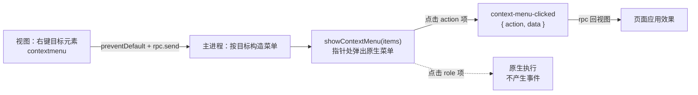
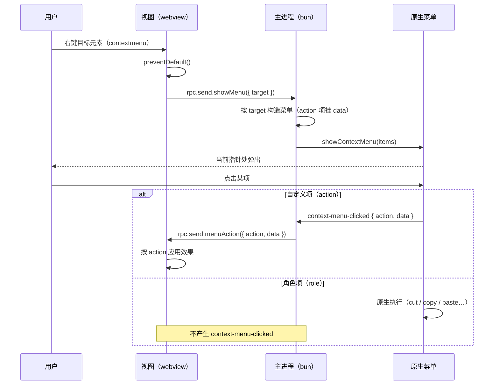

import { Canvas, Meta } from '@storybook/addon-docs/blocks';
import * as ContextMenuStories from './context-menu.stories';

<Meta of={ContextMenuStories} name="Docs" />

# 上下文菜单

`ContextMenu` 让主进程在**当前鼠标指针处**弹出一个原生菜单：`ContextMenu.showContextMenu(items)` 接收一份菜单项数组，点击自定义项后以 `context-menu-clicked` 事件回到主进程，携带 `action` 与 `data`。菜单项结构与[应用菜单](?path=/docs/application-menu--docs)共用同一份 `ApplicationMenuItemConfig`：`role` 项（cut / copy / paste 这类）由原生直接执行、不产生事件，`action` 项才走事件回路。右键到原生菜单这条路不是自动接好的——官方给的标准做法是页面监听 `contextmenu`、`preventDefault()` 后经自定义 RPC（见[自定义 RPC](?path=/docs/rpc--docs)）把右键目标报给主进程，由主进程构造并弹出菜单，点击后再经 RPC 把动作发回页面生效。



开场参考表（字段与默认值按 1.18.1 包内 `dist/api/bun/core/ContextMenu.ts` 的 `menuConfigWithDefaults` 与 `dist/api/bun/proc/native.ts` 的类型定义核对；`showContextMenu` 不接受坐标参数，菜单位置固定为当前指针处）：

| 字段 | 类型 | 默认 | 回查要点 |
| --- | --- | --- | --- |
| `label` | string | role 项缺省时回落英文默认标签（`roleLabelMap`），再否则 `""`；action 项类型上必填 | 显示文本；role 项要中文标签就显式写 |
| `action` | string | — | 自定义动作标识，点击时随事件回传；与 `role` 互斥 |
| `role` | string | — | 原生角色，点击由原生执行、不发事件 |
| `data` | any | — | 随点击回传的任意可序列化数据：构造时存入主进程注册表，点击回传后清除 |
| `type` | string | `"normal"` | `"divider"` 与 `"separator"` 等价，都渲染为分隔线 |
| `enabled` | boolean | `true` | 仅显式 `false` 才禁用（灰显） |
| `checked` | boolean | `false` | `true` 显示复选框 |
| `hidden` | boolean | `false` | `true` 隐藏该项 |
| `tooltip` | string | — | 悬停提示 |
| `accelerator` | string | — | 快捷键提示（显示在标签旁）：单字符 `"s"` 在 macOS 显示为 ⌘S |
| `submenu` | array | — | 嵌套子菜单，结构递归同构 |

平台支持（1.18.1，来自 `ContextMenu.ts` 顶部注释与官方文档）：macOS 完整支持——role 项可用（映射 NSResponder selector）、accelerator 以 Command 为默认修饰键显示；Windows 的 role 行为部分支持、accelerator 仅支持单字符；Linux 的 `showContextMenu` 尚未支持。

## 快速上手

任何可运行的 electrobun 工程（如[第一个窗口](?path=/docs/first-window--docs)的 hello-world），在 `src/bun/index.ts` 追加：

```ts
import { ContextMenu } from "electrobun/bun";

// 自定义项（action 项）的点击以事件回到这里；role 项不会到达。
// 1.18.1 的 on 把参数标为 unknown，断言成实际形状后取 e.data
ContextMenu.on("context-menu-clicked", (e) => {
  const { action, data } = (e as { data: { action: string; data?: unknown } }).data;
  console.log("action:", action, "data:", data);
});

// 5 秒内把鼠标移到任意位置停住：指针处会弹出原生菜单
setTimeout(() => {
  ContextMenu.showContextMenu([
    { label: "打开详情", action: "open-detail" },
    { label: "灰掉的项", action: "noop", enabled: false },
    { type: "separator" },
    { role: "copy" },
    { role: "paste" },
  ]);
}, 5000);
```

`bun start` 后核对：指针处弹出菜单；点「打开详情」，启动终端打印 `action: open-detail`；点 Copy 没有任何终端输出——role 项由原生执行，不经过事件；「灰掉的项」点不动。

## 构造菜单项

传给 `showContextMenu` 的是 `ApplicationMenuItemConfig` 数组。实现先做一轮默认值归一：`type` 补 `"normal"`、`enabled` 默认 `true`、`checked` / `hidden` 转布尔、`label` 缺省时回落角色默认标签；每个 action 项的 `action` + `data` 被序列化成一个带内部分隔符的字符串（`data` 存进主进程的注册表），点击时反解回 `{ action, data }` 并清除注册项。成员分三类：自定义项（`action`）、角色项（`role`）、分隔线——前两类互斥，决定「点击走哪条路」。

### 自定义项

带 `action` 的项是唯一会回到你代码里的菜单项。最小表达：

```ts
ContextMenu.showContextMenu([
  {
    label: "删除",
    action: "delete-item",
    // 任意可序列化数据：点击时原样回到事件里
    data: { target: "list-item-2" },
  },
  { label: "置顶", action: "pin-item", data: { target: "list-item-2" } },
  { label: "重命名", action: "rename-item", enabled: false },
]);
```

接收点击（注册一次即可，所有菜单的点击都回到这里）：

```ts
ContextMenu.on("context-menu-clicked", (e) => {
  // 载荷在包装对象的 e.data：{ action, data }
  const { action, data } = (e as { data: { action: string; data?: unknown } }).data;
  if (action === "delete-item") {
    removeItem((data as { target: string }).target);
  }
});
```

要点：

- **`action` 只是标识字符串**，路由自己写；一个处理器里 switch 所有 action，比按菜单各注册一套监听好维护。
- **`data` 承载右键上下文**：构造菜单时把目标写进去，点击事件里原样取回，不必在主进程另存「上次右键了谁」的可变状态。它要跨序列化进注册表，只放字符串、数字、普通对象这类纯数据。
- 状态字段随手可用：`enabled: false` 灰显、`checked: true` 带复选框、`hidden: true` 隐藏、`tooltip` 悬停提示。

### 角色项

`role` 是框架预置的原生行为，1.18.1 的角色表映射到 macOS 的 NSResponder selector（包内 `menuRoles.ts` 注释），上下文菜单里最常用的是文本编辑角色：

| role | 默认标签 | 行为 |
| --- | --- | --- |
| `undo` / `redo` | Undo / Redo | 撤销 / 重做 |
| `cut` / `copy` / `paste` | Cut / Copy / Paste | 剪切 / 拷贝 / 粘贴 |
| `pasteAndMatchStyle` | Paste and Match Style | 按目标样式粘贴 |
| `delete` | Delete | 删除 |
| `selectAll` | Select All | 全选 |

判断标准：系统文本操作用 `role`（零代码、原生作用于 webview 的文本编辑）；要主进程或页面参与的动作用 `action`。右键输入框时两类混排是常态。

边界：

- **role 与 action 互斥**：同一项同时写了两者，归一时 `role` 胜出，`action`（连同 `data` 序列化）被丢弃——点击不会产生事件。
- role 项的 `label` 缺省时用英文默认标签；要中文显式写 `label: "拷贝"`，role 行为不变。
- 完整角色目录（移动 / 选择 / 文本变换等 108 个，1.18.1，多数面向 macOS 文本编辑）见[应用菜单](?path=/docs/application-menu--docs)；平台差异见上文开场表。

### 分隔线与子菜单

`type: "separator"`（或 `"divider"`，两者等价）渲染为一条分隔线；`submenu` 嵌套子菜单，结构递归同构、默认值归一与序列化同样生效：

```ts
ContextMenu.showContextMenu([
  {
    label: "排序",
    submenu: [
      { label: "按时间", action: "sort-by-time" },
      { label: "按名称", action: "sort-by-name" },
    ],
  },
  { type: "separator" },
  { label: "删除", action: "delete-item" },
]);
```

## 弹出与事件

- **位置取当前指针**：`showContextMenu` 调用即弹，FFI 把归一后的配置 JSON 一次性交给原生，菜单出现在**当前鼠标指针位置**——API 不接受坐标参数。视图联动时用户指针就停在右键处，位置天然正确；也因此应在收到 RPC 后立即调用，延迟后再弹会让菜单落在指针已移动到的新位置。
- **弹出不依赖窗口**：纯 bun 侧也能弹（快速上手的定时器就是），菜单可以出现在应用窗口之外，甚至没有窗口时也能弹出；点击事件仍回到主进程。
- **每次调用都是一份新菜单**：1.18.1 没有复用、更新或主动关闭已弹出菜单的 API（`ContextMenu` 模块只导出 `showContextMenu` 与 `on`）；再右键就是再调用一次。
- **事件注册**：`ContextMenu.on("context-menu-clicked", handler)`；等价写法是默认导出的 `Electrobun.events.on("context-menu-clicked", handler)`（官方文档示例用的就是这个，两者注册在同一个事件总线上）。handler 收到的是事件包装对象，载荷在 `e.data`：`{ action, data }`。

## 视图侧联动

右键联动没有内置通道：`contextmenu` 是普通 DOM 事件，菜单构造与弹出只在主进程。把两端接起来需要一条自定义 RPC（schema、send / ask / handle 见[自定义 RPC](?path=/docs/rpc--docs)）——视图把右键目标报上去，主进程构造菜单并弹出；点击后主进程再把 `{ action, data }` 发回页面应用：



联动回路可以在浏览器里完整走一遍——把视图侧 DOM 事件、主进程构造与事件分发、原生菜单弹出同构搬进 Canvas，右键不同区域、分别点击 action 项与 role 项，观察回路在哪一步分岔：

<Canvas of={ContextMenuStories.ContextMenuFlow} />

| 读者操作 | 可观察证据 |
| --- | --- |
| 右键文本区 | readout：`rpc.send.showMenu({ target: 'note' })` → `按目标构造 → showContextMenu（4 项 + 1 分隔线）`；菜单为 剪切/拷贝/粘贴 + 插入日期 |
| 右键某个列表项 | 菜单换成 置顶/删除/清空列表——目标不同菜单不同，data 里带着 target |
| 右键窗口空白区 | 没有菜单弹出：页面只给标记了 `data-context` 的区域挂了 contextmenu 处理 |
| 点 action 项（如「删除」） | readout 显示 `context-menu-clicked { action, data }` → 生效 `menuAction 回视图 → 「<列表项名>」已删除`——事件先回主进程、再回视图 |
| 点 role 项（如「拷贝」） | 事件回传一行是「无事件——role 项由原生执行」；选中文本进入剪贴板示意，不经过主进程事件 |
| 点击菜单外 | 菜单关闭，不触发任何动作（与原生菜单一致） |

真实窗口行为以课程目录的桌面范例为准（四个文件，按下表归位后 `bun start`）：

| 文件 | 放到工程 | 职责 |
| --- | --- | --- |
| `context-menu-rpc.ts` | `src/shared/types.ts` | 联动契约：showMenu（视图 → bun）与 menuAction（bun → 视图） |
| `context-menu-window.ts` | `src/bun/index.ts` | 窗口 + 按目标构造菜单 + 点击事件经 RPC 发回视图 |
| `context-menu-view.html` | `src/mainview/index.html` | 输入框与列表，`data-context` 标记右键区域 |
| `context-menu-view.ts` | `src/mainview/index.ts` | contextmenu → preventDefault → 上报；menuAction 应用效果 |

归位后核对：右键输入框弹出 剪切/拷贝/粘贴/插入日期，三个 role 项直接编辑输入框内容（macOS 支持 role；Windows 部分行为），终端无日志；右键列表项弹出 置顶/删除/清空列表，点击后列表更新、终端打印 `menu-action` 日志；页面空白处右键不弹本课菜单（没有挂 `contextmenu` 处理，不会上报目标）。

组合要点：

- **上下文报目标，菜单在主进程构造**：视图只发一个 target 字符串，菜单结构、启用态都在 bun 侧决定——原生菜单不是 DOM，页面碰不到它。
- **data 承载右键上下文**：构造时把 target 写进每个 action 项的 `data`，点击事件里原样取回，主进程不必维护「待处理右键」的可变状态。
- **role 与 action 混排**：文本区给编辑 role（原生行为直接作用于输入框），再补少量自定义 action；列表等对象区用纯自定义项 + data。
- **视图侧要 preventDefault**：文档给的标准做法就是阻止默认后改弹原生菜单。

## 最佳实践

- **按右键目标选菜单配方**：文本编辑区 = 编辑 role（cut / copy / paste）+ 少量自定义项；对象 / 列表区 = 纯自定义项 + `data` 携带目标标识。不要给所有区域弹同一份大菜单。
- **点击路由收敛一处**：一个 `context-menu-clicked` 处理器 switch 全部 action；role 项永远不进这个路由，别为它写分支。
- **`data` 只放可序列化纯数据**（字符串、数字、普通对象）：它要经序列化存入注册表再回传；DOM 元素、函数放不进去，需要时存 id 再查。
- **收到上报立即弹出**：菜单位置取「调用瞬间的指针位置」；在异步操作（读文件、发请求）之后再弹，菜单会出现在指针已移动到的新位置。

## 常见问题

- 同时写了 `action` 和 `role`，点击后收不到 `context-menu-clicked`。
  归一时 role 优先：该项只保留 `role`，`action` 连同 `data` 被丢弃。自定义动作删掉 `role`，二选一。
- 点 Cut / Copy 这类项，处理器一行日志都没有。
  正常行为：role 项由原生直接执行，不产生 `context-menu-clicked`。需要自己响应就改用 `action` 项。
- handler 里 `e.action` 是 undefined。
  事件载荷在包装对象的 `e.data` 里：`e.data.action`、`e.data.data`（官方文档示例同样写 `e.data.action`）。
- TypeScript 工程里 handler 参数 `e` 报「'e' is of type 'unknown'」。
  1.18.1 的 `on` 把事件参数类型标成了 `unknown`（给参数标注更窄的类型在 strict 模式下反而过不了检查）；在函数体内断言后取载荷：`(e as { data: { action: string; data?: unknown } }).data`，运行时载荷就是这个结构。
- 页面右键后菜单不弹。
  依次检查：`contextmenu` 监听里是否 `preventDefault()` 并真的发出了 RPC；`BrowserWindow` 是否传入了 `defineRPC` 的 `rpc`（不传的话 handlers 接不上通道，见[自定义 RPC](?path=/docs/rpc--docs)）；当前平台——Linux 1.18.1 尚不支持 `showContextMenu`。
- 想让菜单弹在指定坐标（比如对齐某个元素）。
  1.18.1 的 `showContextMenu` 不接受坐标，固定在当前指针处弹出；需要锚定坐标的菜单只能在视图里自绘 HTML 菜单。
- role 项的标签是英文 “Copy / Paste”。
  `label` 缺省时回落 `roleLabelMap` 的英文默认标签；要中文显式写 `label: "拷贝"`，role 行为不变。

## 总结回顾

摘要：

上下文菜单由主进程的 `ContextMenu.showContextMenu(items)` 弹出，位置固定为当前指针处，不依赖窗口存在，也没有坐标参数与关闭 / 更新 API。菜单项与应用菜单共用 `ApplicationMenuItemConfig`：action 项点击时以 `context-menu-clicked { action, data }` 回到主进程（data 经注册表序列化回传、用后清除），role 项由原生直接执行、不产生事件，两者互斥且 role 优先；分隔线、复选、tooltip、accelerator 与子菜单提供结构与提示。视图联动没有内置通道：页面监听 contextmenu、preventDefault 后经自定义 RPC 把目标报给主进程构造菜单，点击后主进程再经 RPC 把动作发回页面生效。macOS 全量支持，Windows role 部分支持、accelerator 限单字符，Linux 尚未支持。

一句话：

> 上下文菜单是主进程的原生对象：视图只负责把右键目标经 RPC 报上去，`showContextMenu` 在指针处弹出，action 项经 `context-menu-clicked { action, data }` 回主进程再回视图，role 项原生执行、永远不发事件。

知识要点：

- `showContextMenu` 接收什么？菜单在哪里弹出？能指定坐标吗？
- action 项与 role 项的点击分别走什么路径？谁会产生 `context-menu-clicked`？
- `data` 怎么随点击回传？为什么适合携带右键目标？
- 菜单项有哪些字段？`enabled`、`type` 的默认值与 `label` 的回落顺序是什么？
- 一次「右键到页面生效」的完整链路经过哪些环节？
- 三大平台的支持差异是什么？
- 同时写 action 与 role 会怎样？role 项要中文标签怎么办？

## 参考资料

- [Electrobun 文档：Context Menu](https://framework.blackboard.sh/electrobun/apis/context-menu/)
- [Electrobun 文档：Application Menu](https://framework.blackboard.sh/electrobun/apis/application-menu/)（共享的菜单项结构与角色机制）
- electrobun 1.18.1 包内实现：`dist/api/bun/core/ContextMenu.ts`（`showContextMenu` / `on`、默认值归一与平台注释）、`dist/api/bun/proc/native.ts`（`serializeMenuAction` / `deserializeMenuAction` 与 `contextMenuHandler` 事件分发、`ApplicationMenuItemConfig` 类型）、`dist/api/bun/core/menuRoles.ts`（`roleLabelMap` 与角色目录）
