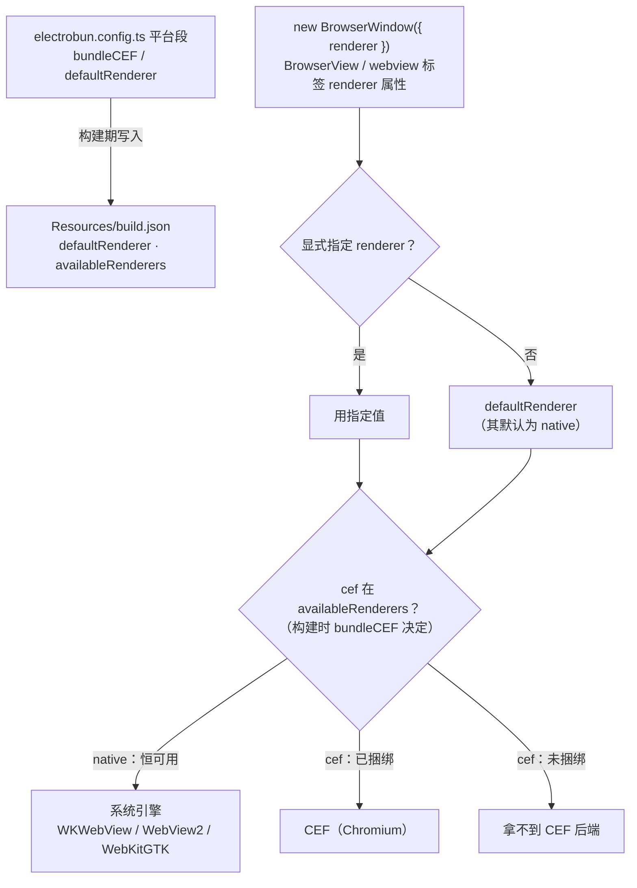

import { Canvas, Controls, Meta } from '@storybook/addon-docs/blocks';
import * as CrossPlatformStories from './cross-platform.stories';

<Meta of={CrossPlatformStories} name="Docs" />

# 跨平台与兼容性

Electrobun 的口号是「一份代码，三个平台，~14MB 安装包」——这句话成立的前提是三个平台都用**系统自带的 webview**，而系统的 webview 在三个平台上不是同一个东西：macOS 是 WebKit、Windows 是 WebView2、Linux 是 WebKitGTK，引擎不同，能力与版本也不同。框架提供的对冲手段是 `bundleCEF`：把 Chromium（CEF）打进应用包，换三平台近似的渲染与行为，代价是初始安装包从 ~14MB 涨到 ~100MB。本课把跨平台这件事拆成可回查的几张表：平台与引擎矩阵、一个窗口跑在哪个引擎上的判定链、行为与 API 的平台差异清单，以及跨平台构建模型（无交叉编译、CI 每平台原生构建）与版本兼容规则（`cefVersion` 覆盖）。平台段的字段结构在[构建配置](?path=/docs/build-config--docs)，签名与公证在[代码签名](?path=/docs/code-signing--docs)，差分更新机制在[自动更新](?path=/docs/updater--docs)，本课只讲「平台差异与取舍」这一层。

回查先看这组关键默认值与事实（与 1.18.1 包内类型定义及官方文档核对）：

| 键 / 事实 | 默认 / 取值 | 回查要点 |
| --- | --- | --- |
| `build.mac` / `win` / `linux` 的 `bundleCEF` | `false` | 决定 CEF 是否进包；不决定窗口是否使用它 |
| 平台段 `defaultRenderer` | `'native'` | 窗口未显式指定 renderer 时的默认后端 |
| 窗口 / 视图 / webview 标签的 `renderer` | 不传则取默认 | `'native'` 系统 webview，`'cef'` 捆绑 CEF；可逐窗口指定 |
| `build.cefVersion` | 未设置 | 用发行版内置的已测试 CEF；覆盖规则见「版本兼容」 |
| 初始自解压 bundle | 系统 webview ~14MB；捆绑 CEF ~100MB | 官方概数；增量更新仍可低至 ~14KB（差分更新） |
| `build.locales` | `"*"` | ICU 语言数据裁剪；仅 Linux / Windows 生效，macOS 用系统 ICU |
| Windows 架构 | 仅 x64 | ARM64 设备靠系统模拟跑 x64 二进制 |
| 构建目标 | 当前主机平台 | 无交叉编译；三平台产物靠 CI 在各自系统构建 |

## 快速上手

在 macOS 的 `tester/`（hello-world，三平台 `bundleCEF` 全 `false`）做一次「开与不开」的对照，10 分钟看清两件事：开 `bundleCEF` 是「CEF 进包」，不是「窗口换引擎」。

```bash
# 基线：默认配置（不捆绑 CEF）
bunx electrobun build --env=canary
du -sh artifacts/*        # 自解压 bundle 等分发文件：~14MB 量级
```

把 `electrobun.config.ts` 的 `build.mac.bundleCEF` 改为 `true`，再构建一次：

```bash
bunx electrobun build --env=canary    # 首次联网获取 CEF 运行时（CLI 从 Spotify CEF CDN 下载 minimal 发行版，缓存本地）
du -sh artifacts/*                    # 分发 bundle 涨到 ~100MB 量级
cat build/canary-macos-arm64/hello-world-canary.app/Contents/Resources/build.json
# {"defaultRenderer":"native","availableRenderers":["native","cef"],...}
```

三个可观察结果：分发体积翻数倍；`build.json` 的 `availableRenderers` 多出 `"cef"`；双击产物运行，窗口**仍是系统 WebKit**——`defaultRenderer` 默认 `'native'`，没有任何窗口主动用 CEF。「进包」与「使用」是两个开关，怎么用见下一节。看完把配置改回 `false`，后续课程按默认体积讲述。

## 平台矩阵

先记住每行事实的来源层级：架构与状态来自官方 Compatibility 页，引擎与建议来自 Cross-Platform 与 Bundling CEF 指南，字段与默认值以 1.18.1 包内类型定义为准。

目标平台与架构：

| 平台 | 架构 | 状态 | 说明 |
| --- | --- | --- | --- |
| macOS | ARM64 / x64 | 稳定 | 系统引擎 WebKit；支持 universal 二进制 |
| Windows | x64 | 稳定 | WebView2（Edge）或捆绑 CEF |
| Windows | ARM64 | 模拟运行 | x64 二进制经 Windows 系统模拟执行 |
| Linux | x64 / ARM64 | 稳定 | WebKitGTK 或捆绑 CEF |

引擎矩阵——`renderer: "native"` 与 `renderer: "cef"` 在各平台落到什么：

| 平台 | 系统引擎（native） | 捆绑选项（cef） |
| --- | --- | --- |
| macOS | WebKit（WKWebView），随 macOS 系统更新 | CEF（Chromium），可选；可与系统引擎按窗口混用 |
| Windows | WebView2（Edge 内核），系统托管更新 | CEF（Chromium），可选；可混用 |
| Linux | WebKitGTK（GTK 窗口） | CEF（Chromium），可选；官方建议开启，不可混用 |

开发平台有一个表述出入要知道：官方 Compatibility 页把 macOS 列为「构建 Electrobun 应用的必要平台」（Intel 与 Apple Silicon 都支持），Windows / Linux 只标注 development support available；而 Cross-Platform 指南和 Electrobun 自身的 release 流水线都按三平台原生构建矩阵工作。以「每个平台在自己的主机上构建」为工作模型最稳——这也是下一小节的结论。

### 无交叉编译与 CI

- `electrobun build` 永远面向**当前主机平台**：mac 上构建出 macOS 产物，不会产出 win / linux 包。`build.targets` 字段类型里有（`"current"` / `"all"` / 逗号分隔目标），但 1.18.1 的 CLI 不读取它（见[构建配置](?path=/docs/build-config--docs)常见问题）。
- 三平台分发 = CI 在每个平台的 runner 上跑同一条命令：

```bash
electrobun build --env=stable
```

- 官方推荐 GitHub Actions 三平台构建矩阵（开源项目免费额度覆盖全部支持平台），Electrobun 仓库自己的 release workflow 就是这个形态。原生构建顺带保证平台专属工具（代码签名、图标工具）在正确环境里工作。
- 产物按平台前缀命名（如 `stable-macos-arm64`、`canary-win-x64`）落在 `artifacts/`，形态与 env 通道见[构建与分发入门](?path=/docs/build-basics--docs)，更新文件如何消费这些前缀见[自动更新](?path=/docs/updater--docs)。

### Linux 的系统引擎缺口

Linux 默认用 GTK 窗口 + GTKWebKit webview——这是 Linux 上最接近「系统托管 webview」的形态，但有两个官方明说的问题：

1. **发行版依赖**：部分 Linux 发行版默认没有装 GTK / GTKWebKit，最终用户需要手动安装这些依赖才能运行你的应用。
2. **能力限制**：GTK / GTKWebKit 无法承载 Electrobun 更高级的 webview 层级与遮罩功能——`<electrobun-webview>` 标签的内嵌视图、复杂分层（见[webview 标签](?path=/docs/webview-tag--docs)）在默认引擎上会受限。

官方因此**强烈建议** Linux 发行版配置 `bundleCEF: true`，并且窗口与 webview 标签都显式用 `renderer="cef"`（此时走纯 X11 窗口）。这是三个平台中唯一有明确官方倾向的选择。

## renderer 选定

一个窗口最终跑在哪个引擎上，由构建期与运行期的输入共同决定，判定链只有三步：



- **构建期**：平台段 `bundleCEF` 决定 CEF 是否进包，并写进 `build.json` 的 `availableRenderers`——它恒含 `"native"`，仅当构建时开启了该平台的 `bundleCEF` 才含 `"cef"`；`defaultRenderer` 一并写入。主进程用 `await BuildConfig.get()` 读这两个值（`BuildConfig` API 见[构建配置](?path=/docs/build-config--docs)）。
- **运行期**：`new BrowserWindow({ renderer })`、`BrowserView` 构造参数、`<electrobun-webview renderer="…">` 都接受 `'native' | 'cef'`；未指定时取 `defaultRenderer`，再兜底 `'native'`（1.18.1 包内实现的兜底链为 `options.renderer ?? buildConfig.defaultRenderer ?? "native"`）。
- **逐窗口指定**是混搭的基础：

```ts
const cefWindow = new BrowserWindow({
  url: "views://main/index.html",
  renderer: "cef", // 捆绑的 CEF
});
const systemWindow = new BrowserWindow({
  url: "views://secondary/index.html",
  renderer: "native", // 系统引擎：mac 上是 WKWebView
});
```

```html
<!-- 视图页面里的 webview 标签同样可以逐个指定 -->
<electrobun-webview src="https://example.com" renderer="cef"></electrobun-webview>
```

- **混用限制**：macOS / Windows 捆绑 CEF 后可以逐窗口、逐标签混用（部分窗口走系统引擎省内存，部分窗口走 CEF 要一致性）；**Linux 不支持混用**——开启 `bundleCEF` 的构建会产出 GTKWebKit 与 CEF 两份二进制，应用内所有 webview 必须统一用一种 renderer。

下面的示意在浏览器里复现这条判定链：平台、三平台 `bundleCEF` 开关、`defaultRenderer` 与窗口指定共同决定实际后端、可用渲染器列表和体积量级。真实行为以对应平台上的构建与运行结果为准。

<Canvas of={CrossPlatformStories.RendererResolution} />
<Controls of={CrossPlatformStories.RendererResolution} />

| 读者操作 | 可观察证据 |
| --- | --- |
| 默认状态（mac、`mac.bundleCEF` 关、窗口未指定） | WKWebView · ~14MB——`tester/` 形态即此 |
| 「目标平台」切到 win（预设 `win.bundleCEF` 开），窗口仍「未指定」 | WebView2 · ~100MB——CEF 已进包但没人用，体积照付 |
| 回到 mac，「窗口 renderer」切 `cef`（mac 未捆绑） | 判定链第三步 ✗：`cef` 不在 `availableRenderers`，拿不到 CEF 后端 |
| 打开「mac.bundleCEF」再看同一指定 | 实际后端变为 CEF（Chromium） |
| 「目标平台」切 linux（预设已捆绑），把「平台段 defaultRenderer」切 `cef`、「窗口 renderer」切 `native` | 第四步 ✗：Linux 不支持混用，提示统一 renderer |
| linux 下关掉「linux.bundleCEF」 | WebKitGTK · ~14MB，并提示发行版依赖与层级能力缺口 |
| 打开 Show code | 看到该 Canvas 实际执行的 `renderer-resolution.ts` |

课程目录的 `renderer-per-window.ts` 是完整的主进程范例：先打印 `BuildConfig.get()` 的 renderer 信息，再先后打开一个 `native` 窗口和一个 `cef` 窗口。把它的内容放进 hello-world 工程的 `src/bun/index.ts`、`build.mac.bundleCEF` 设为 `true` 后 `bun start`，可以核对：

- 终端先打印 `defaultRenderer: native` 与 `availableRenderers: ["native","cef"]`。
- 先弹出 native 窗口（WKWebView），2 秒后弹出 cef 窗口（Chromium），两个窗口加载同一 `views://` 页面，可直观对照两个引擎的渲染。
- 这份混用只在 macOS / Windows 成立；Linux 上要把所有窗口统一成一种 renderer。

## bundleCEF 取舍

先把账算清。官方给的量级：

| | 系统 webview | 捆绑 CEF |
| --- | --- | --- |
| 初始自解压 bundle | ~14MB | ~100MB |
| 增量更新 | ~14KB 级差分补丁 | 同样 ~14KB 级（差分只传差异） |
| 引擎版本 | 随用户系统漂移 | 随你的发布锁定 |
| 内存与观感 | 更低、平台原生 | 更高、三平台一致的 Chromium |

一次性下载贵约 7 倍，但**持续更新成本不变**——差分更新让用户为 CEF 付的只是第一次下载（机制见[自动更新](?path=/docs/updater--docs)）。所以取舍的主战场是「首次下载体积」与「渲染一致性」，不是更新流量。

Windows 值得单独看：WebView2 就是 Edge 的内核，系统托管更新，体积与安全性都占优；但用户机器上的 WebView2 版本，与 Electrobun 二进制构建时对齐的版本、与你需要的 Chromium API 之间可能漂移。如果你的应用依赖某个特定 Chromium 行为，捆绑 CEF 是把版本锁在自己手里的唯一办法。

两个官方清单，直接对着选：

- **选 CEF**：三平台一致渲染；高级合成能力（尤其 Linux）；系统 webview 里还没有的新 Chromium 特性；复杂 Web 应用的可预测行为；完整的现代 Web 标准支持。
- **选系统 webview**：最小安装包（~14MB vs ~100MB）；原生平台集成与观感；简单应用更低的内存占用；用户更快的首次下载。

判断主线：**默认系统引擎起步；Linux 发行版或「三平台渲染一致」成为硬需求时，再为对应平台付 CEF 的体积**。这也是官方示例的形态——`mac: { bundleCEF: false }`、`win: { bundleCEF: true }`、`linux: { bundleCEF: true }`：mac 吃系统 WebKit 的小包，win / linux 用 CEF 换一致性与能力。

## 差异清单

写一次跨平台应用，下面这些点在上线前值得逐平台过一遍。

### 行为差异

| 差异点 | 表现 | 处理 |
| --- | --- | --- |
| webview hidden 与 passthrough | mac 上两项独立：隐藏后默认仍拦截点击，要穿透需再开 passthrough；win / linux 上设为 hidden 会自动启用 passthrough——隐藏即穿透，没有独立开关（官方指南示例的 `webviewSetPassthrough` 在 win / linux 无效；1.18.1 包内两者都是原生绑定） | 依赖「隐藏但拦截点击」的交互只能按 mac 能力设计 |
| 无边框窗口 | frameless 行为因 OS 而异（官方指南提示，未展开细节） | 自定义 chrome 上线前逐平台核对 |
| Windows 控制台 | 应用按 GUI 子系统构建，双击启动不弹控制台；dev 构建自动附加父控制台；canary / stable 构建要看 `console.log` 需先 `set ELECTROBUN_CONSOLE=1` 再启动，让启动器继承 stdout / stderr。mac / linux 终端输出始终可用，该变量无影响 | 生产构建的问题复现用环境变量把日志接回终端 |

### API 支持差异

| 能力 | macOS | Windows | Linux | 展开 |
| --- | --- | --- | --- | --- |
| `app.urlSchemes` 深链 | 完整（应用需在 `/Applications`） | 未支持 | 未支持 | [构建配置](?path=/docs/build-config--docs) app 段 |
| `app.fileAssociations` 文件关联 | 完整（生成 `CFBundleDocumentTypes`） | 未支持 | 未支持 | 同上；事件处理见[应用生命周期](?path=/docs/app-lifecycle--docs) |
| ContextMenu role 与弹出 | 完整 | role 部分支持 | `showContextMenu` 尚不支持 | [上下文菜单](?path=/docs/context-menu--docs) |
| Notification `subtitle` | 显示在标题与正文之间 | 作为附加行并入正文 | 同 Windows | [通知与对话框](?path=/docs/notifications-dialogs--docs) |
| `build.locales` | 无效果（用系统 ICU） | 生效 | 生效 | [构建配置](?path=/docs/build-config--docs) |
| menuRoles 平台角色 | 映射 NSResponder | 有平台差异 | 有平台差异 | [应用菜单](?path=/docs/application-menu--docs) |
| Tray | 可用（类型内含「平台可能不可用」的运行时提示，官方未给平台清单） | 同左 | 同左 | [系统托盘](?path=/docs/tray--docs) |

## 版本兼容

官方 Compatibility 页给出框架自身构建依赖的版本表：

| 依赖 | 官方页标注 | 说明 |
| --- | --- | --- |
| Bun | 1.3.0 | 主进程运行时。该页数字滞后于发行版：`tester/` 实测 1.18.1 产物的 `build.json` 写 `bunVersion: 1.3.13` |
| Zig | 0.13.0 | 用于构建 Electrobun 原生核心，应用开发者不直接接触 |
| CEF | 125.0.22（可选捆绑） | 捆绑时的 Chromium。发行版实际内置版本以 release tag 源码 `package/build.ts` 的 `CEF_VERSION` 为准 |

结论：查兼容性别只看 Compatibility 页。两个更可靠的一手来源：运行时 `build.json` 的 `bunVersion`（你这个发行版真实带的 Bun）；release tag 的 `package/build.ts` `CEF_VERSION`（这个发行版测试过的 CEF）。

`cefVersion` 覆盖（字段属于 `build` 段，默认不设置）：

- **格式**：`CEF_VERSION+chromium-CHROMIUM_VERSION`，如 `"144.0.11+ge135be2+chromium-144.0.7559.97"`；取值要匹配 Spotify CEF builds（cef-builds.spotifycdn.com）上 **minimal** 发行版的版本字符串。
- **机制**：设置后 CLI 直接从 Spotify CDN 下载 minimal 发行版（共享库、资源包、locales），解压进本地依赖缓存，机器上不需要编译工具。Electrobun 的 `process_helper` 随发行版预编译、通过 CEF 的稳定 C API 与 CEF 通信——换 CEF 版本不需要重编译 helper，前提是 C API 兼容。
- **风险三档**（官方规则）：同主版本（144.x → 144.y）安全；相邻主版本（144 → 145）通常可行但要充分测试；相距多个主版本（130 → 145）不兼容风险高。类型注释另建议覆盖前查 electrobun-cef-compat 兼容矩阵。
- **两个动机**：钉住旧版（新 CEF 移除了你依赖的 API，按自己的节奏迁移）；提前上新（安全修复或新特性等不及 Electrobun 采纳）。
- **缓存与回退**：按平台 + 版本缓存本地；改版本自动重新下载；删掉该键即恢复发行版内置版本。

## 最佳实践

- **平台段默认全关起步，按平台逐个开。** 官方平衡示例就是 `mac` 关、`win` / `linux` 开——不是全有或全无；`bundleCEF` 是构建期决定，改配置要重新构建才进包。
- **Linux 发行版默认按 `bundleCEF: true` + 统一 `renderer: "cef"` 设计。** 除非应用只用简单单视图、且接受提示用户安装 GTK / GTKWebKit 依赖。
- **渲染一致性是硬需求（含「依赖特定 Chromium API」）才付 CEF 体积**；只在个别窗口需要时，mac / win 用按窗口 `renderer` 指定，不全局切换。
- **覆盖 `cefVersion` 只在必要时做**：同主版本内换补丁版安全，跨主版本先在真实应用里测试；出问题回退就是删键。
- **Windows 上调试生产构建**先 `set ELECTROBUN_CONSOLE=1` 再启动，别在「看不到日志」上浪费时间。

## 常见问题

- 照官方 Bundling CEF 文档的示例抄配置，`satisfies ElectrobunConfig` 报了类型错？
  官方该页第一个示例的平台段键写的是 `macos:`，与 1.18.1 类型定义不符——合法键是 `mac`（`build.mac`）。以类型校验为准（官方同页后面的 `cefVersion` 示例用的就是 `mac`）。
- 窗口配了 `renderer: "cef"`，却没有任何 CEF 效果？
  `availableRenderers` 是否含 `"cef"` 由**构建时**的 `bundleCEF` 决定，不是运行时按需下载。检查对应平台段的 `bundleCEF: true` 是否已设置并重新构建，然后用 `BuildConfig.get()` 或产物 `build.json` 核对 `availableRenderers`。
- Linux 上 `<electrobun-webview>` 标签、复杂的视图层级不工作？
  默认的 GTKWebKit 承载不了 Electrobun 的高级 webview 层级与遮罩功能（官方明说的限制）。开 `build.linux.bundleCEF: true` 并让所有窗口与 webview 用 `renderer="cef"`。
- Linux 最终用户启动应用报缺 GTK / GTKWebKit？
  部分发行版默认不装这两个包。要么在安装文档里让用户补依赖，要么 `bundleCEF: true` 用自带 CEF 摆脱系统 webview 依赖。
- Windows on ARM 设备能装我的应用吗？
  能，但跑的是 x64 包：Electrobun 只出 x64 Windows 构建，ARM64 设备通过系统模拟执行（平台引导层在 Windows 上恒按 x64 处理）。

## 总结回顾

摘要：

Electrobun 的跨平台 = 一份代码 + 每平台自己的系统 webview（mac WebKit、win WebView2、linux WebKitGTK），一致性用 `bundleCEF` 把 CEF 打进包来换（~14MB → ~100MB，增量更新仍是 KB 级差分）。窗口跑在哪个引擎上由三步判定：构建期 `bundleCEF` 写入 `build.json` 的 `availableRenderers` → 运行期窗口 `renderer` 指定（未指定取 `defaultRenderer`，兜底 `native`）→ `cef` 仅在已捆绑时可用。mac / win 可逐窗口混用两种引擎，Linux 不允许（两份二进制必须统一），且 Linux 默认引擎有发行版依赖与层级能力缺口，官方建议发行版直接捆绑 CEF。构建永远面向当前主机、无交叉编译，三平台产物靠 CI 在各自系统跑同一条 `electrobun build`。平台差异集中在 webview hidden/passthrough 语义、Windows 控制台行为和一批 mac-only / 部分支持的 API（urlSchemes、fileAssociations、ContextMenu 等）；版本兼容以 `build.json` 的 `bunVersion` 与 release tag 的 `CEF_VERSION` 为一手依据，`cefVersion` 覆盖按同主安全 / 相邻测试 / 相距高风险三档判断。

一句话：

> `bundleCEF` 买的不是功能而是确定性——约 100MB 把你选定的一份 Chromium 锁进应用包，三平台渲染随之趋于一致；不买就用 ~14MB 的系统引擎，接受 WKWebView / WebView2 / WebKitGTK 的差异并按矩阵回查每个平台的能力边界。

知识要点：

- 三个平台的系统 webview 分别是什么？各自的更新由谁托管？
- 一个窗口最终跑在哪个引擎上，判定链是哪三步？`availableRenderers` 什么时候包含 `"cef"`、在哪里核对？
- `bundleCEF` 与 `defaultRenderer` 各自决定什么？开了 `bundleCEF` 之后窗口默认用什么引擎？
- macOS / Windows 与 Linux 在混用 renderer 上的差异是什么？
- 官方为什么强烈建议 Linux 发行版开 `bundleCEF`？默认引擎有哪两个问题？
- 无交叉编译的前提下，三平台分发产物怎么来？`build.targets` 在 1.18.1 为什么指望不上？
- `cefVersion` 覆盖的三档风险规则是什么？回退到发行版默认怎么做？
- Windows 上调试 canary / stable 构建要看 `console.log`，第一步做什么？

## 参考资料

- [Cross-Platform Development — 官方跨平台指南](https://framework.blackboard.sh/electrobun/guides/cross-platform-development/)
- [Compatibility — 官方兼容性矩阵](https://framework.blackboard.sh/electrobun/guides/compatability/)
- [Bundling CEF — 官方 CEF 捆绑指南](https://framework.blackboard.sh/electrobun/apis/bundling-cef/)
- electrobun 1.18.1 包内一手资料：`dist/api/bun/ElectrobunConfig.ts`（平台段与版本覆盖字段及默认值）、`dist/api/bun/core/BuildConfig.ts`（availableRenderers 语义）、`dist/api/shared/platform.ts`（Windows 恒 x64）、`dist/api/bun/core/ContextMenu.ts` 顶部注释（上下文菜单平台支持）、`dist/api/bun/proc/native.ts`（webviewSetHidden / webviewSetPassthrough 原生绑定）。
