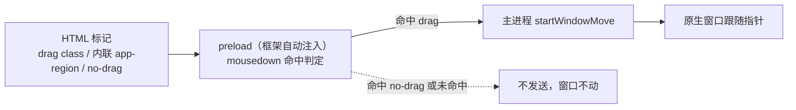
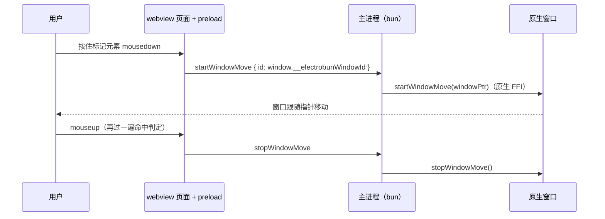

import { Canvas, Controls, Meta } from '@storybook/addon-docs/blocks';
import * as DraggableRegions from './draggable-regions.stories';

<Meta of={DraggableRegions} name="Docs" />

# 拖拽区域

[窗口选项](?path=/docs/window-options--docs)里 `titleBarStyle: "hidden"` / `"hiddenInset"` 去掉原生标题栏后，窗口拖动并没有消失，而是交给了页面：给 HTML 元素加一个拖拽标记，框架在每个 webview 里自动注入的 preload 会监听 `mousedown` / `mouseup`，命中标记就把「移动窗口」的内部 RPC 发给主进程，由原生侧接管窗口移动。本课讲清三类声明（drag class、内联 `app-region`、no-drag 排除）、命中判定链，以及一套完整的自绘标题栏组合。它没有任何用户侧 JS API——全部是 HTML 约定。



开场参考表（写法与 1.18.1 包内 `dist/api/bun/preload/dragRegions.ts` 判定实现核对过；文档站只写了两个 class）：

| 声明 | 写在哪 | 判定依据 | 回查要点 |
| --- | --- | --- | --- |
| `.electrobun-webkit-app-region-drag` | class 属性 | class 祖先链 | 文档路线，推荐；样式表定义外观互不影响 |
| `style="app-region: drag"` | 内联 style 属性 | style 属性文本匹配 | 样式表里写 `app-region` **不生效** |
| `.electrobun-webkit-app-region-no-drag` | class 属性 | class 祖先链，先于 drag 判定 | 包住交互控件；命中即否决 |
| `style="app-region: no-drag"` | 内联 style 属性 | 同上 | 同上 |

## 快速上手

任意可运行的 electrobun 工程（如[第一个窗口](?path=/docs/first-window--docs)的 hello-world），两处改动。主进程给窗口去掉标题栏：

```ts
import { BrowserWindow } from "electrobun/bun";

new BrowserWindow({
	title: "拖拽区域",
	url: "views://mainview/index.html",
	frame: { width: 480, height: 320, x: 200, y: 160 },
	titleBarStyle: "hidden", // 无标题栏、无原生控件——拖拽交给页面
});
```

页面顶部加一条可拖拽横幅（`src/mainview/index.html`）：

```html
<div
	class="titlebar electrobun-webkit-app-region-drag"
	style="height: 36px; background: #141925; color: #e6e9f0;
		display: flex; align-items: center; padding: 0 12px; user-select: none;"
>
	按住我拖动窗口
</div>
```

`bun start`（或 `bun run dev`）后逐条核对：窗口没有标题栏；按住横幅拖动，窗口跟着走，松开停在原地；横幅以外的页面区域怎么拖都不动。

## 标记拖拽区域

preload 在 `document` 上监听鼠标按下，按下时从**事件目标沿祖先链**找标记（等价 `Element.closest`）——任一祖先带 drag 标记即可拖，不必点在标记元素本身，所以标记整条标题栏后标题文字自动可拖。两条标记路线：

### class 标记

文档给出的路线，也是推荐写法：把 `electrobun-webkit-app-region-drag` 挂到任意元素的 class 属性。

```html
<div class="titlebar electrobun-webkit-app-region-drag">
	<span>标题文字（祖先命中，同样可拖）</span>
</div>
```

- 判定只看 class 名：样式表里给 `.titlebar` 定义外观、把 drag class 写进样式表选择器都互不影响，工程化最省心。
- 子元素点击经由祖先链命中，无需逐个标记。

### app-region 内联样式

文档未写、但 1.18.1 包内实现支持的路线：preload 用属性选择器 `[style*="app-region"][style*="drag"]` 对 **style 属性文本**做子串匹配。

```html
<div style="app-region: drag; height: 36px;">按住拖动</div>
```

这条路线的判定推论也是常见坑的来源：

- 写在样式表里的 `.titlebar { app-region: drag }` 不会进入元素的 style 属性，**不生效**——要拖拽就用上面两种标记；
- 经 `el.style.setProperty("app-region", "drag")` 设置会反映进 style 属性，生效；
- 匹配的是子串：`no-drag` 文本同样包含 `drag` 子串，但 no-drag 判定先行，不会误判成可拖。

## 排除交互元素

拖拽区域内通常还有按钮（自绘红绿灯、搜索框）。no-drag 在 drag **之前**判定，从按下目标沿祖先链命中任何一个 no-drag 就一票否决——即使外层同时是 drag 区域：

```html
<div class="titlebar electrobun-webkit-app-region-drag">
	<span>标题</span>
	<div class="window-controls electrobun-webkit-app-region-no-drag">
		<button id="closeBtn"></button>
		<button id="minimizeBtn"></button>
		<button id="maximizeBtn"></button>
	</div>
</div>
```

要点：

- 两种写法与 drag 对称：`.electrobun-webkit-app-region-no-drag` class 或内联 `style="app-region: no-drag"`；
- 加在控件本身或其任何祖先上都行（同样走祖先链）——实践中包住整组控件最省心；
- 不排除时按钮仍可点击（preload 不拦截事件、不 `preventDefault`），但按下按钮同样会命中 drag 区域、启动窗口移动——表现就是「点按钮时窗口被拖走」。

## 命中判定

把 1.18.1 preload 的判定逻辑（祖先链 + no-drag 先判 + style 属性文本匹配）原样搬进浏览器：按住示意窗口的任意位置拖动，命中标记时小窗口跟随指针，与真实窗口行为一致。

<Canvas of={DraggableRegions.DragHitTest} />
<Controls of={DraggableRegions.DragHitTest} />

| 读者操作 | 可观察证据 |
| --- | --- |
| 默认（class 标记 + no-drag class），按住标题栏空白或标题文字拖动 | 小窗口跟随指针；readout 显示命中 `.electrobun-webkit-app-region-drag`，内部 RPC `startWindowMove → stopWindowMove` |
| 按住三个圆点按钮拖动 | 窗口不动：命中 no-drag，一票否决 |
| 控件排除切到「不排除」，再按住按钮拖动 | 窗口被拖走——控件未排除的真实后果 |
| 标记方式切到「内联 app-region」 | 标题栏照样可拖，readout 显示 style 属性路线命中 |
| 标记方式切到「仅样式表声明」 | 标题栏拖不动：判定只读 class 与 style 属性，样式表规则不参与 |
| 按住内容区拖动 | 永远拖不动：内容区没有标记 |

判定链总结（与 preload 实现一致）：`mousedown` → ① 目标或祖先带 no-drag（class 或 style 属性）？命中 → 否决，不发送；② 目标或祖先带 drag 标记（class 或 style 属性）？命中 → 发送 `startWindowMove`；③ 都不命中 → 正常点击。`mouseup` 到达时**再过一遍同样的判定**，命中 drag 区域才发送 `stopWindowMove`——窗口跟随指针期间抬起，压着的自然还是原区域；判定从不读指针轨迹，只看当下事件目标的祖先链。

## 工作机制

一次成功拖拽的完整链路：



机制事实（对照 1.18.1 包内实现）：

- **不需要写任何 JS**：preload 由框架在创建 webview 时注入，`initDragRegions()` 自动挂载监听。文档把这个能力表述为「实例化 `Electroview` 后即配置好」——标准视图初始化（`new Electroview(...)`，见 [Electroview](?path=/docs/electroview--docs)）之外没有额外步骤。
- **移动哪个窗口**：RPC 携带 `window.__electrobunWindowId`（preload 注入的窗口 id），主进程据此定位原生窗口。嵌套 webview 标签（见 [webview 标签](?path=/docs/webview-tag--docs)）里的拖拽区域移动的是它**宿主的窗口**。
- **与 titleBarStyle 无关**：判定链不检查标题栏样式——带原生标题栏的窗口里标记同样触发原生移动；只是实际用途都在 `hidden` / `hiddenInset`。
- **sandbox webview 没有拖拽区域**：`sandbox: true` 的 webview 注入的是最小 preload（只保留事件能力），不含 `initDragRegions`。

## 自定义标题栏

把本课内容组合成完整的自绘标题栏：`hidden` 窗口 + 整条标题栏挂 drag + 控件容器挂 no-drag + 三个窗口控制按钮经自定义 RPC 调主进程（RPC 机制见[自定义 RPC](?path=/docs/rpc--docs)）。桌面范例四个文件在课程目录：

| 文件 | 放到工程 | 职责 |
| --- | --- | --- |
| `titlebar-rpc.ts` | `src/shared/types.ts` | 窗口控制消息的 RPC schema |
| `titlebar-window.ts` | `src/bun/index.ts` | `hidden` 窗口 + 消息处理（close / minimize / toggleMaximize） |
| `titlebar-view.html` | `src/mainview/index.html` | 拖拽标记、no-drag 控件与按钮样式 |
| `titlebar-view.ts` | `src/mainview/index.ts` | Electroview + `rpc.send` 接线 |

归位后 `bun start` 核对：按住标题栏空白或标题文字拖动窗口；三个圆点按钮分别关闭 / 最小化 / 最大化-还原；按住按钮拖动窗口不动。

组合要点：

- **粒度**：drag 挂整条标题栏、no-drag 只包控件容器——「大区域 + 排除孤岛」比逐个小块加标记省心，也不会漏掉标题文字；
- **文本选中**：拖拽机制不阻止选中，标题栏要自己加 `user-select: none`，否则拖动时会选中标题文字；
- **窗口控制**：关闭 / 最小化 / 最大化用 `win.close()` / `win.minimize()` / `win.isMaximized() ? win.unmaximize() : win.maximize()`（方法清单见[窗口选项](?path=/docs/window-options--docs)）；
- **保留系统红绿灯**：改用 `titleBarStyle: "hiddenInset"` + `trafficLightOffset` 给内容让位（见[窗口选项](?path=/docs/window-options--docs)），拖拽标记的写法完全不变，只是不再需要自绘关闭 / 最小化按钮。

## 最佳实践

- **标记路线选 class**：`.electrobun-webkit-app-region-drag` 与样式表工程天然兼容；内联 `app-region` 只适合内联样式场景，样式表里写 `app-region` 是无效路线。
- **大区域 + no-drag 孤岛**：整条标题栏挂 drag，控件容器挂 no-drag；逐个元素标 drag 会漏子元素，也难维护。
- **外观路线配套**：完全自绘（本课形态）选 `hidden`；保留系统红绿灯选 `hiddenInset` + `trafficLightOffset` 让位——两种路线下拖拽标记写法相同，差异只在要不要自绘窗口按钮。

## 常见问题

- 样式表里写了 `.titlebar { app-region: drag }`，窗口拖不动。
  判定只读元素的 class 属性与 style 属性文本，样式表规则不参与：改用 `.electrobun-webkit-app-region-drag` class（或内联 `style="app-region: drag"`）。
- 标题栏按钮能点，但按下时窗口跟着鼠标走。
  按钮在 drag 区域内且未被排除：给控件本身或其容器加 `.electrobun-webkit-app-region-no-drag`（no-drag 先于 drag 判定，一票否决）。
- 拖动时标题文字被选中。
  机制不阻止文本选中：给拖拽区域加 `user-select: none`。
- `sandbox: true` 的 webview 里加了标记也拖不动。
  sandbox 注入的是最小 preload，没有拖拽区域监听；把页面放进非 sandbox 的 webview（sandbox 的取舍见[窗口选项](?path=/docs/window-options--docs)）。
- 带原生标题栏的窗口里，标记也会拖动窗口吗？
  会——判定链不检查 `titleBarStyle`，`mousedown` 命中就调用原生移动。这不是故障；该能力本就为无边框窗口准备，常规窗口不必加标记。

## 总结回顾

摘要：

无边框窗口的拖动由页面标记承担：drag 标记有两条路线——文档推荐的 `.electrobun-webkit-app-region-drag` class 与内联 `style="app-region: drag"`（判定读的是 style 属性文本，样式表规则不生效）；交互控件用 no-drag class 或内联写法排除，且先于 drag 判定、一票否决。命中判定从按下目标沿祖先链进行，preload 在命中时发送 `startWindowMove`、松开时发送 `stopWindowMove`，主进程转发给原生侧完成窗口移动，全程无需用户侧 JS。机制上不检查 `titleBarStyle`，但 sandbox webview 不注入该监听。完整自绘标题栏 = `hidden` 窗口 + 大区域 drag + 控件 no-drag + RPC 窗口控制按钮。

一句话：

> 拖拽区域是纯 HTML 约定：drag 标记（class 或内联 style 属性）声明在哪按住可拖、no-drag 先判一票否决，preload 命中即发 `startWindowMove` 让原生接管——样式表里的 `app-region` 永远不参与判定。

知识要点：

- 让一个元素可拖拽有哪两种写法？各自的判定依据是什么？
- 为什么样式表里的 `app-region: drag` 不生效？
- 交互控件如何从拖拽区域排除？判定顺序是什么？
- 一次成功拖拽从 `mousedown` 到窗口移动经过哪些环节？`__electrobunWindowId` 决定什么？
- 拖拽区域需要哪些前置与边界（preload 注入、sandbox、titleBarStyle）？
- 自绘标题栏的窗口控制按钮为什么需要 RPC？关闭 / 最小化 / 最大化各用哪个窗口方法？

## 参考资料

- [Electrobun 文档：Draggable Regions](https://framework.blackboard.sh/electrobun/apis/browser/draggable-regions/)
- [Electrobun 文档：Electroview Class](https://framework.blackboard.sh/electrobun/apis/browser/electroview-class/)（视图侧 `defineRPC` 与 `rpc.send` 接线依据）
- [Electrobun 文档：BrowserWindow API](https://framework.blackboard.sh/electrobun/apis/browser-window/)（`titleBarStyle`、窗口控制方法与 bun 侧 `BrowserView.defineRPC`）
- electrobun 1.18.1 包内实现：`dist/api/bun/preload/dragRegions.ts`（判定逻辑）、`dist/api/bun/proc/native.ts`（`startWindowMove` / `stopWindowMove` 原生转发与 preload 注入）、`dist/api/bun/preload/index-sandboxed.ts`（sandbox 最小 preload 边界）
