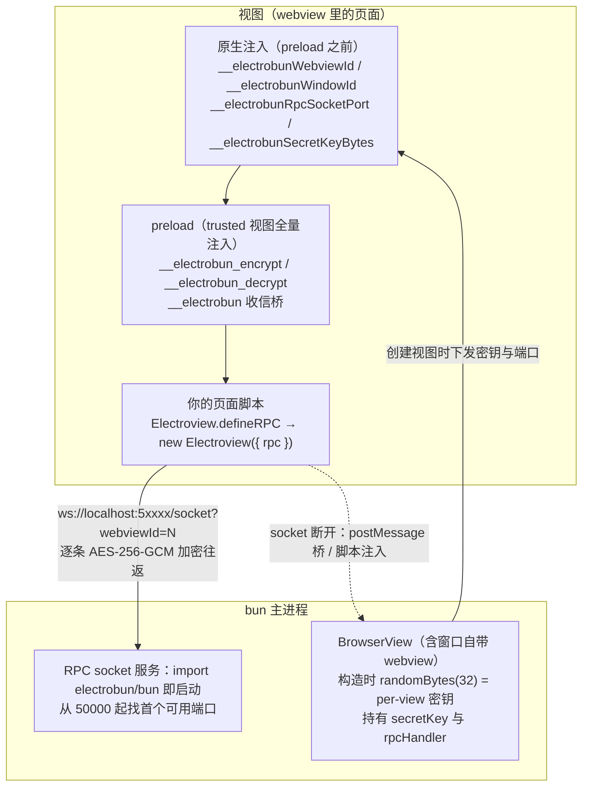

import { Canvas, Controls, Meta } from '@storybook/addon-docs/blocks';
import * as ElectroviewStories from './electroview.stories';

<Meta of={ElectroviewStories} name="Docs" />

# Electroview

视图层（webview 里运行的页面）与主进程对话的入口是 `electrobun/view` 包里的 **Electroview** 类：构造它，就是把共享类型定义的 rpc 接到通道上。这条通道不是普通 postMessage——每条 RPC 消息都用该视图自己的 AES-256-GCM 密钥加密，经本地 WebSocket 往返；socket 断开时自动回落到原生桥，消息照送。页面上那组 `window.__electrobun*` 全局属性由 preload 注入，**无论是否实例化 Electroview 都存在**。本课讲清三件事：初始化三步怎么接、全局属性各自是谁给的、加密 socket 通道两端如何配合。读完你能预测一条消息走哪条路、线上载荷长什么样、为什么不需要 TLS。



回查时先看这组关键事实（文档站只覆盖其中一部分，未覆盖项均与 1.18.1 包内类型和实现核对过）：

| 关键事实 | 值 / 行为 | 回查要点 |
| --- | --- | --- |
| 导入方式 | `import { Electroview } from "electrobun/view"`（默认导出 `Electrobun.Electroview` 是同一个类） | 视图侧专用；bun 主进程侧没有这个类 |
| 构造选项 | 只有 `rpc`：`new Electroview({ rpc })` | 构造即连接 socket、接管收信、绑定传输 |
| socket 地址 | `ws://localhost:{__electrobunRpcSocketPort}/socket?webviewId={__electrobunWebviewId}` | 端口由主进程从 50000–65535 扫首个可用 |
| 加密算法 | AES-256-GCM：32 字节 per-view 密钥、每条消息 12 字节随机 IV、16 字节 tag | 线上形态是 `{ encryptedData, iv, tag }`，三个字段全 base64 |
| `ws://` 不加 TLS | 有意设计 | 消息已逐条加密，包内源码注释明确说明 TLS 冗余 |
| 断线回落 | 视图→bun：`__electrobunBunBridge.postMessage`；bun→视图：注入 `window.__electrobun.receiveMessageFromBun(...)` | socket 恢复 OPEN 后自动回到加密通道，业务无感 |
| 请求超时 | `maxRequestTime` 默认 `1000`ms，两侧 defineRPC 均可调，传 `Infinity` 关闭 | 官方 BrowserWindow 示例取 5000 |
| 文档承诺的全局属性 | 只有 `__electrobunWebviewId`、`__electrobunWindowId` 两个 | 其余 `__electrobun*` 以包内类型为准，属内部契约 |

## 快速上手

课程目录的 `electroview-roundtrip/` 是完整可运行工程（macOS + Bun，electrobun 1.18.1），把「共享类型 → 两侧 defineRPC → `new Electroview({ rpc })` → 双向通信」的最小闭环跑一遍，并在页面顶部直接读出三个全局属性：

```bash
cd cheatsheets/electroview/electroview-roundtrip
bun install
bun start
```

| 操作 | 可观察证据 |
| --- | --- |
| 应用启动 | 终端打出 `[bun] RPC socket 服务已就绪：ws://localhost:5xxxx/socket`；窗口页面顶部列出 `__electrobunWebviewId` / `__electrobunWindowId` / `__electrobunRpcSocketPort` 三个读数 |
| 页面加载完成 | 视图向 bun 发单向消息 `viewReady`；终端打出 `[bun] 视图就绪：webviewId=… socketPort=…` 与「socketPort 与主进程一致：true」；随后页面收到 bun 反向下发的 `bunSays` 消息并追加一行 |
| 点击窗口里的按钮 | 发起 `rpc.request.logAndEcho("ping")`：终端打出 `[bun] 收到视图 request logAndEcho(ping)`，页面追加 bun 返回的 `receivedAt` 时间戳 |

真实窗口行为以这个工程为准；本页后面的 Canvas 只示意消息通道本身，不开窗口。

## 初始化

视图侧的接线固定三步，全部放在视图入口模块的顶层（preload 先于页面脚本执行，此时全局属性已就绪）：

```ts
// src/view/index.ts
import { Electroview } from "electrobun/view";
import type { RoundtripRPC } from "../shared/rpc"; // 共享类型，bun 侧 import 同一份

// ① 实现视图侧入口：bun 发来的 request / message 在这里处理
const rpc = Electroview.defineRPC<RoundtripRPC>({
  handlers: {
    messages: { bunSays: ({ text }) => console.log(text) },
  },
});

// ② 构造 Electroview，把 rpc 接到通道上
const electroview = new Electroview({ rpc });

// ③ 之后就能调用 bun 侧入口
electroview.rpc.request.logAndEcho({ label: "ping" }); // 有返回值的请求
electroview.rpc.send.viewReady({ ... });                // 单向消息
```

bun 侧的对称写法是 `BrowserView.defineRPC` 创建 rpc 后传给 `BrowserWindow` 的 `rpc` 选项（挂在窗口自带的 webview 上），完整代码见快速上手工程。构造函数内部依次做三件事：

1. **连接 socket**：向 `ws://localhost:{__electrobunRpcSocketPort}/socket?webviewId={id}` 发起 WebSocket 连接；
2. **接管收信**：把 `window.__electrobun.receiveMessageFromBun` 换成自己的实现——bun 经脚本注入回落路径下发的消息从这里进；
3. **绑定传输**：`rpc.setTransport(...)`，此后 `rpc.send` / `rpc.request` 的每条消息都走这条传输。

时机上不用等 socket：socket 连接是异步的，OPEN 之前发出的消息自动走 postMessage 回落，业务代码无感。反过来，**不实例化 Electroview 时**全局属性依然在（preload 照常注入），但视图侧没有可用的 rpc；bun 下发的用户 RPC 消息落进 preload 的默认 handler，只在控制台打印 `receiveMessageFromBun (no handler): ...`。

### defineRPC 静态方法

`Electroview.defineRPC<Schema>(config)` 是视图侧的预配置封装，包装了通用的 `defineElectrobunRPC("webview", ...)`：

| `config` 字段 | 类型 | 说明 |
| --- | --- | --- |
| `handlers.requests` | 视图侧 request 处理器 | bun 调视图函数时执行，可返回值 |
| `handlers.messages` | 视图侧 message 处理器 | 支持 `"*"` 通配符接收全部单向消息 |
| `maxRequestTime` | `number`（默认 `1000`） | 视图向 bun 发 request 的超时，`Infinity` 关闭 |

它比通用封装多做两件事：一是预设了 webview 视角——`rpc.request` / `rpc.send` 的可用名称取自 schema 的 `bun` 段（bun 侧入口），`handlers` 实现的是 `webview` 段（bun 主动调用的入口）；二是**注入一个内置 request 处理器 `evaluateJavascriptWithResponse`**——这是 bun 端在视图里求值脚本并取回结果的内部通道，也意味着 handlers 里不要定义同名 request，内置处理器会覆盖它。schema 怎么设计、`createRPC` 的通用机制与三包格式的语义，见[自定义 RPC](?path=/docs/rpc--docs)。

## 全局属性

这组属性分两批进入页面：**原生层在 preload 之前**注入身份、端口、密钥与桥；**preload 随后**（trusted 视图加载全量 preload）安装加密函数和收信桥。官方 Global Properties 页明确：它们「无论是否实例化 Electroview 都会被注入」。文档站只列了前两个，其余来自包内类型声明与 preload 实现：

| 属性 | 提供者 | 含义 / 用途 | 可用范围 |
| --- | --- | --- | --- |
| `__electrobunWebviewId: number` | 原生 | 本 webview 的 id，即 `BrowserView.getById()` 的键 | 全部视图 |
| `__electrobunWindowId: number` | 原生 | 所属窗口 id | 全部视图 |
| `__electrobunRpcSocketPort: number` | 原生 | RPC socket 端口；缺失说明不在 Electrobun webview 里（远程浏览器场景） | trusted 视图 |
| `__electrobunSecretKeyBytes: number[]` | 原生 | 本视图 32 字节 AES 密钥原料，preload 用它派生 CryptoKey | trusted 视图 |
| `__electrobun_encrypt` / `__electrobun_decrypt` | preload | AES-GCM 异步加密 / 解密，出入都是 base64 三元组 | trusted 视图 |
| `__electrobun: { receiveMessageFromBun, receiveInternalMessageFromBun }` | preload | bun 回调入站桥：用户 RPC 消息与内部 RPC 消息各走一个 | trusted 视图 |
| `__electrobunBunBridge: { postMessage }` | 原生 | 用户 RPC 的 postMessage 回落桥（视图→bun） | trusted 视图 |
| `__electrobunInternalBridge: { postMessage }` | 原生 | 内部 RPC 通道：webview 标签、拖拽区域等框架机制使用 | trusted 视图 |
| `__electrobunEventBridge: { postMessage }` | 原生 | 事件上报通道 | 全部视图（含 sandbox） |
| `__electrobunSendToHost(message)` | preload | 向宿主视图发 `host-message` 事件（`<electrobun-webview>` 场景） | trusted 视图 |

可用范围的差异来自两套 preload：**trusted 视图**加载全量 preload（RPC、加密、拖拽区域、webview 标签、生命周期事件）；**sandbox 视图**只注入 `webviewId` / `windowId` / 事件桥并加载最小 preload——没有 RPC、没有加密、也不能创建嵌套 webview。sandbox 的开启方式与适用场景见 [webview 标签](?path=/docs/webview-tag--docs)。

业务代码里只建议把 `__electrobunWebviewId` / `__electrobunWindowId` 当稳定的调试读数（快速上手工程就是这么用的）；其余属性是框架内部契约，文档站未承诺稳定。

## 加密通道

### 每视图密钥

加密的前提是两端持有同一把密钥，而每个视图一把、互不相同：

- **生成**：主进程 `new BrowserView(...)` 构造时 `randomBytes(32)` 生成，窗口自带的 webview 同理（`BrowserWindow` 内部也走这条路）；
- **分发**：创建视图的请求把密钥交给原生层，原生在 preload 之前注入 `window.__electrobunSecretKeyBytes`；主进程自己留着 `browserView.secretKey`；
- **使用**：视图侧 preload 用 WebCrypto `importKey` 派生 CryptoKey（`AES-GCM`），主进程用 `node:crypto` 的 `aes-256-gcm`——同一算法、同一密钥、两端各自实现。

每条消息独立加密：12 字节随机 IV，GCM 认证标签取密文末 16 字节，线上形态是三个 base64 字段的 JSON：

```json
{ "encryptedData": "…", "iv": "…", "tag": "…" }
```

两个直接推论：**同一明文每次加密的密文都不同**（IV 随机）；**`ws://` 不加 TLS 是有意的**——消息已逐条加密，包内源码注释明确说明 TLS 冗余。信任判定也在这里：socket 服务收到包后用该 webviewId 对应的密钥解密，能解开就说明持有正确密钥，才交给该视图的 rpcHandler——**key 即身份**。

### 消息路径

两个方向各有一条主路径和一条回落，选择依据只有一个——socket 是否 OPEN：

- **视图 → bun**：`rpc.send` / `rpc.request` → JSON 序列化 → socket OPEN 时 `__electrobun_encrypt` 加密后 `ws.send`；否则 `__electrobunBunBridge.postMessage(json)` 直接过桥。主进程收到加密包后解密、`JSON.parse`，交给 `browserView.rpcHandler`。
- **bun → 视图**：`win.webview.rpc.send` / `request` → socket OPEN 时用 `browserView.secretKey` 加密后发到该视图的连接；否则把 `window.__electrobun.receiveMessageFromBun(<json>)` 这行脚本注入视图执行。视图侧收到加密包后 `__electrobun_decrypt` 解密，交给 rpcHandler。

把「方向」「通道状态」「消息内容」调一调，对照下面的示意核对每条路径的线上形态；密文是浏览器 WebCrypto 现场演算的真值，不是截图。

<Canvas of={ElectroviewStories.EncryptedChannel} />
<Controls of={ElectroviewStories.EncryptedChannel} />

| 读者操作 | 可观察证据 |
| --- | --- |
| 保持「socket 可用」，任改一处消息内容再改回 | 密文与 IV 都变化——每条消息独立随机 IV；「解密回读」始终与明文一致 |
| 切到「bun → 视图」 | ② / ④ 的加密与解密实现换边：视图侧 WebCrypto ↔ 主进程 node:crypto |
| 切到「socket 断开（回落）」 | 通道标签变为原生桥直传，「加密」「线上载荷」读数变为「无」与「明文 JSON」；两个方向展示不同的桥调用 |
| 打开 Show code | 看到该 Canvas 实际执行的 `encrypted-channel.ts`，演算集中在 `seal()`，与 preload / 主进程的格式逐字段对应 |

socket 服务本身在主进程 `import electrobun/bun` 时就已经启动（不是按需创建）：从 50000 起找首个可用端口，等待各视图带 `webviewId` 来升级连接并按 id 登记。服务端结构、连接登记表与消息上限等低层细节见 [Socket](?path=/docs/socket--docs)；放进整体进程模型看则见[架构原理](?path=/docs/architecture--docs)。

## 最佳实践

- 共享类型放 `src/shared/` 单一真源：bun 与视图 import 同一份 schema 文件，两侧入口名称或参数漂移会在编译期暴露，而不是运行期超时。
- `maxRequestTime` 按需调大：默认 1000ms 对「视图刚加载、socket 未 OPEN、主进程冷启动」的窗口期偏紧，官方示例取 5000；两端 defineRPC 都要设，只设一端管不到另一端发出的请求。
- Electroview 在视图入口模块顶层构造一次：重复构造会互相覆盖 `receiveMessageFromBun` 与传输绑定；构造太晚则在此之前 bun 下发的消息都落默认 handler 白白丢弃。
- 不依赖未文档化的全局属性做业务逻辑：文档站只承诺两个 id；`__electrobun_encrypt` 等内部契约跨版本可能变化，需要加密能力时用标准 WebCrypto 自己实现。

## 常见问题

- `rpc.request` 一直以 `RPC request timed out.` 拒绝。
  对端没收到或没回。先分两种：handler 名写错或漏接 rpc 时，对端会立刻回错误（`The requested method has no handler`），现象是 reject 而不是超时；持续超时说明消息根本没送达——典型原因有页面跑在普通浏览器里（见下条）、发起时视图已被移除，或对端事件循环阻塞超过 `maxRequestTime`（默认仅 1000ms）。按顺序查运行环境、rpc 是否传给了 `BrowserWindow` 的 `rpc` 选项、再考虑调大超时。
- 终端反复打印 `receiveMessageFromBun (no handler): ...`。
  bun 在向视图下发用户 RPC 消息，但视图侧的 Electroview 还没构造（或根本没构造）。这条消息已被丢弃、不会重放。把 `new Electroview({ rpc })` 提到视图入口模块顶层，确保早于任何 bun 下发。
- 在 Chrome 等普通浏览器里直接打开视图页面调试，RPC 完全不通也不报错。
  普通浏览器里没有 `__electrobunRpcSocketPort` / `__electrobunWebviewId`，Electroview 会跳过 socket 连接，postMessage 桥也不存在——通道两端都没有。调试视图请在 Electrobun 窗口里进行（页面右键 inspect）；代码需要区分环境时用 `window.__electrobunWebviewId` 是否存在判断。
- Network 面板里看到明文 `ws://` 连接且没有证书，担心不安全。
  这是设计行为：所有 RPC 消息在进 socket 前已逐条 AES-256-GCM 加密，线上只有 `{ encryptedData, iv, tag }`。无需也无法给这条本地连接配置证书。
- 视图设置了 `sandbox: true` 后所有 rpc 调用失效。
  设计行为：sandbox 视图的 rpc 选项被整体忽略，只保留事件能力（`will-navigate`、`dom-ready` 等照常）。这是加载不可信内容的隔离形态，见 [webview 标签](?path=/docs/webview-tag--docs)。

## 总结回顾

摘要：

视图侧用 `import { Electroview } from "electrobun/view"` 接线：`Electroview.defineRPC<Schema>({ handlers, maxRequestTime })` 实现本侧入口并预设 webview 视角（默认超时 1000ms，注入内置 `evaluateJavascriptWithResponse`），`new Electroview({ rpc })` 连接 socket、接管 `receiveMessageFromBun`、绑定传输；此后 `rpc.request` / `rpc.send` 即为可用。全局属性分两批注入——原生层在 preload 前给全部视图 `__electrobunWebviewId` / `__electrobunWindowId` 与事件桥、给 trusted 视图端口、密钥与两座 RPC 桥，preload 再安装 `__electrobun_encrypt` / `__electrobun_decrypt` 与收信桥；sandbox 视图只有 id 与事件桥、没有 RPC。通道上每条消息用该视图的 32 字节随机密钥做 AES-256-GCM（12 字节随机 IV、末 16 字节 tag、base64 三元组）后走 `ws://localhost:{port}/socket?webviewId=N`，能解开即通过认证；socket 断开时回落 postMessage 桥或脚本注入，明文过原生桥、业务无感。

一句话：

> Electroview 只是把你的 rpc 接上一条「每视图一把 AES-256-GCM 密钥」的本地 WebSocket——构造它，视图与主进程之间就有了类型安全且逐条加密的双向通道，断线自动走原生桥回落。

知识要点：

- 视图侧初始化固定几步？`new Electroview` 构造时做了哪三件事？
- `Electroview.defineRPC` 与 bun 侧的 `BrowserView.defineRPC` 是什么关系？它额外注入了哪个内置 request？
- 哪些全局属性在 sandbox 视图里也存在？preload 之前与之后各注入了什么？
- 一条消息从 `rpc.send` 到对端 rpcHandler，socket 可用时经过哪些站？线上载荷长什么样？
- 为什么这条通道用 `ws://` 而不需要 TLS？信任判定依据是什么？
- socket 断开时两个方向各走什么回落路径？业务代码需要处理切换吗？

## 参考资料

- [Electrobun 文档：Electroview Class](https://framework.blackboard.sh/electrobun/apis/browser/electroview-class/)：三步初始化、`rpc` 构造选项、`defineRPC` 静态方法、Browser to Browser RPC 的官方立场。
- [Electrobun 文档：Global Properties](https://framework.blackboard.sh/electrobun/apis/browser/global-properties/)：`__electrobunWebviewId` / `__electrobunWindowId` 与「无论是否实例化都注入」的说明。
- [Electrobun 文档：BrowserWindow](https://framework.blackboard.sh/electrobun/apis/browser-window/)：bun 侧 `BrowserView.defineRPC` 接线、`maxRequestTime: 5000` 示例、sandbox 禁用 RPC 的行为。
- [Electrobun 文档：Architecture Overview](https://framework.blackboard.sh/electrobun/guides/architecture/overview/)：IPC 采用 postMessage、FFI 与 encrypted web sockets 的总述。
- electrobun 1.18.1 包内实现（`dist/api/browser/index.ts` 的 `Electroview` 类与 `defineRPC`、`dist/api/browser/global.d.ts` 与 `dist/api/bun/preload/globals.d.ts` 的全局声明、`dist/api/bun/preload/index.ts` / `index-sandboxed.ts` / `encryption.ts` 的注入与 AES-GCM 实现、`dist/api/bun/core/Socket.ts` 的 socket 服务与 `dist/api/bun/core/BrowserView.ts` 的密钥生成 / 传输 / 回落）：文档站未覆盖的 API 名、默认值与通道机制的一手依据。
