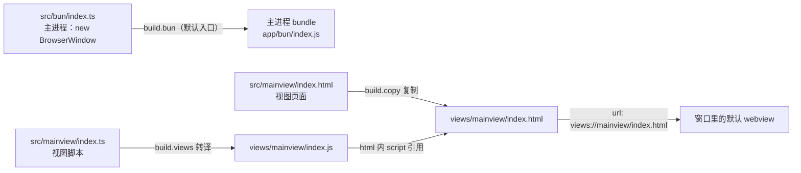

import { Canvas, Controls, Meta } from '@storybook/addon-docs/blocks';
import * as FirstWindow from './first-window.stories';

<Meta of={FirstWindow} name="Docs" />

# 第一个窗口

本课在 [初始化项目](?path=/docs/init--docs) 建好的工程骨架里写出第一个能跑的应用：主进程 `new BrowserWindow` 开出窗口，窗口加载的不是外部网站，而是打包进应用的本地视图页面。四件东西配合：主进程代码、视图 HTML、视图脚本、`electrobun.config.ts`。跑通 hello-world 后，你能预测窗口里的内容来自哪个文件、`views://` 地址是怎么拼出来的、配置里哪几行决定这件事。



回查时先看这组关键默认值（均与 1.18.1 包内类型定义核对过）：

| 关键输入 | 默认值 | 回查要点 |
| --- | --- | --- |
| `BrowserWindow` 的 `frame` | `800×600`，位置 `(0, 0)` | 四分量可部分传入，未传分量按默认合并 |
| `BrowserWindow` 的 `url` | 传参对象时无默认，窗口空白 | 仅 `new BrowserWindow()` 完全不传参才用内置 `https://electrobun.dev` |
| `BrowserWindow` 的 `activate` | `true` | 创建即显示并获得焦点；后台窗口设 `false` |
| `build.bun.entrypoint` | `"src/bun/index.ts"` | 沿用默认目录结构时可省略整段 `build.bun` |
| `build.buildFolder` | `"build"` | dev 产物在 `build/dev-<平台>-<架构>/` 下 |
| `runtime.exitOnLastWindowClosed` | `true` | 最后一个窗口关闭即退出应用 |

## 快速上手

课程目录的 `hello-world/` 是完整可运行工程（macOS + Bun，electrobun 1.18.1），首次运行需安装依赖：

```bash
cd cheatsheets/first-window/hello-world
bun install
bun start
```

在 1.2 已装好依赖的工程里，把下面四段按相同文件路径放进去后直接 `bun start`（`start` 脚本即 `electrobun dev`）。

**`electrobun.config.ts`**（应用信息 + 视图装配）：

```ts
import type { ElectrobunConfig } from "electrobun";

export default {
	app: {
		name: "hello-world",
		identifier: "dev.learn.firstwindow",
		version: "0.0.1",
	},
	build: {
		// 主进程入口沿用默认 src/bun/index.ts，这里省略 build.bun 段
		views: {
			mainview: {
				entrypoint: "src/mainview/index.ts",
			},
		},
		copy: {
			"src/mainview/index.html": "views/mainview/index.html",
		},
	},
} satisfies ElectrobunConfig;
```

**`src/bun/index.ts`**（主进程：创建窗口）：

```ts
import { BrowserWindow } from "electrobun/bun";

const win = new BrowserWindow({
	title: "Hello, Electrobun!",
	url: "views://mainview/index.html",
	frame: { width: 800, height: 600, x: 200, y: 200 },
});

// 主进程的 stdout 就在启动它的终端里
console.log("hello-world 主进程已启动", win.id);
```

**`src/mainview/index.html`**（视图页面：经 `build.copy` 复制进 `views/`）：

```html
<!DOCTYPE html>
<html lang="zh-CN">
<head>
	<meta charset="UTF-8" />
	<meta name="viewport" content="width=device-width, initial-scale=1.0" />
	<title>Hello, Electrobun!</title>
	<style>
		body {
			margin: 0;
			min-height: 100vh;
			display: grid;
			place-items: center;
			background: #f8fafc;
			color: #172033;
			font-family: system-ui, -apple-system, sans-serif;
		}
		main {
			text-align: center;
		}
		h1 {
			margin: 0 0 8px;
			font-size: 28px;
		}
		p {
			margin: 0;
			color: #475569;
		}
	</style>
</head>
<body>
	<main>
		<h1>Hello, Electrobun!</h1>
		<!-- 页面由 build.copy 复制进 views/；文案等待视图脚本更新 -->
		<p id="status">等待视图脚本加载…</p>
	</main>
	<!-- 视图脚本产物：build.views.mainview 的 index.ts 被转译为 views://mainview/index.js -->
	<script src="views://mainview/index.js"></script>
</body>
</html>
```

**`src/mainview/index.ts`**（视图脚本：经 `build.views` 转译为 `index.js`）：

```ts
const status = document.querySelector("#status");

if (status) {
	status.textContent = "视图脚本已加载：views://mainview/index.js";
}
```

预期结果，逐条可核对：

- 终端输出 `hello-world 主进程已启动`（主进程标准输出就在启动它的终端里）。
- 弹出 800×600 的窗口，标题栏显示 `Hello, Electrobun!`，位置在 `(200, 200)`。
- 页面显示标题，且占位文案被替换为「视图脚本已加载：views://mainview/index.js」——这条证明 `index.ts` 的转译产物确实被执行。
- 关闭窗口后进程退出（`exitOnLastWindowClosed` 默认 `true`）。

## BrowserWindow

`BrowserWindow` 从 `electrobun/bun` 导入，只在主进程使用。`new BrowserWindow({...})` 一次做两件事：创建原生窗口；同时创建一个铺满窗口的默认 webview（`BrowserView`），把参数里的 `url`（或 `html`）交给它加载。构造完成后窗口默认立即显示并获得焦点（`activate` 默认 `true`）。

```ts
import { BrowserWindow } from "electrobun/bun";

const win = new BrowserWindow({
	title: "Hello, Electrobun!",
	url: "views://mainview/index.html",
	// frame 四分量可只传部分，缺省按 800×600、(0, 0) 合并
	frame: { width: 800, height: 600 },
});
```

- `title` 是窗口标题。不显式传时构造器实际写入 `New Window`；只有完全不传参的 `new BrowserWindow()` 才用内置默认（标题 `Electrobun`、url `https://electrobun.dev`）。实践上总是显式传。
- `frame` 的 `x/y/width/height` 部分传入时，未传分量与默认值合并，不是全有或全无。
- 默认 webview 通过 `win.webview` 访问，后续换地址（`loadURL`）、页面缩放等操作都经它进行；多视图组合见 [BrowserView](?path=/docs/browser-view--docs)。

窗口内容的 `url` 有三种给法：

| `url` 取值 | 适用 | 要点 |
| --- | --- | --- |
| `views://<视图名>/…` | 应用本地 UI，本课主线 | 文件必须先装配进 `views/`，见下一节 |
| 远程 `https://…` | 展示外部站点 | 不可信内容考虑 `sandbox`，见[窗口选项](?path=/docs/window-options--docs) |
| 不传 `url`，改传 `html` 字符串 | 试验、一次性窗口 | 整页 HTML 内联提供，不经过文件装配 |

真实窗口行为无法在 Storybook 里复现：本课的桌面证据以 `hello-world/` 工程为准，修改 `title` 或 `frame` 后重跑 `bun start` 即可观察。完整窗口选项（`titleBarStyle`、`transparent`、`sandbox` 等）与默认值见[窗口选项](?path=/docs/window-options--docs)；close、resize、focus 等事件见[窗口事件](?path=/docs/window-events--docs)。

## views:// 协议

`views://` 是 Electrobun 提供的本地内容地址，根指向应用资源内的 `views/` 目录；dev 模式下就是构建输出 `build/dev-<平台>-<架构>/<应用名>-dev.app/Contents/Resources/app/views/`（macOS 本机验证路径，平台与架构随环境变化）。窗口 `url` 和页面里的 script、link 引用都能用它访问打包资源。

文件进入 `views/` 有两条通道：

- **TS 入口**：`build.views.<视图名>.entrypoint` 指向的 TS 被 Bun.build 转译为 `views/<视图名>/index.js`，页面用 `` <script src="views://<视图名>/index.js"> `` 引用产物（官方 Creating UI 指南的做法）。
- **静态文件**：`build.copy` 的「源路径 → 目标路径」把 html、css、图片等复制进去。只有落进 `views/` 的文件才有 `views://` 地址；只放在 `src/` 里不会自动可见。

页面内引用资源时，写 `views://<视图名>/…` 绝对地址，或在页面自身已位于 `views://` 下时用相对路径（官方 hello-world 模板的 css 引用即用相对路径，两种写法都被支持）。

下面的示意在浏览器里复现「文件 → 装配通道 → 地址 → 窗口」的判定链；真实窗口行为仍以 `hello-world/` 工程为准。

<Canvas of={FirstWindow.ViewsUrlMapping} />
<Controls of={FirstWindow.ViewsUrlMapping} />

| 读者操作 | 可观察证据 |
| --- | --- |
| 把「文件类型」切到 `index.ts` | 装配方式变为 build.views 转译；开关「已写入 build.copy」不再影响任何结果 |
| 在「HTML 页面」下关闭「已写入 build.copy」 | 装配链断裂，窗口结果变为空白，`url` 行提示产物中无此文件 |
| 在「CSS 样式」下关闭「已写入 build.copy」 | 页面仍可加载，但样式丢失 |
| 修改「视图名」 | 源文件、构建产物与 `views://` 地址三处同步改写 |
| 打开 Show code | 看到该 Canvas 实际执行的 `views-url-mapping.ts` |

图片、字体等打包资源的组织方式与各平台应用图标配置见[打包资源与图标](?path=/docs/bundled-assets--docs)。

## electrobun.config.ts

配置文件位于项目根，默认导出一个对象，`satisfies ElectrobunConfig` 提供类型检查（类型从 `electrobun` 包导入）。快速上手里那份最小配置只有四段：

| 字段 | 作用 | 本课取值 |
| --- | --- | --- |
| `app.name` | 应用显示名；dev 产物为 `<name>-dev.app` | `"hello-world"` |
| `app.identifier` | 反向域名式唯一标识 | `"dev.learn.firstwindow"` |
| `app.version` | 应用版本号 | `"0.0.1"` |
| `build.bun` | 主进程入口；默认 `"src/bun/index.ts"`，沿用默认结构时整段可省略 | 省略 |
| `build.views.<视图名>` | 视图 TS 入口；键即视图名，进入 `views://` 路径第一段 | `mainview` |
| `build.copy` | 源 → 目标映射；目标必须写在 `views/` 下才能被 `views://` 访问 | html 一条 |

新增静态文件只需在 `copy` 里加一行映射，例如补一个 css：

```ts
copy: {
	"src/mainview/index.html": "views/mainview/index.html",
	"src/mainview/index.css": "views/mainview/index.css",
},
```

判断链是三处名字一致：`build.views` 的键 = 窗口 `url` 路径第一段 = html 内 `views://` 引用的第一段。任何一处对不上，窗口或脚本就加载不到内容（见常见问题）。

完整 BuildConfig（平台段 `bundleCEF`、`defaultRenderer`、`watchIgnore`、asar、scripts 钩子等）见[构建配置](?path=/docs/build-config--docs)；`dev`、`build`、`--watch`、`--env` 等命令见 [CLI 参数](?path=/docs/cli--docs)。

## 常见问题

- 窗口打开了，但页面空白或样式丢失。
  先到构建输出核对 `views/` 下实际有什么：`build/dev-<平台>-<架构>/<应用名>-dev.app/Contents/Resources/app/views/<视图名>/`。最常见原因是三处名字对不上——`build.views` 的键、窗口 `url` 的 `views://<视图名>/…`、html 里 script/link 的引用路径；其次是 html/css 忘了写进 `build.copy`（TS 入口不需要 copy）。
- 放在 `src/` 里的图片、字体，用 `views://` 加载不到。
  `views://` 只能访问被装配进 `views/` 目录的文件：TS 入口由 `build.views` 转译进入，其余文件都要在 `build.copy` 里显式映射（目标路径写在 `views/` 下），不会因为文件在 `src/` 里就自动可见。资源组织与图标见[打包资源与图标](?path=/docs/bundled-assets--docs)。

## 总结回顾

摘要：

本课从 `new BrowserWindow` 写到 `views://` 装配，再落到 `electrobun.config.ts` 的最小四段。窗口本身只提供标题、尺寸位置和一个要加载的地址；地址背后的文件由配置决定——TS 入口经 `build.views` 转译为 `views/<视图名>/index.js`，html/css 经 `build.copy` 复制进 `views/`，窗口与页面再用 `views://` 引用它们。三处名字保持一致，`bun start` 就能看到窗口加载自己的页面；加载失败时去构建输出的 `views/` 目录核对实际装配结果。

一句话：

> BrowserWindow 把窗口开出来并把地址交给铺满窗口的默认 webview；窗口里有什么，取决于 electrobun.config.ts 把哪些文件装配进了 `views://` 命名空间。

知识要点：

- `new BrowserWindow({...})` 一次做了哪两件事？
- `frame` 只传 `width/height` 时，`x/y` 取什么值？
- `views://mainview/index.html` 对应源码里的哪个文件、由配置的哪一行决定？
- 视图 TS 入口为什么不需要 `build.copy`？
- html 里引用视图脚本产物的地址怎么写？
- 窗口空白时，先到哪里核对实际装配结果？

## 参考资料

- [Electrobun 文档：Hello World](https://framework.blackboard.sh/electrobun/guides/hello-world/)
- [Electrobun 文档：Creating UI](https://framework.blackboard.sh/electrobun/guides/creating-ui/)
- [Electrobun 文档：BrowserWindow API](https://framework.blackboard.sh/electrobun/apis/browser-window/)
- [Electrobun 文档：Build Configuration](https://framework.blackboard.sh/electrobun/apis/cli/build-configuration/)
- electrobun 1.18.1 包内类型定义（`dist/api/bun/core/BrowserWindow.ts`、`dist/api/bun/ElectrobunConfig.ts`）：窗口选项默认值与配置类型的最终依据。
