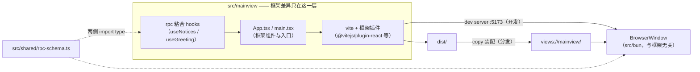
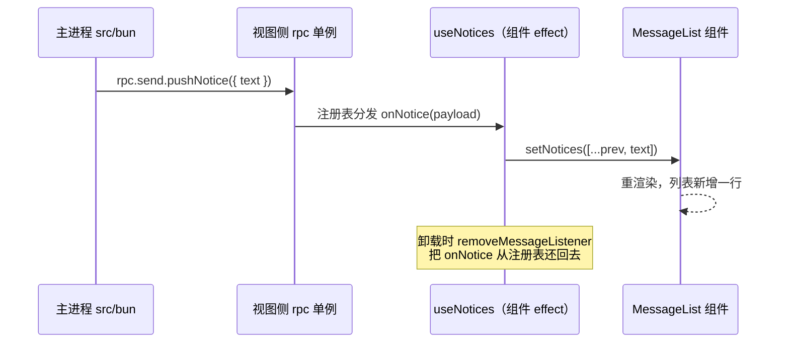

import { Canvas, Controls, Meta } from '@storybook/addon-docs/blocks';
import * as FrameworkStories from './frontend-frameworks.stories';

<Meta of={FrameworkStories} name="Docs" />

# 前端框架集成

Electrobun 不感知 React、Vue 还是 Svelte：主进程只认两样东西——能装进应用包的静态产物（`views://`）和开发期的 Vite dev server。所以「框架集成」不是去找 Electrobun 的 React 支持，而是把框架当成视图层的一种 Vite 输入：**框架特有物只有 Vite 插件与视图入口，Electrobun 侧的配置和脚本与 vanilla 工程保持一致**。本课讲三件事：组合结构（框架差异落在哪一层）、RPC 粘合层（rpc 实例怎么接进组件生命周期）、生态模板（官方 `init` 模板清单与统一脚本模式）。Vite 侧的装配机制（`copy`、`watchIgnore`、双进程、URL 决策）已在[Vite 集成与 HMR](?path=/docs/vite-hmr--docs)讲清，本课只讲框架带来的增量。



回查先看这组对接点（框架与插件信息均与 1.18.1 官方模板内嵌文件核对过）：

| 对象 | 值 / 形式 | 回查要点 |
| --- | --- | --- |
| 框架特有物 | `vite.config.ts` 的 `plugins` + tsconfig `jsx` 设置 | 整个组合里唯一的框架差异层 |
| 视图入口 | `index.html` 提供根元素，`main.ts(x)` 挂载 App | `new Electroview({ rpc })` 也放入口，只执行一次 |
| Electrobun 侧配置 | 与 vanilla 完全相同：省略 `build.views`、`copy` 装配 `dist/`、`watchIgnore: ["dist/**"]` | 见[Vite 集成与 HMR](?path=/docs/vite-hmr--docs) |
| RPC 契约 | `src/shared/rpc-schema.ts` 一份，两侧 import type | 框架不影响 schema 写法（见[自定义 RPC](?path=/docs/rpc--docs)） |
| 官方模板 | `bunx electrobun init <项目名> --template=react-tailwind-vite` 等 19 个 | 1.18.1 编译 CLI 内嵌注册表 |
| 模板脚本 | `start` / `dev` / `dev:hmr` / `hmr` / `build:canary` | 五个框架模板与 vanilla-vite 模板逐字一致 |

## 快速上手

从官方模板创建 React 工程（macOS + Bun；模板内嵌在 CLI 里，不需要额外网络取模板）：

```bash
bunx electrobun init my-react-app --template=react-tailwind-vite
cd my-react-app
bun install
bun run dev:hmr
```

等价写法：第二参数直接写模板名（`bunx electrobun init react-tailwind-vite`，模板名兼作项目名）；不带参数则进入交互式模板菜单（官方 Quick Start 记载的行为）。

预期结果：终端出现 `[0]` Vite dev server（`Local: http://localhost:5173/`）与 `[1]` 的 `HMR enabled: Using Vite dev server at …` 日志，窗口打开 React 界面（模板自带一个计数器示例）。此时编辑 `src/mainview/App.tsx` 里任意文案并保存：界面即时更新，**计数器的数值不丢**——这是框架插件带来的组件级热替换，与 vanilla 视图的整页 reload 不同（见「框架差异层」）。断开 dev server 只跑 `bun run dev` 则加载打包产物，改动不再生效——这条决策链与[Vite 集成与 HMR](?path=/docs/vite-hmr--docs)完全一致。

## 组合结构

判断只有一句：**换框架不换 Electrobun**。对比 1.18.1 官方模板可以核对——react / svelte / vue / solid / angular 五个框架模板的 `package.json` 脚本逐字一致，`electrobun.config.ts` 仅 `app.name` / `identifier` 不同，`src/bun/index.ts` 的 URL 探活决策完全相同，且都与 vanilla-vite 模板一致；差异全部集中在 `src/mainview/` 的源码、`vite.config.ts` 的 `plugins` 一行和 tsconfig。

### 框架差异层

框架间的差别收缩到下表三列（入口代码与版本提取自 1.18.1 官方模板）：

| 框架 | Vite 插件 | 入口挂载（`src/mainview/main.ts(x)`） |
| --- | --- | --- |
| React 18 | `@vitejs/plugin-react` | `createRoot(document.getElementById("root")!).render(<StrictMode><App /></StrictMode>)` |
| Svelte 5 | `@sveltejs/vite-plugin-svelte` | `mount(App, { target: document.getElementById("app")! })` |
| Vue 3 | `@vitejs/plugin-vue` | `createApp(App).mount("#app")` |
| SolidJS | `vite-plugin-solid` | `render(() => <App />, document.getElementById("app")!)` |
| Angular 19 | `@analogjs/vite-plugin-angular` | `bootstrapApplication(AppComponent)` + `<app-root>` 根元素 |

`index.html` 都只做一件事：提供根元素并以 `<script type="module" src="/main.ts(x)">` 引用入口。tsconfig 的差别也只有一项框架编译设置（React 模板配 `"jsx": "react-jsx"`；Angular 模板额外带独立的 `tsconfig.app.json`，其 Vite 配置还设了 `base: "./"` 用相对路径引用产物）。

框架插件带来两个真实差别，其余（装配、探活、分发）全部共用 vanilla 工作流：

- **编译输入**：插件把 `.tsx` / `.svelte` / `.vue` 等框架格式编译为 Vite 可处理的模块。Electrobun 内建 `views` 构建面向纯 TS 视图、不承载框架工具链（单文件组件、框架插件生态都在 Vite 一侧）——这正是框架工程必须走 Vite 形态的原因。
- **更新形态**：`@vitejs/plugin-react` 内置 react-refresh，改动组件文件时只热替换该组件、保留组件状态；vanilla 模块没有 HMR 边界，改动是整页 reload（[Vite 集成与 HMR](?path=/docs/vite-hmr--docs)实测的 `page reload` 形态）。组件之外的文件（入口、`index.html`、非组件模块）在框架工程里同样退化为整页 reload。

### React 视图入口

react-tailwind-vite 模板的入口三件套（与官方模板内嵌文件一致）：

```html
<!-- src/mainview/index.html -->
<body>
  <div id="root"></div>
  <script type="module" src="/main.tsx"></script>
</body>
```

```tsx
// src/mainview/main.tsx
import { StrictMode } from "react";
import { createRoot } from "react-dom/client";
import "./index.css";
import App from "./App";

createRoot(document.getElementById("root")!).render(
  <StrictMode>
    <App />
  </StrictMode>,
);
```

`new Electroview({ rpc })` 的接线放在这个入口里、紧挨渲染调用（模板未接 RPC；带接线的完整写法见本课目录 `react-rpc-glue.tsx` 的 `connectRpc()`——用 `wired` 标记保证只执行一次）。位置是硬要求：放组件里会随挂载反复接线，见常见问题。

## RPC 粘合层

契约层与框架无关：`src/shared/rpc-schema.ts` 一份类型、两侧 import、`BrowserView.defineRPC` 与 `Electroview.defineRPC` 各接一半——全套写法在[自定义 RPC](?path=/docs/rpc--docs)。框架带来的唯一新问题是**消费方式**：vanilla 视图在模块顶层随手调用，React 组件却会挂载、卸载、重挂。粘合层的答案是两句话：**rpc 实例做成模块级单例，组件只通过 hooks 借用它**；**订阅随组件生命周期注册与注销**。



### 单例 rpc 模块

视图侧的唯一增量是一个单例模块（完整可抄版本见本课目录 `react-rpc-glue.tsx`），核心三步：

```ts
// 模块级单例：组件与 hooks 导入的都是这一个实例
export const rpc = Electroview.defineRPC<AppRPC>({ handlers: { /* … */ } });

// 入口接线：只执行一次，Electroview 构造立即接上通道
export function connectRpc() {
  if (wired) return;
  wired = true;
  new Electroview({ rpc });
}
```

- **单例必须是模块级**。放进组件里创建的话，React 18 `StrictMode` 的开发期双挂载、Fast Refresh 的重挂都会造出第二个实例，handlers 与监听状态随旧实例漂移。
- **接线只放入口**。`new Electroview({ rpc })` 的构造函数立即 `setTransport` 接上加密通道（通道本体见[架构原理](?path=/docs/architecture--docs)；Electroview 类见[Electroview](?path=/docs/electroview--docs)）。
- 请求方向（视图 → 主进程）随时可调，hooks 里 `rpc.request.greet({ name })` 拿 `Promise` 即可；主进程 → 视图方向仍要等 `dom-ready`（[自定义 RPC](?path=/docs/rpc--docs)的时机说明）。

### 消息订阅与清理

订阅是粘合层唯一的生命周期问题：`addMessageListener` 注册的回调不会随组件卸载消失，`removeMessageListener` 要靠你自己还回去。hook 的形状：

```ts
useEffect(() => {
  const onNotice = (payload: { text: string }) => {
    setNotices((prev) => [...prev, payload.text]);
  };
  rpc.addMessageListener("pushNotice", onNotice);
  return () => rpc.removeMessageListener("pushNotice", onNotice); // 清理函数
}, []);
```

下面的示意在浏览器里推演这条生命周期。切挂载状态、开关清理函数、调追加推送，观察注册表残留与幽灵更新：

<Canvas of={FrameworkStories.RpcGlueLifecycle} />
<Controls of={FrameworkStories.RpcGlueLifecycle} />

| 读者操作 | 可观察证据 |
| --- | --- |
| 默认状态（挂载 + 清理 + 追加 1 条） | 挂载期 2 条 + 追加 1 条都送达，`notices: 3`，注册表 1 个 listener |
| 切「组件已卸载」（清理开） | 注册表清空，追加推送落空丢弃，组件安静离场、无警告 |
| 关「effect 返回清理函数」再卸载 | 注册表残留 1 个 `onNotice`，主进程面板照常推送 |
| 遗漏清理 + 追加推送调到 3 条 | 3 次幽灵 setState 打到已卸载组件（红标） |
| 打开 Show code | 看到该 Canvas 实际执行的 `rpc-glue-lifecycle.ts` |

注意时序面板第④步的前提：主进程不知道组件生死，它只对 webview 发送——泄漏的后果全部由视图侧承担。真实窗口里的对应行为，以把 `react-rpc-glue.tsx` 接入桌面工程运行为准。

## 生态模板

`bunx electrobun init` 的模板注册表内嵌在 1.18.1 编译 CLI 里（文档站未收录清单，下表提取自包内 `.cache/electrobun` 二进制与 `src/cli/index.ts`）。按用途分三组：框架组合与前 7 行的基线直接相关，中间是应用形态示例，末行是 GPU 组：

| 模板名 | 视图栈 | 用途 |
| --- | --- | --- |
| `react-tailwind-vite` | React 18 + Tailwind 3 + Vite | 框架组合参考实现，自带计数器与 HMR 说明 |
| `svelte` | Svelte 5 + Vite | 框架组合 |
| `vue` | Vue 3 + Vite | 框架组合 |
| `solid` | SolidJS + Vite | 框架组合 |
| `angular` | Angular 19 + Vite（`@analogjs` 插件） | 框架组合 |
| `vanilla-vite` | 纯 TS + Vite | 无框架基线（工作区 `vite-tester/` 即此模板同款，本套手册实测载体） |
| `tailwind-vanilla` | 纯 TS + Tailwind + Vite | 无框架 + 样式链 |
| `hello-world` | 纯 TS，内建 `views` 构建 | 最小起点（`tester/` 同款，见[初始化项目](?path=/docs/init--docs)） |
| `photo-booth` | 纯 TS + 摄像头 | 应用形态示例 |
| `multi-window` | 纯 TS + RPC | 多窗口与子窗口管理 |
| `multitab-browser` | 纯 TS + webview 标签 | 浏览器形态（见[webview 标签](?path=/docs/webview-tag--docs)） |
| `notes-app` | 纯 TS + RPC | 笔记 + 文件系统 |
| `sqlite-crud` | 纯 TS + RPC | SQLite 增删改查 |
| `tray-app` | 纯 TS | 托盘常驻（见[系统托盘](?path=/docs/tray--docs)） |
| `bunny` | 纯 TS + BrowserView / RPC | 鼠标跟随的透明 3D 兔子 |
| `wgpu` / `wgpu-threejs` / `wgpu-babylon` / `wgpu-mlp` | WebGPU 原生表面 | GPU 组（见[WebGPU 与 3D 适配器](?path=/docs/webgpu--docs)） |

两点值得记住：

- **统一脚本模式**。五个框架模板与 `vanilla-vite` 的 `package.json` 脚本逐字一致：`start`（`vite build && electrobun dev`）、`dev`（`--watch`）、`dev:hmr`（concurrently 双进程）、`hmr`（`vite --port 5173`）、`build:canary`。`electrobun.config.ts` 除 `app.name` / `identifier` 外相同（`copy` 装配 `dist/`、`watchIgnore: ["dist/**"]`）——官方把「框架组合」明确定为 Vite 形态，框架差异不进 Electrobun 配置。
- **版本钉死**。模板依赖里 `electrobun` 是精确版本（`"1.18.1"`，无 `^`），react / vite 等用 `^` 范围；升级 Electrobun 时要手动改这一项。

从模板起步的建议见最佳实践；模板清单本身也可能随版本变化，以当时 CLI 的交互菜单为准。

## 最佳实践

- **rpc 单例放模块级，接线只放入口。** 组件会因 StrictMode、Fast Refresh、路由切换反复挂载卸载；实例与 `new Electroview` 的生命周期必须比组件长——放模块里天然满足。
- **订阅 hook 一律返回清理函数，请求 hook 用 cancelled 标志。** 前者防幽灵 setState 与 listener 泄漏（Canvas 示意的遗漏路径），后者防卸载后 `setGreeting` 打到旧组件。
- **用官方模板当起点再裁剪。** 脚本、`copy` / `watchIgnore` 配置已被官方验证成套；从零手拼容易漏 `watchIgnore` 这类不报错只影响开发节奏的暗坑（后果见[Vite 集成与 HMR](?path=/docs/vite-hmr--docs)）。
- **换框架不动主进程。** 视图栈替换只改 `src/mainview/`、Vite 插件与挂载代码；主进程、RPC schema、分发链路原样保留——组合结构决定了这是安全的。

## 常见问题

- 开发期（StrictMode）消息回调触发两次、listener 数翻倍？
  React 18 StrictMode 在开发期故意 mount → unmount → mount 一遍。hook 没返回清理函数时，每次挂载都 `addMessageListener` 一个新回调且从不注销；补上 `return () => rpc.removeMessageListener(...)` 后，双挂载也会先注销再注册，最终恰好一个 listener。
- 改 `App.tsx` 界面即时更新且状态保留，改 `main.tsx` / `index.html` 却整页刷新、状态全丢？
  预期行为：react-refresh 只保留组件边界内的状态；入口与非组件模块的改动退化为整页 reload——与 vanilla 视图的更新形态相同。把状态尽量收敛进组件，入口只留挂载与接线。
- 把 `new Electroview({ rpc })` 写进组件或 hook 后，rpc 调用行为错乱 / 重复触发？
  接线随组件挂载反复执行，每次构造都重新 `setTransport`。把它移回入口、用 `connectRpc()` 的 `wired` 标记保证只执行一次（`react-rpc-glue.tsx` 的写法）。
- 从模板创建的工程想升级 electrobun，`bun update` 不生效？
  模板把 `electrobun` 钉在精确版本（如 `"1.18.1"`），范围更新不会动它。手动改 `package.json` 里的这一项再 `bun install`，并用[构建配置](?path=/docs/build-config--docs)核对配置字段是否有变化。

## 总结回顾

摘要：

框架集成不改变 Electrobun 的任何一侧：五个官方框架模板的脚本与 vanilla-vite 逐字一致，`electrobun.config.ts` 与主进程代码仅应用名不同，差异收缩在 `src/mainview/` 源码、Vite 插件一行与 tsconfig。React 入口是 `index.html` 根元素 + `main.tsx` 的 `createRoot` 挂载，`new Electroview({ rpc })` 放入口只执行一次；RPC 契约沿用共享 schema，视图侧增量是一个模块级 rpc 单例加 hooks——订阅 hook 注册 `addMessageListener` 并在清理函数里注销，请求 hook 用 cancelled 标志丢弃过期结果，否则泄漏的 listener 会让主进程消息打到已卸载组件。`bunx electrobun init --template=…` 提供 19 个内嵌模板，框架组（react-tailwind-vite / svelte / vue / solid / angular）共用统一脚本模式，`electrobun` 版本被钉死为精确版本。

一句话：

> 框架只是视图层的一种 Vite 输入——插件与入口是全部差异，Electrobun 侧逐字不变，RPC 靠单例模块加生命周期干净的 hooks 粘进组件。

知识要点：

- 框架组合里唯一随框架变化的配置是什么？五个框架模板各自用哪个 Vite 插件、哪种入口挂载？
- `new Electroview({ rpc })` 应该放在哪里执行？放错位置的后果是什么？
- rpc 单例为什么必须是模块级？StrictMode 与 Fast Refresh 如何惩罚放在组件里的实例？
- 订阅主进程消息的 hook 缺少清理函数时，卸载后再来消息会发生什么？
- 请求方向的调用在 hooks 里怎么写才不会把结果打到已卸载组件？
- `bunx electrobun init` 怎么非交互地指定模板？官方模板分哪几组？
- 框架组件的改动与入口文件的改动，更新形态有什么差别？为什么？
- 模板里 `electrobun` 的版本写法是什么？升级时要注意什么？

## 参考资料

- [Quick Start — 官方入门：`bunx electrobun init` 与模板选择](https://framework.blackboard.sh/electrobun/guides/quick-start/)
- [Creating UI — 官方指南：views 构建与 `views://`（Electrobun 侧不感知框架的依据）](https://framework.blackboard.sh/electrobun/guides/creating-ui/)
- [vite-plugin-react — Fast Refresh 保留组件状态的边界](https://github.com/vitejs/vite-plugin-react)
- [blackboardsh/electrobun（GitHub）— 模板仓库与 Apps Built with Electrobun 真实应用集合](https://github.com/blackboardsh/electrobun)
- electrobun 1.18.1 包内一手资料：编译 CLI（`tester/node_modules/electrobun/.cache/electrobun` 的内嵌模板注册表与模板文件）与 `src/cli/index.ts`（init 的 `--template=` / 位置参数 / 交互菜单三种用法）——本课模板清单、框架插件版本与统一脚本的最终依据。
- 工作区 `vite-tester/`（官方 vanilla-vite 模板同款工程，本套手册 Vite 形态的实测载体）；`tester/node_modules/electrobun/dist/api/browser/index.ts`（Electroview 构造即接线的实现依据）。
