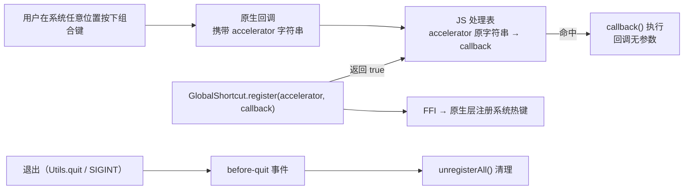

import { Canvas, Controls, Meta } from '@storybook/addon-docs/blocks';
import * as GlobalShortcutCourse from './global-shortcut.stories';

<Meta of={GlobalShortcutCourse} name="Docs" />

# 全局快捷键

应用菜单的 [accelerator](?path=/docs/application-menu--docs) 只在本应用激活时生效，窗口的 [keyDown 事件](?path=/docs/window-events--docs) 只在窗口聚焦时触发；要让应用在后台、甚至没有任何窗口聚焦时也能被一组按键唤醒——全局截屏、剪贴板历史、唤起主面板——用主进程的 `GlobalShortcut` 注册系统级快捷键。模块只有四个方法：`register` 把组合键与回调交给系统并记入主进程的处理表，`unregister` / `unregisterAll` 注销，`isRegistered` 探测；成功与否都用布尔返回值表达，不抛异常。机制的核心是一张**按 accelerator 原字符串建键的 JS 处理表**：组合键在系统任意位置被按下时，原生层带着 accelerator 字符串回调，框架查表执行你的回调。本课围绕三件事展开：注册与触发的分发机制、`register` 返回 `false` 的三条路径（冲突处理）、退出前的生命周期清理。文档站暂无 GlobalShortcut 专页，本课 API 事实以 1.18.1 包内实现与官方仓库 kitchen 测试为准。



四个成员的签名与返回值（与 1.18.1 包内 `dist/api/bun/proc/native.ts` 核对）：

| 成员 | 签名 | 返回值 | 回查要点 |
| --- | --- | --- | --- |
| `register` | `(accelerator, callback) => boolean` | 注册成功 `true` | 三条路径返回 `false`，见「冲突与返回值」 |
| `unregister` | `(accelerator) => boolean` | 注销成功 `true` | 成功时同时清原生注册与处理表条目 |
| `unregisterAll` | `() => void` | — | 全部注销，幂等 |
| `isRegistered` | `(accelerator) => boolean` | 已注册 `true` | 无原生环境恒为 `false` |

使用位置：只在主进程——`import { GlobalShortcut } from "electrobun/bun"`（或默认导出 `Electrobun.GlobalShortcut`）；视图层没有这个模块，跨层需求走 RPC（见「最佳实践」）。

## 快速上手

复用 1.3 的 hello-world 工程（或任何 electrobun 工程），把 `src/bun/index.ts` 换成下面这份后 `bun start`：

```ts
import { BrowserWindow, GlobalShortcut } from "electrobun/bun";

new BrowserWindow({ title: "全局快捷键", url: "views://mainview/index.html" });

const ACCELERATOR = "CommandOrControl+Shift+T"; // macOS 上是 ⌘⇧T

const ok = GlobalShortcut.register(ACCELERATOR, () => {
	// 回调没有参数，触发的是哪个组合靠闭包记住
	console.log(`触发: ${ACCELERATOR}`);
});

console.log("注册结果:", ok);
```

预期结果，逐条可核对：

- 启动后终端打印 `注册结果: true`。
- 点别的应用让本应用失焦（比如点一下浏览器），再按 ⌘⇧T——终端**仍然**打印 `触发: CommandOrControl+Shift+T`。这是“全局”的含义：分发不依赖本应用窗口聚焦。
- 把组合换成被其他工具占用的写法（比如截图、输入法占用的组合）再启动，终端打印 `注册结果: false`——注册失败的组合不会触发回调。

## 注册与触发

`register(accelerator, callback)` 的机制是双侧的（依 1.18.1 包内实现）：

- **JS 侧处理表。** 注册成功时，callback 存进主进程的 `globalShortcutHandlers`（一个 Map），键就是你传入的 accelerator 字符串本身。
- **原生侧注册与分发。** `electrobun/bun` 模块加载且 FFI 可用时，框架已经向原生层注册了唯一的分发回调；组合键在系统任意位置被按下时，原生层带着 accelerator 字符串回调 JS，框架按字符串查表，命中才执行。

两个直接推论：

- **回调无参数。** 触发的是哪个组合，靠注册时闭包捕获 accelerator（快速上手与官方 kitchen 测试都是这个写法）。
- **按原字符串精确匹配。** 处理表的键是传入的原始字符串——同一组合换一种写法（大小写、修饰键顺序不同）就是不同的键；注销与探测也要用与注册时一字不差的字符串。

下面的示意在浏览器里复现这条判定链：register 的布尔返回、处理表条目的增删、组合键按下后的分发路径。

<Canvas of={GlobalShortcutCourse.ShortcutRegistryFlowSchematic} />
<Controls of={GlobalShortcutCourse.ShortcutRegistryFlowSchematic} />

| 读者操作 | 可观察证据 |
| --- | --- |
| systemState 停在 `free`，点 `register()`，再点一次 | 第一次返回 `true`、处理表新增条目；第二次返回 `false`——本应用重复注册同一字符串直接短路 |
| 注册成功后点「按下组合键」 | 判定流显示 原生回调携带字符串 → 处理表命中 → callback() 执行 |
| 切到 `other-app` 后点 `register()`，再点「按下组合键」 | 注册返回 `false`（原生层拒绝）；此时按组合键触发的是占用方应用的回调，本应用无条目 |
| 切到 `no-native` 后点 `register()` | 返回 `false` 且未走原生层——对应无 FFI 的运行上下文 |
| 注册成功后点 `unregister()`，再点「按下组合键」 | 返回 `true`、条目移除；按键不再触发回调 |

桌面范例 `global-shortcut-observer.ts`（课程目录）：作为主进程入口运行后，启动打印生效组合（首选被占用时自动降级到备选），失焦状态按组合键终端打印 `触发: …`，退出时在 before-quit 里清理并打印日志。

### 加速键写法

accelerator 是 `+` 连接的键名字符串。包内注释与官方 kitchen playground 出现过的写法：

| 写法 | 来源 |
| --- | --- |
| `CommandOrControl+Shift+Space` | 包内 `register` 的文档注释 |
| `CommandOrControl+Shift+T` | kitchen playground 默认值 |
| `CommandOrControl+Alt+K` | kitchen 预设按钮 |
| `CommandOrControl+Shift+1` | kitchen 预设按钮（数字主键） |
| `Alt+Shift+Space` | kitchen 预设按钮（无 CommandOrControl 的组合） |

`CommandOrControl` 在 macOS 上是 ⌘（kitchen 预设把 `CommandOrControl+Shift+T` 标注为 Cmd+Shift+T 印证）；Windows / Linux 上的展开未在公开资料中说明。

键名字符串的完整语法表没有公开文档：解析发生在闭源的原生库内，文档站也没有 GlobalShortcut 专页。**`register` 的布尔返回值是唯一可靠的写法校验器**——新的组合先在真实工程里注册一次看返回值，不要凭 Electron 的 accelerator 语法表臆断。

## 冲突与返回值

`register` 返回 `false` 有三条路径，按 1.18.1 包内实现的判定顺序：

1. **无原生环境。** 运行上下文没有 FFI（包内 `!native` 分支，例如纯构建上下文），直接返回 `false`，不调用原生层。
2. **本应用重复注册。** 同一 accelerator 字符串已在处理表里，直接返回 `false`——**不会覆盖旧回调**。想换回调必须先 `unregister`。
3. **原生层拒绝。** 组合被其他应用占用，或写法原生层不认识。

排查动作按 1 → 2 → 3 排除：确认跑在真实 electrobun 工程里（而不是纯构建产物）；`unregisterAll()` 清掉本应用旧注册再试；换一个备选组合——换组合能成功，就说明是占用或写法问题。`isRegistered` 只反映探测到的注册状态，它能否看到其他应用的占用未在公开资料中说明，不要拿它当冲突判据。

备选降级是官方 kitchen 测试同款的直接写法：

```ts
const candidates = ["CommandOrControl+Shift+T", "Alt+Shift+Space"];
const active = candidates.find((a) => GlobalShortcut.register(a, onTrigger));
```

注册成功后把 `active` 显示给用户（窗口标题、托盘菜单或设置页），让用户知道当前生效的组合。

## 注销与清理

- `unregister(accelerator)` 返回布尔值：成功时同时清掉原生注册与处理表条目；字符串与注册时一字不差才匹配得上。
- `unregisterAll()` 无返回值，全部注销，幂等。
- **框架不会在退出时自动清理。** 1.18.1 的退出路径（`Utils.quit()`）只发 `before-quit` 事件后强制退出，没有调用 `unregisterAll`。主动清理挂 `before-quit`：

```ts
import Electrobun, { GlobalShortcut } from "electrobun/bun";

Electrobun.events.on("before-quit", () => {
	GlobalShortcut.unregisterAll();
});
```

`before-quit` 的触发时机：`Utils.quit()`——包括进程收到 SIGINT / SIGTERM 时（包内注册的信号处理器走同一条 quit 序列）。这个事件还可以用 `e.response = { allow: false }` 否决退出，细节见[应用生命周期](?path=/docs/app-lifecycle--docs)。

进程终止后系统热键通常随之失效（操作系统行为）；显式 `unregisterAll` 的价值在于让清理发生在受控的退出路径里、不依赖这一假设，也让 dev 循环的重启行为可预期。官方 kitchen 测试的做法一致：注册时把 accelerator 记进 Set，收尾统一清理。

## 最佳实践

- **注册时机跟着应用走，不跟着窗口走。** 全局快捷键的生命周期是应用级的：主进程启动即注册；托盘常驻应用（没有可见窗口也要响应快捷键）尤其如此。
- **首选组合配备选链。** 热门组合容易被占用，`find` 降级 + 把生效组合显示给用户，比注册失败后沉默好。
- **换回调先注销。** 对同一字符串第二次 `register` 直接 `false` 且不覆盖；更新回调 = `unregister` → `register`。
- **视图层的快捷键需求走 RPC。** `GlobalShortcut` 只在主进程导出；视图层通过自定义 RPC 请求主进程代为注册（官方 kitchen 测试就是这个形态），见[自定义 RPC](?path=/docs/rpc--docs)。
- **清理挂 before-quit，注册记好账。** 维护一份已注册 accelerator 的 Set，`before-quit` 里 `unregisterAll`，避免散落多处注销。

## 常见问题

- `register` 返回 `false`，但这个组合我明明没注册过。
  按三条路径排除：确认跑在真实 electrobun 工程（无原生环境返回 false）；`unregisterAll()` 清本应用旧注册（同一字符串重复注册返回 false）；还不行就是组合被其他应用占用或写法无效——换备选组合验证。
- 想给同一个组合换回调，第二次 `register` 返回 `false`。
  重复注册直接短路，不会覆盖旧回调。先 `unregister(accelerator)` 再 `register` 新回调；要全部重来就用 `unregisterAll()`。
- 回调里拿不到触发的是哪个快捷键。
  回调签名是 `() => void`，没有参数。注册时把 accelerator 闭包捕获进回调（`register(a, () => console.log(a))`），这是包内注释与官方测试的通用写法。
- 视图层 import 不到 `GlobalShortcut`。
  它只在主进程入口 `electrobun/bun` 导出，`electrobun/view` 没有。视图层通过 RPC 请求主进程注册，触发时再用 RPC 消息通知视图。
- `unregister` 返回 `false`。
  该字符串当前未注册，或传入字符串与注册时不一致——处理表按原字符串精确匹配，大小写、修饰键顺序不同就是不同的键。

## 总结回顾

摘要：

GlobalShortcut 是主进程模块：register 成功时回调进按 accelerator 原字符串建键的 JS 处理表，同时经 FFI 在原生层注册系统热键；组合键在系统任意位置按下时，原生层携带字符串回调，查表命中才执行——所以回调无参数（闭包捕获）、注销与探测要字符串一字不差。register 返回 false 有三条路径：无原生环境、本应用重复注册（不覆盖旧回调）、原生层拒绝（占用或写法无效）；键名字符串语法没有公开文档，register 的返回值就是写法校验器。退出清理框架不做，挂 before-quit 里 unregisterAll；视图层需求走 RPC 代理注册。

一句话：

> 全局快捷键的一切结果都是布尔值：register 返回 true 才表示组合进了处理表，false 对应无原生环境、本应用重复、原生拒绝三条路径；回调无参数、按原字符串精确分发，退出清理要自己挂 before-quit。

知识要点：

- `register` / `unregister` / `unregisterAll` / `isRegistered` 的签名与返回值分别是什么？
- 组合键在应用失焦时触发回调，中间经过了哪些环节？
- `register` 返回 `false` 的三条路径分别是什么？按什么顺序排查？
- 回调里怎么知道触发的是哪个组合？
- 同一组合想换回调，直接再 `register` 会发生什么？正确做法是什么？
- 已验证的 accelerator 写法有哪些？写法有效性靠什么校验？
- 退出时框架会自动清理吗？清理挂在哪个事件上？
- 视图层如何注册全局快捷键？

## 参考资料

- electrobun 1.18.1 包内实现：`dist/api/bun/proc/native.ts`（GlobalShortcut 四方法、`globalShortcutHandlers` 处理表与原生分发回调、`!native` 短路分支）、`dist/api/bun/core/Utils.ts`（`quit()` 先发 before-quit 后强制退出）、`dist/api/bun/events/ApplicationEvents.ts`（before-quit 事件定义）
- [blackboardsh/electrobun：kitchen 全局快捷键交互测试](https://github.com/blackboardsh/electrobun/blob/main/kitchen/src/tests/interactive/shortcuts.test.ts)（官方用法：注册 / 探测 / 注销 / Set 记账清理；仓库内导入路径 `electrobun/main` 是内部别名，发布包的主进程入口是 `electrobun/bun`）
- [blackboardsh/electrobun：kitchen shortcuts playground](https://github.com/blackboardsh/electrobun/blob/main/kitchen/src/playgrounds/shortcuts/index.html)（官方 accelerator 预设示例）
