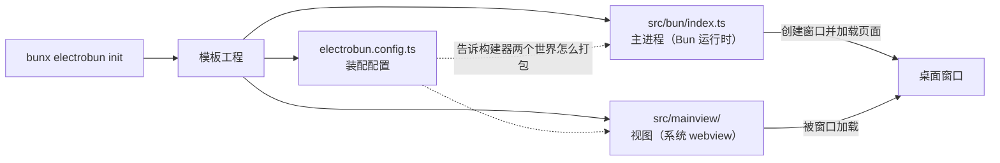
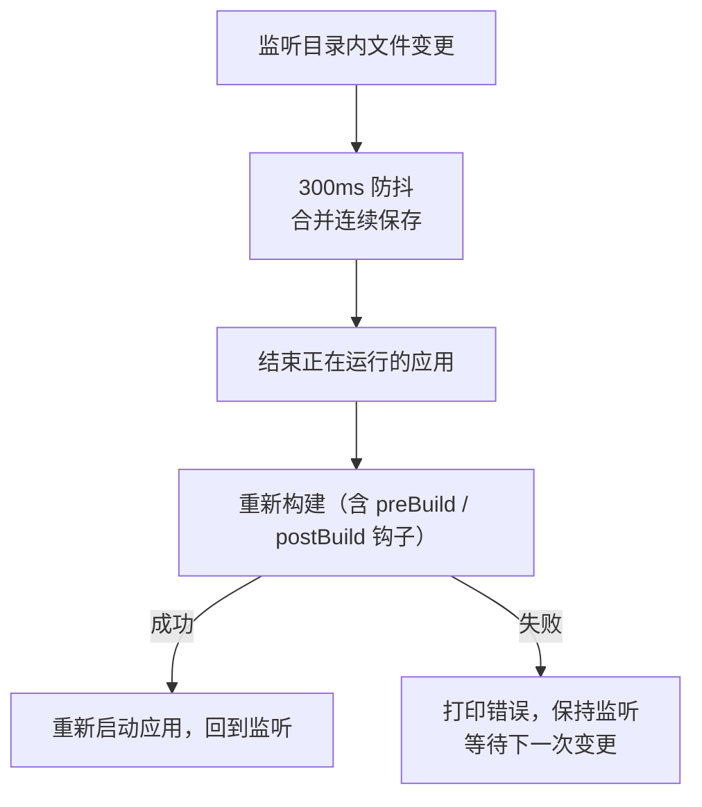

import { Meta } from '@storybook/addon-docs/blocks';

<Meta id="init" title="上手/初始化项目" name="Docs" />

# 初始化项目

`bunx electrobun init` 从内置模板生成一个能直接运行的 Electrobun 工程。认识这套脚手架的关键，是抓住它的一条分界：**`src/bun/` 是主进程（跑在 Bun 运行时里，管窗口和系统能力），`src/mainview/` 是视图（跑在系统 webview 里，管界面）**——init 生成的每个文件都服务于这两个世界的装配。本课走完「生成工程 → 认识目录与依赖 → `electrobun dev --watch` 开发循环」整条链路。

窗口选项与 `views://` 加载细节在[第一个窗口](?path=/docs/first-window--docs)，构建产物与分发在[构建与分发入门](?path=/docs/build-basics--docs)，Vite 热更新工作流在[Vite 集成与 HMR](?path=/docs/vite-hmr--docs)，本课只在脚手架层面带过。



| 对象 | 默认 / 约定 | 回查要点 |
| --- | --- | --- |
| `bunx electrobun init` | 交互式：编号选模板，回车用默认项目名 | 默认名 `my-<template>-app` |
| `bunx electrobun init <name> --template=<tpl>` | 完全非交互 | 省略 `<name>` 时项目名默认 `my-electrobun-app` |
| `build.bun.entrypoint` | `src/bun/index.ts` | 配置里不写也按此默认生效 |
| `scripts.start` / `scripts.dev` | `electrobun dev` / `electrobun dev --watch` | `start` 单次运行，`dev` 持续监听 |
| watch 防抖 | 300ms | 连续保存合并成一轮重建 |
| dev 产物位置 | `build/dev-<os>-<arch>/<name>-dev.app` | 如 `build/dev-macos-arm64/hello-world-dev.app` |

## 快速上手

在任意空目录执行（前置：已安装 Bun；首次运行需联网下载 CLI 二进制，原因见「依赖与脚本」一节）：

```bash
bunx electrobun init     # 交互式：按编号选 hello-world，项目名直接回车
cd my-hello-world-app
bun install
bun run dev
```

可观察结果：

- 终端先打印 `Using config file: electrobun.config.ts`，随后出现 `ELECTROBUN DEV --watch` 横幅和 `Watching 2 directories`（列出 `src/bun` 与 `src/mainview`）。
- 一个 800×800 的窗口打开，显示 "Hello Electrobun!" 页面。
- 修改 `src/mainview/index.html` 里的标题并保存：终端打印重建与重启日志，窗口内容随之更新。
- `Ctrl+C` 优雅退出，再按一次强制退出。

到这里开发循环已经成立。下面各节分别回答：init 怎么用、生成了什么、依赖是什么、循环怎么转。

## init 用法与模板

`init` 有三种用法（以 1.18.1 为准）：

| 用法 | 行为 |
| --- | --- |
| `bunx electrobun init` | 交互式：先列全部模板（按编号），选完再问项目名 |
| `bunx electrobun init <tpl>`（`<tpl>` 恰为模板名） | 直接用该模板，目录名 = 模板名 |
| `bunx electrobun init <name> --template=<tpl>` | 完全非交互，目录名 = `<name>` |

项目名的默认规则随用法变化：交互式回车用 `my-<template>-app`；`--template=` 给了位置参数就用它；`--template=` 没给位置参数时用 `my-electrobun-app`。注意一个容易误会的点：**位置参数单独出现且不是模板名时会被忽略**，`bunx electrobun init my-app` 不带 `--template=` 时仍会进入交互流程；而 `bunx electrobun init hello-world` 的目录名就是 `hello-world`（位置参数同时被当作项目名），想要别的目录名就用 `--template=` 形式。

内置模板注册表共 13 个（交互列表的编号即注册表顺序，但会随版本变化；文档站 CLI 页的清单较旧，以本机实际列出为准）。下表按用途分组，不对应交互编号：

| 模板 | 内容 | 适合 |
| --- | --- | --- |
| `hello-world` | 单窗口最小应用 | 第一次上手（本课与范例工程形态） |
| `multi-window` | 多窗口 + RPC 通信 | 多窗口形态 |
| `multitab-browser` | 多标签浏览器 | 多视图与 webview 嵌合 |
| `notes-app` | 文件系统 + RPC 的笔记应用 | 数据与系统能力 |
| `sqlite-crud` | SQLite 增删改查（经 RPC） | 本地数据库 |
| `photo-booth` | 相机拍照应用 | 设备接入 |
| `tray-app` | 系统托盘常驻应用 | 后台常驻形态 |
| `tailwind-vanilla` | Tailwind CSS + 原生 TypeScript | 轻样式工程 |
| `vanilla-vite` | 原生 TypeScript + Vite HMR | 想要前端热更新 |
| `react-tailwind-vite` | React + Tailwind + Vite | React 技术栈 |
| `wgpu-threejs` | Three.js + 物理（WebGPU） | 3D 渲染 |
| `wgpu-babylon` | Babylon.js 平台跳跃（WebGPU） | 3D 渲染 |
| `wgpu-mlp` | WebGPU 神经网络示例 | GPU 计算 |

所有模板共享同一套骨架（两个 src 目录 + 配置三件套），差别在视图层和演示的能力。Vite 系模板（`vanilla-vite`、`react-tailwind-vite`）的 `dist` → `copy` 装配和双进程工作流在[Vite 集成与 HMR](?path=/docs/vite-hmr--docs)展开。

## 目录结构

`hello-world` 模板生成的文件（其他模板同骨架）：

| 文件 | 职责 |
| --- | --- |
| `src/bun/index.ts` | 主进程入口，创建第一个窗口 |
| `src/mainview/index.html` | 视图页面入口 |
| `src/mainview/index.ts` | 视图脚本 |
| `src/mainview/index.css` | 视图样式 |
| `electrobun.config.ts` | 应用元信息 + views 构建 + copy 装配 |
| `package.json` | 依赖与脚本 |
| `tsconfig.json` | TypeScript 配置 |
| `llms.txt` | 给 AI 工具的项目上下文说明（导入约定、文档地址） |
| `.gitignore` / `README.md` | 常规（忽略 `node_modules/`、`build/`、`dist/`、`artifacts/`、`*.tsbuildinfo`） |

### src/bun 主进程

主进程跑在 Bun 运行时（不是 Node.js）里，入口由 `build.bun.entrypoint` 指定，默认 `src/bun/index.ts`——模板配置里没写这一项也会按默认生效。窗口、菜单、托盘、文件系统等系统能力的 API 都从 `electrobun/bun` 导入，只在这一侧可用。模板生成的主进程只做一件事：

```ts
import { BrowserWindow } from "electrobun/bun";

// 创建应用主窗口
const mainWindow = new BrowserWindow({
	title: "Hello Electrobun!",
	url: "views://mainview/index.html",
	frame: { width: 800, height: 800, x: 200, y: 200 },
});
```

`url` 里的 `views://` 指向打包进应用的视图产物。`BrowserWindow` 的选项含义与加载机制在[第一个窗口](?path=/docs/first-window--docs)，这里只需要知道：改主进程行为就改这个文件。

### src/mainview 视图

视图跑在系统 webview 里（macOS 是 WKWebView；换成 CEF 的取舍见[跨平台与兼容性](?path=/docs/cross-platform--docs)）。`index.html` 是页面入口；`index.ts` 被 views 构建打包；HTML 与 CSS 由 copy 原样复制。视图代码从 `electrobun/view` 导入 API，与主进程通信的机制在[Electroview](?path=/docs/electroview--docs)。

两个世界在构建时被装配成一个应用包：

```mermaid
flowchart LR
  b["src/bun/index.ts"] -->|"Bun.build 打包"| p["应用主进程"]
  t["src/mainview/index.ts"] -->|"views 构建"| v["应用包内 views/mainview/"]
  h["index.html / index.css"] -->|"copy 原样复制"| v
  p --|"窗口加载 views://mainview/index.html"| v
```

把哪份源码当视图、复制哪些文件，都写在 `electrobun.config.ts` 的 `build.views` 与 `build.copy` 里；完整配置语义在[构建配置](?path=/docs/build-config--docs)。

## 依赖与脚本

`hello-world` 的 `package.json` 去掉描述后就是全部依赖与脚本：

```json
{
	"scripts": {
		"start": "electrobun dev",
		"dev": "electrobun dev --watch"
	},
	"dependencies": {
		"electrobun": "1.18.1"
	},
	"devDependencies": {
		"@types/bun": "latest"
	}
}
```

- **运行时依赖只有 `electrobun` 一个包。** 它同时提供两端 API（`electrobun/bun`、`electrobun/view`）和 CLI（`bin/electrobun`），不存在单独的 CLI 包或 SDK 包。版本是精确版本（不是 `^` 范围），随模板固定在生成时的版本；升级时手动改版本号再 `bun install`。
- `@types/bun` 是开发依赖，给主进程里的 Bun 运行时 API 提供类型。
- `tsconfig.json` 一份配置服务两个世界：`lib: ["ESNext", "DOM"]`——主进程用 ESNext 一侧，视图用 DOM 一侧。

首次执行与 CLI 二进制：npm 包里的 `bin/electrobun.cjs` 只是引导脚本，首次运行 `electrobun` 命令（包括 `bunx electrobun init`）时，它按当前平台从 GitHub Releases 下载 `electrobun-cli-<platform>-<arch>.tar.gz`，解压后缓存到 `node_modules/electrobun/.cache` 并复制为可执行文件，之后直接复用不再下载。所以第一次执行需要能访问 GitHub。

## 开发循环

三个命令覆盖日常（都在工程目录执行，等价于对应 npm script）：

| 命令 | 行为 | 适用 |
| --- | --- | --- |
| `electrobun dev`（`bun start`） | dev 构建 + 启动，不监听 | 跑一次看结果 |
| `electrobun dev --watch`（`bun run dev`） | 构建启动后持续监听 | 日常迭代 |
| `electrobun run` | 不重建，直接启动已有 dev 产物 | 快速重跑 |

dev 构建不做代码签名，日志直接打终端（`--env` 构建通道的差异属于[构建与分发入门](?path=/docs/build-basics--docs)）。产物是完整的应用包，位于 `build/dev-<os>-<arch>/<name>-dev.app`——`hello-world` 模板在 macOS arm64 上就是 `build/dev-macos-arm64/hello-world-dev.app`，可以直接用 `open` 启动。

### --watch 机制

`--watch` 在「构建 + 启动」之外加了一轮循环，每次变更的完整路径是：



监听范围不是整个工程，而是从配置推导出的目录（递归监听）。`hello-world` 实际监听 `src/bun` 与 `src/mainview` 两个目录，来源是：

| 来源 | 说明 |
| --- | --- |
| `build.bun.entrypoint` 所在目录 | 默认即 `src/bun` |
| 各 views entrypoint 所在目录 | `src/mainview` |
| `build.copy` 的源路径 | 目录取自身，文件取所在目录（这里是 `src/mainview`） |
| `build.watch` 额外声明 | 不写就没有其他目录 |

始终忽略 `build/`、`artifacts/`、`node_modules/` 三个目录，以及 `build.watchIgnore` 匹配的 glob（Vite 系模板用它忽略 `dist/**` 这类外部构建产物）。没有可监听目录时启动即报错退出。

关键含义：改了未声明目录里的文件不会触发重建，这是下面第一条常见问题的来源。

## 常见问题

- 保存了文件，应用没有自动重建。
  先确认改动落在监听目录内：只有 `build.bun.entrypoint`、views entrypoint、`build.copy` 源和 `build.watch` 声明的目录（递归）被监听。跨目录共享的代码（如新建的 `src/shared/`）要显式加进 `build.watch`；再检查没有命中 `build.watchIgnore`，改的也不是 `build/` 产物本身。
- 第一次执行 `bunx electrobun init` 卡在 `Downloading electrobun CLI for your platform...`，或报 CLI 下载失败。
  npm 包不含平台二进制，首次执行要从 GitHub Releases 下载 `electrobun-cli-<platform>-<arch>.tar.gz`。检查对 `github.com` 的网络访问（含代理与镜像设置）；下载成功后缓存在 `node_modules/electrobun/.cache`，之后不再联网。

## 总结回顾

摘要：

`bunx electrobun init` 从 13 个内置模板生成工程，三种用法对应不同的项目名默认规则。骨架以 `src/bun`（Bun 主进程，入口默认 `src/bun/index.ts`）和 `src/mainview`（系统 webview 视图）为分界，由 `electrobun.config.ts` 的 views 与 copy 装配进应用包，窗口用 `views://mainview/index.html` 加载。运行时依赖只有 `electrobun` 本身（同时提供 CLI 与两端 API），首次执行需从 GitHub 下载平台 CLI 二进制。日常迭代用 `electrobun dev --watch`：监听配置声明的目录、300ms 防抖、杀进程-重建-重启，构建失败不退出；dev 产物在 `build/dev-<os>-<arch>/<name>-dev.app`。

一句话：

> Electrobun 工程就是「src/bun 主进程 + src/mainview 视图」两个世界，`electrobun dev --watch` 只监听配置声明的目录，每轮变更都是整轮重建重启。

知识要点：

- `bunx electrobun init` 的三种用法各自的项目名默认规则是什么？
- `hello-world` 模板生成哪些文件，分别属于哪个世界？
- 为什么运行时依赖只有 `electrobun` 一个包？首次执行为什么要联网？
- `dev`、`dev --watch`、`run` 三个命令怎么分工？
- watch 监听哪些目录、始终忽略哪些？防抖多久？构建失败后会怎样？
- dev 产物路径长什么样？

## 参考资料

- [Electrobun 文档站：Quick Start](https://framework.blackboard.sh/electrobun/guides/quick-start/)
- [Electrobun 文档站：CLI Arguments](https://framework.blackboard.sh/electrobun/apis/cli/cli-args/)
- [Electrobun 文档站：Build Configuration](https://framework.blackboard.sh/electrobun/apis/cli/build-configuration/)
- [blackboardsh/electrobun（GitHub，CLI 二进制下载来源）](https://github.com/blackboardsh/electrobun)
