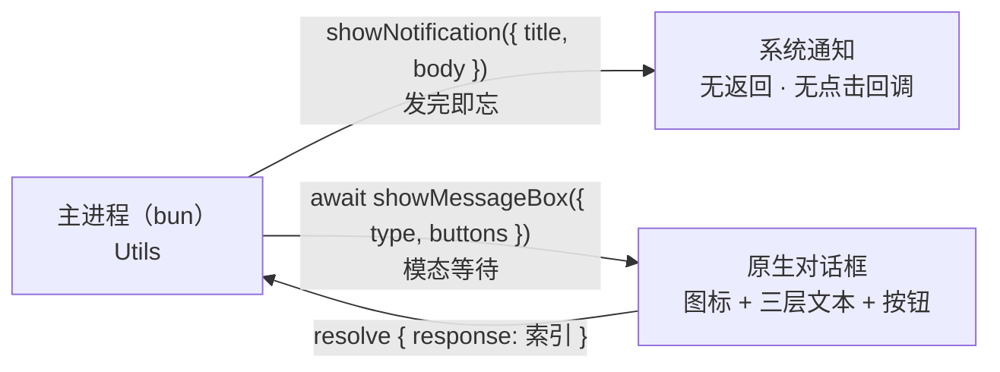
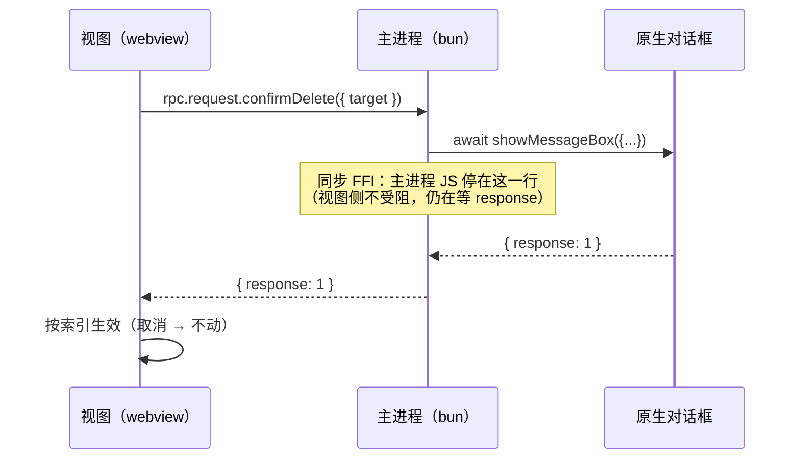

import { Canvas, Meta } from '@storybook/addon-docs/blocks';
import * as NotificationsDialogsStories from './notifications-dialogs.stories';

<Meta of={NotificationsDialogsStories} name="Docs" />

# 通知与对话框

`Utils.showNotification` 与 `Utils.showMessageBox`（`import { Utils } from "electrobun/bun"`，挂在主进程的 Utils 命名空间下）是两个方向相反的系统触达能力：前者把一条**系统通知**发出去就结束——无返回值、无点击回调；后者弹一个**原生对话框**问用户，`await` 到按钮被点击才继续，拿回 `{ response: 按钮索引 }`。选择标准一句话：只需告知（下载完成、同步结束、后台任务结果）用通知；要用户做决定、后续逻辑依赖这个决定（删除确认、未保存退出）用对话框。两者都只在主进程可用，视图里的按钮要触发它们，标准做法是经一条自定义 RPC 请主进程代发（见下文「视图侧联动」）；选文件的系统对话框是另一个 API（`Utils.openFileDialog`），由[路径与工具](?path=/docs/paths-and-utils--docs)一课承载。



开场参考表（默认值按 1.18.1 包内 `dist/api/bun/core/Utils.ts` 的参数归一核对；两个 Options 类型可从 `electrobun/bun` 直接 `import type` 导入，函数本体挂在 `Utils` 命名空间下）：

**`Utils.showNotification(options)` → `void`**

| 字段 | 类型 | 默认 | 回查要点 |
| --- | --- | --- | --- |
| `title` | string | 必填 | 通知标题 |
| `body` | string | — | 正文 |
| `subtitle` | string | — | macOS 显示在标题与正文之间；其他平台作为附加行显示 |
| `silent` | boolean | `false` | `true` 时不播放提示音（横幅照常显示） |

**`await Utils.showMessageBox(options)` → `Promise<{ response: number }>`**

| 字段 | 类型 | 默认 | 回查要点 |
| --- | --- | --- | --- |
| `type` | "info" / "warning" / "error" / "question" | `"info"` | 决定对话框图标 |
| `title` | string | `""` | 对话框窗口标题 |
| `message` | string | `""` | 主消息 |
| `detail` | string | `""` | 补充说明，部分平台以小字号显示 |
| `buttons` | string[] | `["OK"]` | 按钮标签数组；`response` 返回被点按钮的 0 起索引 |
| `defaultId` | number | `0` | 打开时聚焦的按钮 |
| `cancelId` | number | `-1` | Esc / 关闭对话框时返回的索引；`-1` 表示未指定 |

平台机制（官方文档）：macOS 的通知进入系统通知中心；Windows 是托盘附近的气球通知；Linux 用 `notify-send` 命令，需要 `libnotify-bin`（多数桌面发行版自带）。

## 快速上手

任何可运行的 electrobun 工程（如[第一个窗口](?path=/docs/first-window--docs)的 hello-world），在 `src/bun/index.ts` 追加：

```ts
import { Utils } from "electrobun/bun";

// 2 秒后弹系统通知：发完即忘，没有返回值也没有回调
setTimeout(() => {
  Utils.showNotification({ title: "同步完成", body: "3 个文件已同步" });
}, 2000);

// 模态对话框：await 到用户点击后才继续，response 是被点按钮的索引（0 起）
const { response } = await Utils.showMessageBox({
  type: "question",
  title: "退出确认",
  message: "还有未保存的修改，确定退出吗？",
  detail: "未保存的修改将丢失。",
  buttons: ["退出", "取消"],
  defaultId: 1, // 打开时聚焦「取消」
  cancelId: 1, // Esc / 关闭对话框等同点了「取消」
});
console.log("用户点击:", response, response === 0 ? "→ 退出" : "→ 留下");
```

`bun start` 后核对：系统通知先弹出（默认带提示音）；对话框模态弹出，**它关闭前终端不打印任何东西**——主进程停在 `await` 这一行；点「取消」后终端才打印 `用户点击: 1 → 留下`。

## 系统通知

`showNotification` 是单向广播：四个字段经 FFI 交给系统后立即返回（`void`）。1.18.1 没有通知的点击回调、动作按钮、图标或进度 API——`NotificationOptions` 的全部字段就是开场表的 4 个。适合「用户不在窗口前也希望知道」的结果告知：

```ts
// 下载完成：标题 + 正文 + 默认提示音
Utils.showNotification({ title: "下载完成", body: "electrobun.dmg 已就绪" });

// 日历提醒：macOS 上 subtitle 显示在标题与正文之间
Utils.showNotification({
  title: "提醒",
  subtitle: "日历事件",
  body: "15 分钟后团队会议",
});

// 后台同步：高频场景关提示音，只留横幅
Utils.showNotification({ title: "同步完成", body: "全部文件已是最新", silent: true });
```

要点：

- **`subtitle` 有平台差异**：macOS 渲染在标题与正文之间；其他平台作为附加行显示（类型注释原文如此）。
- **`silent` 只影响声音**：横幅照常弹出，不要拿它当「不显示」开关——1.18.1 没有「不显示」选项，不调用就是不显示。
- **通知能否弹出最终由系统决定**：文档没有提供权限申请流程；macOS 受系统「通知设置」约束，dev 模式（从终端启动）时通知归属通常是终端应用而非应用本体（见「常见问题」）。

## 消息对话框

`showMessageBox` 与 Electron 的 `dialog.showMessageBox()` 同形：一个原生模态对话框、一组按钮、一个被点索引。实现把参数经 FFI 交给原生弹出对话框（`buttons` 数组在 FFI 层以逗号拼接成一个字符串传递），等用户点击后返回索引，包装成 `Promise<{ response }>`。

### 文本与图标

三层文本各司其职，`type` 只决定图标：

```ts
await Utils.showMessageBox({
  type: "error",            // 图标：info / warning / error / question
  title: "保存失败",          // 对话框窗口标题
  message: "文件写入失败。",   // 主消息：一句话结论
  detail: "磁盘可能已满，或当前用户没有写入权限。", // 补充：原因 / 后果
  buttons: ["确定"],
});
```

分工判断：用户扫一眼就该懂的结论放 `message`；需要展开的原因、后果、路径放 `detail`；`title` 只是窗口标题，别承载关键信息。

### 按钮与 response

`buttons` 是标签数组，`response` 返回被点按钮的 0 起索引；`defaultId` 决定打开时聚焦谁，`cancelId` 决定 Esc / 关闭对话框时返回谁。删除确认的标准写法：

```ts
const { response } = await Utils.showMessageBox({
  type: "question",
  title: "确认删除",
  message: "删除这份草稿吗？",
  detail: "删除后不可恢复。",
  buttons: ["删除", "取消"],
  defaultId: 1, // 聚焦「取消」：默认操作落在安全分支
  cancelId: 1,  // Esc / 关闭对话框 = 取消
});
if (response === 0) {
  await deleteDraft();
}
```

三个及以上按钮按索引 `switch`：

```ts
const { response } = await Utils.showMessageBox({
  type: "warning",
  message: "有未保存的修改。",
  buttons: ["保存", "不保存", "取消"],
  defaultId: 0,
  cancelId: 2,
});
switch (response) {
  case 0:
    await save();
    close();
    break;
  case 1:
    close();
    break;
  default:
    // 取消：什么都不做
    break;
}
```

要点：

- **`cancelId` 默认 `-1`（未指定）**：想让 Esc / 关闭对话框等价于某个按钮，必须显式设置；可取消的对话框漏设是高频错误（见「常见问题」）。
- **安全项做 `defaultId` 与 `cancelId`**：危险动作（删除、覆盖）让回车和 Esc 都触达不到，误触不会直接执行。
- **按钮标签不要含逗号**：`buttons` 在 FFI 层以逗号拼接传递（`buttons.join(",")`），标签内的逗号会被拆成多个按钮。
- **模态期间主进程停在这一行**：底层是同步 FFI 调用，对话框关闭前主进程的 JS（定时器、RPC 处理、其他事件）都不跑；对话框关闭、FFI 返回后 Promise 才带着索引继续。快速上手里「终端在关闭前不打印」就是这个特性的直接证据。

## 视图侧联动

两个 API 都在主进程模块 `electrobun/bun` 里，视图侧没有对应能力。页面按钮要弹通知或对话框，标准做法是经一条自定义 RPC（schema、send / request、handlers 见[自定义 RPC](?path=/docs/rpc--docs)）请主进程代发。两种语义正好对应 RPC 的两种形态——对话框要结果，用 `rpc.request`（有响应）；通知不等结果，用 `rpc.send`（无响应）：



通知路径没有回程：视图 `rpc.send.notifyFinished(...)` → 主进程 `showNotification(...)`，结束。

联动回路可以在浏览器里完整走一遍——把视图按钮、RPC 代发、模态等待与系统通知横幅同构搬进 Canvas。点草稿「删除」弹出模拟对话框（默认聚焦「取消」），点按钮或点遮罩分别对应 `response` 与 `cancelId` 两条路径；「模拟下载完成」弹出的横幅没有任何回程：

<Canvas of={NotificationsDialogsStories.NotificationsDialogsFlow} />

| 读者操作 | 可观察证据 |
| --- | --- |
| 点草稿行的「删除」 | readout：`rpc.request.confirmDelete({ target: 'draft-0' })` → `await showMessageBox({ type: 'question', buttons: ['删除','取消'], defaultId: 1, cancelId: 1 })`；bun 面板变为「JS 停在 await 行」，对话框打开时聚焦「取消」 |
| 点对话框「删除」 | readout：`resolve { response: 0 }` → 返回视图 → 草稿行从窗口里移除 |
| 点对话框「取消」或点遮罩 | readout：`resolve { response: 1 }`——按钮点击与 Esc / 关闭同走 `cancelId` 索引，草稿保留 |
| 点「模拟下载完成」 | readout：`rpc.send.notifyFinished(...)` → `showNotification({ title, subtitle, body })`，右上系统区弹出横幅约 3 秒；「返回视图」一栏是「无返回——send 不等结果」，页面只更新状态行 |
| 对话框未关时再点窗口按钮 | 点不进去——模态挡住视图、主进程停在 await，这正是「视图等 response、主进程等用户」的双向停顿 |

真实窗口行为以课程目录的桌面范例为准（四个文件，按下表归位后 `bun start`）：

| 文件 | 放到工程 | 职责 |
| --- | --- | --- |
| `notifications-dialogs-rpc.ts` | `src/shared/types.ts` | 联动契约：confirmDelete（视图 → bun，request 有响应）与 notifyFinished（视图 → bun，send 无响应） |
| `notifications-dialogs-bun.ts` | `src/bun/index.ts` | 窗口 + RPC 处理：request 里 await 对话框并回传索引，message 里代发通知，另有主进程直发通知的定时器 |
| `notifications-dialogs-view.html` | `src/mainview/index.html` | 草稿列表（带 `data-delete` 标识）与「模拟下载完成」按钮 |
| `notifications-dialogs-view.ts` | `src/mainview/index.ts` | 按钮发起 rpc.request / rpc.send，按回传 response 生效 |

归位后核对：点草稿「删除」弹原生对话框（聚焦「取消」），点「删除」终端打印 `response: 0`、列表移除该项，点「取消」或 Esc 打印 `response: 1`、列表不动；对话框未关闭时点页面按钮没有反应，终端也不打印——主进程停在 await。点「模拟下载完成」系统弹出通知横幅，页面状态行同步更新；启动 5 秒后还会自动弹一条静音通知（主进程直发，不经 RPC）。

组合要点：

- **对话框用 request、通知用 send**：要结果的调用别用 send——视图拿不到用户点了哪个按钮。
- **等对话框的 request 要放开超时**：`maxRequestTime` 默认只有 1000 毫秒，且只管**调用方**（视图侧）发出的请求——用户看着对话框超过 1 秒，视图的 Promise 就以 `RPC request timed out.` reject，迟到的按钮索引被丢弃。在视图侧 `defineRPC` 里调大或设 `Infinity`（超时细则见[自定义 RPC](?path=/docs/rpc--docs)）。
- **按钮安全设计写在主进程 handler 里**：按钮布局、`defaultId` / `cancelId` 一起决定，视图只消费索引。
- **通知文案由触发方带给主进程**：主进程只代发，不在主进程硬编码所有文案。

## 最佳实践

- **告知用通知、决策用对话框**：纯结果通报弹对话框只会打断用户并阻塞主进程；反过来，删除确认发通知会让关键决定淹没在通知中心。
- **危险操作的安全三件套**：`buttons` 里保留明确的取消项，`defaultId` 与 `cancelId` 都指向它——回车和 Esc 天然落在安全分支。
- **对话框未决时不排主进程任务**：同步 FFI 模态会暂停主进程 JS——保存、日志落盘等要紧收尾放在 `await` 之前完成，依赖结果的逻辑全部放到 `await` 之后。
- **通知克制与静音**：批量 / 重复事件合并成一条；高频或夜间场景 `silent: true`，只保留横幅不响铃。

## 常见问题

- 通知没弹出来。
  依次检查：`silent` 只关声音不影响显示；macOS 的系统通知权限（系统设置 → 通知；dev 模式从终端启动时，通知归属常是终端应用而非应用本体）；Linux 需要 `libnotify-bin`（`notify-send`）。1.18.1 文档没有提供权限申请流程，也没有相关 API。
- 视图触发对话框后，Promise 一秒左右就 reject「RPC request timed out.」。
  RPC request 的默认超时是 1000 毫秒，计时在**调用方**（视图侧）：用户看着对话框的时间几乎必超。在视图侧 `defineRPC` 里把 `maxRequestTime` 调大或设 `Infinity`；超时后迟到的 response 会被丢弃，不会重放。
- 按 Esc 或直接关掉对话框后，`response` 的值不符合预期。
  `cancelId` 默认 `-1`（未指定 Esc / 关闭返回哪个索引）。想让 Esc / 关闭等价于某个按钮，必须显式把 `cancelId` 设为该按钮索引。
- 对话框开着时，主进程的定时器和 RPC 好像都停了。
  正常：底层是同步 FFI 调用，模态期间主进程 JS 停在调用行，关闭即恢复。不要在这段时间依赖主进程侧的延时逻辑（视图侧不受阻，还在等 response）。
- 想在视图代码里直接调用 `showNotification` / `showMessageBox`。
  这两个 API 属于主进程模块 `electrobun/bun`（依赖 Bun 运行时与 FFI），视图侧没有对应能力；经自定义 RPC 请主进程代发（见「视图侧联动」）。

## 总结回顾

摘要：

通知与对话框是主进程 `Utils` 的两个系统触达能力，语义相反：`showNotification({ title, body, subtitle?, silent? })` 单向广播，无返回值、无点击回调，macOS 进入通知中心、Windows 托盘气球、Linux notify-send；`await showMessageBox({ type, title, message, detail, buttons, defaultId, cancelId })` 弹原生模态对话框，`response` 返回被点按钮的 0 起索引，`defaultId` 决定初始聚焦（默认 0）、`cancelId` 决定 Esc / 关闭的返回索引（默认 -1 未指定），按钮标签不能含逗号（FFI 层逗号拼接）。对话框底层是同步 FFI：模态期间主进程 JS 停在调用行。两者都只在主进程，视图经 RPC 代发——对话框用 `rpc.request` 拿索引（并把视图侧 `maxRequestTime` 放开，默认 1000 毫秒必撞人工等待），通知用 `rpc.send` 不等回程。

一句话：

> 通知发完即忘、对话框问到索引才继续：要告知用 `showNotification`，要用户决定用 `await showMessageBox`，视图侧一律经 RPC 请主进程代发。

知识要点：

- `showNotification` 有哪些参数？返回什么？能拿到通知的点击事件吗？
- `showMessageBox` 的 `response` 是什么？`defaultId` 与 `cancelId` 各自的默认值和作用是什么？
- 三层文本 `title` / `message` / `detail` 怎么分工？`type` 影响什么？
- 对话框打开期间主进程在干什么？视图侧此时在等什么？
- 视图按钮怎么触发系统通知 / 对话框？`rpc.request` 与 `rpc.send` 怎么选？默认超时会带来什么问题？
- 通知在三大平台的机制分别是什么？没弹出来先查什么？
- 按钮标签为什么不能含逗号？

## 参考资料

- [Electrobun 文档：Utils（showNotification / showMessageBox）](https://framework.blackboard.sh/electrobun/apis/utils/)
- electrobun 1.18.1 包内实现：`dist/api/bun/core/Utils.ts`（`NotificationOptions` / `MessageBoxOptions` 类型、默认值归一与 JSDoc 示例）、`dist/api/bun/proc/native.ts`（`showNotification` / `showMessageBox` 的 FFI 签名与 `buttons.join(",")` 拼接）、`dist/api/shared/rpc.ts`（`maxRequestTime` 默认 1000 毫秒、超时 reject 与迟到 response 丢弃）
