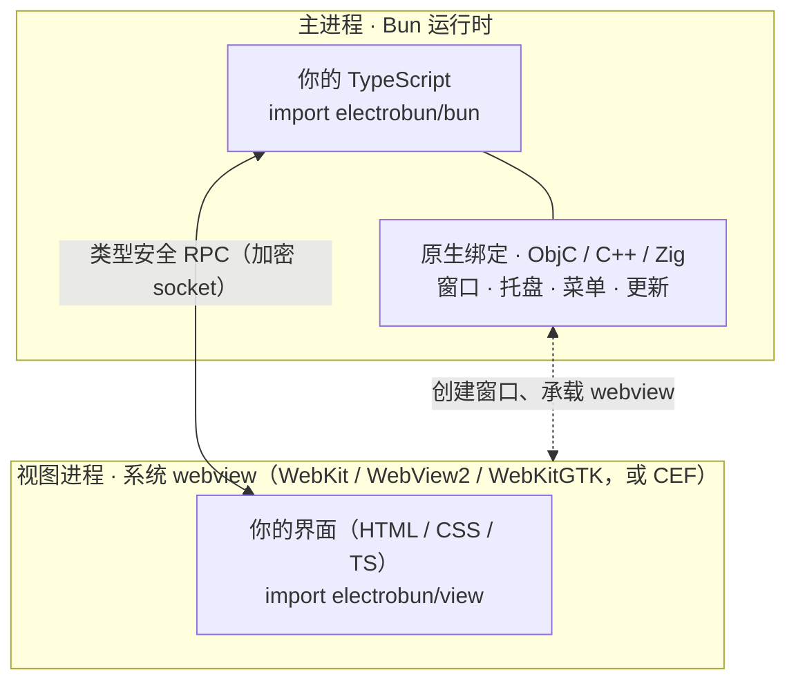
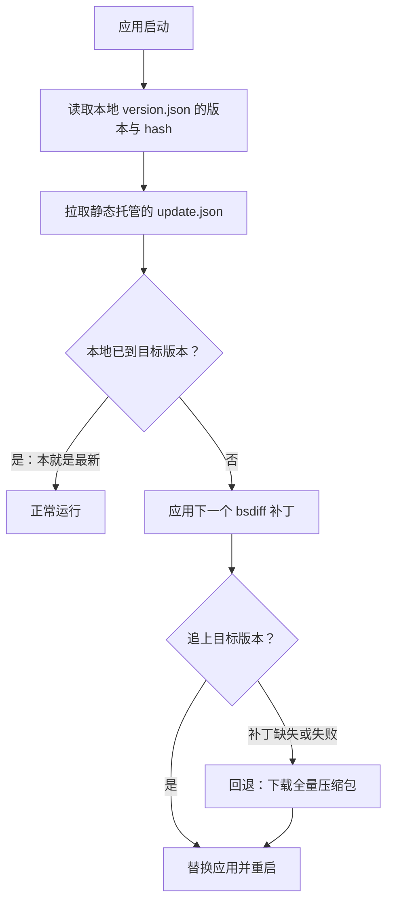

import { Meta } from '@storybook/addon-docs/blocks';

<Meta id="overview" title="上手/认识 Electrobun" name="Docs" />

# 认识 Electrobun

Electrobun 是一个用 TypeScript 写跨平台桌面应用的框架：**主进程跑在 Bun 运行时上，界面交给操作系统自带的 webview 渲染，两端用类型安全的加密 RPC 通信**。它和 Electron 解决同一个问题——用 Web 技术做桌面应用——但把两样最贵的东西换掉了：不分发 Chromium，主进程不用 Node.js。安装包因此压到 ~14MB，每次更新只需 KB 级的二进制差分补丁。本课建立整体判断：架构由什么组成、与 Electron/Tauri 的根本差异、体积与更新目标从哪来、什么项目适合选它。动手部分从[初始化项目](?path=/docs/init--docs)开始，本课不建工程。

| 关键事实 | 内容 | 回查要点 |
| --- | --- | --- |
| 版本基准 | electrobun 1.18.1（npm） | 本手册的 API 与行为全部以此为准 |
| 目标平台 | macOS ARM64 / x64、Windows x64、Linux x64 / ARM64 | Windows ARM64 走 x64 模拟；开发平台限制见「常见问题」 |
| 系统 webview | macOS：WebKit（WKWebView）；Windows：WebView2（Edge）；Linux：WebKitGTK | 三平台都可用 `bundleCEF` 打包 CEF 125（Chromium） |
| 官方宣称数字 | 安装包 ~14MB · 更新 KB 级 · 冷启动 <50ms | 宣称值，实际因应用而异 |
| 初始化命令 | `bunx electrobun init` | 交互式模板脚手架，见[初始化项目](?path=/docs/init--docs) |
| 许可证 | MIT | 宽松许可，可免费商用 |

## 架构

一个运行中的 Electrobun 应用里，你的代码只出现在两个地方：**主进程**（管窗口和系统能力）和**若干 webview 进程**（管界面）。Electrobun 本体是中间的原生层——ObjC / C++ / Zig 写的系统绑定，加上把两端粘起来的 RPC 通道：



三块各自是什么、怎么配合，展开成下面三个小节。

### 主进程

官方架构文档的第一句值得先记住：**"An Electrobun app is essentially a Bun app"**（Electrobun 应用本质上是一个 Bun 应用）。主进程就是一段普通 TypeScript，跑在 Bun 运行时上——没有 Node.js 与 V8 的开销，Bun 自带的打包器、文件、网络等标准能力全部可用；窗口、托盘、菜单这些桌面能力则由原生绑定桥接到系统 API，再暴露成 TypeScript 类。一个 hello-world 的主进程只有这么多：

```ts
// src/bun/index.ts —— Electrobun hello-world 的全部主进程代码
import { BrowserWindow } from "electrobun/bun";

const mainWindow = new BrowserWindow({
  title: "Hello Electrobun!",
  url: "views://mainview/index.html", // 从打包资源加载界面（见「视图」小节）
  frame: { width: 800, height: 800, x: 200, y: 200 },
});
```

桌面窗口无法在本文页面里内嵌演示：这段代码要在 Electrobun 工程里用 `electrobun dev` 启动才会弹出真实窗口。工程怎么来、怎么跑，在[初始化项目](?path=/docs/init--docs)和[第一个窗口](?path=/docs/first-window--docs)两课动手。

主进程 API 按职责分四组（对应本手册后续各章，这里只建能力地图）：

- 窗口与视图：`BrowserWindow`、`BrowserView`、`GpuWindow` / `WGPUView`（不经 webview 的原生 GPU 表面）
- 系统集成：`ApplicationMenu`、`ContextMenu`、`Tray`、`GlobalShortcut`、`Screen`、`Session`、`Utils`（退出、打开、通知、对话框）
- 分发与更新：`Updater`、`BuildConfig`
- 通信与运行时：`createRPC` / `defineElectrobunRPC`、`Socket`、`PATHS`、`events`

### 视图

界面就是普通 Web 页面：HTML、CSS、TypeScript，用任何前端框架都行。它跑在**操作系统自带的 webview** 里（每个平台用什么引擎见开头参考表），而不是随应用分发的浏览器引擎——这是安装包能压到 ~14MB 的根源，也是贯穿 Electrobun 各项设计的取舍：

- 收益：应用不分发浏览器引擎，包体降到 ~14MB 级（与 Electron 的数字对比见下一节）。
- 代价：macOS 用 WebKit、Windows 用 WebView2、Linux 用 WebKitGTK，三平台引擎不同——标准 Web 特性一般一致，引擎特有行为可能有差异。需要跨机器严格一致的渲染时，把 `electrobun.config.ts` 中对应平台的 `bundleCEF` 设为 `true`，随应用打包 CEF 125（Chromium），用体积换一致性（平台取舍细节在[跨平台与兼容性](?path=/docs/cross-platform--docs)）。
- 视图代码从 `electrobun/view` 导入视图层 API（`Electroview` 类、`<electrobun-webview>` 标签等）；界面文件在构建时收进应用包的 `views/` 目录，主进程用 `views://` 协议按名加载——上面代码里的 `views://mainview/index.html` 就是它。

### 隔离与 RPC

主进程和每个 webview 是相互隔离的操作系统进程：文件、网络、系统能力默认都在 Bun 一侧，界面代码碰不到。这是 Electrobun 的安全基线（官方表述：process isolation by default、最小攻击面），也因此两端协作必须走显式通道——**类型安全的 RPC**：

- 一份 `RPCSchema` 同时约束两端的消息与请求，主进程和视图共享同一份类型定义；
- `createRPC` / `defineElectrobunRPC` 创建通信端：`send` 发单向消息，`request` 发起有应答的调用，对端用 `setRequestHandler` / `addMessageListener` 应答；
- 底层走加密 socket，每个 webview 持有独立的 AES-GCM 密钥，消息在传输层就是密文。

RPC 的完整写法在[自定义 RPC](?path=/docs/rpc--docs)，进程模型与加密链路的深入拆解在[架构原理](?path=/docs/architecture--docs)。

## 与 Electron/Tauri 对比

三家同属「Web 技术 + 原生外壳」路线，定位差异集中在三件事上：

| 维度 | Electron | Tauri | Electrobun |
| --- | --- | --- | --- |
| 主进程运行时 | Node.js | Rust | Bun |
| 界面引擎 | 随应用分发 Chromium | 系统 webview | 系统 webview（可选打包 CEF） |
| 主进程语言 | JavaScript / TypeScript | Rust | TypeScript |

官方给出的量级对比（What is Electrobun? 页，宣称值）：

| 指标 | Electron | Tauri | Electrobun |
| --- | --- | --- | --- |
| 安装包 | 150MB+ | 25MB | 14MB |
| 单次更新 | 100MB+ | 10MB | 14KB |
| 启动时间 | 2-5s | 500ms | <50ms |
| 内存占用 | 100-200MB | 30-50MB | 15-30MB |

两个差异根源值得记住：**Electron 把整套 Chromium + Node 打进每个应用**，所以包大、更新大、启动慢；**Tauri 和 Electrobun 都改用系统 webview**，但 Electrobun 再把主进程换成 Bun——全栈 TypeScript、不用学 Rust，并用 bsdiff 二进制差分把更新做到 KB 级。选型时把数字和成熟度放在一起看：Electron 生态最大、第三方资料最多；Tauri 已稳定多年；Electrobun 还在 1.x 快速演进期，现成插件和资料相对少。

## 体积与更新

三个官方目标数字，各对应一个机制：

- **安装包 ~14MB**：`electrobun build` 把应用打成 ZSTD 压缩的自解压 bundle——发布物是个小外壳应用，用户首次运行时它把压缩包解开、替换成完整应用（官方示例：50.4MB 压到 13.1MB）。这 14MB 的大头是 Bun 运行时本身，不是你的代码。
- **更新 KB 级**：更新不重新下载应用。Zig 写的 SIMD 优化 bsdiff 对比新旧版本，只下发差异补丁；补丁文件托管在任意静态文件服务（S3 + CDN 即可）。文档站示例为 14KB，仓库 README 称最小可到 4KB。
- **冷启动 <50ms**：宣称值，对照组是 Electron 的 2-5s。

更新在用户侧的完整流程：



构建产物怎么生成、体积怎么构成在[构建与分发入门](?path=/docs/build-basics--docs)，`Updater` API 与更新通道配置在[自动更新](?path=/docs/updater--docs)。

## 适用场景

官方给出的适配场景（What is Electrobun? 页）：

- 启动 MVP：快速出活，靠 KB 级更新高频迭代
- 开发者工具：IDE、终端、效率工具这类要原生性能与低占用的应用
- 跨平台应用：一套 TypeScript 代码、原生观感
- 高性能应用：Electron 太慢、原生开发太贵的中间地带
- 带宽敏感、频繁更新的应用：用户几乎无感地拿到新版本
- 多 tab 浏览器类应用：可以混用 WebKit 与 CEF 两种 webview

结合上一节的差异，反向判断同样重要：

- 要求严格跨平台渲染一致、又不想让包变大 → `bundleCEF` 会增重，或直接选 Electron
- 重度依赖 Node 原生模块生态和现成 Electron 插件 → Electron
- 后端明确要用 Rust 写 → Tauri
- 目标用户在 Windows ARM64 且要原生性能 → 目前只有 x64 模拟

生态参考：GitHub 仓库维护着 "Apps Built with Electrobun" 列表（数十个真实应用，如 MarkBun、Co(lab)），选型前可以扫一眼有没有同类产品。

## 常见问题

- Electrobun 是 Electron 的分支或封装吗？
  不是，两者没有任何关系，只是名字相似。Electrobun 由 Blackboard Technologies 开发：主进程跑 Bun 而不是 Node.js，界面用系统 webview 而不是随应用分发 Chromium；差异明细直接看上文对比表。
- GitHub 仓库 README 里的 Hutch、Cottontail 和本手册的工作流对不上？
  仓库 main 分支 README 描述的是开发中的下一代工作流（Hutch CLI、Cottontail 运行时），尚未随 1.18.1 发布。1.18.1 的实际用法是 `bunx electrobun init` 生成工程 + `electrobun.config.ts` 配置 + `electrobun dev` 运行，与文档站一致；本手册以 1.18.1 为基准。
- 在 Windows 或 Linux 上能开发 Electrobun 应用吗？
  文档存在两种表述：Compatibility 页把 macOS（Intel / Apple Silicon）列为构建应用的必需平台、Windows 与 Linux 的开发支持标记为 available；What is Electrobun? 页又宣称 cross-platform builds from any OS。1.18.1 时点最稳妥的做法是在 macOS 上完成构建交付，跨平台细节见[跨平台与兼容性](?path=/docs/cross-platform--docs)。

## 总结回顾

摘要：

Electrobun 把桌面应用拆成两端：主进程是跑在 Bun 运行时上的普通 TypeScript，桌面能力来自 ObjC / C++ / Zig 原生绑定暴露的 `BrowserWindow`、`Tray`、`Updater` 等类；界面是普通 Web 页面，跑在各平台的系统 webview（WebKit / WebView2 / WebKitGTK）里，需要一致性时可打包 CEF。两端进程隔离，靠一份 `RPCSchema` 约束的加密 RPC 通信。与 Electron 的根本差异是不分发 Chromium、主进程不是 Node，与 Tauri 的差异是主进程用 TypeScript 而非 Rust；由此换来 ~14MB 自解压安装包、KB 级 bsdiff 更新和 <50ms 启动的宣称数字。它适合快速迭代、带宽敏感、要原生性能的工具类应用，生态成熟度仍低于 Electron 与 Tauri。

一句话：

> 选 Electrobun 的核心理由：用全栈 TypeScript 把 Web 界面装进 ~14MB 的包、把每次更新压到 KB 级；代价是接受系统 webview 的引擎差异和更年轻的生态。

知识要点：

- Electrobun 应用的两个进程分别跑什么代码、各自从哪里导入？
- 每个平台的系统 webview 是什么？要渲染一致性时怎么办？
- 主进程与 webview 之间怎么通信？为什么默认隔离？
- 与 Electron、Tauri 的三个定位差异是什么？
- ~14MB 安装包、KB 级更新、<50ms 启动分别来自什么机制？
- 哪些项目适合选 Electrobun，哪些应该留在 Electron 或 Tauri？
- 本手册的版本基准是多少？GitHub main 分支 README 描述的方向发布了吗？

## 参考资料

- [What is Electrobun? — Electrobun 官方文档](https://framework.blackboard.sh/electrobun/guides/what-is-electrobun)
- [Architecture Overview — Electrobun 官方文档](https://framework.blackboard.sh/electrobun/guides/architecture/overview)
- [Compatibility — Electrobun 官方文档](https://framework.blackboard.sh/electrobun/guides/compatability)
- [blackboardsh/electrobun — GitHub 仓库](https://github.com/blackboardsh/electrobun)（v1.18.1 README 与 "Apps Built with Electrobun" 列表）
- [electrobun — npm](https://www.npmjs.com/package/electrobun)
