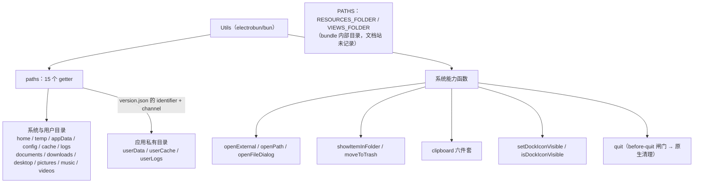
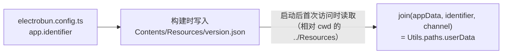
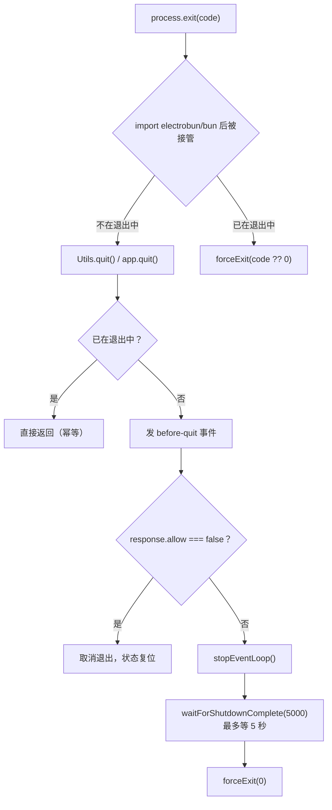

import { Canvas, Controls, Meta } from '@storybook/addon-docs/blocks';
import * as PathsUtils from './paths-and-utils.stories';

<Meta of={PathsUtils} name="Docs" />

# 路径与工具

主进程里「数据放哪、系统能力怎么调」都从两个入口出发：`Utils.paths` 用十五个同名 getter 把三平台 OS 目录统一成一套属性，再按 `version.json` 里的 identifier + channel 拼出应用私有目录；`Utils.*` 函数把打开 URL、选文件、废纸篓、剪贴板、Dock 图标、退出这些一次性系统能力收进同一个命名空间。另有一个文档站未记录的 `PATHS` 常量模块，指向 bundle 内部目录。本课讲清每个 getter 在三平台各落在哪、私有目录的两段从哪来、三个「打开」怎么选、退出走哪条闸门；跑完课程里的工具台工程后，你能预测每个菜单动作的终端输出与系统反应。



回查时先看这组关键事实（三平台解析与 1.18.1 包内 `dist/api/bun/core/Utils.ts` 的 switch 实现逐条核对；`%ENV%` 表示优先读该环境变量，未设置时用后面的回落值）：

| getter | macOS | Windows | Linux |
| --- | --- | --- | --- |
| `home` | `os.homedir()`（三平台同） | 同左 | 同左 |
| `temp` | `os.tmpdir()`（三平台同） | 同左 | 同左 |
| `appData` | `~/Library/Application Support` | `%LOCALAPPDATA%`，回落 `~/AppData/Local` | `$XDG_DATA_HOME`，回落 `~/.local/share` |
| `config` | `~/Library/Application Support`（与 appData 同目录） | `%APPDATA%`，回落 `~/AppData/Roaming` | `$XDG_CONFIG_HOME`，回落 `~/.config` |
| `cache` | `~/Library/Caches` | `%LOCALAPPDATA%`，回落 `~/AppData/Local` | `$XDG_CACHE_HOME`，回落 `~/.cache` |
| `logs` | `~/Library/Logs` | `%LOCALAPPDATA%`，回落 `~/AppData/Local` | `$XDG_STATE_HOME`，回落 `~/.local/state` |

| getter | 解析规则 |
| --- | --- |
| `documents` / `downloads` / `desktop` / `pictures` / `music` | `~/` 同名目录；Windows 挂在 `%USERPROFILE%` 下；Linux 按 `~/.config/user-dirs.dirs` 的 `XDG_*_DIR` 解析，缺失回落 `~/` 同名目录 |
| `videos` | macOS 的目录名是 `~/Movies`；Windows / Linux 是 Videos |
| `userData` / `userCache` / `userLogs` | `join(appData 或 cache 或 logs, identifier, channel)`——两段来自 bundle 的 `version.json`，三平台同式 |

| `Utils` 函数 | 返回 | 作用 |
| --- | --- | --- |
| `openExternal(url)` | boolean | 用系统默认应用打开 URL（`https://`、`mailto:`、自定义 scheme、`file://`） |
| `openPath(path)` | boolean | 用默认应用打开本地文件；目录在文件管理器里打开 |
| `openFileDialog(opts)` | `Promise<string[]>`，元素为所选绝对路径 | 原生文件选择框；取消时返回 `[""]`（见「打开与选择」） |
| `showItemInFolder(path)` | void | 在文件管理器里定位并选中文件或目录 |
| `moveToTrash(path)` | boolean | 移入系统废纸篓（要绝对路径） |
| `clipboardReadText()` / `clipboardWriteText(text)` | string 或 null / void | 文本剪贴板读写；无文本时读出 null |
| `clipboardReadImage()` / `clipboardWriteImage(png)` | Uint8Array 或 null / void | PNG 字节读写 |
| `clipboardClear()` / `clipboardAvailableFormats()` | void / string[] | 清空 / 探测当前格式（如 `text`、`image`、`files`、`html`） |
| `setDockIconVisible(v)` / `isDockIconVisible()` | void / boolean | macOS Dock 图标开关与查询 |
| `quit()` | void | 发 `before-quit`（可取消）→ 原生清理 → 退出 |
| `showNotification` / `showMessageBox` | — | 也在 Utils 上，用法见[通知与对话框](?path=/docs/notifications-dialogs--docs)（路线 4.2.2） |

## 快速上手

课程目录的 `utils-observer/` 是完整可运行工程（macOS + Bun，electrobun 1.18.1）：启动时把全部路径入口的本机真实值打印到终端并渲染进窗口，屏幕顶部菜单的每个动作项触发一个 Utils 能力，结果回打终端。

```bash
cd cheatsheets/paths-and-utils/utils-observer
bun install
bun start
```

窗口出现路径报告表后，按清单逐项操作，核对终端输出与系统反应：

| 操作 | 可观察证据 |
| --- | --- |
| 启动完成 | 终端打出 15 个 getter 与 `PATHS.RESOURCES_FOLDER` / `VIEWS_FOLDER` 的绝对路径；窗口显示同一份报告 |
| 菜单「打开 → openExternal：打开文档站」 | 默认浏览器打开 Electrobun 文档站；终端 `[openExternal] ... 返回 true` |
| 「openPath：打开下载文件夹」 | Finder 打开 `~/Downloads`；终端打印所用的绝对路径与返回值 |
| 「showItemInFolder：定位 version.json」 | Finder 打开 `Contents/Resources` 并选中 `version.json`——`PATHS.RESOURCES_FOLDER` 的落点 |
| 「openFileDialog：选择文件」 | 原生选择框；确认后终端打印路径数组；直接取消打印 `[""]` |
| 「先创建 temp 演示文件」再「moveToTrash」 | 文件从 temp 消失、出现在废纸篓；终端返回 true；废纸篓右键没有「放回原处」 |
| 剪贴板三项 | 写入后立刻读取打印同一字符串；换系统其他内容后读取随之变化，无文本时是 null |
| 「切换 Dock 图标可见性」 | Dock 里的应用图标消失（再切一次回来）；终端打印切换前后状态 |
| 「退出（app.quit）」 | 终端先打出 `[quit]` 与 `[before-quit]` 两行日志，随后应用结束 |

## 应用路径

三个入口——`Utils.paths` 对象、应用私有目录、`PATHS` 常量——共享同一条边界：**只返回字符串，不创建、不校验目录**。getter 每次访问都现读环境变量；Linux 的 `user-dirs.dirs` 与 `version.json` 首次读取后缓存。往里写数据前，目录要自己建。

### paths 对象

```ts
import { Utils } from "electrobun/bun";

Utils.paths.appData;   // macOS: ~/Library/Application Support
Utils.paths.downloads; // ~/Downloads
Utils.paths.temp;      // os.tmpdir()，系统临时目录
```

三平台的差异全部被 getter 名抹平：同一份代码在 macOS 落 `~/Library/...`，在 Windows 落 `AppData`（三个数据类目录都读 `%LOCALAPPDATA%`，唯 `config` 读 `%APPDATA%`），在 Linux 落 XDG 目录。两个容易记错的点：macOS 的 `config` 与 `appData` 是同一个目录；`videos` 在 macOS 的目录名是 `Movies`。Linux 的六个用户目录解析 `~/.config/user-dirs.dirs`（替换 `$HOME`、去引号），文件缺失时回落 `~/` 同名目录。

下面的示意把整套映射搬进浏览器：点 getter 看落点、切平台看目录树换形、改 identifier / channel 看私有目录拼装；真实机器上的值以工具台工程为准。

<Canvas of={PathsUtils.PathsResolutionMap} />

<Controls of={PathsUtils.PathsResolutionMap} />

| 读者操作 | 可观察证据 |
| --- | --- |
| 点 `userData` / `userCache` / `userLogs` | 目录树中对应基础目录下出现 `dev.learn.utils/dev` 行并高亮；顶部解析式显示 join 推导 |
| 「平台」切到 Windows | `appData` / `cache` / `logs` 全部落到 AppData 的 `Local/`，`config` 单独走 `Roaming/`——不再与 appData 同目录 |
| 「平台」切到 Linux | 目录树换成 `.local/` / `.cache/` / `.config/`，注记显示 `$XDG_*` 优先 |
| 在 macOS 平台点 `config` | 与 `appData` 高亮同一行——两者本就是同一目录 |
| 把 identifier 或 channel 清空 | 私有目录行标注「空串被 path.join 跳过 → 退化为上一层」；读数里三个私有目录同步退化 |
| 在 macOS 平台点 `videos` | 用户目录行高亮，注记提示目录名是 Movies |
| 打开 Show code | 看到该 Canvas 实际执行的 `paths-resolution-map.ts`，三平台映射集中在 `BASE_LABEL` |

### 应用私有目录

`userData` / `userCache` / `userLogs` 是写给应用自己的三个落点，两段后缀不是配置项，而是构建产物里的 `version.json`：



tester 工程的 dev 构建产物实测为 `{"identifier":"helloworld.electrobun.dev","channel":"dev",...}`——`identifier` 就是配置里的 `app.identifier`，`electrobun dev` 的构建把 channel 写成 `"dev"`，发布构建则写发布通道。同一约定也被 `Updater.appDataFolder()` 使用，应用数据与更新器天然对齐；不同 channel 的数据目录互相隔离。读取失败（例如脱离 electrobun 启动布局、直接用 bun 跑主进程）时包内以空串兜底，`path.join` 跳过空段，`userData` 退化成 `appData` 本身。

写数据的标准动作是「先建目录再落盘」：

```ts
import { mkdirSync, writeFileSync } from "node:fs";
import { join } from "node:path";
import { Utils } from "electrobun/bun";

const stateFile = join(Utils.paths.userData, "state.json");
mkdirSync(Utils.paths.userData, { recursive: true }); // getter 不会替你建目录
writeFileSync(stateFile, "{}");
```

### PATHS 常量

`PATHS` 是另一个导出（`import { PATHS } from "electrobun/bun"`），只有两个常量，文档站没有记录，指向当前 bundle 的内部目录：

```ts
PATHS.RESOURCES_FOLDER; // resolve("../Resources/")——bundle 的 Contents/Resources
PATHS.VIEWS_FOLDER;     // .../Resources/app/views——views:// 地址的落点
```

两者都是基于进程工作目录解析出的绝对路径（工具台的「定位 version.json」菜单项就用它拼出 `Resources/version.json`）。框架内部也依赖同一落点——例如 Tray 图标的 `views://` 地址就是替换前缀后 join 到 `VIEWS_FOLDER`（见[系统托盘](?path=/docs/tray--docs)）。应用侧主要用它定位打包进 bundle 的只读资源；用户可写数据永远走 `Utils.paths` 的 OS 目录。

## 系统能力

`Utils` 上的系统能力函数共同点：全部经 FFI 一次性直调原生、多数同步返回、彼此独立无状态。它们只在主进程可用——视图层要触发，经 RPC 把请求转给主进程（做法见[自定义 RPC](?path=/docs/rpc--docs) 与[通知与对话框](?path=/docs/notifications-dialogs--docs)的视图侧联动）。

### 打开与选择

三个入口各管一种「打开」，按输入形态选择：

| 场景 | 用法 | 返回 |
| --- | --- | --- |
| 打开网址、邮件、深链 | `Utils.openExternal("https://...")`、`mailto:`、`myapp://` | 成功与否 boolean |
| 用默认应用打开本地文件、在文件管理器里打开目录 | `Utils.openPath(absPath)` | boolean |
| 让用户挑文件 | `await Utils.openFileDialog({...})` | `string[]`，元素是所选绝对路径 |

`openFileDialog` 的参数与包内默认值（文档站把 `canChooseDirectory` 标成 false，包内实现填的是 true，以包内为准）：

| 参数 | 包内默认 | 说明 |
| --- | --- | --- |
| `startingFolder` | `"~/"` | 选择框起始目录 |
| `allowedFileTypes` | `"*"` | 过滤扩展名，多个写成 `"png,jpg"`（逗号分隔字符串） |
| `canChooseFiles` / `canChooseDirectory` | `true` / `true` | 文件与目录默认都能选 |
| `allowsMultipleSelection` | `true` | 默认允许多选 |

返回值按逗号拆分，取消时原生返回空串、拆出 `[""]`——包内没有特判，使用前先 `filter(Boolean)`。真实弹窗无法在 Storybook 里复现，以工具台「打开」菜单的四项为准。

### 回收站与定位

`moveToTrash(path)` 把文件或目录移入系统废纸篓，要绝对路径，返回 boolean。macOS 上它与 Finder 删除的差别：**废纸篓里不提供「放回原处」**，恢复只能手动拖回（文档明确注明）。`showItemInFolder(path)` 在文件管理器（macOS Finder / Windows 资源管理器）里打开父目录并选中该条目，无返回值——工具台用它定位 bundle 里的 `version.json`。

### 剪贴板

六个函数两两成对，读函数拿不到内容时返回 `null`（不是空串），这是判断「剪贴板里没有文本」的正常信号：

```ts
import { Utils } from "electrobun/bun";

const text = Utils.clipboardReadText();
if (text === null) {
  // 剪贴板里没有文本（可能是图片或为空）
}

Utils.clipboardAvailableFormats(); // 如 ["text"] 或 ["text","image","files","html"]
```

图片通道走 PNG 字节（`Uint8Array`），读写各一个函数；`clipboardClear()` 清空全部内容；拿不准剪贴板里是什么时先用 `clipboardAvailableFormats()` 探测。

### 退出

`quit()` 是应用退出的唯一闸门，`app.quit()` 就是它的别名（同一实现）。机制（与包内 `Utils.quit` 逐行对应）：



两个包内行为值得知道：`process.exit` 在导入 `electrobun/bun` 后被改写——不在退出流程中时先走 `quit()` 的清理（清理后以 `forceExit(0)` 收尾，这次调用带的退出码会被归 0）；已在退出流程中时直接 `forceExit(code)`。系统触发的退出（⌘Q、Dock 菜单、最后一个窗口关闭等）也汇入同一套生命周期，退出前的订阅与取消写法属于「应用生命周期」一课的范围（路线 4.3.2）。

```ts
import Electrobun from "electrobun/bun";

Electrobun.events.on("before-quit", (e) => {
  // 落盘、断开连接等收尾放这里
  // e.response = { allow: false }; // 需要拦下本次退出时打开
});
```

### Dock 图标

`setDockIconVisible(false)` 把 macOS 应用切成 `NSApplicationActivationPolicyAccessory`：Dock 图标消失、窗口仍在，适合纯菜单栏 / 托盘形态的应用；`setDockIconVisible(true)` 恢复常规策略，`isDockIconVisible()` 随时查询。文档标注仅 macOS。与托盘配合做「菜单栏应用」的完整形态见[系统托盘](?path=/docs/tray--docs)。

## 最佳实践

- **数据按生命周期落位。** 用户数据与状态进 `userData`，可再生的下载缓存进 `userCache`，日志进 `userLogs`；三者目录段一致（identifier + channel），与 `Updater.appDataFolder()` 的约定对齐。任何一处首次写入前 `mkdirSync(dir, { recursive: true })`。
- **「打开」按输入形态三选一。** URL 与深链给 `openExternal`，本地绝对路径给 `openPath`，让用户挑选给 `openFileDialog`；`openFileDialog` 的结果先 `filter(Boolean)` 过滤取消时的 `[""]` 再用。
- **退出统一走 `app.quit()`。** 收尾逻辑放 `before-quit` 订阅里，需要拦截时设 `response.allow = false`；不要绕过 quit 直接结束进程——原生清理（含 CEF 关停）会被跳过。
- **系统能力留在主进程。** `Utils` 的函数不在视图层可用；视图触发一律经 RPC 转发，参数与返回值在 schema 里收敛成窄类型（见[自定义 RPC](?path=/docs/rpc--docs)）。

## 常见问题

- 往 `Utils.paths.userData` 写文件报 ENOENT，或目录根本不存在。
  getter 只返回字符串，不创建目录。首次写入前 `mkdirSync(Utils.paths.userData, { recursive: true })`。
- dev 时和发布后的数据目录不一样。
  私有目录尾段是 channel：`electrobun dev` 的构建写 `"dev"`（tester 工程实测），发布构建写发布通道。同 identifier 不同 channel 的数据互相隔离，属预期行为。
- 脱离 electrobun 直接 `bun src/bun/index.ts` 跑主进程，`userData` 变成了 `appData` 根目录。
  `version.json` 按相对路径 `../Resources/version.json` 读取，依赖 electrobun 的启动布局（cwd 在 bundle 的 MacOS 目录）；读不到时包内以空串兜底、`path.join` 跳过空段，私有目录退化。用 `electrobun dev` / `electrobun build` 的产物运行。
- `openExternal` 传本地文件路径没有任何反应。
  它接受的是 URL（`https://`、`mailto:`、`file://`、自定义 scheme）。打开本地文件用 `openPath`，传绝对路径。
- `openFileDialog` 明明取消了，拿到的却是 `[""]` 而不是空数组。
  包内把原生返回按逗号拆分，空串拆出单元素数组，未特判取消。使用前 `filter(Boolean)`。
- `moveToTrash` 之后在废纸篓里右键找不到「放回原处」。
  macOS 上的已知行为（文档注明），恢复只能把条目手动拖回原位置。
- `clipboardReadText()` 有时返回 null。
  剪贴板里没有文本（空、或只有图片）时的正常返回，不是错误。判空处理；需要预判可先 `clipboardAvailableFormats()`。

## 总结回顾

摘要：

`Utils.paths` 用十五个 getter 抹平三平台 OS 目录：macOS 落 `~/Library/...`（`config` 与 `appData` 同目录、`videos` 的目录名是 Movies），Windows 落 `AppData`（数据类读 `%LOCALAPPDATA%`、`config` 读 `%APPDATA%`），Linux 落 XDG 目录（用户目录解析 `user-dirs.dirs`）。`userData` / `userCache` / `userLogs` 在此之上按 `version.json` 的 identifier + channel 拼出应用私有目录（dev 构建的 channel 是 `"dev"`），读取失败时空串兜底、退化为基础目录；三个入口都只给字符串，写前自建目录。`PATHS` 常量指向 bundle 内部的 `Resources` 与 `views://` 落点。系统能力全部是 `Utils` 上的 FFI 直调：`openExternal` / `openPath` / `openFileDialog` 三个「打开」按输入形态分工，`moveToTrash` / `showItemInFolder` 管删除与定位，剪贴板六件套读不到返回 null，Dock 图标开关仅 macOS；退出统一走 `quit()`——`before-quit` 可取消，原生清理后 `forceExit(0)`，`process.exit` 也被接管进同一条路。

一句话：

> 路径入口只返回字符串——OS 目录按平台约定解析、私有目录由 `version.json` 的 identifier + channel 拼出；系统能力都是 `Utils` 上的 FFI 直调，退出永远先过 `before-quit` 闸门。

知识要点：

- `Utils.paths` 有哪十五个 getter？`appData` / `config` / `cache` / `logs` 在三平台各落在哪？
- macOS 上 `config` 与 `appData` 是什么关系？`videos` 的目录名是什么？
- `userData` / `userCache` / `userLogs` 的两段后缀从哪来？dev 构建里 channel 是什么？读不到 `version.json` 时退化成什么？
- 为什么往私有目录写文件前要 `mkdirSync`？
- `PATHS.RESOURCES_FOLDER` / `VIEWS_FOLDER` 指向哪里？`views://` 地址落在哪个目录？
- `openExternal` / `openPath` / `openFileDialog` 各自接受什么输入？`openFileDialog` 取消时返回什么？
- `quit()` 的完整流程是什么？`before-quit` 如何取消退出？`process.exit` 被接管后发生什么？
- `clipboardReadText()` 什么时候返回 null？`moveToTrash` 在 macOS 上有什么限制？

## 参考资料

- [Electrobun 文档：Utils API](https://framework.blackboard.sh/electrobun/apis/utils/)（paths 三平台目录、identifier / channel 拼装、openExternal / openPath / openFileDialog、quit 与 before-quit、剪贴板与 Dock 图标的官方描述）
- electrobun 1.18.1 包内实现：`dist/api/bun/core/Utils.ts`（paths getters 的平台 switch、quit 与 process.exit 接管、openFileDialog 默认值与逗号拆分、剪贴板与 Dock 的 FFI 封装）、`dist/api/bun/core/Paths.ts`（RESOURCES_FOLDER / VIEWS_FOLDER）、`dist/api/bun/ElectrobunConfig.ts`（app.identifier）、`dist/api/bun/core/Updater.ts`（appDataFolder 使用同一 identifier + channel 约定）、`dist/api/bun/events/ApplicationEvents.ts`（before-quit 事件与 allow 响应类型）
- 本地实测：tester 工程构建产物 `build/dev-macos-arm64/hello-world-dev.app/Contents/Resources/version.json`（dev 构建的 identifier / channel 实际取值）
