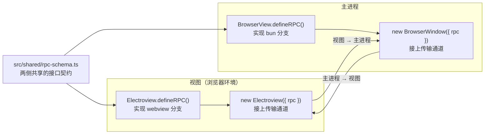

import { Canvas, Controls, Meta } from '@storybook/addon-docs/blocks';
import * as RpcStories from './rpc.stories';

<Meta of={RpcStories} name="Docs" />

# 自定义 RPC

主进程（bun）和视图（webview）是两个隔离的 JavaScript 环境，自定义 RPC 是 Electrobun 给这条通道的官方形态：两侧共享一份 `RPCSchema` 类型作为接口契约，各自用 `defineRPC` 声明处理函数，再通过 `request`（等响应的调用）和 `send`（单向消息）两个类型安全代理互调。跑通本课后你能预测：一次跨环境调用经过哪些环节、超时和抛错如何传回调用方、类型在哪里被约束。



回查时先看这组关键输入（均与 1.18.1 包内 `dist/api/shared/rpc.ts` 核对过）：

| 关键输入 | 默认值/形状 | 回查要点 |
| --- | --- | --- |
| 共享 schema 类型 | `{ bun: RPCSchema, webview: RPCSchema }` | 写在哪个分支，就由哪一侧实现（requests）和接收（messages） |
| requests 条目 | `{ params, response }` | params 可省略（无参数方法）；参数与返回值类型由此推导 |
| messages 条目 | 直接是 payload 类型 | 消息名映射 payload，没有 response |
| `maxRequestTime` | `1000`（毫秒） | 只管本实例发出的 request；超时 reject `Error("RPC request timed out.")`；设 `Infinity` 关闭 |
| request 代理 | `rpc.request.方法(params)` → `Promise<response>` | handler 抛错只把 `error.message` 传回调用方 |
| send 代理 | `rpc.send.消息(payload)` → void | 单向通知，无回执、无超时 |
| 传输通道 | 自动接线 | 主进程侧经 `new BrowserWindow({ rpc })`，视图侧经 `new Electroview({ rpc })` |
| `sandbox` | `false` | `true` 时该视图 RPC 整体禁用，仅保留事件（见[窗口选项](?path=/docs/window-options--docs)） |

## 快速上手

课程目录的 `custom-rpc/` 是完整可运行工程（macOS + Bun，electrobun 1.18.1），首次运行需安装依赖：

```bash
cd cheatsheets/rpc/custom-rpc
bun install
bun start
```

这个工程用四条调用覆盖四个方向，每条都有可核对结果：

- 视图 → 主进程 **request**：页面按钮触发 `addNumbers(3, 4)`，主进程算术回传，页面显示 `addNumbers(3, 4) = 7`。
- 视图 → 主进程 **send**：页面按钮发送 `logToBun`，终端打印 `[bun] 来自视图的问候`。
- 主进程 → 视图 **send**：页面就绪后主进程推送 `logToWebview`，页面显示「[view] 收到消息：主进程已就绪」。
- 主进程 → 视图 **request**：主进程请求 `getViewportSize()`，终端打印 `[bun] 视图尺寸 { width: …, height: … }`。

三段核心代码（完整工程见 `custom-rpc/`，工程配置沿用[第一个窗口](?path=/docs/first-window--docs)的四段结构）。

**`src/shared/rpc-schema.ts`**（两侧共享的契约）：

```ts
import type { RPCSchema } from "electrobun/bun";

export type AppRPC = {
  // bun 分支：主进程实现 addNumbers、接收 logToBun（视图 → 主进程方向）
  bun: RPCSchema<{
    requests: {
      addNumbers: {
        params: { a: number; b: number };
        response: { sum: number };
      };
    };
    messages: {
      logToBun: { msg: string };
    };
  }>;
  // webview 分支：视图实现 getViewportSize、接收 logToWebview（主进程 → 视图方向）
  webview: RPCSchema<{
    requests: {
      getViewportSize: {
        response: { width: number; height: number };
      };
    };
    messages: {
      logToWebview: { msg: string };
    };
  }>;
};
```

**`src/bun/index.ts`**（主进程：定义并接上 rpc）：

```ts
import { BrowserWindow, BrowserView } from "electrobun/bun";
import type { AppRPC } from "../shared/rpc-schema";

const rpc = BrowserView.defineRPC<AppRPC>({
  maxRequestTime: 5000,
  handlers: {
    requests: {
      addNumbers: ({ a, b }) => ({ sum: a + b }),
    },
    messages: {
      logToBun: ({ msg }) => console.log("[bun]", msg),
    },
  },
});

const win = new BrowserWindow({
  title: "自定义 RPC",
  url: "views://mainview/index.html",
  rpc, // 不传的话 BrowserView 会自建一个 handlers 为空的 rpc，上面这份 handlers 永远接不上通道
});

// bun → 视图方向要等页面就绪（见「两侧接线」一节的时机说明）
win.webview.on("dom-ready", () => {
  win.webview.rpc.send.logToWebview({ msg: "主进程已就绪" });
  win.webview.rpc.request.getViewportSize().then((size) => {
    console.log("[bun] 视图尺寸", size);
  });
});
```

**`src/mainview/index.ts`**（视图：定义并接上 rpc；`log()` 是工程里往页面日志列表追加一行的辅助函数）：

```ts
import { Electroview } from "electrobun/view";
import type { AppRPC } from "../shared/rpc-schema";

const rpc = Electroview.defineRPC<AppRPC>({
  handlers: {
    requests: {
      getViewportSize: () => ({
        width: window.innerWidth,
        height: window.innerHeight,
      }),
    },
    messages: {
      logToWebview: ({ msg }) => log(`[view] 收到消息：${msg}`),
    },
  },
});

// 关键一步：不 new Electroview({ rpc })，rpc 只挂着占位传输层，调用会直接抛错
new Electroview({ rpc });

document.querySelector("#call-add")?.addEventListener("click", async () => {
  const { sum } = await rpc.request.addNumbers({ a: 3, b: 4 });
  log(`addNumbers(3, 4) = ${sum}`);
});
```

预期结果，逐条可核对：终端出现 `[bun] custom-rpc 已启动`；窗口页面出现「[view] 收到消息：主进程已就绪」；点两个按钮分别得到计算结果与终端日志；终端打印视图尺寸。视图侧 `console.log` 要在页面 devtools 里看（调试时可在主进程调 `win.webview.openDevTools()`）。

## Schema 定义

`RPCSchema` 是两侧共同的接口契约，放一份在 `src/shared/`，两侧入口各自 import——它只含类型，构建时被擦除，不需要进 `electrobun.config.ts` 的任何构建段。

整体形状是两个分支：

```ts
type AppRPC = {
  bun: RPCSchema<{ requests: { ... }; messages: { ... } }>;
  webview: RPCSchema<{ requests: { ... }; messages: { ... } }>;
};
```

记忆规则只有一句：**写在哪个分支，就由哪一侧实现和接收**。`bun.requests` 是主进程要实现的方法（视图可以调用）；`bun.messages` 是主进程要接收的消息（视图可以发送）；`webview` 分支对称。容易犯的反向写法——把「视图想调的方法」写进 `webview` 分支——会让两侧行为对调，调用时才发现对端没有 handler。

两类成员的形状：

| 成员 | 形状 | 语义 |
| --- | --- | --- |
| `requests.方法名` | `{ params: P; response: R }` | 有响应的调用：调用方传 `P`，handler 返回 `R`（可 async） |
| `messages.消息名` | 直接写 payload 类型 `P` | 单向通知：发送方传 `P`，接收方只拿到 `P` |

- `params` 可以省略：省略后调用侧 `rpc.request.getViewportSize()` 和 handler 都不收参数（快速上手的 `getViewportSize` 即此写法）。要可选参数用 `params?:` 形式。
- 类型安全落在三处，全部由同一份 schema 推导：调用侧代理的参数与返回值、`handlers.requests` 的签名、`handlers.messages` 的 payload。任何一侧改名或参数形状漂移，都是编译错误而不是运行时静默失败。
- `RPCSchema` 类型从 `electrobun/bun` 或 `electrobun/view` 导入均可（两侧都导出），共享文件里用 type-only import。

## 两侧接线

每个 rpc 实例只声明一半的处理函数，通道由两侧各接一次：

- **主进程侧**：`BrowserView.defineRPC<AppRPC>({ maxRequestTime?, handlers })` 创建实例，把它作为 `rpc` 选项传给 `new BrowserWindow({...})`。BrowserWindow 内部会创建铺满窗口的默认视图并接上传输通道；多视图场景直接 `new BrowserView({ rpc, ... })`（见 [BrowserView](?path=/docs/browser-view--docs)）。
- **视图侧**：`Electroview.defineRPC<AppRPC>({ handlers })` 创建实例，`new Electroview({ rpc })` 接上通道。Electroview 类本身与视图层全局属性见 [Electroview](?path=/docs/electroview--docs)。

两个接线的常见漏法都在常见问题里：主进程侧忘传 `rpc`、视图侧忘 `new Electroview({ rpc })`，症状都是调用直接抛 transport 错误——因为 `defineRPC` 返回的实例先挂着占位传输层，真正的通道（每个视图一条加密 WebSocket，异常时走各自的兜底路径）要等视图创建/初始化时才由框架换上。通道本体的加密与回退机制见[架构原理](?path=/docs/architecture--docs)。

**调用时机**：视图 → 主进程方向随时可调（主进程先于视图存在）；主进程 → 视图方向要等页面就绪——视图侧的接收函数在页面脚本执行 `new Electroview` 时才挂上，在那之前主进程发出的包会被丢弃。用 `win.webview.on("dom-ready", ...)` 作为门闩（快速上手的做法）。

接线完成后，bun 侧还**自动多出一个内置请求** `evaluateJavascriptWithResponse`：让视图执行一段 JS 并把结果（Promise 会被 await）带回主进程，无需在视图侧写 handler。

```ts
const title = await win.webview.rpc.request.evaluateJavascriptWithResponse({
  script: "document.title",
});
```

它是运行时内置的，但要类型安全地调用，需把它声明进 schema 的 `webview.requests`（`params: { script: string }; response: any`），handler 不用写。适合一次性探查；高频逻辑写成正式的自定义 request。与之对比，`webview.executeJavascript(js)` 是不回结果的直接执行，属于 BrowserView 的方法而非 RPC。

## request 调用

`request` 是有响应的调用，两侧对称使用：视图里 `rpc.request.addNumbers({ a: 3, b: 4 })`，主进程里 `win.webview.rpc.request.getViewportSize()`。返回 `Promise`，`await` 拿到的类型就是 schema 里声明的 `response`。

一次调用在机制上分四步：

1. 调用侧代理发出 request 包：`{"type":"request","id":1,"method":"addNumbers","params":{...}}`，`id` 自增配对。
2. 接收侧按方法名分发到 `handlers.requests.addNumbers`，handler 可以是 async。
3. handler 返回（或抛错）后回一个 response 包：成功 `{"type":"response","id":1,"success":true,"payload":{...}}`，抛错 `success:false` 且只带 `error.message` 字符串。
4. 调用侧按 `id` 找到等待中的 Promise，`resolve(payload)` 或 `reject(new Error(message))`。

两条失败路径的行为：

- **超时**：请求发出后超过 `maxRequestTime` 仍无 response，Promise 以 `Error("RPC request timed out.")` reject，迟到的 response 会被丢弃。默认只有 `1000` 毫秒——慢操作（磁盘、网络）几乎必撞，按需在 `defineRPC` 里调大或设 `Infinity` 关闭。注意它只管**本实例发出的**请求，两侧各自配置。
- **handler 抛错**：Error 只有 `message` 过线，自定义字段和 stack 都丢失（见最佳实践的错误形状约定）。且必须抛 `Error` 实例——抛字符串等非 Error 值时接收侧不会回 response，调用方最终等到的同样是超时。

`handlers.requests` 用对象式按方法名写最常见；低层还接受函数式 `requestHandler(method, params)` 与对象式的 `_` 兜底 handler（未匹配到方法名时调用），一般只在 `createRPC` 层用（见下节）。

下面的示意在浏览器里复现「一次调用两端与线上各发生什么」：四种方向 × 三种结果，包内容按 wire 协议生成。真实桌面行为以 `custom-rpc/` 工程为准。

<Canvas of={RpcStories.RpcPacketFlow} />
<Controls of={RpcStories.RpcPacketFlow} />

| 读者操作 | 可观察证据 |
| --- | --- |
| 切到「主进程 → 视图 request」 | 方向反转：发起方变主进程，方法名变 `getViewportSize`，handler 落到视图侧 |
| 切到任一「send」方向 | 只有一个 message 包，response 通道显示「没有第二个包」，结果行为无回执 |
| 把处理结果切到「handler 抛错」 | response 包变 `success:false` 且只带 `error` 字段，调用侧 reject `Error("boom")` |
| 把处理结果切到「超时」 | response 画成断线 ×，调用侧 reject `"RPC request timed out."`，标注默认 1000ms |
| 打开 Show code | 看到该 Canvas 实际执行的 `rpc-packet-flow.ts` |

## send 消息

`send` 是单向消息：`rpc.send.logToBun({ msg: "hi" })` 立即返回（void），没有回执、没有超时、不占请求配对。线上是一个 message 包：`{"type":"message","id":"logToBun","payload":{"msg":"hi"}}`——`id` 就是消息名。把上方的示意切到 send 方向即可对照两种包的差异。

接收侧有两种挂法：

- **配置式**（常用）：在 `defineRPC` 的 `handlers.messages` 里按消息名写处理器；额外支持 `"*"` 通配 `(messageName, payload)`，同一条消息的命名处理器与 `"*"` 会**同时**收到。
- **运行时式**：在 rpc 实例上 `addMessageListener("logToBun", fn)` / `removeMessageListener("logToBun", fn)`，同样支持 `"*"`；适合订阅随组件生命周期的场景。

选型判断：调用方需要结果、需要知道失败 → `request`；纯通知、事件流、高频推送 → `send`（省去配对与超时的开销，语义上也更诚实）。

## createRPC 与自定义传输

`defineRPC` 是 `createRPC` 的 Electrobun 预制：两个静态方法内部都调用共享实现 `defineElectrobunRPC("bun" | "webview", config)`——它把双分支语义翻译成本地/远端 schema，并先挂一个占位传输层。`defineElectrobunRPC` 从 `electrobun/bun` 直接导出（`electrobun/view` 只经由 `Electroview.defineRPC` 暴露它）；`createRPC` 则两侧入口都有导出，本身是与通道无关的通用 RPC 层，传输由 `RPCTransport` 接口描述：

```ts
type RPCTransport = {
  send?: (data: unknown) => void;
  registerHandler?: (handler: (data: unknown) => void) => void;
  unregisterHandler?: () => void;
};
```

`createRPC` 返回实例的完整能力：

| 成员 | 作用 |
| --- | --- |
| `request` / `requestProxy` | 发起请求的代理（两者是同一代理的别名） |
| `send` / `sendProxy` | 发送消息的代理（别名同上） |
| `proxy` | `{ send, request }` 组合对象 |
| `setTransport(transport)` | 接入或更换传输通道 |
| `setRequestHandler(handler)` | 安装或更换请求处理器（对象式/函数式） |
| `addMessageListener` / `removeMessageListener` | 运行时消息监听，支持 `"*"` |

`createRPC` 的 options 还接受 `_debugHooks: { onSend, onReceive }`，能在任一侧打印每个过线包——排查 RPC 问题的第一工具。典型用法是拿内存通道把两个实例直接对接，做无窗口的单元测试：

```ts
import { createRPC } from "electrobun/bun";

// 一根内存线：本端 send 出去的包，直达对端注册的接收函数
function createMemoryTransport(peer: { getHandler: () => ((data: unknown) => void) | undefined }) {
  let handler: ((data: unknown) => void) | undefined;
  return {
    transport: {
      send: (data: unknown) => peer.getHandler()?.(data),
      registerHandler: (h: (data: unknown) => void) => {
        handler = h;
      },
    },
    getHandler: () => handler,
  };
}

// A、B 两个实例互为对端：A 的 send 送到 B，B 的 send 送到 A
const sideB = createMemoryTransport({ getHandler: () => sideA.getHandler() });
const sideA = createMemoryTransport(sideB);
const rpcA = createRPC({
  transport: sideA.transport,
  requestHandler: { ping: () => "pong" },
});
const rpcB = createRPC({ transport: sideB.transport });

rpcB.request.ping().then(console.log); // → pong，全程没有窗口与序列化
```

直连 `createRPC` 的现实场景：给 RPC handler 写不依赖桌面环境的测试；以及官方建议的视图 ↔ 视图通信做法——两个视图各自与主进程建 RPC，由主进程转发（Electrobun 刻意不在浏览器环境间直接打通）。更低层的通道需求见 [Socket](?path=/docs/socket--docs)。

## 最佳实践

- 参数与返回值只放 JSON 能表达的值。所有通道都先 `JSON.stringify`：`Date` 会变字符串、`undefined` 字段会丢、循环引用直接序列化失败（包被丢弃并在发出侧打错误日志）。大对象序列化开销大，高频大块数据考虑拆分或走低层通道。
- 长耗时操作不要硬等 request：要么调大 `maxRequestTime`（或 `Infinity`），要么改成「request 立即受理 + send 推送结果」的事件式模式——后者还能顺带推送进度。
- 错误要有业务形状。`error.message` 之外的字段都会丢：把错误编码进 message 字符串前缀，或把返回类型声明成联合 `{ ok: true; data: T } | { ok: false; code: string }`。
- schema 只写一份，放 `src/shared/`，两侧从同一文件导入；手抄两份必然漂移，而漂移只在运行时暴露。

## 常见问题

- `rpc.request.xxx()` 很快 reject：`RPC request timed out.`
  默认超时只有 1000 毫秒。先分方向：视图 → 主进程方向检查 handler 是否有慢 I/O，按需调大 `maxRequestTime`；主进程 → 视图方向先确认等了 `dom-ready`（页面没起来时包会被丢弃，表现同样是超时）。
- 调用直接抛错：`cannot make requests ... transport did not provide ... "send"`
  rpc 实例没接进通道。主进程侧：忘了把 `rpc` 传给 `new BrowserWindow`——注意此时 `win.webview.rpc` 是 BrowserView 框架自建的空实例，不是你手里那份 handlers；视图侧：忘了 `new Electroview({ rpc })`。
- reject：`The requested method has no handler: xxx`
  接收侧 `handlers.requests` 里没有这个方法名。检查拼写与大小写，以及两侧是否 import 了同一份 schema（分支写反也表现为对端没有 handler）。
- handler 里 `throw` 的自定义 Error，调用方只剩一个字符串。
  wire 上只传 `error.message`。错误码放进 message、放进 response 联合类型，或改用消息通知。
- 旧教程里 `rpc.ask.xxx()` 这类写法在 1.x 里不存在。
  1.18.1 包内实现只有 `request` / `send` 两个代理（`ask` 是早期版本的命名）；需要请求-响应一律用 `rpc.request`。

## 总结回顾

摘要：

本课从共享 `RPCSchema` 讲到两侧 `defineRPC` 接线，再到 `request` / `send` 两个代理的用法与机制。schema 的两个分支各声明「本侧实现什么、接收什么」，类型从这一份契约推导到调用、处理两端；通道由 `BrowserWindow({ rpc })` 与 `new Electroview({ rpc })` 各接一半，主进程 → 视图方向要等 `dom-ready`。request 按 id 配对 request/response 包，默认 1000ms 超时，handler 抛错只回 `error.message`；send 发单向 message 包，无回执无超时，接收可用配置式或运行时监听。`createRPC` 暴露通用传输接口，支撑测试、调试与视图中继。

一句话：

> 一份共享 schema 声明两侧的职责，`defineRPC` 各接一半通道，`request` 拿结果、`send` 发通知——类型在编译期锁死，超时与错误按包的机制回传。

知识要点：

- schema 写在 `bun` 分支的 requests/messages 分别由谁实现、由谁调用？
- `params` 省略与 `params?:` 两种写法调用侧有什么差别？
- 主进程侧和视图侧各用哪一步把 rpc 实例接上传输通道？
- 为什么主进程 → 视图方向的调用要等 `dom-ready`？
- `maxRequestTime` 管哪个方向的请求？默认多少？怎么关闭？
- handler 抛错时调用方拿到的具体是什么？
- request 与 send 怎么选？send 的接收处理器有哪两种挂法？
- `evaluateJavascriptWithResponse` 从哪一侧调用？为什么还要声明进 schema？
- `createRPC` 与 `defineRPC` 的关系是什么？各自适合什么场景？

## 参考资料

- [Electrobun 文档：Electroview Class](https://framework.blackboard.sh/electrobun/apis/browser/electroview-class/)
- [Electrobun 文档：BrowserView API](https://framework.blackboard.sh/electrobun/apis/browser-view/)
- electrobun 1.18.1 包内实现：`dist/api/shared/rpc.ts`（wire 协议、createRPC/defineElectrobunRPC、默认超时的最终依据）、`dist/api/bun/core/BrowserView.ts` 与 `dist/api/browser/index.ts`（两侧接线与内置请求）。
