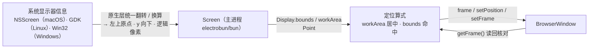

import { Canvas, Controls, Meta } from '@storybook/addon-docs/blocks';
import * as ScreenCourse from './screen.stories';

<Meta of={ScreenCourse} name="Docs" />

# 屏幕与显示器

[窗口选项](?path=/docs/window-options--docs)里 `frame` 默认 `800×600 @ (0,0)`，但真实桌面上有多块显示器、有菜单栏和 Dock——窗口该开在哪一块、开在哪才不压系统保留区，答案都来自主进程的 `Screen` 模块。它只有四个**同步**方法：`getAllDisplays` 枚举全部显示器、`getPrimaryDisplay` 查主屏、`getCursorScreenPoint` 查光标全局坐标、`getMouseButtons` 查鼠标按键位掩码；前两个返回 `Display` 结构（`bounds` 整屏边界、`workArea` 可用工作区、`scaleFactor` 缩放因子、`isPrimary`、`id`）。本课的核心判断一句话：**Screen 与窗口 API 说同一种坐标语言**——一套「主屏左上角为原点、y 向下、逻辑像素」的全局屏幕坐标，`Display` 的边界不经换算就能算出 `BrowserWindow` 的 `frame` / `setPosition` / `setFrame` 目标值。文档站没有 Screen 专页（侧栏 Bun APIs 无此项），本课 API 事实以 1.18.1 包内实现、原生层源码与官方 kitchen 测试为准。



四个成员的签名与返回值（与 1.18.1 包内 `dist/api/bun/proc/native.ts` 核对）：

| 方法 | 签名 | 返回 | 回查要点 |
| --- | --- | --- | --- |
| `getAllDisplays` | `() => Display[]` | 全部显示器 | 恰好一台 `isPrimary`；无原生环境返回 `[]` |
| `getPrimaryDisplay` | `() => Display` | 主显示器 | Linux 未设主屏时回退第一台 |
| `getCursorScreenPoint` | `() => Point` | 光标全局坐标 | 与 `Display.bounds` 同一坐标空间 |
| `getMouseButtons` | `() => bigint` | 按键位掩码 | bit0 左 / bit1 右 / bit2 中；轮询式、无事件 |

坐标形状（同一处类型定义）：

```ts
interface Rectangle { x: number; y: number; width: number; height: number; }
interface Point { x: number; y: number; }
interface Display {
  id: number;          // 平台显示器标识
  bounds: Rectangle;   // 整屏边界，含菜单栏 / Dock / 任务栏
  workArea: Rectangle; // 可用工作区，让开系统保留区
  scaleFactor: number; // 缩放因子，macOS Retina 屏为 2
  isPrimary: boolean;  // 是否主屏，恰好一台为 true
}
```

使用位置：只在主进程——`import { Screen } from "electrobun/bun"`（`Display` / `Rectangle` / `Point` 类型同入口导出，默认导出为 `Electrobun.Screen`）；`electrobun/view` 没有 Screen，视图层要屏幕信息走 [RPC](?path=/docs/rpc--docs) 请主进程代查。

## 快速上手

复用 1.3 的 hello-world 工程（或任何 electrobun 工程），把 `src/bun/index.ts` 换成下面这份后 `bun start`：

```ts
import { BrowserWindow, Screen } from "electrobun/bun";

const displays = Screen.getAllDisplays();
for (const d of displays) {
  console.log(
    `id=${d.id} ${d.isPrimary ? "主屏" : "副屏"}` +
      ` bounds=${d.bounds.width}x${d.bounds.height}@(${d.bounds.x},${d.bounds.y})` +
      ` scaleFactor=${d.scaleFactor}`,
  );
}

// 把窗口放到最后一台显示器的 workArea 中央
const target = displays.at(-1) ?? Screen.getPrimaryDisplay();
const width = 640;
const height = 400;
const x = Math.round(target.workArea.x + (target.workArea.width - width) / 2);
const y = Math.round(target.workArea.y + (target.workArea.height - height) / 2);

new BrowserWindow({
  title: "屏幕与显示器",
  url: "views://mainview/index.html",
  frame: { x, y, width, height },
});
```

预期结果，逐条可核对：

- 终端按枚举顺序打印每台显示器一行；多屏时副屏的 `bounds.x` / `bounds.y` 可能是负数（见「坐标空间」），那是布局位置不是错误。
- 窗口出现在最后一台显示器的 workArea 中央——单屏机器上即主屏：顶部让开菜单栏、底部让开 Dock 的居中位置，而不是贴着屏幕左上角。

## 枚举显示器

`getAllDisplays()` 是同步快照：原生层枚举系统显示器（macOS `NSScreen`、Linux GDK、Windows Win32 显示器列表），序列化成 JSON 回传、解析成 `Display[]`。不接收参数、不订阅变化，每次调用都重新查询。官方 kitchen 测试对这张快照有三条断言，也是核对自家输出的标尺：

- **至少一台**：`displays.length >= 1`；
- **恰好一台主屏**：`isPrimary === true` 的有且仅有一个；
- **workArea 不大于 bounds**：宽、高都 `<=`，差值就是系统保留区。

`getPrimaryDisplay()` 是「只查主屏」的便捷方法：macOS 按 `CGMainDisplayID` 挑出带菜单栏的那台，Windows 按 `primary` 标记挑选，Linux 未设置主屏时回退到第一台。它和 `getAllDisplays` 各自独立查询；已经拿了全量列表时，用 `displays.find((d) => d.isPrimary)` 等价取得主屏，还省一次原生调用。

一个 Linux 特例：`getPrimaryDisplay` 返回的 `id` 恒为 `0`（原生实现写死），与 `getAllDisplays` 里同一台屏的 `id`（枚举索引）不一定相同——跨这两个方法比对 `id` 时以 `getAllDisplays` 的结果为准。

第四个方法 `getMouseButtons()` 查的不是显示器而是输入状态：返回 `bigint` 位掩码，bit0 左键、bit1 右键、bit2 中键（1.18.1 包内注释；Windows 实现对应 `VK_LBUTTON` / `VK_RBUTTON` / `VK_MBUTTON`，macOS 对应 `NSEvent.pressedMouseButtons`）。同样是轮询式，典型用途是配合光标点（见「多屏定位」）区分「悬停」与「按住拖拽」这类没有窗口上下文的全局判定。

### Display 字段

| 字段 | 含义 | 回查要点 |
| --- | --- | --- |
| `id` | 平台显示器标识 | macOS 是 `CGDirectDisplayID`、Windows 是 `HMONITOR` 指针值、Linux 是枚举索引；都可能跨会话或插拔后变化，只当本次运行内的比对键，不要持久化 |
| `bounds` | 整屏边界（全局坐标） | 含菜单栏 / Dock / 任务栏占用的区域 |
| `workArea` | 可用工作区（全局坐标） | 让开系统保留区；窗口定位一律用它 |
| `scaleFactor` | 缩放因子 | Retina 屏为 `2`；选位图资源用，定位不用乘它（坐标已是逻辑像素） |
| `isPrimary` | 是否主屏 | 恰好一台 `true`；macOS 主屏即带菜单栏的那台 |

`bounds` 与 `workArea` 的差就是系统保留区，kitchen 测试直接把它算成结论：`菜单栏/Dock 占用 = bounds.height - workArea.height`。纵向停靠的 Dock（贴左 / 贴右）会体现在宽度差上，判定方式相同。

## 坐标空间

Screen 与窗口 API 共用的全局屏幕坐标有三条规则，全部由原生层保证：

1. **原点在主屏左上角。** 副屏排布在哪个方向，坐标就伸向哪个方向——副屏在右侧时 `bounds.x` 为正，在上方时 `bounds.y` 为负。负数是布局位置，不是异常。
2. **y 向下。** macOS 原生 AppKit 坐标是左下原点、y 向上，Electrobun 在原生层统一翻转，公式为 `y全局 = 主屏逻辑高度 − yAppKit − 矩形高`；光标点是同式的退化形式（高度减完就是点的位置）。Windows 原生是物理像素，按每台显示器的 DPI 换算成逻辑坐标；Linux 直接使用 GDK 的逻辑几何。三个平台出口一致。
3. **单位是逻辑像素**（macOS 点、Windows / Linux 缩放后像素）。`scaleFactor` 只描述一个逻辑像素对应几个物理像素；所有 `bounds` / `workArea` / 窗口 frame 数字都已经是逻辑值。

「同一种语言」的推论：`Screen` 的输出不经换算直接喂给[窗口选项](?path=/docs/window-options--docs)的 `frame`、运行时的 `setPosition` / `setFrame`，`getFrame()` 的读数也落回同一空间——查屏幕、算位置、放窗口、读回核对，全程一套数字。文档站对 `setPosition` 的「左上原点」说明与原生实现一致。

两条边界，避免把别的坐标混进来：

- `BrowserView` 的 `frame` 是**相对窗口内容区左上角**的坐标（y 向下、默认 `800×600`），与本文的全局屏幕坐标是两个空间，换算要经过窗口 `getFrame()`，见 [BrowserView](?path=/docs/browser-view--docs)。
- `move` / `resize` 事件的 `y` 在 macOS 上是**未翻转的 AppKit 原始值**（依 1.18.1 原生源码，JS 侧原样透传），与 `getFrame()` / `Display` 的 y 对不上是预期行为，见「常见问题」。

下面的示意在浏览器里复现这套坐标：两台显示器的布局、bounds 与 workArea 的差、光标点命中判定、窗口定位算式的输出。

<Canvas of={ScreenCourse.MultiScreenPositioningSchematic} />
<Controls of={ScreenCourse.MultiScreenPositioningSchematic} />

| 读者操作 | 可观察证据 |
| --- | --- |
| 切换 layout 到 above / right | 副屏 bounds.y 变为负值（above 为 -1080；right 为 -90——并排但更高的副屏同样越过 y=0）；原点标记保持在主屏左上 |
| 对比任一显示器的虚线框与实线外框 | workArea 从 bounds 里让开菜单栏 24 / Dock 80（主屏）与任务栏 40（副屏） |
| 把鼠标移进副屏 | 读数「命中显示器」切到 id=2 副屏；移出所有 bounds 显示「未命中 → 回退主屏」 |
| target 切到 follow-cursor 后移动鼠标 | 「窗口目标 frame」读数跟随光标所在屏变化，始终居中在那台屏的 workArea |
| target 固定在 primary-workarea / secondary-workarea | frame 读数是对应 workArea 的居中坐标，不随光标变化 |

真实显示器的枚举与落窗行为以课程目录的桌面范例为准（见「多屏定位」末尾）。

## 多屏定位

定位的输入输出都是全局坐标，剩下的是三条算式。

**目标屏的 workArea 中央**——窗口定位的标准姿势，`workArea` 保证不压菜单栏 / Dock / 任务栏：

```ts
function placeInWorkArea(display: Display, width: number, height: number) {
  return {
    x: Math.round(display.workArea.x + (display.workArea.width - width) / 2),
    y: Math.round(display.workArea.y + (display.workArea.height - height) / 2),
  };
}
```

**光标所在屏判定**——输入是 `getCursorScreenPoint()` 返回的光标全局坐标 `{ x, y }`（一次性查询不是追踪，光标移动不推送事件，需要跟随就自己轮询）：点在哪块 bounds 里就是哪台，未命中回退主屏：

```ts
function displayAt(x: number, y: number): Display {
  return (
    Screen.getAllDisplays().find((d) => {
      const b = d.bounds;
      return x >= b.x && x < b.x + b.width && y >= b.y && y < b.y + b.height;
    }) ?? Screen.getPrimaryDisplay()
  );
}
```

**落位时机**——两条路：创建时直接给 `frame`（一次到位，快速上手就是这条）；运行时 `setPosition(x, y)` 只改位置，`setFrame(x, y, width, height)` 位置尺寸一次给全（文档注明比 `setPosition` + `setSize` 分开调用更高效）。落位后用 `getFrame()` 读回核对。

组合起来，跟随鼠标开窗的三步：

```ts
const point = Screen.getCursorScreenPoint();
const display = displayAt(point.x, point.y); // 光标在哪块屏，窗口就开在哪块屏
const { x, y } = placeInWorkArea(display, 640, 400);
new BrowserWindow({
  title: "跟随光标",
  url: "views://mainview/index.html",
  frame: { x, y, width: 640, height: 400 },
});
```

桌面范例 `screen-observer.ts`（课程目录）：作为主进程入口运行后，启动打印显示器清单与「菜单栏/Dock 占用高度」，窗口每 2 秒轮换到下一台显示器 workArea 中央，每步打印目标坐标、`getFrame()` 实际读数、两者差值与光标所在屏——「差值」一栏是核对 macOS 多屏高度差偏移（见「常见问题」）的观察点；窗口关闭时自动停掉轮换。

## 最佳实践

- **定位一律用 workArea，不用 bounds。** bounds 包含系统保留区，贴 bounds 边缘的窗口会被菜单栏 / Dock / 任务栏挡住；要真正全屏用 `setFullScreen(true)`（见[窗口选项](?path=/docs/window-options--docs)）而不是贴 bounds。
- **跨屏移动一次到位。** 目标坐标算好后用创建时 `frame` 或一次 `setPosition` / `setFrame` 落位，避免「先移到副屏再微调」——macOS 上窗口已在副屏时的二次定位会引入高度差偏移（见「常见问题」）。
- **不要手乘 scaleFactor。** 所有坐标都是逻辑像素；`scaleFactor` 只用于选择 1x / 2x 位图资源这类决策。
- **`id` 只做本次运行内的比对键。** 三平台的 id 语义都允许跨会话变化（Linux 是索引，插拔即变）；要记住「用户的副屏」就存分辨率、位置等特征再匹配，别存 id。
- **显示器布局可能变，用前重查。** 没有显示器变化事件，常驻逻辑（托盘、全局面板）在每次使用前重新调用 `getAllDisplays`，或按低频轮询对比（见「常见问题」）。

## 常见问题

- `getAllDisplays()` 返回 `[]`，`getPrimaryDisplay()` 全是 0。
  Screen 走 FFI 调原生库；运行上下文没有加载 `libNativeWrapper`（比如直接 `bun run` 一个普通脚本、或纯构建上下文）时走包内回退分支：空数组 / 全零 `Display` / `(0, 0)` 光标点。在 `electrobun dev` 启动的主进程里调用即可。
- 副屏的 `bounds.x` / `bounds.y` 是负数。
  正常。全局原点在主屏左上角，副屏排在主屏左侧或上方时坐标为负；「并排但更高」的副屏纵向居中对齐时 y 也会为负。判断一个点在哪台屏用 bounds 命中测试，不要假设坐标非负。
- `move` 事件的 y 和 `getFrame()` 对不上。
  macOS 上 `move` / `resize` 事件的原生回调未做坐标翻转（依 1.18.1 原生源码，AppKit 左下原点的 y 原样透传），而 `getFrame()` / `setPosition` / `Display` 是左上原点。定位逻辑一律以 `getFrame()` 为准；事件载荷的订阅与分发见[窗口事件](?path=/docs/window-events--docs)。
- macOS 多屏下，窗口已在副屏时再 `setPosition` 位置差一截。
  1.18.1 的 macOS 原生实现把 `setPosition` / `setFrame` / `getFrame` 的 y 翻转基准取「窗口当前所在屏的逻辑高度」，而全局坐标以主屏高度定义——窗口在高度不同的副屏上时两者相差「两屏逻辑高度差」，读写带同一偏移。规避：跨屏定位在窗口尚在主屏（或创建时）一次完成；必须二次定位时按高度差补偿，并用 `getFrame()` 验证。
- 显示器热插拔 / 分辨率变化收不到通知。
  1.18.1 没有显示器变化事件（窗口事件只有 close / resize / move / focus / blur / keyDown / keyUp）。需要感知变化就低频轮询快照对比：

  ```ts
  let snapshot = JSON.stringify(Screen.getAllDisplays());
  setInterval(() => {
    const next = JSON.stringify(Screen.getAllDisplays());
    if (next !== snapshot) {
      snapshot = next;
      console.log("显示器布局变化，重新查询");
    }
  }, 2000);
  ```

## 总结回顾

摘要：

Screen 是主进程 `electrobun/bun` 的同步查询模块：`getAllDisplays` / `getPrimaryDisplay` 返回 `Display`（id、bounds、workArea、scaleFactor、isPrimary），`getCursorScreenPoint` 返回光标全局坐标，`getMouseButtons` 返回按键位掩码。它与窗口 API 共用同一全局坐标空间——主屏左上原点、y 向下、逻辑像素；macOS 在原生层从 AppKit 左下原点翻转，Windows 从物理像素按 DPI 换算，Linux 用 GDK 逻辑几何，三平台出口一致。所以 `Display` 边界可以直接算出窗口位置：定位一律用 workArea 居中，光标所在屏用 bounds 命中测试，落位走创建时 `frame` 或一次 `setPosition` / `setFrame`，`getFrame()` 读回核对。无原生环境时四个方法走零值 / 空数组回退；id 跨会话会变，只做本次比对键；显示器布局变化没有事件，靠轮询快照对比感知。

一句话：

> Screen 与窗口 API 说同一种坐标——主屏左上原点、y 向下、逻辑像素；Display 的边界不经换算就能算出窗口该在的位置，定位用 workArea、判定用 bounds 命中。

知识要点：

- Screen 四个方法的签名、返回值与无原生环境的回退行为分别是什么？
- Display 五个字段各是什么？bounds 与 workArea 差在哪，保留区高度怎么算？
- 全局坐标的三条规则（原点、方向、单位）是什么？副屏坐标为什么可能是负数？
- macOS 的 y 翻转公式是什么？Windows / Linux 的原生坐标怎么统一进来？
- 为什么定位窗口不需要乘 scaleFactor？
- 光标所在屏的命中判定怎么写？未命中回退到哪？
- 创建时定位与运行时定位分别用哪些 API？`setFrame` 相比 `setPosition` + `setSize` 好在哪？
- 显示器热插拔怎么感知？`move` 事件的 y 为什么和 `getFrame()` 对不上？

## 参考资料

- electrobun 1.18.1 包内实现：`dist/api/bun/proc/native.ts`（Screen 四方法、`Display` / `Rectangle` / `Point` 类型定义、`!native` 回退分支）、`dist/api/bun/index.ts`（`electrobun/bun` 的导出面）
- [blackboardsh/electrobun：kitchen screen 交互测试](https://github.com/blackboardsh/electrobun/blob/main/kitchen/src/tests/screen.test.ts)（官方断言：至少一台、恰好一个 `isPrimary`、workArea ≤ bounds、保留区 = bounds.height − workArea.height；仓库内导入路径 `electrobun/main` 是内部别名，发布包的主进程入口是 `electrobun/bun`）
- [blackboardsh/electrobun：原生实现](https://github.com/blackboardsh/electrobun/tree/main/package/src/native)（macOS `nativeWrapper.mm` 的 y 翻转公式、按当前屏翻转的窗口定位细节与未翻转的 move 回调；Linux `nativeWrapper.cpp` 的 GDK 枚举、索引 id 与 `getPrimaryDisplay` 恒 id=0；Windows `nativeWrapper.cpp` 的逻辑坐标换算与 HMONITOR id）
- [官方文档：BrowserWindow](https://framework.blackboard.sh/electrobun/apis/browser-window/)（`setPosition` 左上原点语义、`setFrame` 效率说明与窗口几何方法清单；文档站侧栏无 Screen 专页）
