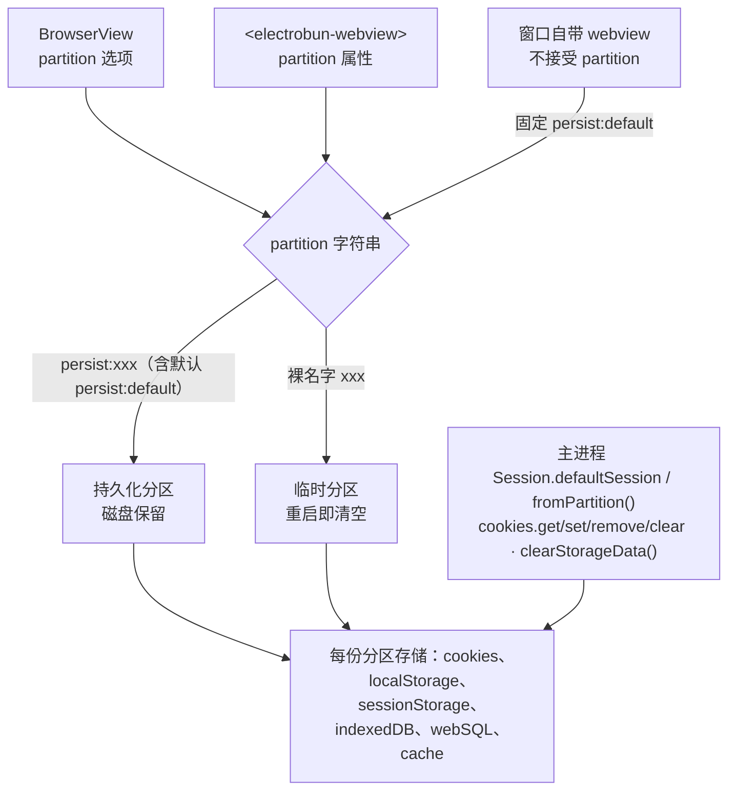

import { Canvas, Controls, Meta } from '@storybook/addon-docs/blocks';
import * as SessionStorage from './session-storage.stories';

<Meta of={SessionStorage} name="Docs" />

# 会话与存储

webview 的 Cookie、localStorage 这些存储不挂在视图实例上，而挂在**分区（partition）**上：partition 字符串相同 = 同一份存储。主进程通过 `Session` API 拿到分区的句柄，读写 Cookie、按类型清理存储。本课讲清三件事——分区从哪里配与怎么命名（`persist:` 前缀和裸名字的差别决定重启后还在不在）、`cookies` 四个方法的字段与过滤、`clearStorageData()` 按类型清理。跑完观察台并再运行一次后，你能预测任意两个视图是否共享登录态、重启后哪份存储会消失。



回查时先看这组关键事实（Session 未上文档站侧栏，均与 1.18.1 包内类型定义核对过）：

| 关键事实 | 值 / 行为 | 回查要点 |
| --- | --- | --- |
| `BrowserView` 的 `partition` | `string \| null`，默认 `null` | 原生层把 `null` 回落成 `"persist:default"`，不配置 = 全部视图共用默认分区 |
| 窗口自带 webview 的分区 | 固定 `"persist:default"` | `BrowserWindow` 不接受 `partition`，要自定义分区另建视图 |
| 裸名字分区（如 `"account2"`） | 临时存储，重启即清空 | 同名裸名字在两次运行间不恢复（官方 BrowserView 文档） |
| `"persist:"` 前缀分区 | 持久化到磁盘 | 持久化必须显式加前缀 |
| `Session.defaultSession` | `fromPartition("persist:default")` | 与默认 webview 同一份存储；同字符串返回缓存实例 |
| `cookies.get()` 无匹配 | 返回 `[]`，不抛错 | 四个 Cookie 方法全部同步，无 Promise |
| `clearStorageData()` 默认参数 | `"all"`（清全部存储类型） | 按类型清理时传 `StorageType` 数组 |

## 快速上手

课程目录的 `session-inspector/` 是完整可运行工程（macOS + Bun，electrobun 1.18.1），在主进程把「写入 → 过滤读取 → 删除 → 清空」的剧本跑一遍，并对比持久化分区与临时分区：

```bash
cd cheatsheets/session-storage/session-inspector
bun install
bun start
```

| 操作 | 可观察证据 |
| --- | --- |
| 首次运行 | 终端依次打出 `[1]`–`[7]`：`set` 返回 `true`、`get()` 列出 Cookie 对象、过滤只剩目标项、`remove` 后少一条、清理后为 `[]` |
| 关掉窗口再 `bun start` | `[5]` 的 `persist:demo` 计数 +1；裸名字 `demo` 每次都从 1 开始 |

观察台把每一步的真实返回值都打到终端。Session 的 API 形状以包内类型为准；类型契约之外的运行细节（例如原生层对未访问域名的 Cookie 写入）文档站没有覆盖，以终端实测为准。

## 分区

存储跟分区走，不跟视图走：视图销毁后 `persist:` 分区的存储仍在，下次用同一字符串的视图接着用。一个视图用哪个分区由三处之一决定：

- **`BrowserView` 的 `partition` 选项**：类型 `string | null`，默认 `null`；原生层收到 `null` 时使用 `"persist:default"`。
- **`<electrobun-webview>` 的 `partition` 属性**：视图层声明，主进程据此创建带该分区的 BrowserView。
- **窗口自带的 webview**：`BrowserWindow` 构造时不传 `partition`，其内建 webview 固定落在 `persist:default`——所以「什么都不配置」的应用，全部视图共用同一份存储。

命名语义决定持久化（官方 BrowserView 文档）：

- `"persist:xxx"`：持久化分区，Cookie 与存储落盘，重启保留。
- 裸名字 `"xxx"`：临时分区，只活在本次运行；官方文档特别提醒，重启后即使复用同一个名字也不会恢复之前的数据。
- 同一字符串 = 同一份存储：官方的例子是两个同分区视图，在一个里登录 Gmail，另一个也随之上线；反过来，不同字符串之间完全隔离。

把「视图 B 的 partition」切到不同值、再把观察时机切到重启后，对照下表的读数核对结论；真实分区行为以观察台工程为准。

<Canvas of={SessionStorage.PartitionIsolation} />
<Controls of={SessionStorage.PartitionIsolation} />

| 读者操作 | 可观察证据 |
| --- | --- |
| 「视图 B 的 partition」保持 `persist:default` | 两个视图的箭头汇入同一分区槽，读数「是否共享存储」为共享，槽内出现两个视图的 Cookie |
| 切到 `persist:account2` 或裸名字 `account2` | 视图 B 连到独立分区槽，读数变为独立 |
| 「观察时机」切到「重启应用后」 | 裸名字槽清空并标注「重启后清空」，两个 `persist:` 槽标注「重启后保留」 |
| 打开 Show code | 看到该 Canvas 实际执行的 `partition-isolation.ts`，判定逻辑集中在 `resolveSlots()` |

边界：分区的创建挂在视图构造上——`BrowserView` 的完整构造参数、bounds 与挂载方式见 [BrowserView](?path=/docs/browser-view--docs)；`<electrobun-webview>` 的嵌合、事件与 `sandbox`（不可信内容的 RPC 隔离，与分区互补）见 [webview 标签](?path=/docs/webview-tag--docs)。

## Cookie 读写

`Session` 的 API 面很小：`Session.defaultSession` 与 `Session.fromPartition(partition)` 拿到实例（同一字符串返回缓存的同一实例），实例上只有 `partition`、`cookies`、`clearStorageData()` 三个成员。`cookies` 的四个方法全部是同步 FFI 调用。导入方式两种：`import { Session } from "electrobun/bun"`，或默认导出上的 `Electrobun.Session`。

### get：读取与过滤

`get()` 无参返回该分区全部 Cookie；传 `CookieFilter` 按字段过滤。字段全部可选：

| `CookieFilter` 字段 | 类型 | 过滤含义 |
| --- | --- | --- |
| `url` | `string` | 按 URL 关联的 Cookie 过滤 |
| `name` | `string` | 按 Cookie 名精确匹配 |
| `domain` | `string` | 按域过滤 |
| `path` | `string` | 按路径过滤 |
| `secure` | `boolean` | 按 `secure` 标记过滤 |
| `session` | `boolean` | 按会话 Cookie（非持久）过滤 |

```ts
import { Session } from "electrobun/bun";

const jar = Session.defaultSession;

jar.cookies.get();                      // 全部
jar.cookies.get({ name: "token" });     // 按名取
jar.cookies.get({ domain: "example.com" }); // 按域取
```

无匹配时返回 `[]`，解析失败也返回 `[]` 而不是抛错。返回的元素就是 `set` 写入的 `Cookie` 对象形态（见下节字段表）。

### set：写入

`set(cookie)` 写入一条 Cookie，返回 `boolean` 表示是否成功。`Cookie` 字段：

| `Cookie` 字段 | 类型 | 说明 |
| --- | --- | --- |
| `name` / `value` | `string` | 必填：Cookie 名与值 |
| `domain` | `string?` | 所属域 |
| `path` | `string?` | 路径 |
| `secure` | `boolean?` | 仅 HTTPS 传输 |
| `httpOnly` | `boolean?` | 对页面 JS 不可见 |
| `sameSite` | `"no_restriction" \| "lax" \| "strict"?` | SameSite 策略，命名沿用 Chromium 惯例 |
| `expirationDate` | `number?` | 过期时间，Unix 秒时间戳 |

```ts
const ok = jar.cookies.set({
  name: "token",
  value: "abc123",
  domain: "example.com",
  path: "/",
});
```

最典型的用法是**预置登录态**：在让视图加载目标 URL 之前先把会话 Cookie 写进对应分区，页面首屏即是已登录状态。

### remove 与 clear

`remove(url, name)` 删除一条 Cookie：`url` 是与 Cookie 关联的 URL（形如 `https://example.com`），`name` 精确匹配，两者成对返回 `boolean`。`clear()` 清空本分区全部 Cookie，无返回值。观察台的 `[4]` 与 `[7]` 分别对应这两个调用。

## 清存储

`clearStorageData(types)` 按类型清理分区存储，参数是 `StorageType` 数组或 `"all"`，**默认 `"all"`**：

| `StorageType` | 清理对象 |
| --- | --- |
| `"cookies"` | Cookie |
| `"localStorage"` | localStorage |
| `"sessionStorage"` | sessionStorage |
| `"indexedDB"` | IndexedDB |
| `"webSQL"` | WebSQL |
| `"cache"` | 缓存 |
| `"all"` | 以上全部 |

```ts
// 登出：清登录态相关的存储，保留缓存
session.clearStorageData(["cookies", "localStorage", "indexedDB"]);
// 整个分区推倒重来
session.clearStorageData(); // 即 "all"
```

它与 `cookies.clear()` 的分工：`cookies.clear()` 只清 Cookie，效果上对应 `clearStorageData(["cookies"])`；要连同 localStorage 等一起清就用 `clearStorageData` 传类型数组。

注意一条能力边界：**Session 只对 Cookie 提供读接口，其余存储类型只有「清」没有「读 / 写」**。视图侧读写 localStorage、sessionStorage、IndexedDB 用的是标准 Web API（`localStorage.setItem` 等），主进程想感知这些数据要走 RPC 把值传出来（见[自定义 RPC](?path=/docs/rpc--docs)）。

## 最佳实践

- 分区按内容信任度与账号维度命名：第三方内容独立分区（官方 Webview Tag 文档的 Best Practices 原话是 isolate session storage between different webviews to prevent data leakage），可再叠加 `sandbox`；多账号场景每个账号一个 `persist:` 分区；一次性预览用裸名字，关掉即丢。
- 预置登录态注意顺序：先 `cookies.set()` 再让视图加载目标 URL；顺序反了，页面首个请求会带着空 Cookie 发出去。
- 登出 / 重置清理要列类型：明确传 `["cookies", "localStorage", "indexedDB"]` 这类数组，不要顺手 `"all"`——缓存、无关存储也会被清掉，代价是下次全量重新加载。

## 常见问题

- 两个视图的登录态互相串了。
  它们落在同一分区。默认形态下（都不配置 `partition`，或窗口自带 webview）所有视图共用 `persist:default`，Cookie 天然共享。给需要隔离的视图配上不同的 `partition` 字符串。
- 重启应用后 Cookie / localStorage 全没了。
  用了裸名字分区（如 `"account2"`）。裸名字是临时分区，重启即清空且不复原；要持久化改成 `"persist:account2"`。
- 想在主进程读视图写的 localStorage，找不到 API。
  这是能力边界而不是没找到：`Session` 只有 `cookies.get()` 一个读接口，其余存储只有 `clearStorageData()` 清理入口。要读这些数据，在视图侧用 Web API 读出来后经 RPC 传给主进程。
- `cookies.remove(url, name)` 返回 `false`，Cookie 没删掉。
  两个参数要成对匹配同一条 Cookie：`url` 需对应 Cookie 的域与路径（形如 `https://example.com`），`name` 必须完全一致。先 `get()` 拿到该 Cookie 的实际字段再按它构造参数。
- 想让窗口自带的 webview 用独立分区。
  做不到：`BrowserWindow` 不接受 `partition`，其内建 webview 固定 `persist:default`。自定义分区只能配在 `BrowserView` 的 `partition` 选项或 `<electrobun-webview>` 的 `partition` 属性上。

## 总结回顾

摘要：

本课从分区讲起：webview 存储挂在 partition 字符串上，视图侧由 `BrowserView` 的 `partition` 选项、`<electrobun-webview>` 的 `partition` 属性决定，窗口自带 webview 固定 `persist:default`（也是不配置时的统一回落）；`persist:` 前缀持久化、裸名字重启即清空、同字符串共享。主进程用 `Session.defaultSession` / `fromPartition()` 拿到实例，`cookies` 的 `get(filter)` / `set(cookie)` / `remove(url, name)` / `clear()` 同步读写 Cookie（`CookieFilter` 六个可选字段过滤，`sameSite` 取 `no_restriction`/`lax`/`strict`，`expirationDate` 用 Unix 秒）；`clearStorageData(types)` 按 `StorageType` 清存储、默认 `"all"`，且只有 Cookie 可读，其余存储只清不读。

一句话：

> 存储跟着 partition 字符串走：同字符串共享、`persist:` 前缀才持久化、窗口自带 webview 永远在默认分区；主进程的 Session 只能读写 Cookie 和按类型清存储，其余读写都在视图侧。

知识要点：

- 两个视图什么时候共享 Cookie？什么都不配置时共享吗？
- Cookie 要在重启后保留，`partition` 该怎么写？裸名字分区重启后是什么状态？
- 窗口自带 webview 能换分区吗？想隔离该怎么办？
- `cookies.get()` 的过滤字段有哪些？无匹配时返回什么？
- 登出时想清掉 Cookie 和 localStorage 但保留缓存，调用哪个 API、传什么？
- 主进程能直接读视图的 localStorage 吗？正确的做法是什么？

## 参考资料

- [Electrobun 文档：BrowserView API](https://framework.blackboard.sh/electrobun/apis/browser-view/)：`partition` 一节——分区共享登录态的例子、裸名字不持久、`persist:` 前缀规则。
- [Electrobun 文档：Webview Tag](https://framework.blackboard.sh/electrobun/apis/browser/electrobun-webview-tag/)：`partition` 属性说明与 Best Practices 的分区隔离建议。
- electrobun 1.18.1 包内类型定义（`dist/api/bun/proc/native.ts` 的 `Cookie` / `CookieFilter` / `StorageType` / `Session` / `SessionCookies`，`dist/api/bun/core/BrowserView.ts` 的 `partition` 选项与原生回落，`dist/api/bun/core/BrowserWindow.ts` 的内建 webview 创建，`dist/api/bun/preload/webviewTag.ts` 的 `partition` 属性读取）：Session API 名、参数与默认值的最终依据（文档站侧栏未列 Session）。
