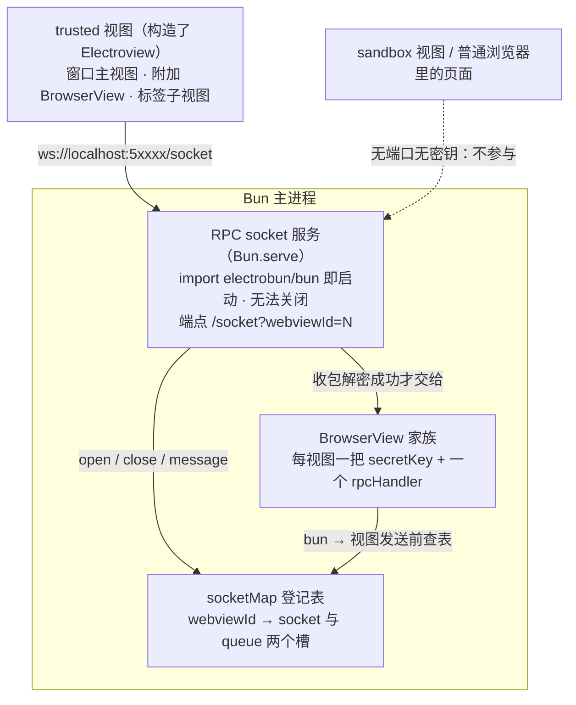

import { Canvas, Controls, Meta } from '@storybook/addon-docs/blocks';
import * as SocketStories from './socket.stories';

<Meta of={SocketStories} name="Docs" />

# Socket

上一层的[自定义 RPC](?path=/docs/rpc--docs) 与 [Electroview](?path=/docs/electroview--docs) 走的加密 WebSocket，起点是主进程里的一个内置服务：`electrobun/bun` 被 import 的那一刻，**RPC socket 服务**就已经在跑——从 50000 起扫一个可用端口，等每个可信视图带着自己的 `webviewId` 连上来。它同时以 `Socket` 命名空间公开导出（`socketMap`、`rpcPort`、`rpcServer`、`sendMessageToWebviewViaSocket`、`removeSocketForWebview`），但文档站没有它的页面：它是 RPC 之下的**低层通道**。本课讲清四件事：服务怎么起、端口怎么定；连接按什么登记、怎么随视图生命周期变化；一条消息在服务端经过哪些站、什么情况回落；以及这条通道的用途与使用边界。读完你能预测任意时刻 `socketMap` 里有什么、一条消息会不会走加密连接、排障时该看 Socket 还是回到 RPC 层。



回查时先看这组关键事实（文档站未覆盖，均与 1.18.1 包内 `dist/api/bun/core/Socket.ts` 与 Bun WebSocket 文档核对过）：

| 关键事实 | 值 / 行为 | 回查要点 |
| --- | --- | --- |
| 启动时机 | `import electrobun/bun` 的模块加载期（顶层执行 `startRPCServer()`） | 无配置项、无法关闭；`Socket.rpcServer` / `Socket.rpcPort` 读结果 |
| 端口 | 从 50000 逐个尝试到 65535，`EADDRINUSE` 顺延 | 日志 `Server started at http://localhost:{port}`；同机多实例自动错开 |
| 监听地址 | 未指定 hostname，按 Bun.serve 默认绑 `0.0.0.0`（所有网卡） | 客户端连 `ws://localhost`；同网段也能握手，但没有密钥发不进有效消息 |
| 端点 | `GET /socket?webviewId=N` 升级为 WebSocket | 缺参返回 400；其他路径只打 `unhandled RPC Server request` 日志 |
| 单消息上限 | `maxPayloadLength` 500MB（Bun 默认 16MB） | 超限连接被 Bun 关闭 |
| 背压上限 | `backpressureLimit` 1000MB（单消息上限 × 2） | 包内注释：超出的消息将被丢弃 |
| 空闲超时 | `idleTimeout` 960（秒，约 16 分钟；Bun 默认 120） | 静默到点连接被关；1.18.1 无自动重连，此后一直走回落 |
| 加密与鉴权 | 逐条 AES-256-GCM；无 TLS、无 token（token 校验代码被注释掉） | 信任判定 = 解密成功（key 即身份） |
| 导出面 | `Socket.socketMap` / `rpcPort` / `rpcServer` / `sendMessageToWebviewViaSocket` / `removeSocketForWebview` | 前三个用来观察，后两个是框架内部的改写入口 |

## 快速上手

课程目录的 `socket-map-observer/` 是完整可运行工程（macOS + Bun，electrobun 1.18.1）：主进程轮询 `Socket.socketMap`，把服务的端口、条目出现、断开保留、重载覆盖、移除清空全部打在终端：

```bash
cd cheatsheets/socket/socket-map-observer
bun install
bun start
```

| 操作 | 可观察证据 |
| --- | --- |
| 应用启动 | 终端打出 `[bun] RPC socket 服务：ws://localhost:5xxxx/socket` 与 `socketMap → （空）`——import 即启动，此刻还没有任何连接 |
| 页面加载完成 | 终端打出 `socketMap → 1: { socket=OPEN, queue: 0 项 }`——条目在视图侧连接 open 时才出现 |
| 点击窗口里的按钮 | 终端打出 `[bun] 收到 ping(1)…`，页面同时收到 bun 反向下发的 `pinged`——两个方向都在这条连接上 |
| 点击「重载页面」 | 终端通常先打 `1: { socket=null, … }`（close 只置空、条目保留），随后同 id 回到 `socket=OPEN`（新连接覆盖旧条目） |
| 关闭窗口 | 终端打出 `socketMap → （空）`——视图随窗口移除、条目被删除；工程把 `runtime.exitOnLastWindowClosed` 设为 `false`，主进程继续轮询，观察完 Ctrl+C 退出 |

真实登记行为以这个工程为准；本页后面的 Canvas 只示意登记表机制，不开窗口。

## 启动与端口

服务随模块加载启动，不随窗口创建——哪怕一个窗口都不开，端口也已经被占上：

```ts
import { Socket } from "electrobun/bun";

// import 的副作用已经把服务拉起来，这里只是读结果
console.log(Socket.rpcPort);               // 实际端口，50000–65535 之一
console.log(Socket.rpcServer?.url.origin); // http://localhost:{port}（标准 Bun Server）
```

端口没有配置入口，行为就是一段线性扫描：从 50000 起逐个尝试，被占（`EADDRINUSE`）就顺延，其他错误直接抛；dev 终端因此常见这两行日志（tester 工程实测同款）：

```text
Port 50000 in use, trying next port...
Server started at http://localhost:50001
```

HTTP 侧只认一个端点，其余请求留一行日志就不管：

```ts
// dist/api/bun/core/Socket.ts（节选，说明端点行为）
fetch(req, server) {
  const url = new URL(req.url);
  if (url.pathname === "/socket") {                      // 唯一端点
    const webviewId = url.searchParams.get("webviewId");
    if (!webviewId) return new Response("Missing webviewId", { status: 400 });
    const ok = server.upgrade(req, { data: { webviewId: parseInt(webviewId, 10) } });
    return ok ? undefined : new Response("Upgrade failed", { status: 500 });
  }
  console.log("unhandled RPC Server request", req.url); // 其他路径只留日志
}
```

三个由此而来的推论：**同机多实例互不干扰**（各自扫到不同的空闲端口，视图连的都是自己主进程注入的端口）；**native 与 CEF 两种 renderer 行为一致**（服务在 JS 主进程里，与引擎无关）；**暴露面是所有网卡**（Bun.serve 默认 `0.0.0.0`，包内未指定 hostname）——其他机器能完成握手，但没有密钥就产生不了有效消息，详见「使用边界」。

## 连接登记

### socketMap

连接按 `webviewId` 登记，一张表、一个条目两个槽：

```ts
Socket.socketMap: {
  [webviewId: string]: {
    socket: ServerWebSocket | null; // 当前连接；断开后为 null
    queue: string[];                // 恒为 []——1.18.1 没有任何代码读写它
  };
}
```

条目**在视图侧连接 open 时才创建**，不是 `BrowserView` 构造时——这决定了登记表和视图清单是两个集合：`BrowserView.getAll()` 回答「哪些视图已创建」，`socketMap` 回答「哪些连接已建立」。两者的差集就是诊断信息：视图在、条目不在，说明页面还没构造 Electroview、连接还没完成、或这是 sandbox 视图（永远不会连）。`queue` 字段存在于类型里但恒为空数组，属于未启用的预留槽，巡视时可以忽略。

### 条目生命周期

一个条目随连接经历四种变化，全部在 `Socket.ts` 的 websocket 处理器里：

| 事件 | 对条目的影响 | 代码行为 |
| --- | --- | --- |
| 视图创建 | 无条目 | 登记只跟连接走，创建视图不写表 |
| `open`（视图侧连上） | 建条目或覆盖 | 无条目则建 `{ socket: ws, queue: [] }`；已有条目则替换 `socket`——后到覆盖先到，页面重载因此能无缝接管 |
| `close`（连接断开） | 条目保留，`socket` 置 `null` | 只置空不删除；旧条目等新连接来覆盖 |
| 视图 `remove()` / 窗口关闭 | 条目删除 | `BrowserView.remove()` 调 `removeSocketForWebview(id)` 清掉条目 |

把「生命周期阶段」切换一遍，对照登记表读数与两个方向的消息路径——路径判定只看一件事：**这条连接当前可用吗**（bun 侧查 `socketMap` 里的 `socket` 是否 OPEN，视图侧查自己那条 WebSocket 的 readyState）。

<Canvas of={SocketStories.SocketRegistry} />
<Controls of={SocketStories.SocketRegistry} />

| 读者操作 | 可观察证据 |
| --- | --- |
| 停在「已连接（OPEN）」 | 登记表为 `1: { socket: ws·OPEN, queue: [] }`，两个方向都走加密 socket |
| 切到「视图已创建，未连接」 | 登记表变「（无条目）」，两个方向落到注入脚本 / postMessage 桥回落 |
| 切到「断开（条目保留）」 | 条目还在但 `socket=null`，两个方向仍走回落——close 不删条目也不恢复路径 |
| 切到「重载后的新连接」 | 同 id 条目换上新连接，路径回到加密 socket——覆盖式登记的意义 |
| 切到「视图已移除」 | 条目删除；bun → 视图方向直接跳过（发送前有 `isRemoved` 守卫），不再回落 |
| 打开 Show code | 看到该 Canvas 实际执行的 `socket-registry.ts`，判定事实集中在 `factsFor()` |

## 消息处理

### 收包路径

服务端收到一条消息只走一条路：**字符串 → `JSON.parse` → 用该 webviewId 对应视图的 `secretKey` 解密 → `JSON.parse` → 交给该视图的 `rpcHandler`**。三个边界直接来自这段实现：

- **信任判定就是解密**：能解开说明发送方持有该视图的 32 字节密钥，消息才被交给 rpcHandler（包内注释原话："we can trust that this message can be passed to this browserview's rpc methods"）；解不开只打一行 `Error handling message:` 日志，包被丢弃，不抛错、不影响其他连接。逐条加密的格式与密钥分发链见 [Electroview](?path=/docs/electroview--docs)。
- **入站不查登记表**：路由依据是连接升级时自带的 `webviewId`（`ws.data`），按 `BrowserView.getById` 找视图——所以 `socketMap` 只服务于 bun → 视图方向的发送判定，删掉条目并不会挡住视图发来的消息。
- **只认字符串**：`ArrayBuffer` 分支在 1.18.1 是一行 `TODO` 日志；视图存在但 `rpcHandler` 未注册时消息被静默丢弃。

### 发送判定

主进程 → 视图方向唯一的回落判定点是 `sendMessageToWebviewViaSocket(webviewId, message)` 的**布尔返回值**：条目不存在、`socket` 不是 OPEN、或发送抛错都返回 `false`，调用方（`BrowserView` 的 RPC 传输）随即改走 `executeJavascript` 注入 `window.__electrobun.receiveMessageFromBun(...)`。返回 `true` 只代表包已交出去（`ws.send` 是 fire-and-forget），不代表对端已处理。视图 → bun 方向的对称判定在 `Electroview.bunBridge`（socket OPEN 加密直发，否则 `postMessage` 桥），完整链路见 [Electroview](?path=/docs/electroview--docs) 的「消息路径」。

### 空闲断开与重连缺失

`idleTimeout: 960` 意味着连接静默约 16 分钟后会被 Bun 关闭（Bun 默认 120 秒，这里放宽到 960）。真正的边界在重连：**1.18.1 没有自动重连**——`Electroview` 只在构造时发起一次连接，close 之后没有任何重连动作（监听器里连日志都是注释掉的）。于是一个静默超过 16 分钟的应用会永久落到原生桥回落（两个方向都降级），直到页面重新加载或再次构造 Electroview。业务消息一条不丢，只是从此不再走加密连接；要不要避免这种降级见「最佳实践」。

## 使用边界

先回答最常查的问题：哪些视图会出现在 `socketMap` 里。

| 视图 | 会出现吗 | 原因 |
| --- | --- | --- |
| 窗口主视图（构造了 Electroview） | 会 | trusted 注入端口与密钥，Electroview 连接 |
| 附加 [BrowserView](?path=/docs/browser-view--docs)（trusted + Electroview） | 会 | 同一套注入与连接，独立 id 与密钥 |
| `<electrobun-webview>` 标签子视图 | 会（构造 Electroview 后） | 子视图也是 BrowserView（见[架构原理](?path=/docs/architecture--docs)） |
| sandbox 视图 | 永不 | 无端口无密钥注入，最小 preload 里没有 RPC 代码 |
| 页面没构造 Electroview 的 trusted 视图 | 不会 | 没有任何人发起连接；条目在 open 才创建 |
| 普通浏览器里直接打开的页面 | 永不 | 没有 `__electrobunRpcSocketPort` / `__electrobunWebviewId` |

然后是这条低层通道的用法边界：

- **业务通信走 RPC，不走 Socket。** schema 类型、`request` / `send` / handler 的公开 API 在[自定义 RPC](?path=/docs/rpc--docs)；`sendMessageToWebviewViaSocket` 绕过 schema 与 handler 注册，对端 `rpcHandler` 收到的是裸 JSON，格式要自己约定，且属内部契约。
- **`Socket` 命名空间的合法用途是观察与诊断**：读 `rpcPort` 写日志、只读巡视 `socketMap` 并与 `BrowserView.getAll()` 对照，判断问题在视图层还是通道层。
- **不要改写内部状态**：手动调 `removeSocketForWebview` 只会让 bun → 视图方向全部回落（入站不受影响，见上）；直接写 `socketMap` 同理。它们是框架自己在视图移除时调用的入口。
- **无文档承诺**：文档站没有 Socket 页面，导出面与行为以包内类型为准，跨版本可能变化；升级前对照 `dist/api/bun/core/Socket.ts` 复核。
- **暴露面认知**：无 TLS、无 token（token 校验代码被注释掉），监听 `0.0.0.0`。安全性完全落在「key 即身份」上——没有密钥的连接发不进有效消息，但空连接、垃圾包与端口扫描都能到达；对暴露面敏感的部署用防火墙限制该端口。

## 最佳实践

- **通道排障按三层走，`socketMap` 是中间层的读数**：先 `BrowserView.getAll()` 确认视图还在，再对照 `socketMap` 确认连接已建立（差集指向视图侧没构造 Electroview、sandbox、或连接未完成），最后才回 RPC 层查 handler 名称与接线。一次只看一层，不要同时改两个变量。
- **长静默应用二选一**：要么接受 960 秒后的永久回落（功能无损，只丢加密连接这条路）；要么加心跳——每几分钟一次任意方向的 `rpc.send` 就能重置空闲计时，通道保持在 socket 上。
- **诊断只读**：`rpcPort` / `socketMap` 是观察口；`removeSocketForWebview` / `sendMessageToWebviewViaSocket` / 直接写登记表都是改写框架内部状态，留给框架自己调。
- **自建网络服务与它互不冲突**：自己的 `Bun.serve` 先占了 50000，Electrobun 会顺延到下一个端口；业务代码永远从 `Socket.rpcPort` 读实际值，不要假设固定端口。

## 常见问题

- 视图创建成功，`socketMap` 里却没有它的 id。
  正常：条目在视图侧连接 open 时才创建。对照三个可能：页面构造 Electroview 了吗（视图侧入口）、是不是 sandbox 视图（永远不连）、连接是否还在建立中。用 `BrowserView.getAll()` 先确认视图本身在，再判断是通道层还是视图层的问题。
- 应用静默十几分钟后，DevTools Network 里那条 ws 显示 closed，但 RPC 还能用。
  设计行为：`idleTimeout` 960 秒到点，Bun 关闭空闲连接；两个方向自动回落原生桥，业务无感。1.18.1 没有自动重连——要回到加密连接需重载页面；要避免降级，按最佳实践加周期性心跳消息。
- 终端冒出 `unhandled RPC Server request /...`。
  有普通 HTTP 请求打到了 RPC 端口：curl、浏览器直接访问、或同网段扫描（服务绑 `0.0.0.0`）。对应用无害——服务只处理 `/socket` 升级；在意暴露面就用防火墙限制该端口。
- 终端冒出 `Error handling message: ...`。
  服务收到解不开的包：没有对应视图密钥的连接发来的数据，或密文损坏。包已被丢弃，不影响真实视图的通道；频繁出现说明端口正在被扫，同上处理。
- 同机跑两个 Electrobun 应用会互相干扰吗？
  不会：每个实例独立扫端口，第一个占 50000，第二个遇 `EADDRINUSE` 顺延到 50001；视图连接的端口来自各自主进程的注入，不会串门。

## 总结回顾

摘要：

RPC socket 服务随 `import electrobun/bun` 在模块加载期启动，从 50000 到 65535 扫首个可用端口，端点 `/socket?webviewId=N`，无配置无开关，监听所有网卡；native 与 CEF 行为一致。连接按 `webviewId` 登记进 `socketMap`：条目在 open 时创建（视图创建不等于登记）、close 只把 socket 置 null 并保留条目、页面重载的新连接后到覆盖先到、视图移除或窗口关闭时删除；`queue` 槽恒为空。服务端收包只认字符串，路由靠连接自带的 webviewId 而非登记表，解密成功即通过身份判定并交给该视图的 rpcHandler；bun → 视图方向发送前查表，socket 不 OPEN 就返回 false 回落到脚本注入。静默 960 秒连接被关且无自动重连，此后一直走回落直到页面重载。使用上：业务通信走 RPC，`Socket` 命名空间留给只读观察与诊断；无 TLS 无 token，安全性完全落在逐条 AES-256-GCM 的「key 即身份」上。

一句话：

> Socket 是 electrobun/bun 内置、import 即启动的 RPC 承载服务——业务消息永远走它上面的 RPC 层，`Socket` 命名空间只用来观察：登记表跟着连接走，消息走不走加密连接只看那条连接是否 OPEN。

知识要点：

- RPC socket 服务什么时候启动？端口怎么定、能不能配置或关闭？
- `socketMap` 的条目结构是什么？`queue` 字段现状如何？
- 条目在什么时机创建？视图创建、连接 open、连接 close、视图移除各对条目做什么？
- 为什么页面重载后同 id 条目能被新连接无缝覆盖？
- 服务端收一条消息经过哪些站？信任判定发生在哪一步？入站路由查不查登记表？
- bun → 视图方向的回落判定点是什么？返回值的语义是什么？
- 连接静默多久会被关？断开后会发生什么？怎么回到加密连接？
- 哪些视图永远不会出现在 `socketMap` 里？各自的成因是什么？
- `Socket` 命名空间里哪些成员适合业务代码使用、哪些不该碰？
- 这条通道无 TLS、无 token，安全性落在哪里？

## 参考资料

- [Electrobun 文档：Architecture Overview](https://framework.blackboard.sh/electrobun/guides/architecture/overview/)：IPC 机制总述（postMessage、FFI 与 "more efficient encrypted web sockets"）——文档站对这条通道的唯一提及。
- [Bun 文档：WebSockets](https://bun.com/docs/api/websockets)：`idleTimeout` / `maxPayloadLength` / `backpressureLimit` 的语义与默认值（秒、超限关连接），对照包内取值。
- [Bun 文档：Bun.serve](https://bun.com/docs/api/http)：`hostname` 默认 `0.0.0.0`——监听面结论的依据。
- electrobun 1.18.1 包内实现（`dist/api/bun/core/Socket.ts` 的服务启动、端口扫描、端点、登记表与消息处理及信任判定注释、`dist/api/bun/core/BrowserView.ts` 的发送判定与 `removeSocketForWebview` 调用、`dist/api/browser/index.ts` 的视图侧连接与无重连事实、`dist/api/bun/index.ts` 的 `Socket` 命名空间导出）：文档站未覆盖，全部 API 名、默认值与机制的一手依据。
- 本机实测参考（macOS，electrobun 1.18.1）：tester 工程与[架构原理](?path=/docs/architecture--docs)记录的 dev 端口扫描日志；课程目录 `socket-map-observer/` 工程可复跑全部登记行为。
