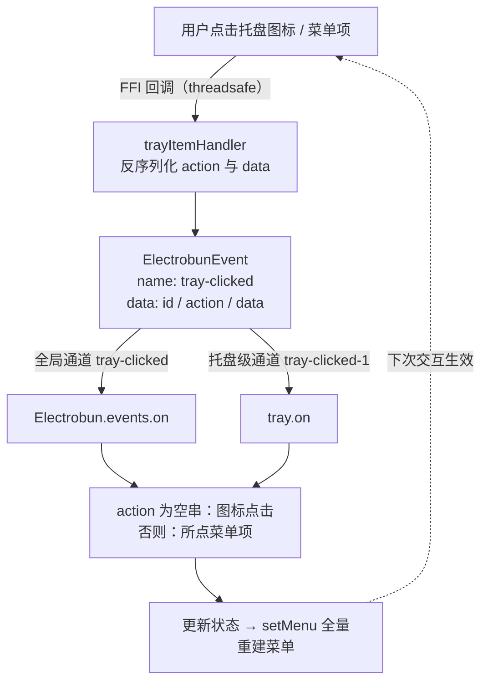
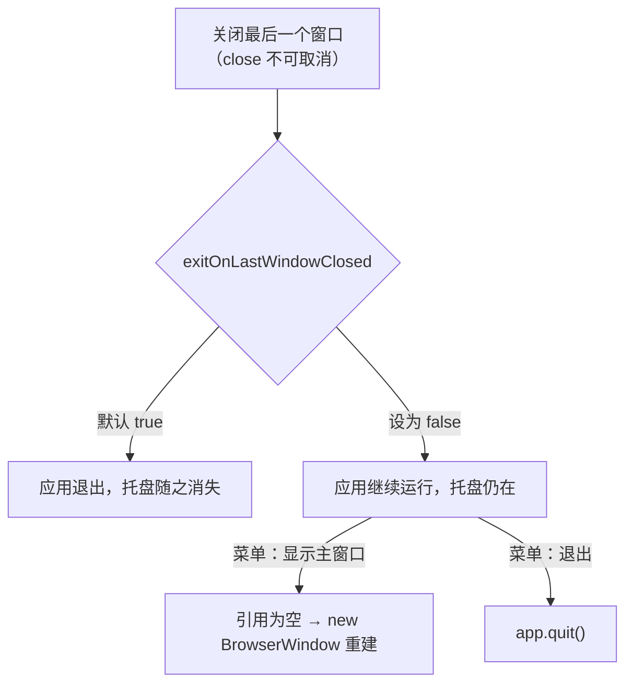

import { Canvas, Controls, Meta } from '@storybook/addon-docs/blocks';
import * as Tray from './tray.stories';

<Meta of={Tray} name="Docs" />

# 系统托盘

Tray 是主进程里的常驻对象：`new Tray(options)` 之后，应用的图标与文本就挂在系统托盘（macOS 菜单栏右侧 / Windows 系统托盘）里，窗口关掉它也在。本课讲清四件事——托盘项怎么配（标题、图标、可见性）、托盘菜单怎么建怎么响应、唯一的 `tray-clicked` 事件如何同时承载图标点击与菜单项点击，以及「关掉窗口但留住应用」的常驻形态怎么组装。跑完课程里的托盘观察台工程后，你能预测每一次托盘交互会在终端打出什么、菜单勾选状态从哪来、应用什么时候会退出。



回查时先看这组关键事实（选项默认值与 1.18.1 包内 `dist/api/bun/core/Tray.ts` 构造参数核对过；文档站未列默认值）：

| `TrayOptions` | 默认 | 含义 |
| --- | --- | --- |
| `title` | `""` | 托盘文本，可与图标并存，常用来顶状态 |
| `image` | `""` | 图标地址：`views://` 打包地址或绝对文件路径 |
| `template` | `true` | macOS 模板图像：按 alpha 单色渲染、自适应明暗菜单栏 |
| `width` / `height` | `16` / `16` | 图标绘制尺寸，与实际 PNG 尺寸对齐 |

| 方法 | 作用 |
| --- | --- |
| `setTitle` / `setImage` | 更新文本 / 图标（`setImage` 同样接受 `views://` 或绝对路径） |
| `setMenu` | 挂载或全量重建托盘菜单 |
| `on("tray-clicked", handler)` | 订阅本托盘的点击事件 |
| `setVisible` | `false` 移除原生托盘项，`true` 重新创建 |
| `getBounds` | 托盘图标位置 `{ x, y, width, height }` |
| `remove` | 永久移除，并从内部托盘表注销 |
| `Tray.getAll` / `getById` / `removeById` | 类级查询与清理 |

## 快速上手

课程目录的 `tray-observer/` 是完整可运行工程（macOS + Bun，electrobun 1.18.1）：一个常驻托盘应用的最小完整形态——图标 + 文本托盘项、状态化菜单、事件日志、关窗不退出。

```bash
cd cheatsheets/tray/tray-observer
bun install
bun start
```

菜单栏右侧出现黑色圆形图标与「托盘观察台」文本后，按清单交互，逐条核对终端输出：

| 操作 | 可观察证据 |
| --- | --- |
| 启动完成 | 托盘项出现；终端打出 `[setMenu] 第 1 次重建菜单` 与启动提示 |
| 点击托盘图标 | 菜单弹出；终端先 `[global:tray-clicked]` 再 `[tray-clicked]`，`action:""`，随后 `[setMenu]` 计数 +1 |
| 点「自动更新」 | 出现勾选、托盘文本变为「托盘观察台 · 更新开」；终端 `action:"auto-update"` |
| 「自动更新」未勾选时看「自动更新开启后可用」 | 该项灰显，点击无事件（`enabled` 门控） |
| 关闭主窗口 | 窗口销毁但应用与托盘仍在（`exitOnLastWindowClosed: false`），终端打出 `[window] close` |
| （上一行关掉窗口后）点「显示主窗口」 | 新窗口重建；终端 `data:{"window":"main"}` 与 `[window] 已重建主窗口` |
| 点「隐藏 Dock 图标」 | Dock 里的应用图标消失，应用只剩托盘入口 |
| 点「退出」 | 应用结束，托盘项消失 |

## 托盘项

`new Tray(options)` 一步完成创建：主进程把选项交给原生层，拿到指针后立即出现在系统托盘，同时以自增 `id` 登记进内部 `TrayMap`（`tray.id` 即此编号，`Tray.getAll()` 随时可查全部存活托盘）。创建不抛错也不崩溃：平台不支持时构造函数内部捕获失败，打两条 `console.warn`（`Tray creation failed:` 与 `System tray functionality may not be available on this platform`），`visible` 置 `false`、内部指针置空——之后的 `setTitle` / `setMenu` 等都会静默早退，不会报错。托盘看不到又没有异常时，先回终端找这两行 warn。

### 图标与标题

`title` 与 `image` 可以并存（观察台两者都有），也可以只留其一；`setTitle` / `setImage` 在任意时刻更新，观察台用 `setTitle` 把「更新开」状态顶到托盘文本上。图标地址的解析规则只有两条（`resolveImagePath` 的全部逻辑）：

- `views://` 前缀：映射到应用打包目录的 `views/` 下——文件要先经 `electrobun.config.ts` 的 `build.copy` 装配进去（观察台把 `src/assets/tray-icon-16-template.png` 复制到 `views/tray-assets/`，见[第一个窗口](?path=/docs/first-window--docs)对 `views://` 的讲解）；
- 其余字符串原样传给原生层，因此要写绝对文件路径；写在 `src/` 里的相对路径解析不到。

`template` 只对 macOS 有意义：模板图像用 alpha 通道定义形状、按单色渲染，自动适配浅色/深色菜单栏——观察台的黑色圆形 PNG 就是这种。全彩图标（如品牌 logo）要显式 `template: false`，否则被当模板处理成剪影。`width` / `height` 是传给原生的绘制尺寸，默认 16；文档示例用 32×32 的 PNG 配 32——让两者一致，避免模糊或裁切。

### 可见性与移除

`setVisible` 是开关：`false` 时移除原生托盘项、指针置空（内部状态保留），`true` 时重新走一遍创建流程并重新挂上菜单——相当于「暂时藏起来」，状态都还在。`remove()` 是终结：移除原生项并从 `TrayMap` 注销，之后 `setTitle` / `setMenu` 等按 id 查找本实例的原生调用都静默失效；需要托盘就 `new Tray` 重建，不要对已 `remove()` 的实例再 `setVisible(true)`——那只会造出一个挂不上菜单、也无法再管理的孤儿图标。`getBounds()` 返回图标当前 `{ x, y, width, height }`，多显示器布局或「在托盘旁弹面板」的场景用它定位；托盘不存在时返回全零矩形。

## 托盘菜单

托盘菜单没有运行时可改的对象：`setMenu(items)` 每次都把整份配置序列化后交给原生，原生菜单即刻替换。所以菜单是「从状态重建」而不是「原地修改」——把勾选、门控收进一个状态对象，每次交互后用最新状态重新 `setMenu`（文档把这个列为常见模式，用来实现 checkbox 切换）：

```ts
const menuState = { "auto-update": false }; // 菜单的唯一真源

function updateTrayMenu() {
  tray.setMenu([
    {
      type: "normal",
      label: "自动更新",
      action: "auto-update",
      checked: menuState["auto-update"], // 勾选由状态驱动
    },
    {
      type: "normal",
      label: "自动更新开启后可用",
      action: "advanced",
      enabled: menuState["auto-update"], // 门控由状态驱动
    },
    { type: "divider" },
    { type: "normal", label: "显示主窗口", action: "show-main", data: { window: "main" } },
  ]);
}
```

菜单项字段（与 1.18.1 包内 `MenuItemConfig` 及其默认值填充逻辑核对）：

| 字段 | 类型 / 默认 | 作用 |
| --- | --- | --- |
| `type` | `"normal"` / `"divider"` / `"separator"` | 托盘菜单项必填 `"normal"`；`"divider"` 与 `"separator"` 等价，都归一成分隔线 |
| `label` | string，默认 `""` | 显示文本 |
| `action` | string，默认 `""` | 点击回传的标识；不写就与图标点击不可区分 |
| `data` | 任意 | 随点击事件原样回传的载荷 |
| `submenu` | `MenuItemConfig[]` | 子菜单，递归应用同样的字段与默认值 |
| `enabled` | boolean，默认 `true` | `false` 灰显，点击不触发事件 |
| `checked` | boolean，默认 `false` | 勾选态 |
| `hidden` | boolean，默认 `false` | 隐藏该项（在菜单里不渲染） |
| `tooltip` | string | 悬停提示 |

边界：托盘菜单项与 `ApplicationMenu` 的项同源但更简——没有 `role`（平台预置角色）、没有 `accelerator`（快捷键标注），`type` 也不可省略。菜单栏结构、menuRoles 与平台差异是「应用菜单」一课的范围（路线 4.1.1）；右键弹出的 `ContextMenu` 是另一套入口（路线 4.1.2）。

## tray-clicked 事件

托盘只有这一个事件，图标点击和菜单项点击都走它，靠载荷区分。点击发生后，原生层通过 FFI 回调把序列化的 action 送回 Bun，框架反序列化出 `data` 载荷，构造成 `ElectrobunEvent` 后沿两条通道分发（与[窗口事件](?path=/docs/window-events--docs)同一套 emitter 规则）：

- **全局通道** `"tray-clicked"`：`Electrobun.events.on("tray-clicked", handler)` 订阅，多托盘时靠 `e.data.id` 区分是哪一个；
- **托盘级通道** `"tray-clicked-{id}"`：`tray.on("tray-clicked", handler)` 订阅，只收本托盘的事件。全局通道先触发。

| `e.data` 字段 | 含义 |
| --- | --- |
| `id` | 触发的托盘 id（`tray.id`） |
| `action` | 空串 `""` = 点击的是托盘图标本身；否则为所点菜单项的 `action` |
| `data` | 所点菜单项的 `data` 载荷，未提供时为 `undefined` |

两个来自 1.18.1 包内实现的补充事实：handler 收到的参数类型尚未标注（类型是 `unknown`，实际是 `ElectrobunEvent` 实例，文档也标了 `TODO: events should be typed`，取载荷要像观察台那样断言 `.data`）；文档页顺带提到的 `tray-item-clicked` 事件在包内并不存在——1.18.1 就是用同一个 `tray-clicked` 加 `action` 空串与否来区分两类点击的。

下面的示意把「点击 → 事件 → 通道 → handler → 重建」整条链路搬进浏览器；真实托盘行为以观察台工程为准。

<Canvas of={Tray.TrayClickFlow} />

<Controls of={Tray.TrayClickFlow} />

| 读者操作 | 可观察证据 |
| --- | --- |
| 点击示意菜单栏最右的托盘图标 | 菜单弹出；最近事件 `action=""`；盒 3 里 `action === ""` 分支高亮；`setMenu` 计数 +1 |
| 点「自动更新」 | 最近事件带 `action:"auto-update"`，菜单收起；再次点托盘图标打开菜单，勾选已在、灰显项变为可点（菜单从状态重建） |
| 点击右下「应用状态」盒把窗口切到「已关闭」，再经托盘图标开菜单点「显示主窗口」 | 最近事件 `data:{"window":"main"}`（`data` 载荷随事件回传），窗口重建计数 +1——close 拦不住，常驻靠重建 |
| 点「退出」 | 整个演示变灰、提示 `app.quit()`——托盘随应用消失，此后点击无反应 |
| 「订阅方式」切到 `Electrobun.events.on` 或「两者」 | 盒 2 里对应通道亮起，另一条灰掉；全局通道排在托盘级前面 |
| 「自动更新初始勾选」打开 | 菜单初始就带勾选、灰显项直接可点——菜单形态完全由状态决定 |
| 打开 Show code | 看到该 Canvas 实际执行的 `tray-click-flow.ts`，交互路由集中在 `fireClick()` |

## 常驻托盘应用

常驻形态（关掉窗口、应用留在托盘）需要三件事配合，观察台工程就是完整实现：

1. **配置退出判定。** 默认 `runtime.exitOnLastWindowClosed: true`——最后一个窗口关闭即退出应用（框架在全局 `close` 通道上的内置处理，见[窗口事件](?path=/docs/window-events--docs)）。常驻应用在 `electrobun.config.ts` 里关掉它：

```ts
export default {
  app: { name: "tray-observer", identifier: "dev.learn.tray", version: "0.0.1" },
  runtime: {
    exitOnLastWindowClosed: false, // 关掉最后一个窗口也不退出
  },
} satisfies ElectrobunConfig;
```

2. **按需重建窗口。** 1.18.1 的窗口 `close` 事件没有 `response` 拦截机制（事件响应类型是空对象，FFI 回调也没有把应答传回原生的通道）——点了关闭按钮窗口必然销毁，改不成「隐藏」。所以常驻模式是「允许关闭 + 之后重建」：用 `win.on("close")` 把引用置空，托盘菜单的「显示主窗口」发现引用为空就 `new BrowserWindow` 重建（窗口选项见[窗口选项](?path=/docs/window-options--docs)）。

3. **给托盘留退出入口。** 应用不再随窗口关闭退出，退出要自己给：托盘菜单放「退出」项，handler 里 `app.quit()`（等价 `Utils.quit()`，会走原生清理；`process.exit` 也被框架接管到同一条路）。dev 循环里 Ctrl+C 同样能结束。



macOS 上还可以更进一步做成「菜单栏应用」：`Utils.setDockIconVisible(false)` 藏掉 Dock 图标，应用只从托盘可达（观察台的「隐藏 Dock 图标」菜单项就是它）。托盘项的提醒类场景配 `Utils.showNotification` 使用，属于「通知与对话框」一课的范围（路线 4.2.2）。

## 最佳实践

- **菜单状态唯一真源 + 全量重建。** 勾选、门控收进一个 `menuState`，`updateTrayMenu()` 从它生成整份配置；图标点击与每个菜单项点击都以重建收尾。没有「改某一个菜单项」的 API，绕开重建只会引入不一致。
- **macOS 图标用模板图。** 黑色 + alpha 通道的单色 PNG 配默认的 `template: true`，明暗菜单栏都干净；全彩品牌图才 `template: false`。PNG 实际尺寸与 `width` / `height` 对齐（默认 16，文档示例 32）。
- **`action` 当常量、`data` 当载荷。** `action` 用稳定的字符串常量做分发（配合 `switch`），结构化信息放 `data`——事件把它原样回传，省掉解析字符串。
- **常驻三件套一起上。** `exitOnLastWindowClosed: false`、托盘「显示主窗口」重建引用为空的窗口、「退出」走 `app.quit()`；只做其中一件，用户总有一条路把应用弄丢或关不掉。

## 常见问题

- `new Tray(...)` 之后系统托盘里没有出现。
  平台不支持时构造函数内部捕获失败并打 `console.warn`（`Tray creation failed:` 等），托盘 `visible` 为 `false`，后续 `setTitle` / `setMenu` 静默早退。先回终端找这两行 warn，确认在受支持的平台上运行。
- `image` 指向 `src/` 下的相对路径，图标不显示。
  地址解析只把 `views://` 前缀映射到打包目录，其余原样传给原生层，相对路径解析不到。先用 `build.copy` 把图片装配进 `views/` 再用 `views://` 引用，或改绝对路径。
- 全彩图标显示成了剪影，或深色菜单栏里看不清。
  `template` 默认 `true`，macOS 按 alpha 单色渲染。全彩图标显式 `template: false`。
- 点某个菜单项收不到事件，或收到的 `action` 是空串。
  该项没写 `action`：框架默认填 `""`，与图标点击不可区分。给每个需要响应的菜单项显式写 `action`。
- 关掉最后一个窗口，应用直接退出了，托盘也消失。
  `runtime.exitOnLastWindowClosed` 默认 `true`。常驻形态在 `electrobun.config.ts` 的 `runtime` 段设为 `false`。
- 想把窗口关闭拦截成「隐藏到托盘」。
  1.18.1 的 `close` 事件没有 `response` 拦截机制，点了关闭窗口必然销毁。采用「允许关闭 + 托盘重建」，或在窗口里自己提供「隐藏」入口（`win.hide()`，托盘「显示主窗口」再 `win.show()`）。

## 总结回顾

摘要：

托盘项由 `new Tray(options)` 一步创建（`title` / `image` / `template` / `width` / `height`，默认空、空、true、16、16），图标地址只认 `views://` 打包地址与绝对路径；`setTitle` / `setImage` / `setVisible` / `remove` / `getBounds` 覆盖后续生命周期。菜单靠 `setMenu` 全量重建：`MenuItemConfig` 必填 `type: "normal"`，勾选与门控（`checked` / `enabled` / `hidden`）都由应用状态推导，每次交互后重建生效。唯一事件 `tray-clicked` 用载荷区分两类点击——`action` 空串是图标点击、非空是菜单项，`data` 载荷随事件回传；事件沿全局通道与 `tray.on` 托盘级通道分发，全局先触发。常驻形态三件套：`runtime.exitOnLastWindowClosed: false`（默认 true）、窗口允许关闭后按需重建、托盘菜单留 `app.quit()` 退出；macOS 可再藏 Dock 图标。

一句话：

> 托盘的一切交互都收敛成 `tray-clicked` 一个事件——`action` 为空串是图标点击、非空是菜单项；菜单没有原地修改，永远从状态全量重建；常驻应用的关键配置是 `runtime.exitOnLastWindowClosed: false`。

知识要点：

- `Tray` 构造有哪些选项？各自的默认值是什么？
- 图标地址支持哪两种写法？`views://` 的文件从哪来？
- `action` 为空串与非空分别代表什么？菜单项的 `data` 如何回到 handler？
- 为什么托盘菜单必须「重建」而不是「原地修改」？`enabled` / `checked` / `hidden` 各自门控什么？
- `tray.on` 与 `Electrobun.events.on` 两条通道的名称与触发顺序？
- 常驻托盘应用需要哪三件事配合？窗口 `close` 为什么拦不成「隐藏」？
- `setVisible(false)` 与 `remove()` 的区别？托盘创建失败时的表现？

## 参考资料

- [Electrobun 文档：Tray API](https://framework.blackboard.sh/electrobun/apis/tray/)（选项、方法与状态化菜单模式的官方描述）
- [Electrobun 文档：Events](https://framework.blackboard.sh/electrobun/apis/events/)（事件全局/局部传播、`exitOnLastWindowClosed` 作为退出触发器的表述）
- electrobun 1.18.1 包内实现：`dist/api/bun/core/Tray.ts`（选项默认值、`resolveImagePath`、`setVisible` / `remove` 语义）、`dist/api/bun/proc/native.ts`（`trayItemHandler`、`menuConfigWithDefaults` 字段默认值、`MenuItemConfig` 类型）、`dist/api/bun/events/trayEvents.ts`（事件载荷类型）、`dist/api/bun/ElectrobunConfig.ts` 与 `dist/api/bun/core/BrowserWindow.ts`（`exitOnLastWindowClosed` 默认 true 与内置退出判定）
