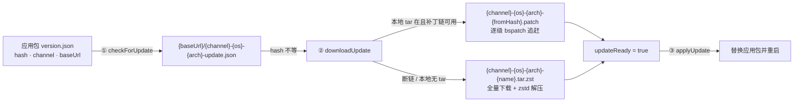
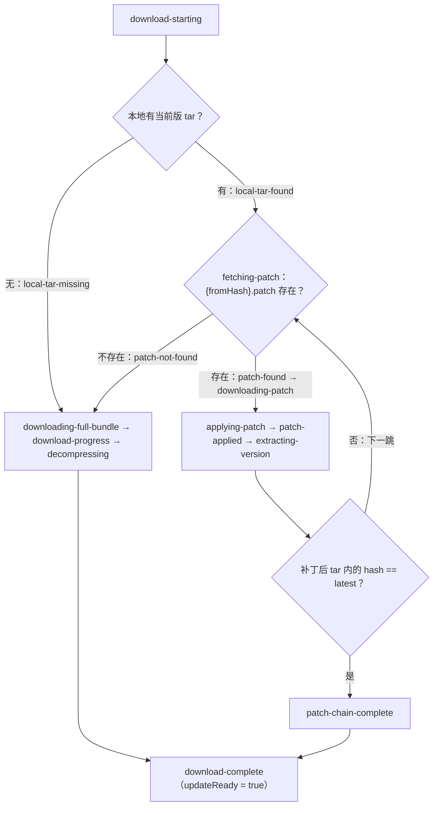

import { Canvas, Controls, Meta } from '@storybook/addon-docs/blocks';
import * as UpdaterStories from './updater.stories';

<Meta of={UpdaterStories} name="Docs" />

# 自动更新

Electrobun 的更新机制不需要更新服务器：`artifacts/` 里的三个文件——`update.json`（清单）、`{fromHash}.patch`（bsdiff 差分）、`{name}.tar.zst`（全量包）——传到任意静态托管就构成了更新源。应用侧由主进程的 `Updater`（从 `electrobun/bun` 导入）按三步走：`checkForUpdate` 用清单里的 hash 判断有没有更新，`downloadUpdate` 优先沿补丁链逐级追赶、断链时回退全量包，`applyUpdate` 替换应用并重启。本课讲清这条链路的比对基准、通道语义、状态事件与平台差异，以及一件必须先建立的认识：**框架没有内置回滚**——替换完成即删旧版，回滚靠重新托管旧构建。



回查先看这组 API 速查（方法、返回与行为均与 1.18.1 包内 `dist/api/bun/core/Updater.ts` 核对过）：

| API | 作用 | 回查要点 |
| --- | --- | --- |
| `checkForUpdate()` | 拉远端清单并比对 | 返回 `{version, hash, updateAvailable, updateReady, error}`；`hash` 不等即 `updateAvailable`，不比较版本号高低；dev 通道直接短路返回 no-update |
| `downloadUpdate()` | 下载更新到本地 | 补丁链优先、全量包兜底；成功后 `updateInfo().updateReady` 为 `true`；内部会重新 checkForUpdate 取最新目标 |
| `applyUpdate()` | 安装并重启 | 以 `updateReady` 为门控，不满足时静默返回；替换应用包后退出并重启 |
| `updateInfo()` | 同步读缓存 | 上次 `checkForUpdate` 的结果加 `updateReady`；从未检查过时返回 `undefined`，官方示例即 `updateInfo()?.updateReady` |
| `onStatusChange(cb)` | 订阅状态事件 | **单回调**：后设覆盖、传 `null` 清除，不是多订阅者的事件总线 |
| `getStatusHistory()` / `clearStatusHistory()` | 状态历史 | 返回全部历史条目的副本 / 清空；历史只增不减，长驻应用建议定期清理 |
| `localInfo.{version,hash,channel,baseUrl}()` | 读本地元数据 | 来自应用包 `../Resources/version.json`，首次读取后缓存 |
| `appDataFolder()` | 更新工作目录 | `{系统应用数据}/{identifier}/{channel}`，补丁与 tar 都在其 `self-extraction/` 下 |
| `channelBucketUrl()` | 通道桶地址 | 扁平命名改造后恒等于 `baseUrl`，仅为兼容保留 |

## 快速上手

在 `tester/`（hello-world 工程）的 `src/bun/index.ts` 末尾追加四行，跑通「订阅状态 → 发起检查 → 看到 dev 短路」的最小闭环——不需要任何服务器：

```ts
import { Updater } from "electrobun/bun";

Updater.onStatusChange((entry) =>
  console.log(`[updater] ${entry.status}: ${entry.message}`),
);
console.log(await Updater.checkForUpdate());
```

运行 `bun start`，可观察结果（tester 实测）：日志先打印 `[updater] checking: Checking for updates...`，随即 `[updater] no-update: Dev channel - updates disabled`；`checkForUpdate()` 返回 `{version: "0.0.1", hash: "dev", updateAvailable: false, updateReady: false, error: ""}`。dev 通道的 `hash` 恒为 `"dev"`（见[构建与分发入门](?path=/docs/build-basics--docs)），更新器据此直接禁用自己。要观察真实更新链路，必须用 `--env=canary` / `--env=stable` 构建；完整流程见课程目录里的 `updater-flow.ts`（检查 + 下载 + 安装的投产形态，运行条件在其头部注释）。

## 更新链路

三步 API 各答一个问题：**有没有**（check）、**拿到没**（download）、**换上没**（apply）。判断「有没有」的全部依据是两份元数据的 hash 比对：

| 字段 | `version.json`（本地，应用包内） | `update.json`（远端，托管在 baseUrl） |
| --- | --- | --- |
| `version` | 构建时的 `app.version` | 最新发布的版本号 |
| `hash` | 应用包全部内容的哈希；dev 通道恒 `"dev"` | 最新发布的内容哈希 |
| `channel` | 构建通道，URL 拼接依据 | — |
| `baseUrl` | 更新文件根地址（构建期取自 `release.baseUrl`） | — |
| `name` / `identifier` | 产物文件名与应用标识 | — |
| `platform` / `arch` | — | 有（vite-tester canary 实测），Updater 未消费 |

比对规则只有一条：远端 `hash` 与本地 `hash` 不相等即 `updateAvailable`。它不看 semver 方向，升级与降级同权——这个设计是后面「回滚认知」的基础。两份文件如何生成、hash 何时计算见[构建与分发入门](?path=/docs/build-basics--docs)。

调用顺序上有一个容易忽略的细节：`downloadUpdate()` 与 `applyUpdate()` 内部都会**重新** `checkForUpdate()` 取最新目标 hash。也就是说，如果检查后远端又发了新版，下载的会是最新目标而不是你刚才看到的那个；而 `applyUpdate()` 安装的是当时远端清单指向的版本。

## 更新通道

通道在**构建期**由 `--env` 决定、写进 `version.json` 的 `channel` 字段，运行时只认它：`checkForUpdate` 用 `localInfo.channel` 拼出 `{channel}-{os}-{arch}-update.json` 这类地址。框架没有运行时切换通道的 API（源码中标注为待办）。三档通道在更新视角下的差异：

| 通道 | checkForUpdate 行为 | 托管注意 |
| --- | --- | --- |
| `dev` | 直接短路：no-update（`Dev channel - updates disabled`），不发起网络请求 | 无法验证更新链路，换 canary / stable |
| `canary` | 正常检查 | GitHub Releases 的 `releases/latest/download` **只解析非 prerelease**，canary 作为 prerelease 上传时该 URL 取不到清单；官方建议 canary 通道用 S3 / R2 |
| `stable` | 正常检查 | 可用 GitHub Releases latest 地址或任意静态托管 |

类型上 `BuildEnvironment` 是 `"stable" | "canary" | "dev" | (string & {})`——`--env` 接受自定义通道名，产物按 `-{channel}` 后缀命名（规则见[构建配置](?path=/docs/build-config--docs)），Updater 只对字面量 `"dev"` 做禁用特判，自定义通道的更新行为与 canary 相同。通道间的隔离是三重的：产物文件名带通道前缀 `{channel}-{os}-{arch}-`、本地更新目录 `appDataFolder()` 按 `{identifier}/{channel}` 分开、应用名带 `-canary` 等后缀可与正式版共存，所以 canary 与 stable 用户互不干扰。

## 状态事件

更新是长流程，`Updater` 用一套状态事件暴露进度。订阅模型要记住一句话：**`onStatusChange` 只持有一个回调**，再次调用会替换旧回调，传 `null` 清除；错过的事件可以去 `getStatusHistory()` 里翻全量历史。每个条目（`UpdateStatusEntry`）是 `{status, message, timestamp, details?}`，`message` 是可直接给用户看的英文描述。

`UpdateStatusType` 共 29 个值，按阶段回查（标注「未发出」的三个在 1.18.1 类型里声明但源码没有 emit 点，属预留）：

| 阶段 | 状态 |
| --- | --- |
| 检查 | `checking`、`no-update`、`update-available` |
| 补丁链 | `checking-local-tar`、`local-tar-found`、`local-tar-missing`、`fetching-patch`、`patch-found`、`patch-not-found`、`downloading-patch`、`applying-patch`、`patch-applied`、`patch-failed`、`extracting-version`、`patch-chain-complete` |
| 全量下载 | `download-starting`、`downloading-full-bundle`、`download-progress`、`decompressing`、`download-complete`（两条路径共同的终点） |
| 安装 | `applying`、`extracting`、`replacing-app`、`launching-new-version`、`complete` |
| 兜底 | `error` |
| 未发出 | `idle`、`check-complete`、`downloading` |

`details`（`UpdateStatusDetails`）里值得消费的字段：

| 字段 | 含义 | 出现场景 |
| --- | --- | --- |
| `progress` / `bytesDownloaded` / `totalBytes` | 全量下载进度；约每 500KB 发一次 `download-progress`。服务器没给 content-length 时 `totalBytes` 与 `progress` 为空 | 全量下载 |
| `patchNumber` / `totalPatchesApplied` | 正在应用第几个补丁 / 链完成后共应用几个 | 补丁链 |
| `currentHash` / `latestHash` | 当前与目标的完整 hash（`message` 文案里截断为前 8 位展示） | 检查与补丁链 |
| `usedPatchPath` | 最终走的是补丁（`true`）还是全量（`false`） | `download-complete` |
| `errorMessage` / `url` / `exitCode` / `zstdPath` | 失败定位：错误消息、出事的 URL、外部进程退出码 | `error` / `patch-failed` |
| `fromHash` / `toHash` | 类型里声明，1.18.1 源码未填充 | — |

状态到达的顺序由 `downloadUpdate` 的判定结构决定：



把这套事件接到界面上（进度条、状态文案）是状态机制的主要用途；主进程拿到 `entry` 后经 RPC 推给视图层即可（见[自定义 RPC](?path=/docs/rpc--docs)），完整接线在 `updater-flow.ts` 里。

## bsdiff 补丁链

差分补丁是 Electrobun 更新机制的核心卖点：自研的 zig + SIMD 版 bsdiff 生成的补丁可以小到 14KB，配合 zstd 全量包兜底，把「更新下载多大」与「应用本身多大」解耦。三个前置事实：

- **每次构建只生成一条补丁**：从紧邻的上一版到当前版。补丁文件名是**来源版本**的哈希——`{channel}-{os}-{arch}-{fromHash}.patch`，用户从 `fromHash` 出发才能用它。
- **补丁打在 tar 上，不是文件级**：bsdiff 作用对象是应用包的 tar 文件，本地 `self-extraction/{hash}.tar` 是逐跳的原材料。它的来源：上一次更新成功后，清理逻辑只保留最新一份 `{latestHash}.tar`；新装应用或目录被清理过则没有，此时直接走全量。
- **链式追赶**：从用户 hash 出发，每应用一条补丁就从打出来的 tar 里读出下一版 hash，重命名为 `{nextHash}.tar`、删掉旧 tar 与补丁，再检查下一条；`seenHashes` 防环，直到追上 `latestHash`。任何一跳断了（本地缺 tar、服务器缺补丁、bspatch 失败），都回退全量：下载 `{channel}-{os}-{arch}-{name}.tar.zst`（macOS 是 `.app.tar.zst`），zstd 解压成 `{latestHash}.tar`。

不同输入组合下到底走哪条路，用下面的示意验证（复刻 `downloadUpdate` 的分支顺序；真实下载以桌面工程日志为准）：

<Canvas of={UpdaterStories.PatchChain} />
<Controls of={UpdaterStories.PatchChain} />

| 读者操作 | 可观察证据 |
| --- | --- |
| 默认（v1.2.0 / 全部保留 / 本地 tar 在） | 补丁链完整：1 级补丁直达 v1.3.0，`usedPatchPath = true` |
| 用户切到 v1.0.0（其余不变） | 3 级补丁逐级追赶，序列出现 `×3`，`patch-chain-complete` |
| 服务器改「只留最近一条」，用户停在 v1.0.0 | 第一跳就缺 `a1b2c3d4.patch`：断链回退全量，`usedPatchPath = false` |
| 「只留最近一条」+ 用户切回 v1.2.0 | 恰好一跳、用最近一条补丁：链成功——只留最近一条只够服务落后一版的用户 |
| 关闭「本地当前版 tar」 | `local-tar-missing`：不尝试任何补丁，直接全量下载 |
| 服务器「没有补丁」 | 任何落后版本都在 `patch-not-found` 后回退全量 |
| 用户切到 v1.3.0（已是最新） | `checkForUpdate → no-update`，无需下载 |
| 打开 Show code | 看到该 Canvas 实际执行的 `patch-chain.ts`：`resolvePath()` 复刻 downloadUpdate 的判定顺序 |

对照结论：**补丁链能不能走通，取决于服务器还留没留着「从用户当前 hash 出发」的整条补丁路径**。这就是官方建议上传并长期保留整个 `artifacts/` 目录的原因——历史补丁在，落后任何版本的用户都能逐级追赶，每跳只花 KB 级流量；历史补丁被清，这些用户统一回退 MB 级全量包（hello-world 规模实测 17.7MB）。

## 安装与替换

`applyUpdate()` 只做一件事的判断：`updateInfo()?.updateReady` 不为真就静默返回。满足后重新检查远端、解压 `{latestHash}.tar`、找到应用包，然后按平台替换。各平台的差异值得一张表（依据源码逐分支核对）：

| 平台 | 实际运行位置 | 替换方式 | 重启方式 |
| --- | --- | --- | --- |
| macOS | `.app` 原位置（由 `process.execPath` 上推两级） | 删除运行中的 `.app` 后把新版 rename 过去；随后 `xattr` 移除 quarantine 属性（内层 bundle 已签名公证，quarantine 是解压下载档案时被 macOS 打上的） | 分离 shell 轮询本进程 PID 退出后再 `open` 新 `.app`——避免 `open` 只是激活旧实例 |
| Windows | `{appDataFolder}/app`（与自解压 extractor 落点一致） | 文件被占用无法直接换：生成 `update.bat`（等待 launcher / bun / CEF helper 进程退出、重试删除旧目录、move 新版），经 `schtasks` 计划任务在应用退出后执行 | 脚本完成替换后 `start` 新版 launcher.exe |
| Linux | `{appDataFolder}/app` | 删除并替换 `app` 目录，对 `bin/launcher`、`bin/bun` 补执行位 | 分离 shell 启动 `bin/launcher` |

共同点：替换完成即 `quit()` 优雅退出（走[应用生命周期](?path=/docs/app-lifecycle--docs)的退出链路），新版本自动接棒；`launching-new-version` 与 `complete` 是最后两个状态。

## 回滚认知

框架**没有内置回滚**。三点事实构成这条认知：

- **旧版本在本机不留副本。** macOS 替换是先 `rmSync` 再 rename；全平台的清理都只保留 `{latestHash}.tar`。`applyUpdate` 一旦完成，用户机器上就没有旧版可退。
- **回滚 = 重新托管旧构建。** 因为比对只看 hash 是否相等、不看版本方向，把旧版本的 `artifacts/`（`update.json` 指回旧 hash、旧全量包、历史补丁）重新上传覆盖远端，用户下一次检查就会把旧版当「新更新」装上——由于不存在从坏版本 hash 出发的补丁，这次降级必然走全量包。注意全量包文件名不含 hash（`{name}.tar.zst` 固定名），覆盖即整目录替换，`update.json` 要与产物同步换，顺序上先传产物再换清单，避免客户端看到新 hash 却下载不到。
- **hash 同权是双刃剑。** 它让降级与升级走同一条链路，也意味着误传旧的 `update.json` 会触发一次意外的版本回退——托管端把 `update.json` 当作唯一事实源来管理。

安全性上有一个源码级观察：1.18.1 的 Updater 只比对**清单里的** hash 与本地 hash，不校验下载内容本身的哈希，补丁与全量包的完整性依赖 HTTPS 传输与发布侧的代码签名，签名与公证配置见[代码签名](?path=/docs/code-signing--docs)；先发 canary 通道验证再推 stable，是控制坏版本影响面的主流做法。

## 最佳实践

- **上传并长期保留整个 `artifacts/` 目录，包括历史补丁与旧全量包。** 逐级追赶、全量兜底、降级回滚全都依赖旧产物仍在远端；只保留最新一条补丁等于强制落后用户走全量。
- **检查时机：启动 + 定时；下载与安装分离。** `downloadUpdate` 完成后 `updateReady` 保持为真，把 `applyUpdate`（会退出应用）留给用户确认或空闲时机；`updater-flow.ts` 是这套策略的骨架。
- **用 `onStatusChange` 驱动 UI，而不是轮询 `updateInfo()`。** `download-progress` 的 `details.progress` 直接可做进度条；经 RPC 推给视图层展示状态文案。
- **stable 可托管在 GitHub Releases latest 地址；canary 及自定义通道用 S3 / R2。** prerelease 不被 `latest/download` 解析，canary 用户会一直 404。
- **长驻应用定期 `clearStatusHistory()`。** 历史数组只增不减，托盘常驻形态跑数周会积累上万条目。

## 常见问题

- dev 构建里 `checkForUpdate` 永远返回没有更新？
  预期行为：dev 通道的 `version.json` 中 `hash` 恒为 `"dev"`，`checkForUpdate` 在发起任何网络请求前就短路返回 `no-update`（`Dev channel - updates disabled`）。验证真实链路要用 `--env=canary` 或 `--env=stable` 构建。
- 明明只是小改动，客户端却下载了十几 MB 的全量包？
  三种断链都会回退全量，先看状态历史定位：`local-tar-missing`（本地没有当前版 tar，常见于新装应用）或 `patch-not-found`（服务器缺从当前 hash 出发的补丁——只保留了最近一条而用户落后两版以上、历史补丁被清理）或 `patch-failed`（bspatch 执行失败，`details.errorMessage` 有退出码）。前两种的根治方式都是在服务器保留全部历史补丁，让落后用户重新可以逐级追赶。
- canary 用户一直收不到更新，stable 正常？
  若 `baseUrl` 用了 GitHub Releases 的 `releases/latest/download`：该地址只解析非 prerelease，canary 构建按 prerelease 上传时取不到 `update.json`，`checkForUpdate` 返回 `error: "Failed to fetch update info..."`。canary 通道改用 S3 / R2 等普通静态托管。
- `applyUpdate()` 调了没有任何反应？
  它以 `updateInfo()?.updateReady` 为门控，不满足时静默返回。先确认 `downloadUpdate` 真正成功：状态历史里最后的条目是 `download-complete` 而不是 `error`（baseUrl 不可达、全量包缺失都会停在 error）；dev 通道则永远到不了就绪。
- 已发布的版本有问题，怎么撤回？
  没有客户端回滚 API。用旧构建的 `artifacts/` 整套覆盖远端（先传产物、再换 `update.json`），用户下一次检查时 hash 不等即触发「降级更新」，走全量包回到旧版；确认回滚后再修复重新发布。

## 总结回顾

摘要：

更新机制由静态托管的三个文件与应用侧三步 API 构成：`checkForUpdate` 按 `{baseUrl}/{channel}-{os}-{arch}-update.json` 取清单，与本地 `version.json` 的 hash 比对，不等即有更新（不看版本方向）；`downloadUpdate` 优先沿 `{fromHash}.patch` 补丁链逐级 bspatch 追赶——补丁名是来源版本哈希、打在本地 `self-extraction/{hash}.tar` 上、每次构建只生成紧邻上一版的一条——本地缺 tar、缺补丁或 bspatch 失败都回退全量 `.tar.zst` 下载加 zstd 解压；`applyUpdate` 以 `updateReady` 为门控，macOS 原地替换 `.app` 并去隔离重启，Windows 借计划任务在退出后替换，Linux 替换 `app` 目录。通道由构建期 `--env` 写死、运行时不可切换，dev 短路、canary 在 GitHub Releases latest 地址下取不到 prerelease 清单。进度经 `onStatusChange` 单回调流出 29 个状态类型（3 个未发出），历史可查可清。没有内置回滚：替换即删旧版，回滚靠重新托管旧构建让 hash 比对触发一次全量降级，完整性依赖 HTTPS 与发布侧签名。

一句话：

> hash 不等即更新、补丁链断则全量兜底、替换即删旧版——Electrobun 把更新做成了纯静态文件游戏，回滚也只是重新上传一遍旧产物。

知识要点：

- 三步 API 各自的职责与返回结构是什么？`downloadUpdate` 与 `applyUpdate` 内部为什么会重新 `checkForUpdate`？
- `version.json` 与 `update.json` 各有哪些字段？`updateAvailable` 的判定依据是什么，为什么说它与版本号高低无关？
- 补丁文件的命名规则是什么（谁的 hash）？本地 tar 从哪来、断链时有哪三种触发情形、各自的状态信号是什么？
- 每次构建生成几条补丁？为什么建议长期保留历史补丁与旧全量包？
- 三个平台各自在哪里运行、怎么替换、怎么重启？Windows 为什么要用计划任务？
- `onStatusChange` 的订阅模型是什么？哪些 `details` 字段值得消费、哪些状态在 1.18.1 不会发出？
- 为什么 dev 通道检查不到更新？canary 通道用 GitHub Releases latest 地址会怎样？
- 想撤回坏版本时的完整操作是什么？为什么必须整套覆盖而不能只改 `update.json`？

## 参考资料

- [Updates — 官方更新指南（托管、GitHub Action、单补丁限制）](https://framework.blackboard.sh/electrobun/guides/updates/)
- [Updater API — checkForUpdate / downloadUpdate / applyUpdate 官方文档](https://framework.blackboard.sh/electrobun/apis/updater/)
- [Bundling & Distribution — artifacts 产物与托管模型](https://framework.blackboard.sh/electrobun/guides/bundling-and-distribution/)
- [blackboardsh/electrobun — GitHub 仓库（zig + SIMD bsdiff、14KB 更新口径）](https://github.com/blackboardsh/electrobun)
- electrobun 1.18.1 包内源码：`dist/api/bun/core/Updater.ts`（三步 API、状态事件、补丁链与平台替换）、`dist/api/shared/naming.ts`（`{channel}-{os}-{arch}` 命名规则）——本课 API 行为的最终依据。
