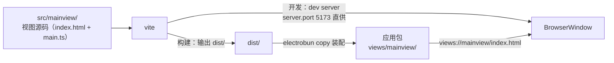
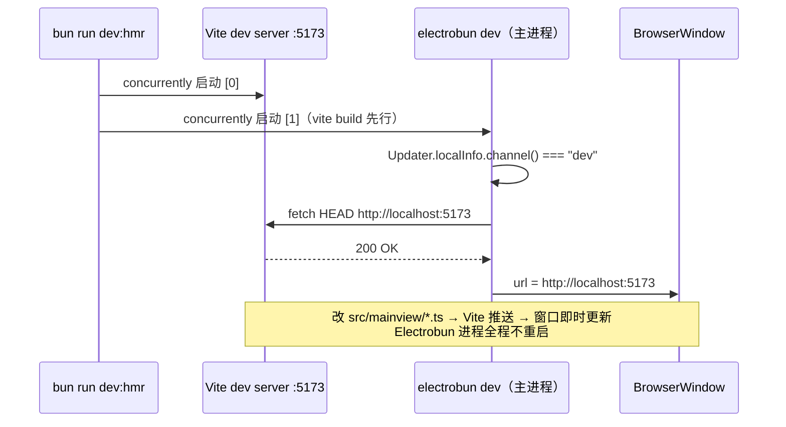

import { Canvas, Controls, Meta } from '@storybook/addon-docs/blocks';
import * as ViteHmrStories from './vite-hmr.stories';

<Meta of={ViteHmrStories} name="Docs" />

# Vite 集成与 HMR

Electrobun 的内建 `views` 构建能把纯 TS 视图直接转译进应用包，但它不承载前端工具链——框架单文件组件、Tailwind、各类 Vite 插件都长在外部构建工具上。集成方式不是把 Vite 塞进 Electrobun，而是分工：**Vite 负责视图构建，Electrobun 退到「装配 + 壳」的位置**——分发时用 `copy` 把 Vite 的 `dist/` 装配进 `views/`；开发时双进程并行，窗口直连 Vite dev server 获得即时更新。本课以工作区 `vite-tester/`（vanilla TS + Vite，electrobun 1.18.1，行为均经实测）为线索讲清三个关键面：Vite 侧怎么配、产物怎么装配、双进程 HMR 怎么转。`copy` 与 `watchIgnore` 的字段语义在[构建配置](?path=/docs/build-config--docs)，命令细节在[CLI 参数](?path=/docs/cli--docs)，React 等框架的组合方式在[前端框架集成](?path=/docs/frontend-frameworks--docs)。



同一份视图源码，两条消费路径：开发期窗口连左上的 dev server，分发期走右下的 copy 装配——主进程在启动时决定走哪条。回查先看这组关键配置（键值与 `vite-tester/` 实际文件一致）：

| 对象 | 值 / 形式 | 回查要点 |
| --- | --- | --- |
| `vite.config.ts` → `root` | `"src/mainview"` | 视图源码与入口 `index.html` 所在目录 |
| `build.outDir` + `build.emptyOutDir` | `"../../dist"` + `true` | `outDir` 在 `root` 外时 `emptyOutDir` 默认 `false`，须显式开启才会清空 |
| `server.port` + `server.strictPort` | `5173` + `true` | 端口钉死，主进程探测地址才确定；被占时 Vite 直接退出而不是换端口 |
| `electrobun.config.ts` → `build.views` | 整段省略 | 视图 TS 交给 Vite，Electrobun 不再转译 |
| `build.copy` | `dist/index.html`、`dist/assets` → `views/mainview/…` | 目标必须在 `views/` 下才有 `views://` 地址 |
| `build.watchIgnore` | `["dist/**"]` | 防止 Vite 构建落盘触发 Electrobun 整轮重建重启 |
| `scripts.dev:hmr` | `concurrently "bun run hmr" "bun run start"` | 双进程：Vite dev server + 构建启动 |
| 主进程探测 | `Updater.localInfo.channel()` + `fetch HEAD` | 仅 dev 通道探活 5173；失败回退 `views://` |

## 快速上手

在工作区的 `vite-tester/` 里跑通双进程 HMR（macOS + Bun，依赖已装好，首次需要 `bun install`）：

```bash
cd vite-tester
bun run dev:hmr
```

终端出现两路带 `[0]` / `[1]` 前缀的输出：`[0]` 是 Vite dev server（`VITE ready` 与 `Local: http://localhost:5173/`），`[1]` 先跑一次 `vite build`，再由 Electrobun 主进程打出关键日志：

```text
HMR enabled: Using Vite dev server at http://localhost:5173
```

窗口随即打开且内容完整。此时编辑 `src/mainview/main.ts` 里任意文案并保存：`[0]` 出现 `[vite] (client) page reload main.ts`，窗口内容即时更新——`[1]` 一侧没有任何重建日志，Electrobun 进程没有重启。这就是本课要拆解的工作流。

对照另一条路径：`Ctrl+C` 结束后运行 `bun run start`（`vite build && electrobun dev`，无 dev server），主进程打出 `Vite dev server not running. Run 'bun run dev:hmr' for HMR support.`，窗口加载的是打包产物，改视图代码不再生效。两条路径如何切换，见「HMR 双进程工作流」。

## 视图构建的两种形态

判断只问一个问题：**视图代码需不需要前端工具链**。Electrobun 对两种形态都只做「装配 + 壳」，差别在谁把 TS 变成进包的 JS：

| | 内建 `views` 构建（`tester/` 形态） | Vite 外部构建（`vite-tester/` 形态） |
| --- | --- | --- |
| 视图 TS 谁转译 | Electrobun CLI（`build.views` + Bun.build 透传） | Vite（`build.views` 整段省略） |
| `build.copy` | html / css 等静态文件 | Vite 产物整体（`dist/`） |
| `src/mainview/index.html` 的角色 | 直接进包的最终页面 | Vite 构建入口，进包的是 `dist/index.html` |
| 视图改动生效方式 | `dev --watch` 整轮重建重启 | dev server 推送（page reload / HMR） |
| 前端生态（框架、插件、Tailwind…） | 无 | 完整 Vite 生态 |
| 构建 / 运行入口 | 一条 `electrobun dev` | `vite build` 先行 + 双进程 dev 脚本 |
| 适合 | 轻量纯 TS 视图 | 前端工具链工程 |

一个易混点：两种形态里都有 `src/mainview/index.html`，但角色完全不同。内建形态的页面引用 `views://mainview/index.js`（Electrobun 转译的产物）；Vite 形态的页面写 `<script type="module" src="/main.ts">`，由 Vite 解析打包，文件本身不进应用包。字段语义见[构建配置](?path=/docs/build-config--docs)。

## vite.config.ts

`vite-tester/vite.config.ts` 全文只有三个配置点，每个都在回答「和 Electrobun 怎么对接」：

```ts
import { defineConfig } from "vite";

export default defineConfig({
  root: "src/mainview",            // 视图源码目录：Electrobun 目录约定的 src/mainview
  build: {
    outDir: "../../dist",          // 相对 root 计算，落到工程根的 dist/
    emptyOutDir: true,             // outDir 在 root 外，Vite 默认不清空，须显式开启
  },
  server: {
    port: 5173,                    // 固定端口：主进程探测的地址由此确定
    strictPort: true,              // 被占时直接退出，不静默换端口
  },
});
```

- **`root: "src/mainview"`**：让 Vite 沿用 Electrobun 的目录约定（主进程在 `src/bun/`、视图在 `src/mainview/`），入口 `index.html` 与 TS 模块都在这个目录下找。
- **`outDir: "../../dist"`**：输出目录相对 `root` 计算，`../../dist` 落到工程根的 `dist/`——与源码分离、进 `.gitignore`，并且正好是 `electrobun.config.ts` 里 `copy` 的源。`emptyOutDir: true` 必须显式写：按 Vite 规则，`outDir` 在 `root` 之外时它默认 `false`（防止误删），不开的话旧产物会残留，`copy` 可能装配进过期文件。
- **`server.port: 5173` + `strictPort: true`**：主进程探活的地址写死是 5173。不开 `strictPort` 时端口被占 Vite 会自动跳到 5174，而主进程探测 5173 失败后**不报错地**回退打包产物——表现为「跑着跑着 HMR 没了」。钉死端口、占用即失败，问题在启动时就暴露。

Vite 本身的深入配置（插件、代理、环境变量）属于相邻主题，这里只讲与 Electrobun 的对接点。

## copy 装配与 watchIgnore

### copy 装配

`vite-tester/electrobun.config.ts` 的 `build` 段——`views` 整段消失，只剩两条映射：

```ts
build: {
  copy: {
    "dist/index.html": "views/mainview/index.html",
    "dist/assets": "views/mainview/assets",
  },
  watchIgnore: ["dist/**"],
  // mac / linux / win 平台段照常…
}
```

键是 Vite 产物路径，值是应用包内位置；文件和目录都能映射（`dist/assets` 是整个目录）。目标必须落在 `views/` 下，窗口才能用 `views://mainview/…` 访问（机制见[第一个窗口](?path=/docs/first-window--docs)；字段语义见[构建配置](?path=/docs/build-config--docs)）。

**路径解析实测**：Vite 默认 `base: "/"`，产物 `dist/index.html` 里是绝对引用 `<script src="/assets/index-y18cH7qk.js">`。装配后页面从 `views://mainview/index.html` 加载，这个绝对引用按 URL 规则解析时 host（视图名 `mainview`）保持不变、只替换路径，即 `views://mainview/assets/index-y18cH7qk.js`——正好命中 copy 过去的 `views/mainview/assets/`。1.18.1 + macOS native webview 实测：JS 与 CSS 均正常加载，页面完整渲染。所以这里**不需要**给 Vite 配 `base: "./"`。

### watchIgnore 隔离

`copy` 的源会自动进入 `dev --watch` 的监听范围（监听推导规则见[构建配置](?path=/docs/build-config--docs)）。不配 `watchIgnore` 的后果：每次 `vite build` 往 `dist/` 落盘，Electrobun 都触发一轮「杀进程 → 重建 → 重启」——开发节奏被外部工具的输出绑架，双进程工作流无从谈起。`watchIgnore: ["dist/**"]` 把 Vite 的产物隔离在 Electrobun 的监听之外，两套构建互不打扰。

「保存一个文件到底触不触发 Electrobun 重建」的完整判定链（固定忽略目录、watchIgnore glob、监听目录推导三道闸门）在[构建配置](?path=/docs/build-config--docs)课有可交互的 Canvas 演示，此处不重复。

## HMR 双进程工作流

`vite-tester/package.json` 的脚本把两个进程绑在一起：

```json
"start":   "vite build && electrobun dev",
"dev":     "electrobun dev --watch",
"hmr":     "vite --port 5173",
"dev:hmr": "concurrently \"bun run hmr\" \"bun run start\""
```

`concurrently` 让两条命令并行、日志带 `[0]` / `[1]` 前缀、`Ctrl+C` 一起结束。`dev:hmr` 的两个进程各司其职：`[0]` 是常驻的 Vite dev server（视图源码的即时编译与推送）；`[1]` 复用 `start`——先 `vite build` 保证回退路径有产物，再启动 Electrobun。两个进程唯一的交汇点在主进程启动时：



决策代码在主进程入口（完整可抄版本见本课目录 `dev-url-switch.ts`，与 `vite-tester/src/bun/index.ts` 一致），核心只有三步：

```ts
const channel = await Updater.localInfo.channel(); // 读应用包 version.json
if (channel === "dev") {
  try {
    await fetch(DEV_SERVER_URL, { method: "HEAD" }); // 探活
    return DEV_SERVER_URL;                           // http://localhost:5173
  } catch { /* 回退 */ }
}
return "views://mainview/index.html";
```

- **先判通道、后探活**。`Updater.localInfo.channel()` 读的是应用包 `Resources/version.json` 里的 `channel` 字段（API 见[Updater](?path=/docs/updater--docs)；官方文档记载 `getLocalInfo` 读 `version.json`）。`electrobun dev` / `build --env=dev` 的产物是 `"dev"`。canary / stable 产物**连探测都不做**——同一份主进程代码跑在分发产物里时，永远不会去访问 localhost。
- **探活失败不报错，回退打包产物**。`fetch` 包在 `try/catch` 里，连接被拒（没起 dev server、端口被占）就落到 `views://mainview/index.html`，这也是 `start` 里先跑 `vite build` 的意义：回退路径永远有产物可加载。

下面的示意在浏览器里复现这条决策链。切通道、开关 dev server，观察窗口加载哪个 URL、终端打出哪条日志：

<Canvas of={ViteHmrStories.UrlDecision} />
<Controls of={ViteHmrStories.UrlDecision} />

| 读者操作 | 可观察证据 |
| --- | --- |
| 默认状态（dev + server 运行） | 探活通过，窗口加载 `http://localhost:5173`，日志 `HMR enabled: Using Vite dev server at …` |
| 关闭「Vite dev server」 | `fetch` 连接失败，回退 `views://mainview/index.html`，日志提示 `bun run dev:hmr` |
| 通道切到 canary（server 保持运行） | 探活被跳过——分发产物永远不连 localhost，直接加载打包视图 |
| 打开 Show code | 看到该 Canvas 实际执行的 `url-decision.ts` |

连接建立后的更新形态由 Vite 决定：vanilla 模块没有 `import.meta.hot` 处理，改动触发的是整页 reload（实测日志 `[vite] (client) page reload main.ts`），模块内状态会重置；组件级、保留状态的热替换需要框架插件，见[前端框架集成](?path=/docs/frontend-frameworks--docs)。

还有一条边界要清楚：`dev:hmr` 里的 Electrobun 进程**没有 `--watch`**。它不会因主进程代码（`src/bun/`）改动而重启——频繁改主进程时要么手动重启 `dev:hmr`，要么把 `start` 里的命令换成 `electrobun dev --watch`（`dist/**` 已被隔离，主进程热重启与视图 HMR 可以并存）。`vite-tester` 把纯 watch 迭代留给 `bun run dev` 承担。

## 分发构建

分发命令同样是「Vite 先行」的串联（`vite-tester/package.json`）：

```json
"build:canary": "vite build && electrobun build --env=canary"
```

`vite build` 产出 `dist/`，`electrobun build --env=canary` 走分发流水线时按 `copy` 把它装配进应用包。实测 canary 产物（`artifacts/` 下的自解压 bundle）内的落点：

```text
vanilla-vite-canary.app/Contents/Resources/app/
  views/mainview/index.html
  views/mainview/assets/index-y18cH7qk.js
  views/mainview/assets/index-Dek3tkZ6.css
```

运行这份产物时 `channel` 是 `"canary"`，主进程决策直接走 `views://`——开发与分发共用同一份主进程代码，无需任何改动。通道语义、`artifacts/` 里的分发物与更新清单见[构建与分发入门](?path=/docs/build-basics--docs)。

## 最佳实践

- **端口钉死并开 `strictPort`。** 主进程探测地址是写死的；让「端口被占」在 Vite 启动时直接失败，好过静默换端口后主进程探不到、无声回退打包产物。
- **外部构建产物进 `copy`，必配 `watchIgnore`。** 对称规则：任何不由 Electrobun 转译、却会自主落盘的 copy 源（`dist/` 只是最常见的一种），都要隔离出监听范围；反过来，被主进程和视图共享的源码目录用 `build.watch` 补进监听（取舍见[构建配置](?path=/docs/build-config--docs)）。
- **保持「先通道后探活」的顺序。** 生产产物不碰 localhost，也避免分发环境里无谓的网络等待；探活永远包在 `try/catch` 里，失败必须回退而不是崩溃。
- **判断「有没有 HMR」看主进程那条日志。** `HMR enabled: Using Vite dev server at …` 在，窗口就连着 dev server；不在，就是回退了——先查 `[0]` 进程的 Vite 日志再查端口。
- **双进程脚本用 `concurrently` 固化。** 两个终端手动分跑也可以，但日志无前缀、忘开一头的概率高；固化成一条 `dev:hmr` 让工作流可复制。

## 常见问题

- `bun run dev:hmr` 明明跑起来了，改视图代码窗口却不热更新？
  先看 `[1]` 里有没有 `HMR enabled: Using Vite dev server at http://localhost:5173`。没有就是窗口走了 `views://` 回退：查 `[0]` 的 Vite 是否真的 ready、5173 是否被其他进程占用（开了 `strictPort` 会直接报错退出）；再确认产物是 dev 通道（`electrobun dev` 启动）。有这条日志但不更新：确认改的是 `src/mainview/` 下的模块，看 `[0]` 是否出现 `[vite] page reload`。
- 跑 `bun run dev`（`--watch`）改视图代码，完全没反应？
  Vite 形态没有 `views` entrypoint，`src/mainview/` 不在 Electrobun 的监听推导里；`dist/` 又被 `watchIgnore` 排除。`--watch` 只对主进程代码（`src/bun/`）有热重启效果，视图迭代要用 `dev:hmr`。
- 每次保存视图文件，整个应用都重启？
  `watchIgnore` 漏配 `dist/**`：copy 源在监听范围内，Vite 每次构建落盘都触发 Electrobun「杀进程 → 重建 → 重启」。补上后两套构建互不触发。
- 热更新后页面上的状态（计数、表单输入）丢了？
  vanilla 模块没有 `import.meta.hot` 边界，Vite 对入口模块的更新是整页 reload（实测日志 `[vite] (client) page reload main.ts`），模块内状态重置是预期行为；需要保留状态的组件级 HMR 要配框架插件，见[前端框架集成](?path=/docs/frontend-frameworks--docs)。
- `electrobun build` 报错 copy 不到 `dist/` 下的文件？
  首次构建或刚 clone 时 `dist/` 不存在——`vite build` 必须先行。用 `vite build && electrobun build …` 串联固化顺序（`vite-tester` 的 `build:canary` 即如此）。

## 总结回顾

摘要：

把视图构建交给 Vite 后，Electrobun 的角色收缩为「装配 + 壳」。Vite 侧以 `src/mainview` 为 `root`、输出到工程根 `dist/`、`strictPort` 钉死 5173；Electrobun 侧省略 `build.views`，用 `copy` 把 `dist/index.html` 与 `dist/assets` 装配到 `views/mainview/`（Vite 默认的 `/assets/` 绝对引用在 `views://` 下解析到同一视图命名空间，实测正常加载），并用 `watchIgnore: ["dist/**"]` 把 Vite 的落盘隔离出 `dev --watch` 的监听。开发期 `dev:hmr` 用 `concurrently` 并起 Vite dev server 与 `electrobun dev`，主进程按「先通道后探活」决定窗口连 `http://localhost:5173` 还是回退 `views://`，探活失败不报错；连上后 vanilla 模块的更新是整页 reload，框架级热替换交给插件。分发用 `vite build && electrobun build` 串联，canary 产物里 `views/mainview/` 完整，运行时通道非 dev 必然走打包视图。

一句话：

> 视图交给 Vite 构建、Electrobun 只装配——开发期窗口直连 Vite dev server，分发期由 `copy` 装配 `dist/`，`watchIgnore` 划清两套构建的监听边界。

知识要点：

- 两种视图构建形态各自的 `build.views` / `build.copy` 是什么样？按什么判断选 Vite？
- `vite.config.ts` 的 `root`、`outDir` + `emptyOutDir`、`port` + `strictPort` 各自约束什么？为什么 `outDir` 在 `root` 外时必须显式开 `emptyOutDir`？
- Vite 产物如何进入应用包？默认 `base: "/"` 产出的 `/assets/` 绝对引用在 `views://` 下如何解析？
- 为什么必须 `watchIgnore: ["dist/**"]`？不配会发生什么？
- `dev:hmr` 双进程各自负责什么？主进程按什么顺序决策窗口 URL？canary 产物为什么永远不连 localhost？
- vanilla 视图的热更新是什么形态？与框架 HMR 的差别在哪里？
- 分发构建的命令怎么串？产物里 `views/mainview/` 的落点是什么？

## 参考资料

- [Creating UI — 官方指南：views 构建、copy 与 `views://` 解析](https://framework.blackboard.sh/electrobun/guides/creating-ui/)
- [CLI Arguments — dev / build 命令、`--watch` 监听规则与构建环境](https://framework.blackboard.sh/electrobun/apis/cli/cli-args/)
- [Build Configuration — copy / watchIgnore / views 字段语义](https://framework.blackboard.sh/electrobun/apis/cli/build-configuration/)
- [Updater API — `getLocalInfo` 读 `version.json`（`localInfo.channel` 的数据来源）](https://framework.blackboard.sh/electrobun/apis/updater/)
- [Vite Build Options — `emptyOutDir` 默认值规则](https://vite.dev/config/build-options)
- [Vite Server Options — `strictPort` 语义](https://vite.dev/config/server-options)
- electrobun 1.18.1 包内类型与实现（`dist/api/bun/ElectrobunConfig.ts`、`dist/api/bun/core/Updater.ts`）；工作区 `vite-tester/` 工程（本课实测载体）。
