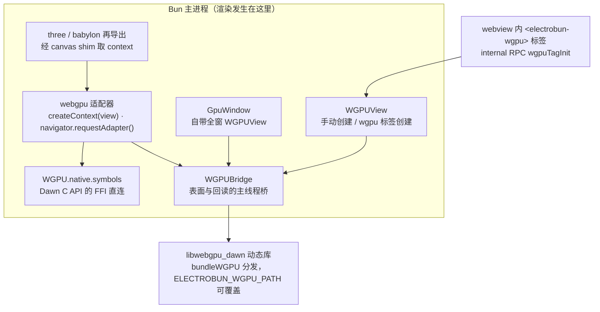
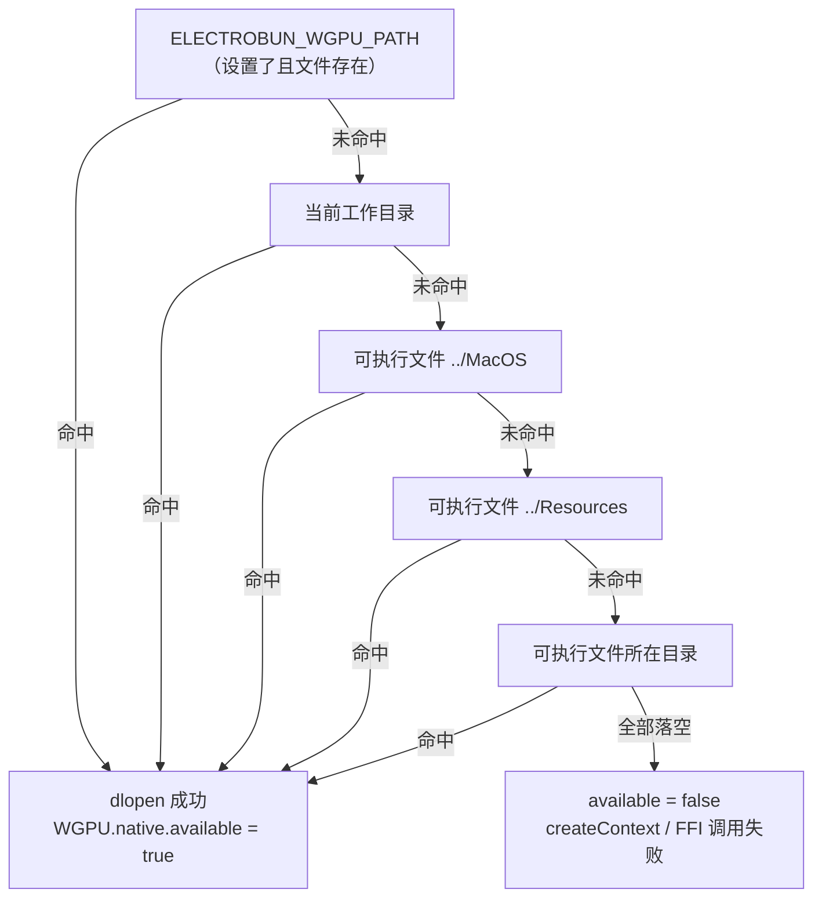

import { Canvas, Controls, Meta } from '@storybook/addon-docs/blocks';
import * as Webgpu from './webgpu.stories';

<Meta of={Webgpu} name="Docs" />

# WebGPU 与 3D 适配器

Electrobun 可以把 Dawn（Chromium 背后的原生 WebGPU 实现）作为动态库捆进应用，让 Bun 主进程直接持有并驱动原生 GPU 表面——**渲染不需要 webview**。围绕这块表面，`electrobun/bun` 提供三层 API：`WGPU.native` 是 Dawn C API 的 FFI 直连；`webgpu` 适配器在它之上提供 WebGPU 风格的 JS API（`createContext`、`navigator.requestAdapter`、`GPUDevice` 一族）；`three` 与 `babylon`（`@babylonjs/core`）由包再导出，配合 canvas shim 直接跑 3D 库。本课主线四步：表面从哪里来（GpuWindow 独立窗口、webview 里的 `<electrobun-wgpu>` 标签、手动 WGPUView）→ 帧怎么画上去（渲染链路与「提交即呈现」）→ three/babylon 怎么接 → 构建期怎么把 Dawn 打进包、运行时从哪里找到它。



回查时先看这组关键事实（默认值与签名均与 1.18.1 包内 `GpuWindow.ts`、`WGPUView.ts`、`webgpuAdapter.ts`、`ElectrobunConfig.ts` 核对过）：

| 对象 | 默认 / 取值 | 回查要点 |
| --- | --- | --- |
| `bundleWGPU`（mac / win / linux 段） | `false` | 开启后 Dawn 动态库随应用分发；不开且运行时找不到库，`WGPU.native.available` 为 `false` |
| `wgpuVersion`（build 段） | 最新 electrobun-dawn release | 构建时下载指定 Dawn 版本（semver 或 tag） |
| `GpuWindow` 选项 | frame `800×600@(0,0)`、`titleBarStyle: "default"`、`transparent: false`、`activate: true` | 构造即自动创建全窗 WGPUView（`autoResize: true`）；标题缺省 `"New Window"`（无参构造时 `"Electrobun"`） |
| `WGPUView` 选项 | frame 同上、`autoResize: true`、`startTransparent: false`、`startPassthrough: false` | `windowId` 指向所属窗口；手动布局用 `setFrame` |
| `<electrobun-wgpu>` 默认样式 | `display: block; width: 800px; height: 300px; background: #000` | 注入在 `head` 最前，页面样式可覆盖；尺寸由 CSS 决定 |
| `getPreferredCanvasFormat()` | 恒返回 `"bgra8unorm"` | `configure` 的 `format` 入参；context 自身初始 format 取表面能力表第一个格式 |
| 呈现模式 | Fifo（垂直同步） | 适配器固定写死，不可配置 |
| 库解析顺序 | 环境变量 → cwd → MacOS → Resources → 可执行文件目录 | 第一处命中即用；详见「构建与库解析」 |

## 快速上手

课程目录的 `gpu-window-observer/` 是完整可运行工程（macOS + Bun，electrobun 1.18.1）：**没有任何 views 与 webview**，`GpuWindow` + `webgpu` 适配器在原生表面上跑清屏色动画，证据全部打在启动终端：

```bash
cd cheatsheets/webgpu/gpu-window-observer
bun install
bun start
```

| 观察 | 可观察证据 |
| --- | --- |
| 启动 | 弹出的窗口背景色随时间在蓝紫之间呼吸——内容就是 GPU 表面本身 |
| 终端 | `[wgpu] Dawn 库：<路径>`；库里没有时会打印解析顺序提示并以退出码 1 结束 |
| 拖拽改变窗口大小 | 颜色继续铺满全窗，终端打出 `resize → W×H，表面已重配` |
| 关闭窗口 | 终端打出关闭日志，进程退出 |

想直接从官方模板起步：`bunx electrobun init my-app --template=wgpu-threejs`（`wgpu-babylon`、`wgpu-mlp` 同理，模板清单见[初始化项目](?path=/docs/init--docs)）。观察台工程里另附 `three-scene.ts` 与 `babylon-scene.ts` 两个入口，切换方式见「three 与 babylon」。

## 表面来源

一切渲染都发生在主进程，落点都是一个 `WGPUView`——一块挂在某个窗口上的原生 GPU 表面。三种来源只差「谁创建、谁驱动尺寸、怎么销毁」，拿到 `WGPUView`（或直接拿到 `GpuWindow`）之后的渲染链路完全一致。下面的示意在浏览器里复现三种来源的链路差异；真实行为以观察台工程为准。

<Canvas of={Webgpu.SurfaceSources} />
<Controls of={Webgpu.SurfaceSources} />

| 读者操作 | 可观察证据 |
| --- | --- |
| 把「表面来源」切到 webview 内 wgpu 标签 | 创建通道变为 internal RPC，autoResize 变为 false，resize 驱动变为同步控制器（100ms / 10ms 突发） |
| 切到手动 new WGPUView | 引用方式变为自持变量，尺寸只认 autoResize 或手动 `setFrame` |
| 打开 Show code | 看到该 Canvas 实际执行的 `surface-sources.ts`，事实表集中在 `surfaceFacts()` |

### GpuWindow

`GpuWindow` 是「整窗即表面」的专用窗口：构造时经 FFI 创建原生窗口，并**自动附带一个铺满全窗的 WGPUView**（`autoResize: true`），内容区就是 GPU 表面，没有 webview 参与。

```ts
import { GpuWindow, webgpu } from "electrobun/bun";

const win = new GpuWindow({
  title: "WebGPU",
  frame: { width: 800, height: 600, x: 200, y: 120 },
});

win.wgpuView;      // 自动创建的 WGPUView（getter，经 WGPUView.getById）
win.wgpuViewId;    // 视图 id
webgpu.createContext(win); // 渲染链路直接接受窗口，见下一节
```

窗口控制沿用 `BrowserWindow` 的新版可见性模型：`show()` 显示并激活、`showInactive()` 显示不抢焦点、`activate()` 聚焦已可见窗口（`focus()` 已废弃仍可用）；`activate` 选项缺省 `true`。完整方法面回查表（实现与 `BrowserWindow` 同构，语义差异见[窗口选项](?path=/docs/window-options--docs)）：

| 方法 | 作用 |
| --- | --- |
| `setTitle(title)` / `close()` / `activate()` | 标题、关闭、聚焦 |
| `show()` / `showInactive()` / `minimize()` / `unminimize()` / `isMinimized()` | 可见性与最小化 |
| `maximize()` / `unmaximize()` / `isMaximized()` / `setFullScreen(b)` / `isFullScreen()` | 最大化与全屏 |
| `setAlwaysOnTop(b)` / `isAlwaysOnTop()` | 置顶 |
| `setPosition(x, y)` / `setSize(w, h)` / `setFrame(x, y, w, h)` / `getFrame()` / `getPosition()` / `getSize()` | 几何 |
| `setWindowButtonPosition(x, y)` + `trafficLightOffset` 选项 | 仅 macOS，配 `titleBarStyle: "hiddenInset"` 用 |
| `on(name, handler)` | 订阅窗口事件（`close`、`resize`、`move`、`focus` 等，通道拼接规则见[窗口事件](?path=/docs/window-events--docs)） |

两个直接推论：**输入面很窄**——窗口事件里有键盘（`keyDown` / `keyUp`），但没有公开的指针输入 API，交互式 3D 场景要么把交互放在 webview 一侧（用 wgpu 标签混排），要么等后续版本；**退出判定与 BrowserWindow 共用**——`runtime.exitOnLastWindowClosed`（默认 `true`）在最后一个窗口关闭时同时检查 BrowserWindow 与 GpuWindow 两张表，关闭最后一个 GpuWindow 也会退出进程，纯 GPU 常驻进程要活着得显式把它设为 `false`。窗口关闭时，框架会自动移除其名下全部 WGPUView。

### electrobun-wgpu 标签

把原生 GPU 表面嵌进 webview 布局：HTML 里写 `<electrobun-wgpu>`，它是 DOM 锚点，真正的表面是主进程创建、原生层摆到锚点正上方的覆盖层——机制与兄弟元素 `<electrobun-webview>` 同款（同步控制器、遮罩、生命周期语义全部复用，差异见下），进程模型与层级关系见[webview 标签](?path=/docs/webview-tag--docs)。

```html
<electrobun-wgpu id="gpu" masks=".toolbar"></electrobun-wgpu>
```

```ts
// 视图侧：标签由可信 webview 的内置 preload 自动注册
const tag = document.querySelector("electrobun-wgpu") as WgpuTagElement;
tag.on("ready", () => {
  // 只有这里才能拿到有效的 wgpuViewId——初始化 RPC 已返回
  console.log(tag.wgpuViewId); // → 主进程 WGPUView.getById(tag.wgpuViewId)
});
```

| 成员 | 类别 | 作用 |
| --- | --- | --- |
| `transparent` / `passthrough` / `hidden` | 布尔属性 | 创建即生效（`transparent` 设锚点 `opacity: 0`、`passthrough` 设 `pointer-events: none`） |
| `masks` | string | 逗号分隔的 CSS 选择器，在覆盖层上为宿主元素打孔 |
| `wgpuViewId` | property | 主进程视图 id；元素 id 同步变为 `electrobun-wgpu-<id>` |
| `toggleTransparent(v?)` / `togglePassthrough(v?)` / `toggleHidden(v?)` | 方法 | 运行时开关，无参取反；同时作用于锚点样式与原生层 |
| `syncDimensions(force?)` | 方法 | 强制立即同步覆盖层 |
| `addMaskSelector(s)` / `removeMaskSelector(s)` | 方法 | 运行时增删打孔选择器，立即强制同步 |
| `runTest()` | 方法 | 调原生测试渲染器画一帧（排障用） |
| `ready` | 事件 | 唯一声明的事件，detail 是 `{ id }` |

与 webview 标签的关键差异：创建走 `wgpuTagInit`，主进程 `new WGPUView({ autoResize: false, ... })`——**表面尺寸由锚点的 DOM 布局驱动**（ResizeObserver + 轮询，静止 100ms、变化期 10ms 突发），不是跟随整个窗口；覆盖层里没有第二个进程，渲染内容由你的主进程代码决定。限制同样继承：宿主必须是可信 webview（沙箱精简 preload 不注册该标签，也没有 internal RPC 可调）；元素离开 DOM 即销毁表面，重插是全新初始化；Linux 透明窗口内穿透与打孔不可靠（见[跨平台与兼容性](?path=/docs/cross-platform--docs)）。Bun 侧渲染与 GpuWindow 完全一致——`webgpu.createContext(WGPUView.getById(tag.wgpuViewId))`。

### 手动 WGPUView

主进程直接构造，适合「一个窗口里摆几块固定区域」或把表面交给外部渲染器：

```ts
import { WGPUView } from "electrobun/bun";

const view = new WGPUView({
  windowId: win.id,        // GpuWindow 或 BrowserWindow 的 id
  frame: { x: 0, y: 40, width: 800, height: 560 },
  autoResize: false,       // 缺省 true（跟随窗口）；false 后只有 setFrame 会移动表面
  startTransparent: false, // 缺省 false
  startPassthrough: false, // 缺省 false
});

view.setFrame(0, 40, 800, 560); // 手动移动/缩放
view.setHidden(true);           // 隐藏但保留表面
view.getNativeHandle();         // 取原生句柄交给外部渲染器（如 C/C++ 库）
view.on("frame-updated", () => {}); // 包内唯一声明的事件
view.remove();                  // 显式销毁
```

静态方法 `WGPUView.getById(id)` / `WGPUView.getAll()` 兜底找回任何途径创建的视图。GpuWindow 自带的视图、标签创建的视图、手动构造的视图在主进程里是同一种对象——这也是三种来源共享同一条渲染链路的原因。

## 渲染链路

### 上下文与设备

`webgpu.createContext` 接受 `GpuWindow` 或 `WGPUView`，为它的表面建立 `GPUCanvasContext`；同一视图重复调用命中缓存。返回值是 `{ instance, surface, context }` 三元组，日常只用 `.context`：

```ts
import { GpuWindow, webgpu } from "electrobun/bun";

const win = new GpuWindow({ title: "WebGPU", frame: { width: 800, height: 600, x: 200, y: 120 } });
const context = webgpu.createContext(win).context;

// requestAdapter 不传参数时自动使用最近一次 createContext 的表面；
// 显式传时应传 GPUCanvasContext（即这里的 context）
const adapter = await webgpu.navigator.requestAdapter();
const device = await adapter.requestDevice();

context.configure({
  device,
  format: webgpu.navigator.getPreferredCanvasFormat(), // "bgra8unorm"
  alphaMode: "opaque", // 表面不支持的 alphaMode 会回落到第一个支持值
});
```

`configure` 的可选输入：`format`（字符串或内部数值，缺省用 context 初始 format——表面能力表的第一个格式）、`alphaMode`（`opaque` / `premultiplied` / `unpremultiplied`，以能力表为准）、`usage`（缺省 RenderAttachment）、`size`（GpuWindow 的 context 不传时用窗口当前大小兜底；标签与手动视图没有这个兜底，不传 `size` 表面停留在 1×1）。

### 提交即呈现

标准 WebGPU 里画一帧是「取纹理 → 编码 → 提交 → present」；适配器把最后一步自动化了——`device.queue.submit()` 提交后会**自动呈现最近一次 `getCurrentTexture()` 的表面**，单表面渲染循环里不需要显式 present（`context.present()` 留给手动时机）：

```ts
setInterval(() => {
  const encoder = device.createCommandEncoder();
  const pass = encoder.beginRenderPass({
    colorAttachments: [{
      view: context.getCurrentTexture().createView(),
      clearValue: { r: 0.2, g: 0.3, b: 0.5, a: 1 },
      loadOp: "clear",
      storeOp: "store",
    }],
  });
  pass.end();
  device.queue.submit([encoder.finish()]); // ← 自动呈现
}, 16);
```

「最近一次」是全局单值：适配器只跟踪最后一次取纹理的表面。多表面（多窗口、多标签）时把「取纹理 → 编码 → 提交」**按表面成组完成**，先取 A 的一整套提交完再取 B，交错取纹理会让 submit 呈现错对象。`getCurrentTexture()` 会校验表面状态，取不到可用纹理时抛 `Surface status <n>`——多半是尺寸重配没跟上或表面已被移除。

### 尺寸与重配置

原生视图跟随窗口（`autoResize`）或锚点（同步控制器）只是**视图矩形**在动；表面的纹理尺寸停留在 `configure` 时记录的宽高，不重配就按旧尺寸拉伸。两条规则：

- **GpuWindow / autoResize 视图**：在 `resize` 事件里带 `size` 重新 `configure`（观察台工程的可观察证据就是这条）；
- **标签表面**：主进程侧监听 `WGPUView` 的 `frame-updated` 事件或轮询 `view.frame`，变化后重配；视图侧布局变化后调 `tag.syncDimensions(true)` 加速对齐。

```ts
win.on("resize", (event) => {
  const { width, height } = event.data;
  context.configure({ device, format: "bgra8unorm", size: { width, height } });
});
```

three / babylon 场景里设备由渲染器内部持有，1.18.1 没有公开的按外部设备重配表面的入口，官方示例也不处理 resize——拉伸窗口时画面保持初始宽高比；需要严格跟随的 3D 场景用上面的手写链路。

### 计算与回读

适配器同样覆盖 compute pass（`createComputePipeline`、`dispatchWorkgroups`），GPU 输出经 `MAP_READ` 缓冲区读回 Bun 内存——`wgpu-mlp` 模板（GPU 神经网络推理）就是这条链路的完整参考。两个适配器特有的事实：**不导出 `GPUBufferUsage` / `GPUMapMode` 常量**，按 Dawn 位值传入；`mapAsync()` 无参时按 usage 推断方向（`MAP_READ` 缓冲区即读），约 2 秒超时返回 `false`。

```ts
// 位值：MAP_READ = 0x1，COPY_DST = 0x8（完整位表：MapWrite 0x2、CopySrc 0x4、
// Index 0x10、Vertex 0x20、Uniform 0x40、Storage 0x80、Indirect 0x100）
const readback = device.createBuffer({ size: byteLength, usage: 0x1 | 0x8 });
// ...compute pass 把结果 copyBufferToBuffer 进 readback...
await readback.mapAsync();                       // → Promise<boolean>
const out = new Float32Array(readback.getMappedRange().slice(0));
readback.unmap();
```

适配器在标准 API 之外还附加了 `readSync()`（同步读进 ArrayBuffer，带超时）与 `readbackAsync(dst)`（读进你给的 `Uint8Array`），底层走 `WGPUBridge` 的回读 shim。

## three 与 babylon 适配器

`electrobun/bun` 再导出整套 `three`（^0.165）与 `babylon`（`@babylonjs/core` ^7.45）——依赖由 electrobun 携带，主进程直接 import，不需要自己装版本。接入模式只有一种：**canvas shim**。3D 库假定自己拿的是浏览器 canvas，会调 `canvas.getContext("webgpu")`；shim 把这个调用接到原生表面的 `GPUCanvasContext` 上。适配器自带 `webgpu.utils.createCanvasShim(win)`，等价于手写一个假 canvas：

```ts
import { GpuWindow, three, webgpu } from "electrobun/bun";

const win = new GpuWindow({ title: "three.js + WebGPU" });
webgpu.install(); // 把适配器挂到全局 navigator.gpu 与 GPUCanvasContext

const canvas = webgpu.utils.createCanvasShim(win);
// 手写等价物：{ width, height, clientWidth, clientHeight, style: {},
//   getContext: (type) => type === "webgpu" ? webgpu.createContext(win).context : null,
//   getBoundingClientRect: () => ({ left: 0, top: 0, ...win.getSize() }),
//   addEventListener: () => {}, ... }

const renderer = new three.WebGPURenderer({ canvas });
await renderer.init();          // three 自己经 shim 取 adapter/device
renderer.setAnimationLoop(() => renderer.render(scene, camera));
```

babylon 的差异只在引擎构造：`new babylon.WebGPUEngine(canvas, { antialias: false })` 之后必须 `await engine.initAsync()`，再用 `engine.runRenderLoop(() => scene.render())`。观察台工程把两个变体做成了可直接切换的入口文件：

| 入口 | 切换方式 | 关键差异 |
| --- | --- | --- |
| `src/bun/index.ts`（默认） | — | 纯适配器清屏循环，终端证据最全 |
| `src/bun/three-scene.ts` | 配置里 `build.bun.entrypoint` 改指此文件 | `WebGPURenderer` + `await renderer.init()` |
| `src/bun/babylon-scene.ts` | 同上 | `WebGPUEngine` + `await engine.initAsync()` |

两个 3D 入口共同演示了一个边界：shim 的 `addEventListener` 是空实现，`attachControl` 一类交互接不到指针事件——GpuWindow 侧没有公开指针输入。要「HTML 界面 + GPU 视口」的交互，把表面放进 webview 用 `<electrobun-wgpu>` 标签混排，交互写在 HTML 一侧。

## 原生 FFI 直连

适配器没包到的 Dawn 能力走 `WGPU.native`——`dlopen` 后的 Dawn C API 符号表，函数名与签名一比一对应 Dawn C API（`wgpuCreateInstance`、`wgpuDeviceCreateBuffer`、`wgpuSurfaceConfigure`……）：

```ts
import { WGPU } from "electrobun/bun";

if (!WGPU.native.available) {
  throw new Error("WGPU 未捆绑或加载失败");
}
WGPU.native.path;    // 实际加载的库路径（排障第一入口）
WGPU.native.symbols; // Dawn C API 符号表
const instance = WGPU.native.symbols.wgpuCreateInstance(0);
```

两个来自实现的限制要在下钻前知道：`WGPUStringView` 这类按值传递的结构 Bun FFI 不支持，相关调用以指针形式暴露，需要时得加一层 C shim 转发；`WGPUFuture` 映射为单个 `u64`。另外 `WGPUBridge` 暴露了主线程桥（`createSurfaceForView`、`surfaceConfigure`、`surfaceGetCurrentTexture`、`surfacePresent`、`createAdapterDeviceMainThread` 与回读一族），`webgpu` 适配器内部就是靠它驱动表面——除非写自己的绑定层，日常用不到直接碰它。DOOM 移植（bun → 捆绑 wgpu 渲染）是这条原生路线的完整实例。

## 构建与库解析

`bundleWGPU` 按平台开启（mac / win / linux 三段同构，默认全 `false`，段结构见[构建配置](?path=/docs/build-config--docs)），开启后 Dawn 动态库随应用分发；`build.wgpuVersion` 可在构建时改用指定的 electrobun-dawn release（缺省最新）。开了 `useAsar` 也不用担心：`asarUnpack` 默认就排除 `*.dylib` / `*.dll` / `*.so`，动态库始终以普通文件形态存在。

运行时按固定顺序找库（`ELECTROBUN_WGPU_PATH` 是唯一的显式覆盖入口），第一处命中即用；库文件名按平台为 `libwebgpu_dawn.dylib`（macOS）、`webgpu_dawn.dll` / `libwebgpu_dawn.dll`（Windows）、`libwebgpu_dawn.so`（Linux）：



`WGPUBridge.available` 是另一个相关的开关：它检查的是 Electrobun 宿主二进制里有没有 WGPU 桥接符号，与「库文件找没找到」是两回事——前者随框架走，后者随 `bundleWGPU` 与环境走。

## 最佳实践

- **按形态选表面来源**：纯 GPU 应用（游戏、仪表）用 `GpuWindow`，一窗一表面零 webview 开销；「Web UI + GPU 视口」用 `<electrobun-wgpu>` 标签混排，交互放 HTML 侧；一个窗口里多块固定区域才手动 `new WGPUView` + `setFrame`。
- **帧循环按表面成组提交**：「取纹理 → 编码 → 提交」为一个单元，多表面逐个完成整套，不要交错取纹理——submit 呈现的是最近一次取纹理的表面。
- **resize 三件套**：原生视图跟随（autoResize / 同步控制器）只动矩形，表面纹理尺寸要自己在 resize / `frame-updated` 里带 `size` 重配 `configure`，需要精确宽高比的同时更新相机 aspect。
- **3D 库用再导出版本**：`electrobun/bun` 的 `three` / `babylon` 与适配器配套验证过；自行另装版本等于绕开这层配对，出问题先回到再导出版本对照。
- **先查库再查代码**：GPU 相关故障第一反应看 `WGPU.native.available` 与 `WGPU.native.path`，库没加载上时一切上层症状都是派生的。

## 常见问题

- `WGPU.native.available` 是 `false`，一启动就失败。
  按解析顺序逐项核对：目标平台的 `bundleWGPU` 是否开启；`ELECTROBUN_WGPU_PATH` 是否指向存在的库文件；开发目录里有没有同库名的旧文件被 cwd 命中。确认后重启——库只在进程启动时加载一次。
- 拖拽放大窗口后，画面被拉伸或停在旧尺寸。
  原生视图已经跟随窗口，但表面纹理尺寸停留在 `configure` 时的值：在 `resize` 事件里带 `size` 重新 `configure`（GpuWindow / autoResize 视图），标签表面监听 `frame-updated` 后同样处理。
- three / babylon 报找不到 `navigator.gpu` 或初始化失败。
  创建渲染器之前先 `webgpu.install()`——它把 `webgpu.navigator` 挂到全局 `navigator.gpu`，假定浏览器环境的库靠它探测适配器；同时确认传入的是 shim canvas 而不是真实 DOM 元素。
- 在沙箱 webview 里写 `<electrobun-wgpu>`，页面上毫无反应。
  沙箱精简 preload 不注册这个标签，也没有可用的 internal RPC——标签只在可信 webview 里生效。给宿主去掉 `sandbox`，或把 GPU 表面改为 `GpuWindow` / 手动 `WGPUView`。
- `requestAdapter` 的 `compatibleSurface` 应该传什么？
  传 `GPUCanvasContext`，即 `webgpu.createContext(win).context`；直接省略参数也可以——适配器自动使用最近一次 `createContext` 建立的表面。把 `createContext` 返回的三元组整个传进去不会命中表面路由（它上面没有 `instancePtr` 标记），会退回新建实例。

## 总结回顾

摘要：

Electrobun 的 WebGPU 路线是「Dawn 随应用分发 + Bun 主进程直接驱动原生表面」：构建期按平台开 `bundleWGPU`（`wgpuVersion` 可换版本），运行期按环境变量 → cwd → 应用包内的固定顺序找到动态库，`WGPU.native.available` 是一切上层症状的第一道检查。表面有三种来源——`GpuWindow` 整窗即表面（自动附带 autoResize 视图）、webview 里的 `<electrobun-wgpu>` 标签（DOM 布局驱动、可打孔穿透）、手动 `new WGPUView`——但主进程里都是同一种 `WGPUView`，共享一条渲染链路：`createContext` → `requestAdapter` → `requestDevice` → `configure`，帧循环里 `queue.submit()` 自动呈现最近取纹理的表面，多表面按套提交、尺寸变化带 `size` 重配。3D 库经 canvas shim（自带 `createCanvasShim`）与 `webgpu.install()` 接入再导出的 three / babylon；更底层还有 `WGPU.native` FFI 直连 Dawn C API 与 `WGPUBridge` 主线程桥，适配器未覆盖的能力从这里下钻。

一句话：

> 渲染发生在主进程：先保证 Dawn 库真的在包里，再按「GpuWindow 整窗、标签嵌 webview、WGPUView 手动摆」选表面来源，帧循环按表面成组「取纹理 → 编码 → 提交」，resize 记得重配。

知识要点：

- WebGPU 渲染发生在哪个进程？`bundleWGPU` 默认值是什么，不开会怎样？
- 三种表面来源各自的创建通道、autoResize 值与销毁路径是什么？
- `GpuWindow` 构造后 `win.wgpuView` 是什么？它的输入面有什么限制？
- `<electrobun-wgpu>` 的 `ready` 事件为什么是拿到 `wgpuViewId` 的唯一时机？哪些 webview 里标签不生效？
- `requestAdapter` 不传参数时用哪个表面？`compatibleSurface` 应传什么对象？
- `queue.submit()` 之后为什么不需要显式 present？多表面时怎么避免呈现错对象？
- 窗口拉伸后画面拉伸的成因与修复动作是什么？
- three / babylon 接入的三步固定模式是什么？`webgpu.install()` 与 canvas shim 各自解决什么？
- Dawn 动态库的运行时解析顺序是什么？`ELECTROBUN_WGPU_PATH` 改变什么？
- `WGPU.native` 与 `WGPUBridge` 分别是什么层？什么情况下需要直接用它们？

## 参考资料

- [Electrobun 文档：WebGPU](https://framework.blackboard.sh/electrobun/apis/webgpu/)
- [Electrobun 文档：WGPU Tag](https://framework.blackboard.sh/electrobun/apis/browser/electrobun-wgpu-tag/)
- [blackboardsh/electrobun（GitHub）](https://github.com/blackboardsh/electrobun)：README 的 `bundleWGPU`、three/babylon 适配器与 `<electrobun-wgpu>` 特性行，及 electrobun-doom 原生渲染实例。
- electrobun 1.18.1 包内实现与类型（`dist/api/bun/core/GpuWindow.ts`、`dist/api/bun/core/WGPUView.ts`、`dist/api/bun/webGPU.ts`、`dist/api/bun/webgpuAdapter.ts`、`dist/api/bun/preload/wgpuTag.ts`、`dist/api/bun/proc/native.ts` 的 `wgpuTagInit` 一族与 `WGPUBridge`、`dist/api/browser/wgputag.ts`、`dist/api/bun/ElectrobunConfig.ts` 的 `bundleWGPU` / `wgpuVersion`）：选项默认值、方法签名、自动呈现机制与库解析顺序的最终依据。
