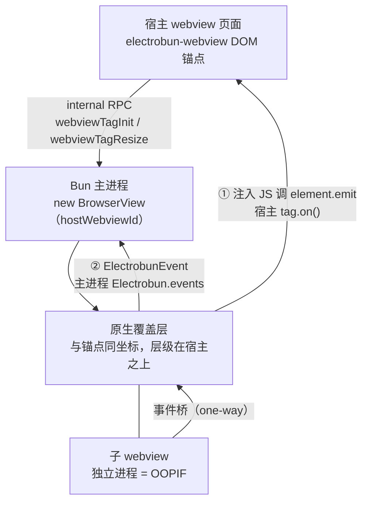

import { Canvas, Controls, Meta } from '@storybook/addon-docs/blocks';
import * as WebviewTag from './webview-tag.stories';

<Meta of={WebviewTag} name="Docs" />

# webview 标签

`<electrobun-webview>` 是 Electrobun 提供的自定义元素：写在视图 HTML 里的标签只是一个普通 DOM「锚点」，Electrobun 在同一坐标、宿主内容之上叠一层真正隔离的原生 webview——每个标签一个独立进程，即 OOPIF（out-of-process iframe）。元素由可信 webview 的内置 preload 自动注册，页面不需要引入任何脚本。本课讲清四件事：锚点与覆盖层如何嵌合并保持同步、元素公开的属性与方法、子 webview 事件如何同时回流到宿主页面与主进程、以及 sandbox、平台与 DOM 生命周期带来的使用限制。跑完课程内的观察台工程后，你能预测一次导航、一条消息、一次白名单拦截分别在哪里打出日志。



回查时先看这组关键事实（属性与默认值均与 1.18.1 包内 `preload/webviewTag.ts`、`proc/native.ts` 核对过）：

| 属性 | 取值 | 作用与要点 |
| --- | --- | --- |
| `src` | string | 初始 URL；创建后修改属性或 property 会触发重新加载 |
| `html` | string | 直接内嵌 HTML；与 `src` 同时出现时 `html` 优先 |
| `preload` | string | 子 webview 的用户 preload；支持 `views://`、远程 URL 或内联 JS |
| `partition` | string | 会话分区；`persist:` 前缀才持久化；仅创建时读取 |
| `renderer` | `native` / `cef` | 缺省按 `native`（系统 webview）；`cef` 需构建捆绑 CEF |
| `sandbox` | 布尔属性 | 子 webview 断开 RPC，仅保留事件与导航控制；仅创建时读取 |
| `transparent` | 布尔属性 | 创建即透明，避免先渲染后置透明的闪白 |
| `passthrough` | 布尔属性 | 创建即鼠标穿透（对应 JS 属性 `passthroughEnabled`） |
| `masks` | string | 逗号分隔的 CSS 选择器，让宿主元素在覆盖层上打孔 |

两个容易意外的默认行为：`src` 与 `html` 都不写时，子 webview 默认加载 `https://electrobun.dev`（依赖网络）；元素默认样式是 `display: block; width: 800px; height: 300px;` 白底，注入在 `head` 最前，页面样式可以直接覆盖。

## 快速上手

课程目录的 `webview-tag-observer/` 是完整可运行工程（macOS + Bun，electrobun 1.18.1）：宿主页面里嵌两个标签——外站（`sandbox` + 导航白名单）与本地 `views://` 子页（`preload` 转发 `host-message`）——事件同时打进页面日志面板与启动终端：

```bash
cd cheatsheets/webview-tag/webview-tag-observer
bun install
bun start
```

窗口弹出后按清单操作，逐条核对两处日志：

| 操作 | 可观察证据 |
| --- | --- |
| 启动完成 | 两个标签分别加载 electrobun.dev 与本地子页；终端打出 `[bun:dom-ready]`，面板出现 `[remote] dom-ready`、`[child] dom-ready`（detail 是 URL 字符串） |
| 点子页「向宿主发消息」按钮 | 面板 `[child] host-message {from:"childview",...}`（对象），终端同步打出 `[bun:host-message]`——同一事件到达两端 |
| 点外站里指向其他域的链接 | 页面不跳转（白名单拦截），面板无 `did-navigate` |
| 在外站内做站内跳转 | 面板 `[remote] did-navigate` 带新 URL |
| `goBack` / `goForward` / `reload` | 面板出现对应 `did-navigate`；无历史时按钮无效果 |
| `toggleTransparent` / `togglePassthrough` | 前者外站内容消失、宿主底色露出；后者标签区域不再响应网页鼠标 |

## 嵌合机制

### 锚点与覆盖层

标签被加进 DOM 后（`connectedCallback`，延迟一帧等布局稳定），元素读取自己的 `getBoundingClientRect()` 与全部属性，经内部 RPC 请求 `webviewTagInit`；主进程据此 `new BrowserView({ hostWebviewId, autoResize: false, ... })` 创建一个真实的视图，原生层把它作为覆盖层摆到锚点正上方。返回的 `webviewId` 会写回元素：`element.id` 变成 `electrobun-webview-<webviewId>`，并登记进页面级注册表——主进程回投事件时就靠这个 id 用 `document.querySelector` 找回元素。

理解嵌合关系的三个要点：

- **不是 iframe。** 子内容运行在独立进程里，与宿主不同源、不同进程；宿主元素只决定它的位置与大小。跨进程通信只有两条受控通道：事件回流（见下方「事件」小节）与子 webview 自己的 RPC（见 [Electroview](?path=/docs/electroview--docs)）。
- **注册是自动的。** 可信 webview 的内置 preload 会 `customElements.define("electrobun-webview", ...)`；沙箱 webview 的精简 preload 刻意不注册——沙箱内容不能再嵌 OOPIF。
- **离开 DOM 即销毁。** 元素从 DOM 移除时（`disconnectedCallback`）发送 `webviewTagRemove`，子 webview 与其进程随之销毁；重新插回 DOM 是一次全新初始化。

### 尺寸同步

覆盖层不会自动贴着锚点——标签用 `OverlaySyncController` 主动同步：`ResizeObserver` 盯尺寸变化，一个 `setTimeout` 轮询循环盯位置。节奏是两级：静止时每 100ms 查一次 `getBoundingClientRect()`；一旦发现变化，随后 50ms 内升级为每 10ms 一次的突发节奏。矩形为 0×0（如 `display: none`）或与上次相同时不发送；有变化才发 `webviewTagResize`，携带新 frame 与当前遮罩矩形。另外，新标签初始化完成后会强制页面里所有其他标签立即重同步一次——新元素可能挤动了兄弟节点的布局。

两个直接推论：对标签做 CSS 过渡或拖拽时，覆盖层以最高 10ms 的粒度跟随，快速动画下能察觉一帧级滞后；布局代码改完想立即对齐时，手动调 `tag.syncDimensions(true)` 强制一次同步。

## 属性

`observedAttributes` 只有 `src` 与 `html`——它们是仅有的两个「活的」属性。其余属性都只在初始化时读一次，创建后修改属性没有任何效果。

### src 与 html

```html
<electrobun-webview src="https://electrobun.dev" sandbox></electrobun-webview>
<electrobun-webview html="<p>内嵌内容</p>"></electrobun-webview>
```

三种写法等价地触发加载：改 `src` 属性、设 `tag.src = url`（property setter 落到同一属性）、调 `tag.loadURL(url)`。`html` 与 `src` 同时存在时 `html` 优先（创建路径与 `BrowserView` 一致：有 `html` 就忽略 `url`）；两者都不写才是上表的 `https://electrobun.dev` 默认值。页面内容是动态生成时用 `html`/`loadHTML`，省一次网络请求。

### preload、partition 与 renderer

- `preload`：子 webview 的用户脚本，在 HTML 解析后、页面脚本之前注入，导航后重新注入。路径格式沿用 [BrowserView](?path=/docs/browser-view--docs)：`views://` 打包路径、远程 URL 或内联 JS 字符串。注意它与 Electrobun 内置 preload 的关系——内置脚本（注册标签、RPC、加密）对所有可信 webview 自动注入，`preload` 属性是叠加在其上的用户层。
- `partition`：子 webview 的会话分区名。裸名字是内存态（应用重启即失），`persist:` 前缀才落盘；同分区共享 Cookie 与存储。语义细节见[会话与存储](?path=/docs/session-storage--docs)。
- `renderer`：缺省按 `native` 处理（macOS WKWebView / Windows WebView2 / Linux webkit）。要用 CEF 后端时设 `cef`，并要求构建配置捆绑 CEF（`bundleCEF`），取舍见[跨平台与兼容性](?path=/docs/cross-platform--docs)。

## 方法

回查表（签名与 1.18.1 包内 `WebviewTagElement` 类型核对）：

| 方法 | 返回 | 作用 |
| --- | --- | --- |
| `loadURL(url)` / `loadHTML(html)` | void | 加载 URL / 内嵌 HTML（等同改 `src` / `html`） |
| `reload()` / `goBack()` / `goForward()` | void | 导航控制 |
| `canGoBack()` / `canGoForward()` | `Promise<boolean>` | 查询导航历史（仅有的两个异步方法） |
| `setNavigationRules(rules)` | void | 导航白/黑名单，见下节 |
| `executeJavascript(js)` | void | 在子 webview 里执行 JS，**无返回值** |
| `findInPage(text, { forward, matchCase })` / `stopFindInPage()` | void | 页内查找；`forward` 缺省 `true`，`matchCase` 缺省 `false` |
| `openDevTools()` / `closeDevTools()` / `toggleDevTools()` | void | 子 webview 的开发者工具 |
| `syncDimensions(force)` | void | 强制立即同步覆盖层；`force` 缺省 `false` |
| `toggleTransparent(v?)` / `togglePassthrough(v?)` / `toggleHidden(v?)` | void | 可见性与交互开关；无参调用取反当前值 |
| `addMaskSelector(s)` / `removeMaskSelector(s)` | void | 运行时增删打孔选择器，立即强制同步 |

两个横切事实：**所有方法都有初始化守卫**——`webviewId` 尚未就位（初始化 RPC 未返回）时调用会被静默忽略，需要在创建后立即生效的操作挂到 `dom-ready` 事件里；`executeJavascript` 是单向的 fire-and-forget，要拿返回值就在子 webview 里走 RPC（见 [RPC](?path=/docs/rpc--docs)）。

### setNavigationRules

把子 webview 能去哪里锁死在原生层，规则自上而下匹配、**最后命中的规则胜出**，没有规则命中时默认放行：

```ts
// 先全禁，再放行 electrobun.dev：效果是白名单
remoteTag.setNavigationRules(["^*", "*://electrobun.dev/*"]);

// 反过来是黑名单：全放行，再禁掉某个域
tag.setNavigationRules(["*", "^*://tracker.example.com/*"]);
```

规则用 glob 风格通配（`*` 匹配任意字符），`^` 前缀表示阻断规则。判定在原生代码里同步完成，不回调 Bun；被拦截的导航不会发生，宿主端自然也收不到对应的 `did-navigate`——观察台里点外域链接「什么都不发生」就是这个机制。传空数组清空全部规则。

## 事件

子 webview 的事件沿两条通道同时分发：宿主页面（框架向宿主注入一段 JS，调用 `#electrobun-webview-<id>` 元素的 `emit`，触发你用 `tag.on` 注册的 handler）与主进程（同一个事件被转成 `ElectrobunEvent` 进入 `Electrobun.events` 总线）。事件总表如下——文档站只列出其中 6 个，完整清单依据 1.18.1 包内 `native.ts` 的事件映射与 preload 实现：

| 事件 | 触发时机 | 宿主 `event.detail` | 主进程 `event.data.detail` |
| --- | --- | --- | --- |
| `dom-ready` | 页面加载完成 | URL 字符串 | 同左 |
| `did-navigate` | 导航完成 | 新 URL 字符串 | 同左 |
| `did-navigate-in-page` | 页内导航（hash、`popstate`） | URL 字符串 | 同左 |
| `did-commit-navigation` | 导航已提交 | 字符串 | 同左 |
| `will-navigate` | 导航发生前 | 字符串 | 同左 |
| `new-window-open` | `window.open` / `target="_blank"` | 对象 `{ url, isCmdClick, ... }` | 同左 |
| `host-message` | 子 preload 调 `__electrobunSendToHost` | 对象（消息本体） | 同左 |
| `load-started` / `load-committed` / `load-finished` | 加载进度 | 字符串 | 同左 |
| `download-started` / `download-progress` / `download-completed` / `download-failed` | 下载生命周期 | **JSON 字符串，需自行 `JSON.parse`** | 已解析的对象 |

`detail` 的形态规则只有一句话：**宿主端除 `host-message` 与 `new-window-open` 是对象外，其余都是字符串**（导航系是 URL，下载系是 JSON 字符串）；主进程端下载系已被解析成对象。下面的示意在浏览器里复现「一次事件 → 两条通道 → detail 形态」的判定链；真实行为仍以观察台工程为准。

<Canvas of={WebviewTag.EventRouting} />
<Controls of={WebviewTag.EventRouting} />

| 读者操作 | 可观察证据 |
| --- | --- |
| 把「事件名」切到 `host-message` | 宿主端 detail 从 URL 字符串变成 `{ from: "child" }` 对象 |
| 关闭「宿主已用 tag.on 订阅」 | 宿主通道保留在序列中但标记跳过，事件不落地 |
| 把「子 webview id」改成 5 | 注入宿主的元素 id 与主进程视图级通道后缀同步变为 `-5` |
| 打开「sandbox」 | 底部结论变为 RPC 断开、两条事件通道不受影响 |
| 打开 Show code | 看到该 Canvas 实际执行的 `event-routing.ts`，判定逻辑集中在 `routingSteps()` |

### 宿主页面订阅：on 与 off

`on` / `off` / `emit` 是元素自带的小事件系统（不是 `addEventListener`）：

```ts
const tag = document.querySelector("electrobun-webview.remote") as WebviewTagElement;

const onNavigate = (event: CustomEvent) => {
  console.log("新地址", event.detail); // did-navigate 的 detail 是字符串
};
tag.on("did-navigate", onNavigate);
tag.off("did-navigate", onNavigate); // 取消订阅
```

handler 收到的是框架构造的 `CustomEvent`，载荷全在 `event.detail`。取消订阅必须用 `off` 传同一个函数引用——匿名函数无法摘除。

### 主进程订阅：Electrobun.events

同一个事件也会以 `ElectrobunEvent` 进入主进程总线，通道名沿用全局 + 视图级约定：`"did-navigate"` 收所有 webview（含标签子视图），`"did-navigate-<webviewId>"` 只收指定子视图。适合跨视图的统一策略：安全审计、导航日志、把子视图事件转发给应用其他模块：

```ts
Electrobun.events.on("did-navigate", (event) => {
  console.log(`webview 导航：${event.data.detail}`);
});
```

通道拼接规则的更多细节见[窗口事件](?path=/docs/window-events--docs)。

### 子页面向宿主发消息：host-message

子 webview 的用户 preload 里可以调 `window.__electrobunSendToHost(message)`，消息被 JSON 序列化后作为 `host-message` 事件的 detail 送到宿主与主进程（两端都收到）。官方文档约定它只在 preload 脚本里使用，页面脚本要发消息就经 preload 桥接——观察台的 `child-preload.js` 就是这个模式：

```js
// child-preload.js（经标签的 preload 属性注入子 webview）
window.addEventListener("to-host", (event) => {
  window.__electrobunSendToHost(event.detail); // → 宿主 tag.on("host-message")
});
```

宿主收到的是已解析的对象；对外来内容发来的消息先校验再用。反方向（宿主 → 子 webview）没有对应 API——推数据给子页面用 `executeJavascript` 或子页面自己的 RPC。

## 透明、穿透与遮罩

三个开关都同时作用于两层：DOM 锚点的样式与原生覆盖层本身。

- **透明**：`toggleTransparent()` 把锚点 `opacity` 置 0 并通知原生层透明。创建时想要透明用 `transparent` 属性——在首帧之前就生效，避免先渲染再置透明的闪白。
- **穿透**：`togglePassthrough()` 让鼠标/触摸事件穿过覆盖层落到宿主页面上（锚点 `pointer-events: none` + 原生层穿透）。属性名是 `passthrough`，JS 属性是 `passthroughEnabled`。
- **隐藏**：`toggleHidden()` 隐藏覆盖层但保留子 webview 进程与状态；这比移除 DOM 节点（销毁重建）便宜得多，临时显隐一律用它。

**遮罩（masks）** 解决「覆盖层挡住了宿主元素」的问题：把宿主元素的选择器交给标签，命中元素的矩形区域会在覆盖层上打孔，让那块区域的交互落回宿主。

```html
<!-- 初始：逗号分隔多个选择器 -->
<electrobun-webview src="..." masks=".toolbar, .fab-button"></electrobun-webview>
```

```ts
tag.addMaskSelector(".dropdown-panel"); // 运行时追加，立即强制同步
tag.removeMaskSelector(".dropdown-panel");
```

机制与边界：选择器在**每次尺寸同步时**重新 `querySelectorAll`，孔洞跟随宿主元素移动/缩放；一个选择器命中多个元素就打多个孔；孔洞只取元素的 bounding rect——`transform` 变形、圆角、半透明都不会反映；无效选择器被静默忽略。原生覆盖层与遮罩的平台限制见[跨平台与兼容性](?path=/docs/cross-platform--docs)：Linux 的透明 `BrowserWindow` 内穿透与打孔不可靠；Windows 的 WebView2 后端不支持，需 `bundleCEF` 改用 CEF。

## sandbox 与使用限制

`sandbox` 属性让子 webview 拿到的是精简 preload：**没有 RPC、没有加密 socket、没有拖拽区，也不能再嵌 webview 标签**；事件回流与导航控制（`loadURL`、`goBack`、`setNavigationRules` 都由宿主发起）不受影响。嵌任何不可信内容（远程 URL）都应该带上它，再配导航白名单与独立 `partition`。它是创建时属性，事后无法补加——只能在创建标签时就决定。

其余使用限制与成因：

- **宿主必须是可信 webview。** 标签由内置 preload 注册；远程页面、沙箱视图里没有这段注册代码，写标签只是一个未知的自定义元素。
- **DOM 生命周期即子 webview 生命周期。** 元素被移除就销毁；元素在 DOM 里换个位置（换父节点、列表重排）同样触发销毁重建——React/Vue 里条件渲染或重排后标签「闪一下白、状态全丢」就是这个机制。对策：用稳定的 key 避免节点复用错位，显隐用 `toggleHidden`，布局变化尽量靠 CSS 而不是移动节点。
- **每个标签一个独立进程。** 隔离是卖点也是成本：内存与启动延迟随标签数量线性增长，大量小嵌入场景（十几个小挂件）先评估再上。
- **标签是布局元素，不是动画元素。** 覆盖层跟随有 10ms 突发粒度；高频改 `src` 也是完整导航，不便宜。
- 嵌 GPU 表面不归这个标签管：兄弟元素 `<electrobun-wgpu>` 见 [WebGPU 与 3D 适配器](?path=/docs/webgpu--docs)；更深的进程模型与加密链路见[架构原理](?path=/docs/architecture--docs)。

## 最佳实践

- 嵌不可信内容三件套：`sandbox` 断 RPC、`setNavigationRules(["^*", "*://自家域/*"])` 锁导航、独立 `partition` 隔离存储；三者分别堵住 API、跳转、数据三条泄漏路径。
- 接收端按职责分：宿主页面 `tag.on` 做即时 UI 反馈；跨视图策略、审计日志、把事件汇给主进程逻辑用 `Electrobun.events` 全局订阅，靠视图级通道名或 `webviewId` 区分来源。
- 标签节点保持稳定：条件渲染换成 `toggleHidden`，避免框架重排移动节点；需要重新加载内容用 `loadURL` 而不是卸载重挂。
- `host-message` 的 detail 是任意 JSON：校验结构与字段类型后再使用，尤其当子页面加载的是半可信内容。

## 常见问题

- 什么都没配，标签里却打开了 electrobun.dev 官网。
  `src` 与 `html` 都缺省时的默认 URL 就是 `https://electrobun.dev`（包内 `webviewTagInit` 的兜底值）。这不是异常；要空白内容就显式给 `html`。
- `tag.on("did-navigate")` 里取 `event.detail.url` 是 `undefined`。
  1.18.1 的实现里导航系事件的 `detail` 就是 URL 字符串本身，不是 `{ url }` 对象；只有 `host-message` 与 `new-window-open` 是对象（文档站的 `e.detail.url` 写法与包内实现不一致，以实现为准）。
- TypeScript 里 `tag.on("will-navigate", ...)` 报事件名不在 `WebviewEventTypes`。
  `electrobun/view` 导出的 `WebviewEventTypes` 只收录 6 个事件（`did-navigate`、`did-navigate-in-page`、`did-commit-navigation`、`dom-ready`、`host-message`、`new-window-open`），而运行时实际分发 14 个。用类型断言或自行扩展声明，升级版本时再核对。
- React/Vue 里列表更新后标签白屏重载、滚动位置丢失。
  元素在 DOM 里被移动或卸载即销毁重建。给列表项稳定的 key、不用索引做 key，显隐改 `toggleHidden`，内容更新用 `loadURL`/`loadHTML` 而非重建节点。
- Windows 上 `masks` 与 `passthrough` 完全无效。
  WebView2 后端（`native` renderer）不支持窗口区域打孔与穿透；构建时 `bundleCEF: true` 改用 CEF 后端，标签设 `renderer="cef"`。
- 初始化后立刻调 `loadURL` / `setNavigationRules`，偶尔不生效。
  方法内部有初始化守卫，`webviewId` 未就位时静默忽略。把「创建后立即要做的事」挂进 `tag.on("dom-ready", ...)`。

## 总结回顾

摘要：

本课把 `<electrobun-webview>` 拆成两层来理解：DOM 里的是锚点，真正的子 webview 是主进程创建、原生层摆放的覆盖层（独立进程的 OOPIF），由 ResizeObserver + 轮询的同步控制器保持贴合（静止 100ms、变化期 10ms 突发）。属性里只有 `src` 与 `html` 是「活的」，其余都在创建时读一次；方法覆盖导航、查找、DevTools、可见性与遮罩，且全部有初始化守卫。子 webview 的 14 种事件经原生层同时回流到宿主页面（`tag.on`，`detail` 多为字符串、消息类为对象）与主进程（`Electrobun.events`，全局名 + `视图名-webviewId`）。使用上：不可信内容配 `sandbox` + 导航白名单 + `partition`；元素离开或移动 DOM 即销毁重建，显隐用 `toggleHidden`；透明、穿透与打孔在 Linux 透明窗口与 Windows WebView2 后端上有限制。

一句话：

> 标签只是锚点，真正的 webview 是钉在同一坐标的独立进程覆盖层：位置跟 DOM 走、事件回流两端收、节点一移就重建。

知识要点：

- 标签元素与子 webview 是什么关系？谁决定位置与大小，同步节奏是多少？
- `src` 与 `html` 都不写时子 webview 加载什么？
- 哪些属性创建后修改仍生效？`sandbox`、`partition`、`masks` 呢？
- `did-navigate` 与 `host-message` 到达宿主时 `event.detail` 分别是什么形态？下载事件在宿主端与主进程端差在哪？
- 同一个子 webview 事件如何同时到达主进程？两条通道名分别是什么？
- 元素从 DOM 移除或移动位置会发生什么？框架里如何避免误销毁？
- `sandbox` 断掉了子 webview 的什么能力，保留了什么？
- 初始化完成前调用方法会怎样？应挂到哪个事件？
- Windows 上 `masks` / `passthrough` 失效的出路是什么？

## 参考资料

- [Electrobun 文档：Webview Tag](https://framework.blackboard.sh/electrobun/apis/browser/electrobun-webview-tag/)
- [Electrobun 文档：Webview Tag Architecture](https://framework.blackboard.sh/electrobun/guides/architecture/webview-tag/)
- [Electrobun 文档：BrowserView（preload 路径格式、partition、setNavigationRules）](https://framework.blackboard.sh/electrobun/apis/browser-view/)
- electrobun 1.18.1 包内实现与类型（`dist/api/bun/preload/webviewTag.ts`、`dist/api/bun/preload/overlaySync.ts`、`dist/api/bun/preload/index.ts` 与 `index-sandboxed.ts`、`dist/api/bun/proc/native.ts` 的 `webviewTagInit` 与 `webviewEventHandler`、`dist/api/browser/webviewtag.ts`、`dist/api/bun/events/webviewEvents.ts`）：属性默认值、方法签名、事件清单与 detail 形态的最终依据。
