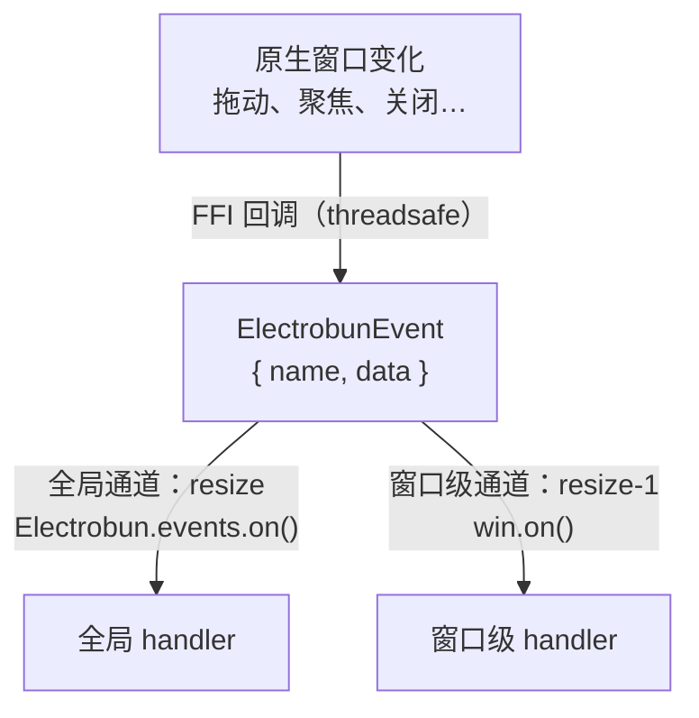

import { Canvas, Controls, Meta } from '@storybook/addon-docs/blocks';
import * as WindowEvents from './window-events.stories';

<Meta of={WindowEvents} name="Docs" />

# 窗口事件

窗口事件是主进程感知窗口变化的入口：用户拖动、聚焦、关闭窗口时，原生层把这些变化转成事件送进 Bun。本课讲清三件事——事件沿哪条通道到达你的 handler（全局与窗口级两条，顺序有规则）、7 个事件各自的载荷与触发时机、close 的特殊顺序如何决定清理代码放在哪。跑完课程内的观察台工程后，你能预测每种窗口操作会在终端打出哪几行日志。



回查时先看这组关键事实（事件名与载荷均与 1.18.1 包内 `windowEvents.ts` 核对过）：

| 事件 | `event.data` | 触发时机 |
| --- | --- | --- |
| `close` | `{ id }` | 窗口关闭时 |
| `resize` | `{ id, x, y, width, height }` | 窗口尺寸变化，拖动过程中连续触发 |
| `move` | `{ id, x, y }` | 窗口位置变化，拖动过程中连续触发 |
| `focus` | `{ id }` | 窗口成为 key window（获得焦点） |
| `blur` | `{ id }` | 窗口失去 key window 状态 |
| `keyDown` | `{ id, keyCode, modifiers, isRepeat }` | 按键按下（窗口级） |
| `keyUp` | `{ id, keyCode, modifiers, isRepeat }` | 按键释放 |

前五个事件见官方 BrowserWindow 文档；`keyDown` / `keyUp` 文档站未单列，依据是包内类型定义与原生回调注册（见该节说明）。另有两条订阅入口：`win.on(name, handler)` 按窗口订阅、`Electrobun.events.on(name, handler)` 全局订阅；`runtime.exitOnLastWindowClosed` 默认 `true`，最后一个窗口关闭即退出应用。

## 快速上手

课程目录的 `window-events-observer/` 是完整可运行工程（macOS + Bun，electrobun 1.18.1），创建窗口并订阅全部 7 个事件，把每次事件的 `event.data` 打到终端：

```bash
cd cheatsheets/window-events/window-events-observer
bun install
bun start
```

窗口弹出后按清单操作，逐条核对终端输出：

| 操作 | 可观察证据 |
| --- | --- |
| 启动完成 | 终端打出 `观察台已启动（窗口 id = 1）` |
| 拖窗口右下角改大小 | 连续多行 `[resize]`，`width`/`height` 变化，`x`/`y` 不变 |
| 拖标题栏移动窗口 | 连续多行 `[move]`，`x`/`y` 变化 |
| 点进别的应用再点回来 | 先 `[blur]`；回来时 `[global:focus]` 在 `[focus]` 之前 |
| 在窗口里按几个键 | `[keyDown]` / `[keyUp]` 行，`keyCode` 为数值（该组事件文档未单列，行为以实测为准） |
| 点窗口关闭按钮 | 打出 `[close]` 后应用退出 |

## 分发机制

每个窗口事件都是一个 `ElectrobunEvent` 实例：`name` 是事件名、`data` 是上表的载荷，另有 `response` / `responseWasSet` / `clearResponse()` 三个响应字段。窗口事件不使用响应机制——它的响应类型是空对象，原生回调也不等待回复；「可回复」的事件（webview 的 `will-navigate`、app 级的 `before-quit`）属于另外两课的机制。

一次事件沿两条通道分发：

- **全局通道**：事件名本身（如 `resize`）。`Electrobun.events.on("resize", handler)` 注册在这里。
- **窗口级通道**：事件名拼上窗口 id（如 `resize-1`）。`win.on("resize", handler)` 注册在这里，`win.id` 即拼接来源。

执行顺序是本课最容易踩错的点：**除 `close` 外，全局 handler 先执行、窗口级 handler 后执行**；**`close` 相反**——窗口级先、全局后。反转是刻意的：框架在全局 `close` 通道上注册了内置处理（清理窗口表、移除关联视图，然后按 `exitOnLastWindowClosed` 决定是否退出），源码注释写明让用户的窗口级 handler 先于它运行，你的清理代码才有机会在退出判定前执行。

事件到达时机也值得知道：原生侧通过 FFI 的 threadsafe 回调把事件送进 Bun 的事件循环，因此 handler 总是在当前同步代码执行完后运行；**订阅之前发生的事件不会补发**。

下面的示意在浏览器里复现「一次事件 → 两条通道 → 执行顺序」的判定链；真实窗口行为仍以观察台工程为准。

<Canvas of={WindowEvents.EventDispatch} />
<Controls of={WindowEvents.EventDispatch} />

| 读者操作 | 可观察证据 |
| --- | --- |
| 把「事件名」切到 `close` | 分发顺序反转为 窗口级 → 全局，序列末尾多出内置清理与退出判定步骤 |
| 关闭「已用 win.on 订阅」 | 窗口级通道（如 `resize-1`）的 handler 变灰跳过，序列保留位置 |
| 把「窗口 id」改成 2 | 窗口级通道名后缀同步变为 `resize-2`，`event.data.id` 跟随 |
| 打开 Show code | 看到该 Canvas 实际执行的 `event-dispatch.ts`，判定逻辑集中在 `dispatchSteps()` |

边界：webview 的事件（`will-navigate`、`dom-ready` 等，注意是连字符命名）走同一个 emitter 但挂在视图上，见 [BrowserView](?path=/docs/browser-view--docs)；app 级事件（`before-quit`、`open-url` 等）见[应用生命周期](?path=/docs/app-lifecycle--docs)；GPU 窗口（`GpuWindow`）提供同名 `on()`，通道规则相同，见 [WebGPU 与 3D 适配器](?path=/docs/webgpu--docs)。

## 订阅方式

### 按窗口订阅：win.on

`win.on(name, handler)` 只收当前窗口的事件，是单窗口应用的主入口：

```ts
const win = new BrowserWindow({ title: "主窗口", html: "<p>hello</p>" });

// handler 参数在 1.18.1 里类型是 unknown，实际收到 ElectrobunEvent，取 .data
win.on("resize", (event) => {
	const { width, height } = (event as { data: { width: number; height: number } }).data;
	console.log(`窗口新尺寸 ${width}x${height}`);
});
```

两个使用事实：`on` 是 1.18.1 里 `BrowserWindow` 唯一的事件方法（没有 `off`、`once`，源码留有 todo）；订阅时机上，关心窗口显示初期的首个 `focus` / `resize` 时，把 `win.on` 放在 `new BrowserWindow()` 之后的同一个同步代码块里，晚于这个块再订阅就可能错过最早的事件。

### 全局订阅：Electrobun.events.on

`Electrobun.events` 是默认导出上的共享 emitter（Node `EventEmitter` 子类）。全局订阅收到**所有窗口**的事件，用 `event.data.id` 区分来源，适合多窗口统一策略：

```ts
import Electrobun from "electrobun/bun";

Electrobun.events.on("focus", (event) => {
	const { id } = (event as { data: { id: number } }).data;
	console.log(`窗口 ${id} 聚焦`);
});
```

它也是取消订阅的唯一出口：`win.on` 内部就是把 handler 注册到窗口级通道名上，所以取消要经全局 emitter 按同一通道名摘除：

```ts
const handler = (event: unknown) => console.log(event);

win.on("move", handler);
// 1.18.1 没有 win.off；用通道名拼接规则到共享 emitter 上摘除
Electrobun.events.off(`move-${win.id}`, handler);
```

通道名拼接（`` `${name}-${id}` ``）目前是包内的实现约定（源码注释与 `win.on` 实现可证），依赖它时留意版本升级。

## 事件用法

各事件的 handler 通用形态一致：收 `event`、读 `event.data`、做一件事。观察台工程（见快速上手）把它们全部接上了终端日志，下面按事件展开用法与边界。

### close

`close` 在窗口关闭时触发，载荷只有 `{ id }`。它是 7 个事件里唯一顺序反转的，完整序列是：

1. 窗口级通道 `close-<id>`：你的 `win.on("close", handler)`。
2. 全局通道 `close`：你的 `Electrobun.events.on("close", ...)` 与框架内置处理都挂在这里——内置处理负责清理窗口表、移除窗口关联的 BrowserView 与 WGPUView。
3. 内置退出判定：所有窗口（含 GPU 窗口）都关闭后，按 `runtime.exitOnLastWindowClosed`（默认 `true`）决定是否退出应用。

因此**窗口级 handler 是放清理代码的位置**：释放与该窗口绑定的资源（子窗口、托盘临时态、订阅）都能赶在退出判定前执行。多窗口共享的资源放全局 `close` handler 里按 `event.data.id` 判断最后一个窗口。

`close` 不能被取消：handler 收到事件时窗口已在关闭路径上，`event.response` 对窗口事件无效。需要「退出前确认」（有未保存内容时拦下来）要用 app 级 `before-quit` 事件设置 `response = { allow: false }`，见[应用生命周期](?path=/docs/app-lifecycle--docs)；`exitOnLastWindowClosed` 的配置位置见[构建配置](?path=/docs/build-config--docs)。

### resize 与 move

`resize` 载荷带全量几何 `{ id, x, y, width, height }`——`x`/`y` 也在里面，因为拖窗口左上角会同时改变尺寸与位置；`move` 只带 `{ id, x, y }`。两者在拖动过程中**连续触发**，handler 里拿到的一次事件就是最新几何，不需要再调 `win.getFrame()` 查询（那是主动拉取当前值的另一个 API）。

最常见的用法是记住窗口几何、下次启动恢复。拖动期间逐次写盘没有意义，做去抖：

```ts
const dataOf = (event: unknown) =>
	(event as { data: { x: number; y: number; width: number; height: number } }).data;

let timer: ReturnType<typeof setTimeout> | undefined;

win.on("resize", (event) => {
	clearTimeout(timer);
	timer = setTimeout(() => {
		saveGeometry(dataOf(event)); // 持久化，下次启动作为 frame 传入
	}, 300);
});
```

另一个常见诉求是「窗口变了，里面的视图跟着变」：窗口自带的默认 webview 默认就跟随窗口尺寸（`BrowserView` 的 `autoResize` 默认 `true`），不需要手动处理；只有自己组合多视图布局时才在 `resize` 里手动排布，做法见 [BrowserView](?path=/docs/browser-view--docs)。

### focus 与 blur

`focus` 在窗口成为 key window 时触发，`blur` 在失去时触发，载荷都是 `{ id }`。两个典型用法：

```ts
// 用法一：窗口不在前台时暂停高频工作，回来再恢复
win.on("blur", () => pausePolling());
win.on("focus", () => resumePolling());

// 用法二：全局订阅 + data.id，多窗口时把焦点路由到对应窗口的快捷处理
Electrobun.events.on("focus", (event) => {
	const { id } = (event as { data: { id: number } }).data;
	refreshMenusFor(id);
});
```

官方文档特别提示 `focus` 适合做键盘快捷键的路由时机；系统级快捷键的注册与清理是另一套 API，见[全局快捷键](?path=/docs/global-shortcut--docs)。

### keyDown 与 keyUp

`keyDown` / `keyUp` 是窗口级键盘事件，载荷 `{ id, keyCode, modifiers, isRepeat }`：`keyCode` 是原生键码数值（不是字符），`modifiers` 是位掩码数值，`isRepeat` 标记按住不放的重复触发。这两个事件在文档站的 BrowserWindow 页未列出，依据是 1.18.1 包内 `windowEvents.ts` 的载荷定义与 `native.ts` 的原生回调注册；`modifiers` 各位的含义包内没有给出，用观察台实测取值。

分工建议：常规文本输入与页面内快捷键放在视图层用 DOM 键盘事件处理；窗口级 `keyDown` 适合无边框窗口的自定义全局手势这类「不依赖具体视图」的按键逻辑。无边框窗口的做法见[窗口选项](?path=/docs/window-options--docs)。

## 最佳实践

- 订阅范围按窗口数量选：单窗口应用的窗口逻辑直接 `win.on`；多窗口的统一策略（焦点路由、统一清理）用全局订阅加 `event.data.id` 分发，避免每个窗口重复注册同一份逻辑。
- 高频事件保持 handler 轻：`resize` / `move` 拖动期间每帧都可能触发，handler 里直接用 `event.data` 的几何值，不做查询与重活；持久化、重布局这类后续动作用去抖或节流隔开。
- 清理代码按资源归属分层：窗口绑定的资源放窗口级 `close` handler（先于退出判定执行），跨窗口共享的资源放全局 `close` handler 并按 `event.data.id` 判断是否最后一个窗口。

## 常见问题

- 想拦截窗口关闭（类似 Electron 里的 `preventDefault`）。
  窗口 `close` 事件只通知不拦截：handler 收到事件时窗口已在关闭路径上，`event.response` 对窗口事件无效。要做「退出前确认 / 未保存提示」，订阅 app 级 `before-quit` 并设 `event.response = { allow: false }` 取消退出，见[应用生命周期](?path=/docs/app-lifecycle--docs)。
- 窗口刚创建时的首个 `focus`（或 `resize`）没有收到。
  事件只发给当下已注册的 handler，订阅之前发生的事件不会补发。把 `win.on` 放在 `new BrowserWindow()` 之后的同一个同步代码块里，不要等异步回调（如 RPC 往返）之后再订阅。
- `win.on` 订阅后想取消，找不到 `win.off`。
  1.18.1 的 `BrowserWindow` 只有 `on`。`win.on` 内部注册在共享 emitter 的窗口级通道名上，取消用 `Electrobun.events.off` 按同一通道名摘除，例如 `move` 事件、窗口 id 为 1 时摘除 `move-1`；这是实现约定，升级版本时留意。
- 订阅了 `keyDown`，但 `keyCode` / `modifiers` 的数值看不懂。
  `keyCode` 是原生键码数值、`modifiers` 是位掩码，包内没有提供键名解码表；用观察台工程按键实测取值即可建立映射。常规键盘输入处理优先放视图层的 DOM 键盘事件。

## 总结回顾

摘要：

本课从分发机制讲起：窗口事件由原生回调转成 `ElectrobunEvent`，沿「全局通道（事件名）+ 窗口级通道（事件名-id）」两条通道进入主进程，除 `close` 外全局先执行、`close` 反转且末尾跟着框架内置的清理与 `exitOnLastWindowClosed` 退出判定。订阅入口是 `win.on`（按窗口）与 `Electrobun.events.on`（全局，靠 `event.data.id` 区分窗口，也是唯一的取消订阅出口）；订阅要紧跟窗口创建，错过不补发。7 个事件里，`resize` / `move` 拖动中连续触发且 `data` 自带最新几何，`focus` / `blur` 对应 key window 状态，`keyDown` / `keyUp` 是文档未列的窗口级键盘事件，`close` 不可取消、退出确认要靠 `before-quit`。

一句话：

> 窗口事件经全局与窗口级两条通道分发：`win.on` 只收本窗口，`Electrobun.events.on` 收全部并用 `event.data.id` 区分；`close` 窗口级先于全局，是清理代码的位置，但谁也拦不住关闭本身。

知识要点：

- 同一次 `resize`，全局 handler 和窗口级 handler 分别注册在哪条通道上？谁先执行？
- `close` 的分发顺序为什么与其他事件相反？这个顺序给清理代码留出了什么？
- 7 个事件各自的 `event.data` 载荷是什么？
- 关心窗口创建初期的首个 `focus`，订阅应该放在哪里？
- `win.on` 之后想取消订阅，怎么做？
- 要在退出应用前弹「未保存」确认，用哪个事件、怎么取消退出？

## 参考资料

- [Electrobun 文档：BrowserWindow API](https://framework.blackboard.sh/electrobun/apis/browser-window/)
- [Electrobun 文档：Events API](https://framework.blackboard.sh/electrobun/apis/events/)
- electrobun 1.18.1 包内类型定义（`dist/api/bun/events/windowEvents.ts`、`dist/api/bun/events/eventEmitter.ts`、`dist/api/bun/events/event.ts`、`dist/api/bun/core/BrowserWindow.ts`、`dist/api/bun/proc/native.ts` 的窗口回调注册）：事件清单、载荷、通道命名与分发顺序的最终依据。
