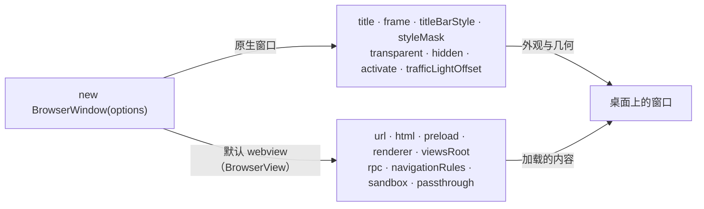

import { Canvas, Controls, Meta } from '@storybook/addon-docs/blocks';
import * as WindowOptions from './window-options.stories';

<Meta of={WindowOptions} name="Docs" />

# 窗口选项

[第一个窗口](?path=/docs/first-window--docs)已经用 `title`、`url`、`frame` 开出过一个窗口；本课把 `new BrowserWindow(options)` 的构造选项一次讲全。先建立一个总模型：**选项对象在构造时分成两路**——一路决定原生窗口本身（几何、标题栏、透明、显隐），一路转发给窗口创建时自动铺满的默认 webview（加载什么内容、在什么隔离级别运行）。在此基础上深入三组高频选项：尺寸与位置、标题栏样式、透明与后台窗口。学完能按需求直接拼出选项对象，也能在运行时改窗口几何、查当前默认值。



构造选项全部可省略，缺省行为见下表（均与 1.18.1 包内类型定义 `WindowOptionsType` 核对过）：

| 选项 | 默认值 | 回查要点 |
| --- | --- | --- |
| `title` | 不传该字段时实际是 `"New Window"` | 只有完全不传参才是 `"Electrobun"`；总是显式传 |
| `frame` | `800×600`，位于 `(0, 0)` | 四分量按分量合并，可只传 `width/height` |
| `url` / `html` | `null` | 二选一；三种给法见[第一个窗口](?path=/docs/first-window--docs) |
| `preload` | `null` | html 解析后、页面脚本前执行；内联 JS 或 URL |
| `viewsRoot` | `null` | 未文档化的资源根覆盖，保持默认即可 |
| `renderer` | 取构建配置 `defaultRenderer`，默认 `"native"` | `"cef"` 需 bundleCEF，见[跨平台与兼容性](?path=/docs/cross-platform--docs) |
| `titleBarStyle` | `"default"` | 三值与 styleMask 自动配置见「标题栏样式」 |
| `transparent` | `false` | 需配合页面 CSS 透明背景才生效 |
| `passthrough` | `false` | 透明区域鼠标穿透，随默认 webview 传入 |
| `hidden` | `false` | `true` 时创建后不显示，之后 `show()` |
| `activate` | `true` | 创建即显示并抢焦点；面板类窗口设 `false` |
| `trafficLightOffset` | `{ x: 0, y: 0 }` | 仅 macOS 且 `hiddenInset` 时生效 |
| `navigationRules` | `null` | 导航允许/阻止规则的 JSON 字符串 |
| `sandbox` | `false` | `true` 时禁 RPC 与嵌套 webview，用于不可信内容 |
| `rpc` | 不设 | 默认 webview 的 RPC 通道，见[自定义 RPC](?path=/docs/rpc--docs) |
| `styleMask` | 不传 | macOS 窗口 flag 覆盖；`titleBarStyle` 自动项优先 |

## 快速上手

复用 1.3 的 hello-world 工程（或任何 electrobun 工程），把 `src/bun/index.ts` 换成下面这份后 `bun start`：

```ts
import { BrowserWindow } from "electrobun/bun";

const win = new BrowserWindow({
	title: "窗口选项",
	url: "views://mainview/index.html",
	frame: { width: 640, height: 420, x: 200, y: 120 }, // 尺寸 + 位置一次给定
	titleBarStyle: "hiddenInset", // 透明标题栏，红绿灯悬浮在内容上
	trafficLightOffset: { x: 70, y: 16 }, // 红绿灯右移，给侧边栏腾位置（仅 macOS）
});

console.log("window id:", win.id, "frame:", win.getFrame());
```

预期结果，逐条可核对：

- 窗口 640×420 出现在 `(200, 120)`；标题栏透明，内容延伸到标题栏下面，红绿灯整体右移 70px。
- 终端打印 window id 与 `getFrame()` 读数。
- 把 `titleBarStyle` 改成 `"hidden"` 再跑：红绿灯和标题栏区域都没了——这是两类自定义外观的分界；改回缺省 `"default"` 则恢复原生标题栏。

## 默认值与合并

构造参数类型是 `Partial<WindowOptionsType>`，任何字段都可省略，缺省行为分三层：

1. **完全不传参**：`new BrowserWindow()` 用内置整套默认——标题 `"Electrobun"`、url `https://electrobun.dev`、`800×600`。基本只用于试验。
2. **传了对象、缺字段**：按字段兜底，兜底有两类语义（依 1.18.1 构造器实现）：
   - **falsy 兜底**（空串等于没传）：`title` 落到 `"New Window"`；`url`、`html`、`preload`、`viewsRoot`、`navigationRules` 落到 `null`；`renderer` 落到构建配置的 `defaultRenderer`。
   - **空值兜底**（只有 `null` / `undefined` 回退，`false` 是有效值）：`transparent`、`passthrough`、`hidden`、`sandbox` 落到 `false`；`activate` 落到 `true`；`trafficLightOffset` 的 `x` / `y` 各自落到 `0`。
3. **`frame` 按分量合并**：`{ ...默认800×600@(0,0), ...传入分量 }`。只传 `width/height` 时位置就是 `(0, 0)`，不是全有或全无。

判断句：字符串选项传空串等于没传，布尔选项传 `false` 会被尊重。这也是为什么 `title` 不写时看到的是 `"New Window"` 而不是 `"Electrobun"`——后者只属于完全不传参的调用。

## 尺寸与位置

`frame` 的四个分量一次给定初始几何：`width` / `height` 是窗口初始尺寸，`x` / `y` 是窗口左上角在屏幕上的位置（以屏幕左上角为原点）。窗口创建时会同时生成一个铺满窗口的默认 webview（初始 `frame` 为 `(0, 0, width, height)`），窗口尺寸变化时它自动跟随（`BrowserView` 的 `autoResize` 默认 `true`，多视图细节见 [BrowserView](?path=/docs/browser-view--docs)）。

窗口创建后，几何用这组方法读写：

| 方法 | 作用 | 要点 |
| --- | --- | --- |
| `setSize(width, height)` | 只改尺寸 | 保持左上角不动 |
| `setPosition(x, y)` | 只改位置 | 左上角坐标，屏幕左上角为原点 |
| `setFrame(x, y, width, height)` | 位置 + 尺寸一次设置 | 官方文档注明比分开调用更高效 |
| `getFrame()` | 读当前 `{ x, y, width, height }` | 从原生窗口读取，并刷新实例内部缓存 |
| `getPosition()` / `getSize()` | 只读位置 / 尺寸 | 内部走 `getFrame()` |

桌面范例 `window-geometry.ts`（课程目录）：作为主进程入口运行后，窗口按初始 `frame` 出现，随后每隔一秒依次执行 `setSize` → `setPosition` → `setFrame`，每步的 `getFrame()` 读数打印在终端，可与窗口实际位置核对。

跨多显示器定位需要先枚举屏幕边界，用 Screen API，见[屏幕与显示器](?path=/docs/screen--docs)。

## 标题栏样式

`titleBarStyle` 是跨平台选项（文档注明 macOS / Windows / Linux 都可用），三个取值对应三种窗口外观，同时自动配置底层 macOS 窗口 flag（`styleMask`）：

| 取值 | 外观 | 自动配置 | 适用 |
| --- | --- | --- | --- |
| `"default"` | 原生标题栏 + 系统控件（关闭 / 最小化 / 缩放） | 不改动 | 常规应用窗口 |
| `"hidden"` | 无标题栏、无原生控件 | `Titled: false`、`FullSizeContentView: true` | 完全自绘窗口外观 |
| `"hiddenInset"` | 透明标题栏：内容延伸到标题栏下，红绿灯悬浮在内容上（macOS） | `Titled: true`、`FullSizeContentView: true` | 自绘标题栏但保留系统红绿灯 |

两个配套点：

- `trafficLightOffset: { x, y }` 调整红绿灯位置，**仅 macOS 且 `titleBarStyle` 为 `"hiddenInset"` 时生效**，其他平台和其他样式下忽略。运行时移动红绿灯用 `setWindowButtonPosition(x, y)`（同样仅 macOS，其他平台为 no-op）。
- `"hidden"` / `"hiddenInset"` 都去掉了可见标题栏，窗口拖动和关闭按钮要页面自己实现——拖动用[拖拽区域](?path=/docs/draggable-regions--docs)。

下面的示意在浏览器里复现「`titleBarStyle` 取值 → 自动 styleMask → 窗口外观」的判定链；真实窗口外观以课程目录的桌面范例为准。

<Canvas of={WindowOptions.TitleBarStyleSchematic} />
<Controls of={WindowOptions.TitleBarStyleSchematic} />

| 读者操作 | 可观察证据 |
| --- | --- |
| 把 titleBarStyle 切到 `hidden` | 窗口示意里标题栏与红绿灯都消失，内容从顶部铺满；`Titled` 变为 `false` 并高亮 |
| 切到 `hiddenInset` | 内容延伸到标题栏下（虚线标出原标题栏位置），红绿灯悬浮在内容左上 |
| 在 `hiddenInset` 下拖动「红绿灯偏移 x」 | 示意里的红绿灯随偏移移动，`trafficLightOffset` 状态变为「生效（macOS）」 |
| 在 `default` 或 `hidden` 下拖动偏移 | 红绿灯位置不变，状态显示「忽略」 |
| 打开 Show code | 看到该 Canvas 实际执行的 `title-bar-style-schematic.ts` |

桌面范例 `title-bar-styles.ts`（课程目录）：作为主进程入口运行后并排开出三个窗口，分别对应三种取值；第三个窗口带 `trafficLightOffset: { x: 70, y: 16 }`，可直接观察红绿灯让位效果。

### styleMask

`styleMask` 是 macOS 原生窗口 flag 的直通覆盖，类型上是空对象（键名不做类型检查，拼错不报错）。不传时原生层用这套内置默认：

`Borderless: false`、`Titled: true`、`Closable: true`、`Miniaturizable: true`、`Resizable: true`、`UnifiedTitleAndToolbar: false`、`FullScreen: false`、`FullSizeContentView: false`、`UtilityWindow: false`、`DocModalWindow: false`、`NonactivatingPanel: false`、`HUDWindow: false`

合并顺序是三段：内置默认 → 传入的 `styleMask` → `titleBarStyle` 自动项。后写覆盖先写，所以 `Titled` 和 `FullSizeContentView` 最终由 `titleBarStyle` 决定——想手工改这两个 flag，必须同时去掉冲突的 `titleBarStyle`。

```ts
// 例：保留原生标题栏，但禁止用户拖拽改尺寸
new BrowserWindow({
	/* ... */
	styleMask: { Resizable: false },
});
```

什么时候用它：需要 `UtilityWindow`、`HUDWindow` 这类特殊窗体，或单独关掉某个能力（如上例的 `Resizable`）。只是想隐藏标题栏时，用 `titleBarStyle` 就够。

## 透明与穿透

两个选项配合做异形窗口、桌面悬浮组件：

- `transparent: true` 把窗口背景变为透明，全平台、native 与 cef 双渲染器都可用。**只设窗口选项不够**：页面本身不透明就挡住了，必须给 html/body 加 CSS 透明背景，再让需要可见的区域由页面内容画出。
- `passthrough: true` 让透明区域的鼠标事件穿透到下层（类型注释：mouse events pass through transparent regions），构造时作为 `startPassthrough` 随默认 webview 传入。适合纯展示型悬浮层；页面不透明的部分仍可接收交互。

```ts
new BrowserWindow({
	title: "悬浮层",
	url: "views://mainview/index.html",
	frame: { width: 320, height: 160, x: 600, y: 400 },
	transparent: true,
	passthrough: true, // 不需要点击的透明悬浮层
});
```

真实透明效果需要桌面运行观察（任何 electrobun 工程，主进程入口换成上面这份，并给页面加 `background: transparent`）。

## 后台与状态

两个选项决定窗口「以什么状态出场」：

- `hidden: true`：创建后不显示，之后用 `show()`（显示并抢焦点）或 `showInactive()`（显示但不抢焦点）让它登场。适合先创建、内容就绪后再展示的窗口。
- `activate: false`：创建即显示但不抢占焦点。文档注明它只影响「创建时的自动显示」，适合面板、托盘弹出窗口这类不该打断用户的场景；之后保持不抢焦点用 `showInactive()`。

其余窗口状态方法（平台差异依 1.18.1 类型与文档）：

| 方法 | 作用 / 要点 |
| --- | --- |
| `close()` | 关闭窗口；最后一个窗口关闭默认退出应用 |
| `show()` / `showInactive()` / `activate()` / `hide()` | 显示（抢焦点 / 不抢焦点）、激活已显示窗口、隐藏不关闭；`focus()` 是 `activate()` 的废弃别名 |
| `minimize()` / `unminimize()` / `isMinimized()` | 最小化与恢复 |
| `maximize()` / `unmaximize()` / `isMaximized()` | 最大化；macOS 上语义是 zoom（充满屏幕但保留菜单栏） |
| `setFullScreen(bool)` / `isFullScreen()` | 全屏切换 |
| `setAlwaysOnTop(bool)` / `isAlwaysOnTop()` | 窗口置顶 |
| `setVisibleOnAllWorkspaces(bool)` / `isVisibleOnAllWorkspaces()` | 所有工作区可见；macOS 完整支持，其他平台 no-op |
| `setPageZoom(zoom)` / `getPageZoom()` | 页面缩放，`1.0` 为 100%；仅默认 WebKit 渲染器生效，CEF 下 no-op 且恒返回 `1.0` |

窗口的 close、resize、move、focus、blur 等事件订阅见[窗口事件](?path=/docs/window-events--docs)。

## 内容与安全

这一组选项全部转发给默认 webview，决定它加载什么、在什么隔离级别运行。`url` / `html` 的三种给法（`views://` 本地内容、远程地址、内联 HTML 字符串）在[第一个窗口](?path=/docs/first-window--docs)已讲，这里不重复。

| 选项 | 默认 | 说明 |
| --- | --- | --- |
| `preload` | `null` | 在 html 解析后、页面其他脚本执行前运行；每次导航后页面脚本前也会再跑一次。传内联 JS 或 URL |
| `renderer` | 构建配置 `defaultRenderer`（默认 `"native"`） | `"native"` 用系统 webview（macOS 为 WebKit）；`"cef"` 需构建时 bundleCEF |
| `navigationRules` | `null` | 导航允许/阻止规则，见下 |
| `sandbox` | `false` | `true`：禁用 RPC 与嵌套 webview 标签，仅保留事件与导航控制——给不可信远程内容用 |
| `rpc` | 不设 | 默认 webview 的类型安全双向通道，见[自定义 RPC](?path=/docs/rpc--docs) |
| `viewsRoot` | `null` | 未在文档中说明的资源根覆盖，随默认 webview 原样传入原生层；保持默认 |

`navigationRules` 收「允许 / 阻止」的 glob 规则，构造选项传规则数组的 JSON 字符串（与 `BrowserView.setNavigationRules` 的内部存储一致），运行时用 `win.webview.setNavigationRules([...])` 传数组更顺手：

```ts
new BrowserWindow({
	/* ... */
	url: "https://example.com",
	// 允许 example.com 及其子域，阻止 tracker.dev；规则从上到下求值，最后匹配的生效，
	// 都不匹配时默认允许；由原生层同步判定，不需要回调主进程
	navigationRules: JSON.stringify(["*example.com", "^*tracker.dev"]),
});
```

关于会话分区：文档站把 `partition` 列在 BrowserWindow 页，但 1.18.1 包内 `WindowOptionsType` 没有该字段，构造时也不会转发给默认 webview——分区会话实际是 `BrowserView` 的选项，见[会话与存储](?path=/docs/session-storage--docs)。

## 最佳实践

- **自定义窗口外观的取值路径**：完全自绘选 `titleBarStyle: "hidden"`，标题栏、窗口控件和拖拽都由页面实现（拖拽见[拖拽区域](?path=/docs/draggable-regions--docs)）；想保留系统红绿灯选 `"hiddenInset"` 并用 `trafficLightOffset` 给内容让位；只有 macOS 特殊窗体（工具面板、HUD）才下沉到 `styleMask`。再叠 `transparent` 做异形窗口时，记得页面 CSS 同步改透明背景。
- **几何更新与读取**：同时改位置和尺寸用 `setFrame` 一次调用（比分开调用高效）；读当前几何一律 `getFrame()`——`getPosition()` / `getSize()` 内部也是它。
- **后台窗口的两种入场**：创建时就该不可见用 `hidden: true`，登场时机和方式完全由代码控制；创建时可见但不该打断用户用 `activate: false`（面板、托盘弹出窗）。

## 常见问题

- 传了选项对象、没写 `title`，窗口标题却是 "New Window"。
  构造器对 `title` 做 falsy 兜底，缺省值是 `"New Window"`；只有完全不传参的 `new BrowserWindow()` 才用内置 `"Electrobun"`。实践上总是显式传 `title`。
- `titleBarStyle: "hidden"` 后窗口拖不动、也没有关闭按钮。
  这正是 `hidden` 的语义：无标题栏、无原生控件。自绘标题栏并加拖拽区域（[拖拽区域](?path=/docs/draggable-regions--docs)），或改用 `"hiddenInset"` 保留红绿灯；隐藏窗口的退出可用 ⌘Q——最后一个窗口关闭默认退出应用。
- `transparent: true` 后窗口仍是白色。
  窗口选项只把原生背景变透明，页面不透明就全部挡住：给 html/body 加 CSS 透明背景，再逐块画出需要可见的内容。
- `trafficLightOffset` 传了值没有效果。
  它只在 macOS 且 `titleBarStyle` 为 `"hiddenInset"` 的组合下生效，其他平台、其他样式一律忽略；运行时调整红绿灯位置用 `setWindowButtonPosition`。
- 用户拖拽或缩放窗口后，代码里 `win.frame` 的值没变。
  实例上的 `frame` 是内部缓存，只有构造、`setSize` / `setPosition` / `setFrame` / `getFrame` 会更新它；用户手动改变窗口不会回写。要拿当前几何一律调 `getFrame()`。

## 总结回顾

摘要：

本课把 `new BrowserWindow(options)` 的选项拆成两路：原生窗口一路（`frame` 几何、`titleBarStyle` / `styleMask` / `trafficLightOffset` 外观、`transparent` / `passthrough` 透明穿透、`hidden` / `activate` 出场状态），默认 webview 一路（`url` / `html` / `preload` / `renderer` / `navigationRules` / `sandbox` / `rpc`）。缺省行为分三层兜底：完全不传参才有整套内置默认；字段级 falsy 兜底与空值兜底语义不同（字符串空串等于没传，布尔 `false` 有效）；`frame` 按分量合并。运行时几何用 `setSize` / `setPosition` / `setFrame` 改、`getFrame` 读；标题栏三种样式对应不同的 styleMask 自动配置，透明需要页面 CSS 配合。

一句话：

> BrowserWindow 的构造选项一半落在原生窗口（几何与外观），一半转发给默认 webview（内容与安全）；缺省按 falsy 兜底、空值兜底与 frame 分量合并三条规则生效——查默认值看开场表，改几何用 setFrame，读几何用 getFrame。

知识要点：

- 构造选项分成哪两路、各自包含哪些字段？
- 传了选项对象但缺 `title` / `url` / `renderer` 时，实际生效值各是什么？
- `frame` 只传 `width/height` 时，`x` / `y` 取什么值？
- 三种 `titleBarStyle` 各自的外观、自动配置的 styleMask 项与适用场景？
- `trafficLightOffset` 与 `setWindowButtonPosition` 在什么条件下生效？
- 运行时同时改位置和尺寸用哪个方法？为什么读当前几何不能直接用 `win.frame`？
- `transparent: true` 为什么还必须改页面 CSS？
- `hidden: true` 与 `activate: false` 分别对应什么后台窗口场景？
- `sandbox: true` 禁用了什么、留给什么内容用？
- `navigationRules` 的规则格式、求值顺序与默认行为是什么？
- `styleMask` 的合并顺序里，谁最终决定 `Titled` 与 `FullSizeContentView`？

## 参考资料

- [Electrobun 文档：BrowserWindow API](https://framework.blackboard.sh/electrobun/apis/browser-window/)
- [Electrobun 文档：BrowserView API](https://framework.blackboard.sh/electrobun/apis/browser-view/)（navigationRules 规则格式与 partition 归属的核对依据）
- electrobun 1.18.1 包内类型定义（`dist/api/bun/core/BrowserWindow.ts`、`dist/api/bun/core/BrowserView.ts`、`dist/api/bun/core/BuildConfig.ts`）：选项类型、默认值、合并语义与转发行为的最终依据。
