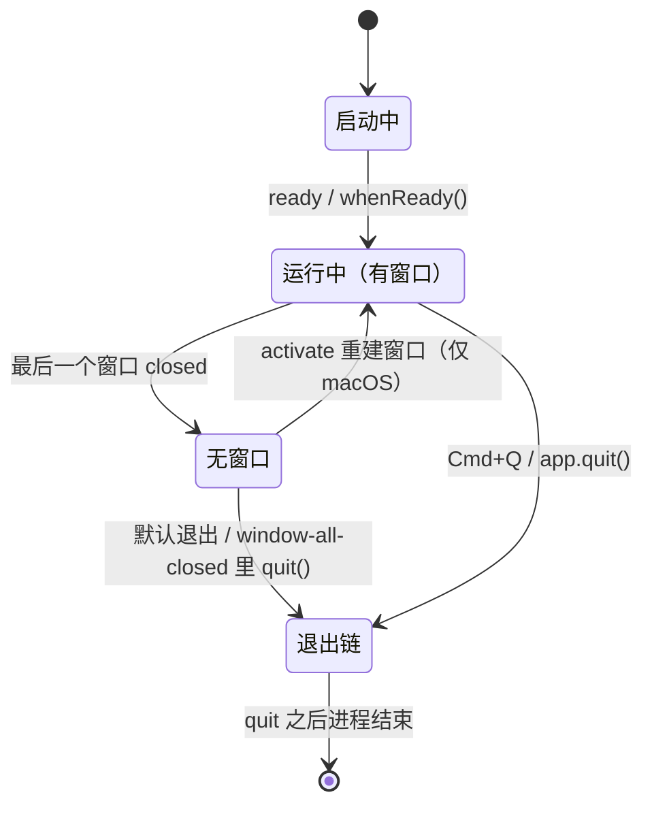

import { Canvas, Controls, Meta } from '@storybook/addon-docs/blocks';
import * as AppLifecycle from './app-lifecycle.stories';

<Meta of={AppLifecycle} name="Docs" />

# 应用生命周期

窗口的生命不等于应用的生命：把窗口全部关掉，进程可能还在跑——macOS 上 Forge 模板就是这样（「第一次运行」留下的问题，本课揭晓）；而按下 `Cmd+Q`，窗口还没关完，退出流程就已经开始了。指挥这一切的是主进程里的 `app` 模块，官方对它的定位只有一句话：控制应用的事件生命周期。本课拆开模板 `src/index.js` 里已有的生命周期骨架：`ready` 标志初始化完成、`window-all-closed` 决定窗口全关之后应用的去留、`activate` 处理 macOS 的再次激活；退出则是一条有顺序、有拦截点的事件链。读完你应能预测：关掉最后一个窗口后应用会不会退出、`Cmd+Q` 之后先触发哪个事件、"确认保存"该挂在哪里、模板为什么在 macOS 上关窗不退出。

边界先划清：窗口怎么创建、窗口级 `close` / `closed` 的细节、销毁后访问抛 `Object has been destroyed`，这些在[创建窗口](?path=/docs/windows--docs)已经讲过，本课只把 `close` 当作退出链路的一环提及；注册协议与单实例锁（`open-file` / `open-url` / `requestSingleInstanceLock`）属于深链主题，见[深链与单实例](?path=/docs/deep-links--docs)；关窗后常驻托盘的做法见[托盘](?path=/docs/tray--docs)。

应用的一生：



本课的事件与方法（完整语义与平台注解见正文与参考资料）：

| 事件 / 方法 | 触发时机与作用 | 关键点 |
| --- | --- | --- |
| `ready` / `whenReady()` | Electron 初始化完成，可以创建窗口 | 模块顶层代码先于它执行 |
| `window-all-closed` | 所有窗口关闭之后 | 不订阅默认退出；订阅后去留自定 |
| `activate`（仅 macOS） | 应用被激活：点 Dock 图标等 | 惯例：无窗口时重建窗口 |
| `before-quit` | 退出开始、窗口尚未关闭 | `preventDefault()` 取消整个退出 |
| `will-quit` | 窗口全关、即将退出 | 最后一道可取消的关口 |
| `quit` | 正在退出 | 收尾清理的落点，携带 `exitCode` |
| `app.quit()` | 请求退出：走完整链路 | 保证 `beforeunload` 执行，可被拦 |
| `app.exit()` | 立即退出 | 跳过上述全部事件 |

## 快速上手

沿用前面课程的项目，打开 `src/index.js`：Forge 模板里已经写好了生命周期骨架（`whenReady` 里的 `createWindow` 与 `activate`、`window-all-closed` 里的 darwin 判断）。给骨架补上日志，亲眼看一遍事件顺序，完整参考实现（含确认保存挂点）在本课目录的 `lifecycle.js`：

```js
const log = (name, detail = '') =>
  console.log(`[lifecycle] ${name}${detail ? `：${detail}` : ''}`);

app.whenReady().then(() => {
  log('ready', `isReady: ${app.isReady()}`);
  createWindow();

  app.on('activate', () => {
    if (BrowserWindow.getAllWindows().length === 0) createWindow();
  });
});

app.on('window-all-closed', () => {
  log('window-all-closed', `platform: ${process.platform}`);
  if (process.platform !== 'darwin') app.quit();
});

app.on('before-quit', () => log('before-quit'));
app.on('will-quit', () => log('will-quit'));
app.on('quit', (_event, exitCode) => log('quit', `exitCode: ${exitCode}`));
```

改完在运行 start 的终端输入 `rs` 重启（主进程改动），做三组观察：

1. **启动即见起点。** 终端出现 `ready`（日志是主进程的，落在终端）。把一句 `log` 写在模块顶层，它永远排在 `ready` 前面——分界线的原因见下一节。
2. **Windows/Linux 关窗即退。** 点窗口关闭按钮，终端依次出现 `window-all-closed → before-quit → will-quit → quit`，`npm start` 结束回到提示符，退出码 `0`。
3. **macOS 关窗不退、`Cmd+Q` 才退。** 关窗只出现 `window-all-closed`，应用常驻；点 Dock 图标出现 `activate`，窗口重建；按 `Cmd+Q` 则是 `before-quit → will-quit → quit`——注意这条路径里**没有 `window-all-closed`**。

第 3 组里两条路径的事件序差异是本课最重要的观察，「退出链路」一节解释它。

## ready：初始化完成

`app` 是主进程里的应用对象（`require('electron')` 解构出来）。应用不是"从某个函数开始跑"的——主进程常驻事件循环，一切行为由事件驱动，`ready` 是第一个关键节点：Electron 初始化完成，窗口和绝大多数 API 从这里开始可用。

官方注解了它的精确时机：**`ready` 在主进程跑完事件循环第一 tick 之后触发**。于是有一条简单的分界线——需要赶在一切之前做的事（比如抢先注册 `open-file` 这类启动期事件），同步写在模块顶层；需要初始化完成才能做的事（比如创建窗口），放进 `ready` / `whenReady`。

等待初始化有两种等价写法：

```js
app.on('ready', () => { createWindow(); }); // 事件写法
app.whenReady().then(() => { createWindow(); }); // Promise 写法（模板采用）
```

Promise 写法的实际优势是**不怕错过**：`ready` 是一次性事件，监听注册晚了就永远收不到；`whenReady()` 返回的 Promise 在初始化已完成时调用照样立刻 resolve。拿不准当前状态用 `app.isReady()` 查布尔值。官方还提供一个更早的 `will-finish-launching` 事件，但文档明说"大多数情况下，你应该在 ready 事件处理器里做所有事"——入门阶段记住 `whenReady` 就够。

可观察证据：快速上手第 1 组——模块顶层的 `log` 永远排在 `ready` 前；`whenReady` 回调里 `app.isReady()` 已经是 `true`。

## window-all-closed：窗口全关之后

触发时机一句话：**最后一个窗口 `closed` 之后**。它是"应用要不要继续活"的决策点，官方语义分两种情况：

- **不订阅**：所有窗口关闭后，默认退出应用。
- **订阅了**：默认行为交还给你——退不退、什么时候退，完全由 handler 决定。

跨平台惯例在模板里用 `process.platform` 区分（Node.js API，取值 `'darwin'` macOS、`'win32'` Windows、`'linux'` Linux）：

```js
app.on('window-all-closed', () => {
  if (process.platform !== 'darwin') {
    app.quit(); // Windows/Linux：关窗即退出
  }
  // darwin：什么都不做 = 应用无窗口常驻，等 activate 或 Cmd+Q
});
```

为什么 macOS 常驻是惯例：macOS 的应用模型是"应用常驻、窗口来去"，Dock 上的图标还在，点一下即可再开窗口；Windows/Linux 的模型是"窗口即应用"，最后一个窗口关了应用就该退。差异没有对错，但订阅后忘了写 `app.quit()`，Windows 上进程真的不会退——这是入门期最常见的"后台僵尸"，处理见常见问题。

可观察证据：Windows/Linux 上关窗后 `npm start` 进程结束；macOS 上关窗后终端仍停在运行中——「第一次运行」FAQ 里那句"正常行为"，正式解释就是这段代码。

边界：托盘类应用"关窗只是藏起来"是同一决策点的另一种选择，做法见[托盘](?path=/docs/tray--docs)。

## activate：macOS 再次激活

`activate` 只在 macOS 触发：应用被"激活"时——首次启动、运行中被再次拉起、点击 Dock 图标。回调带一个 `hasVisibleWindows` 布尔值，说明当前有没有可见窗口。

惯例处理只有一行判断：无窗口时重建。

```js
app.on('activate', () => {
  if (BrowserWindow.getAllWindows().length === 0) {
    createWindow();
  }
});
```

模板把这段注册在 `whenReady()` 回调里、紧跟首次 `createWindow()`——首次启动也会触发一次 `activate`，那时窗口已建好、`getAllWindows().length === 1`，判断条件保证不会重复创建。把 activate 和首次创建写在一起，正好覆盖"启动"与"再激活"两种来源。

Windows/Linux 上没有这个事件，也不需要：按惯例最后一个窗口关闭时进程已经退出，不存在"无窗口的应用"等激活；窗口还开着时点任务栏图标，由操作系统还原、聚焦窗口，不经过 app 事件。macOS 另有两个更细粒度的激活事件（`did-become-active` / `did-resign-active`，每次切换应用都触发），本课用不上，用到再查 app 文档（见参考资料）。

可观察证据：快速上手第 3 组——macOS 关窗后点 Dock 图标，终端出现 `activate`，新窗口弹出。

## 退出链路

退出不是瞬间动作：从"有人请求退出"到"进程结束"，中间隔着一条有顺序的事件链，链上有三道能拦下的关口。理解这条链，"确认保存""退出前清理"才知道挂在哪里。

### quit 的完整顺序

`app.quit()` 的官方语义按固定顺序走四步：

1. `before-quit`——退出开始，窗口尚未关闭；
2. 逐个关闭窗口——每个窗口走 `close` → `closed`（窗口级细节见[创建窗口](?path=/docs/windows--docs)）；
3. `will-quit`——窗口全部关完，即将退出；
4. `quit`——正在退出，回调携带 `exitCode`，随后进程结束。

`app.quit()` 保证各窗口的 `beforeunload` / `unload` 处理器得到执行；任一窗口在 `beforeunload` 里返回 `false`（或在 `close` 里 `preventDefault()`）都会取消整个退出。

两条到达退出的路径，事件序并不相同——这是本课最容易误判的一点：

| 到达方式 | 事件序 |
| --- | --- |
| 用户关掉最后一个窗口（已订阅 handler 的 win32 惯例） | `close` → `closed` → `window-all-closed` → `before-quit` → `will-quit` → `quit` |
| `Cmd+Q` / `app.quit()` | `before-quit` → `close` → `closed` → `will-quit` → `quit` |

差异来自官方文档对 `window-all-closed` 的一句明确说明：quit 触发时 Electron 关完窗口直接发 `will-quit`，**这条路径里 `window-all-closed` 不会触发**。所以"窗口全关"的正确观测点是关窗路径的 `window-all-closed` 或 quit 链路的 `will-quit`，不要假设两者总是一先一后出现。

沙盘把各条退出路径的事件流并排演示（真实 Electron 无法在浏览器运行，这是对官方文档事件顺序的模拟；真实环境的核对方式见快速上手的日志）：

<Canvas of={AppLifecycle.Lifecycle} />

<Controls of={AppLifecycle.Lifecycle} />

| 读者操作 | 可观察证据 |
| --- | --- |
| 「退出操作」保持「关闭最后一个窗口」，平台切到 macOS | 关窗后应用常驻，`activate` 把窗口重建回来 |
| 「退出操作」切到「Cmd+Q / app.quit()」 | 事件流从 `before-quit` 开始，没有 `window-all-closed` |
| 打开「拦截 close」再执行退出 | `close` 里的 `preventDefault()` 拦下关闭或退出，`will-quit` / `quit` 不再出现 |
| 「退出操作」切到「app.exit()」 | 一步退出，整条链路被绕过，拦截无效 |
| 打开 Show code | 看到该 Canvas 实际执行的 `lifecycle-sim.ts` |

### 拦截点与确认保存

链路上三道关口，粒度不同：

| 拦截点 | 粒度 | 取消方式 |
| --- | --- | --- |
| 窗口 `close` | 单个窗口的关闭 | `event.preventDefault()`（见[创建窗口](?path=/docs/windows--docs)） |
| `before-quit` | 整个应用退出 | `event.preventDefault()` |
| `will-quit` | 整个应用退出（最后一道） | `event.preventDefault()` |

应用级"确认保存"挂在 `before-quit`：

```js
let hasUnsavedChanges = false; // 由业务逻辑在编辑时维护

app.on('before-quit', (event) => {
  if (hasUnsavedChanges) {
    event.preventDefault(); // 先拦住退出，弹框问用户（dialog 见「文件与对话框」）
  }
});
```

`preventDefault()` 之后应用回到运行态，退不退由后续代码决定：用户确认后先清掉拦截标志再调 `app.quit()`；直接再调 `app.quit()` 会再次进入 `before-quit`、再次被拦（解法见常见问题）。清理类工作（保存设置、断开连接）挂在 `will-quit` 或 `quit`：`will-quit` 是取消前的最后机会，`quit` 触发后就是真正的退出，回调里的 `exitCode` 可用于区分正常与异常结束。

### app.exit()：硬退出

`app.exit(exitCode)` 与 `quit` 的差别一句话：**它绕过整条链路**——立即结束进程，所有窗口直接销毁、不询问用户，`before-quit` 与 `will-quit` 都不会触发。沙盘里开着「拦截 close」再切到 `app.exit()`，照样退出——这就是两者的分界。

常规退出不要用它：跳过链路等于跳过确认与清理，未保存内容直接丢失。它的位置是"必须无条件退出"的兜底场景。与之相关的还有 `app.relaunch()`：它只安排"下次启动"，自己不结束当前进程，要配合 `app.quit()` / `app.exit()` 才能完成重启（完整用法见[自动更新](?path=/docs/auto-update--docs)）。

## 平台差异对照

生命周期里所有跨平台差异集中在"退出"这一件事上，一张表收齐（Linux 惯例与 Windows 一致）：

| 行为 | macOS | Windows | Linux |
| --- | --- | --- | --- |
| 最后一个窗口关闭后 | 常驻（惯例不退出） | 退出（经 `window-all-closed` 惯例） | 退出（同 Windows） |
| 显式退出方式 | `Cmd+Q`（系统标准快捷键） | 应用菜单 Quit / 关窗即退 | 应用菜单 Quit / 视桌面环境 |
| `activate` 事件 | 有 | 无 | 无 |
| 系统关机 / 注销时 | 文档未标注 | `before-quit` / `will-quit` / `quit` 不触发 | 文档未标注 |

两行值得展开：

- **显式退出**三个平台都开箱即用：不设置任何菜单时，Electron 自动创建默认菜单（标准项 File / Edit / View / Window），其中 File 菜单自带 Quit 角色——macOS 的 `Cmd+Q` 就由应用菜单的 Quit 项提供快捷键。自定义菜单见[菜单](?path=/docs/menus--docs)。
- **关机注销**是官方注解：Windows 上因系统关机/重启/注销退出时，三个退出事件都不触发。不能指望它们抢救关键数据，重要状态应随改动及时落盘（持久化见[session 与存储](?path=/docs/session--docs)）。

`app` 对象还会转发一些进程与页面级事件（`web-contents-created`、`render-process-gone` 等），属于调试与稳定性主题，见[调试](?path=/docs/debugging--docs)；用到时查 app 文档（参考资料）。

## 最佳实践

- **三段式骨架每个项目都保留。** `whenReady` + `activate` + `window-all-closed`（darwin 判断）是官方模板与教程的标准骨架；当前只发布一个平台也保留——多平台化时不用回头补，平台差异由骨架消化。
- **退出清理挂 `will-quit` / `quit`，不挂 `window-all-closed`。** macOS 常驻时关窗不等于退出；quit 链路里 `window-all-closed` 又不触发。两个事实合起来：只有 `will-quit` / `quit` 保证"真退出时恰好执行一次"。
- **确认退出的挂点按粒度选。** 拦"某个窗口别关"挂窗口 `close`；拦"应用别退"挂 `before-quit`；`will-quit` 留给最后的校验。确认对话框本身是 `dialog` 模块的事，见[文件与对话框](?path=/docs/dialog-files--docs)。
- **常规退出不用 `app.exit()`。** 它绕过确认与清理，未保存内容直接丢失；只留给"必须无条件退出"的兜底场景。

## 常见问题

- 订阅了 `window-all-closed` 却不调用 `app.quit()`，Windows 上窗口关完后 `npm start` 不退出，进程挂在后台
  在非 darwin 分支补上 `app.quit()`；或者干脆不订阅这个事件，让默认行为退出。判断依据：官方语义是"订阅后去留由你决定"，空 handler 等于永远不退。
- macOS 上关掉最后一个窗口，应用"没退出"，以为出了 bug
  这是跨平台惯例而非缺陷：应用常驻等待 `activate`（点 Dock 图标即恢复窗口），要退出用 `Cmd+Q`。想改成"关窗即退"，把 `window-all-closed` 里的 darwin 判断删掉即可；托盘类常驻应用的正路见「托盘」。
- 确认对话框里点了"确认退出"，代码随后调用 `app.quit()`，应用却还是不退
  `before-quit` 的拦截条件还成立：这次 `quit` 会再次进入 `before-quit`、再次被 `preventDefault`。处理动作：确认后先把拦截标志清掉（如 `hasUnsavedChanges = false`）再调用 `app.quit()`。
- 监听了全套退出日志，`Cmd+Q` 退出时却看不到 `window-all-closed`
  不是事件丢了：quit 链路关完窗口直接走 `will-quit`，不经过 `window-all-closed`（官方文档语义），只有用户关窗的路径才触发它。要在"真的在退出"处做清理，挂 `will-quit` 或 `quit`。

## 总结回顾

摘要：

主进程里的 `app` 模块用一组事件接管应用全程：`ready`（或等价的 `whenReady()`）标志初始化完成，是创建窗口的起点，模块顶层代码先于它执行。`window-all-closed` 在最后一个窗口关闭后触发，不订阅时默认退出，订阅后去留完全由 handler 决定——macOS 惯例常驻、其余平台惯例 `app.quit()`。`activate` 仅 macOS，首次启动、再次拉起、点 Dock 图标时触发，惯例是无窗口时重建。退出是一条链：`app.quit()` 按 `before-quit` → 逐窗 `close` → `will-quit` → `quit` 的顺序走，`window-all-closed` 不在这条链上；窗口 `close`、`before-quit`、`will-quit` 三道关口都能拦下退出，是确认保存的挂点。`app.exit()` 绕过整条链路立即退出，只当兜底。平台差异集中在退出行为上，Windows 系统关机时三个退出事件不触发。

一句话：

> 窗口全关不等于应用结束：去留由 `window-all-closed` 决定，退出走 `before-quit` → 关窗 → `will-quit` → `quit` 的链路、每道关口都能拦，而 `app.exit()` 是绕过一切的硬退出。

知识要点：

- `ready` 何时触发？`whenReady()` 相比监听 `ready` 事件的优势是什么？
- `window-all-closed` 何时触发？不订阅与订阅后的行为分别是什么？
- macOS 与 Windows/Linux 对"窗口全关"的惯例差异，用哪行代码区分？
- `activate` 在什么平台、哪些动作下触发？惯例处理是什么？为什么和首次创建一起注册在 `whenReady()` 里？
- `app.quit()` 的完整事件顺序是什么？它与关窗路径的事件序差在哪一个事件？
- 退出链路上有哪三道拦截点？"确认保存"应该挂在哪里？确认后为什么不能直接再调 `app.quit()`？
- `app.quit()` 与 `app.exit()` 的差异是什么？哪类场景才用后者？
- Windows 系统关机或注销时，哪些事件不会触发？

## 参考资料

- [Electron 文档 — app](https://www.electronjs.org/docs/latest/api/app)
  本课 API 事实的主要来源：`window-all-closed` 的默认行为与 quit 链路中不触发的说明、`before-quit` / `will-quit` / `quit` 的触发时机与 Windows 关机注解、`activate` 仅 macOS、`app.quit()` 保证 `beforeunload` 执行、`app.exit()` 跳过事件、`app.relaunch()` 不自行退出、`whenReady()` / `isReady()` 语义。
- [Electron 教程 — Building your First App](https://github.com/electron/electron/blob/main/docs/tutorial/tutorial-2-first-app.md)
  `whenReady` + `activate` + `window-all-closed` 三段式骨架的官方出处（与 Forge 模板一致）。
- [Electron 文档 — Menu](https://www.electronjs.org/docs/latest/api/menu)
  默认菜单自动创建（未设置菜单时）及其标准项的出处，解释"应用菜单 Quit 开箱即用"。
- [Node.js 文档 — process.platform](https://nodejs.org/api/process.html#processplatform)
  `'darwin'` / `'win32'` / `'linux'` 取值的出处。
