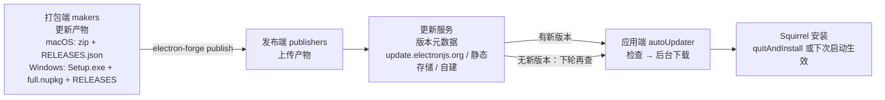

import { Meta } from '@storybook/addon-docs/blocks';

<Meta id="auto-update" title="打包与发布/自动更新" name="Docs" />

# 自动更新

自动更新解决一个问题：把"用户手里已安装的旧版本"变成"服务端的新版本"。Electron 把这件事拆成一条三方链路：**打包端**产出更新专用产物——macOS 的 zip 加更新清单、Windows 的 Squirrel 三件套；**发布端**用 Forge 的 publish 把产物上传到更新服务能读到的地方；**应用端**用内置的 `autoUpdater`（或它的封装 update-electron-app）完成检查与后台下载，安装与重启交给平台内置的 Squirrel 框架。链路前半段（产物与发布）出错时，应用端怎么改都没用——这决定了排查更新的基本顺序。

读完你应能预测：给「[打包](?path=/docs/packaging--docs)」一课的 vite-typescript 项目加上 publisher-github 与 update-electron-app 后，`electron-forge publish` 会把 `out/make/` 下的产物传到 GitHub Releases；已安装的应用启动即检查一次、之后每 10 分钟一次，发现新版本会后台下载并弹"重启"对话框；而开发模式下这条链路根本不会运行。



| 链路环节 | 承担者 | 关键入口 |
| --- | --- | --- |
| 产出更新产物 | 打包端 makers（[打包](?path=/docs/packaging--docs)一课的 make） | zip（macOS）；Setup.exe + full.nupkg + RELEASES（Windows） |
| 上传产物 | 发布端 publishers | `electron-forge publish` + `@electron-forge/publisher-*` |
| 提供版本元数据 | 更新服务 | update.electronjs.org / 静态存储 / 自建服务器 |
| 检查与下载 | 应用端 `autoUpdater` | `checkForUpdates()`，发现新版本自动下载 |
| 安装与重启 | 平台内置 Squirrel | `quitAndInstall()`，不处理时下次启动生效 |

## 快速上手

公开 GitHub 仓库的应用走最短链路：官方免费服务 update.electronjs.org + Forge 的 publisher-github。前置：macOS 构建已完成「[签名与公证](?path=/docs/code-signing--docs)」，`package.json` 的 `repository` 字段指向该仓库。

```bash
npm install --save update-electron-app
npm install --save-dev @electron-forge/publisher-github
```

主进程加三行（vite-typescript 模板的 `src/main.ts`，完整示例见本课 `main.ts`）：

```ts
import { updateElectronApp } from 'update-electron-app';

if (app.isPackaged) {
  updateElectronApp(); // 启动即检查一次，之后每 10 分钟一次；仓库地址取自 repository 字段
}
```

`forge.config` 的 `publishers` 数组加上 publisher-github（完整配置见本课 `forge.config.mts`），发布：

```bash
npx electron-forge publish   # 级联 make，把产物上传到 GitHub Releases
```

验证闭环只能在**打包安装后的应用**上进行：把 `package.json` 的 `version` 递增后重新 publish，再启动已安装的旧版本应用——它会自动发现新版本、后台下载、弹出重启对话框。开发模式（`forge start`）不在这条链路上，原因见常见问题。

## 更新链路

四个环节的分工是固定的：**检查与下载**由应用端 `autoUpdater` 完成（Electron 内置模块，运行在主进程）；**安装与重启**由平台内置的 Squirrel 框架完成——macOS 是 Squirrel.Mac，Windows 是 Squirrel.Windows，`autoUpdater` 就是它们在 Electron 里的封装；**元数据与产物**由链路前半段（打包与发布）决定。平台边界一句话：Linux 没有内置更新，deb/rpm 的升级交给发行版包管理器，`autoUpdater` 在 Linux 上不可用。

### autoUpdater：应用端执行者

不使用封装库时直接操作 `autoUpdater`，最小片段：

```ts
import { app, autoUpdater } from 'electron';

// feed 地址通常带上平台与版本，方便服务端按平台返回元数据、按版本判断新旧
autoUpdater.setFeedURL({
  url: `https://my-server.example.com/update/${process.platform}/${app.getVersion()}`,
});
autoUpdater.on('update-downloaded', () => {
  autoUpdater.quitAndInstall(); // 实际项目先弹窗询问用户，再决定立即装或下次启动生效
});
autoUpdater.checkForUpdates(); // 检查一次；发现新版本随即自动下载
```

事件速查：

| 事件 | 时机与用途 |
| --- | --- |
| `checking-for-update` | 检查开始 |
| `update-available` | 有新版本，随即自动开始下载 |
| `update-not-available` | 无新版本 |
| `update-downloaded` | 下载完成；参数含 `releaseName`（Windows 仅此一项）、`releaseNotes`、`releaseDate`；不监听它更新也会在下次启动生效 |
| `error` | 链路上任何失败；自建 feed 时必须监听兜底 |
| `before-quit-for-update` | 由 `quitAndInstall()` 触发的退出流程发出；与 `before-quit` 不同，它是更新退出中窗口关闭前唯一的钩子 |

方法与选项：

| 成员 | 说明 |
| --- | --- |
| `setFeedURL({ url, headers, serverType })` | 指向更新服务，`checkForUpdates` 前必须先调用；`headers` 与 `serverType`（`json` 或 `default`）仅 macOS；macOS 上只能在打包应用中调用 |
| `checkForUpdates()` | 检查一次；重复调用会重复下载 |
| `quitAndInstall()` | 关闭所有窗口、退出并安装；只在 `update-downloaded` 之后调用 |
| `getFeedURL()` | 读取当前 feed 地址 |

边界贴着平台走：macOS 上 Squirrel.Mac 要求**应用已签名**，未签名时检查静默失败（签名见「[签名与公证](?path=/docs/code-signing--docs)」）；Windows 上 `setFeedURL` 还支持 MSIX 场景的 `allowAnyVersion`（允许降级），Squirrel.Windows 的差异见下文专节。

## update.electronjs.org：公共更新服务

Electron 官方免费托管，为公开仓库的应用提供更新。使用条件四条，缺一不可：

- 应用跑在 macOS 或 Windows 上；
- 代码在公开 GitHub 仓库；
- 构建产物发布到 GitHub Releases；
- macOS 构建已签名。

服务端行为：读取仓库的 Releases，只把**非 draft、非 prerelease、tag 为合法 SemVer** 的版本当作可更新版本。应用端不直接操作 `autoUpdater`，用官方封装 update-electron-app：

```ts
import { updateElectronApp } from 'update-electron-app';

updateElectronApp({
  // updateInterval: '30 minutes',    // 默认 '10 minutes'，最小 5 分钟
  // logger: require('electron-log'), // 默认 console
  // notifyUser: true,                // 默认 true：下载完成后弹"现在重启 / 稍后"对话框
});
```

| 回查项 | 默认值 | 说明 |
| --- | --- | --- |
| 调用位置 | 主进程 | 无需等待 `ready` 事件 |
| 检查时机 | 启动即查一次 | 之后每 `updateInterval` 轮询 |
| `updateInterval` | `'10 minutes'` | ms 格式字符串，最小 5 分钟 |
| `notifyUser` | `true` | 下载完成后提示重启 |
| `logger` | `console` | 日志出口，可换 electron-log |
| 默认更新源 | update.electronjs.org | 仓库取自 `package.json` 的 `repository` 字段 |
| 停止轮询 | `stopUpdates()` | `updateElectronApp()` 的返回值 |

应用是私有项目、或想把产物留在自己的对象存储时，换**静态存储**源——按 `{platform}/{arch}` 目录放产物，应用端代码不变只换源：

```ts
import { updateElectronApp, UpdateSourceType } from 'update-electron-app';

updateElectronApp({
  updateSource: {
    type: UpdateSourceType.StaticStorage,
    baseUrl: `https://my-bucket.s3.amazonaws.com/my-app-updates/${process.platform}/${process.arch}`,
  },
});
```

目录约定 `/{platform}/{arch}/产物`：`darwin/arm64/` 下是 zip 与 `RELEASES.json` 清单，`win32/x64/` 下是三件套。产物怎么上去见下一节的 publisher-s3 与 manifest 配置。

## publish 与 publishers

`electron-forge publish` 级联执行 make（进而级联 package），把 `out/make/` 下的全部产物交给 `publishers` 数组上传。配置结构（完整带注释示例见本课 `forge.config.mts`）：

```ts
publishers: [
  {
    name: '@electron-forge/publisher-github',
    // platforms: ['darwin', 'win32'], // 默认发布所有平台的产物
    config: {
      repository: { owner: 'your-org', name: 'my-app' },
      prerelease: false,
    },
  },
],
```

publisher-github 的要点：

- 认证走 `GITHUB_TOKEN` 环境变量，token 需要对仓库的写权限；GitHub Actions 里该变量自动可用，但要给 workflow 授予 `permissions: contents: write`；
- 效果是创建 GitHub Release，并把 make 产物作为资产上传——这正好满足 update.electronjs.org 的输入条件，公开仓库应用发布即获得更新服务。

产物端要为"被更新链路消费"补两处配置（承接 8.1 的产物清单）：

- **macOS**：zip maker 配 `macUpdateManifestBaseUrl` 后，make 会生成（并在后续构建中把 `currentRelease` 递增到新版本）`RELEASES.json` 更新清单，应用端据此得知"有没有新版本、zip 在哪下载"。不配这个字段，zip 只是普通分发格式，不构成更新源。
- **Windows**：MakerSquirrel 的 `remoteReleases` 指向上一个版本产物所在的更新源时，make 会同时产出 `delta.nupkg` 增量包，用户端只下载变化部分；`noDelta: true` 关闭。

产物上传的位置就是应用端 feed 指向的位置——GitHub Releases 对应 update.electronjs.org，S3（publisher-s3 加上述 manifest）对应 StaticStorage，自建服务器对应裸 `autoUpdater.setFeedURL`。三组一一对应，接错就是"检查不到新版本"。Release 的 tag、草稿与发布自动化在「[发布流程](?path=/docs/release--docs)」一课展开。

## Windows 的 Squirrel 差异

Squirrel.Windows 的更新单元是 **nupkg 包**，行为与 macOS 不同，差异集中在四处：

- **产物三件套**（8.1 已列）：`Setup.exe` 主安装器、`-full.nupkg` 更新包、`RELEASES` 元数据。`RELEASES` 是文本清单，每行"SHA1 哈希 + nupkg 文件名 + 字节数"；生成过 delta 包时还包括 delta 行。
- **启动参数处理**：Squirrel 在安装、更新、卸载时会以 `--squirrel-install`、`--squirrel-updated`、`--squirrel-uninstall`、`--squirrel-obsolete` 等参数启动你的应用去执行安装动作，这类运行必须立即退出——vite-typescript 模板入口处的 `if (require('electron-squirrel-startup')) app.quit();` 就是干这个的，不要删。
- **首启动检查失败**：首次启动带 `--squirrel-firstrun` 参数且 Squirrel 持有文件锁，几秒内检查更新可能失败——见该参数跳过本轮检查，或延时约 10 秒再查。
- **任务栏标识**：安装器创建的快捷方式带 `com.squirrel.AppName.AppName` 形式的 AppUserModelId，代码里要传同一字符串给 `app.setAppUserModelId('com.squirrel.AppName.AppName')`，否则任务栏固定与跳转列表异常；应用名含空格时按 8.1 的命名建议（package.json `name` 连字符、maker `name` 驼峰、`productName` 显示名）。

边界一句：Electron 会自动识别 Windows 上的打包格式——应用以 MSIX 安装时改走系统更新器（支持 `.msix` 直链或 JSON feed，`allowAnyVersion` 允许降级）；Forge 主线产出的是 Squirrel 产物，MSIX 不在本手册展开。

## 自建更新服务器

不依赖 GitHub、或需要灰度发布、多渠道、鉴权时，自建服务有两种形态。

**静态存储（无服务器）。** 就是上一节的 StaticStorage：对象存储按 `{platform}/{arch}` 目录放产物与元数据，Forge 一侧由 zip maker 的 manifest 配置加 publisher-s3 上传覆盖 macOS，Squirrel 产物原样放进 `win32/x64/`。应用端零自建代码。

**动态服务器。** 一个按 `process.platform` 路由的端点，同一个 URL 服务两种客户端格式：

- **Windows 客户端**请求 feed 的 `/RELEASES` 子路径，返回 `RELEASES` 文本。版本比较由客户端完成，所以**没有更新也要返回 200 加现有 RELEASES**，404 会被当作失败；
- **macOS 客户端**期待 JSON：`url` 必填（zip 下载地址），`name`、`notes`、`pub_date` 可选；**没有更新返回 204 No Content**。

`url` 字段支持 `file://`，本地目录也能当更新源，适合手动验证 feed 行为。社区现成方案按需选用：Hazel（部署到 Vercel，读 GitHub Releases）、Nuts（读 GitHub Releases，支持私有仓库）、electron-release-server（自带管理面板，不依赖 GitHub）、Nucleus（多应用多渠道）。

另一条链路一句话对比：electron-builder 生态的 **electron-updater** 是与 Squirrel 无关的独立更新器——用 `latest.yml` / `latest-mac.yml` 这类清单加 blockmap 做差分下载，provider 指向 GitHub、S3 或通用 HTTP。它只该在打包端也是 electron-builder 时配套使用，两套工具的产物互不通用；本手册以 Forge 为主线不展开（入口见 `RESOURCES.md` 工具区）。

## 最佳实践

- **排查更新从链路前半段开始。** 顺序固定：`out/make/` 下产物齐不齐（macOS 有 zip 且带清单，Windows 有三件套）→ 服务端认不认这个版本（GitHub Release 是否 draft/prerelease、版本号是否递增）→ 应用端日志（`logger` 或 `error` 事件）。应用端代码是链路中最少出错的一段。
- **macOS 签名是更新链路的一部分，不是发布的美化。** 未签名或签名不一致时 Squirrel.Mac 静默失败；发第一个正式版本前，先用「[签名与公证](?path=/docs/code-signing--docs)」的配置走通一次完整更新。
- **检查交给 update-electron-app，打扰用户交给它的选项。** `updateInterval` 控制节奏、`notifyUser` 控制对话框；自建 feed 用裸 `autoUpdater` 时 `error` 事件必须监听，否则失败无声。
- **版本号是更新链路的输入，不是元数据。** 客户端按 SemVer 判断新旧，tag 必须合法且递增；发布节奏、渠道与 GitHub Releases 自动化见「[发布流程](?path=/docs/release--docs)」。
- **不要在开发模式调更新。** 用打包安装后的应用做真实验证；要快速迭代 feed 逻辑时，用 `file://` 指向本地目录模拟更新源。

## 常见问题

- 开发模式（`forge start`）下检查更新不工作，或 `setFeedURL` 报错
  更新链路只在打包应用上成立：用 `app.isPackaged` 守卫更新代码（macOS 的 `setFeedURL` 仅打包应用可调用）。测试更新请安装打包产物，或按最佳实践用 `file://` 本地源。
- 发布了新版本，已安装的应用却检查不到
  按链路从前向后查：新包 `version` 是否真的递增（客户端按 SemVer 比较，相同或更低的版本不触发更新）；GitHub Release 是否 draft 或 prerelease（update.electronjs.org 只认非草稿、非预发布、tag 为合法 SemVer 的版本）；产物是否上传齐全（macOS 缺 zip、Windows 缺 nupkg 时链路直接断）。
- Windows 应用首次启动时更新检查失败
  首启动带 `--squirrel-firstrun` 且 Squirrel 持有文件锁，属预期行为：检测到该参数就跳过本轮检查，或延时约 10 秒再查。
- macOS 打包应用检查更新毫无反应
  先查签名：Squirrel.Mac 要求应用已签名，未签名时静默失败。确认「签名与公证」一课的签名公证配置已生效，再回应用端查 feed 地址与事件监听。
- Windows 上任务栏固定、图标或跳转列表行为异常
  AppUserModelId 不一致：快捷方式用的是 `com.squirrel.AppName.AppName`，代码里要把同一字符串传给 `app.setAppUserModelId`。

## 总结回顾

摘要：

自动更新是三方链路：打包端 makers 产出更新专用产物——macOS 的 zip 加 `macUpdateManifestBaseUrl` 生成的 `RELEASES.json` 清单，Windows 的 Setup.exe + full.nupkg + RELEASES 三件套，`remoteReleases` 追加 delta 增量包；发布端 `electron-forge publish` 级联 make 后由 publishers 上传，publisher-github 借 `GITHUB_TOKEN` 创建 GitHub Releases；应用端 `autoUpdater`（macOS Squirrel.Mac、Windows Squirrel.Windows 的封装）完成检查与后台下载，安装与重启交给 Squirrel，不点重启下次启动也会生效。公开仓库应用走官方免费服务 update.electronjs.org 加 update-electron-app（启动即查、每 10 分钟轮询、下载后弹重启对话框）；私有或定制场景用 StaticStorage 静态存储，或自建按平台路由的服务器——Windows 返回 RELEASES 文本（无更新也返回 200），macOS 返回 JSON（无更新返回 204）；Linux 无内置更新。electron-updater 是 electron-builder 生态的另一条独立链路，与 Forge 产物互不通用。

一句话：

> 更新链路的断点九成在打包与发布端：产物对、版本递增、服务认得这个版本，应用端三行代码就够了。

知识要点：

- 更新链路的四个环节分别由谁承担？Linux 的边界是什么？
- `autoUpdater` 的事件里哪个必须兜底？不监听 `update-downloaded` 会怎样？
- update.electronjs.org 的使用条件有哪四条？update-electron-app 的默认轮询节奏与可调选项？
- publisher-github 如何认证？它的上传结果为什么正好是更新服务的输入？
- `macUpdateManifestBaseUrl` 与 `remoteReleases` 各自补齐了什么？
- Windows 的 Squirrel 与 macOS 差在哪（产物、启动参数、首启动、AppUserModelId）？
- 自建服务器的两种形态是什么？两种客户端格式无更新时各返回什么？
- electron-updater 与本课链路的定位差异是什么？

## 参考资料

- [Electron 教程：Updating Applications](https://www.electronjs.org/docs/latest/tutorial/updates)（update.electronjs.org 使用条件、自建服务器的两种客户端格式与 200/204 行为、社区服务器方案、开发模式守卫）
- [Electron API：autoUpdater](https://www.electronjs.org/docs/latest/api/auto-updater)（方法与事件、macOS 签名与 ATS、Windows `--squirrel-firstrun` 与 AppUserModelId、MSIX 与 `allowAnyVersion`、Linux 不支持）
- [update-electron-app（GitHub）](https://github.com/electron/update-electron-app)（默认行为与选项默认值、`UpdateSourceType` 两种源与目录约定、各平台必需产物）
- [Electron Forge：Publishers](https://www.electronforge.io/config/publishers)（publish 与 make 的级联关系、publishers 配置结构、默认发布所有平台）
- [Electron Forge：GitHub Publisher](https://www.electronforge.io/config/publishers/github)（`GITHUB_TOKEN` 认证、`repository` 配置、Actions 的 contents: write 权限）
- [Electron Forge：ZIP Maker](https://www.electronforge.io/config/makers/zip)（`macUpdateManifestBaseUrl` 生成并递增 `RELEASES.json` 更新清单）
- [Electron Forge：Squirrel.Windows Maker](https://www.electronforge.io/config/makers/squirrel.windows)（三件套产物、`remoteReleases` 增量更新、`electron-squirrel-startup`、命名建议）
- [electron-builder（GitHub）](https://github.com/electron-userland/electron-builder)（electron-updater 另一条链路的定位入口，本手册不展开）
