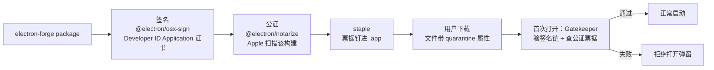

import { Meta } from '@storybook/addon-docs/blocks';

<Meta id="code-signing" title="打包与发布/签名与公证" name="Docs" />

# 签名与公证

打包课解决了"把项目变成安装包"，但没回答用户侧的准入问题：macOS 的 Gatekeeper 会在用户打开**下载来的**应用时做两层判定——**签名**证明"这个包来自谁、没被篡改过"（你对 bundle 做的），**公证（notarization）**是 Apple 在签名之上加盖的第三方背书（"我扫描过这个构建"）；Windows 侧对应的是 Authenticode 代码签名与 SmartScreen 信誉。签名不是分发礼仪：未签名的二进制在 macOS 上连系统通知都发不出（「[通知与角标](?path=/docs/notifications--docs)」一课的 `failed` 事件就是它），Squirrel.Mac 的自动更新更是直接要求签名。Forge 把整条链路收进 `packagerConfig`：`osxSign` 负责签名、`osxNotarize` 负责公证，都发生在 package 步。

读完你应能预测：`npm run package` 的日志会先走签名、再走公证（公证耗时数分钟是正常的）；本机双击 package 产物能打开，**不代表**用户下载后能打开——quarantine 属性只打在下载文件上；Windows 的签名不在 package 步，而在 make 步、签在安装器上。



| 回查项 | 值 |
| --- | --- |
| macOS 签名配置 | `packagerConfig.osxSign`，发生在 package 步 |
| macOS 公证配置 | `packagerConfig.osxNotarize`，与签名同在 package 步 |
| 所需证书 | Developer ID Application（App Store 之外分发） |
| 公证凭据 | `keychainProfile` / `appleId` + `appleIdPassword` + `teamId` / `appleApiKey` + `appleApiIssuer` 三选一 |
| 公证前提 | hardened runtime、Xcode 13+（notarytool）、Apple Developer Program |
| 公证耗时 | 通常数分钟，CI 需放宽超时 |
| Windows 签名 | make 步、安装器层；MakerSquirrel 的 `certificateFile` / `certificatePassword` |
| 验证命令 | `codesign --verify` / `spctl -a -t exec -vv` / `xcrun stapler staple` |

## 快速上手

前提：Apple Developer Program 会员，且这台 Mac 的钥匙串里装有 Developer ID Application 证书（在 Xcode 或 developer.apple.com 创建下载）。先确认机器认得你的签名身份：

```bash
security find-identity -p codesigning -v
# 应列出一行 "Developer ID Application: ..." 身份；为空说明证书未就绪，后面无需继续
```

在 `forge.config` 的 `packagerConfig` 里加上签名与公证（凭据组织见后文，这里用钥匙串方式，配置文件里零秘密）：

```ts
// forge.config.mts
packagerConfig: {
  osxSign: {},                                       // 字段存在（哪怕空对象）才启用签名
  osxNotarize: { keychainProfile: 'my-app-notary' }, // 凭据档案，由 notarytool store-credentials 预先存好
},
```

然后打包并验证：

```bash
npm run package    # 日志先出现签名（Signing）、后出现公证（Notarizing），公证耗时数分钟
codesign --verify --deep --strict out/my-app-darwin-arm64/*.app  # 静默通过 = 签名结构有效
spctl -a -t exec -vv out/my-app-darwin-arm64/*.app
# accepted  source=Notarized Developer ID —— Gatekeeper 放行、公证在位
```

两个观察点：`osxSign: {}` 写不写决定签名跑不跑——没写时 package 照样成功，只是产物不带签名，这正是"忘了配签名"最难发现的原因；`spctl` 是唯一能在本机模拟用户侧判定的命令，双击验证不算数。

## Gatekeeper 在检查什么

把判定模型拆成三层，每一层的执行者和产物都不同：

- **签名（你签）：** 对 bundle 的每个组成部分计算哈希并附上证书。任何文件被改动，签名即失效；证书把"这份包"绑定到"你的开发者身份"。签名保护的不只是你的代码，还包括 Electron 本体——配合 8.1 讲的 asar 完整性校验 fuse（`EnableEmbeddedAsarIntegrityValidation`），"运行时校验 app.asar 哈希" + "系统层校验整包签名"才构成完整防线。
- **公证（Apple 签）：** 把构建产物提交给 Apple 的 notary 服务做恶意软件扫描，通过后拿到一张**票据**。公证不改变你的签名，只是 Apple 对这个具体构建的背书。
- **Gatekeeper（系统判）：** 用户打开**带 quarantine 属性**的文件时检查——签名链是否有效、是不是 Developer ID、有没有公证票据，全部通过才放行，否则直接弹"无法打开"类拒绝窗。

quarantine 是理解"本机正常、用户翻车"的钥匙：浏览器、聊天工具下载的文件会被系统打上 `com.apple.quarantine` 扩展属性；你自己 `npm run package` 出来的产物没有这个属性，双击直接运行、不触发完整判定。所以**双击能开证明不了分发合规，判断只能用 `spctl`**。另外，公证状态可以在线查询，但离线环境只认钉进 bundle 的票据——需要用户无网首启也放行时，用 `xcrun stapler staple` 把票据写入应用（见"验证签名与公证"）。

签名之外还买到了什么（本课边界的另一半）：macOS 上未签名二进制触发 `Notification` 的 `failed` 事件、`autoUpdater` 在 Squirrel.Mac 上完全不工作（见"签名与自动更新"）；Mac App Store 分发走另一条链路（Apple Distribution 证书与 MAS entitlements），本课只覆盖 Developer ID 直分发。

### 证书与身份

Developer ID Application 是"App Store 之外分发"的专用证书，与开发期自动管理的 Apple Development、MAS 分发用的 Apple Distribution 不是一回事；本课只需要前者。签名身份躺在钥匙串里，以"证书名 (Team ID)"的形式标识：`osxSign` 默认自动发现 Developer ID Application 身份，机器上存在多个候选时用 `identity` 显式指定证书名。公证要填的 `teamId` 就在证书名括号里，也可以在 developer.apple.com 的 Membership 详情页查到。

```bash
# 列出钥匙串里可用于代码签名的身份（名字、哈希、是否有效）
security find-identity -p codesigning -v
```

## osxSign：签名

`packagerConfig.osxSign` 的字段直通 `@electron/osx-sign`，**字段存在（哪怕空对象）签名才会执行**。最小配置就是 `osxSign: {}`：工具自动在钥匙串里发现 Developer ID Application 证书，并按直分发场景处理签名顺序与默认 entitlements。

需要显式干预的三个点：

- **hardened runtime：** Apple 要求被公证的应用启用这套进程防护机制（限制动态可执行内存、库加载等），所以公证场景必须确保它在位。`@electron/osx-sign` 的默认配置已覆盖；若公证报 hardened runtime 相关错误（多半发生在自定义 entitlements 之后），显式设置 `hardenedRuntime: true` 再查。
- **entitlements（授权声明）：** 摄像头、麦克风这类设备权限，以及 hardened runtime 下的豁免项（如 V8 的 JIT）。`@electron/osx-sign` 自带适配 Electron 的默认 entitlements，多数项目不需要自定义；确实需要时把 `entitlements` 指向自己的 plist（本课示例文件 `entitlements.mac.plist` 是一个带注释的起点），并用 `optionsForFile` 给不同文件返回不同授权。两个已核实的版本边界：Electron 的 JIT 在 hardened runtime 下依赖 `com.apple.security.cs.allow-jit`；`com.apple.security.cs.allow-unsigned-executable-memory` 只有 Electron ≤ 11 需要，Electron 12 起不应再写进 entitlements。
- **不要用 `--deep` 代替逐层签名：** bundle 里各类组件要按依赖顺序分别签，`--deep` 的全量递归不保证顺序、官方明确不推荐；`@electron/osx-sign` 已按正确顺序处理，别在 `additionalArguments` 里手动追加它"救急"。

可观察证据：package 日志出现签名步骤即代表 `osxSign` 生效；对产物跑 `codesign -dv --verbose=4`，输出里 `Authority=Developer ID Application: ...` 说明身份正确，`flags` 含 `runtime` 说明 hardened runtime 在位。

## osxNotarize：公证

`packagerConfig.osxNotarize` 的字段直通 `@electron/notarize`：Forge 在 package 步完成签名后，把应用交给 Apple 的 notary 服务（底层是 Xcode 13+ 自带的 `notarytool`）扫描并**等出结果**。公证通常耗时数分钟，高峰期更久——这不是卡死，CI 里给 package 步放宽超时即可。

### 凭据组织

公证需要证明"你是这个团队的成员"，三种方式三选一，共同原则是**配置文件里不出现任何秘密**：

- **`keychainProfile`（本地开发推荐）：** 先用 `xcrun notarytool store-credentials <档案名>` 把凭据存进钥匙串，配置里只写档案名，forge.config 零秘密。
- **Apple ID + app-specific password：** `appleId` + `appleIdPassword` + `teamId`。注意 `appleIdPassword` 是在 appleid.apple.com 单独生成的应用专用密码，不是账号登录密码；值从环境变量注入（Forge 文档示例用 `APPLE_ID` / `APPLE_PASSWORD` / `APPLE_TEAM_ID`）。
- **App Store Connect API key（CI 推荐）：** `appleApiKey` 指向 `.p8` 密钥文件的绝对路径（只能在网站上下载一次），配 `appleApiIssuer`。一个新坑：Xcode 26+ 申请的**个人** API key 要省略 `appleApiIssuer`，传了反而 401。

失败排查有官方出口：`xcrun notarytool history` 列出提交记录与状态，`xcrun notarytool log <提交ID>` 拉取详细结果，被拒原因写在里面。三种凭据的注释形态与 Windows 证书字段的完整对照，收在同目录示例文件 `forge.config.mts` 里。

## 验证签名与公证

四个命令各回答一个问题，发布前至少跑前三个：

| 命令 | 回答的问题 |
| --- | --- |
| `codesign --verify --deep --strict <app>` | 签名在结构上是否完整有效（静默通过即有效） |
| `codesign -dv --verbose=4 <app>` | 谁签的：证书、Team ID，`flags` 是否含 `runtime`（hardened runtime） |
| `spctl -a -t exec -vv <app>` | Gatekeeper 会不会放行；`source=Notarized Developer ID` 表示公证在位 |
| `xcrun stapler staple <app>` | 把公证票据钉进 bundle，用户离线首启也能通过 Gatekeeper |

`staple` 的定位：公证结果默认可在线查询，但用户机器离线时无从查询，钉了票据的应用才在无网环境稳过。公证人肉等待数分钟后，用 `xcrun notarytool history` 确认状态再 staple，是手工兜底 Forge 自动流程的完整路径。

## Windows：代码签名

与 macOS 有两处结构性差异，先对照再配置：

| | macOS | Windows |
| --- | --- | --- |
| 签名对象 | 整个 `.app` bundle | 安装器（exe），也可加签内部二进制 |
| 发生步骤 | package 步 | **make 步**（maker 产出安装器时） |
| Forge 入口 | `packagerConfig.osxSign` | MakerSquirrel/MSI 的证书字段；直接签二进制走 `packagerConfig.windowsSign`（直通 `@electron/windows-sign`） |
| 拦截者 | Gatekeeper（首启弹窗） | SmartScreen（"未知发布者"警告） |

传统证书路径：给 MakerSquirrel 配 `certificateFile`（`.pfx` 证书文件）与 `certificatePassword`（值从环境变量注入）。没配证书时产物照样能生成，但用户侧会看到"发布者未知"。证书本身的形态在 2023 年 6 月起发生硬变化：行业规范要求私钥必须落在通过 FIPS 140-2 Level 2 / CC EAL 4+ 认证的硬件上，纯软件 `.pfx` 的 OV 证书已买不到——要么购买带 USB 硬件 token 的证书并插在打包机上，要么改用云签名服务。签名工具链方面，Forge 的 Windows 签名底层最终调用 Windows SDK 提供的 `signtool`（随 Visual Studio 安装，Community 版即可）。

EV/OV 与 SmartScreen 的现状：SmartScreen 警告本质看"信誉"，OV 证书标识企业身份但信誉要随安装量积累；EV 证书曾以"立享信誉"著称。当代更省事的路线是 **Azure Trusted Signing**——微软官方云签名服务，Electron 官方文档称其为"Windows 上最便宜的签名方式"且直接消除 SmartScreen 警告；代价是资格门槛：截至 2025 年 10 月仅向美加组织（需 3 年以上可验证历史）与美加个人开发者开放。接入方式是 `@electron/windows-sign` ≥ 1.2.2 配合 `signWithParams` 与一组 Azure 环境变量，完整接线步骤见 Forge 的 Windows 签名指南（本课只建立现状地图）。CI 交叉构建下证书与工具的环境准备见「[多平台构建](?path=/docs/cross-platform-builds--docs)」。

## 签名与自动更新

这条关系是硬性的：**Squirrel.Mac 要求应用已签名，否则 `autoUpdater` 完全不工作**（Electron 官方文档原话级要求）。公证则保证更新下来的新版本在用户机器上首启不被 Gatekeeper 拦。更隐蔽的约束在比对逻辑里：更新链路认的是"同一个签名身份 + `appBundleId` + 递增版本号"——发布后**证书、Team ID、bundle ID 都要当作不可变资产**，换证书等于所有老用户的更新链断裂，只能重新安装。Windows 侧 Squirrel 消费 make 产出的 nupkg 三件套（8.1 已见），签名打在安装器层。完整更新链路见「[自动更新](?path=/docs/auto-update--docs)」。

## 最佳实践

- **凭据分层管理。** 本地开发用 `keychainProfile`（钥匙串存凭据），CI 用 App Store Connect API key（`.p8` 只下载一次、放 CI secret）；一切秘密走环境变量或钥匙串，forge.config 与 git 历史里零秘密。
- **entitlements 默认优先，只加不删。** 先用 `osxSign: {}` 空配置跑通签名+公证，遇到具体权限需求再往默认授权上加；一旦自定义 plist，必须重新走完整公证验证——删掉 JIT 授权是公证后应用启动崩溃的头号原因。
- **发布前把"完整 package"当固定检查项。** macOS 的签名与公证都发生在 package 步，发布前完整跑一次并用 `spctl` 验证；只跑到 make 或只看"能不能双击"，发现不了签名问题。
- **每个构建重新签名+公证。** 公证绑定具体构建产物，没有"签过一次以后复用"；出 hotfix 也要走完整链路。
- **签名资产发布即冻结。** 证书、`teamId`、`appBundleId` 一经发布不再变更（理由见上节），换证书前先想清楚老用户更新链。

## 常见问题

- 用户双击下载的 `.app` 弹"无法打开，因为无法确定开发者"或"已损坏，要移到废纸篓"
  先在本机对**同一个产物**跑 `spctl -a -t exec -vv` 分流：`rejected` 且无签名信息 = 签名根本没执行（检查 `osxSign` 字段是否存在、钥匙串里有无 Developer ID 证书）；有签名但非 Notarized = 公证没过或没执行（看 package 日志与 `xcrun notarytool history`）；两者都正常则怀疑传输破坏了签名（部分传输方式会剥元数据），改用 zip 重新分发。"已损坏"多半是签名在传输中断裂，不是磁盘问题。让用户 `xattr -cr` 绕过只适用于你自己的测试机，不能当分发方案。
- 本机 `npm run package` 出来的应用双击一切正常，发给用户就打不开
  这不是偶发：本机产物没有 quarantine 属性，双击走的是"无完整判定"路径。双击结果与用户侧判定无关，以后一律用 `spctl` 做判断。
- 公证卡住很久，或 CI 里超时失败
  数分钟是正常耗时，不是卡死；CI 给 package 步放宽超时。反复失败时用 `xcrun notarytool log <提交ID>` 拉详细原因，最常见的两类是自定义 entitlements 删掉了 hardened runtime 所需授权、以及 hardened runtime 本身没启用。
- 公证通过后应用一启动就崩溃
  检查自定义 entitlements 是否删掉了 `com.apple.security.cs.allow-jit`（Electron 的 V8 JIT 需要）；同时确认没把 `com.apple.security.cs.allow-unsigned-executable-memory` 写回来——Electron 12 起它已不该存在。
- Windows 用户安装时看到 SmartScreen 蓝色"未知发布者"警告
  先确认签名真的发生了（签名在 make 步，看 maker 日志与产物属性）；确认已签名仍警告是信誉问题——OV 证书随安装量积累，或换 Azure Trusted Signing（直接消除警告，资格限制见上文）。

## 总结回顾

摘要：

签名与公证是分发包在用户机器上的准入判定：签名对 bundle 的每个部分做哈希并附上 Developer ID Application 证书，回答"谁发的、改没改"；公证把这个具体构建提交 Apple 扫描并拿回票据，是第三方的恶意软件背书；Gatekeeper 只对带 quarantine 属性的下载文件做首启判定，所以本机双击通过不代表分发合规，判断要用 `spctl`。Forge 里一切收口在 `packagerConfig`：`osxSign` 字段存在即启用签名（hardened runtime 与默认 entitlements 已按公证场景处理，自定义 plist 时保住 JIT 授权），`osxNotarize` 在同一步用三种凭据之一（本地钥匙串 `keychainProfile`、Apple ID 专用密码、CI 用 `.p8` API key）等出公证结果，数分钟耗时正常，失败用 `notarytool log` 定位。Windows 侧结构不同：签名发生在 make 步、打在安装器上（MakerSquirrel 的 `certificateFile`/`certificatePassword`），2023 年起私钥必须落硬件，云签名服务与 Azure Trusted Signing 是当代路线。签名同时是运行时能力的开关——Squirrel.Mac 没有签名连更新都不启动，发布后证书、Team ID、bundle ID 一律冻结。

一句话：

> 签名证明"包是你的且没被改"，公证是 Apple 对这个构建的背书；缺了这两层，macOS 用户首启被 Gatekeeper 拦，Windows 用户被 SmartScreen 拦，而 macOS 的自动更新干脆不启动。

知识要点：

- Gatekeeper 首启检查哪几层？quarantine 属性在判定中扮演什么角色？
- 为什么本机双击正常的产物，用户下载后可能打不开？应该用什么命令代替双击验证？
- `osxSign` 与 `osxNotarize` 分别配置什么？发生在哪个命令、哪一步？
- 公证的三种凭据组织方式各适合什么场景？为什么配置文件里不能出现秘密？
- hardened runtime 与 entitlements 是什么关系？Electron 依赖哪个 JIT 授权、哪个授权已废弃？
- Windows 的签名发生在哪一步、签在什么对象上？2023 年后证书形态与 Azure Trusted Signing 的现状是什么？
- Squirrel.Mac 为什么强制签名？哪些签名资产发布后必须当作不可变？

## 参考资料

- [Electron Forge：Code Signing on macOS](https://www.electronforge.io/guides/code-signing/code-signing-macos)（`osxSign: {}` 触发方式、Developer ID Application 证书、`osxNotarize` 三种凭据与环境变量示例、公证在 package 步执行）
- [Electron Forge：Code Signing on Windows](https://www.electronforge.io/guides/code-signing/code-signing-windows)（make 步安装器层签名、MakerSquirrel `certificateFile`/`certificatePassword`、硬件私钥要求、Azure Trusted Signing 接入与环境变量）
- [@electron/notarize（GitHub）](https://github.com/electron/notarize)（`notarize()` 选项字段、notarytool 与 Xcode 13+ 前提、Electron 12+ 的 `allow-unsigned-executable-memory` 边界、个人 API key 省略 issuer 的 401 坑、公证耗时说明）
- [@electron/osx-sign（GitHub）](https://github.com/electron/osx-sign)（`type` 默认 `distribution`、Developer ID 证书要求、`optionsForFile`、`--deep` 不推荐）
- [Electron 教程：Code Signing](https://www.electronjs.org/docs/latest/tutorial/code-signing)（签名+公证两步模型、Forge 的 `osxSign`/`osxNotarize` 入口、Squirrel.Mac 要求签名、Windows EV 证书与 Azure Trusted Signing 定位）
