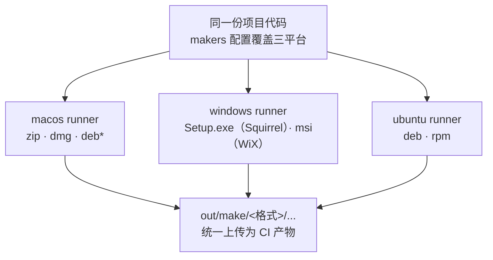

import { Meta } from '@storybook/addon-docs/blocks';

<Meta id="cross-platform-builds" title="打包与发布/多平台构建" name="Docs" />

# 多平台构建

「[打包](?path=/docs/packaging--docs)」一课把打包拆成 package 与 make 两层，本课回答多平台视角下的两个问题：**每个平台出什么安装包，以及在哪台机器上出**。核心判断一句话：交叉构建的边界不在 Forge 命令，而在 maker——package 层复制的是官方预编译的 Electron 本体，几乎总能用 `--platform` / `--arch` 指定任意目标；make 层的每个 maker 依赖目标平台的系统安装器工具链（WiX、dpkg、rpm-build 等），只会在它支持的宿主操作系统上执行。所以"在 macOS 上出 Windows 安装包"这类需求的工程正解不是本机凑工具链，而是 CI 矩阵：三台 runner 各自构建各自的格式。

读完你应能预测：沿用 8.1 的项目把 makers 配齐，在 macOS 上跑 `npm run make` 只会得到 zip 与 dmg（装上 dpkg 与 fakeroot 后还能得到 deb）；Windows 的 Setup.exe 只能出自 Windows（或装了 mono 与 wine 的 Linux）机器——真实项目用一份 GitHub Actions 工作流让三台 runner 各出各包，产物统一收进 `out/make/`。



各安装包的选型与可构建性速查（本课的回查主入口，`*` 表示 macOS 上需先安装 dpkg 与 fakeroot）：

| 安装包 | maker 包 | 目标平台 | 能在哪台机器上构建 | 关键边界 |
| --- | --- | --- | --- | --- |
| zip | `@electron-forge/maker-zip` | 全平台 | 任意平台 | 纯 JS 归档，无系统工具依赖；macOS 自动更新依赖它 |
| dmg | `@electron-forge/maker-dmg` | darwin | 仅 macOS | macOS 的标准分发格式 |
| pkg | `@electron-forge/maker-pkg` | darwin | 仅 macOS | .pkg 原生安装器，面向企业部署等场景 |
| Setup.exe | `@electron-forge/maker-squirrel` | win32 | Windows，或装 mono 与 wine 的 Linux | macOS 不能构建；附带更新用的 nupkg 与 RELEASES |
| msi | `@electron-forge/maker-wix` | win32 | 装有 WiX Toolset v3 的机器 | 官方建议优先 Squirrel，msi 是企业政策才需要的格式 |
| deb | `@electron-forge/maker-deb` | linux | Linux 或 macOS（需 fakeroot、dpkg） | Debian/Ubuntu 系标准格式 |
| rpm | `@electron-forge/maker-rpm` | linux | 仅 Linux（需 rpm 或 rpm-build） | Fedora/RHEL 系标准格式 |
| AppImage | —（Forge 无官方 maker） | linux | — | npm 上已无 `@electron-forge/maker-appimage` 包，需要时走 electron-builder |

另有面向应用商店的 maker：`maker-snapcraft` 与 `maker-flatpak`（Linux）、`maker-appx`（Windows），同样受宿主平台约束，需要商店分发时再查各自文档。

## maker 选型

maker 是挂在 `forge.config` 的 `makers` 数组里的 make 目标插件，每个条目携带两份信息：maker 自身的配置对象，和一个 `platforms` 数组，声明该格式为哪些目标平台生成。make 执行时要过两道过滤：**目标平台必须在条目的 platforms 里，宿主操作系统还必须能运行这个 maker**——两道都过才产出文件，否则静默跳过。这解释了 8.1 留下的现象：模板在 macOS 上只配了 `new MakerZIP({}, ['darwin'])`，所以 `npm run make` 只得到 zip。多数 maker 的默认 platforms 就是自家平台（Squirrel 是 win32、DMG 与 PKG 是 darwin、deb/rpm 是 linux），zip 默认覆盖全部平台。

```ts
// 每个条目 = 配置对象 + platforms 数组；宿主约束在注释里，不体现在类型上
new MakerZIP({}, ['darwin']),      // zip：只为 darwin 目标生成，任意宿主都能执行
new MakerSquirrel({}, ['win32']),  // Squirrel：只为 win32 目标生成，且宿主必须是 Windows（或 Linux+wine）
```

一份覆盖三平台的完整带注释配置见本课示例文件 `forge.config.mts`；`--targets` 可临时覆盖这次跑哪些 maker（8.1 已讲）。

### macOS：zip、dmg 与 pkg

- **zip** 是三平台通用的兜底格式。在 macOS 上它不只是压缩包：Squirrel.Mac 驱动的自动更新要求同时产出 zip（dmg 不能作为更新源），所以即便主分发走 dmg，zip 也应留在 makers 里——这条链路见「[自动更新](?path=/docs/auto-update--docs)」。
- **dmg** 产出 Apple Disk Image（`.dmg`），macOS 的标准分发格式：用户打开后把 .app 拖进 Applications。**只能在 macOS 上构建**；背景图、窗口布局等选项见 `MakerDMGConfig`。
- **pkg** 产出 .pkg 原生安装器，面向企业部署等需要安装器流程的分发，同样只能在 macOS 上构建。日常分发 dmg + zip 足够，需要时再加。

### Windows：Squirrel 与 WiX

- **Squirrel**（`maker-squirrel`）是 Windows 上的默认选择，一次产出三个文件：`<appName> Setup.exe`（主安装器）、`<appName>-full.nupkg`（更新用的 NuGet 包）与 `RELEASES`（更新元数据）——后两个是自动更新的燃料，见「[自动更新](?path=/docs/auto-update--docs)」。**构建平台是 Windows，或装了 mono 与 wine 的 Linux；macOS 不在支持列表里**。配置继承 `electron-winstaller`：`authors` 与 `description` 缺省时取 package.json 的 `author` 与 `description`（注意 Forge 字段是复数 `authors`）；productName 含空格时，Forge 配置的 `name` 应使用不含空格的形式。
- **WiX**（`maker-wix`）产出传统 .msi 安装器。宿主必须装有 WiX Toolset v3（`choco install wixtoolset --version=3.14.0`，建议固定版本），实际意味着 Windows 机器。官方文档明说：除非企业内部分发政策要求 msi，优先 Squirrel。
- Forge 没有官方 **NSIS** maker——NSIS 是 electron-builder 路线的 Windows 默认安装器，在 Forge 里找不到属正常现象。

### Linux：deb、rpm 与 AppImage

- **deb**（`maker-deb`）面向 Debian 系发行版（Ubuntu 等）。它是少数能"借道 macOS"的安装包：**可以在 Linux 或 macOS 上构建**，宿主需要 fakeroot 与 dpkg 两个包（Homebrew 可装齐）。`maintainer` 与 `homepage` 是最常用的配置项。
- **rpm**（`maker-rpm`）面向 Red Hat 系（Fedora/RHEL）。**只能在 Linux 上构建**，宿主需要 rpm 或 rpm-build 包——Debian/Ubuntu 系宿主用 `sudo apt-get install rpm` 补齐。
- **AppImage** 是"一个文件跑所有发行版"的 Linux 通用格式，但 **Forge 没有官方 AppImage maker**：npm 上已不存在 `@electron-forge/maker-appimage` 包，官方文档也没有对应页面。需要 AppImage 时走 electron-builder（定位见 8.1）或社区工具。
- 商店格式（snapcraft、flatpak）同属 Linux 分发，由各自 maker 与工具链承载，本课不展开。

## 交叉构建的边界

把开场参考表压缩成两层规则：

**package 层——几乎总能交叉。** `electron-forge package` 接受 `--platform` 与 `--arch`（默认宿主平台与架构），从官方下载目标平台的 Electron 预编译产物并复制成应用目录。这一步不调用目标平台的任何系统工具，所以纯 JS 应用在 macOS 上执行 `npx electron-forge package --platform=win32 --arch=x64` 能得到一个可拷给 Windows 试运行的目录；macOS 上还可用 `--arch=universal` 把 arm64 与 x64 两份拷贝合并成通用二进制，一份包通吃两种芯片。

**make 层——被宿主锁死。** 每个 maker 都要调用宿主操作系统的安装器工具链，跨不过去。CLI 文档对 `make --platform` 的提醒就是原话："you normally can only target platform X from platform X"。对照开场参考表：macOS 本机出得了 zip、dmg、pkg、deb（装齐 dpkg 与 fakeroot 后），出不了 Setup.exe、msi、rpm。

**原生模块是第三个约束。** `.node` 文件按目标平台与 ABI 编译（见「[原生模块](?path=/docs/native-modules--docs)」），交叉构建时要么目标平台有现成预编译产物可下载，要么必须在目标平台上跑编译——后者基本等于"去对应平台构建"。所以带原生模块的项目连交叉 package 都不可靠，直接进 CI。

这份清单的直接推论就是下一节：用矩阵让三台 runner 各出各包。

## GitHub Actions 矩阵构建

矩阵解决三件事：三套安装器工具链互斥、原生模块需要在各自平台上编译、runner 由 GitHub 免维护。完整工作流见本课示例文件 `build.yml`，骨架：

```yaml
jobs:
  make:
    strategy:
      fail-fast: false # 一个平台失败不连坐其他平台
      matrix:
        os: [macos-latest, ubuntu-latest, windows-latest]
    runs-on: ${{ matrix.os }}
    steps:
      - uses: actions/checkout@v4
      - uses: actions/setup-node@v4
        with: { node-version: 24, cache: npm }
      - run: npm install
      - run: npm run make
      - uses: actions/upload-artifact@v4
        with:
          name: dist-${{ runner.os }} # v4 不允许同名 artifact 并存
          path: out/make
```

三个要点：

- **不需要按平台分支的构建脚本。** makers 配齐后，`npm run make` 在每台 runner 上自然只产出宿主支持的格式——macos 出 zip/dmg、ubuntu 出 deb/rpm、windows 出 Setup.exe。开场参考表就是这份"自然结果"的清单。
- **runner 前置依赖很少。** macos 与 windows runner 对 zip/dmg/Squirrel 零额外安装；ubuntu 只需补 rpm 包（deb 所需的 dpkg 与 fakeroot 通常已预装，缺什么按各 maker 文档的依赖清单 apt 安装）。WiX 例外：需要 msi 时在 windows job 里加一步 `choco install wixtoolset --version=3.14.0`。
- **产物用矩阵变量命名收集。** `upload-artifact` 的 name 里带 `${{ runner.os }}`，否则三个 job 的同名产物互相冲突；统一上传 `out/make/`，Actions 页面 Summary 区集中下载。

触发方式：推 `v*` tag 或手动 `workflow_dispatch`。在矩阵里注入签名 secrets 是「[签名与公证](?path=/docs/code-signing--docs)」的内容；tag 到 GitHub Releases 的自动发布是「[发布流程](?path=/docs/release--docs)」的内容。

## 最佳实践

- **别在本机凑工具链，直接上 CI。** Squirrel 的 wine 路线只在 Linux 宿主可用（且依赖与编码问题不少），macOS 根本不在支持列表；一台 windows runner 取代所有折腾，deb/rpm 同理交给 ubuntu。
- **makers 写全、platforms 写明确。** 每个条目显式给出 platforms 数组，本机调试时看到某个 maker 被跳过就能对照参考表判断"是预期还是漏配"，不靠猜。
- **CI 缓存 Electron 下载。** 每次构建都要下载上百 MB 的 Electron 本体，用 `actions/cache` 缓存 `@electron/get` 的缓存目录（macOS 在 `~/Library/Caches/electron`，Linux 在 `~/.cache/electron`，Windows 在 `%LOCALAPPDATA%\electron\Cache`），key 按 `runner.os` 区分。
- **按需选择 universal。** `--arch=universal` 一份包通吃 Apple Silicon 与 Intel，代价是包体积接近翻倍；没有强需求时按架构分开出包更省。
- **签名接入矩阵而非本机。** CI 上的三平台产物是签名与公证的接入点（secrets 注入 `packagerConfig` 的签名字段），顺序上先跑通矩阵再加签名，见 8.3。

## 常见问题

- 在 macOS 上 `npm run make`，配置里写了 Squirrel/WiX/deb 却没有产出对应文件
  这是宿主过滤的预期行为，不是配置错误。对照开场参考表确认该 maker 支持的宿主；需要 Windows 产物就进 CI，需要 deb 就在 macOS 上装齐 fakeroot 与 dpkg 后重跑。
- 想在 macOS 上用 wine 出 Windows 安装包
  别走这条路：官方支持列表里 Squirrel 的非 Windows 宿主只有"装了 mono 与 wine 的 Linux"，macOS 不可用；直接加一个 windows runner job，成本和可靠性都好得多。
- CI 上 deb 或 rpm 步骤失败，提示缺工具
  按文档依赖清单补装：deb 需要 fakeroot 与 dpkg，rpm 需要 rpm 或 rpm-build（Ubuntu 宿主 `sudo apt-get install rpm`）。失败信息通常直接点名缺失的包，装完重跑即可。
- 交叉 package 出来的 `out/my-app-win32-x64/` 在 Windows 上跑不起来或缺 `.node` 文件
  原生模块没有被按目标平台编译。交叉 package 只对纯 JS 应用可靠，用途限于快速自测代码路径；带原生模块的项目把该平台的构建交给 CI。
- 需要 AppImage，Forge 配置里却找不到对应 maker
  Forge 没有官方 AppImage maker（npm 包与文档页均已不存在）。用 electron-builder 出 AppImage，或评估 deb/rpm 是否已覆盖目标用户。

## 总结回顾

摘要：

多平台构建的可行性要分两层判断：package 层复制的是官方预编译 Electron，`--platform`/`--arch` 几乎总能指定任意目标（macOS 上还能用 `--arch=universal` 出通用二进制）；make 层的每个 maker 依赖目标平台的安装器工具链，只在它支持的宿主上执行——zip 任意宿主、dmg/pkg 仅 macOS、Squirrel 需要 Windows 或带 mono 与 wine 的 Linux、WiX 需要 WiX Toolset v3、deb 可在 Linux/macOS 构建（需 fakeroot 与 dpkg）、rpm 仅 Linux。原生模块把交叉构建进一步推向目标平台。工程正解是 GitHub Actions 矩阵：三台 runner 跑同一份 `npm run make`，makers 配齐后各出各包，`upload-artifact` 按 `runner.os` 收集产物。Forge 没有官方 NSIS 与 AppImage maker，这两类需求分别属于 electron-builder 路线。

一句话：

> package 层几乎总能交叉构建，make 层被 maker 的宿主工具链锁死——多平台安装包的正解是 CI 矩阵，让每个平台自己出自己的包。

知识要点：

- 三个平台各有哪几种官方 maker？各自产出什么文件？
- 每种安装包能在哪台机器上构建？哪个格式能借道 macOS？
- 为什么带原生模块的项目必须在目标平台上构建？
- GitHub Actions 矩阵的最小骨架是什么？为什么不需要按平台分支的构建脚本？
- Forge 为什么没有 NSIS 与 AppImage maker？需要这两类格式时怎么办？

## 参考资料

- [Electron Forge：DMG Maker](https://www.electronforge.io/config/makers/dmg)（仅 macOS 可构建、自动更新需同时产出 zip）
- [Electron Forge：Squirrel.Windows Maker](https://www.electronforge.io/config/makers/squirrel.windows)（三个产物文件、Windows 或 Linux+mono/wine 的宿主要求、authors 字段）
- [Electron Forge：WiX MSI Maker](https://www.electronforge.io/config/makers/wix-msi)（WiX Toolset v3 依赖与版本固定、"优先 Squirrel"的建议）
- [Electron Forge：deb Maker](https://www.electronforge.io/config/makers/deb)（Linux 或 macOS 可构建、fakeroot 与 dpkg 依赖）
- [Electron Forge：RPM Maker](https://www.electronforge.io/config/makers/rpm)（仅 Linux 可构建、rpm/rpm-build 依赖）
- [Electron Forge：ZIP Maker](https://www.electronforge.io/config/makers/zip)（zip 分发包的平台无关性）
- [Electron Forge：Pkg Maker](https://www.electronforge.io/config/makers/pkg)（macOS .pkg 安装器）
- [Electron Forge：CLI](https://www.electronforge.io/cli)（package/make 的 `--platform`、`--arch`、`--targets`、`--skip-package` 选项与"normally can only target platform X"提醒）
- [GitHub Actions：使用矩阵运行任务变体](https://docs.github.com/en/actions/writing-workflows/choosing-what-your-workflow-does/running-variations-of-jobs-in-a-workflow)（matrix 策略与 `runs-on` 引用）
