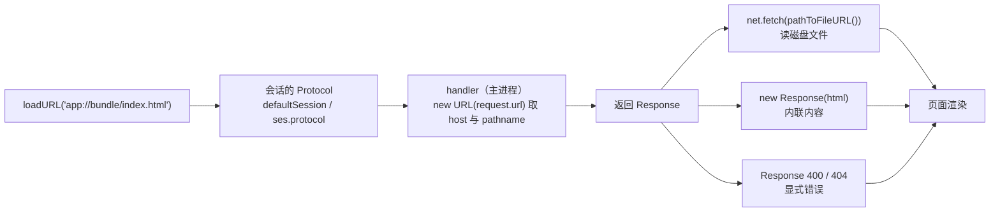

import { Canvas, Controls, Meta } from '@storybook/addon-docs/blocks';
import * as CustomProtocol from './custom-protocol.stories';

<Meta of={CustomProtocol} name="Docs" />

# 自定义协议

窗口能加载的不止 `file://` 与 `https://`——应用可以注册自己的协议（例如 `app://`），把本地目录变成一个「像正常网站一样」的地址。本课建立三个判断：**特权先声明**——`protocol.registerSchemesAsPrivileged` 决定协议具备哪些 Web 能力，只能在 app ready 前调用一次；**处理器定返回**——`protocol.handle` 把每个 `app://` 请求变成主进程里一次 handler 调用，返回什么页面就拿到什么；**协议挂在会话上**——`protocol` 模块操作的是 `defaultSession`，自定义分区的窗口要用 `ses.protocol.handle`。读完你应能预测：`loadURL('app://bundle/index.html')` 会怎样变成 handler 的入参，漏掉 `standard` 特权时页面会坏成什么样。



`privileges` 的全部字段先收进参考表（默认值与官方文档核对；除 `codeCache` 与 `allowExtensions` 外官方未逐项展开，常用字段的细节见「standard 与特权开关」）：

| privileges 字段 | 默认 | 作用 |
| --- | --- | --- |
| `standard` | `false` | 按 URL 规范解析：相对资源、Web 存储、FileSystem API 都靠它 |
| `secure` | `false` | 把协议 origin 当安全上下文（与 https 同级）对待 |
| `supportFetchAPI` | `false` | 页面内 fetch / XHR 可以请求该协议 |
| `corsEnabled` | `false` | 允许其他 origin 跨域请求该协议 |
| `stream` | `false` | `<video>` / `<audio>` 按流式响应处理，不再默认等整段缓冲 |
| `bypassCSP` | `false` | 协议资源绕过页面 CSP |
| `allowServiceWorkers` | `false` | 允许在该协议上注册 ServiceWorker |
| `codeCache` | `false` | 启用 V8 代码缓存（官方注明需同时 `standard: true`） |
| `allowExtensions` | `false` | 允许 Chrome 扩展作用于该协议的页面 |

本课管应用内协议与服务本地资源；OS 级深链注册（`app.setAsDefaultProtocolClient`，让系统用 `myapp://` 唤起本应用）见[深链与单实例](?path=/docs/deep-links--docs)。会话与分区的概念见[session 与存储](?path=/docs/session--docs)。

## 快速上手

沿用「[安装](?path=/docs/install--docs)」以来的 Forge 项目。目标：给 `app://` 声明特权、注册处理器，把窗口从 `loadFile` 换成 `loadURL('app://bundle/index.html')`，全程约 5 分钟。

把 `src/index.js` 整体替换为下面这样（同款完整文件见本课目录的 `protocol-app.js`）：

```js
const { app, BrowserWindow, net, protocol } = require('electron');
const path = require('node:path');
const { pathToFileURL } = require('node:url');

// 特权声明必须写在 app ready 之前，且整个应用只能调用一次——惯例是放主进程文件顶部。
// standard: true 让 app:// 按 URL 规范解析，页面的相对引用才指向包内路径。
protocol.registerSchemesAsPrivileged([
  { scheme: 'app', privileges: { standard: true, secure: true, supportFetchAPI: true } },
]);

const createWindow = () => {
  const mainWindow = new BrowserWindow({
    width: 900,
    height: 620,
    webPreferences: {
      preload: path.join(__dirname, 'preload.js'),
    },
  });

  // host=bundle 是「资源包名」，pathname=/index.html 是包内路径
  mainWindow.loadURL('app://bundle/index.html');
};

app.whenReady().then(() => {
  // protocol 模块操作 defaultSession；自定义分区的窗口要改用 ses.protocol.handle
  protocol.handle('app', (request) => {
    const { host, pathname } = new URL(request.url);

    if (host !== 'bundle') {
      return new Response('unknown host', { status: 404 });
    }

    if (pathname === '/') {
      return new Response('<h1>app:// 就绪</h1>', {
        headers: { 'content-type': 'text/html; charset=utf-8' },
      });
    }

    // 防路径穿越：app://bundle/../secret.txt 这类请求要挡在读盘之前
    const pathToServe = path.join(__dirname, pathname);
    const relativePath = path.relative(__dirname, pathToServe);
    const isSafe =
      relativePath && !relativePath.startsWith('..') && !path.isAbsolute(relativePath);
    if (!isSafe) {
      return new Response('forbidden', { status: 400 });
    }

    // file: URL 经 Chromium 网络栈读盘，按扩展名自动补 content-type
    return net.fetch(pathToFileURL(pathToServe).toString());
  });

  createWindow();
});

app.on('window-all-closed', () => {
  if (process.platform !== 'darwin') app.quit();
});
```

Forge 模板的 `index.html` 用相对引用带上 `index.css` 与 `index.js`——这正是本课要验证的东西：在 `standard` 协议上，这些相对引用会解析为 `app://bundle/index.css`、`app://bundle/index.js` 回到 handler 读盘。

改完在运行 start 的终端输入 `rs` 重启主进程（见「[第一次运行](?path=/docs/first-run--docs)」）。逐项核对：

- 窗口正常显示 Hello World 页面——页面与脚本都从 `app://` 加载；
- DevTools 的 Network 面板里出现 `app://bundle/...` 请求；
- Console 里执行 `location.origin`，结果是 `app://bundle` 而不是 `null`——协议有了正常 origin，这是与 `file://` 最本质的差别。

## 注册特权协议

`protocol.registerSchemesAsPrivileged([...])` 是模块级函数：不挑会话，声明一次对全应用生效。它必须在 `app` 的 `ready` 事件之前调用，且整个应用只能调用一次——惯例是放在主进程入口文件顶部，`require` 之后立刻声明。它不创建处理器，只给协议「上户口」：声明这个 scheme 存在，并领取 `privileges` 表里的能力。

### standard 与特权开关

官方对 `standard` 的定义：标准协议遵循 RFC 3986 的 generic URI syntax——`http`、`https` 是标准协议，`file` 不是。注册为 `standard` 带来三层行为差异：

- **相对与绝对资源正确解析。** 官方原文：不注册 standard 时「协议行为类似 file 协议，但没有解析相对 URL 的能力」——页面里 `` 这样的相对引用不会被正确解析，图片不加载。
- **Web 存储开放。** `localStorage`、`sessionStorage`、WebSQL、IndexedDB、cookie 在非 standard 协议上全部禁用。
- **FileSystem API 开放。** 非 standard 协议上访问会抛安全错误。

`supportFetchAPI` 独立于 standard：默认 `false`，即使协议已是 standard，页面内 `fetch('app://...')` 也不可用，要显式开启。

下面的沙盘把这两组开关并排呈现（真实 Electron 无法在浏览器里运行，这里按官方文档规则模拟特权开与关的差异；真实代码见本课目录的 `protocol-app.js`）：

<Canvas of={CustomProtocol.Interactive} />
<Controls of={CustomProtocol.Interactive} />

| 读者操作 | 可观察证据 |
| --- | --- |
| 关掉 `privileges.standard` | 相对资源、Web 存储两行同时失效；fetch 行不受影响 |
| 关掉 `privileges.supportFetchAPI` | 只有 fetch 行失效 |
| 打开 Show code | 看到该 Canvas 实际执行的 `protocol-sim.ts` |

## 注册协议处理器

`protocol.handle(scheme, handler)` 在 ready 之后、窗口第一次加载之前调用。handler 收到一个 `Request`，返回 `Response` 或 `Promise<Response>`：

```js
const { host, pathname } = new URL(request.url);
// app://bundle/pages/index.html → host: 'bundle'（包名）pathname: '/pages/index.html'（包内路径）
```

- `host` 是资源包名，`pathname` 是包内路径——先校验 host，再用 pathname 找文件，是协议处理器的标准骨架（完整骨架见快速上手）。
- 返回内容有三种形态：读文件用 `net.fetch(pathToFileURL(...))`，它走 Chromium 网络栈、自动按扩展名补 content-type；内联内容用 `new Response(字符串)`；错误用状态码 `new Response('...', { status: 400 })`。

### 返回内容与错误处理

`new Response(字符串)` 不带 content-type 时按纯文本处理，HTML 不会渲染，要手动给头：

```js
return new Response('<h1>你好，app://</h1>', {
  headers: { 'content-type': 'text/html; charset=utf-8' },
});
```

错误要在 handler 里显式表达：文件不存在返回 404，路径越界返回 400（快速上手里的检查）。`net.fetch` 读不到文件时请求失败（Promise reject），包一层 `catch` 转成显式 Response；handler 直接抛错或返回 rejected Promise 时该请求同样以失败收场，页面拿到的是网络错误而不是可定制的错误页——想给用户明确提示，就 return 带状态码的 Response。

内联 HTML、404、400、`unhandle` 的逐项对照见本课目录的 `protocol-handle-errors.js`。

### 路径越界检查

handler 是「URL → 磁盘路径」的入口，`pathname` 不加检查就能打穿：`app://bundle/../../secret_file.txt` 会拼出应用目录之外的路径。官方示例用 relative 检查拦下这类请求，写成可以直接用的版本：

```js
const pathToServe = path.join(__dirname, pathname); // 归一化：拼出候选路径
const relativePath = path.relative(__dirname, pathToServe); // 候选路径在应用目录内的相对位置
const isSafe =
  relativePath && !relativePath.startsWith('..') && !path.isAbsolute(relativePath);
if (!isSafe) {
  return new Response('bad', { status: 400 });
}
```

三步：先 `path.join` 归一化，再 `path.relative` 算出相对位置，最后判断没有以 `..` 开头、不是绝对路径。`host` 同理只放行白名单（快速上手只认 `'bundle'`）。

### 会话归属与成员速查

协议注册发生在会话上。官方说明：不指定会话，协议就作用于 default session——`protocol` 模块的方法等价于 `session.defaultSession.protocol`；给窗口的 `webPreferences` 设了 partition 后，窗口用的是另一个会话，「只写 `electron.protocol.XXX` 你的自定义协议不会工作」。处理方式是显式注册：

```js
const ses = session.fromPartition('persist:work');
ses.protocol.handle('app', handler); // 该分区的窗口才认这个协议
```

`Protocol` 对象的成员与去向：

| 成员 | 职责 |
| --- | --- |
| `handle(scheme, handler)` | 注册处理器，返回 `Response` / `Promise<Response>` |
| `unhandle(scheme)` | 卸载 `handle` 注册的处理器，卸载后该协议不再有响应 |
| `isProtocolHandled(scheme)` | 该协议当前是否有处理器或 source |
| `registerSource(scheme, source)` | 实验特性：不经 JavaScript handler，直接把 scheme 映射到磁盘目录（路由匹配 + 静态文件流，含 asar） |
| `registerFileProtocol` 等旧 API | 已废弃（Electron 25 起），全部由 `handle` 取代 |

另一个边界：handler 收到的 `request.initiatorOrigin` 是发起请求一方的 origin，浏览器自己发起的请求没有这个字段——需要区分「页面发的」还是「加载主框架发的」时用它。

## 服务打包内静态资源

自定义协议最典型的场景：把打包内的静态资源变成应用内地址。形态固定为「host 当资源包名、pathname 当包内路径」——开发时映射到 `src/` 目录，打包后代码进入 asar，`net.fetch(pathToFileURL(...))` 走的 `file:` 协议连 asar 包内文件一起支持，这份代码不用改（打包细节见[打包](?path=/docs/packaging--docs)）。

前端路由用 history 模式的单页应用在这里受益最直接：`file://` 下刷新路由路径就 404，协议 handler 里一行兜底就解决：

```js
protocol.handle('app', (request) => {
  const { host, pathname } = new URL(request.url);
  // 文件存在就返回文件；路由路径（不存在的文件）回退到入口页
  return serveFile(host, pathname).catch(() => serveFile(host, '/index.html'));
});
```

协议名本身也有规则（官方按 RFC 3986 约束）：字母开头，后接字母、数字、`+`、`.`、`-`；规范形是小写，注册与请求都用小写。

## 与 loadFile 的取舍

`loadFile` 与自定义协议都能把本地页面装进窗口（基础用法见[创建窗口](?path=/docs/windows--docs)），差别在页面拿到什么样的运行环境：

| | `win.loadFile(...)` | `loadURL('app://bundle/...')` |
| --- | --- | --- |
| 上手成本 | 零配置，模板默认 | 先声明特权、再注册处理器 |
| origin | `file://` 的不透明 origin（`location.origin` 为 `null`） | 正常 origin（如 `app://bundle`） |
| 页面内相对资源 | `file:` 可解析 | 需 `standard: true`，解析行为与 https 一致 |
| 页面 fetch 应用内资源 | 受 CORS 限制 | 开 `supportFetchAPI` 后可用 |
| SPA history 路由 | 刷新即找不到文件 | handler 回退 index.html 即可 |

取舍结论：默认 `loadFile` 够用；页面需要正常 origin（Web 存储、同源判断）、`fetch` 应用内资源或 history 路由时，注册一个自定义协议。

## 最佳实践

- **三段时序固定下来。** 特权声明放主进程文件顶部（ready 前、仅一次）→ `handle` 在 `whenReady` 里、第一次 `loadURL` 之前 → 窗口 `loadURL('app://...')`。处理器晚于加载注册，首个请求会落空。
- **handler 是磁盘读的入口，越界检查不能省。** `pathname` 拼进路径前必做 `join` + `relative` 检查，`host` 只放行白名单；这是协议方案的安全底线。
- **手动 `Response` 带上 content-type。** HTML 不给 `text/html` 会显示源码；读文件交给 `net.fetch(pathToFileURL())` 自动补全。
- **特权按需领取。** 页面够用就只开 `standard` + `supportFetchAPI`；媒体加载加 `stream`，跨域访问加 `corsEnabled`。每项特权都是给页面放权，不必全开。

## 常见问题

- 页面图片、样式没加载，Network 里相对资源的地址不对或根本没有请求
  先查特权声明：`standard: true` 没开时相对 URL 无法解析（官方明示协议「行为类似 file 但没有解析相对 URL 的能力」）。处理：在 `registerSchemesAsPrivileged` 里补上 `standard`，然后重启——该声明只在 app ready 前生效。
- `app://` 在设了 partition 的窗口里打不开，默认窗口却正常
  `protocol` 模块只作用于 defaultSession。处理：用 `session.fromPartition('persist:xxx').protocol.handle(...)` 显式注册到该分区（见「会话归属与成员速查」）。
- 返回的 HTML 被当成纯文本显示
  `new Response(字符串)` 缺 content-type。处理：加 `headers: { 'content-type': 'text/html; charset=utf-8' }`；读文件用 `net.fetch(pathToFileURL())` 则自动带。
- 页面里 `fetch('app://...')` 报请求失败
  两个开关各查一遍：`supportFetchAPI: true` 是页面内 fetch 的资格；跨 origin 请求还需要 `corsEnabled: true`。
- 通过协议加载的视频 / 音频播放异常
  `<video>` / `<audio>` 默认期望响应先缓冲整段。处理：给协议加 `stream: true`（官方注明流式协议应设置）。
- `registerSchemesAsPrivileged` 写在了 `app.whenReady()` 回调里
  官方约束是「只能在 ready 事件之前调用，且只能调用一次」。处理：移到主进程入口文件顶部；写在 ready 后声明不生效，协议拿不到特权。

## 总结回顾

摘要：

自定义协议把本地目录变成正常网站地址。`registerSchemesAsPrivileged` 在 ready 前、全应用仅一次地声明特权：`standard` 决定相对资源解析、Web 存储、FileSystem API 是否可用，`supportFetchAPI` 决定页面内 fetch，`stream` 服务媒体，全部字段默认 `false`。`protocol.handle` 在 ready 后把每个请求变成主进程一次 handler 调用——`host` 是包名、`pathname` 是包内路径，返回 `Response`：`net.fetch(pathToFileURL())` 读磁盘文件（asar 内同样支持），`new Response` 给内联内容（要带 content-type），状态码表达错误；`pathname` 拼路径前必做越界检查。协议挂在会话上：`protocol` 模块作用于 `defaultSession`，自定义分区要 `ses.protocol.handle`，`unhandle` 卸载、`isProtocolHandled` 查询，旧的 `register*Protocol` 系列已被 `handle` 取代。与 `loadFile` 的取舍：默认 `loadFile` 够用，需要正常 origin、页面 fetch 或 history 路由时上自定义协议。

一句话：

> 特权决定页面像不像正常网站，handler 决定每个 URL 返回什么——前者在 ready 前声明一次，后者在每个会话上注册。

知识要点：

- `registerSchemesAsPrivileged` 的时机约束是什么？它决定什么、不决定什么？
- `standard` 特权改变页面哪些行为？`supportFetchAPI` 管什么？
- handler 收到什么、返回什么？三种返回形态分别怎么写？
- 路径越界检查为什么必要？官方给的检查写法是哪三步？
- 协议注册在什么对象上？自定义分区的窗口要怎么注册？
- `unhandle` / `isProtocolHandled` 各做什么？废弃的 `register*Protocol` 去向哪里？
- `loadFile` 与 `app://` 各自适合什么场景？

## 参考资料

- [Electron API：protocol](https://www.electronjs.org/docs/latest/api/protocol)
  本课事实主来源：`registerSchemesAsPrivileged` 的时机与一次性约束、`standard` 的定义与相对解析行为原文、`handle` 官方示例（含路径越界检查）、协议命名规则、会话归属说明、`unhandle` / `isProtocolHandled` / `registerSource`。
- [Electron API：CustomScheme](https://www.electronjs.org/docs/latest/api/structures/custom-scheme)
  `privileges` 全字段的默认值；`codeCache` 需同时 `standard: true`、`allowExtensions` 的说明。
- [Electron API：session](https://www.electronjs.org/docs/latest/api/session)
  `ses.protocol` 与在分区会话上注册协议。
- [Electron API：net](https://www.electronjs.org/docs/latest/api/net)
  `net.fetch` 支持 `file:` 与自定义协议、会触发 webRequest，`data:` / `blob:` 不支持。
- [MDN：Generic URI Syntax](https://developer.mozilla.org/en-US/docs/Web/URI/Generic_syntax)
  protocol 文档对「标准协议」（RFC 3986 generic URI syntax）的定义出处。
