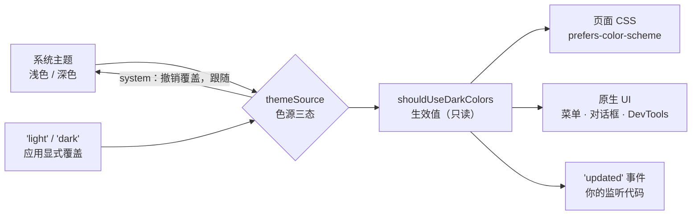

import { Canvas, Controls, Meta } from '@storybook/addon-docs/blocks';
import * as DarkMode from './dark-mode.stories';

<Meta of={DarkMode} name="Docs" />

# 深色模式

深色模式在 Electron 里是两级模型：`nativeTheme.themeSource` 是应用声明的**主题色源**（`system` / `light` / `dark`，默认 `system`），一旦赋值就覆盖 Chromium 从系统读到的主题；`nativeTheme.shouldUseDarkColors` 是只读的**生效值**。生效值同时驱动三类消费者——页面 CSS 的 `prefers-color-scheme` 媒体查询、原生 UI（菜单 / 对话框 / DevTools）和你的 `'updated'` 监听。读完你应能预测：系统切到深色时页面和原生 UI 会怎样变；把 `themeSource` 设成 `dark` 后，系统停在浅色时应用又是什么样子。



核心成员先收进参考表（默认值与官方文档核对）：

| 成员 | 类型 | 默认与关键约束 |
| --- | --- | --- |
| `nativeTheme.themeSource` | 读写 string | 默认 `'system'`；三态 `'system'` / `'light'` / `'dark'`，用于覆盖 Chromium 内部选定的主题 |
| `nativeTheme.shouldUseDarkColors` | 只读 boolean | 生效主题，`true` 为深色；要改变它只能设 `themeSource` |
| `'updated'` 事件 | 事件 | 底层主题变化时触发；官方注明通常意味着生效读数之一变了，须自查是哪个 |

三个边界先划清：深浅判断的旧 API `systemPreferences.isDarkMode` 已从现行文档移除，统一走 `nativeTheme`（`systemPreferences` 现管强调色与系统颜色，见「[系统信息与剪贴板](?path=/docs/system-apis--docs)」）。窗口材质 `vibrancy` / `backgroundMaterial` 的外观会随系统明暗自动切换，材质本身的配置见「[无边框窗口](?path=/docs/frameless-windows--docs)」，本课只照应「减少透明度」读数与材质的联动。`themeSource` 只承载「深 / 浅 / 跟随系统」的语义，应用内的品牌换色与多主题皮肤不归它管。

## 快速上手

沿用「[接入 TypeScript](?path=/docs/typescript-setup--docs)」的 vite-typescript 工程。目标：系统切换深浅色时，窗口底色、页面配色与原生 UI 同步跟随，全程约 5 分钟。

第 1 步，主进程读生效值并监听变化（加进模板 `src/main.ts`，创建窗口后调用 `trackTheme(mainWindow)`）：

```ts
import { BrowserWindow, nativeTheme } from 'electron';

function applyWindowTheme(win: BrowserWindow): void {
  // 窗口底色跟着生效值走，避免深色环境下启动闪一帧浅色
  win.setBackgroundColor(nativeTheme.shouldUseDarkColors ? '#1e2430' : '#ffffff');
}

function trackTheme(win: BrowserWindow): void {
  applyWindowTheme(win);
  nativeTheme.on('updated', () => applyWindowTheme(win));
}
```

第 2 步，渲染端 CSS 用变量提供两套配色：

```css
:root {
  --bg: #ffffff;
  --fg: #1f2430;
}
@media (prefers-color-scheme: dark) {
  :root {
    --bg: #1e2430;
    --fg: #e6e9f2;
  }
}
body {
  background: var(--bg);
  color: var(--fg);
}
```

第 3 步，验证。在系统设置里切换外观（macOS「系统设置 → 外观」，Windows「设置 → 个性化 → 颜色」）：页面配色、右键上下文菜单、窗口底色同步翻转。再在主进程执行 `nativeTheme.themeSource = 'dark'`：系统停在浅色，应用整体也翻到深色——这就是色源覆盖。核对三点：页面媒体查询即时生效（无需刷新页面）；`shouldUseDarkColors` 读数为 `true`；`'updated'` 监听里同步了窗口底色。

## 主题色源 themeSource

`themeSource` 回答的问题是「主题听谁的」。默认 `'system'` 时 Chromium 读系统；一旦赋 `'light'` 或 `'dark'`，应用就显式覆盖系统的选择；赋回 `'system'` 撤销覆盖。赋值立即生效——生效值、页面媒体查询与原生 UI 同步翻转，并触发一次 `'updated'`。

```ts
import { nativeTheme } from 'electron';

nativeTheme.themeSource = 'dark';   // 强制深色：系统停在浅色也生效
nativeTheme.themeSource = 'light';  // 强制浅色
nativeTheme.themeSource = 'system'; // 撤销覆盖，回到跟随系统（默认值）
```

三态各自的效果（官方文档逐条列出）：

| `themeSource` | `shouldUseDarkColors` | 页面 `prefers-color-scheme` | 原生 UI |
| --- | --- | --- | --- |
| `'system'`（默认） | 跟随系统 | 跟随系统 | 跟随系统 |
| `'dark'` | `true` | 匹配 dark | 深色 |
| `'light'` | `false` | 匹配 light | 浅色 |

官方推荐的正是这张表对应的三态机器：设置页做「跟随系统 / 深 / 浅」三选一，值直接存、启动时直接赋回；判断该套哪套 CSS 时，永远读 `shouldUseDarkColors`，不要自己从 `themeSource` 推导。

真实 Electron 无法在浏览器运行，下面的沙盘按官方文档行为模拟三态覆盖链路（真实验证路径见快速上手）：

<Canvas of={DarkMode.Interactive} />
<Controls of={DarkMode.Interactive} />

| 读者操作 | 可观察证据 |
| --- | --- |
| `themeSource` 保持 system，切「系统主题」浅 → 深 | 生效值翻转为 true（深色），页面与原生 UI 卡片同步转深，`'updated'` 计数 +1 |
| 系统保持浅色，把 `themeSource` 切到 dark | 色源覆盖生效：生效值与两类消费者整体翻深，「系统主题」箭头变为被覆盖 |
| 切回 system | 覆盖撤销，生效值回到系统当前值，`'updated'` 再次触发 |
| 打开 Show code | 看到该 Canvas 实际执行的 `theme-sim.ts` |

## 生效值与变化通知

色源决定生效值，生效值决定一切消费方。`nativeTheme` 标注为主进程模块——渲染端要用它得走 IPC，但页面配色根本不需要（见下一节）；主进程通常只在两个时机碰它：初始化读一次，变化时靠事件。

### shouldUseDarkColors

```ts
nativeTheme.shouldUseDarkColors; // true = 深色生效中
```

官方语义：OS / Chromium 当前开启了深色模式，或被指示显示深色风格 UI。它是只读布尔值，反映 `themeSource` 覆盖后的最终结果——`'dark'` 时恒为 `true`，`'light'` 时恒为 `false`，`'system'` 时跟系统。要改变它只能改 `themeSource`。

### 'updated' 事件

```ts
nativeTheme.on('updated', () => {
  if (nativeTheme.shouldUseDarkColors) {
    // 深色动作：同步窗口底色、换图标、推送渲染端
  }
});
```

官方说明：底层 NativeTheme 有变化时发出，通常意味着 `shouldUseDarkColors`、`shouldUseHighContrastColors`、`shouldUseInvertedColorScheme` 之一变了——事件不携带具体值，处理函数里要自查。典型的更新清单：

- **窗口底色：** `BrowserWindow.setBackgroundColor` 按生效值重设（快速上手第 1 步）；
- **图标资源：** 托盘 / 标题栏图标按深浅换图（托盘见「[托盘](?path=/docs/tray--docs)」）；
- **渲染端通知：** 仅当渲染端有媒体查询覆盖不到的内容（如 canvas 图表）才需要——用 `webContents.send` 推送，或者干脆让渲染端自己监听（见下节）。

## 渲染端自适应

页面里的配色自适应是 Web 标准，不走 Electron API：CSS 的 `prefers-color-scheme` 媒体查询与 `nativeTheme` 读的是同一个生效值——`themeSource` 一变，页面媒体查询立即重新评估，不用 IPC、不用刷新页面。主进程唯一相关的职责是把窗口底色对齐（窗口外壳在页面之外）。

### prefers-color-scheme 与 CSS 变量

配色收敛到 CSS 变量，媒体查询里只换变量值——规则只写一遍，深浅两套：

```css
:root {
  --bg: #ffffff;
  --fg: #1f2430;
  --line: #e2e8f0;
}
@media (prefers-color-scheme: dark) {
  :root {
    --bg: #1e2430;
    --fg: #e6e9f2;
    --line: #33405c;
  }
}
```

这是「跟随主题」的默认答案：文本、背景、边框、表单控件全走变量后，深色适配基本零 JS。

### matchMedia：JS 感知主题

canvas 绘图、WebGL、图表库等不响应媒体查询的内容，需要在主题变化时手动重绘。渲染端的入口是 `matchMedia`——它读的就是 `prefers-color-scheme` 同一条查询，所以 `themeSource` 的覆盖同样会触发 `change`：

```ts
// 渲染进程：主题变化时重绘不响应 CSS 的内容
const darkQuery = window.matchMedia('(prefers-color-scheme: dark)');

darkQuery.addEventListener('change', (event) => {
  redrawChart(event.matches ? darkPalette : lightPalette);
});
```

初始化时读一次 `darkQuery.matches` 定初值。主进程 `'updated'` + IPC 只在「主进程本身要做动作并顺手通知」时用；单独为渲染端拿主题建通道是多余的。

## 原生 UI 跟随与平台差异

生效值翻转时，原生界面跟着换装——但「谁画的」三个平台不同。官方对 `themeSource = 'dark'` 的效果分了两支：Linux / Windows 上 **Electron 渲染的 UI**（包括上下文菜单、DevTools 等）使用深色；macOS 上**系统渲染的 UI**（包括菜单、窗口边框等）使用深色。也就是说 macOS 的应用菜单与窗口边框由系统绘制，Electron 只是通知系统切换外观；Windows / Linux 的菜单、对话框与 DevTools 由 Chromium 自绘，跟着生效值走、不经过系统主题。文件对话框等原生对话框同理随生效值（对话框的用法见「[文件与对话框](?path=/docs/dialog-files--docs)」）。

| | macOS | Windows | Linux |
| --- | --- | --- | --- |
| `'system'` 档的取值来源 | 系统外观（浅色 / 深色） | 设置中的「选择默认应用模式」 | 桌面环境主题 |
| 原生 UI 渲染方 | 系统（OS） | Electron（Chromium 自绘） | Electron（Chromium 自绘） |
| 应用与系统主题可分 | 否 | 是 | 视桌面环境 |

Windows 允许「应用模式」与「系统模式」分开设置，两档可以不一致。需要区分时读两个 API：`shouldUseDarkColors` 反映应用侧的生效值（`themeSource` 覆盖后的结果）；`shouldUseDarkColorsForSystemIntegratedUI`（macOS / Windows）反映系统侧——Windows 上仅当系统主题为深色才为 `true`，macOS 上等于 `shouldUseDarkColors`。给系统级 UI 元素（如窗口边框、材质）选深浅时读后者。

除深浅之外，`nativeTheme` 还暴露一组系统辅助偏好的只读读数，做无障碍适配时按需取用：

| 成员 | 平台 | 用途与关键影响 |
| --- | --- | --- |
| `shouldUseHighContrastColors` | macOS / Windows | 高对比度模式开启时为 `true`；提供高对比度配色的判断依据 |
| `shouldUseInvertedColorScheme` | macOS / Windows | 反转色彩模式；深浅互换的辅助判断 |
| `inForcedColorsMode` | Windows | 强制色彩模式（Windows 高对比度是唯一触发源）；CSS 侧对应 `forced-colors` 媒体查询 |
| `prefersReducedTransparency` | 全平台 | 系统开启「减少透明度」；vibrancy 等材质窗口应退回不透明底色（材质见「[无边框窗口](?path=/docs/frameless-windows--docs)」） |
| `shouldDifferentiateWithoutColor` | macOS | 用户偏好用形状 / 文字而非颜色区分信息；图表与状态指示的设计依据 |

深浅覆盖不改变这些读数——它们只跟系统辅助功能设置走；但它们变化时同样触发 `'updated'`（官方在事件说明里列了高对比度与反转色彩两项）。

## 最佳实践

- **设置页三选一直存直赋。** 「跟随系统 / 深 / 浅」三个值就是 `themeSource` 的三个合法值：偏好存字符串，启动 `ready` 后赋回，不写特殊分支——`'system'` 本身就是「跟随系统」的正确写法。
- **窗口底色与生效值同步。** 创建窗口时按 `shouldUseDarkColors` 设 `backgroundColor`，`'updated'` 里重设；否则深色环境下启动或切换会闪一帧浅色。材质窗口（vibrancy / backgroundMaterial）例外——底色保持 alpha，明暗交给材质自动切换（见「[无边框窗口](?path=/docs/frameless-windows--docs)」）。
- **渲染端配色优先走 CSS。** 文本、背景、控件全收敛到 CSS 变量后，深色适配零 JS；只有媒体查询覆盖不到的内容（canvas 图表等）才上 `matchMedia`，不为读主题建 IPC 通道。
- **图标按深浅成对准备。** 托盘、标题栏图标在深浅两色底下对比度不同，在 `'updated'` 里按 `shouldUseDarkColors` 换图（托盘见「[托盘](?path=/docs/tray--docs)」）。
- **别把品牌换肤塞进 themeSource。** 它只承载深 / 浅 / 跟随三态；应用内多主题配色自行实现，与深浅模式的交点只留「每套品牌配色提供深浅两个变体」。

## 常见问题

- 改了 `themeSource`，页面配色没变
  页面里有硬编码颜色或内联 style，媒体查询只作用于写了查询的规则。处理：配色收敛到 CSS 变量，深浅两套变量在 `@media (prefers-color-scheme: ...)` 里切换（见「prefers-color-scheme 与 CSS 变量」）。
- `shouldUseDarkColors` 和系统设置对不上
  `themeSource` 还停在之前某处赋的 `'light'` / `'dark'`——覆盖优先于系统。处理：打印 `nativeTheme.themeSource` 确认当前值；「跟随系统」必须显式赋 `'system'`，撤销覆盖后生效值才回到系统档。
- 深色环境下启动闪一帧白
  窗口 `backgroundColor` 没跟主题对齐。处理：创建窗口前读 `shouldUseDarkColors` 设底色，并在 `'updated'` 里重设（快速上手第 1 步）。
- Windows 上应用深色、系统浅色（或反之）
  Windows 允许「应用模式」与「系统模式」分开设置，这不是 bug。处理：应用内判断读 `shouldUseDarkColors`；给系统级 UI（窗口边框、材质）选深浅读 `shouldUseDarkColorsForSystemIntegratedUI`。
- Linux 上感知不到系统主题切换
  `'system'` 档取桌面环境的主题状态，感知能力随桌面环境而异（官方文档未列专门约束；部分环境对切换的实时感知不稳定——社区经验，未核实）。排查：先把 `themeSource` 显式设 `'dark'` 验证覆盖链路正常，再查桌面环境的主题设置与版本。

## 总结回顾

摘要：

深色模式的核心是两级模型：`themeSource` 是应用声明的主题色源（`system` / `light` / `dark`，默认 `system`），赋值即覆盖 Chromium 从系统读到的选择，赋回 `'system'` 撤销覆盖；`shouldUseDarkColors` 是覆盖后的只读生效值。生效值同时驱动三类消费者：页面 `prefers-color-scheme` 媒体查询（`themeSource` 一变立即重新评估，不需要 IPC 与刷新）、原生 UI（macOS 的菜单与窗口边框由系统绘制，Windows / Linux 的菜单、对话框、DevTools 由 Chromium 自绘）、以及主进程的 `'updated'` 监听（事件不带值，官方要求自查具体读数，典型动作是同步窗口底色与图标）。Windows 允许应用模式与系统模式分开，读 `shouldUseDarkColorsForSystemIntegratedUI` 拿系统侧。渲染端自适应的主体工作是 CSS 变量两套配色，只有媒体查询覆盖不到的内容才用 `matchMedia` 手动重绘。vibrancy 材质随系统明暗自动切换，配置在无边框窗口课。

一句话：

> themeSource 是色源、shouldUseDarkColors 是生效值——覆盖系统时改色源，读结果永远读生效值，页面媒体查询与原生 UI 自动跟随。

知识要点：

- `themeSource` 三态各让 `shouldUseDarkColors`、页面媒体查询、原生 UI 发生什么变化？
- 为什么判断该套哪套 CSS 时读 `shouldUseDarkColors`，而不是自己从 `themeSource` 推导？
- `'updated'` 事件什么时候触发？官方为什么要求处理函数里自查具体读数？
- 渲染端自适应为什么不需要 IPC？`matchMedia` 的 `change` 事件在什么场景用？
- 原生 UI 在三个平台分别由谁绘制？`'system'` 档各取哪里的值？
- Windows 的应用主题与系统主题为什么可能不一致？各该读哪个 API？
- 怎么避免启动与切换时的窗口闪白？

## 参考资料

- [Electron API：nativeTheme](https://www.electronjs.org/docs/latest/api/native-theme)
  本课事实主来源：`themeSource` 三态语义与覆盖行为（含 Linux / Windows 与 macOS 原生 UI 渲染方分工、`prefers-color-scheme` 联动、官方三态机器推荐）、`shouldUseDarkColors` 只读语义、`'updated'` 事件触发条件与自查要求、`shouldUseDarkColorsForSystemIntegratedUI` 的 Windows 应用 / 系统主题区分、高对比度 / 反转色彩 / 强制色彩 / 减少透明度 / 非颜色区分等辅助读数。
- [MDN：prefers-color-scheme](https://developer.mozilla.org/zh-CN/docs/Web/CSS/@media/prefers-color-scheme)
  渲染端媒体查询与 `window.matchMedia` 的标准行为：跟随用户深浅偏好，变化经 `change` 事件与 `matches` 读取。
