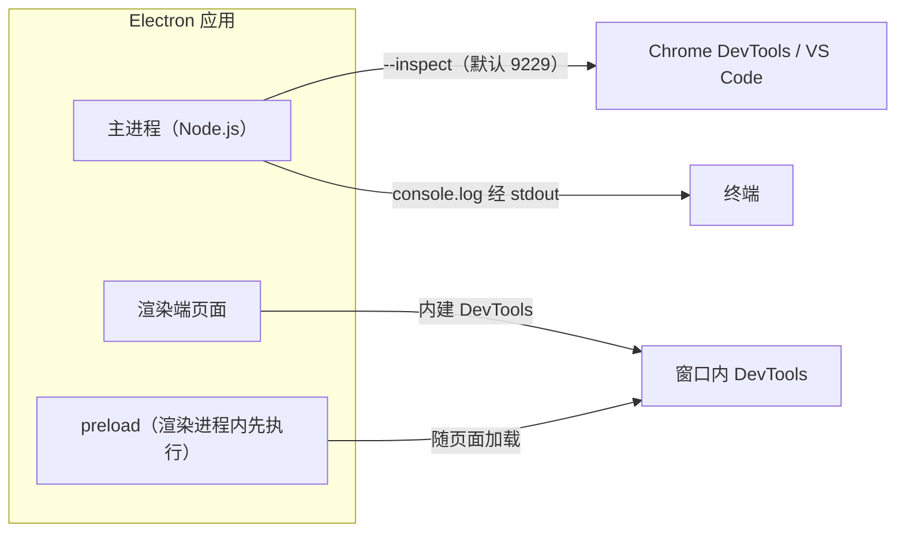

import { Meta } from '@storybook/addon-docs/blocks';

<Meta id="debugging" title="工程化/调试" name="Docs" />

# 调试

本课建立 Electron 应用的调试通道地图。最重要的判断先放在这里：**调试通道跟着进程走，不跟着文件走**——同一次 `npm start` 里，主进程文件的断点要走 Node inspector 端口、外接调试器；页面代码的断点就在窗口内 DevTools 里；`preload` 跟着渲染端通道走，但执行时机特殊。渲染端通道天生就绪，主进程通道要先开端口再连接；日志是断点之外贯穿两端的兜底，两端的落点也不同。

本课沿用「[接入 TypeScript](?path=/docs/typescript-setup--docs)」的 Forge + Vite + TS 项目：主进程与 preload 是构建产物（`out/` 下），渲染端由 Vite dev server 直出源码；`rs` 重启等开发循环见「[第一次运行](?path=/docs/first-run--docs)」。三端各自的进程归属在「[进程模型](?path=/docs/process-model--docs)」建立。



| 通道 | 调试对象 | 入口 | 日志落点 |
| --- | --- | --- | --- |
| 窗口内 DevTools | 页面 JS、preload、DOM、网络 | 快捷键 / 菜单 / `openDevTools()` | DevTools Console |
| Node inspector | 主进程 | `--inspect`（默认 9229）+ Chrome DevTools / VS Code | 连接端调试控制台 |
| Chromium 远程调试 | 渲染端页面 | `--remote-debugging-port`（习惯 9222）+ chrome://inspect / VS Code | 连接端 |
| 终端 | 主进程 `console.log`、启动报错 | 运行 `npm start` 的终端 | 终端本身 |

## 渲染端 DevTools

渲染端调试没有门槛：DevTools 就是 Chromium 的开发者工具，内建在每个窗口（更准确说每个 `webContents`）里，Elements、Console、Sources 断点、Network 的用法与浏览器一致。打开方式有三种，任选其一：

1. **模板自动打开。** Forge 模板已在开发模式调用 `openDevTools()`，`npm start` 后面板自动出现。
2. **快捷键或菜单。** 窗口聚焦时按 `Cmd+Option+I`（Windows/Linux 为 `Ctrl+Shift+I`），或默认菜单 View → Toggle Developer Tools。
3. **代码打开。** 主进程里调 `win.webContents.openDevTools()`，适合想让指定窗口必开 DevTools 的场景。

### openDevTools：mode 与打开时机

`openDevTools([options])` 的参数不多，回查要点如下：

| 参数 | 取值 | 说明 |
| --- | --- | --- |
| `mode` | `left` / `right` / `bottom` | 停靠在窗口内对应边缘 |
| | `undocked` | 独立窗口，可拖回停靠 |
| | `detach` | 独立窗口，不能拖回停靠 |
| `activate` | boolean，默认 `true` | 是否把 DevTools 带到前台 |
| `title` | string | 独立窗口模式下的标题 |

`mode` 的默认值是**沿用上次使用的停靠状态**，不是固定某个值；`undocked` 与 `detach` 都是独立窗口，区别只在能否拖回停靠。配套 API：`closeDevTools()` 关闭、`isDevToolsOpened()` 查询状态。

时机上的惯例是只在开发模式打开。Vite 工程里有现成的判断标志——dev server URL 环境变量：

```ts
// src/main.ts
if (process.env.VITE_DEV_SERVER_URL) {
  mainWindow.webContents.openDevTools();
}
```

边界：Windows 上启用了 Window Control Overlay 的窗口，DevTools 会强制以 `detach` 打开；`<webview>` 标签的 contents 默认也是 `detach`。

### 不离开 VS Code 调页面

想在 VS Code 里直接断页面，给 Electron 加 `--remote-debugging-port`，把渲染端暴露成 Chromium 远程调试目标：

```bash
npx electron-forge start -- --remote-debugging-port=9222
```

之后两条连接路线任选：Chrome/Edge 打开 `chrome://inspect`，在 Configure 里加上 `localhost:9222`，目标出现后点 inspect；或 VS Code 里加 `"type": "chrome"`、`"request": "attach"`、`"port": 9222` 的调试配置。代码内的等价写法是 `app.commandLine.appendSwitch('remote-debugging-port', '9222')`（加在 `app.whenReady()` 之前）。

## 主进程调试

主进程是完整的 Node.js 环境，代码跑在 Node 侧的 V8 里，窗口内 DevTools 管不到它。Node 生态的调试方式是：**给进程加 `--inspect` 参数，让它在一个端口上监听 V8 inspector 协议，任何支持该协议的调试器都能连上来打断点**——Chrome 的 chrome://inspect、VS Code 的 Node 调试器都支持。Electron 主进程完全沿用这套机制。

两条「调试端口」容易混淆，先划清：

| 启动参数 | 默认端口 | 协议 | 调试谁 |
| --- | --- | --- | --- |
| `--inspect` / `--inspect-brk` | `127.0.0.1:9229` | V8 inspector（Node 同款） | 主进程 |
| `--remote-debugging-port` | 无默认，习惯 9222 | Chromium DevTools 协议 | 渲染端页面 |

`--inspect-brk` 与 `--inspect` 开同一个端口，区别是**启动即在用户脚本第一行暂停**——排查「一启动就崩」的问题用它，否则断点还没来得及设，崩溃已经发生。

### --inspect：用 Chrome DevTools 调主进程

裸 Electron 项目按官方教程形式直接启动：

```bash
npx electron --inspect=9229 .
```

Forge 项目里用 Forge 的对应开关，它就是把 `--inspect` 转发给 Electron，端口同样是默认的 9229：

```bash
npm start -- --inspect-electron
```

连接方式：Chrome 或 Edge 打开 `chrome://inspect`，在 Configure 里加 `localhost:9229`，目标出现后点 inspect，得到一个「Node 专用 DevTools」。

可观察证据：连接成功后，Sources 面板里能看到主进程文件；在 Console 里输入 `process.pid` 回车有返回——这个 REPL 跑在主进程里，用它确认连的不是某个页面。

边界：Forge 的 `--inspect-electron` 在文档里没有端口参数，要改端口时用上面的直启形式或项目脚本里显式写 `--inspect=<端口>`；inspector 端口对本机开放，调试完不要留在启动参数里。

### VS Code：attach 与 launch

VS Code 调主进程有两种姿势。**Vite 工程选 attach**：先让 Forge 正常启动（它会先起 dev server 再拉起应用），VS Code 附加到已经开好的 9229 端口上。

```jsonc
// .vscode/launch.json
{
  "version": "0.2.0",
  "configurations": [
    {
      "name": "Attach to Electron Main",
      "type": "node",
      "request": "attach",
      "port": 9229,
      "skipFiles": ["<node_internals>/**"]
    }
  ]
}
```

launch 路线是官方教程给出的配置，由 VS Code 直接拉起 Electron、一步到位，适合没有构建步骤的纯 JS 项目：

```json
{
  "name": "Debug Main Process",
  "type": "node",
  "request": "launch",
  "cwd": "${workspaceFolder}",
  "runtimeExecutable": "${workspaceFolder}/node_modules/.bin/electron",
  "windows": {
    "runtimeExecutable": "${workspaceFolder}/node_modules/.bin/electron.cmd"
  },
  "args": ["."],
  "outputCapture": "std"
}
```

launch 的局限解释了选型判断：它只跑 Electron 本身，**不启动 Vite dev server**，用于 Vite 工程时渲染端会加载不到，还需要自己补构建步骤，得不偿失。

想要免配置，用 **JavaScript Debug Terminal**：命令面板执行 `Debug: Create JavaScript Debug Terminal`，在这个终端里跑 `npm start`，VS Code 会自动附加从该终端启动的 Node 进程，主进程随之被断住（开发模式下 Electron 兼容 Node 的 NODE_OPTIONS 注入；打包后的应用不在此列）。

时机边界：attach 连上时，启动阶段的代码往往已经跑完——断点打在启动早期就永远不停。要断启动过程，把启动参数换成 `--inspect-brk`（Forge 侧有对应的 `--inspect-brk-electron`，以 `npx electron-forge start --help` 输出为准），应用会在第一行代码暂停，等调试器连上再继续。

## preload 调试

preload 的调试入口和另外两端都不同，三条特殊性按排查顺序记：

1. **通道归属：它跑在渲染进程里。** preload 的 `console.log` 打到**窗口 DevTools 的 Console**，不是终端——「在 preload 里打了日志但终端没输出」是最常见的困惑，不是日志丢了。断点也走渲染端 DevTools：Sources 面板的页面源码树里能找到 preload 脚本，直接设断点即可。
2. **执行时机：先于页面任何脚本。** 想断 preload 的早期逻辑，在代码里临时加一条 `debugger;` 语句最直接；断点面板的断点在刷新后同样有效。
3. **生效时机：随每次页面加载执行。** 改动 preload 后刷新窗口（`Cmd+R`）即生效，不必重启应用；但 Vite 工程里 preload 是构建产物，源码改动要等构建器 watch 重建完成后再刷新。

症状判断：preload 抛错**不会崩窗口**——页面照常加载，只是 `window.api` 等桥接口缺失，渲染端一调用就报 undefined 或 is not a function。遇到「桥接口不存在」，先看 DevTools Console 里有没有 preload 的报错。桥的封装惯例见「[预加载脚本](?path=/docs/preload--docs)」。

preload 里的断点要打得中 `.ts` 源码，同样依赖 sourcemap，配置见下一节。

## sourcemap

调试器显示与断点都认 sourcemap：没有映射时，DevTools 和 VS Code 里看到的是打包后的 `out/` 产物，断点打在 `.ts` 源码上会显示灰色（未绑定）。三端的 sourcemap 来源不同：

| 端 | sourcemap 来源 | 配置位置 |
| --- | --- | --- |
| 渲染端（dev） | Vite dev server 直出模块，天然带 sourcemap | 无需配置 |
| 渲染端（构建/打包） | `build.sourcemap` | `vite.renderer.config.ts` |
| 主进程 | `build.sourcemap`（dev 下的 watch 构建同样生效） | `vite.main.config.ts` |
| preload | `build.sourcemap`，建议用 `'inline'` | `vite.preload.config.ts` |

```ts
// vite.main.config.ts
import { defineConfig } from 'vite';

export default defineConfig({
  build: {
    sourcemap: true, // VS Code 断点落在 src/*.ts 的前提
  },
});
```

preload 建议用 `sourcemap: 'inline'`（内联进产物）而不是外置 `.map` 文件：沙盒 preload 的加载环境对外部文件的读取受限，内联最稳。VS Code 侧的机制一句话：Node 调试器默认 `sourceMaps: true`，按 `outFiles`（匹配编译产物的 glob，如 `${workspaceFolder}/out/**/*.js`）找到 sourcemap 后映射回源码；断点变灰时先查产物里有没有 `sourceMappingURL`。

核对证据：开启并重建后，DevTools Sources 面板与 VS Code 调用堆栈里出现 `src/main.ts` 等源文件名，替代打包产物名——映射生效。

## 日志排查

断点之外，日志的落点规律是一张表就能说完的事：

| 代码位置 | `console.log` 默认落点 | 改变落点的开关 |
| --- | --- | --- |
| 主进程 | 运行 `npm start` 的终端（Forge 把主进程 stdout 接回终端） | 无，默认即如此 |
| 渲染端页面 | 窗口 DevTools Console | `--enable-logging` 时转发进终端 |
| preload | 窗口 DevTools Console（与页面同） | `--enable-logging` 时转发进终端 |

`--enable-logging` 把 Chromium 内部日志打到 stderr（可加 `=文件路径` 落文件），渲染端与 preload 的 console 消息也随之进终端。排查「窗口白屏、DevTools 还没来得及打开」这类启动期问题时常用：

```bash
npm start -- --enable-logging
```

主进程侧的开发期惯例就是 `console.log` 直进终端，够用；需要等级、时间戳、落文件、崩溃收集时再引入日志库。**打包后的应用没有终端，窗口里也看不到 DevTools**——生产环境的结构化日志与崩溃收集是「[日志与崩溃收集](?path=/docs/logging-crashes--docs)」的主题，本课不展开。打包产物的快速兜底：从终端启动可执行文件时附加 `--enable-logging`，仍能看到部分 Chromium 日志与 console 转发。

## 最佳实践

- **按「代码在哪一侧」选通道，不要先猜原因。** 页面显示、交互、网络问题 → 渲染端 DevTools；文件、窗口创建、系统 API、`ipcMain.handle` 一侧 → 主进程断点；桥接口缺失 → preload 的 DevTools Console；两侧都查不到，再用日志复现路径。
- **两条端口线不要混用。** 9229 是 Node inspector（调主进程），9222 是 Chromium 远程调试（调页面）；连接方式、chrome://inspect 里的目标形态都不同，连不上时先核对用的是哪条线。
- **断启动期问题用 `--inspect-brk`，断运行期问题用 attach。** attach 连上时启动代码已跑完，早期断点永远不停。
- **sourcemap 常开。** 三个 Vite 配置统一开 `build.sourcemap`，preload 用 `inline`；否则断点灰色、堆栈难读，调的是产物不是源码。
- **DevTools 与 inspector 只进开发参数。** `openDevTools()` 用环境变量守卫，inspector 端口不进生产启动命令。

## 常见问题

- 主进程代码里的 `console.log` 没出现在终端
  先确认这段代码运行在哪一侧：preload 与页面代码的 console 落在窗口 DevTools 的 Console 里，只有主进程的 stdout 被 Forge 接回终端。判断依据是进程归属（见「[进程模型](?path=/docs/process-model--docs)」）；确实在主进程但仍无输出，检查是否发生了启动崩溃——先看终端里的报错。
- VS Code 断点是灰色，或白色但永远不停
  灰色 = sourcemap 没映射上：确认对应 Vite 配置开了 `build.sourcemap`、产物已重新构建（产物里有 `sourceMappingURL`），`outFiles` 匹配到 `out/` 下的产物。白色但不停 = 该代码路径没执行，或 attach 晚于启动代码——改用 `--inspect-brk`。
- `chrome://inspect` 里看不到目标
  逐项核对：启动参数里的端口与 Configure 里填的端口一致；应用仍在运行；确认走的是哪条线——`--inspect` 的目标出现在 Node 区，`--remote-debugging-port` 的目标出现在设备页面列表，两边列表不通用。
- 改了 preload，刷新窗口后没生效
  Vite 工程里 preload 是构建产物：等构建器 watch 重建完成（看 `out/preload/` 下产物的时间戳）再刷新。无构建步骤的纯 JS 模板里刷新即生效。

## 总结回顾

摘要：

Electron 的调试通道按进程划分：渲染端页面用内建 DevTools（快捷键、菜单或 `openDevTools()`，`mode` 默认沿用上次停靠状态，独立窗口分可回停靠的 `undocked` 与不可回的 `detach`），也可以经 `--remote-debugging-port` 暴露给 VS Code 或 chrome://inspect 远程调试；主进程是 Node 环境，用 `--inspect`（默认 9229）开 V8 inspector 端口，attach 到 VS Code 断点（Vite 工程的首选），launch 直启只适合无构建项目，`--inspect-brk` 负责断住启动期代码；preload 跟渲染端通道走，console 与断点都在窗口 DevTools 里，随页面加载执行。sourcemap 决定断点落在 `.ts` 还是打包产物上：渲染端 dev 天然有，主进程与 preload 靠 `build.sourcemap`（preload 建议 inline）。日志方面，主进程 console 进终端，渲染端与 preload 进 DevTools，`--enable-logging` 把后者也转进终端；生产环境的日志与崩溃收集交给日志课程。

一句话：

> 调试通道跟着进程走：页面与 preload 在窗口 DevTools，主进程先开 `--inspect` 端口再外接调试器——排查任何问题，先问「这段代码跑在哪一侧」。

知识要点：

- 渲染端 DevTools 有哪三种打开方式，`openDevTools` 的 `mode` 默认行为是什么，`undocked` 与 `detach` 的区别在哪？
- `--inspect` 与 `--remote-debugging-port` 分别开在什么端口、调试哪一侧、用什么方式连接？
- Vite 工程里主进程断点为什么选 attach 而不是 launch，断启动期代码要换什么参数？
- preload 的 `console.log` 落在哪，改 preload 后怎样让它生效，桥接口缺失时先查什么？
- 三端的 sourcemap 各来自哪里，断点灰色时按什么顺序排查？
- 主进程与渲染端的日志默认各落在哪，`--enable-logging` 改变了什么？

## 参考资料

- [Electron 文档 — 调试主进程](https://www.electronjs.org/docs/latest/tutorial/debugging-main-process)
  `--inspect` / `--inspect-brk` 的定义与 chrome://inspect 连接方式的官方教程。
- [Electron 文档 — 在 VS Code 中调试](https://www.electronjs.org/docs/latest/tutorial/debugging-vscode)
  主进程 launch 调试配置的官方示例。
- [Electron 文档 — 命令行开关](https://www.electronjs.org/docs/latest/api/command-line-switches)
  `--inspect`（默认 127.0.0.1:9229）、`--inspect-brk`、`--remote-debugging-port`、`--enable-logging` 的权威定义。
- [Electron 文档 — webContents](https://www.electronjs.org/docs/latest/api/web-contents)
  `openDevTools` 的 `mode` / `activate` / `title` 取值与默认停靠行为。
- [Electron Forge CLI — start](https://www.electronforge.io/cli)
  `--inspect-electron`、`--enable-logging` 与 `--` 透传参数的定义。
- [VS Code 文档 — Node.js 调试](https://code.visualstudio.com/docs/nodejs/nodejs-debugging)
  attach 配置、JavaScript Debug Terminal、`outFiles` 与 sourcemap 映射机制。
