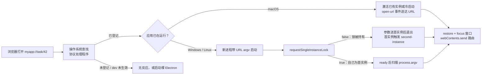

import { Canvas, Controls, Meta } from '@storybook/addon-docs/blocks';
import * as DeepLinks from './deep-links.stories';

<Meta of={DeepLinks} name="Docs" />

# 深链与单实例

窗口之外，应用还有第二个入口：浏览器里点开 `myapp://task/42`，操作系统要把这条链接交给你的应用——无论它没在运行（冷启动）还是已经开着（热唤起），你的代码都要接到 URL 并落到窗口。本课把这件事拆成两个配合的机制：**注册**（`app.setAsDefaultProtocolClient`）把应用登记进系统的「协议 → 处理程序」表，解决「系统能不能找到你」；**单实例锁**（`app.requestSingleInstanceLock`）保证唤起合并到唯一实例，解决「落到谁」。读完你应能预测：三个平台上点同一条深链，URL 各自走哪条路径进入代码，以及为什么 dev 模式下点深链常常「没反应」。



关键 API 与约束先收进参考表（默认值与官方文档核对）：

| API / 事件 | 平台 | 默认与关键约束 |
| --- | --- | --- |
| `app.setAsDefaultProtocolClient(protocol[, path, args])` | 全平台（`path` / `args` 仅 Windows） | `path` 默认 `process.execPath`，`args` 默认 `[]`；返回 `boolean` 表示调用是否成功 |
| `app.isDefaultProtocolClient(protocol[, path, args])` | 全平台 | 当前可执行文件是否已是该协议的默认处理程序 |
| `app.removeAsDefaultProtocolClient(protocol[, path, args])` | macOS / Windows | 是默认处理程序时移除登记 |
| `'open-url'` 事件 | macOS | 参数 `(event, url)`；监听必须注册在 `ready` 之前 |
| `app.requestSingleInstanceLock([additionalData])` | 全平台 | 返回 `false` 表示已有实例持锁，本进程应退出 |
| `'second-instance'` 事件 | 全平台 | 参数 `(event, argv, workingDirectory, additionalData)`；保证在 `ready` 之后触发 |
| `app.hasSingleInstanceLock()` / `releaseSingleInstanceLock()` | 全平台 | 查询 / 释放锁 |

两个边界先划清：`myapp://` 这种 **OS 级深链**与「[自定义协议](?path=/docs/custom-protocol--docs)」的 `app://` 应用内协议是两回事——`protocol.handle` 服务的是应用窗口自己的 `loadURL`，不经过操作系统；深链的登记方是操作系统，服务的是「外部世界 → 应用」。与「[菜单](?path=/docs/menus--docs)」里 `globalShortcut` 的分工：快捷键是应用注册的键盘入口，深链是外部内容拉起应用的入口。macOS 的 `open-file` 事件（文件关联唤起）与深链同机制不同载体，本课不展开，见 `app` 文档；用 `shell.openExternal` 把 URL 交给别的应用的另一半，见「[打开外部资源](?path=/docs/shell--docs)」。

## 快速上手

沿用「[接入 TypeScript](?path=/docs/typescript-setup--docs)」的 vite-typescript 工程。目标：应用能被 `myapp://` 唤起，唤起后恢复窗口并路由，全程约 10 分钟，其中打包安装占大头——dev 模式验证不了深链，这是平台约束而不是配置错误（原因见「注册协议处理」）。

第 1 步，在模板 `src/main.ts` 基础上加三段骨架（完整文件见本课目录的 `main.ts`）：

```ts
const SCHEME = 'myapp';

// 1. 单实例锁：false 说明已有实例持锁，本进程送达参数后退出
const gotTheLock = app.requestSingleInstanceLock();
if (!gotTheLock) {
  app.quit();
} else {
  // 2. 注册协议：macOS 只认打包期写入 Info.plist 的协议
  if (process.defaultApp) {
    // 开发模式（electron .）：登记可执行文件 + 入口脚本，仅 Windows / Linux 有意义
    if (process.argv.length >= 2) {
      app.setAsDefaultProtocolClient(SCHEME, process.execPath, [path.resolve(process.argv[1])]);
    }
  } else {
    app.setAsDefaultProtocolClient(SCHEME);
  }

  // 3. 两条送达路径：macOS 的 open-url、Windows / Linux 的 second-instance
  app.on('open-url', (event, url) => {
    event.preventDefault();
    handleDeepLink(url); // 校验后路由，完整写法见「唤起链路与完整模式」
  });
  app.on('second-instance', (_event, argv) => {
    const url = argv.find((arg) => arg.startsWith('myapp://'));
    if (url) handleDeepLink(url);
  });

  app.whenReady().then(() => {
    createWindow();
    // Windows / Linux 冷启动：URL 就在自己的启动参数里
    const coldUrl = process.argv.find((arg) => arg.startsWith('myapp://'));
    if (coldUrl) handleDeepLink(coldUrl);
  });
}
```

第 2 步，按平台登记协议（完整配置见本课目录的 `forge.config.mts`）：macOS 给 `packagerConfig` 加 `protocols`，Linux 给 deb maker 加 `mimeType`，Windows 不需要打包配置。

第 3 步，`npm run make` 打包安装后验证。浏览器地址栏输入 `myapp://task/42` 回车，或用命令行：

```bash
open 'myapp://task/42'        # macOS
start myapp://task/42         # Windows（cmd / PowerShell）
xdg-open 'myapp://task/42'    # Linux
```

核对两点：无实例时应用启动并路由到深链；再点一次，已有实例被唤到前台。dev 模式（`npm start`）点深链没有反应属预期——macOS 注册不生效，Windows / Linux 启动的是裸 Electron，两种坑的分界见下一节。

## 注册协议处理

注册的本质是在操作系统的「协议 → 处理程序」表里登记自己。API 只有一个：`app.setAsDefaultProtocolClient`；但登记的载体三个平台各不相同——Windows 写注册表、macOS 靠 Info.plist 声明加 Launch Services、Linux 靠 .desktop 文件。载体不同决定了登记时机不同：Windows / Linux 运行时注册即可，macOS 必须在打包期声明，Linux 在安装期登记。本课所有「dev 下不生效」的坑都源于这一点。

### setAsDefaultProtocolClient 的基本语义

- `protocol` 不带 `://`：处理 `myapp://` 链接就传 `'myapp'`；
- `path` / `args` 仅 Windows 生效，默认 `process.execPath` 与 `[]`——含义是「登记哪个可执行文件、给它带什么参数」；
- 返回 `boolean`，表示调用是否成功。

官方对注册效果的描述：登记之后，所有 `your-protocol://` 链接都会用当前可执行文件打开，**完整链接（含协议）作为参数传入**。这句话是 Windows / Linux 深链机制的根源——URL 以命令行参数的形态进入新进程，后面「唤起链路」里的 argv 一节全部由此推出。

### macOS：Info.plist 与 Forge 配置

官方约束：macOS 上只能注册已经写入应用 Info.plist 的协议，且运行时不可修改。`setAsDefaultProtocolClient` 在 macOS 上更像「领取」——先在打包期把协议声明进 `CFBundleURLTypes`，注册才有对象。Forge 把声明做成打包配置（本课示例见 `forge.config.mts`）：

```ts
// forge.config.mts
packagerConfig: {
  protocols: [
    // name 是系统设置里显示的处理程序名，schemes 是协议名数组
    { name: 'MyApp', schemes: ['myapp'] },
  ],
},
```

它会在打包时写入 Info.plist 的 `CFBundleURLTypes`（`CFBundleURLSchemes` 列出 `myapp`）。官方对 `open-url` 的完整要求还包括 Info.plist 里 `NSPrincipalClass` 为 `AtomApplication`——两项是否都在，可解包安装产物核对 Info.plist。

推论：开发模式（`electron .`）跑的是 node_modules 里的 Electron.app，它的 Info.plist 没有你的 scheme，注册调用不生效——深链要打包后验证。官方教程原文：深链「只在应用打包后可用」（this feature will only work when your app is packaged）。

### Windows：注册表与开发模式传参

官方注明 Windows 上的内部实现是写注册表，登记内容就是 `path` + `args`。打包应用里 `process.execPath` 指向安装后的可执行文件，默认注册即可：

```ts
app.setAsDefaultProtocolClient('myapp');
```

开发模式的坑：`electron .` 跑起来时 `process.execPath` 指向 node_modules 里的 `electron.exe`，且不带应用参数——点深链启动的是「裸 Electron」默认应用，你的代码全程不参与。教程给出的开发模式写法：把入口脚本作为参数一起登记，也就是快速上手里的 `process.defaultApp` 分支（`setAsDefaultProtocolClient(SCHEME, process.execPath, [path.resolve(process.argv[1])])`）。

打包后的另一处差异是 Squirrel。2026-10 核实：官方教程与 `app` 文档均已不含 Squirrel 相关的深链说明；但 Squirrel.Windows 的安装布局带来的问题依然真实——应用装在 `%LocalAppData%\AppName\app-<版本>\` 下，默认注册把版本目录写进注册表，升级到 `app-<新版本>` 后旧目录被清理，深链随之失效。社区通行做法是把注册指向不随版本变化的 `Update.exe`（**未在官方文档收录，未核实**）：

```ts
// Squirrel.Windows 安装下的通行做法（社区经验，非官方文档）
const updateExe = path.resolve(path.dirname(process.execPath), '..', 'Update.exe');
app.setAsDefaultProtocolClient(SCHEME, updateExe, ['--processStart', 'MyApp.exe']);
```

`--processStart` 是 `Update.exe` 的启动子命令，由它拉起当前版本目录里的应用——与自动更新课讲的 `--squirrel-install` 等**安装期**参数是两回事。

### Linux：.desktop 与 mimeType

Linux 的登记载体是桌面环境的 .desktop 文件：安装包把 `x-scheme-handler/myapp` 写进 `MimeType` 键，登记发生在安装时。Forge 的 deb maker 直接支持（本课示例见 `forge.config.mts`）：

```ts
new MakerDeb(
  { options: { mimeType: ['x-scheme-handler/myapp'] } },
  ['linux'],
);
```

rpm 产物同理需要 .desktop 登记。验证用 `xdg-open 'myapp://task/42'`；怀疑系统默认处理程序不对时，用 `xdg-mime query default x-scheme-handler/myapp` 查当前登记指向谁。

### 查询与移除

三个方法同形（`protocol[, path, args]`），收进一张回查表：

| 方法 | 返回 | 用途 |
| --- | --- | --- |
| `isDefaultProtocolClient('myapp')` | `boolean` | 当前可执行文件是否仍是默认处理程序——排查「升级后深链失效」的自检入口 |
| `removeAsDefaultProtocolClient('myapp')` | `boolean` | 是默认处理程序时移除登记 |
| `setAsDefaultProtocolClient('myapp')` | `boolean` | 登记；`path` / `args` 仅 Windows 生效 |

平台例外一条：Windows Store（appx / msix 打包）里 `setAsDefaultProtocolClient` 对所有调用返回 `true`，但写入的注册表键其他应用无法访问——协议要在打包 manifest 里声明才能成为默认处理程序。Forge 主线不产出 msix，这个坑只对商店分发的应用成立。

## 单实例锁

单实例锁回答的问题是：第二个进程出现时谁接客。深链在 Windows / Linux 上的机制就是「带参数启动新进程」——没有锁，每次点深链都会多开一个实例；有了锁，新进程在启动初期就知道自己该退场，参数由它转交给首实例。

### requestSingleInstanceLock 的语义

```ts
const gotTheLock = app.requestSingleInstanceLock();
if (!gotTheLock) {
  app.quit(); // 已有实例持锁：本进程只是深链的「信使」
}
```

官方语义：返回 `true` 表示当前进程是主实例，应继续加载；返回 `false` 表示应立即退出——参数已经发送给持锁实例。惯例放在主进程入口最顶部、任何窗口创建之前：拿锁要赶在其他实例可能启动之前，放慢了会留下「双开」的竞态窗口。

可以传 `additionalData`（JSON 对象）给首实例。注意消息上限：macOS / Linux 上第二实例的命令行参数与 additionalData 作为**单条消息**发送，上限 32MB——超限消息被整体丢弃，方法仍返回 `false`，但首实例**不会**触发 `second-instance`。

回查：`hasSingleInstanceLock()` 查询当前是否持锁；`releaseSingleInstanceLock()` 释放锁，之后应用可以再次多开。

### second-instance 事件：argv 送达

```ts
app.on('second-instance', (_event, argv, workingDirectory, additionalData) => {
  const url = argv.find((arg) => arg.startsWith('myapp://'));
  if (url) routeDeepLink(url);
});
```

- 参数是 `(event, argv, workingDirectory, additionalData)`，在首实例触发；官方注明常见响应是「聚焦主窗口并取消最小化」。
- 事件**保证在 `ready` 之后**发出——处理函数里可以放心使用窗口和已初始化的模块。
- argv 有两个官方明示的坑：顺序可能变化、可能被 Chromium 附加参数污染（如 `--original-process-start-time`）。教程示例取「末项」（`commandLine.pop()`），更稳的写法是按 `scheme://` 前缀扫描；第二实例由**不同用户**启动时 argv 不含参数。
- 官方建议需要「与第二实例收到的参数完全一致」时改用 additionalData 传递——深链场景里，第二实例可以把自己 argv 里的 URL 解析出来放进 `requestSingleInstanceLock({ url })`，首实例从第四参拿到干净值。

### macOS 的分工：系统单实例与 activate

macOS 不需要锁来合并深链：官方注明系统在用户经 Finder 二次打开时自动强制单实例，并把启动参数转成 `open-url` / `open-file` 事件送达已有实例。但这条系统机制管不到命令行启动——命令行二次启动会绕过合并，此时 `requestSingleInstanceLock` 才是兜底。锁在 macOS 上的定位：**深链路径不需要它，命令行路径需要它**。

窗口侧的分工：macOS 冷启动时 `open-url` 在启动早期送达，窗口可能还不存在——URL 先暂存；已有实例被激活而恰好没有可见窗口时，`activate` 事件负责重建窗口（窗口恢复见「[应用生命周期](?path=/docs/app-lifecycle--docs)」）。两条路径最终都落到同一段路由代码。

平台分工收进一张表：

| | macOS | Windows / Linux |
| --- | --- | --- |
| 送达事件 | `open-url`（参数就是 URL） | `second-instance`（URL 在 argv 里） |
| 冷启动 | `open-url` 启动早期送达，先暂存 | `ready` 后扫描自己的 `process.argv` |
| 锁的必要性 | 深链路径不需要；命令行多开需要 | 必需——没有锁就多开实例 |
| 监听注册时机 | 必须在 `ready` 之前 | 任意时机（事件保证在 `ready` 之后） |

## 唤起链路与完整模式

把两个机制合成一条链：**注册决定系统能不能找到你，锁决定唤起落到谁，事件决定 URL 从哪个参数进来**。下面的沙盘把「平台 × 运行形态 × 实例状态」的矩阵摆在一起（真实 Electron 无法在浏览器运行，这里按官方文档行为模拟；真实代码见本课目录的 `main.ts`）：

<Canvas of={DeepLinks.Interactive} />
<Controls of={DeepLinks.Interactive} />

| 读者操作 | 可观察证据 |
| --- | --- |
| macOS + 打包应用，分别切「无实例 / 已有实例」再点深链卡片 | 冷启动走「暂存 → 窗口加载后路由」；已有实例被系统直接激活，`open-url` 送达 |
| 切到 Windows / Linux + 打包应用 | 已有实例走 `second-instance` 五步链；无实例自己扫 argv |
| 关掉「打包应用」再点深链 | 暴露两个 dev 坑：macOS 无处理程序；Windows / Linux 裸 Electron |
| 打开 Show code | 看到该 Canvas 实际执行的 `wake-sim.ts` |

### 冷启动与热唤起

冷启动与热唤起是同一条链的两个分支，各有一个「取 URL」的动作：

- **Windows / Linux 冷启动：** 深链 URL 在自己的启动参数里，`ready` 后扫描 `process.argv`。教程的写法是检查最后一项是否以 `scheme://` 开头；按前缀扫描的版本更能抗参数污染。
- **macOS 冷启动：** `open-url` 在启动早期送达（可能早于 `ready`、早于窗口存在）——监听注册在 `ready` 之前就是为了接住这一次；URL 先暂存，窗口加载完成后再路由。
- **热唤起：** Windows / Linux 靠 `second-instance` 的 argv；macOS 系统直接激活实例并送达 `open-url`。

`main.ts` 里对应的暂存骨架（无窗口时 `routeDeepLink` 自行暂存，`whenReady` 里统一消费）：

```ts
let pendingUrl: string | null = null;

app.on('open-url', (event, url) => {
  event.preventDefault();
  handleDeepLink(url);
});

app.whenReady().then(() => {
  createWindow();
  const coldUrl = extractDeepLink(process.argv);
  if (coldUrl) handleDeepLink(coldUrl);
});
```

### 路由到渲染端

收到 URL 后的窗口动作固定三步：`restore()`（取消最小化）、`show()`、`focus()`；然后把 URL 交给渲染端路由：

```ts
function routeDeepLink(rawUrl: string): void {
  if (!mainWindow) {
    pendingUrl = rawUrl;
    return;
  }
  if (mainWindow.isMinimized()) mainWindow.restore();
  mainWindow.show();
  mainWindow.focus();
  // 窗口还在加载时渲染端收不到推送：等 did-finish-load 再发
  if (mainWindow.webContents.isLoading()) {
    mainWindow.webContents.once('did-finish-load', () => {
      mainWindow?.webContents.send('deep-link', rawUrl);
    });
  } else {
    mainWindow.webContents.send('deep-link', rawUrl);
  }
}
```

渲染端经预加载脚本订阅（`contextIsolation` 下的桥接写法见「[IPC 概念](?path=/docs/ipc-basics--docs)」）：

```ts
// src/preload.ts
contextBridge.exposeInMainWorld('deepLinks', {
  onLink: (callback: (url: string) => void) => {
    ipcRenderer.on('deep-link', (_event, url) => callback(url));
  },
});
```

渲染端拿到完整 URL 后自行解析：`new URL('myapp://task/42')` 的 `host` 与 `pathname` 对应 `task` 与 `/42`。深链是**外部输入**——解析后先校验再执行，协议、host 不在白名单内的链接直接丢弃（校验骨架见 `main.ts` 的 `handleDeepLink`）。完整主进程文件见本课目录的 `main.ts`，打包配置见 `forge.config.mts`。

## 最佳实践

- **时序三约束记牢：锁放最前、open-url 监听赶在 ready 之前、macOS 注册靠打包。** 各自的失效形态：锁晚了会双开；监听晚了丢冷启动 URL；macOS 运行时注册不生效。
- **argv 按 scheme 前缀扫描，不取固定位置。** Chromium 会追加自己的参数，教程的「取末项」在参数被污染时会取错；要绝对干净的参数，把 URL 放进 `requestSingleInstanceLock(additionalData)` 从事件第四参拿。
- **深链 URL 先校验再路由。** 协议与 host 白名单、解析失败即丢弃——深链是任何网页都能构造的外部输入，不该直接触达应用内部动作。
- **打包后用 `isDefaultProtocolClient` 自检注册。** 尤其 Squirrel 升级场景：注册还指着旧版本目录就说明要改指 `Update.exe`（通行做法，官方文档未收录）。
- **dev 阶段的验证路径分平台。** Windows / Linux 用教程的带参注册能走通 `second-instance`；macOS 没有替代路径，直接 `npm run make` 打包验证。

## 常见问题

- 开发模式点深链没反应
  分平台查。macOS：Info.plist 约束，开发模式注册不生效，属预期，打包验证。Windows / Linux：注册指向了 node_modules 的 electron 且不带入口参数，拉起的是裸 Electron 默认应用——按教程传 `process.execPath` + `[path.resolve(process.argv[1])]`（见「Windows：注册表与开发模式传参」）。
- `second-instance` 的 argv 里找不到 URL
  Chromium 会向 argv 追加自己的参数，URL 位置不保证在末尾。处理：按 `scheme://` 前缀扫描而不是取末项；或第二实例把 URL 放进 `requestSingleInstanceLock(additionalData)`，从事件第四参拿干净值。
- 深链唤起了但窗口没出现、还在最小化
  唤起处理里补全三步：`restore()` → `show()` → `focus()`。macOS 上窗口全关后还要靠 `activate` 重建窗口（见应用生命周期课）。
- 应用升级后深链失效
  Squirrel.Windows 的默认注册把版本目录写进注册表，升级后旧目录被清理。处理：改指不随版本变化的 `Update.exe` 并带 `--processStart` 参数（通行做法，官方文档未收录）；用 `isDefaultProtocolClient` 自检注册是否还在。
- `setAsDefaultProtocolClient` 返回 `true` 但深链唤不起来
  Windows Store（msix）分发时该 API 恒返回 `true`，但注册表键其他应用读不到——协议要在打包 manifest 里声明。Linux 则检查安装包的 .desktop 是否真的写入 `MimeType`：`xdg-mime query default x-scheme-handler/myapp` 查当前登记指向谁。
- 第二个进程退出了，但首实例没收到 `second-instance`
  命令行参数加 additionalData 超过单条消息 32MB 上限时消息被整体丢弃（macOS / Linux），方法仍返回 `false`、第二进程照常退出。处理：精简 additionalData——深链 URL 远小于上限，通常是往里塞了大对象所致。

## 总结回顾

摘要：

深链让外部内容把应用唤起来：`app.setAsDefaultProtocolClient` 把当前可执行文件登记为协议的默认处理程序，Windows 写注册表（运行时）、macOS 依赖 Info.plist 的 `CFBundleURLTypes`（打包期 Forge `protocols` 配置）、Linux 写 .desktop 的 `MimeType`（安装期）。URL 的送达路径按平台分化：macOS 走 `open-url` 事件（监听必须注册在 `ready` 之前，冷启动时先暂存）；Windows / Linux 是带 URL 的新进程，靠 `requestSingleInstanceLock` 把它合并到首实例——第二进程拿锁失败即退出，参数经 `second-instance` 事件（argv 按 scheme 前缀扫描）送达；没有实例时自己就是首实例，`ready` 后扫自己的 `process.argv`。macOS 的系统单实例只管 Finder 唤起，命令行多开仍要锁，无可见窗口的激活交给 `activate`。收到 URL 后固定三步 `restore` / `show` / `focus`，等 `did-finish-load` 再 `webContents.send` 给渲染端，渲染端校验白名单后解析路由。

一句话：

> 注册决定系统能不能找到你，锁决定唤起落到谁——macOS 用 open-url 送 URL，Windows/Linux 用第二进程的 argv，锁是后者唯一可靠的合并手段。

知识要点：

- 三个平台分别用什么载体登记协议？各自的登记时机（运行时 / 打包期 / 安装期）是什么？
- `setAsDefaultProtocolClient` 的 `path` / `args` 在什么平台生效、默认是什么？开发模式下的默认注册会登记出什么问题？
- `open-url` 的监听为什么必须注册在 `ready` 之前？冷启动时 URL 先于窗口到达怎么办？
- Windows / Linux 的深链 URL 从哪里来？`second-instance` 的 argv 有哪两个坑、怎么绕？
- `requestSingleInstanceLock` 返回 `false` 意味着什么？`additionalData` 什么场景该用、有什么上限？
- macOS 上系统自动合并、单实例锁、`activate` 各负责哪条路径？
- 从收到 URL 到渲染端路由之间要做哪些事？

## 参考资料

- [Electron 教程：从另一个应用启动你的应用（深链）](https://www.electronjs.org/docs/latest/tutorial/launch-app-from-url-in-another-app)
  本课事实主来源：`process.defaultApp` 注册写法、macOS「打包后才生效」约束、Forge `packagerConfig.protocols` 与 deb maker `mimeType` 配置示例、`second-instance` 的 `commandLine.pop()` 用法与冷启动 `process.argv` 检查。
- [Electron API：app](https://www.electronjs.org/docs/latest/api/app)
  `setAsDefaultProtocolClient` / `isDefaultProtocolClient` / `removeAsDefaultProtocolClient` 的签名与平台说明（注册表、`LSSetDefaultHandlerForURLScheme`、Info.plist 约束、appx 例外）、`open-url` 的 CFBundleURLTypes / NSPrincipalClass 要求与注册时机、`second-instance` 的参数与 argv 污染警告、`requestSingleInstanceLock` 的语义与 32MB 消息上限、macOS 系统单实例说明、`hasSingleInstanceLock` / `releaseSingleInstanceLock`。
