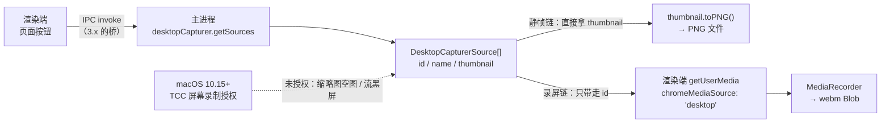

import { Canvas, Controls, Meta } from '@storybook/addon-docs/blocks';

import * as DesktopCapture from './desktop-capture.stories';

<Meta of={DesktopCapture} name="Docs" />

# 屏幕捕获

截一张整个桌面的图、录一段某个应用窗口的操作视频——这类目标都超出了「自己窗口里的页面」的范围：「[webContents](?path=/docs/webcontents--docs)」的 `capturePage` 只能拍自己窗口的页面，要把别的应用窗口、甚至整块屏幕拍进来，得换一套 API。`desktopCapturer` 补的就是这一块，但它本身不产出任何媒体——它只回答「系统里现在有哪些可捕获的东西」：每块屏幕、每扇窗口各给一条 source（附即用缩略图）。真正的画面与视频由 Chromium 的媒体栈产出。

核心判断一句话：**desktopCapturer 只在主进程可用，媒体 API 全在渲染端——惯例是主进程 `getSources`、经 IPC 桥递清单，渲染端拿 `thumbnail` 出静帧、拿 `id` 进 `getUserMedia` 出流；macOS 上两条链路前面还横着一道无法编程代劳的「屏幕录制」授权。** 读完你应能预测：截屏与录屏各走哪条链、source.id 在哪里变成媒体流、macOS 未授权时链路断在哪个环节。



关键输入与默认值先收进参考表（均已与官方文档核对）：

| 回查项 | 值 / 时机 |
| --- | --- |
| 模块归属 | `desktopCapturer` 仅主进程；渲染端经 `ipcMain.handle` + `contextBridge` 暴露（桥写法见「[双向调用](?path=/docs/ipc-invoke--docs)」与「[预加载脚本](?path=/docs/preload--docs)」） |
| `getSources(options)` | `Promise<DesktopCapturerSource[]>`；`types` 必填，取 `'screen'` / `'window'` |
| `thumbnailSize` | 默认 `{ width: 150, height: 150 }`；宽或高为 `0` 跳过缩略图生成、节省处理时间 |
| `fetchWindowIcons` | 默认 `false`；`false` 时 `appIcon` 为 `null`，`screen` 类型恒为 `null` |
| `source.id` | 形如 `screen:ZZ:0` / `window:XX:YY`；录屏链里就是 `chromeMediaSourceId` 的取值 |
| 录屏约束 | `video.mandatory.chromeMediaSource: 'desktop'` + `chromeMediaSourceId: source.id`（Chromium 非标准约束） |
| macOS 授权 | 10.15+ 需 TCC「屏幕录制」授权；检查 `systemPreferences.getMediaAccessStatus('screen')`；不能编程申请 |
| Linux PipeWire | `getSources` 只返回一条 source；两类一起请求时以窗口捕获形态返回用户的选择 |

三组相邻能力先划清边界。**页面截图**归 `capturePage`（「[webContents](?path=/docs/webcontents--docs)」已讲）：拍的是自己窗口里的页面；本课拍的是系统级屏幕与任意窗口，包括其他应用。**屏幕几何**归 `screen` API（「[系统信息与剪贴板](?path=/docs/system-apis--docs)」已讲）：`Display` 描述显示器的位置、尺寸与缩放，`source.display_id` 与它对应——它是「选哪块屏」的依据，但不产出画面。**Web 屏幕共享**归 `getDisplayMedia`：渲染端页面可以直接发起，Electron 用 `setDisplayMediaRequestHandler` 接管授予（本课最后一节）；6.2 权限 handler 里的 `'display-capture'` 权限管的正是这类申请（「[导航与弹窗控制](?path=/docs/navigation-control--docs)」已讲）。

## 快速上手

沿用「[接入 TypeScript](?path=/docs/typescript-setup--docs)」的 vite-typescript 工程。目标：页面列出可捕获对象，点一条保存 PNG 到桌面，全程三步（完整文件见本课目录的 `capture-main.ts` 与 `capture-preload.ts`）。

第 1 步，主进程注册两个 handler：

```ts
import { app, desktopCapturer, ipcMain, systemPreferences } from 'electron';
import { writeFile } from 'node:fs/promises';
import path from 'node:path';

// macOS 10.15+ 的前置：'screen' 授权无法编程申请，先检查再干活
const hasScreenAccess = () =>
  process.platform !== 'darwin' ||
  systemPreferences.getMediaAccessStatus('screen') === 'granted';

ipcMain.handle('desktop-capture:list-sources', async (_event, types: string[]) => {
  if (!hasScreenAccess()) throw new Error('缺少「屏幕录制」授权');
  const sources = await desktopCapturer.getSources({
    types: types as Array<'screen' | 'window'>,
    thumbnailSize: { width: 320, height: 180 }, // 默认 150×150；清单预览可调大些
  });
  // 缩略图在主进程转 dataURL：桥上只过纯数据
  return sources.map(({ id, name, thumbnail }) => ({
    id,
    name,
    thumbnailDataURL: thumbnail.toDataURL(),
  }));
});

ipcMain.handle('desktop-capture:save-screenshot', async (_event, sourceId: string) => {
  const sources = await desktopCapturer.getSources({
    types: ['screen', 'window'],
    thumbnailSize: { width: 1920, height: 1080 }, // 要多大给多大：thumbnail 尺寸是缩放目标
  });
  const source = sources.find(({ id }) => id === sourceId);
  // macOS 未授权的典型形态：thumbnail 是空图——写盘前拦下
  if (!source || source.thumbnail.isEmpty()) throw new Error('拿不到缩略图，检查屏幕录制授权');
  const target = path.join(app.getPath('desktop'), 'capture.png');
  await writeFile(target, source.thumbnail.toPNG());
  return target;
});
```

第 2 步，preload 暴露窄接口（两个方法，不多暴露）：

```ts
import { contextBridge, ipcRenderer } from 'electron';

contextBridge.exposeInMainWorld('desktopCapture', {
  listSources: (types: string[]) =>
    ipcRenderer.invoke('desktop-capture:list-sources', types),
  saveScreenshot: (sourceId: string) =>
    ipcRenderer.invoke('desktop-capture:save-screenshot', sourceId),
});
```

第 3 步，页面把清单渲染成缩略图按钮，点选即存：

```ts
const sources = await window.desktopCapture.listSources(['screen', 'window']);
for (const source of sources) {
  const button = document.createElement('button');
  button.innerHTML = `<span>${source.name}</span>`;
  button.onclick = () => window.desktopCapture.saveScreenshot(source.id);
  document.querySelector('#sources')?.append(button);
}
```

主进程改动要在运行 `npm start` 的终端输入 `rs` 重启（规则见「[第一次运行](?path=/docs/first-run--docs)」）。macOS 首次真实捕获时系统通常弹「屏幕录制」授权请求（没弹就到系统设置手动勾选，行为见「macOS 屏幕录制授权」）。核对三点：清单同时列出每块屏幕与每扇窗口——自己应用的窗口也在其中；点屏幕保存，桌面出现整屏 `capture.png`；把别的窗口遮挡后再截它的图，产物是完整窗口画面——这是 `capturePage` 做不到的事。

## source 与 getSources

`getSources` 的输入只有两件事：**要哪类**（`types`：`'screen'` / `'window'`）与**缩略图多大致什么样子**（`thumbnailSize`、`fetchWindowIcons`）；输出是 `DesktopCapturerSource[]`。两条链路在 source 处分叉：`thumbnail` 本身就是静帧产物，`id` 是录屏约束的钥匙。先在沙盘里把这份「输入 → 清单 → 分叉」的对应关系走一遍（`desktopCapturer` 无法在浏览器运行，这里按官方文档行为模拟；真实核对方式见快速上手）：

<Canvas of={DesktopCapture.Interactive} />
<Controls of={DesktopCapture.Interactive} />

| 读者操作 | 可观察证据 |
| --- | --- |
| types 切「仅 screen」/「仅 window」 | 清单只剩对应类型；全取时窗口与屏幕同列 |
| thumbnailSize 切「0×0（跳过）」 | 卡片缩略图变「空图」；选中后静帧链在第 1 步断开，录屏链不受影响 |
| 打开 fetchWindowIcons | 窗口卡片 appIcon 从 null 变「有」；屏幕卡片恒 null |
| 点「屏幕捕获演示（本应用）」 | id 的第三段是 1——当前进程的窗口 |
| 选中任意 source | 双链路面板展开：静帧链拿 thumbnail，录屏链拿 id 进约束 |

### id、name 与缩略图字段

`id` 是两段式字符串，录屏时**整个 id 原样**作为 `chromeMediaSourceId`，不要截取重组：

- `window:XX:YY`：XX 是窗口 id；YY 为 `1` 表示当前进程的窗口、`0` 表示其他进程（官方注记）——想在清单里标出「本应用」，比较这一段；
- `screen:ZZ:0`：ZZ 是屏幕的顺序编号——官方明示它**不是**屏幕在数组里的下标，别拿来当索引用。

其余字段的判断要点收进一张表（类型与语义均出自官方结构文档）：

| 字段 | 类型 | 判断要点 |
| --- | --- | --- |
| `id` | string | 两段式格式见上；录屏链原样传给 `chromeMediaSourceId` |
| `name` | string | 屏幕叫 `Entire Screen` / `Screen <序号>`；窗口就是窗口标题 |
| `thumbnail` | NativeImage | 官方明示**不保证尺寸等于 `thumbnailSize`**——实际尺寸按屏幕 / 窗口缩放浮动，设定值只是缩放目标；`isEmpty()` 判空图 |
| `display_id` | string | 对应 `screen` API 里同一块 Display 的 id；与 `id` 的 ZZ 段在部分平台并不一致；不可用时是空字符串 |
| `appIcon` | NativeImage \| null | 窗口所属应用的图标，尺寸不定；仅窗口类型且 `fetchWindowIcons: true` 才有值 |

`thumbnail` 要全分辨率静帧时，把 `thumbnailSize` 设成目标尺寸（例如主屏的物理像素数——DIP × `scaleFactor`，换算见「[系统信息与剪贴板](?path=/docs/system-apis--docs)」）；`thumbnail.toPNG()` / `toJPEG(quality)` / `toDataURL()` 的图像操作与 `capturePage` 同款，都是 NativeImage 的能力。

Linux 一条边界：会话走 PipeWire 时（官方注记）`getSources` 只返回**一条** source，`types` 同时给两类时，用户在系统选择器里选中的对象以「窗口捕获」形态返回——这类会话下「清单式选源」的 UI 没有意义。

## 截屏

静帧链路三步：`getSources` 拿清单 → 取 `thumbnail` → `toPNG()` 写盘。完整实现见本课目录的 `capture-main.ts`，骨架就三行：

```ts
const sources = await desktopCapturer.getSources({
  types: ['screen', 'window'],
  thumbnailSize: { width: 1920, height: 1080 }, // 成图多大，目标就给多大
});
const source = sources.find(({ id }) => id === sourceId);
await writeFile(target, source.thumbnail.toPNG()); // source.thumbnail.isEmpty() 先判空
```

两个取舍：

- **清单与成图分开取。** `getSources` 是全量枚举，`thumbnailSize` 设得越大越费时——清单刷新用小尺寸（默认 150×150 或稍大），用户选定后再按目标尺寸为那一条单独取一次。快速上手里 `list-sources`（320×180）与 `save-screenshot`（1920×1080）就是这两个口径。
- **落盘留在主进程。** `fs.writeFile` 与保存位置的选择（对话框见「[文件与对话框](?path=/docs/dialog-files--docs)」）都在主进程完成，渲染端只拿「存到哪了」的结果；要 JPEG 就换 `toJPEG(quality)`。

可观察证据：跑通快速上手后，桌面上出现整屏 PNG；双屏用户把 `types` 限定 `['screen']` 后逐条保存，能一一对上每块屏；录屏链不受 `thumbnailSize: 0` 影响（沙盘里已对照），反过来也成立——`isEmpty()` 时先查 macOS 授权再查尺寸参数。

## 录屏

录屏链路把 `id` 交给渲染端的 Web 媒体栈：`getUserMedia` 的 `mandatory` 约束指定 desktop 源，拿到 `MediaStream` 后交给 `MediaRecorder`。完整实现见本课目录的 `capture-recorder.ts`：

```ts
const stream = await navigator.mediaDevices.getUserMedia({
  audio: false,
  video: {
    mandatory: {
      chromeMediaSource: 'desktop', // Chromium 的 desktop 源，屏幕与窗口同一套约束
      chromeMediaSourceId: source.id, // 主进程递来的完整 id，传窗口 id 就只录那扇窗
    },
  },
});

const recorder = new MediaRecorder(stream, { mimeType: 'video/webm' });
recorder.start(1000); // 每秒一个分片
// ……页面交互后
recorder.stop(); // dataavailable 收完分片，stop 事件里拼 Blob
```

要点逐条：

- **约束写法是 Chromium 非标准结构。** `mandatory` 这层壳标准 Web 的 `getUserMedia` 不认识，它是 Electron 里走 desktop 源的专用写法；`chromeMediaSourceId` 必须是 `getSources` 返回的**完整** id——结构文档对 `id` 的官方定位就是「可用作 chromeMediaSourceId 约束」。官方 API 页当前的录屏示例已改走 `getDisplayMedia`（见下一节），但这条编程路径仍在结构文档明示支持。
- **录窗口 = 传窗口的 id。** 「录某个应用的操作」不需要额外 API：清单里选窗口，`chromeMediaSourceId` 给窗口 id，流里就只有那扇窗。
- **收尾固定三件事：** `stop()` 触发最后一轮 `dataavailable`，把分片拼成 `Blob`，再把 `stream` 里每个 track `stop()` 释放捕获。分片用 `start(毫秒)` 定时收——只在结束时才拿数据的话，崩溃 / 强退就丢整段。
- **产物去向两个：** `<a download>` 直接下载，或经桥回主进程 `writeFile` 存成 `.webm`（`MediaRecorder` 是 Web 标准 API，两条捕获路径的流通用）。
- **想限帧限分辨率**可在 `mandatory` 里加 `maxFrameRate` / `maxWidth` / `maxHeight` 一类成员（Chromium 约束，**未在当前官方文档逐字核实**），录制长时间会议画面时值得加。

音频是录屏最容易踩坑的部分，边界先记三条（均出自官方注记）：**系统音频不是默认就有**——Windows 原生支持；macOS 14.2+ 要求 Info.plist 声明 `NSAudioCaptureUsageDescription`（从终端 / IDE 启动时声明要落在父程序上），且启动失败是**静默**的——拿到一条哑流、没有任何警告或报错；macOS 12.7.6 及以下因需要签名内核扩展而不可用。v39 起 Chromium 在 macOS 上默认走 CoreAudio Tap，旧行为可用 `disable-features=MacCatapLoopbackAudioForScreenShare` 回退。

## macOS 屏幕录制授权

macOS 10.15 Catalina 起，屏幕捕获需要用户同意（TCC），这道门横在两条链路共同的入口上。规则收进一张表（出自官方文档）：

| 场景 | 判定与动作 |
| --- | --- |
| 检查状态 | `systemPreferences.getMediaAccessStatus('screen')` → `not-determined` / `granted` / `denied` / `restricted` / `unknown`；非 `granted` 就引导用户到 系统设置 → 隐私与安全性 → 屏幕录制 |
| 编程申请 | 不可用：`askForMediaAccess` 只收 `'microphone'` / `'camera'`，传 `'screen'` 直接 reject——「屏幕录制」只能引导用户手动勾选 |
| Windows / Linux | `getMediaAccessStatus('screen')` 恒返回 `granted`，无需处理 |
| 改了系统设置 | **必须重启应用**才生效（官方注记）——不预告就是「改了也没用」的工单 |
| 未授权的失败形态 | 缩略图空图（`isEmpty()`）/ 画面黑屏；音频则是「哑流 + 静默失败」 |

授权挂在哪个应用头上，dev 与打包不一致：TCC 认**发起捕获的进程**——dev 模式跑的是 node_modules 里的 Electron.app，从终端 / IDE 启动时授权实际落在父程序头上（官方对音频明示「父程序要承载声明」，屏幕录制行为一致，属通行观察）；打包签名后才归应用自身（签名与公证见「[签名与公证](?path=/docs/code-signing--docs)」）。所以「开发时弹的授权对象是 Electron / 终端」不是 bug。

排查顺序固定：先 `getMediaAccessStatus('screen')`，再核对系统设置里勾的是当前实际跑的那个程序，最后重启应用复测。渲染端可以经桥先问一次授权状态再决定要不要展示捕获入口，把「点了没反应」挡在点击之前。

## 屏幕共享与 getDisplayMedia

另一条路径是 Web 标准：页面直接 `navigator.mediaDevices.getDisplayMedia()`，Chromium 弹自带的选择器让用户挑——网页里的「共享屏幕」就是它。Electron 的口子在 session 上：`setDisplayMediaRequestHandler` 让**主进程**决定给什么、不给什么（官方示例形态）：

```ts
import { desktopCapturer, session } from 'electron';

app.whenReady().then(() => {
  session.defaultSession.setDisplayMediaRequestHandler(
    (_request, callback) => {
      desktopCapturer.getSources({ types: ['screen'] }).then((sources) => {
        callback({ video: sources[0], audio: 'loopback' }); // 授予主屏 + 系统声音
      });
    },
    // { useSystemPicker: true }, // 实验性：macOS 15+ 交给系统选择器，handler 不再被调
  );
});
```

渲染端照 Web 标准发起即可，流交给 `MediaRecorder` 就能录：

```ts
const stream = await navigator.mediaDevices.getDisplayMedia({ video: true, audio: true });
```

回查要点：`callback(null)` 拒绝，`getDisplayMedia` 的 Promise 以 `AbortError` reject；`audio: 'loopback'` 捕系统声音**目前仅 Windows**，`'loopbackWithMute'` 在录制时静掉本地回放，传 `WebFrameMain` 则捕获某个 webContents 的声音（`enableLocalEcho` 默认 `false`）；官方明示 `getDisplayMedia` **不允许用 deviceId 指定来源**——想编程选源（不给用户看选择器），必须走上一节的 desktopCapturer + `getUserMedia` 路径。`'display-capture'` 权限口子（6.2 已讲）管的正是 `getDisplayMedia` 的申请，两条路径的权限处置可以不同。

分工一句话：**编程选源走 desktopCapturer + getUserMedia；把选择权交给用户走 getDisplayMedia，handler 决定授予策略。**

## 最佳实践

- **桥上只过纯数据、按需最小暴露。** 缩略图在主进程转 `toDataURL()` 再过桥；窗口标题与画面属敏感内容，桥接口按动作命名（`listSources` / `saveScreenshot`）并保持最小，不把 `desktopCapturer` 的原始返回整包递进渲染端。
- **清单与成图分开取。** 小尺寸列清单、目标尺寸取成图；把全分辨率枚举塞进每次清单刷新，UI 会卡在 `getSources` 上。
- **macOS 先查授权再动手，把「重启生效」提前告诉用户。** `getMediaAccessStatus('screen')` 非 `granted` 就引导去系统设置，并明确「改完要重启应用」；渲染端经桥先问状态，别让用户点了按钮才发现没授权。
- **录屏用 `start(毫秒)` 定时分片。** 分片 + `dataavailable` 增量收集能把崩溃的损失限在一秒内；停止后记得把 stream 的 track 全部 `stop()` 释放捕获。
- **选窗口还是选屏幕按用途定。** 录单个应用的操作选窗口（画面干净）；录教学演示选整屏。要标出「本应用」的窗口，比较 `id` 第三段是否为 `1`，不要猜窗口标题。

## 常见问题

- macOS 上缩略图全是空图、录出来黑屏
  先查 `systemPreferences.getMediaAccessStatus('screen')`。非 `granted` 就是 TCC 授权缺失：系统设置 → 隐私与安全性 → 屏幕录制，勾选当前实际运行的那个程序（dev 实例勾的是终端 / IDE），改完**重启应用**再测。
- dev 模式弹的授权对象是 Electron（或终端 / IDE），不是我的应用
  TCC 认发起捕获的进程：dev 下跑的是 node_modules 里的 Electron.app，从终端 / IDE 启动时授权挂在父程序头上（官方对音频明示父程序承载声明，屏幕录制行为一致）。打包签名后才归应用自身。
- `getUserMedia` 报错拿不到流
  核对三处：约束必须放在 `video.mandatory` 下（放进标准约束层或拼错 `chromeMediaSource` 都不行）；`chromeMediaSourceId` 是 `getSources` 返回的**完整** id，没有截取重组；macOS 授权已通过。
- 缩略图尺寸和 `thumbnailSize` 设的不一样
  官方明示不保证一致——实际尺寸按屏幕 / 窗口缩放浮动，设定值只是缩放目标。预览照常用；成图按 `isEmpty()` 与实际尺寸处理，不要按设定值裁剪。
- Linux 上清单只有一条、选不了别的窗口
  PipeWire 会话的官方注记：`getSources` 只返回一条 source，两类同请求时以窗口捕获形态返回用户的选择。清单式 UI 在这类会话没有意义，改走 `getDisplayMedia` 让系统选择器接管。
- 录出来的 webm 没有声音
  系统音频有平台门槛：macOS 14.2+ 要 Info.plist 声明 `NSAudioCaptureUsageDescription` 且失败是静默的（拿到哑流、无报错）；12.7.6 及以下不可用；`'loopback'` 仅 Windows。排查顺序：平台 → plist 声明 → 是否真给了 `audio` 约束。

## 总结回顾

摘要：

本课把系统级画面捕获拆成「清单」与「媒体」两半：`desktopCapturer.getSources`（仅主进程）按 `types` 枚举屏幕与窗口，返回带 `thumbnail`、`id`、`name`、`display_id`、`appIcon` 的 source 清单，惯例经 `ipcMain.handle` + `contextBridge` 以纯数据形态递给渲染端。两条链路在 source 处分叉——静帧直接用 `thumbnail`（`thumbnailSize` 是缩放目标，实际尺寸按缩放浮动，`isEmpty()` 判空），按目标尺寸单独取一次再 `toPNG()` 写盘；录屏只带走 `id`，进 `getUserMedia` 的 `mandatory` 约束（`chromeMediaSource: 'desktop'`）换成 `MediaStream`，`MediaRecorder` 定时分片、stop 后拼成 webm Blob。macOS 10.15+ 的 TCC「屏幕录制」授权是两条链路共同的、无法编程代劳的前置：`getMediaAccessStatus('screen')` 检查、系统设置勾选、重启应用生效，未授权的形态是空图与黑屏。Web 标准的 `getDisplayMedia` 由 `setDisplayMediaRequestHandler` 接管，能借 desktopCapturer 授源但不能用 deviceId 指定来源——编程选源与交给用户选择，各走一条路径。

一句话：

> desktopCapturer 只负责回答「有什么可捕获」——thumbnail 即静帧，id 进 getUserMedia 才变成流；API 在主进程，媒体在渲染端，macOS 的屏幕录制授权是两条链路共同的、无法编程代劳的前置。

知识要点：

- `desktopCapturer`、`capturePage`、`getDisplayMedia` 各管什么捕获？为什么惯例是主进程 `getSources`、桥递清单？
- `getSources` 的 `types` / `thumbnailSize` / `fetchWindowIcons` 各控制什么？默认值是什么？`thumbnailSize` 为 0 会怎样？
- `source.id` 的两段式格式怎么读？YY 段的 `1` / `0` 各指什么？`display_id` 用来对什么？
- 静帧链的三步是什么？为什么清单与成图要分开取？
- 录屏链里 id 怎么进入 `getUserMedia`？`mandatory` 约束的结构是什么？`MediaRecorder` 收尾的三件事是什么？
- macOS 屏幕录制授权怎么检查？为什么不能编程申请？改了系统设置之后必须做什么？失败形态有哪些？
- `getDisplayMedia` 在 Electron 里由谁接管？`callback` 授予与拒绝各怎么写？deviceId 限制是什么？系统音频在各平台是什么状态？

## 参考资料

- [Electron API：desktopCapturer](https://www.electronjs.org/docs/latest/api/desktop-capturer)
  本课事实主来源：模块仅主进程的归属、`getSources` 的 `types` / `thumbnailSize`（默认 150×150、0 跳过生成）/ `fetchWindowIcons`（默认 false）语义、macOS 10.15+ 授权与 `getMediaAccessStatus` 检查、音频的 `NSAudioCaptureUsageDescription`（macOS 14.2+）与静默失败、CoreAudio Tap 默认化（v39.0.0-beta.4+）与 `disable-features` 回退、12.7.6 及以下不可用、PipeWire 单 source 注记、`getDisplayMedia` + `setDisplayMediaRequestHandler` 官方示例与 deviceId 限制。
- [Electron API：DesktopCapturerSource](https://www.electronjs.org/docs/latest/api/structures/desktop-capturer-source)
  `id` 两段式格式（`window:XX:YY` 的 YY 语义、`screen:ZZ:0` 的顺序编号非下标）、`name` 命名规则、`thumbnail` 不保证等于设定尺寸的注记、`display_id` 与 Display id 的对应及空串语义、`appIcon` 语义、`id`「可用作 chromeMediaSourceId 约束」的官方定位。
- [Electron API：systemPreferences](https://www.electronjs.org/docs/latest/api/system-preferences)
  `getMediaAccessStatus('screen')` 的取值与平台行为（Windows 恒 granted、10.15+ 需同意）、`askForMediaAccess` 仅支持 microphone / camera、系统设置改动需重启应用的注记。
- [Electron API：session](https://www.electronjs.org/docs/latest/api/session)
  `setDisplayMediaRequestHandler` 的 handler 签名与 `callback(null)` 的 AbortError、`audio: 'loopback'` / `'loopbackWithMute'` 仅 Windows、`WebFrameMain` 音频与 `enableLocalEcho`、`useSystemPicker`（实验性，macOS 15+）、`'display-capture'` 权限。
- [Electron API：NativeImage](https://www.electronjs.org/docs/latest/api/native-image)
  `toPNG()` / `toJPEG()` / `toDataURL()` / `isEmpty()` 等图像产物操作。
- [MDN：MediaRecorder](https://developer.mozilla.org/en-US/docs/Web/API/MediaRecorder)
  `start(毫秒)` 定时分片、`dataavailable` / `stop` 事件与 Blob 合并——Web 标准 API，两条捕获路径的产物通用。
