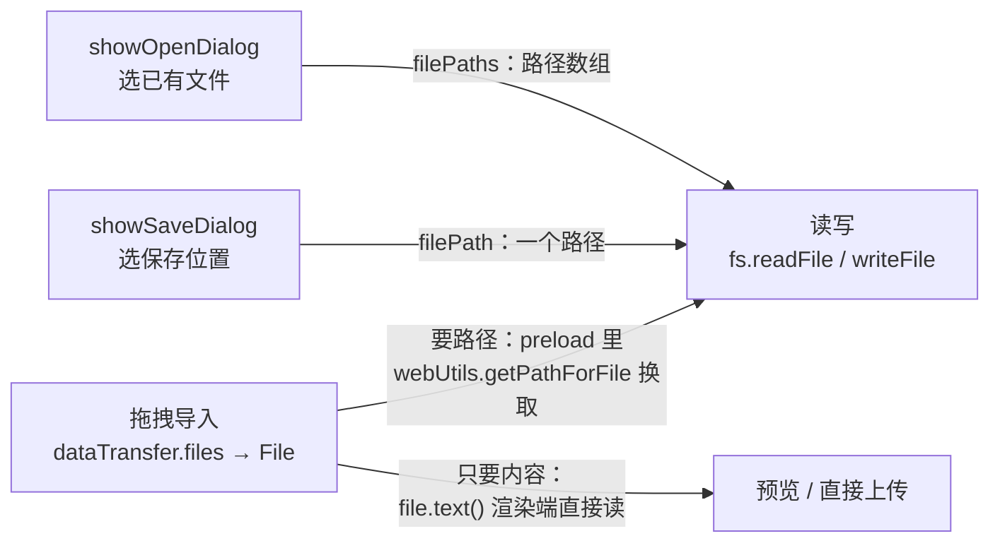

import { Canvas, Controls, Meta } from '@storybook/addon-docs/blocks';

import * as DialogFilesStories from './dialog-files.stories';

<Meta of={DialogFilesStories} name="Docs" />

# 文件与对话框

桌面应用接入本机文件有三条入口：**打开对话框**让用户挑文件，**保存对话框**让用户挑写入位置，**拖拽**让用户把文件丢进窗口。本课讲三条入口怎么接，以及它们共同的形态——入口递给你的不是文件内容，而是**选择结果**：打开对话框返回路径数组，保存对话框返回一个路径，拖拽返回 `File` 对象；真正的读写永远靠主进程的 Node `fs`。`dialog` 是主进程模块（Process: Main），渲染端只能经 IPC 触发——沿用「[双向调用](?path=/docs/ipc-invoke--docs)」建立的 invoke/handle 桥惯例。读完你应该能预测：用户点了取消会发生什么（不抛错，`canceled: true`）、`filters` 到底挡住了什么（只是界面提示）、拖进来的 `File` 怎么变成路径（`File.path` 已在 Electron 32 移除，要在 preload 里用 `webUtils.getPathForFile` 换）。



| 回查项 | 值 | 备注 |
| --- | --- | --- |
| 模块进程 | `dialog` 只在主进程（Process: Main） | 渲染端按钮经 `invoke` 触发 |
| 打开对话框 | `dialog.showOpenDialog([window, ]options)` | resolve `{ canceled, filePaths }` |
| 保存对话框 | `dialog.showSaveDialog([window, ]options)` | resolve `{ canceled, filePath }`，不创建、不写入文件 |
| 取消的形态 | 不 reject：`canceled: true` | `filePaths` 为空数组；`filePath` 为空字符串 |
| 默认起始目录 | 不设 `defaultPath` 时为用户的 Downloads | 也可传绝对目录、绝对文件路径或纯文件名 |
| filters 写法 | `[{ name: '图片', extensions: ['png'] }]` | 扩展名不带点不带星；`'*'` 表示全部 |
| 模态对话框 | 第一个参数传 `BrowserWindow` | 对话框附着到父窗口 |
| 拖拽的路径 | preload 里 `webUtils.getPathForFile(file)` | `File.path` 已在 Electron 32 移除 |
| 同步变体 | `showOpenDialogSync` 等 | 阻塞主进程；macOS 官方建议用异步版 |

## 快速上手

沿用前面课程用 Forge 创建的项目（`src/index.js` + `src/preload.js` + `src/index.html`），三步接通「选一个文本文件并显示内容」。完整参考实现在本课目录的 `dialog-main.js` 与 `dialog-preload.js`。

1. 在 `src/index.js` 注册 handler——对话框和 `fs` 都在主进程：

   ```js
   const { app, dialog, ipcMain } = require('electron');
   const { readFile } = require('node:fs/promises');

   ipcMain.handle('dialog:openTextFile', async () => {
     const { canceled, filePaths } = await dialog.showOpenDialog({
       defaultPath: app.getPath('documents'),
       filters: [{ name: '文本', extensions: ['txt', 'md'] }],
       properties: ['openFile'],
     });
     // 取消是正常分支：不抛错，用结果对象告诉渲染端
     if (canceled || filePaths.length === 0) {
       return { ok: false, reason: 'CANCELED' };
     }
     const content = await readFile(filePaths[0], 'utf8');
     return { ok: true, path: filePaths[0], content };
   });
   ```

2. 在 `src/preload.js` 把通道包装成具名函数（包装而非透传，原则见「[预加载脚本](?path=/docs/preload--docs)」）：

   ```js
   contextBridge.exposeInMainWorld('dialogs', {
     openTextFile: () => ipcRenderer.invoke('dialog:openTextFile'),
   });
   ```

3. 在 `src/index.html` 的 `</body>` 之前调用：

   ```html
   <script>
     // 页面主世界：一次 await 走完「对话框选文件 → 主进程读内容」
     const button = document.createElement('button');
     button.textContent = '打开文本文件';
     const viewer = document.createElement('pre');
     document.body.append(button, viewer);

     button.addEventListener('click', async () => {
       const result = await window.dialogs.openTextFile();
       viewer.textContent = result.ok
         ? result.content
         : `已取消（${result.reason}）`;
     });
   </script>
   ```

生效规则见「[第一次运行](?path=/docs/first-run--docs)」：改 `src/index.js` 要在运行 `npm start` 的终端输入 `rs` 重启。核对两个观察点：

- 选中一个 `.txt` 文件点「打开」→ 正文显示出文件内容——对话框、fs 读写、结果回程的完整闭环；
- 点「取消」→ `result` 是 `{ ok: false, reason: 'CANCELED' }`，**没有异常**——取消是 fulfilled 的正常分支，不是错误，这是本课最高频的误判点。

## 对话框

`showOpenDialog` 与 `showSaveDialog` 同构：都接收可选的 `BrowserWindow` 与 options，都返回 Promise。把窗口作为第一个参数传入，对话框附着到该窗口成为**模态**（macOS 上以 sheet 形式滑出）；不传则是独立对话框。Promise 只在用户点确认或取消后落定——**取消不 reject**，用 `canceled` 字段区分（异步版取消时 `filePaths` 为空数组、`filePath` 为空字符串；注意同步版 `showOpenDialogSync` 取消返回 `undefined`，两套形态不要混用）。macOS 官方建议用异步版，避开同步版展开 / 收起对话框的问题。`dialog` 模块里另有 `showMessageBox`、`showErrorBox`（消息与错误提示）和证书信任对话框——它们不产生文件路径，不属于本课的文件入口，用到时直接查 API 文档。

下面的模拟把一次「打开」画出来：切换控件改变 `filters` 与 `properties`，点文件行选择，再点「打开」或「取消」，看 Promise 的结果对象。

<Canvas of={DialogFilesStories.Interactive} />
<Controls of={DialogFilesStories.Interactive} />

| 操作 | 可观察证据 |
| --- | --- |
| 默认「文本与数据」过滤下点 `photo.png` 或 `song.mp3` | 行被置灰、不可选中——扩展名不在 `filters` 的 `extensions` 里 |
| 勾选 `openDirectory` 后点「素材」 | 文件夹进入选中（macOS 允许文件与文件夹同选） |
| 选中 `notes.txt` 后点「打开」 | Promise `fulfilled`，结果对象 `{ canceled: false, filePaths: ['/Users/you/Documents/notes.txt'] }` |
| 点「取消」 | Promise 同样 `fulfilled`，结果对象 `{ canceled: true, filePaths: [] }`——不抛错 |
| 打开 Show code | 看到该 Canvas 实际执行的 `dialog-sim.ts`（macOS 行为模拟） |

### 打开文件：showOpenDialog

```js
const { canceled, filePaths } = await dialog.showOpenDialog(win, {
  title: '选择图片',
  defaultPath: app.getPath('pictures'),
  buttonLabel: '导入',
  filters: [{ name: '图片', extensions: ['png', 'jpg'] }],
  properties: ['openFile', 'multiSelections'],
});
```

options 是本课最主要的回查面：

| options | 作用 | 备注 |
| --- | --- | --- |
| `title` | 对话框标题 | 部分 Linux 桌面环境不显示 |
| `defaultPath` | 起始目录或默认文件名 | 绝对目录、绝对文件路径或纯文件名；不设时默认用户的 Downloads |
| `buttonLabel` | 确认按钮文字 | 缺省用系统文案 |
| `filters` | 文件类型过滤 | 见下文「filters」 |
| `properties` | 行为开关 | 取值见下表 |
| `message` | 顶部提示文案 | 仅 macOS |

`properties` 按需组合，跨平台差异单独标出：

| 值 | 效果 | 平台 |
| --- | --- | --- |
| `openFile` | 可选文件 | 通用 |
| `openDirectory` | 可选文件夹 | 通用；Windows/Linux 上与 `openFile` 同给时**只显示目录选择器** |
| `multiSelections` | 可多选 | 通用 |
| `showHiddenFiles` | 显示隐藏文件 | macOS / Windows |
| `createDirectory` | 允许在对话框里新建文件夹 | macOS |
| `promptToCreate` | 目录不存在时提示创建 | Windows |
| `noResolveAliases` | 不解析别名 | macOS |
| `treatPackageAsDirectory` | 把 `.app` 等包当目录 | macOS |
| `dontAddToRecent` | 不写入最近文档 | Windows |

resolve 出的 `filePaths` 是**绝对路径数组**，多选时有多个元素。另有 `bookmarks` 字段，只在 macOS App Store 沙盒应用启用 `securityScopedBookings` 时出现，普通应用不涉及。

### 保存文件：showSaveDialog

```js
const { canceled, filePath } = await dialog.showSaveDialog({
  title: '导出报表',
  // defaultPath 给到具体文件名，即预填的文件名
  defaultPath: path.join(app.getPath('documents'), '报表.csv'),
  filters: [{ name: 'CSV', extensions: ['csv'] }],
});
if (canceled || !filePath) {
  return { ok: false, reason: 'CANCELED' };
}
await writeFile(filePath, csv, 'utf8'); // 对话框不写文件，写入是你自己的事
```

保存对话框是打开对话框的镜像：`title`、`buttonLabel`、`filters`、`message`（macOS）含义相同；特有的 `nameFieldLabel` 改文件名输入框前的标签，`showsTagField` 控制标签（tag）栏（macOS，默认 `true`），`showOverwriteConfirmation` 控制覆盖确认（Linux）。resolve 出的 `filePath` 只是**一个待写入的路径**——磁盘上还没有这个文件，用户也可以输入任意名字，`filters` 不会校验或改写它；启用 `securityScopedBookings` 的 macOS 沙盒应用除外（会在所选位置创建空文件）。

### filters：文件类型过滤

```js
filters: [
  { name: '图片', extensions: ['png', 'jpg', 'jpeg'] },
  { name: '全部文件', extensions: ['*'] },
]
```

- **写法规则**：`extensions` 里的扩展名不带点、不带星——`'png'` 对，`'.png'` 与 `'*.png'` 错；`'*'` 表示全部类型，没有其他通配符。
- **打开对话框**：不在 `extensions` 里的文件被置灰、不可选中；Windows 上多个过滤项表现为下拉菜单。
- **保存对话框**：`filters` 只是建议——不校验、不改写用户输入的文件名。

## 文件读写

对话框和拖拽都只给你路径或 `File` 对象，读写在主进程用 Node `fs` 完成——渲染端页面主世界没有 Node（`nodeIntegration` 默认关闭）。`fs` 本身的系统教学属于 Node 主题，这里只留 Electron 场景的最小用法：

```js
// 主进程：Electron 应用里最常用的四件事
const { readFile, writeFile, mkdir } = require('node:fs/promises');
const path = require('node:path');

const text = await readFile(filePath, 'utf8'); // 读文本：给编码得到字符串
const raw = await readFile(imagePath);         // 不给编码得到 Buffer（二进制）
await writeFile(filePath, content, 'utf8');    // 写文本
await mkdir(targetDir, { recursive: true });   // 父目录不存在就整链创建
```

目标目录从系统标准位置取，拼接用 `path.join`，不手写分隔符：

```js
const target = path.join(app.getPath('documents'), 'demo', 'out.txt');
```

`app.getPath` 还接受 `userData`（应用专属可写目录，放持久化数据）、`downloads`、`pictures` 等。两条安全边界：对话框选出的路径是用户亲手选的，意图可信；但**渲染端传回的任意路径字符串仍是不可信输入**——通道按能力设计（「读文本」「保存文本」），不做接收任意路径的 `readAnyFile`。大文件不要整读进内存，用 `createReadStream` 流式处理。

## 拖拽导入

拖入方向用的是标准 Web Drag and Drop API：`drop` 事件里拿到的是 `File` 对象，不是路径。**只要内容**（文本预览、直接上传）时渲染端就能读，无需路径、无需 IPC；**要路径**（转存、校验、调用只接受路径的库）时，路径在 preload 里换取：

```js
// src/preload.js：把「拖进来的 File」包装成一个读文件的能力
const { contextBridge, ipcRenderer, webUtils } = require('electron');

contextBridge.exposeInMainWorld('files', {
  // File 对象进来，路径在 preload 里用 webUtils 换取后直接交主进程——
  // 完整路径不进入页面主世界（官方建议：尽量不要把完整文件路径暴露给页面）
  readDropped: (file) =>
    ipcRenderer.invoke('files:readDropped', webUtils.getPathForFile(file)),
});
```

```html
<!-- src/index.html：拖拽区 -->
<div id="drop-zone">把文件拖到这里</div>
<script>
  const zone = document.getElementById('drop-zone');

  // 没有 dragover 的 preventDefault，drop 永远不会触发：
  // 拖入会被窗口默认行为接管（直接打开文件或导航走）
  zone.addEventListener('dragover', (event) => event.preventDefault());

  zone.addEventListener('drop', async (event) => {
    event.preventDefault();
    const files = [...event.dataTransfer.files]; // File 对象数组
    // 只要内容：渲染端直接读，无需路径、无需 IPC
    showPreview(await files[0].text());
    // 要路径：交给 preload 包装的能力，读取与校验都在主进程
    const result = await window.files.readDropped(files[0]);
  });
</script>
```

`File.path` 的边界值得单独记：这个非标准属性曾让「拖进来直接读 `file.path`」遍布旧教程，但它在 **Electron 32（2024）已移除**——现在 `file.path` 是 `undefined`，正确做法只有 preload 里的 `webUtils.getPathForFile`；它对 JS 里构造、没有磁盘 backing 的 `File` 返回空字符串。反方向——把窗口里的文件**拖出**到 Finder——是另一个 API（`webContents.startDrag`），见官方教程 Native File Drag and Drop。

## 最佳实践

- **对话框在主进程开，能力经桥包装。** 渲染端只 `await window.dialogs.openTextFile()`；通道按能力命名（读文本、保存文本），`dialog` 与 `fs` 的细节不出主进程（惯例见「[双向调用](?path=/docs/ipc-invoke--docs)」）。
- **取消是正常分支。** 每次对话框调用先判 `canceled`（或空数组 / 空字符串）再使用路径；同步版与异步版的取消形态不同，不混用。
- **filters 是提示，校验自己做。** 它挡不住保存对话框里的任意输入；拿到路径后自行校验扩展名、大小与存在性再使用。
- **路径不进页面主世界。** 拖拽文件的路径在 preload 里换取后直接交主进程；给页面的信息用文件名、大小等元数据。
- **起始目录与拼接用 API。** `defaultPath` 用 `app.getPath(...)` 取标准位置，拼接用 `path.join`，不手写分隔符。

## 常见问题

- 把取消当成功：`filePaths[0]` 是 `undefined`，或保存后拿到空字符串路径
  先判取消再用路径：`if (canceled || filePaths.length === 0)`。异步版取消不 reject，返回 `canceled: true`、`filePaths` 为空数组（保存版 `filePath` 为空字符串）；`showOpenDialogSync` 取消返回 `undefined`——两套形态不要混用。
- 拖拽后读 `file.path` 得到 `undefined`
  `File.path` 已在 Electron 32 移除。在 preload 用 `webUtils.getPathForFile(file)` 换取；还在教你读 `file.path` 的教程是 Electron 31 时代的产物（见「拖拽导入」）。
- 加了 `drop` 监听但事件从不触发，文件反而被窗口直接打开
  缺 `dragover` 的 `preventDefault()`。没有它，拖入走窗口默认行为（打开文件或导航），`drop` 永远不来；`drop` 回调里同样要 `preventDefault()`。
- `filters` 写了 `'.png'` 或 `'*.png'`，对话框里类型过滤不生效
  扩展名不带点、不带星：`extensions: ['png']`；放行全部用 `'*'`，没有其他通配符。
- Windows 上 `properties` 同时给了 `openFile` 与 `openDirectory`，结果只能选文件夹
  Windows/Linux 的打开对话框不能同时选文件和目录，两者同给时按目录选择器处理。macOS 才允许同选；跨平台需要两种选择时分成两个入口。
- 保存对话框走完了，磁盘上没有文件
  `showSaveDialog` 只返回选中的路径，不创建、不写入文件。拿到 `filePath` 后自己 `fs.writeFile`（启用 `securityScopedBookings` 的 macOS 沙盒应用除外）。

## 总结回顾

摘要：

桌面应用接入本机文件的三个入口——打开对话框、保存对话框、拖拽导入——递给应用的都不是文件内容，而是选择结果：`showOpenDialog` 返回 `{ canceled, filePaths }` 路径数组，`showSaveDialog` 返回 `{ canceled, filePath }` 单个路径且不写文件，拖拽 `drop` 事件给 `File` 对象。`dialog` 是主进程模块，渲染端经 invoke/handle 桥触发；取消不抛错，用 `canceled` 字段分流（同步版形态不同）。`filters` 限定界面里可选的扩展名（不带点不带星，`'*'` 表示全部），`properties` 决定可选文件、文件夹与多选，但 Windows/Linux 不能文件目录同选。真正的读写永远在主进程：`fs.readFile` / `writeFile` 配合 `app.getPath` 与 `path.join`；拖拽的路径要在 preload 里用 `webUtils.getPathForFile` 换取（`File.path` 已在 Electron 32 移除），且尽量不要让完整路径进入页面主世界。

一句话：

> 对话框和拖拽只递给你「选择结果」——路径或 File 对象；读写永远在主进程用 fs 完成，取消是 fulfilled 的正常分支。

知识要点：

- 打开、保存对话框各返回什么对象？取消时字段是什么形态？与同步版有何不同？
- 怎么让对话框成为某窗口的模态？默认起始目录是什么、怎么改？
- `filters` 的写法规则是什么？它能替你校验用户输入吗？
- `properties` 里 `openFile`、`openDirectory`、`multiSelections` 各做什么？哪个组合在 Windows 上表现不同？
- 拖拽进来的 `File` 怎么读内容、怎么拿路径？为什么不能读 `file.path`？
- 拿到路径后的读写应该放在哪个进程？为什么通道要按能力而不是按路径设计？

## 参考资料

- [Electron API：dialog](https://www.electronjs.org/docs/latest/api/dialog)
  `showOpenDialog` / `showSaveDialog` 的 options 与 properties 取值及平台标注、resolve 值与取消语义、filters 扩展名规则、`defaultPath` 默认 Downloads、macOS 建议异步版的原文。
- [Electron API：webUtils](https://www.electronjs.org/docs/latest/api/web-utils)
  `getPathForFile` 的签名与返回值、非 File 参数抛异常、JS 构造的 File 返回空串、渲染进程模块与 preload 调用建议。
- [Electron 破坏性变更（Breaking Changes）](https://www.electronjs.org/docs/latest/breaking-changes)
  「Removed: File.path」条目：Electron 32 移除 `File.path` 的原因与 `webUtils.getPathForFile` 的官方迁移写法。
- [Electron 教程：Native File Drag and Drop](https://www.electronjs.org/docs/latest/tutorial/native-file-drag-drop)
  拖入方向使用标准 Web Drag and Drop API 的定位说明、拖出方向的 `webContents.startDrag` 用法。
- [Node.js API：fs](https://nodejs.org/api/fs.html)
  `readFile` / `writeFile` / `mkdir` 与流的完整语义；本课只取 Electron 场景的最小用法。
