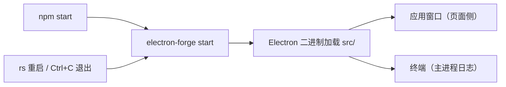

import { Meta } from '@storybook/addon-docs/blocks';

<Meta id="first-run" title="起步/第一次运行" name="Docs" />

# 第一次运行

这一课让上一课脚手架生成的项目跑起来，并建立第一个开发循环：启动、改动、生效、退出。最重要的判断先放在这里：**Forge 默认模板不会自动生效任何改动**——窗口里的文件改动刷新窗口即可，`src/index.js` 一侧的改动要让 Forge 重启（终端输入 `rs`）；单个 API 的行为疑问则移到 Electron Fiddle 里在项目外验证。

`npm start` 背后的链路是：Forge 在开发模式下用项目里的 Electron 二进制加载当前目录，把主进程日志接回终端。看懂这条链路，就知道改动落在哪一侧、日志去哪找、什么情况该重启。



| 目的 | 操作 | 生效范围 |
| --- | --- | --- |
| 启动应用 | 终端运行 `npm start` | 整个应用重新启动 |
| 页面改动生效 | 窗口内按 `Cmd+R`（Windows/Linux 为 `Ctrl+R`） | `src/index.html`、`src/index.css`、`src/preload.js` 随页面重新加载 |
| 主进程改动生效 | 运行 start 的终端输入 `rs` 后回车 | 终止并重启整个应用 |
| 退出开发服务 | 终端按 `Ctrl+C` | 结束 Forge 与 Electron 进程 |
| 验证单个 API | 在 Electron Fiddle 中运行示例 | 项目外的独立环境 |

## 快速上手

沿用上一课用 `create-electron-app` 创建的项目，进入项目目录后照做即可，全程约 5 分钟。

1. 启动开发服务：

   ```bash
   npm start
   ```

   终端先出现 Forge 的启动日志（示意，行文案随 Forge 版本略有差异，以窗口出现为准）：

   ```text
   > electron-forge start

   ✔ Checking your system
   ✔ Loading configuration
   ✔ Launching application
   ```

   随后应用窗口出现；当前默认模板会自动打开 DevTools 面板，第一次看到窗口旁边多一块面板属于正常现象。

2. 改页面文件：打开 `src/index.html`，改一处可见文本（比如标题文字），保存后在窗口内按 `Cmd+R`。可见文本立即变化，终端没有任何新输出——页面改动不需要动主进程。

3. 改主进程文件：打开 `src/index.js`，把 `createWindow` 中 `BrowserWindow` 的 `width: 800` 改成 `1000`，保存后按 `Cmd+R`——宽度不变。回到运行 start 的终端，输入 `rs` 回车，应用被终止并重启，窗口以新宽度出现。

4. 退出：终端按 `Ctrl+C`，窗口关闭，终端回到提示符。

这四步就是完整的开发循环。第 3 步里「`Cmd+R` 无效、`rs` 有效」的对照，是本课要建立的核心直觉。

## npm start 做了什么

`npm start` 执行的是 `package.json` 里脚本 `"start": "electron-forge start"`，与 `npx electron-forge start` 等价。这条命令做三件事：

1. **检查与准备。** Forge 先检查系统、加载 `forge.config.js`。默认模板没有构建步骤，`src/` 下的源文件被直接加载；如果项目带 webpack/vite 插件，插件会接管 start，先启动开发服务器再拉起应用（渲染端 HMR 等细节属于工程化课程，见「接入 TypeScript」与「集成模式」）。
2. **以开发模式启动应用。** Forge 用项目依赖里的 Electron 二进制加载当前目录（默认 `.`），即以 `src/index.js`（`package.json` 的 `main` 字段）为主进程入口运行整个项目。
3. **接管终端。** 运行期间终端归 Forge 使用：`src/index.js` 里 `console.log` 的输出、以及 Electron 自身的报错都会打回这个终端——终端是主进程日志的出口。此时输入 `rs` 回车会终止并重启应用；按 `Ctrl+C` 退出。

### start 命令的参数

以下参数都是可选的，加在 `electron-forge start` 后使用；经 npm 脚本传递时写在 `npm start --` 之后，例如 `npm start -- --enable-logging`。

| 参数 | 作用 |
| --- | --- |
| `--app-path <path>` | 改为启动指定目录的应用（默认 `.`） |
| `--enable-logging` | 额外打印 Electron 内部日志，排查启动异常时使用 |
| `--inspect-electron` | 打开主进程调试端口，配合 DevTools 调试主进程（见「调试」课程） |
| `--run-as-node` | 把 Electron 当作 Node.js 运行，用于验证脚本环境 |
| `-- <args>` | 其后的参数透传给应用本身，如 `npx electron-forge start -- --my-app-argument` |

## 让改动生效

判断规则只有一条：**改动落在哪一侧，就用哪一侧的生效方式。**

- **窗口里的页面**：`src/index.html`、`src/index.css`，以及随每次页面加载执行的 `src/preload.js`——保存后在窗口内按 `Cmd+R`（Windows/Linux 为 `Ctrl+R`）刷新即可。模板没有替换应用菜单，Electron 自带的默认菜单里就有 Reload。
- **`src/index.js`（主进程）**：刷新无效，必须让 Forge 重启——运行 start 的终端输入 `rs` 回车，或 `Ctrl+C` 后重新 `npm start`，两者效果相同，`rs` 更快。

把两种改动并排对照，现象是可复现的：

| 改动 | 保存后按 `Cmd+R` | 终端输入 `rs` 重启后 |
| --- | --- | --- |
| `src/index.html` 中的标题文字 | 生效 | 生效 |
| `src/index.js` 中 `BrowserWindow` 的 `width` | 不生效 | 生效 |

需要说明的是：以上是 Forge 默认模板的现状。**Forge 核心不监听文件变化，默认模板没有任何自动重载**；「保存即生效」的体验来自打包器模板——webpack/vite 插件接管 start 后由开发服务器提供渲染端 HMR，主进程改动的重启也由插件管理。入门阶段用 `rs` 手动重启完全够用，想要自动重载时再切换到带打包器的模板（工程化与框架集成课程展开）。

「主进程」「渲染进程」的正式模型在「进程模型」课程建立，这里先按「窗口里的页面」与「管理窗口的 `index.js`」理解即可。

## Fiddle 对照实验

[Electron Fiddle](https://www.electronjs.org/fiddle) 是官方沙盒程序：打开就有一个可运行的 quick start 模板，内置覆盖全部 Electron API 的示例，不需要任何项目配置就能改几行、点 Run、观察独立窗口的行为。它与项目实验的分工是：**项目回答真实环境的问题，Fiddle 回答单个 API 的问题。**

三个典型用法：

- **单点验证。** 某个 API 的行为拿不准时，先在 Fiddle 里用最小代码跑一遍，排除项目配置（`forge.config.js`、窗口参数、preload）的干扰。确认行为后再回项目接入。
- **版本对照。** Fiddle 可以选择 Electron 版本运行（会自动装对应版本的类型定义）。怀疑「是不是版本差异导致的行为」时，在 Fiddle 里切换版本跑同一段代码，一次就能判定。
- **保存与分享。** Fiddle 可以保存到本地或发布为 GitHub Gist，别人输入 Gist 地址即可复现你的实验；也能导出成完整项目继续开发。

排查顺序上，Fiddle 现象与项目不一致时，先对齐两边的 Electron 版本（Fiddle 里看所选版本，项目里看 `package.json` 的 `devDependencies`），再逐项检查项目侧配置——细节见下方常见问题。

## 常见问题

- `npm start` 卡住不动，或报 `RequestError`、`Unable to install Electron` 之类的下载错误
  设置镜像后重新安装依赖，再执行 `npm start`：`ELECTRON_MIRROR="https://npmmirror.com/mirrors/electron/" npm install`。判断依据：Electron 二进制由 `electron` 包在安装依赖或首次以开发模式运行时下载，这一步与 Forge 无关；下载失败时项目文件本身没有问题。
- macOS 上关闭应用窗口后，终端里的 Forge 没有退出
  这是正常行为：默认模板在 macOS 上保留进程等待再次激活，回到终端按 `Ctrl+C` 结束，或输入 `rs` 重启。Windows/Linux 上关闭窗口即退出。这套行为的完整规则在「应用生命周期」课程展开。
- 同一段代码在 Fiddle 里正常，在项目里表现不同
  先对齐两边 Electron 版本，再逐项检查项目差异：`forge.config.js` 配置、`BrowserWindow` 参数、preload 注入的接口。Fiddle 是最小环境，项目多出来的每一层配置都可能是差异来源，按「Fiddle 复现 → 项目逐层逼近」的顺序定位。

## 总结回顾

摘要：

`npm start` 执行 `electron-forge start`：Forge 在开发模式下用项目里的 Electron 二进制加载当前目录，并把主进程日志接回终端，窗口页面与终端各管一侧。默认模板不会自动生效改动——页面文件（`index.html`、`index.css`、随页面加载的 `preload.js`）刷新窗口即可，`index.js` 的改动要在终端输入 `rs` 重启；自动热重载由打包器模板的开发服务器提供，入门阶段手动重启即可。单个 API 的行为疑问交给 Electron Fiddle：项目外最小复现、切换版本对照、Gist 分享。

一句话：

> 改动不会自动生效：窗口侧刷新即可，`index.js` 一侧用 `rs` 重启；单点 API 疑问先去 Fiddle 隔离验证。

知识要点：

- `npm start` 实际执行什么命令，主进程日志出现在哪里？
- 哪些文件改动刷新窗口就能生效，哪些必须重启？
- `rs` 做了什么，它与 `Ctrl+C` 后重新 `npm start` 有何区别？
- 默认模板有没有热重载，自动重载从哪里来？
- Fiddle 的三个典型用途是什么，它与项目实验如何分工？

## 参考资料

- [Electron Forge CLI — start 命令](https://www.electronforge.io/cli)
  start 的行为定义：开发模式启动、`rs` 重启、插件接管与全部参数。
- [Electron Fiddle](https://www.electronjs.org/fiddle)
  官方沙盒：内置模板与 API 示例、版本切换、Gist 分享与项目导出。
- [Electron 文档 — 安装](https://www.electronjs.org/docs/latest/tutorial/installation)
  Electron 二进制的下载时机与 `ELECTRON_MIRROR` 镜像配置。
