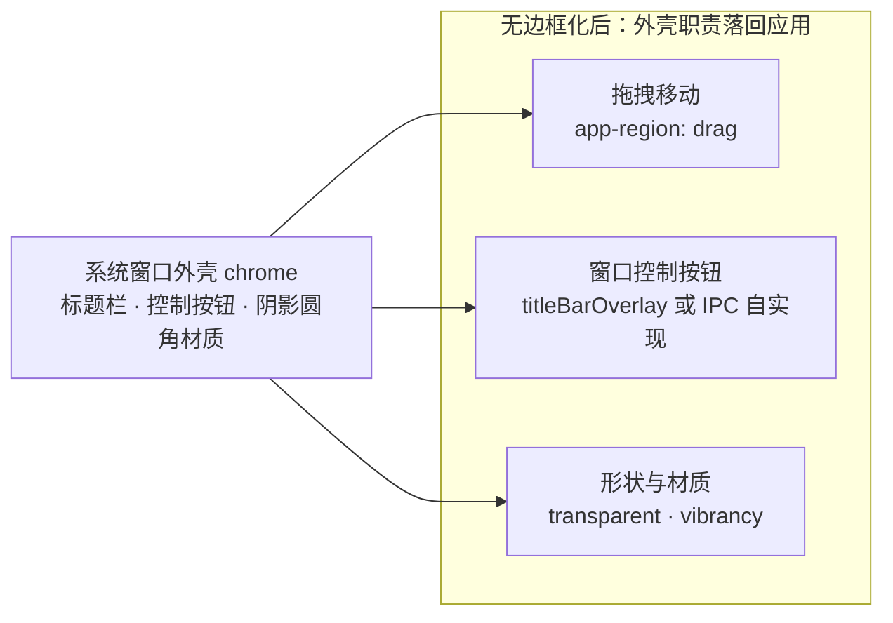

import { Canvas, Controls, Meta } from '@storybook/addon-docs/blocks';

import * as FramelessWindowsStories from './frameless-windows.stories';

<Meta of={FramelessWindowsStories} name="Docs" />

# 无边框窗口

默认窗口的标题栏、控制按钮、边缘缩放和阴影，都是操作系统绘制的窗口外壳（window chrome）。无边框窗口就是把这块外壳交回应用自己管：`titleBarStyle: 'hidden'` 只撤标题栏、控制按钮交给系统 overlay；`frame: false` 全部撤掉、控制按钮自己实现；`transparent: true` 连"窗口必须是矩形"都不保留。撤掉多少，就要补回多少——最直接的两笔账：拖拽移动要靠 CSS 标注拖拽区域，控制按钮要么开 overlay 要么经 IPC 自实现。读完你应能预测：改哪个参数窗口会少哪块、标题栏上的按钮为什么点不到、透明窗口有哪些绕不开的平台限制。



关键参数及默认值（默认值与官方文档核对，完整清单见参考资料）：

| 参数 | 默认值 | 说明 |
| --- | --- | --- |
| `frame` | `true` | `false` 移除全部系统外壳，含控制按钮 |
| `titleBarStyle` | `'default'` | `'hidden'` 隐藏标题栏：macOS 留交通灯，Windows/Linux 配 `titleBarOverlay` 才有按钮 |
| `titleBarOverlay` | `false` | 原生控制按钮覆盖层；要求 `titleBarStyle` 非 `'default'` |
| `trafficLightPosition` | 无（仅 macOS） | 交通灯自定义位置 `{ x, y }` |
| `transparent` | `false` | 透明窗口；Windows 上必须配合无边框才生效 |
| `backgroundColor` | `'#FFF'` | `transparent: true` 时支持 `#AARRGGBB` 带 alpha 颜色 |
| `hasShadow` | `true` | Wayland 上无边框窗口的 GTK 投影靠它关闭 |
| `roundedCorners` | `true` | 无边框窗口圆角；Windows 11（build 22000）之前无效，Linux 需桌面环境支持 |
| `thickFrame` | `true`（仅 Windows） | `false` 同时去掉阴影、动画与边缘缩放 |
| `vibrancy` / `backgroundMaterial` | 无（macOS / Windows 11） | 系统材质效果，主题联动见「深色模式」 |

## 快速上手

沿用前面课程用 Forge 创建的项目（`src/index.js` + `src/index.html` + `src/index.css`，见「[安装](?path=/docs/install--docs)」「[第一次运行](?path=/docs/first-run--docs)」），三步做出一个自带标题栏的无边框窗口。

1. 把 `src/index.js` 里 `createWindow` 的 `BrowserWindow` options 换成（完整参考实现在本课目录的 `custom-titlebar.js`）：

   ```js
   const mainWindow = new BrowserWindow({
     width: 900,
     height: 620,
     // 隐藏系统标题栏：内容区占满全窗，macOS 交通灯保留
     titleBarStyle: 'hidden',
     // Windows/Linux 拿回原生控制按钮（要求 titleBarStyle 不是 'default'）
     ...(process.platform !== 'darwin' ? { titleBarOverlay: true } : {}),
     // webPreferences 照模板保留
   });
   ```

2. 在 `src/index.html` 的 `<body>` 顶部加标题栏元素：

   ```html
   <div class="titlebar">我的应用</div>
   ```

3. 在 `src/index.css` 声明标题栏样式与拖拽区域：

   ```css
   .titlebar {
     height: 40px;
     display: flex;
     align-items: center;
     /* macOS 交通灯悬在左上角，给它们留出空间 */
     padding: 0 16px 0 80px;
     background: #dde5f0;
     user-select: none;
     app-region: drag;
   }
   ```

   生效规则见「[第一次运行](?path=/docs/first-run--docs)」：`src/index.js` 属于主进程，要在运行 start 的终端输入 `rs` 重启；HTML/CSS 属于页面，`Cmd+R`（Windows/Linux 为 `Ctrl+R`）刷新即可。

重启后逐项核对：

1. **标题栏整条能拖动窗口**——`app-region: drag` 把拖拽职责接了回来。
2. **macOS 左上角三颗交通灯悬在标题栏上方**——`titleBarStyle: 'hidden'` 的平台差异，交通灯属于系统控制按钮。
3. **Windows/Linux 右上角出现系统绘制的 ─ □ ×**——`titleBarOverlay: true` 补回的控制按钮。

## 三种无边框形态

无边框不是一个参数而是一组档位，按"外壳撤掉多少"分三档，档位越往下应用自管越多：

| 形态 | 写法 | 系统还保留 | 应用要补回 |
| --- | --- | --- | --- |
| 隐藏标题栏 | `titleBarStyle: 'hidden'` | 控制按钮（交通灯 / overlay）、边缘缩放、阴影圆角 | 拖拽区域 |
| 完全无边框 | `frame: false` | 边缘缩放、阴影 | 拖拽区域 + 全套控制按钮 |
| 透明窗口 | `transparent: true` + `frame: false` | 几乎没有 | 上述全部，且接受限制清单 |

选型判断：能 `'hidden'` 不 `frame`，能 `frame` 不 `transparent`。官方教程另注明本节示例对 `BrowserWindow` 与其父类 `BaseWindow` 通用；本手册路线只覆盖 `BrowserWindow`。

### 隐藏标题栏：titleBarStyle

`titleBarStyle: 'hidden'` 隐藏标题栏、内容区占满全窗，控制按钮留在系统手里：macOS 交通灯保留在左上角；Windows/Linux 必须配 `titleBarOverlay: true` 才有控制按钮，否则一个都没有。快速上手就是这一档。

overlay 的可配置项：`titleBarOverlay: true` 用系统默认配色；对象形式 `{ color, symbolColor, height }` 可定制——`color`（overlay 底色）与 `symbolColor`（按钮符号色）仅 Windows/Linux 生效、支持透明色，`height` 必须是整数。启用后渲染端可以用 CSS 环境变量读取 overlay 占用的区域（见「安全区、右键菜单与调试」）。

可观察证据：启动后 macOS 交通灯悬浮在内容之上，页面要给左上角留出空间；Windows/Linux 右上角按钮的颜色可以用 `color`/`symbolColor` 对齐页面主题。

边界：`titleBarOverlay` 要求 `titleBarStyle` 不是 `'default'`，否则被忽略——系统标题栏本来就有按钮，无需 overlay。

### 完全无边框：frame

`frame: false` 移除全部 chrome，控制按钮也在内。macOS 上交通灯同样没了——官方文档给出的等价关系：`frame: false` 配合 `win.setWindowButtonVisibility(true)` 的布局效果等于 `titleBarStyle: 'hidden'`。反过来说，macOS 上想要"无标题栏但保留交通灯"，直接用 `titleBarStyle: 'hidden'`；`frame: false` 留给控制按钮完全自绘的应用。

```js
const mainWindow = new BrowserWindow({
  frame: false,
});
```

可观察证据：启动后窗口没有标题栏、没有控制按钮，只剩内容矩形；拖不动——因为还没标注拖拽区域，这正是下一节的主题；点不到任何"最小化/关闭"——它们要按「窗口控制按钮」一节自实现。

平台差异三处，都只影响观感与缩放手感：

- **Windows：** `thickFrame` 默认 `true`，无边框窗口保留边缘缩放、阴影和动画；设 `false` 三样一起去掉，一般别关。
- **Linux（Wayland）：** 无边框窗口默认带 GTK 投影和扩展的缩放边界；要彻底无边框设 `hasShadow: false`。
- **圆角：** `roundedCorners: false`（macOS）去掉无边框窗口的圆角；Windows 11（build 22000）之前该参数无效——圆角本来就没有。

### 透明窗口：transparent

`transparent: true` 让窗口本身透明，配合透明页面背景可以做出任意形状的窗口（官方示例是一个圆形 Hello World）。它必须配 `frame: false`（Windows 上不配不生效），官方示例同时设 `resizable: false`：

```js
const mainWindow = new BrowserWindow({
  width: 200,
  height: 200,
  resizable: false,
  frame: false,
  transparent: true,
});
```

窗口透明只是外壳透明，页面自己画的背景也得跟着透明，形状用 CSS 画：

```css
body {
  margin: 0;
  background-color: rgba(0, 0, 0, 0); /* 页面背景透明 */
}
.circle {
  width: 200px;
  height: 200px;
  border-radius: 50%;
  background: #fff;
  app-region: drag; /* 透明窗口多半也不能拖动，照标拖拽区 */
}
```

`backgroundColor` 的 alpha 写法（`#AARRGGBB`）只在 `transparent: true` 时生效，可做整体半透明。

透明窗口的限制是官方明文列出的一串，用之前先过一遍：

| 限制 | 影响 / 对策 |
| --- | --- |
| 透明区域不能点击穿透 | 需要"看穿并点到桌面"用 `win.setIgnoreMouseEvents(true)`（见下方代码） |
| 不可缩放 | `resizable: true` 可能在部分平台让透明窗口直接失效，保持 `resizable: false` |
| CSS `blur()` 只作用于窗口内容 | 磨不了窗口后面的桌面；类毛玻璃用 `vibrancy` / `backgroundMaterial` |
| DevTools 打开时窗口不透明 | 调试时看起来"失效"属正常，关掉 DevTools 即恢复 |
| Windows：不能经系统菜单或双击标题栏最大化 | 自实现最大化按钮也受此影响，行为要在真机核对 |
| macOS：不显示原生窗口阴影，透明窗口偶尔留下渲染残影 | 形状边缘的立体感要自己画 |

点击穿透的最小实现：主进程接一个通道，预加载脚本包装成页面函数：

```js
// 主进程 src/index.js
ipcMain.on('set-ignore-mouse-events', (event, ignore, options) => {
  const win = BrowserWindow.fromWebContents(event.sender);
  win.setIgnoreMouseEvents(ignore, options);
});
```

```js
// src/preload.js
const { contextBridge, ipcRenderer } = require('electron');

contextBridge.exposeInMainWorld('clickThrough', {
  set: (ignore, options) => ipcRenderer.send('set-ignore-mouse-events', ignore, options),
});
```

页面在特定区域监听 `mouseenter` / `mouseleave` 调 `window.clickThrough.set(...)` 切换。`options` 传 `{ forward: true }`（macOS/Windows）时鼠标移动消息仍转发给页面，`mouseleave` 这类事件才能触发，否则窗口对鼠标彻底失明。

## 拖拽区域

无边框化后"拖拽移动"不再由系统标题栏承担，Electron 用一条 CSS 属性把标注权交给页面：`app-region: drag`（旧资料写作 `-webkit-app-region`，等价）把一块矩形标成拖拽区，`app-region: no-drag` 再把矩形从拖拽区挖掉。规则只有一条，但它是本课最常见的坑。

### 定义拖拽与点击

规则：**拖拽区域忽略区域内的一切鼠标事件**——`click`、`mouseenter`、`mouseleave` 在被拖拽区覆盖的元素上都不会触发；`no-drag` 挖出的矩形恢复指针事件。

最小表达（标题栏条 + 按钮）：

```css
.titlebar {
  height: 40px;
  app-region: drag;  /* 整条标题栏可拖动 */
  user-select: none; /* 拖动时别选中标题文字 */
}
.titlebar button {
  app-region: no-drag; /* 按钮从拖拽区挖出，恢复点击 */
}
```

漏掉 `no-drag` 时按钮彻底点不动，这不是 bug 而是规则的直接结果。下面的模拟在浏览器里复现同一条规则（被覆盖的元素不参与命中）：先拖动标题栏看窗口移动，再关掉「按钮 no-drag」点按钮，看点击被谁吞掉。

<Canvas of={FramelessWindowsStories.Interactive} />
<Controls of={FramelessWindowsStories.Interactive} />

| 操作 | 可观察证据 |
| --- | --- |
| 按住标题栏拖动 | 模拟窗口跟随移动：drag 区承担拖拽移动 |
| 保持 no-drag，点击「关闭」 | 读数显示按钮收到 click：no-drag 区恢复指针事件 |
| 关掉 no-drag，点击「关闭」 | 按钮无按下反馈，读数显示 click 被拖拽区吞掉；拖动照常生效 |
| 关掉 no-drag 后扫过按钮 | 按钮没有 hover 高亮：mouseenter 同样被吞 |

整窗拖拽的写法是把 `app-region: drag` 放到 `body` 上，此时页面里每个按钮都必须 `no-drag`，否则全部点不动——官方教程明确提醒这一点。常规应用建议只把标题栏条标成 drag，拖拽范围最小、要挖的洞也最少。

### 安全区、右键菜单与调试

- **安全区：** overlay 按钮可能在右上角也可能在左上角（随 RTL 与用户设置变化），标题栏内容别和它抢位置。启用 overlay 后，页面用 CSS 环境变量把内容约束在按钮之外：

  ```css
  .titlebar {
    margin-left: env(titlebar-area-x, 0px);
    width: env(titlebar-area-width, 100%);
    height: env(titlebar-area-height, 40px);
  }
  ```

  渲染端另有对应的 JavaScript API（`navigator.windowControlsOverlay`，Window Controls Overlay Web 标准）可读 overlay 几何、监听 `geometrychange`。

- **右键菜单：** 部分平台把拖拽区当作窗口的非客户区，右键会弹系统菜单——所以不要在拖拽区上做自定义右键菜单；确需屏蔽，在主进程监听 `system-context-menu` 事件并 `event.preventDefault()`。

- **调试：** 开发期设环境变量 `ELECTRON_DEBUG_DRAGGABLE_REGIONS=1` 启动应用，Electron 会把当前生效的拖拽区域直接画在窗口上并打印变化日志（实验性调试辅助，非正式 API）。拖拽区算错、与控件重叠时先开它。

## 窗口控制按钮

`frame: false` 之后，最小化、最大化、关闭都要自己画按钮、自己接行为。窗口方法本身（`minimize()` / `maximize()` / `unmaximize()` / `close()`）在「[创建窗口](?path=/docs/windows--docs)」的方法表里已经列过，这里只补一段链路：按钮在渲染进程，方法在主进程的窗口对象上，中间走 IPC。三个要点正好对应「[预加载脚本](?path=/docs/preload--docs)」的结论：preload 白名单包装、主进程从事件里找回窗口、状态双向同步。

第 1 步，preload 暴露三个具名函数（不透传 `ipcRenderer`）：

```js
// src/preload.js
const { contextBridge, ipcRenderer } = require('electron');

contextBridge.exposeInMainWorld('windowControls', {
  minimize: () => ipcRenderer.send('window-control', 'minimize'),
  toggleMaximize: () => ipcRenderer.send('window-control', 'toggle-maximize'),
  close: () => ipcRenderer.send('window-control', 'close'),
});
```

第 2 步，主进程按通道执行，用 `BrowserWindow.fromWebContents(event.sender)` 从事件里找回发起请求的窗口（多窗口时各自控制自己，见「[多窗口](?path=/docs/multi-window--docs)」）：

```js
// src/index.js
const { ipcMain, BrowserWindow } = require('electron');

ipcMain.on('window-control', (event, action) => {
  const win = BrowserWindow.fromWebContents(event.sender);
  if (!win) return;
  if (action === 'minimize') win.minimize();
  if (action === 'toggle-maximize') {
    if (win.isMaximized()) win.unmaximize();
    else win.maximize();
  }
  if (action === 'close') win.close();
});
```

第 3 步，页面按钮调用暴露面：

```js
document.querySelector('#btn-close').addEventListener('click', () => {
  window.windowControls.close();
});
```

状态同步：最大化之后按钮图标通常要变。状态在主进程一侧，用 `maximize` / `unmaximize` 事件推回渲染端：

```js
// src/index.js：win 创建之后注册
const sendMaximized = () => win.webContents.send('window-maximized', win.isMaximized());
win.on('maximize', sendMaximized);
win.on('unmaximize', sendMaximized);
```

preload 再暴露一个订阅函数，页面据此切换图标。`webContents.send` 的完整推送模式见「[主进程推送](?path=/docs/ipc-push--docs)」。

可观察证据：点最小化窗口收进 Dock / 任务栏；toggle-maximize 最大化后再点还原；close 触发 `close` 事件（页面可拦截，`closed` 后实例销毁，规则同「[创建窗口](?path=/docs/windows--docs)」）。

macOS 提示：这整套只对 `frame: false` 必要——`titleBarStyle: 'hidden'` 的 macOS 窗口交通灯是原生的，无需自实现。IPC 的通道命名、`invoke` / `handle` 与安全边界在通信阶段课程展开，本课只需 `send` 单向触发。

## macOS：交通灯与窗口材质

macOS 把一部分外壳调整做成了独立选项：仅 macOS 生效，其他平台设置了不报错、也不起作用。

### 交通灯

交通灯的位置与显隐各有对应 API：

| 目的 | 写法 |
| --- | --- |
| 交通灯整体内移一档（固定 inset） | `titleBarStyle: 'hiddenInset'` |
| 任意位置 | `trafficLightPosition: { x, y }`，配 `titleBarStyle: 'hidden'` 等含交通灯的形态 |
| 运行期显隐 | `win.setWindowButtonVisibility(false)`（macOS） |
| 悬停左上角才显示，想自绘交通灯、仍用原生行为 | `titleBarStyle: 'customButtonsOnHover'`（实验性） |

可观察证据：改 `trafficLightPosition` 并重启，三颗灯挪到相对窗口左上角的新坐标；`setWindowButtonVisibility(false)` 后灯消失，窗口仍可经拖拽区移动；`customButtonsOnHover` 时鼠标移到左上角灯才出现。

### 窗口材质

`vibrancy`（仅 macOS）给窗口加系统毛玻璃材质，常用值 `sidebar`、`hud`、`titlebar`、`window`、`popover`，完整值清单见 BaseWindowOptions；Windows 11 对应 `backgroundMaterial`（`mica` / `acrylic` / `tabbed`）。材质要透出来，页面背景与窗口 `backgroundColor` 都要带 alpha（如 `#00000000`）：

```js
const mainWindow = new BrowserWindow({
  titleBarStyle: 'hidden',
  vibrancy: 'sidebar',
  backgroundColor: '#00000000',
});
```

可观察证据：窗口底透出桌面内容并带系统模糊，焦点切换时材质明暗随系统变化。材质外观会随系统明暗模式切换，`nativeTheme` 的主题适配与材质联动见「[深色模式](?path=/docs/dark-mode--docs)」一课，本课不展开。

## 最佳实践

- **从 `titleBarStyle: 'hidden'` 起步，而不是 `frame: false`。** 控制按钮由系统出（交通灯 / overlay），免自实现、免状态同步、免 IPC；`frame: false` 留给要整窗自绘外壳的应用（播放器、启动器类）。三档越往下自管成本越高。
- **拖拽区最小化：只标标题栏条，不整窗 drag。** `body { app-region: drag }` 意味着每个可点元素都要补 `no-drag`，漏一处就是一个点不动的按钮。拖拽区内元素一律 `user-select: none`；上线前用 `ELECTRON_DEBUG_DRAGGABLE_REGIONS=1` 过一遍区域是否与控件重叠。
- **透明窗口当最后手段。** 先过「透明窗口」的限制清单：不可缩放、点击穿透要手动、DevTools 下失效、平台差异成串。只是想要圆角或毛玻璃时，`roundedCorners` / `vibrancy` / `backgroundMaterial` 是更便宜的正解；真需要任意形状再上 `transparent`。
- **控制按钮收成一个通道。** 一个 `window-control` 通道 + 动作参数，配一对 `maximize` / `unmaximize` 状态推送；别一个按钮一个通道，主进程注册和 preload 包装都要翻倍。

## 常见问题

- 窗口拖不动，其他都正常
  给标题栏加 `app-region: drag`。无边框化后系统不再提供拖拽，页面不标注就没有任何可拖区域；改 CSS 后刷新窗口即可生效。
- 标题栏上的按钮点不到、也没有 hover 效果
  按钮被拖拽区覆盖，拖拽区吞掉一切鼠标事件。给按钮加 `app-region: no-drag`（对照模拟见「定义拖拽与点击」）；整窗 drag 时漏掉任何一个按钮都会这样。
- 拖动标题栏时把标题文字选中了
  拖拽与文本选择冲突。给拖拽区加 `user-select: none`。
- 右键点标题栏弹出了系统菜单
  部分平台把拖拽区当非客户区，右键弹系统菜单是系统行为。不要在拖拽区上做自定义右键菜单；确需屏蔽，主进程监听 `system-context-menu` 并 `event.preventDefault()`。
- 设了 `transparent: true` 窗口还是不透明
  按序查三处：页面 `body` 背景是否透明（`rgba(0, 0, 0, 0)`）；Windows 上是否配了 `frame: false`（不配不生效）；DevTools 是否开着（开着时透明失效，属正常）。
- 透明窗口拖边缘缩放没反应，或窗口直接异常
  透明窗口不可缩放，`resizable: true` 在部分平台会让它整个失效。保持 `resizable: false`，需要更大的窗口就把初始尺寸设大。
- Windows/Linux 上 `titleBarStyle: 'hidden'` 后没有任何控制按钮
  这两个平台隐藏标题栏时系统不给按钮，要加 `titleBarOverlay: true`；同时确认 `titleBarStyle` 不是 `'default'`，否则 overlay 被忽略。
- macOS 上 `frame: false` 后找不到交通灯
  `frame: false` 移除全部外壳，交通灯也在内。要保留交通灯用 `titleBarStyle: 'hidden'`，或 `frame: false` 后调 `win.setWindowButtonVisibility(true)`——两者布局等价。

## 总结回顾

摘要：

无边框窗口的本质是一份职责合约：系统外壳（chrome）默认承担拖拽移动、控制按钮与外观材质，无边框化撤掉多少，应用就要补回多少。三档形态对应三种自管量：`titleBarStyle: 'hidden'` 只撤标题栏，控制按钮交给交通灯（macOS）或 `titleBarOverlay`（Windows/Linux），只需补拖拽区域；`frame: false` 撤掉全部外壳，控制按钮要经 preload 包装 + IPC + `BrowserWindow.fromWebContents` 自实现，并用 `maximize` / `unmaximize` 事件同步状态；`transparent: true` 连矩形都不保留，代价是官方明文的一串限制——不可缩放、点击穿透要 `setIgnoreMouseEvents`、DevTools 打开时失效。拖拽区域的规则只有一条但最常踩：`app-region: drag` 标出的矩形忽略一切鼠标事件，按钮必须 `no-drag` 挖出，标题文字要 `user-select: none`。macOS 另有交通灯定位（`hiddenInset` / `trafficLightPosition` / `setWindowButtonVisibility`）与系统材质（`vibrancy`）两组专属选项，材质与主题联动留给深色模式课程。

一句话：

> 无边框化是一份职责合约：外壳撤掉多少，应用就要补回多少——拖拽靠 `app-region`，控制按钮靠 overlay 或 IPC，形状与材质靠参数。

知识要点：

- 三种无边框形态分别怎么写？系统各保留什么、应用各要补回什么？
- `titleBarOverlay` 有什么前提？它和 macOS 交通灯各管哪些平台？
- `app-region: drag` 的区域对鼠标事件意味着什么？`no-drag` 和 `user-select: none` 各解决什么问题？
- 怎么让标题栏内容避开 overlay 按钮？用了哪些环境变量？
- `frame: false` 后自实现控制按钮的三步链路是什么？窗口状态怎么推回页面？
- 透明窗口有哪些硬限制？透明区域怎么实现点击穿透？
- macOS 上交通灯的位置与显隐分别用什么 API 调整？

## 参考资料

- [Electron 教程：Custom Window Styles](https://www.electronjs.org/docs/latest/tutorial/custom-window-styles)
  frameless 与透明窗口的创建写法、透明窗口官方限制清单、Wayland 上 `hasShadow` 的说明。
- [Electron 教程：Custom Title Bar](https://www.electronjs.org/docs/latest/tutorial/custom-title-bar)
  `titleBarStyle` / `titleBarOverlay` 用法、`app-region: drag` 自定义标题栏、`env(titlebar-area-*)` 安全区、交通灯三选项与 `frame: false` 等价关系。
- [Electron 教程：Custom Window Interactions](https://www.electronjs.org/docs/latest/tutorial/custom-window-interactions)
  拖拽区域规则（指针事件被忽略、`no-drag`、`user-select`、右键菜单）与 `setIgnoreMouseEvents` 点击穿透（`forward` 选项）。
- [Electron 教程：Window Customization](https://www.electronjs.org/docs/latest/tutorial/window-customization)
  以上三篇的索引页；窗口 chrome 概念与 `BrowserWindow` / `BaseWindow` 示例通用的说明。
- [Electron API：BrowserWindow](https://www.electronjs.org/docs/latest/api/browser-window)
  `setIgnoreMouseEvents` / `setWindowButtonVisibility` / `fromWebContents` 的签名与语义、`system-context-menu` 事件、透明窗口 macOS 残影说明。
- [Electron API：BaseWindowOptions](https://www.electronjs.org/docs/latest/api/structures/base-window-options)
  `frame` / `titleBarStyle` / `titleBarOverlay` / `transparent` / `thickFrame` / `roundedCorners` / `hasShadow` / `vibrancy` / `backgroundMaterial` 的默认值与平台限制。
- [Electron API：环境变量](https://www.electronjs.org/docs/latest/api/environment-variables)
  `ELECTRON_DEBUG_DRAGGABLE_REGIONS` 的用途与实验性声明。
- [Window Controls Overlay explainer（WICG）](https://github.com/WICG/window-controls-overlay/blob/main/explainer.md)
  CSS 环境变量与渲染端 JavaScript API（`navigator.windowControlsOverlay`）的来源规范。
