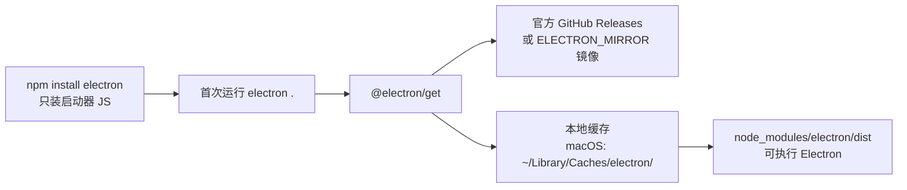

import { Meta } from '@storybook/addon-docs/blocks';

<Meta id="install" title="起步/安装" name="Docs" />

# 安装

本课把课程的开发环境搭起来：确认 Node 与平台前置条件，用 Electron Forge 脚手架创建第一个项目，再讲清安装真正落盘的东西——`electron` npm 包只是一个启动器，Electron 本体是首次运行时按需下载的预编译二进制。读完你应能预测：跑完一条 `npx` 命令会得到一个可直接启动的完整 Forge 工程；`npm install` 本身不会下载 Electron 本体；网络受阻时，第一反应是配镜像而不是反复重装。

| 回查项 | 值或命令 | 备注 |
| --- | --- | --- |
| Node.js 版本 | `>= 22.13.0`（Forge 8 的 `engines` 硬性下限） | 用 `node -v` 检查，建议直接装当前 LTS |
| Git | 需要安装 | Forge 脚手架与版本管理的前置 |
| 创建项目 | `npx create-electron-app@latest my-app` | 默认 JavaScript 模板 |
| 接入已有项目 | `npm exec --package=@electron-forge/cli -c "electron-forge import"` | 自动迁移旧配置 |
| Electron 本体 | 首次运行 `electron .` 时经 `@electron/get` 下载 | 预先下载：`npx install-electron` |
| 二进制缓存 | macOS `~/Library/Caches/electron/`，Linux `~/.cache/electron/`，Windows `%LOCALAPPDATA%/electron/Cache` | 命中缓存不再联网 |
| 镜像变量 | `ELECTRON_MIRROR="https://npmmirror.com/mirrors/electron/"` | 指向 npmmirror 的 China CDN |

## 快速上手

从零到可用项目的最小闭环。每一步的可观察结果都列在命令后面，跑完即可自查。

```bash
# 1. 确认环境：两条命令都应有输出，且 Node 版本不低于 22.13.0
node -v   # 例如 v24.10.0
git --version

# 2. 用 Forge 脚手架创建项目（最后的名 my-app 换成你自己的项目名）
npx create-electron-app@latest my-app

# 3. 观察产出：目录与关键文件已就位
ls my-app           # forge.config.js  package.json  src ...
ls my-app/src       # index.css  index.html  index.js  preload.js
```

网络受限环境先执行下面这行，再做第 2 步（原理见下文配置镜像一节）：

```bash
export ELECTRON_MIRROR="https://npmmirror.com/mirrors/electron/"
```

创建完成后项目已可运行；`npm start` 的启动过程与热重载见「第一次运行」课程。

## 环境准备

### Node 与 npm

Electron 应用由 Node.js 工具链驱动：Forge 脚手架、依赖安装和打包脚本都是 npm 包。当前发布的 Forge 8（`create-electron-app` 与 `@electron-forge/cli` 的 8.x 系列）在包清单的 `engines` 字段里声明了硬性下限 `node >= 22.13.0`，不满足时安装或运行会直接报 `Unsupported engine` 类错误。

```bash
node -v   # v22.13.0 或更高
npm -v    # 随 Node 一起安装
```

推荐用 nvm、Homebrew 或官方安装包安装当前 LTS 版本。Electron 自带运行时 Node，最终用户不需要装 Node——这里的 Node 只服务开发机。

### 平台要求

起步阶段（纯 JavaScript、不带原生模块）对系统工具链的要求很低：Electron 本体是官方预编译二进制，应用代码也不需要编译，所以三大平台开箱即用的差异主要在下载与打包环节。

| 平台 | 起步所需 | 何时需要更多 |
| --- | --- | --- |
| macOS | Node、Git（可随 Xcode Command Line Tools 安装：`xcode-select --install`） | 原生模块重编译需要完整 Xcode CLT |
| Windows | Node、Git；官方明确不建议在 WSL 里运行 Electron 应用 | 原生模块需要 Visual Studio Build Tools（含 C++ 工作负载）与 Python |
| Linux | Node、Git，及发行版基础构建工具（如 Debian/Ubuntu 的 `build-essential`） | 原生模块重编译依赖 gcc/make 等工具链 |

两点边界：一是只有项目依赖了需要按 Electron ABI 重新编译的原生模块时，才需要本地编译工具链——Forge 内置的 `@electron/rebuild` 会自动触发重编译，细节在「原生模块」课程展开；二是打包安装包（`npm run make`）所需的 Squirrel、deb、rpm 等工具由 Forge 自行下载，不需要你预装 Visual Studio 完整版，这部分属于打包课程的范围。

## 用 Forge 创建项目

创建 Electron 项目有三条路：`create-electron-app` 从零生成、`electron-forge import` 给已有项目接入、`npm install electron` 手动搭骨架。本手册主线是前两者——它们产出可开发、可打包的完整 Forge 工程；手动方式只用于理解机制，见「装了什么」一节的说明。

### create-electron-app：从零创建

`create-electron-app` 是 Forge 官方脚手架，一条命令生成带 Forge 配置的完整项目：

```bash
npx create-electron-app@latest my-app
```

命令结束后得到 `my-app/` 目录，`package.json` 与 `src/` 均已就位（文件清单见下方「装了什么」）。脚手架会把 `electron` 和各 Forge 包的**确定版本号**写进 `package.json`，此后 `npm install` 不会随上游发版漂移。

`@latest` 后缀让 npx 总是用当前发布的脚手架版本执行，配合 Forge 对 `electron` 的最新稳定版依赖，项目天然跟随当前稳定版起步。脚手架还提供 `--template` 选项切换带构建链的模板（`webpack`、`webpack-typescript`、`vite`、`vite-typescript`）；入门阶段用默认 JavaScript 模板即可，Vite 模板的工程结构在「接入 TypeScript」课程中使用。

### import：接入已有项目

已经手写或迁移来的 Electron 项目，不需要推倒重来，用 import 脚本把 Forge 接上去：

```bash
cd my-app
npm install --save-dev @electron-forge/cli
npm exec --package=@electron-forge/cli -c "electron-forge import"
```

import 会改写 `package.json`（补 Forge 脚本与配置），并尝试自动迁移既有打包工具的设置；无法识别的配置需要手工迁移。如果项目此前用过 electron-packager 等旧工具，先备份配置文件再执行。

### 装了什么

回查脚手架产出时，按三层理解：npm 脚本层、Forge 配置层、应用源码层。

`package.json` 的关键字段：

| 字段 | 脚手架产出 | 职责 |
| --- | --- | --- |
| `main` | `./src/index.js` | 主进程入口 |
| `scripts.start` | `electron-forge start` | 开发模式启动（热重载由 Forge 接管） |
| `scripts.package` | `electron-forge package` | 只打包应用目录，不出安装包 |
| `scripts.make` | `electron-forge make` | 按 makers 生成可分发安装包 |
| `scripts.release` | `electron-forge release` | 打包并发布到 publishers |
| `devDependencies` | `electron`、`@electron-forge/cli`、四个 maker、fuses 插件等 | 工具链全部是开发依赖，不进应用产物 |

`forge.config.js` 是 Forge 的项目级配置，替代命令行参数：

| 配置块 | 默认内容 | 职责 |
| --- | --- | --- |
| `packagerConfig` | `asar: true` | 打包时把应用源码装进 asar 归档 |
| `rebuildConfig` | `{}` | 原生模块重编译配置，默认交给 Forge 自动处理 |
| `makers` | `maker-squirrel`、`maker-zip`（darwin）、`maker-deb`、`maker-rpm` | 各平台安装包生成器 |
| `plugins` | `plugin-auto-unpack-natives`、`FusesPlugin` | 原生模块解包；打包时写入 Electron 安全开关（fuses） |

`src/` 下的应用源码只有四个文件：

| 文件 | 职责 |
| --- | --- |
| `src/index.js` | 主进程入口：创建 `BrowserWindow`、管理生命周期；开头有 `electron-squirrel-startup` 守卫，服务 Windows 安装版场景 |
| `src/preload.js` | 预加载脚本，模板初始为空壳 |
| `src/index.html` | 渲染端页面 |
| `src/index.css` | 渲染端样式 |

对照边界：官方教程的另一种起点是手动 `mkdir` + `npm init` + `npm install electron --save-dev` 再逐个手写文件，它能展示最小骨架但不带 Forge 配置，不能直接打包。本手册把它当作理解机制的对照物；实际项目从脚手架起步，改造空间（改 makers、加插件）都在 `forge.config.js` 里完成。

## 二进制下载与镜像

`electron` 这个 npm 包不包含 Electron 本体，安装失败多数发生在本体下载环节。理解这条下载链路，网络故障的判断和修复就有固定套路。

### 首跑下载机制

当前版本的 `electron` 包不带 postinstall 下载脚本：`npm install electron` 只安装启动器 JS 与 `node_modules/electron/` 目录骨架。JS API 绑定的预编译二进制在**第一次运行 Electron**（如 `electron .`）时才由 `@electron/get` 从 GitHub Releases 下载，并缓存到本地：



命中缓存就不再联网，所以换网络重试前先确认缓存里没有残留的坏文件。想让下载提前发生（例如在网络可控时预备好环境），用 electron 包自带的 bin 脚本：

```bash
npx install-electron
```

下载的平台与架构默认跟随当前机器，需要强制时用 `ELECTRON_INSTALL_ARCH`（如 `x64`、`arm64`）与 `ELECTRON_INSTALL_PLATFORM`（如 `darwin`、`win32`、`linux`）覆盖，一般只在交叉场景用到。

### 配置镜像

`@electron/get` 的下载地址由环境变量拼接而成：

```text
url = ELECTRON_MIRROR + ELECTRON_CUSTOM_DIR + '/' + ELECTRON_CUSTOM_FILENAME
```

`ELECTRON_CUSTOM_DIR` 默认是 `v$VERSION`。国内环境把镜像指向 npmmirror 的 China CDN 即可：

```bash
export ELECTRON_MIRROR="https://npmmirror.com/mirrors/electron/"
```

若镜像的目录结构不带 `v` 前缀（China 非 CDN 源），再补一条目录模板：

```bash
export ELECTRON_CUSTOM_DIR="{{ version }}"
```

边界两条：镜像产物与官方校验和不一致时，设置 `electron_use_remote_checksums=1`（环境变量或 `.npmrc`）让 Electron 改用远端 `SHASUMS256.txt` 校验；走 HTTP 代理而非镜像时，设置 `ELECTRON_GET_USE_PROXY` 并按 Node 版本补全局代理变量。镜像可以写进 shell 配置文件长期生效，对 `npm install`、首跑下载、`install-electron` 三条路径同时起作用。

## 最佳实践

- **创建时跟随 `@latest`，创建后由 lockfile 锁定。** 脚手架执行时取当前发布的 Forge 与 electron 最新稳定版，并把确定版本写进 `package.json`；此后依赖由 package-lock.json 固定，升级是显式动作而不是自动漂移。不要为了让示例"更新"而手改主版本号——跟随官方节奏整体升级即可。
- **网络受限环境先配镜像，再跑安装。** `ELECTRON_MIRROR` 写入 shell 配置文件一次性解决三条下载路径；失败后再排查会浪费多轮完整下载。国内网络下这是成本最低的默认动作。
- **改 Forge 行为只改 `forge.config.js`。** 脚手架产出的配置就是配置入口：换 maker、开 asar 之外的 packager 选项、加插件都在这一处完成，不要绕过配置去手写 `electron-packager` 命令，避免两套工具链并存。

## 常见问题

- `npm install electron` 或首次启动时长时间卡住，报 `EAI_AGAIN`、`ETIMEDOUT`、`ECONNRESET` 或 `ELIFECYCLE`
  先确认是本体下载环节失败（这类错误码几乎都是网络问题，不是 electron 包损坏），然后设置 `ELECTRON_MIRROR` 走镜像重试；仍失败时清掉缓存目录（macOS `~/Library/Caches/electron/`）后重下，必要时设 `force_no_cache=true` 强制跳过缓存。
- 执行 `create-electron-app` 或 Forge 命令时报 Node 版本不满足 / `Unsupported engine`
  升级 Node 到 22.13.0 或更高（Forge 8 的 `engines` 下限）再重试；用 `node -v` 确认当前值，用 nvm 切换默认版本，避免"装了新版但终端还在用旧版"。
- `npm install electron` 报 `EACCESS` 权限错误
  先按 npm 官方文档修复全局目录权限；确认必须时才按官方建议使用 `sudo npm install electron --unsafe-perm=true`，不要把 sudo 当默认习惯。
- pnpm 或 Yarn (Berry) 创建的项目在 Forge 运行或打包时找不到依赖、产物缺模块
  让依赖以真实目录落盘：pnpm 在 `.npmrc` 写 `node-linker=hoisted`，Yarn Berry 在 `.yarnrc.yml` 写 `nodeLinker: node-modules`。Forge 打包按朴素方式解析 `node_modules`，不支持符号链接布局与 PnP。

## 总结回顾

摘要：

安装 Electron 项目分两层：npm 层用 Forge 8 脚手架生成工程，环境要求是 Node 22.13.0 以上加 Git，三大平台在纯 JavaScript 起步阶段都不需要额外编译工具链；本体层是 `electron` 包首跑时经 `@electron/get` 下载的预编译二进制，落进平台缓存目录，网络不可达时用 `ELECTRON_MIRROR` 指向 npmmirror 镜像修复。已有项目用 `electron-forge import` 接入，脚手架的全部行为（makers、asar、fuses）都收敛在 `forge.config.js` 一个文件里，打包与发布阶段的一切定制都从这里开始。

一句话：

> 安装的分界线在"启动器 JS"与"预编译二进制"之间：前者交给 Forge 脚手架一条命令，后者按需下载、失败先配镜像。

知识要点：

- Forge 8 对 Node 的版本下限是多少？用什么命令验证当前环境？
- `npx create-electron-app@latest my-app` 在 my-app 里生成哪些关键文件？各自管什么？
- 为什么 `npm install electron` 结束后磁盘上还没有 Electron 本体？它何时、从哪里、被谁下载？
- 二进制缓存在 macOS 的哪个目录？换网络重试前为什么要检查它？
- 国内网络下载失败时，第一处理动作是什么？涉及哪个环境变量、指向哪个镜像？
- 已有 Electron 项目接入 Forge 用哪两条命令？Forge 行为集中改哪个文件？

## 参考资料

- [Electron Forge：创建你的应用](https://www.electronforge.io/)（脚手架命令、Node/Git 前置、四类内置模板、包管理器约束）
- [Electron Forge：接入已有项目](https://www.electronforge.io/import-existing-project)（`electron-forge import` 命令与手动兜底步骤）
- [Electron 教程：Advanced Installation Instructions](https://www.electronjs.org/docs/latest/tutorial/installation)（`@electron/get` 下载机制、镜像公式、缓存位置、安装故障排查）
- [Electron 教程：Tutorial Prerequisites](https://www.electronjs.org/docs/latest/tutorial/tutorial-prerequisites)（Node LTS、Git 与各平台前置的官方建议）
- [Electron 教程：Tutorial First App](https://www.electronjs.org/docs/latest/tutorial/tutorial-first-app)（手动 `npm init` + `npm install electron` 路线的官方出处，以及 Windows 不用 WSL 的提醒）
- [Electron 教程：Using Native Node Modules](https://www.electronjs.org/docs/latest/tutorial/using-native-node-modules)（原生模块重编译与 Forge 内置 `@electron/rebuild` 的边界）
- [@electron-forge/cli（npm）](https://registry.npmjs.org/@electron-forge/cli/latest)（`engines` 字段的 Node 版本下限，本课版本要求的事实来源）
- [create-electron-app（npm）](https://www.npmjs.com/package/create-electron-app)（脚手架包入口与用法）
