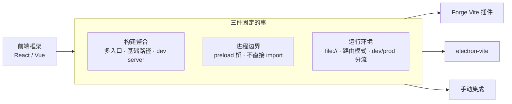

import { Meta } from '@storybook/addon-docs/blocks';

<Meta id="integration-overview" title="框架集成/集成模式" name="Docs" />

# 集成模式

前端框架（React、Vue 等）本身只是渲染端的视图层，但它进入 Electron 应用时必须跨过 Electron 特有的结构：应用至少有三个入口、两套运行时环境，打包后页面从 `file://` 加载。本课是框架集成阶段的总纲：先把"框架接入"拆成三件固定要解决的事——**构建整合、进程边界、运行环境**——再对比三条集成路线（Forge 官方 Vite 插件、electron-vite、手动集成）各自怎样替你解决它们、各挂在哪条打包链上，最后把 boilerplate 作为第四种起点简要定位。

读完你应能预测：换集成路线**不会**改变 IPC 与 preload 的写法；选路线真正影响的是构建配置放哪、dev 命令是什么、打包发布走哪条链。React 与 Vue 的具体搭建见「React 集成」「Vue 集成」两课。

| 路线 | 形态 | 配置入口 | 打包配套 | 适用与代价 |
| --- | --- | --- | --- | --- |
| Forge Vite 插件 | Forge 的 plugin（`@electron-forge/plugin-vite`，experimental） | `forge.config.mts` 里 `VitePlugin` 的 `build` / `renderer` 数组 + 三份 `vite.*.config.mts` | Forge（package / make / publisher 不变） | 已在 Forge 主线上的项目；代价是插件 experimental 状态 |
| electron-vite | 独立构建工具（自带 `dev` / `build` / `preview` CLI） | 单文件 `electron.vite.config.ts`，`main` / `preload` / `renderer` 三段 | 通常 electron-builder | 新项目、前端主导团队；代价是脱离 Forge 打包发布链 |
| 手动集成 | `vite` + 自写脚本编排 | 自建 Vite 配置与脚本 | 自选 | 特殊构建约束或学习目的；代价是三件事全部自管 |
| Boilerplate | 现成完整工程起点 | 已由模板选好 | 已由模板选好 | 快速起跑或当参考答案；代价是先接受它的全部选型 |

## 框架接入要解决的三件事

框架接入的难点从来不是 React 或 Vue 本身——它们只是渲染进程里的视图层。难点是 Electron 应用的形状：三个入口、两套运行时环境、打包后从 `file://` 加载。任何集成路线做的都是同一份工作：替你解决下面三件事。评估任何一个工具时，逐项问"它替我做了哪件、剩哪件"。

### 构建整合

一个纯前端 Vite 项目只有一个入口（`index.html` 背后的一棵依赖树）。Electron 应用至少有三个：主进程入口、preload、渲染端页面——前两个跑在 Node 环境，第三个跑在浏览器环境，依赖规则不同（Node 侧要把 `electron` 和内置模块标 external，浏览器侧打包全部依赖）。构建整合就是组织好这三条线：

- **多入口**：三条构建线各自有入口与输出目录。「[接入 TypeScript](?path=/docs/typescript-setup--docs)」一课的 Forge 方案是一例：`VitePlugin` 的 `build` 数组声明可执行进程入口，`renderer` 数组声明页面。
- **dev server**：渲染端 HMR（React Fast Refresh / Vue HMR）是框架开发体验的核心。dev server 起在 `http://localhost:5173` 这样的地址上，主进程必须拿到这个 URL 才能 `loadURL`——各路线用不同机制把 URL 递给主进程（Forge 是构建期注入的魔法常量）。
- **基础路径**：渲染端打包产物从 `file://` 加载，根相对 URL（`/logo.png`）会指向文件系统根。`base` 必须相对（`./`），这是所有路线共同遵守的约束。

判断标准三点：main / preload / renderer 改动后的重建与生效方式是否合理，dev server URL 是否可靠送达主进程，打包产物路径是否相对。

### 进程边界

框架代码只活在渲染进程。React、Vue、状态管理、路由库，全部是渲染端构建线的依赖；主进程与 preload 不引入框架——主进程没有 DOM，preload 在上下文隔离下也不该有任何视图职责。

渲染进程拿原生能力只有一条正规路径：preload 经 `contextBridge` 暴露的 `window.api`，内部走 `ipcRenderer.invoke` / `ipcMain.handle`（「[预加载脚本](?path=/docs/preload--docs)」「[双向调用](?path=/docs/ipc-invoke--docs)」两课）。「[接入 TypeScript](?path=/docs/typescript-setup--docs)」的"三点一线"类型模式（`api.ts` 类型真源 + `satisfies` 实现 + `declare global` 消费）在框架项目里原样复用——变的只是消费者从裸 DOM 代码换成 React 组件。

反模式要认识：在组件里写 `import { ipcRenderer } from 'electron'`。按安全默认（`contextIsolation` 开、`nodeIntegration` 关），渲染进程运行时根本没有这个模块；即便编译通过也不代表能运行，而且它绕过的正是安全模型本身（「[安全清单](?path=/docs/security--docs)」）。

关键结论：这条边界与集成路线无关——三种路线下 preload 都是独立构建线，产物都是单文件 CJS（沙箱约束，见「[接入 TypeScript](?path=/docs/typescript-setup--docs)」的预加载一节）。**换集成路线，IPC 与 preload 代码不用重写。**

### 运行环境

两处环境差异在框架项目里最容易踩：

**路由模式。** 打包后页面由 `loadFile` 从 `file://` 加载。前端路由的 history 模式把路径当服务器资源解释（`/users/1` 需要服务器对该路径做回退），`file://` 下没有这个机制——开发时一切正常，打包后刷新或直链子路径就白屏。桌面应用的默认选择是 hash 模式（`index.html#/users/1`，纯前端解析）；坚持 history 就要给应用配自定义协议或本地服务来承载路径（「[自定义协议](?path=/docs/custom-protocol--docs)」）。

**dev / prod 加载分流。** 主进程必须区分两种状态：开发时 `loadURL(dev server URL)`，打包后 `loadFile(产物 index.html)`。三条路线各有等价机制（Forge 的魔法常量 truthiness 分流见「[接入 TypeScript](?path=/docs/typescript-setup--docs)」；electron-vite 与手动集成靠工具或脚本注入的环境变量，写法在「React 集成」落地）。判断依据一致：主进程里能可靠回答"我现在是开发还是产物"。

另有一层小差异：Vite 的 `import.meta.env` 与 `.env` 文件体系属于渲染端构建；主进程是 Node 进程，环境变量走哪条通道、用什么前缀由路线决定。本课只立判断：**别假设三端共享同一套 env**，落地配置见「React 集成」「Vue 集成」。

## 三条集成路线

三条路线解决的是同一组问题，差别在"哪些由工具替你做、哪些留在你手里"，以及绑定哪条打包发布链。开场参考表是横览，下面按路线说清形态、适用与代价。

### Forge 官方 Vite 插件

形态：`@electron-forge/plugin-vite`，注册在 `forge.config.mts` 的 `plugins` 里。构建、dev、打包全部留在 Forge 生命周期内：`forge start` 先构建再启动，`forge package` / `forge make` 拿同一批产物打包。

三端构建结构「[接入 TypeScript](?path=/docs/typescript-setup--docs)」已完整讲过：`build` 数组声明 main 与 preload 入口，`renderer` 数组声明页面，三份 `vite.*.config.mts` 默认为空、按需覆盖；preload 固定输出 CJS 单文件；渲染端强制相对 `base`。接入框架时要做的事很集中：在 `vite.renderer.config.mts` 里装框架的 Vite 插件（React 是 `@vitejs/plugin-react`，Vue 是 `@vitejs/plugin-vue`），页面入口与路由按渲染端常规方式组织。

适用与代价：已经在 Forge 主线上的项目（手册第 1–8 章的默认线）选它，买的是**工具链统一**——打包、签名、发布、自动更新全部不用换。代价是插件自 Forge 7.5.0 起标注 experimental，小版本可能带破坏性变更；对策是锁定版本、升级前看 release notes。这是手册的默认路线，「React 集成」「Vue 集成」的搭建以此为基础。

### electron-vite

形态：独立的构建工具（alex8088 的 electron-vite），基于 Vite 但不属于 Forge——自带完整 CLI：`electron-vite dev` 起 dev server 并拉起应用，`electron-vite build` 出产物，`electron-vite preview` 本地预览产物。

配置模型是它与 Forge 插件最直观的差别：一个配置文件 `electron.vite.config.ts`，里面 `main`、`preload`、`renderer` 三段，各是一份完整的 Vite 配置；工具预置了面向 Electron 的合理默认（preload 输出、external 处理、渲染端 `base` 等），多数项目只需在 `renderer` 段加框架插件。产物默认进 `out/` 目录，`package.json` 的 `main` 指向 `./out/main/index.js`；源码通常按 `src/` 下 main、preload、renderer 分目录组织。

开发体验：渲染端 HMR 之外，主进程与 preload 支持热重载（改代码自动重启、重载），不需要像 Forge 插件那样手动 `rs` 或配置 `hotRestart`。附加能力按需了解：worker 与 utility process 的 import 后缀、主进程资源处理优化、isolated build、V8 bytecode 源码保护。

起步：官方脚手架 create-electron（`npm create @quick-start/electron@latest`）直接选框架——模板矩阵覆盖 vanilla / vue / react / svelte / solid 各配 JS 与 TS 两版，创建时还可选 Electron updater 插件与下载镜像代理；也有可 `degit` 的 electron-vite-boilerplate。

适用与代价：新项目、团队前端浓度高、想要"最像纯前端 Vite 项目"的体验时选它。代价是**脱离 Forge**：它不管安装包，打包通常交给 electron-builder——手册第 8 章的 forge publisher 与自动更新链路不适用，签名公证、发布、更新都要换生态或自建。选它等于把工具链基准从 Forge 切到 electron-vite + electron-builder。

### 手动集成

形态：不引入任何 Electron 专用封装，直接用 Vite 本体（多配置或多 entry）加自写脚本，把"构建三端 → 起 dev server → 启动 Electron"串起来（`concurrently`、`wait-on` 一类工具拼装）。

它存在的意义有两个：一是特殊约束——monorepo 里要并进既有构建体系、CI 有定制流程、工具版本被锁定；二是学习——亲手把三件事各做一遍，比读十篇对比文章更能理解另两条路线替你做了什么。

选它就要把三件事全部接在手里，最小清单：

- 三条构建线：main 与 preload 各一份 Vite 配置（`electron` 与 Node 内置标 external），renderer 一份（`base` 设相对）；
- preload 输出单文件 CJS（沙箱约束，「[接入 TypeScript](?path=/docs/typescript-setup--docs)」的边界在这里原样生效）；
- dev server URL 通过环境变量注入主进程，`main.ts` 里做 `loadURL` / `loadFile` 分流；
- main 与 preload 改动后的重启、重载策略自己写。

代价即维护面：上面每一行都是长期责任，且没有文档替你跟进 Electron 行为变化。结论句：**手动集成是学习底牌，不是效率选项。**

## Boilerplate 起点

boilerplate 是第四种起点：别人替你做完全部三件事、并已选好路线的完整工程。它的价值与代价是一体的——起步最快，但你要先接受它的全部选型，出问题时排查跨过的层也最多。

两个值得认识的样本：

- **electron-react-boilerplate（ERB）**：React 生态最老的 boilerplate 之一，工程组织成熟。它的现状能说明 boilerplate 也会换路线：构建链已迁到 electron-vite（配置在 `electron.vite.config.ts`，开发用 Vite 与 React Fast Refresh），打包用 electron-builder，原生依赖单独放在 `release/app/package.json` 里由 electron-builder 重建与打包。
- **create-electron**：electron-vite 的官方脚手架，算"轻 boilerplate"——模板新鲜、选型最少，适合从接近裸的工程开始长。

判断：想把 React 工程结构当参考答案拆着看，用 ERB；想按某条路线从零搭、看清每层接线，按「React 集成」「Vue 集成」做——本手册选择后者，因为集成课的目标是能重搭，不是能使用。

## 最佳实践

- **先定打包链，再定集成路线。** 两者是绑定的：Forge 插件落在 `forge package` / `make` / publisher 全家桶；electron-vite 落在 electron-builder 生态。先选了 electron-vite 又想要 Forge 发布链，就得同时维护两套构建编排。
- **已有 Forge 工程不迁移。** 渲染端框架化只需要在 `vite.renderer.config.mts` 加框架插件，experimental 状态用锁版本对冲；为"配置文件更好看"重排整个工程不划算。
- **框架选择与集成路线正交。** React 与 Vue 都能配任意一条路线；换框架不换路线，换路线不重写 IPC（进程边界的结论）。评估新工具时回到三件事逐项对账。
- **新项目拿不准时的默认。** 团队以桌面端为主、要完整发布链 → Forge 插件；团队以 Web 前端为主、发布要求标准 → electron-vite 脚手架起步。两者之间没有正确答案，只有与发布链的一致性。
- **boilerplate 当参考，不当真源。** 从 boilerplate 起步后，把它的选型逐项过一遍三件事，删掉用不到的层；直接在其上堆业务而不知其结构，是 boilerplate 项目最贵的用法。

## 常见问题

- 开发时路由一切正常，打包后刷新或直接访问子路径就白屏
  这是 history 路由在 `file://` 下的必然结果，不是 bug：路径回退由 dev server（http）承担，`file://` 没有这个机制。处理：路由改 hash 模式；确要 history，就用自定义协议或本地服务承载页面加载（「[自定义协议](?path=/docs/custom-protocol--docs)」）。
- 分不清"两条 Vite 集成路线"和"框架的 Vite 插件"
  `@vitejs/plugin-react` / `@vitejs/plugin-vue` 是渲染端构建插件（处理 JSX 与热刷新），只要渲染端用 Vite，三条路线里都会装它，与"Electron 集成路线"是两层决策。集成路线决定三端怎么组织，框架插件只决定渲染端怎么编译。
- electron-vite 项目想改用 Forge 打包，可行吗
  技术上拼得出来，代价是两套构建编排并存（electron-vite 的 `out/` 与 Forge 的 `.vite/` 两批产物、两条 dev 流程），一般不这么做。要 Forge 全家桶就从项目起选 Forge 插件路线；已走 electron-vite 的项目按其配套走 electron-builder（「[打包](?path=/docs/packaging--docs)」课的对比视角）。

## 总结回顾

摘要：

把前端框架接进 Electron，固定的工作量是三件事：构建整合（main、preload、renderer 三条构建线，dev server URL 送达主进程，产物 `base` 相对）、进程边界（框架只进渲染端，原生能力走 `contextBridge` + IPC，preload 独立构建为单文件 CJS）、运行环境（hash 路由配 `file://`，dev / prod 加载分流）。三条集成路线是这组工作的三种分工：Forge 官方 Vite 插件把一切留在 Forge 生命周期内，换来工具链统一，付出 experimental 风险；electron-vite 用单配置文件与自带 CLI 给出最顺的 Vite 体验，代价是打包发布换 electron-builder 生态；手动集成把三件事全部接在手里，是学习底牌而非效率选项。boilerplate 是第四种起点——选型已被做完的完整工程，适合当参考答案。React 与 Vue 的具体搭建在后续两课按本课的判断展开。

一句话：

> 集成路线的选择不是选工具，而是决定三件固定的事各由谁替你做——以及把它们绑到哪条打包发布链上。

知识要点：

- 框架接入 Electron 要解决的三件事是什么？为什么说它们与框架、路线都无关？
- 渲染进程为什么不能直接 `import` electron？正规的原生能力路径是什么？
- history 路由为什么打包后出问题？桌面应用的默认选择是什么？
- Forge Vite 插件、electron-vite、手动集成各自的配置入口、dev 命令与打包配套是什么？
- 为什么说集成路线与打包链是绑定的？换路线时什么代码不用重写？
- boilerplate 的价值与代价是什么？ERB 当前用的构建方案是什么？

## 参考资料

- [Electron Forge：Vite Plugin](https://www.electronforge.io/config/plugins/vite)（插件形态、experimental 状态与三端配置结构，「[接入 TypeScript](?path=/docs/typescript-setup--docs)」一课已据其核实）
- [electron-vite 官网](https://electron-vite.org/)（工具定位、HMR 与热重载、isolated build、V8 bytecode 等能力总览）
- [electron-vite：Getting Started](https://electron-vite.org/guide/)（`dev` / `build` / `preview` CLI、`electron.vite.config` 单文件三段、`out/` 产物约定、create-electron 脚手架与模板矩阵）
- [electron-vite（GitHub）](https://github.com/alex8088/electron-vite)（工具主页，RESOURCES.md 收录）
- [electron-react-boilerplate（GitHub）](https://github.com/electron-react-boilerplate/electron-react-boilerplate)（electron-vite + React Fast Refresh 现状、electron-builder 打包、`release/app` 原生依赖组织）
- [Electron 官方文档](https://www.electronjs.org/docs/latest)（进程模型与安全默认的一手依据）
