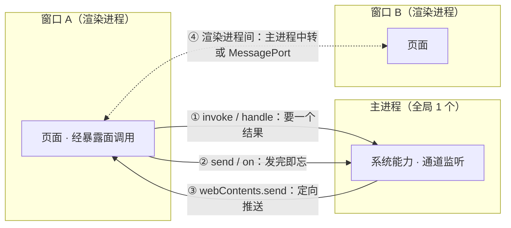

import { Canvas, Controls, Meta } from '@storybook/addon-docs/blocks';
import * as IpcBasics from './ipc-basics.stories';

<Meta of={IpcBasics} name="Docs" />

# IPC 概念

这一课是通信阶段的总纲。「[进程模型](?path=/docs/process-model--docs)」的沙盘已经跑通一次完整链路——页面 → 预加载脚本 → IPC 通道 → 主进程，再原路返回；本课把镜头对准链路中间那段「IPC 通道」。三个判断先放在这里：**通道是全局共享的字符串总线**——名字任取、同名即接通，而且匹配是静默的，发到没有监听者的通道上不报错、不返回、消息直接消失；**消息方向由 API 配对决定**——选 `invoke` 还是 `send`，就是在回答「谁发起、要不要回音」；**通道即能力面**——通道本身没有身份门禁，安全边界靠暴露面与主进程校验共同守住。读完你应该能预测：把监听端的通道名改错一个字母会发生什么；四个通信方向各选哪对 API；以及主进程收到一条消息时，哪些东西必须先验证再使用。



| 通信方向 | 发起端 | 接收端 | 回音 |
| --- | --- | --- | --- |
| 渲染 → 主 · 要结果 | `ipcRenderer.invoke` | `ipcMain.handle` | Promise 返回值 |
| 渲染 → 主 · 只通知 | `ipcRenderer.send` | `ipcMain.on` | 无，发完即忘 |
| 主 → 渲染 | `webContents.send` | `ipcRenderer.on` | 无，需要回应时反向再发 |
| 渲染 ↔ 渲染 | 无直接 API | — | 主进程中转或 MessagePort |

## 快速上手

沿用「[安装](?path=/docs/install--docs)」以来一直在用的项目（Forge 模板，`src/preload.js` 已接线），把模板空壳换成一条最简单的单向通道，全程约 5 分钟。

1. 把 `src/preload.js` 的内容替换为：

   ```js
   const { contextBridge, ipcRenderer } = require('electron');

   contextBridge.exposeInMainWorld('notes', {
     // 单向：只发不等回音
     save: (text) => ipcRenderer.send('note:save', text),
   });
   ```

2. 在 `src/index.html` 的 `<body>` 里加一个按钮和一段脚本：

   ```html
   <button id="save">保存</button>
   <script>
     document.querySelector('#save').addEventListener('click', () => {
       window.notes.save('今天的笔记');
     });
   </script>
   ```

3. 在 `src/index.js` 顶部把 `require('electron')` 改为同时引入 `ipcMain`，并在 `createWindow` 之外加监听：

   ```js
   const { app, BrowserWindow, ipcMain } = require('electron');

   ipcMain.on('note:save', (_event, text) => {
     console.log('收到笔记：', text);
   });
   ```

4. 运行 `npm start`，点「保存」。主进程日志打在运行 start 的终端（这条通路「[进程模型](?path=/docs/process-model--docs)」已验证过）：

   ```text
   收到笔记： 今天的笔记
   ```

5. 故意改错：把主进程监听名从 `'note:save'` 改成 `'note:saved'`，在终端输入 `rs` 重启（改 `src/index.js` 属主进程一侧），再点「保存」——**没有任何报错，也没有任何日志**。改回正确名字即恢复。

第 5 步的「静默」就是本课要建立的核心直觉之一：通道靠名字匹配，匹配不上不会报错。

## 通道

通道（channel）是一个字符串名字：发送方和接收方各写同一个名字，消息就对上了。它有四条行为规则，全部来自这个「字符串总线」的定位：

- **名字任取，无需注册。** `'note:save'` 也好，`'x'` 也好，字符串成立就能用；同一个名字可以同时用在两个方向上，通道名本身不区分方向。
- **匹配是静默的。** 发到没有监听者的通道：不报错、没有返回值、消息消失。渲染端 `send` 没有 Promise 可等，主进程 `on` 收不到消息也没有任何异常——拼写错误只能靠日志发现（快速上手第 5 步的定格）。
- **总线是全局的。** `ipcMain` 的监听属于整个应用：任何一个渲染进程往 `'note:save'` 发消息，同一个 handler 都会接到，主进程默认分不清来自哪个窗口；反过来，`webContents.send` 必须点名某个窗口才推得出去。两个窗口各点一次「保存」，同一行日志会打印两次。
- **名字没有特权。** 通道名只是字符串：名字起得再隐晦也不构成权限，起得再像内置 API 也没有特殊能力（见「安全边界」）。

### 通道命名

官方教程明确：通道名任意且双向通用，`dialog:` 这类前缀纯粹是可读性约定，没有任何功能作用。正因匹配静默、出错难查，命名约定才更值得遵守：

- 按 `域:动作` 命名，让通道表读起来像一张能力清单：`'dialog:open-file'`、`'note:save'`、`'counter:change'`；
- 一个通道一个职责：`'note:save'` 只做保存，不在上面复用出第二种消息形状，否则主进程的 handler 要靠猜测参数来分支；
- 保持两侧一致：通道名在渲染端（preload）与主进程各出现一次，改名时两侧都要动——入门阶段没有打包器，preload 受沙箱限制不能 `require` 本地常量文件（「[预加载脚本](?path=/docs/preload--docs)」讲过），只能靠约定与全局搜索保一致，工程化后再共享同一份常量。

## 消息方向

方向由两件事决定：**谁发起**、**要不要回音**。由此得到四条路径、两族 API：要回音走 `invoke`/`handle`（Electron 7 起的推荐双向模式，取代了此前 `send` + `event.reply` 的手工配对）；不回音走 `send`/`on`；主进程通知窗口只有 `webContents.send` 一条；渲染进程之间没有直接 API。下面的沙盘把四条路径的形状并排呈现（真实 Electron 无法在浏览器里运行，这是对消息流向与 API 配对的模拟；每个方向的真实代码见下方各小节）：

<Canvas of={IpcBasics.Interactive} />
<Controls of={IpcBasics.Interactive} />

| 读者操作 | 可观察证据 |
| --- | --- |
| 「通信方向」保持 invoke | 消息经页面 → 预加载脚本 → `ipcMain.handle`，结果沿原路返回，Promise resolve |
| 切到 send | 消息到 `ipcMain.on` 后没有回程，读数明确「发完即忘」 |
| 切到 push | 消息从主进程出发，只到达被点名的窗口，由 `ipcRenderer.on` 接住 |
| 切到 between | 窗口 A 的消息经主进程转发才到窗口 B |
| 打开 Show code | 看到该 Canvas 实际执行的 `direction-sim.ts` |

### 渲染进程 → 主进程

最常用的方向：页面要系统能力，经 preload 暴露面发起。两族的选择标准只有一条——**要不要回音**：

```js
// 要结果：invoke / handle
// src/preload.js —— 一个能力一个具名函数
contextBridge.exposeInMainWorld('api', {
  pickFile: () => ipcRenderer.invoke('dialog:open-file'),
});

// src/index.js —— handler 的返回值就是渲染端 Promise 的结果
// dialog 同样从 require('electron') 引入；对话框本身是「文件与对话框」课的主题
ipcMain.handle('dialog:open-file', async () => {
  const result = await dialog.showOpenDialog(mainWindow);
  return result.canceled ? null : result.filePaths[0];
});

// 页面 —— await 拿结果
const filePath = await window.api.pickFile();
```

```js
// 只通知：send / on
// src/preload.js
contextBridge.exposeInMainWorld('notes', {
  save: (text) => ipcRenderer.send('note:save', text),
});

// src/index.js —— 接住即可，没有返回值可给
ipcMain.on('note:save', (_event, text) => {
  /* 落盘、上报等主进程自己安排 */
});
```

边界有三条：`invoke` 的 handler 抛错，渲染端的 Promise 会 reject，但错误内容会缩水（见「可传递的数据」）；`send` 时代的回复靠 `event.reply(channel, ...args)` 手工配对，Electron 7 之后除了读旧代码已无必要；`sendSync` 会冻结整个渲染进程直到主进程应答，官方定位是「最后手段」，别写进新代码。`invoke`/`handle` 的参数、错误处理与完整用法由「[双向调用](?path=/docs/ipc-invoke--docs)」课展开。

### 主进程 → 渲染进程

主进程在事件发生时主动通知窗口：菜单被点击、任务完成、状态变化。发起端不是 `ipcMain`，而是具体窗口的 `webContents`：

```js
// src/index.js —— 点名推给某个窗口
mainWindow.webContents.send('counter:change', 3);
```

```js
// src/preload.js —— 上下文隔离下页面碰不到 ipcRenderer，监听必须写在预加载脚本
contextBridge.exposeInMainWorld('onCounterChange', (callback) => {
  // 只把值递出去，不把 event 暴露给页面
  ipcRenderer.on('counter:change', (_event, value) => callback(value));
});

// 页面
window.onCounterChange((value) => {
  /* 更新界面 */
});
```

这个方向没有 `invoke` 等价物：推送是单向的，窗口要回应就反向再发一条新消息（换一个通道，走 `send` 或 `invoke`）。`webContents.send` 的推送时机、多窗口广播与清理由「[主进程推送](?path=/docs/ipc-push--docs)」课展开。

### 渲染进程 ↔ 渲染进程

没有直接 API。两条路径：主进程当中转站，或由主进程递 `MessagePort` 让两个窗口直连：

```js
// src/index.js —— 中转：窗口 A 发来，转发给窗口 B
ipcMain.on('task:created', (_event, task) => {
  secondWindow?.webContents.send('task:new', task);
});
```

窗口 A 的 `send` 与窗口 B 的 `on` 都照前面两节的样子写在各自 preload 里。低频小消息用中转就够；高频或大数据量的直连由「[渲染进程间通信](?path=/docs/ipc-between-renderers--docs)」课展开，那里也会用到 `ipcRenderer.postMessage`。

其余通道成员收进一张回查表：

| 成员 | 一侧 | 用途 | 什么时候用 |
| --- | --- | --- | --- |
| `ipcRenderer.once` | 渲染端监听 | 只响应下一次消息 | 一次性应答、临时订阅 |
| `ipcRenderer.off` | 渲染端监听 | 取消监听 | 窗口或组件销毁前清理 |
| `ipcMain.handleOnce` | 主进程 | 只服务下一次 invoke | 一次性请求 |
| `ipcMain.removeHandler` / `removeAllListeners` | 主进程 | 注销 handler / 监听 | 模块卸载、重建通道 |
| `ipcRenderer.postMessage` | 渲染端发送 | 携带 MessagePort 的消息 | 渲染进程间直连（3.4 展开） |
| `event.reply` | 主进程事件对象 | 向发来消息的那个窗口回消息 | send 时代的配对回复 |
| `ipcRenderer.sendSync` + `event.returnValue` | 两端 | 同步请求 | 仅最后手段：冻结渲染进程 |

## 可传递的数据

跨通道的值用结构化克隆算法（与 `window.postMessage` 相同）序列化：**按值拷贝，原型链不随行**。规则收成一张表：

| 类别 | 具体值 | 过通道的行为 |
| --- | --- | --- |
| 原始值与普通结构 | number、string、boolean、null、普通对象、数组 | 正常拷贝 |
| 内建数据结构 | Map、Set、Date、ArrayBuffer、TypedArray | 按值拷贝 |
| 函数与特殊对象 | Function、Promise、Symbol、WeakMap、WeakSet | 直接抛异常 |
| DOM / Electron 对象 | DOM 节点、`BrowserWindow`、`WebContents` | 抛异常：对端无法解码 |
| 自定义类实例 | class 实例 | 原型不随行，到对端变普通对象 |

边界上只流动「普通数据」——这与 preload 桥的规则一致（函数被代理、其余拷贝并冻结，见「[预加载脚本](?path=/docs/preload--docs)」）。两条紧贴本表的边界：

- **错误不透明。** `invoke` 的 handler 抛出的 `Error` 跨通道被序列化，渲染端 reject 到的只剩 `message` 属性——`stack` 和自定义字段全部丢失。
- **环境对象过不去。** 渲染端想传 `window`、DOM 节点或主进程想传 `BrowserWindow` 实例，序列化直接抛异常；要传的是「数据」（如窗口 id），不是对象本身。

## 安全边界

**通道即能力面**：页面能点名的通道集合，就是这个应用的 IPC 攻击面。守住它靠三层，缺一层就破：

1. **能力面 = 暴露面。** 页面能发起哪些通道，完全由 preload 暴露面决定——少包装一个通道，攻击面就少一块。这正是「[预加载脚本](?path=/docs/preload--docs)」的白名单原则：暴露能力，不透传 `ipcRenderer`。
2. **通道没有身份门禁。** `ipcMain` 的监听是全局的，而理论上**任何 web frame 都能向主进程发 IPC 消息**——包括 iframe 和某些场景下的子窗口。官方安全清单的要求因此是：「校验所有 IPC 消息的发送者」。
3. **主进程侧验证。** handler 先验来源、再验输入，然后才执行特权操作：

```js
// src/index.js —— 只响应自己创建的窗口
ipcMain.handle('dialog:open-file', (event) => {
  if (event.sender !== mainWindow.webContents) {
    throw new Error('未授权的发送方');
  }

  // 输入同样按不可信数据对待，先校验再使用
  /* ... */
});
```

加载远程内容、存在 iframe 的应用按官方建议校验 `event.senderFrame` 的 `origin`（用 origin 而非 URL，且 frame 可能已销毁，要容忍 `null`）。这三层是判断框架；`contextIsolation`、`sandbox` 等开关的取舍由「[安全清单](?path=/docs/security--docs)」课统一展开。

## 最佳实践

- **先定要不要回音，再选 API 族。** 需要结果（读配置、选文件、写库后确认）用 `invoke`/`handle`；只是通知（保存、上报、清理）用 `send`/`on`；主进程发生的事推给窗口用 `webContents.send`。判断依据：`send` 没有返回值、错误也不回传，要结果却用 `send`，只能再造一条回音通道——回到 Electron 7 之前的手工配对。
- **通道名按 `域:动作` 命名，一个通道一个职责。** 匹配静默、报错缺位，拼写一致性只能靠约定保证；混用通道会让 handler 靠猜参数分支，也破坏回查。
- **handler 里先验来源与输入，再执行。** 通道是全局的、任何 web frame 都可能发消息，特权操作前把「消息来自谁、带了什么」当作需要证明的事（写法见「安全边界」）。

## 常见问题

- 主进程监听和渲染端发送都写了，点击后无报错也无反应
  通道名不一致——通道匹配是静默的。先在 `send` 与 `on` 两侧各加一行日志，核对实际到达的通道名；根治靠统一命名约定（见最佳实践）。快速上手第 5 步复现了同一现象。
- 渲染端 `invoke` 的 catch 里拿不到 `error.stack` 和自定义字段，只剩 `message`
  错误跨通道序列化时只有 `message` 存活。需要结构化错误就不要在 handler 里 throw，改为返回 `{ ok: false, reason: '...' }` 这类普通对象，由渲染端判断；完整错误处理模式见「[双向调用](?path=/docs/ipc-invoke--docs)」课。
- 多窗口应用里，一个窗口的操作让别的窗口也收到了消息，或主进程分不清请求来自哪个窗口
  全局总线的一体两面：`ipcMain` 收消息不分窗口——用 `event.sender`（与自家 `webContents` 比对）识别来源；`webContents.send` 发消息必须点名窗口——群发就遍历 `BrowserWindow.getAllWindows()`，定向就只调目标窗口的 `webContents`。
- 照旧教程写了 `ipcRenderer.sendSync`，点击按钮整个窗口卡死几秒
  换成 `await ipcRenderer.invoke(...)`。判断依据：`sendSync` 会冻结渲染进程直到主进程应答，若确需同步语义，必须让主进程立刻设置 `event.returnValue`，并把同步路径控制到极短。

## 总结回顾

摘要：

渲染端没有 Node 权限、系统能力在主进程一侧，跨进程协作只能走 IPC——本课讲清这条通道本身的行为。通道是全局共享的字符串总线：名字任取、同名即接通、匹配静默（发错名字不报错、消息消失），`ipcMain` 的监听属于整个应用而 `webContents.send` 必须点名窗口。消息方向由 API 配对决定：渲染端要结果走 `invoke`/`handle`（Promise 返回值），只通知走 `send`/`on`（发完即忘），主进程通知窗口用 `webContents.send` 配 `ipcRenderer.on`（单向推送，回应走反向新消息），渲染进程之间没有直接 API——主进程中转或 MessagePort。跨通道的值按结构化克隆序列化，原型不随行，函数与 DOM/Electron 对象直接抛异常，`invoke` 的错误跨通道只剩 `message`。通道即能力面：页面能点名的通道由 preload 暴露面决定，而通道本身没有身份门禁，主进程 handler 必须先校验 `event.sender` 与输入再执行特权操作。

一句话：

> 通道是全局共享的字符串总线，方向由 API 配对决定，通道即能力面——暴露面决定页面能点什么名，主进程必须校验发送者与输入。

知识要点：

- 通道是什么？名字不匹配时会发生什么？为什么拼写错误难查？
- 四个通信方向各自的标准 API 配对是什么？怎么判断用 invoke 族还是 send 族？
- 主进程推消息为什么用 `webContents.send` 而不是 `ipcMain`？窗口要怎么回应推送？
- 哪些值能过通道？哪些值直接抛异常？自定义类实例过通道会变成什么？
- `invoke` 的 handler 抛错后，渲染端能拿到什么？
- 为什么说通道没有身份门禁？主进程 handler 在执行特权操作前应验证什么？

## 参考资料

- [Electron 教程：进程间通信（IPC）](https://www.electronjs.org/docs/latest/tutorial/ipc)
  四个方向的官方模式目录、通道命名「任意且双向通用」的说明、send 时代与 sendSync 的遗留定位。
- [Electron API：ipcRenderer](https://www.electronjs.org/docs/latest/api/ipc-renderer)
  `invoke`/`send`/`sendSync`/`postMessage`/`on`/`once`/`off` 的语义与返回值、结构化克隆序列化规则与抛异常类型清单。
- [Electron API：ipcMain](https://www.electronjs.org/docs/latest/api/ipc-main)
  `handle`/`handleOnce`/`removeHandler` 的行为、错误序列化（只保留 message）、`event.reply` 与 `event.returnValue`。
- [Electron API：IpcMainEvent](https://www.electronjs.org/docs/latest/api/structures/ipc-main-event)
  `event.sender`、`event.senderFrame`（可能为 null）、`event.reply`、`event.returnValue` 的定义。
- [Electron 教程：安全](https://www.electronjs.org/docs/latest/tutorial/security)
  「校验所有 IPC 消息的发送者」、按 origin 校验 `senderFrame`、不向页面暴露原始 IPC 通道的推荐写法。
