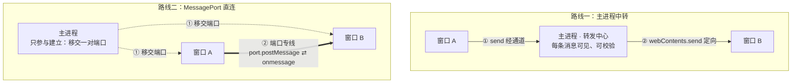

import { Canvas, Controls, Meta } from '@storybook/addon-docs/blocks';

import * as IpcBetweenRenderersStories from './ipc-between-renderers.stories';

<Meta of={IpcBetweenRenderersStories} name="Docs" />

# 渲染进程间通信

「[IPC 概念](?path=/docs/ipc-basics--docs)」的方向表里有一行一直没有展开：渲染 ↔ 渲染，无直接 API。窗口 A 与窗口 B 各自活在独立的渲染进程里，彼此的通道和监听器都够不着对方——但窗口间通信的需求很真实：设置窗口改了主题，主窗口要跟着换；主窗口下载在推进，独立的进度窗口要实时显示。Electron 把这一行补上靠两条路线，本课讲的正是这两条：**主进程中转**——A 的消息照旧发给主进程，主进程再定向转发给 B，每条消息主进程都看得到；**MessagePort 直连**——主进程先把一对相连的端口分别移交给两个窗口，之后消息走端口专线，主进程不再参与。

两条路线的选择本质是「消息流拓扑」的选择：路由放在每条消息上（中转），还是提前到建立连接的那一刻（直连）。读完你应能预测：设置窗口怎么收到主窗口的改动、高频进度流为什么值得引入端口、以及窗口刷新后两条路线各自怎么恢复。



| 回查项 | 值 | 备注 |
| --- | --- | --- |
| 直接 API | 无 | 窗口 A 无法把消息直接递给窗口 B（3.1 方向表的这一行） |
| 中转发送端 | `ipcRenderer.send` → `ipcMain.on` | A 走「渲染 → 主进程」，无新 API |
| 中转转发 | `webContents.send(channel, ...args)` | 主进程 → 指定窗口，即「主进程推送」的定向推送 |
| 直连通道创建 | `new MessageChannelMain()` | 主进程造一对相连的端口 `port1` / `port2` |
| 端口移交 | `webContents.postMessage(channel, message, [port])` | 唯一能携带端口的 API；移交即转让所有权 |
| 渲染端接收 | `event.ports[0]` | 到手即原生 DOM `MessagePort` |
| 端口互发 | `port.postMessage(msg)` / `port.onmessage` | 与 `window.postMessage` 同族；专线没有通道名 |
| 主进程侧端口 | `MessagePortMain` | Node EventEmitter 风格；收消息前必须 `port.start()` |
| 对端断开 | `close` 事件 | 窗口刷新或关闭销毁端口，对端据此感知 |

## 快速上手

沿用「[多窗口](?path=/docs/multi-window--docs)」课的窗口骨架（主窗口 + 设置子窗口、注册表惯例），把中转跑通：主窗口发一条消息，经主进程转发，出现在设置窗口里。全程约 5 分钟，完整转发中心见本课目录的 `relay-hub.js`。

1. 把 `src/preload.js` 替换为（两个窗口共用同一份 preload，各取所需）：

   ```js
   const { contextBridge, ipcRenderer } = require('electron');

   contextBridge.exposeInMainWorld('chat', {
     // 主窗口侧：发往设置窗口——通道名在这里只是给主进程的路由指令
     sendToSettings: (text) => ipcRenderer.send('chat:to-settings', text),
     // 设置窗口侧：订阅转发来的消息，返回取消订阅函数
     onIncoming: (listener) => {
       const handler = (_event, text) => listener(text);
       ipcRenderer.on('chat:incoming', handler);
       return () => ipcRenderer.removeListener('chat:incoming', handler);
     },
   });
   ```

2. 在 `src/index.js` 里注册转发规则（改主进程代码，应用在跑就 `rs` 重启）。设置窗口这次要接上 preload 并登记进注册表——「多窗口」课的示例没接，这里补上：

   ```js
   const windows = new Map(); // 多窗口课的注册表：key → BrowserWindow

   ipcMain.on('chat:to-settings', (_event, text) => {
     console.log('[中转] 收到窗口间消息'); // 每条消息主进程都看得到
     const target = windows.get('settings');
     if (!target || target.isDestroyed()) return; // 接收端不在：丢弃，不排队
     target.webContents.send('chat:incoming', text);
   });

   // openSettingsWindow 里：子窗口同样要接 preload，并创建即登记
   const settingsWindow = new BrowserWindow({
     width: 360,
     height: 480,
     parent: mainWindow,
     webPreferences: { preload: path.join(__dirname, 'preload.js') },
   });
   windows.set('settings', settingsWindow);
   settingsWindow.on('closed', () => windows.delete('settings'));
   settingsWindow.loadFile(path.join(__dirname, 'settings.html'));
   ```

3. 在 `src/index.html` 的 `<body>` 里加发送端（主窗口）：

   ```html
   <input id="text" placeholder="发给设置窗口…" />
   <button id="send">发送</button>
   <script>
     const input = document.querySelector('#text');
     document.querySelector('#send').addEventListener('click', () => {
       window.chat.sendToSettings(input.value);
       input.value = '';
     });
   </script>
   ```

4. 新建 `src/settings.html`（设置窗口的接收端）：

   ```html
   <ul id="messages"></ul>
   <script>
     window.chat.onIncoming((text) => {
       const item = document.createElement('li');
       item.textContent = text;
       document.querySelector('#messages').append(item);
     });
   </script>
   ```

5. 运行 `npm start`，逐项核对三个观察点：

   - 主窗口点「发送」，设置窗口的列表多一项——消息完成了「A → 主进程 → B」的中转；
   - 终端打印 `[中转] 收到窗口间消息`，而两个窗口的 DevTools 控制台都没有这行日志——它来自主进程：主进程看到了每条消息，这是中转的标志（换成直连路线它将看不到）；
   - 关掉设置窗口再发送：无报错、无崩溃、消息无声消失——转发中心的兜底丢弃了它。注释掉兜底一行再试，主进程终端抛 `Cannot read properties of undefined`：注册表按 `closed` 注销后这里取到的是 `undefined`，转发前必须先检查（幽灵引用的完整讨论见「[多窗口](?path=/docs/multi-window--docs)」课）。

## 主进程中转

中转不需要学任何新 API：前半段是「渲染 → 主进程」（`send` / `on`），后半段是「主进程 → 渲染」的定向推送（`webContents.send`）——两段链路 3.1 与 3.3 都讲过，页面两端与预加载桥的写法照旧。新代码只有主进程里的一层**转发中心**，它的价值不在代码量，而在位置：所有窗口间消息都要过它这一关。

| 转发中心带来的 | 说明 |
| --- | --- |
| 看得见 | 每条消息都能留痕、校验来源与输入——「IPC 概念」安全边界的天然卡点 |
| 管得着 | 路由集中：发给谁、要不要广播、要不要改写消息，全在一处 |
| 扛不扛得住 | 每条消息两次跨进程（A → 主、主 → B），高频大数据下主进程成为瓶颈——这是换直连的理由 |

### 转发中心怎么路由

路由信息从哪来，决定了两种写法。**固定路由**：通道名即路由，一条通道永远转发给一个窗口，适合角色固定的窗口对（主 ↔ 设置）：

```js
// 完整转发中心（含来源校验、广播）见本课目录 relay-hub.js
ipcMain.on('chat:to-settings', (_event, text) => {
  const target = getWindow('settings'); // 注册表按 key 取窗口（多窗口课）
  if (!target || target.isDestroyed()) return; // 不排队：接收端不在就丢弃
  target.webContents.send('chat:incoming', text);
});
```

**点名路由**：一个入口通道，消息自带目标 key，主进程查注册表解析——目标由运行时决定（发给当前激活的笔记窗口、发给某个文档窗口）时用它：

```js
ipcMain.on('chat:route', (event, payload) => {
  audit(event, `点名路由 → ${payload.to}`); // 先验来源再转发（3.1 的安全边界）
  relayTo(payload.to, 'chat:incoming', payload.text);
});
```

广播是转发中心的退化形态：不需要路由，遍历 `BrowserWindow.getAllWindows()` 逐个 `send` 即可（写法见「[主进程推送](?path=/docs/ipc-push--docs)」）。两条贴着本节的边界：转发沿用推送的送达规则——**消息不排队**，接收端窗口不存在或监听未就位时转发中心丢弃即可，不要为「稍后送达」在主进程缓存窗口间消息，要补状态就用 3.3 的「推送承担增量、初始状态用拉」；转发中心每条消息都过手，来源校验写在这里最省力——先验 `event.sender` 是否在注册表里，再转发。

### 回音：B 怎么回 A

中转的双向就是反方向再走一遍。按回音的目的分两种，都在转发中心注册：

```js
// 确认类：谁发来的就回给谁——event.reply 直接回到发来消息的窗口与 frame
ipcMain.on('chat:ack', (event, id) => {
  event.reply('chat:ack', id);
});

// 通知类：B 改了主题，其余窗口都要知道——反向中转或广播
ipcMain.on('settings:theme-changed', (event, theme) => {
  for (const win of BrowserWindow.getAllWindows()) {
    if (win.webContents !== event.sender) {
      win.webContents.send('theme-changed', theme);
    }
  }
});
```

确认类不必查注册表找来源：来源就挂在 `IpcMainEvent` 上，`event.reply` 是官方推荐的写法（保证消息回到正确的进程与 frame），`event.sender.send(...)` 等价。两条路线共用同一套纪律：通道按 `域:动作` 命名、一条通道一个职责（3.1 的命名约定），`chat:to-settings` 与 `theme-changed` 各管一个方向。

## MessagePort 直连

直连把「路由」从每条消息上挪走：主进程用 `MessageChannelMain` 造一对端口（`port1`、`port2`，创建即相连），一端移交窗口 A、一端移交窗口 B。移交用的是 `webContents.postMessage(channel, message, [transfer])`——**Electron 里唯一能携带端口的发送 API**，`ipcRenderer` 文档对 `send` 和 `invoke` 的注记写得很明确：需要传 MessagePort 就用 `postMessage`。移交即转让所有权：端口出手后主进程就不能再用了，之后 A 与 B 的对话主进程既不经手也看不见。

关键的身份变化：渲染端从 `event.ports[0]` 拿到的不是什么新对象，就是浏览器里那个原生 DOM `MessagePort`——`port.postMessage` 发、`port.onmessage` 收，与 `window.postMessage` 同族。两个窗口从此有一条**没有通道名的专线**：端口不存在寻址问题，因为它的对端只有一个。

### 三步建立通道

主进程（本课目录 `port-handoff.js` 的核心）——创建、移交，然后退出：

```js
const { MessageChannelMain } = require('electron');

// 每次握手发「新一代」端口对；窗口刷新会再次触发，两端自动换新
function handshake(win, peer) {
  const { port1, port2 } = new MessageChannelMain(); // 一对相连的端口
  win.webContents.postMessage('port', null, [port1]);  // 移交即转让所有权
  peer.webContents.postMessage('port', null, [port2]); // 此后主进程不能用这两个端口
}
```

移交时机直接复用推送的门控纪律：挂在 `did-finish-load` 上（官方教程用 `ready-to-show`，同一个门控思想），页面加载完成才有监听器接得住端口，每次加载（含刷新）自动重新握手——为什么刷新必须重握手，见「端口的生命周期」。

预加载（本课目录 `port-preload.js` 的核心）——接住端口，包成能力：

```js
let port = null;
let onMessage = null;

ipcRenderer.on('port', (event) => {
  port = event.ports[0];                       // 到手即原生 DOM MessagePort
  port.onmessage = (e) => onMessage?.(e.data); // onmessage 赋值隐式开启投递
});

contextBridge.exposeInMainWorld('chat', {
  send: (text) => {
    if (!port) throw new Error('端口尚未移交：等 did-finish-load 之后的首次握手');
    port.postMessage(text); // 专线：只有对端收到
  },
  onMessage: (listener) => { onMessage = listener; },
});
```

端口必须包在暴露面函数后面：MessagePort 过不了 contextBridge——桥上流动的是拷贝与代理（「[预加载脚本](?path=/docs/preload--docs)」的规则），端口是传输对象，不在桥支持的类型表里。页面拿 `window.chat.send` 这样的能力，不碰端口本体；页面确需原始端口的场景（本课不涉及），官方教程的做法是在 preload 里用 `window.postMessage('main-world-port', '*', event.ports)` 转移到主世界——转移语义，不是桥拷贝。

页面两端代码完全对称：

```js
// 先挂监听，再使用（3.3 的时序纪律同样约束专线）
window.chat.onMessage((text) => { /* 更新界面 */ });
window.chat.send('来自窗口 A'); // 没有通道名：消息只有对端能收到
```

下面的模拟把两条路线画在同一张图上：发送同一条消息，切换「通信路线」看路径与主进程可见性，切换「窗口 B 状态」看两条路线在接收端未就绪时各自的命运。

<Canvas of={IpcBetweenRenderersStories.Interactive} />
<Controls of={IpcBetweenRenderersStories.Interactive} />

| 读者操作 | 可观察证据 |
| --- | --- |
| 保持默认（主进程中转 + 窗口 B 在线） | 消息走「A → 转发中心 → B」两跳，读数「主进程看到这条消息：看到」 |
| 路线切到「MessagePort 直连」 | 主进程盒子变灰、只出现在移交虚线里，消息走盒下的专线，读数变「看不到」 |
| 切回中转，窗口 B 切到「刷新后未重建」 | 转发在 B 前被拦下——没有监听，不排队、不补发（3.3 规则约束转发） |
| 直连 + 窗口 B「刷新后未重建」 | 专线在 B 端断开（旧端口已 close），需要 did-finish-load 再握手重建 |
| 打开 Show code | 看到该 Canvas 实际执行的 `route-sim.ts` |

换成 `connectTwoWindows`（`port-handoff.js`）跑快速上手的同一场景，还能拿到一条运行时区分证据：终端只在启动与刷新时打印移交日志，此后无论发多少条消息，终端一片安静——专线上的消息不再经过主进程；对照中转的 `[中转] 收到窗口间消息`，同一条消息在两条路线下的「主进程可见性」差异，就是本课最重要的判断。

### 主进程一侧的 MessagePortMain

端口不只用于窗口之间。渲染进程也可以把一端送进主进程自己手里：页面 `new MessageChannel()`，经 `ipcRenderer.postMessage(channel, message, [port])` 交出一端，主进程在 `ipcMain.on` 的事件里从 `event.ports[0]` 接住——**主进程这边的端口类型是 `MessagePortMain`**：

```js
// 渲染端：自己造一对，把一端交给主进程（官方「回复流」模式的最小形状）
const { port1, port2 } = new MessageChannel();
ipcRenderer.postMessage('task:stream', { count: 10 }, [port2]);
port1.onmessage = (e) => renderProgress(e.data); // 主进程推进度
port1.onclose = () => resetProgressUI();         // 主进程 close 时收到信号

// 主进程：接住的是 MessagePortMain——Node EventEmitter 风格
ipcMain.on('task:stream', (event, { count }) => {
  const [port] = event.ports;      // MessagePortMain[]
  port.on('message', (e) => { /* 渲染端追加的指令 */ });
  port.start();                    // 必须：不调用 start()，消息会一直排队不投递
  for (let i = 1; i <= count; i++) {
    port.postMessage(i / count);   // 持续推送：invoke 给不了的流式响应
  }
  port.close();                    // 发完显式关闭，对端 onclose 收到信号
});
```

`MessagePortMain` 是 DOM `MessagePort` 在主进程的对应物，但事件系统不同——用 `port.on('message', ...)` 而不是 `onmessage`，也因此失去了 `onmessage` 赋值的隐式开启，必须手动 `port.start()`（文档原话：消息会一直排队，直到这个方法被调用）。`'close'` 事件在远端断开连接时发出。官方教程的「回复流」与「worker 进程」两个场景走的就是这条路；`invoke` 是一次请求一次响应，要流式的多段回包，端口是官方给出的补位方案——它们属于渲染 ↔ 主进程的端口应用，本课聚焦窗口间，不展开。

### 端口的生命周期：close 与重建

一对端口是一条「连接」而不是两个孤立对象：两端各活在各自的页面上下文里，**上下文没了，端就死了**。窗口刷新或关闭销毁页面上下文，本端端口随之失效；对端的端口收到 `close` 事件（Electron 为 DOM `MessagePort` 与 `MessagePortMain` 都提供，语义是远端断开连接）：

```js
// 渲染端感知对端断开（MessagePortMain 侧用 port.on('close', ...)）
port.onclose = () => {
  // 旧端口已死：丢弃引用，等下一次握手领新端口
};
```

失效的表现同样是静默：发进死端口的消息不报错也不到达——专线与中转共享「不排队」规则。区别在恢复方式。中转的监听随 preload 重挂、转发中心照常工作，新页面重新订阅即可（3.3 的恢复路径）；直连的线断了就是断了，**重建等于主进程再移交一对新端口**——这正是握手挂在 `did-finish-load` 上的原因：每次加载自动发「新一代」端口，刷新的窗口与对端各领新端口，专线自动接回；旧端口的所有权早已移交，让垃圾回收收走即可，主进程不需要记账。

最后一个选型事实：一对端口只连两个端点。三个窗口两两直连要三对端口、每个页面维护两条线；N 个窗口两两互连，线数随窗口数的平方增长。中转下每个窗口永远只有一条到主进程的线，组合复杂度线性——窗口数一多，这笔账反过来成了中转的加分项。

## 最佳实践

- **从中转起步，出现性能证据再引入端口。** 中转代码少、每条消息可审计可校验，满足绝大多数窗口间场景；端口解决的是「高频、大数据量、流式回包」和「不想让主进程成为消息瓶颈」，为此付出的代价是移交协议、close 处理与 N 窗口组合复杂度。没有具体的性能痛点，先不付这笔成本。
- **路由收敛到一个转发中心模块。** 所有 `ipcMain.on` 的转发规则集中在一处（本课目录的 `relay-hub.js`），复用「多窗口」课的注册表取目标，广播与定向只写一遍；散落在各处的转发调用会让「哪些消息在窗口间流动」无处可查，也让来源校验出现遗漏口。
- **端口的建立集中、自动、可重复。** 握手挂 `did-finish-load`、每次发新一代端口、两端一起换；不手工挑选「哪次握手算数」，也不在主进程记账端口——所有权已移交，主进程留不住也用不了。
- **页面拿包装后的能力，不拿原始端口。** 通道名、端口、MessageChannel 都是实现细节，与预加载桥的白名单纪律同一条线：中转下页面认 `window.chat.sendToSettings`，直连下页面认 `window.chat.send`——两条路线切换时，页面代码可以一行不改。

## 常见问题

- 移交端口时报 `An object could not be cloned`，或渲染端收到的 `event.ports` 是空的
  通道走错了：`send` 和 `invoke` 不能携带 MessagePort，端口放在参数里会被结构化克隆拒绝，或根本没有进入 transfer 列表。移交端口只有一个入口——`postMessage` 的第三个参数：主 → 渲染用 `webContents.postMessage(channel, msg, [port])`，渲染 → 主用 `ipcRenderer.postMessage(channel, msg, [port])`。
- 主进程接住了端口，却一条消息都收不到
  `MessagePortMain` 的投递是手动开启的：消息会一直排队，直到调用 `port.start()`。处理动作：`port.on('message', ...)` 注册之后补一行 `port.start()`。渲染端的 DOM `MessagePort` 不用——给 `onmessage` 赋值已隐式开启（若用 `addEventListener` 监听，同样要手动 `start()`）。
- 窗口刷新后中转自动恢复，直连却悄悄失联
  刷新销毁页面上下文：中转一侧监听随 preload 重挂、转发中心照常（3.3 的恢复路径）；直连一侧旧端口彻底死亡。处理动作：握手挂 `did-finish-load`，每次加载发新一代端口对，两端自动换新；对端用 `onclose`（或 `'close'` 事件）感知断线并丢弃旧端口引用。
- 页面里调用 `window.chat.send()` 没反应也不报错
  端口还没移交，`port` 还是 `null`。判断依据：移交发生在 `did-finish-load` 之后，而页面最早的同步代码跑得比它早。处理动作：暴露面对未就绪给出显式错误（本课 `port-preload.js` 的做法），页面初始化先 `onMessage` 再发消息；若希望移交更晚（等页面真正就绪），改成就绪信号触发握手——3.3 门控三法的端口版。
- 想把 MessagePort 直接放进 contextBridge 暴露面给页面
  过不了桥：桥上流动的是拷贝与代理，端口是传输对象，不在桥支持的类型表里。处理动作：把端口包在暴露面函数后面，页面拿 `send` / `onMessage` 能力；页面确需原始端口时，按官方教程在 preload 里用 `window.postMessage('main-world-port', '*', event.ports)` 转移到主世界。

## 总结回顾

摘要：

渲染进程之间没有直接 API，窗口间通信有两条路线，分野是消息经不经过主进程。**主进程中转**是「渲染 → 主进程」与「主进程 → 渲染定向推送」两段已学链路的拼接，新代码只有主进程的转发中心：固定路由按通道名定向，点名路由解析消息自带的目标，回音用 `event.reply` 直接回给来源；转发中心让每条消息可见、可校验、路由集中，代价是每条消息两次跨进程。**MessagePort 直连**由主进程在建立阶段用 `MessageChannelMain` 造一对相连的端口，`webContents.postMessage` 移交（唯一能携带端口的 API，移交即转让所有权），渲染端从 `event.ports[0]` 拿到原生 DOM `MessagePort` 后，两端在没有通道名的专线上直接互发，主进程零参与；主进程自己持有端口时拿到的是 `MessagePortMain`——Node 事件风格，收消息必须 `port.start()`。窗口刷新销毁端口、对端收到 `close`，握手挂在 `did-finish-load` 上每次发新一代端口，专线自动重建；端口点对点的组合成本与中转的线性复杂度，构成两条路线最后的权衡砝码。

一句话：

> 中转把路由交给每条消息，直连把路由提前到移交端口的那一刻——判断标准只有一条：这股消息流应不应该经过主进程。

知识要点：

- 两条路线的分野是什么？各自的拓扑下主进程扮演什么角色？
- 中转的转发中心有哪两种路由写法？确认类回音为什么用 `event.reply`？
- 一对 MessagePort 怎么创建、怎么移交、怎么被渲染端接住？为什么移交后主进程用不了端口？
- 哪些 API 能携带端口、哪些不能？主进程侧的端口是什么类型、监听前必须做什么？
- 专线为什么不需要通道名？它和通道寻址的关系是什么？
- 窗口刷新对两条路线各意味着什么？`close` 事件与 `did-finish-load` 握手怎么配合？
- 多窗口场景下，两条路线的组合成本怎么比较？

## 参考资料

- [Electron 教程：MessagePorts in Electron](https://www.electronjs.org/docs/latest/tutorial/message-ports)
  两个渲染进程建立通道的官方完整模式（`MessageChannelMain` + `webContents.postMessage` + `e.ports`）、「端口只能经 postMessage 移交」的说明、MessagePortMain 需 `start()`、回复流 / worker / 主世界转移三个场景。
- [Electron API：MessagePortMain](https://www.electronjs.org/docs/latest/api/message-port-main)
  Node EventEmitter 事件风格、`postMessage(message, transfer)`、`start()` 的排队语义原文、`'close'` 事件、「不从 electron 模块导出，只能经其他 API 获得」。
- [Electron API：MessageChannelMain](https://www.electronjs.org/docs/latest/api/message-channel-main)
  `new MessageChannelMain()` 与 `port1` / `port2` 一对相连端口的创建语义。
- [Electron API：webContents](https://www.electronjs.org/docs/latest/api/web-contents)
  `postMessage(channel, message, [transfer])` 签名、transfer 为 `MessagePortMain[]`、移交后渲染端经事件的 `ports` 属性拿到原生 DOM `MessagePort`。
- [Electron API：ipcRenderer](https://www.electronjs.org/docs/latest/api/ipc-renderer)
  `postMessage(channel, message, [transfer: MessagePort[]])`、`send` 与 `invoke` 「需要传 MessagePort 就用 ipcRenderer.postMessage」的注记。
- [Electron API：IpcRendererEvent](https://www.electronjs.org/docs/latest/api/structures/ipc-renderer-event)
  渲染端事件对象的 `sender` 与 `ports`（`MessagePort[]`）两个字段。
- [Electron API：IpcMainEvent](https://www.electronjs.org/docs/latest/api/structures/ipc-main-event)
  `event.sender`、`event.ports`（`MessagePortMain[]`）、`event.reply` 「保证消息回到正确的进程与 frame」的建议。
- [Electron API：contextBridge](https://www.electronjs.org/docs/latest/api/context-bridge)
  桥上类型按拷贝与代理传递的规则——MessagePort 需要在 preload 里包装而非透传的依据。
