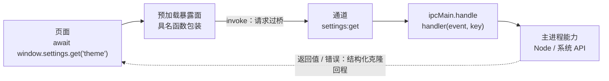

import { Canvas, Controls, Meta } from '@storybook/addon-docs/blocks';

import * as IpcInvokeStories from './ipc-invoke.stories';

<Meta of={IpcInvokeStories} name="Docs" />

# 双向调用

「[IPC 概念](?path=/docs/ipc-basics--docs)」一课建立了通道模型：消息沿带名字的通道流动，方向决定用哪对 API。本课讲最常用的一对——`ipcRenderer.invoke` 与 `ipcMain.handle` 的请求响应模式：渲染进程发出请求并拿到一个 Promise，主进程的 handler 算出结果（或抛出错误），沿原通道回到等待中的 Promise。它把一次跨进程调用收敛成渲染端的一次 `await`，但本质仍是消息而不是函数调用：参数与返回值经结构化克隆过桥，错误只剩 `message`，没有内建超时，handler 是主进程按通道登记的注册表。读完你应该能预测一次 `invoke` 的四种结局——拿到返回值、收到只剩 `message` 的错误、因通道未注册被拒、或永远等待。



| 回查项 | 值 | 备注 |
| --- | --- | --- |
| 渲染端发起 | `ipcRenderer.invoke(channel, ...args)` | 返回 `Promise<any>`，resolve 为 handler 的返回值 |
| 主进程接单 | `ipcMain.handle(channel, listener)` | `listener(event, ...args)`，返回值即响应 |
| handler 返回 Promise | `invoke` 等它落定再回包 | 异步工作直接写 `async` 函数 |
| 一次性接单 | `ipcMain.handleOnce(channel, listener)` | 处理一次后自动移除 |
| 移除 handler | `ipcMain.removeHandler(channel)` | 移除后该通道的 `invoke` 被拒 |
| 内建超时 | 无 | handler 挂起则 Promise 永远 pending |
| 错误过桥 | 只保留 `message` | `stack`、`code` 与自定义属性全部丢失 |
| 传值规则 | 结构化克隆 | 函数、Promise、Symbol、WeakMap/WeakSet、DOM 对象直接抛异常 |
| 同步旧法 | `ipcRenderer.sendSync` | 阻塞整个渲染进程，官方定位「最后手段」 |
| 单向消息 | `send` / `on` 与主进程推送 | 不需要结果的通信，见「主进程推送」一课 |

## 快速上手

沿用前面课程用 Forge 创建的项目（`src/index.js` + `src/preload.js` + `src/index.html`），三步接通第一条请求响应通道。完整参考实现在本课目录的 `main-handlers.js` 与 `invoke-preload.js`。

1. 在 `src/index.js` 注册 handler——补上 `ipcMain`，把注册语句放在模块顶层（`require` 之后、窗口创建之前）：

   ```js
   const { app, BrowserWindow, ipcMain } = require('electron');

   // 通道名的「域:动作」写法只是可读性惯例，冒号对 Electron 没有特殊含义
   ipcMain.handle('app:version', () => app.getVersion());
   ```

2. 在 `src/preload.js` 把通道包装成页面能点名的具名函数（包装而非透传，原则见「[预加载脚本](?path=/docs/preload--docs)」）：

   ```js
   const { contextBridge, ipcRenderer } = require('electron');

   contextBridge.exposeInMainWorld('appInfo', {
     version: () => ipcRenderer.invoke('app:version'),
   });
   ```

3. 在 `src/index.html` 的 `</body>` 之前调用：

   ```html
   <script>
     // 页面主世界：跨进程调用就是 await 一个普通异步函数
     (async () => {
       const version = await window.appInfo.version();
       const info = document.createElement('p');
       info.textContent = `Electron ${version}`;
       document.body.append(info);
     })();
   </script>
   ```

生效规则见「[第一次运行](?path=/docs/first-run--docs)」：改 `src/index.js` 要在运行 `npm start` 的终端输入 `rs` 重启，改 `preload.js` 与页面刷新（`Cmd+R`，Windows/Linux 为 `Ctrl+R`）即可。核对两个观察点：

- 窗口正文出现 `Electron 44.x.x` 版本行——请求响应往返成功；
- 注释掉第 1 步的 `ipcMain.handle`，重启后页面控制台抛 `Error: No handler registered for 'app:version'`——通道没有 handler 时 `invoke` 以这个错误拒绝，这是本课最高频的故障。

## invoke 与 handle 的完整链路

一次调用分五段，各段写在哪个文件、由谁负责，是排查一切问题的地图：

| 段 | 位置 | 职责 |
| --- | --- | --- |
| 页面调用 | `src/index.html` | `await window.xxx.yyy(args)`，只认识暴露面 |
| 预加载包装 | `src/preload.js` | 具名函数把调用翻译成 `ipcRenderer.invoke(channel, ...args)` |
| 通道传输 | Electron 内部 | 消息按结构化克隆序列化，跨进程投递 |
| 主进程 handler | `src/index.js` | `ipcMain.handle` 登记的处理函数执行实际工作 |
| 结果回程 | Electron 内部 | 返回值或错误同样序列化，resolve / reject 页面侧的 Promise |

`invoke` 返回的 Promise 只有四种结局，每种都能从主进程侧的行为预测：

| 结局 | 主进程侧发生了什么 | 渲染端看到 |
| --- | --- | --- |
| `fulfilled`：拿到返回值 | handler 正常 `return`（返回 Promise 则等它落定） | `await` 拿到值 |
| `rejected`：Error | handler 抛错，或返回的 Promise 被拒 | `catch` 到只剩 `message` 的 Error |
| `rejected`：No handler registered | 通道没有登记 handler | `catch` 到注册类故障 |
| pending：永不落定 | handler 挂起，没有内建超时 | 一直等待 |

下面的模拟把这条链路画在两侧：点击「调用 invoke」，请求包从渲染进程经通道进入主进程，结局沿通道回到等待中的 Promise。切换「handler 状态」，四种结局各有对应的包与读数。

<Canvas of={IpcInvokeStories.Interactive} />
<Controls of={IpcInvokeStories.Interactive} />

| 操作 | 可观察证据 |
| --- | --- |
| 「返回结果」状态下点击「调用 invoke」 | 请求包进入主进程，`return 'dark'` 沿通道返回，Promise 变 `fulfilled: "dark"` |
| 切到「抛出 Error」再调用 | handler 抛错，红色错误包返回，Promise `rejected`，读数里只剩 `message` |
| 切到「未注册」再调用 | 主进程注册表里该通道为空，请求在 IPC 层被直接拒绝 |
| 切到「挂起不返回」再调用 | 请求停在 handler 里不回包，Promise 恒为 `pending`，「已等待」持续增长 |

### 两端怎么写

渲染端一行，主进程一段：

```js
// 渲染端（通常藏在预加载包装里）：发请求，拿 Promise
const theme = await ipcRenderer.invoke('settings:get', 'theme');
```

```js
// 主进程：登记 handler，第一个参数是事件，之后是 invoke 传来的参数
ipcMain.handle('settings:get', (event, key) => {
  // 同步值直接回；handler 声明为 async 时，返回的 Promise 落定后才回包
  return readSetting(key);
});
```

handler 的第一个参数 `event` 是 `IpcMainInvokeEvent`，描述这次调用从哪来：

| 属性 | 类型 | 用途 |
| --- | --- | --- |
| `sender` | `WebContents` | 发起调用的窗口；多窗口时用它分辨来源（见「[多窗口](?path=/docs/multi-window--docs)」） |
| `senderFrame` | `WebFrameMain` 或 `null` | 发起调用的 frame；frame 导航或销毁后读到 `null` |
| `processId` | Integer | 发起调用的渲染进程 ID |
| `frameId` | Integer | 发起调用的 frame ID |

两个边界：一个通道只能登记一个 handler，重复登记直接抛错（处理见「注册时机与重复注册」）；`invoke` 一次请求只回一次包，需要主进程主动发多次消息的场景不是它的职责，见「[主进程推送](?path=/docs/ipc-push--docs)」。

### 过桥的是数据：结构化克隆

请求参数与返回值都按结构化克隆（structured clone，与 `window.postMessage` 同规则）序列化。能用的是普通数据；过不去的当场抛异常，请求根本发不出去：

```js
// 能过桥：对象、数组、Map、Set、原始值
ipcRenderer.invoke('query:history', { limit: 10, order: 'desc' });

// 过不去：直接抛异常
ipcRenderer.invoke('query:run', () => {});       // Function
ipcRenderer.invoke('query:run', document.body);  // DOM 对象
ipcRenderer.invoke('query:run', new WeakMap());  // WeakMap / WeakSet（Promise、Symbol 同样抛）
```

三条判断跟着这条规则：

- 原型不随行：自定义类实例过桥后变成普通对象，方法全部丢失；
- 主进程对象（`BrowserWindow`、`WebContents` 实例等）不能作为返回值回传——回普通数据，要操作就再发一次请求；
- 返回值要过两道桥：先结构化克隆进渲染进程，再经 `contextBridge` 拷贝进页面主世界（拷贝并冻结的规则见「[预加载脚本](?path=/docs/preload--docs)」）。页面拿到的永远是副本，大对象有两份拷贝成本。

## 错误与超时

Promise 的后三种结局——错误、未注册、挂起——都以渲染端 Promise 的形态呈现：`reject` 出的 Error，或一直 pending。根源都在主进程侧，排查方向和直觉相反：渲染端 `catch` 到什么，先回主进程找原因。

### handler 抛错：只有 message 过桥

官方文档对错误传递的描述是：handler 抛出的错误**不透明**（not transparent）——经过序列化，只有原始错误的 `message` 属性到达渲染端（详见 ipcMain 文档引用的 issue #24427）。

```js
// 主进程：抛出的 Error 只有 message 能过桥
ipcMain.handle('settings:get', (event, key) => {
  if (key !== 'theme') {
    throw new Error(`配置键不存在: ${key}`);
  }
  return 'dark';
});
```

```js
// 页面：catch 到的是渲染端重建的 Error
try {
  await window.settings.get('nope');
} catch (error) {
  console.log(error.message); // '配置键不存在: nope' —— 唯一可靠的字段
  console.log(error.stack);   // 渲染端自己的堆栈，主进程堆栈不在这里
}
```

因此跨进程的错误约定只有两种可靠形态：要么把判断所需的信息压进 `message`（用机器可读前缀，如 `KEY_NOT_FOUND: ...`）；要么不抛错、返回结果对象，把语义完整留在数据里：

```js
// 主进程：结果对象约定，渲染端按 ok 字段分流
ipcMain.handle('settings:get', (event, key) => {
  const value = readSetting(key);
  return value === undefined
    ? { ok: false, reason: 'KEY_NOT_FOUND' }
    : { ok: true, value };
});
```

边界：主进程的自定义错误类到渲染端只剩 `Error` 加 `message`，`instanceof` 判断失效——不要依赖错误类型做跨进程辨识。

### 没有注册 handler：No handler registered

`invoke` 的通道没有登记 handler 时，Promise 以 `Error: No handler registered for 'channel'` 拒绝。这个错误几乎总来自三种情况，按序排查：

- 改了主进程代码没有重启——handler 注册在主进程，`rs` 之前新通道不存在；
- 两端通道名不一致——逐字核对，冒号前后也不放过；
- 注册时机晚于首次调用——把注册放在主进程模块顶层，先于窗口创建。

快速上手的第二个观察点就是这个故障的完整复现。

### 超时：没有内建机制

文档对 `invoke` 的承诺只有「异步等待结果」，没有任何超时约定：handler 挂起（例如内部 `await` 了一个永不落定的 Promise），渲染端的 Promise 就永远 `pending`——不报错、不回调。需要等待有界时，在渲染端自己包一层：

```js
// 页面侧：给 invoke 加调用方时限
function withTimeout(promise, ms, label) {
  return Promise.race([
    promise,
    new Promise((_, reject) => {
      setTimeout(() => reject(new Error(`请求超时: ${label} (${ms}ms)`)), ms);
    }),
  ]);
}

const theme = await withTimeout(window.settings.get('theme'), 5000, 'settings:get');
```

边界：超时只是放弃等待，主进程里的任务还在跑。真正的取消要主进程自己实现（任务内检查中止标记、按请求 ID 忽略迟到结果）；长任务的进度反馈交给推送通道，见「[主进程推送](?path=/docs/ipc-push--docs)」。

## handler 的注册与移除

handler 登记在主进程一个按通道索引的注册表里：注册、一次性注册、移除各有一个 API，注册的时机与次数是唯一容易出事的维度。

### 注册时机与重复注册

`ipcMain.handle` 对同一通道只能登记一个 handler，重复登记直接抛错：

```text
Error: Attempted to register a second handler for 'settings:get'
```

最常见的触发方式是开发期主进程热重载：模块重跑一遍，注册语句又执行一次。把注册收拢到一个函数、在模块顶层只调用一次，故障面最小：

```js
// src/index.js：注册集中、启动时一次
function registerIpcHandlers() {
  ipcMain.handle('app:version', () => app.getVersion());
  // handler 的实现写法见本课目录的 main-handlers.js
  ipcMain.handle('settings:get', handleSettingsGet);
}

registerIpcHandlers(); // 模块顶层执行，先于任何窗口加载页面
```

完整注册清单的参考实现见本课目录的 `main-handlers.js`。

### handleOnce 与 removeHandler

```js
// 只接一次的通道：处理完自动移除，适合一次性握手
ipcMain.handleOnce('onboarding:ack', () => {
  markOnboardingDone();
  return true;
});

// 主动移除：移除后该通道的 invoke 会以 No handler registered 拒绝
ipcMain.removeHandler('settings:get');
```

`handleOnce` 适合「只发生一次」的交互：首次启动确认、单次令牌交换。`removeHandler` 用于动态装卸能力，或在测试里重置注册表；需要覆盖旧 handler 时也先 `removeHandler` 再 `handle`，绕开重复登记的抛错。

## sendSync 与旧式请求响应

`invoke` / `handle`（Electron 7 引入）之前，请求响应靠两条老路实现。认得出它们、知道为什么不用，比学会用更重要；官方教程的建议是「尽量用 `invoke`」：

| 机制 | 闭环方式 | 问题 |
| --- | --- | --- |
| `ipcRenderer.invoke` + `ipcMain.handle` | Promise 自动配对 | 无——本课的推荐 |
| `ipcRenderer.sendSync` + `event.returnValue` | 同步等待返回值 | 发出请求后阻塞整个渲染进程 |
| `ipcRenderer.send` + `event.reply` | 两条单向消息手动配对 | 响应无法与请求配对，代码易错 |

`sendSync` 的写法与代价：

```js
// 渲染端：发出后整个渲染进程停在这里等回复
const theme = ipcRenderer.sendSync('settings:get-sync', 'theme');
```

```js
// 主进程：用 ipcMain.on 接收，必须设置 event.returnValue
ipcMain.on('settings:get-sync', (event, key) => {
  event.returnValue = 'dark'; // 漏掉这行，渲染端永远等不到回复
});
```

`send` + `event.reply` 的配对困境是官方教程点名的问题：响应作为一条普通消息回来，没有机制标记它属于哪次请求。单一请求响应一律 `invoke`；不需要结果的单向消息与主进程主动推送见「[主进程推送](?path=/docs/ipc-push--docs)」。

## 最佳实践

- **通道只存在于 preload 与主进程之间。** 页面点名的是暴露面上的具名函数，通道名和 `ipcRenderer` 都不出预加载脚本——能力粒度由暴露面定义，通道重命名、主进程重构都不动页面代码（原则见「[预加载脚本](?path=/docs/preload--docs)」）。
- **handler 注册集中、启动一次。** 所有 `ipcMain.handle` 收进一个 `registerIpcHandlers()`，模块顶层调用：「本应用有哪些通道」因此只有一个地方可查，也天然避开热重载的重复注册。
- **错误语义在主进程侧定型。** 渲染端只能依赖 `message`，所以业务错误用带前缀的 `message` 或结果对象约定；渲染端不做 `instanceof`、不读 `code`。
- **等待要有界。** 不可靠或耗时的调用包 `withTimeout`；进度与中途状态走推送通道，不往一次 `invoke` 里塞。

## 常见问题

- 页面控制台抛 `Error: No handler registered for 'xxx'`
  按序查三处：主进程是否真的注册了（改主进程要 `rs` 重启，规则见「[第一次运行](?path=/docs/first-run--docs)」）；两端通道名是否逐字一致；注册是否晚于首次调用（放模块顶层）。完整复现见快速上手的观察点。
- 启动就崩 `Attempted to register a second handler for 'xxx'`
  同一通道被登记了两次，常见于主进程热重载或注册语句被多个模块执行。把注册收拢到 `registerIpcHandlers()` 只跑一次；确实需要覆盖旧 handler 时先 `ipcMain.removeHandler(channel)` 再 `handle`。
- `catch` 到的 error 上没有 `code`、没有主进程 `stack`、自定义属性全没了
  官方行为：跨进程错误只保留 `message`。把判断所需信息压进 `message`，或改用结果对象约定（见「handler 抛错」）。
- `await window.xxx()` 不报错也一直不返回
  handler 挂起且 `invoke` 没有内建超时，Promise 恒为 `pending`。查 handler 是否漏了 `return`、是否 `await` 了永不落定的 Promise；调用方用 `withTimeout` 兜底（见「超时」）。
- `invoke` 传函数、DOM 元素或 `new WeakMap()` 直接抛异常
  结构化克隆不支持这些类型，请求根本发不出去。传普通数据，行为留在主进程（见「过桥的是数据」）。
- 页面里改 `invoke` 返回对象的属性不生效，调它的方法报 `not a function`
  返回值过了两道桥（结构化克隆 + `contextBridge` 拷贝冻结），页面拿到的是冻结副本。要改状态就再发一次请求，让主进程改（见「过桥的是数据」）。
- 用了 `sendSync` 之后页面整个卡死
  渲染进程被阻塞到回复到达为止。查主进程是否监听了该通道、是否设置了 `event.returnValue`——漏一个就永远等不到；大多数场景改回 `invoke` 即可。

## 总结回顾

摘要：

`ipcRenderer.invoke` 与 `ipcMain.handle` 把「渲染进程问、主进程答」收敛成渲染端的一次 `await`：请求与返回值沿通道按结构化克隆过桥，handler 返回 Promise 则等它落定再回包。Promise 有四种结局——拿到返回值、收到只剩 `message` 的错误、通道未注册被 `No handler registered` 拒绝、handler 挂起导致永远 pending（没有内建超时，需要调用方自己包 `Promise.race`）。handler 登记在主进程按通道索引的注册表里：同通道重复注册直接抛错，注册要集中、启动时一次；`handleOnce` 管一次性接单，`removeHandler` 主动卸载。旧的两条请求响应路——`sendSync` 阻塞渲染进程、`send` 加 `event.reply` 无法配对——都已让位给 `invoke`。

一句话：

> `invoke`/`handle` 用 Promise 的形态包装跨进程消息：数据克隆过桥、错误只剩 message、等待没有超时——四种结局都要能预测。

知识要点：

- 一次 `invoke`/`handle` 往返经过哪五段？各写在哪个文件？
- `invoke` 的 Promise 有哪四种结局？各由主进程侧的什么行为触发？
- 主进程抛出的 Error 到渲染端还剩什么？两种结构化错误约定怎么写？
- 哪些值过不了 IPC 边界？页面拿到的返回值还是原对象吗？
- 怎么给等待设时限？超时之后主进程的任务停了吗？
- `Attempted to register a second handler` 为什么发生？注册怎么组织？
- `handleOnce` 与 `removeHandler` 各用在哪？移除后再 `invoke` 会怎样？
- `sendSync` 与 `send` + `event.reply` 各自的问题是什么？

## 参考资料

- [Electron API：ipcRenderer](https://www.electronjs.org/docs/latest/api/ipc-renderer)
  `invoke` / `sendSync` 签名与返回值、结构化克隆规则与抛异常类型清单、handler 抛错导致 reject 的说明。
- [Electron API：ipcMain](https://www.electronjs.org/docs/latest/api/ipc-main)
  `handle` / `handleOnce` / `removeHandler` 语义、handler 返回 Promise 的回包规则、「只有 message 过桥」原文（含 issue #24427 引用）。
- [Electron API：IpcMainInvokeEvent](https://www.electronjs.org/docs/latest/api/structures/ipc-main-invoke-event)
  handler 事件参数的 `sender`、`senderFrame`、`processId`、`frameId` 属性。
- [Electron 教程：Inter-Process Communication](https://www.electronjs.org/docs/latest/tutorial/ipc)
  模式 2 的 invoke/handle 官方示例、通道冒号命名惯例、`sendSync` 与 `send` + `event.reply` 的官方批评、「尽量用 invoke」建议。
