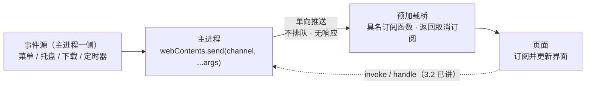

import { Canvas, Controls, Meta } from '@storybook/addon-docs/blocks';

import * as IpcPushStories from './ipc-push.stories';

<Meta of={IpcPushStories} name="Docs" />

# 主进程推送

「[IPC 概念](?path=/docs/ipc-basics--docs)」一课把消息方向分成两类，「[双向调用](?path=/docs/ipc-invoke--docs)」一课讲完了渲染端发起的请求响应（`invoke` / `handle`）。本课补上另一个发起方：主进程。很多事件的源头本来就在主进程一侧——应用菜单被点击、托盘图标被单击、下载在推进、电源状态变化、子进程有输出——页面既感知不到这些事件，也不该靠不停轮询去问。`webContents.send` 让主进程把这些事件**单向推给页面**：页面在一条通道上订阅，消息到达时执行注册的监听器。

先建立本课最重要的判断：**推送是 fire-and-forget（发出即忘）——没有响应、没有队列、没有送达保证。**主进程调 `send` 的那一瞬间，接收端必须已经有监听器在听，消息才算送达；监听器还没注册，这条消息就静默消失，不报错、不补发。本课一半篇幅都在回答由此而来的问题：什么时候推送才安全、接收方刷新和崩溃之后怎么办。读完你应能预测：窗口一创建就 `send` 的那条消息，页面为什么一条也收不到。



| 回查项 | 值 | 备注 |
| --- | --- | --- |
| 发送 API | `win.webContents.send(channel, ...args)` | 主进程 → 渲染端，单向异步，无返回值 |
| 接收 API | `ipcRenderer.on(channel, listener)` | 监听器收到 `(event, ...args)` |
| 参数序列化 | Structured Clone Algorithm | 原型链不随行；函数、Promise、Symbol、WeakMap、WeakSet 抛异常 |
| 送达保证 | 无 | 接收端没在听，消息即丢；不排队、不补发 |
| 安全推送时机 | `did-finish-load` 之后（或 `await loadFile()` 之后） | 页面加载完成、onload 已分发 |
| 最早的监听位置 | preload 脚本 | 执行早于页面任何脚本（见「预加载脚本」） |
| 接收方消失 | `render-process-gone` 事件 | `details.reason`、`details.exitCode` 说明原因 |
| 定向与广播 | 单个 `webContents.send` / 遍历 `getAllWindows()` | send 天然面向一个窗口 |

## 快速上手

沿用「[安装](?path=/docs/install--docs)」一课创建的 Forge 项目（`src/index.js` 已接好预加载脚本），用主进程定时器模拟一个下载进度事件源，全程约 5 分钟。三段代码就是本课的完整路径：主进程发、预加载封装、页面订阅。

1. 把 `src/preload.js` 替换为：

   ```js
   const { contextBridge, ipcRenderer } = require('electron');

   contextBridge.exposeInMainWorld('downloads', {
     // 页面只拿到订阅能力：传入监听器，返回取消订阅函数
     onProgress: (listener) => {
       const handler = (_event, progress) => listener(progress);
       ipcRenderer.on('download-progress', handler);
       return () => ipcRenderer.removeListener('download-progress', handler);
     },
   });
   ```

2. 在 `src/index.html` 的 `</body>` 之前加一段页面脚本：

   ```html
   <div id="progress">等待第一条推送……</div>
   <script>
     window.addEventListener('DOMContentLoaded', () => {
       const label = document.querySelector('#progress');
       window.downloads.onProgress((progress) => {
         label.textContent = `下载进度：${progress}%`;
       });
     });
   </script>
   ```

3. 在 `src/index.js` 的 `createWindow` 里补一个事件源（只展示新增部分，`webPreferences.preload` 接线保持模板原样；完整主进程侧对照见本课目录的 `push-hub.js`）：

   ```js
   // 事件源在主进程：定时器模拟下载进度
   let progress = 0;
   setInterval(() => {
     progress = (progress + 10) % 100;
     console.log('已推送', progress); // 主进程的输出打在终端
     mainWindow.webContents.send('download-progress', progress);
   }, 1000);
   ```

4. 运行 `npm start`（改的是主进程代码 `src/index.js`，应用已在运行时在终端输入 `rs` 重启，见「[第一次运行](?path=/docs/first-run--docs)」），核对三个观察点：

   - 窗口里的数字每秒变化——主进程的事件推到了页面；
   - 终端每秒打印「已推送」，DevTools 控制台却没有——同一条数据，主进程输出在终端，页面更新在窗口，两侧各归各处；
   - 在 `mainWindow.loadFile(...)` 之前插一行 `mainWindow.webContents.send('download-progress', 999);`，重启后这条 999 永远不出现——`loadFile` 之前页面还不存在，监听无从注册，消息不排队也不补发（验证完删掉这行）。

## 发送与接收

推送链路分三段，职责固定：**主进程只管发**（`webContents.send`）；**预加载桥把通道包成具名订阅 API**（通道名与事件对象都是实现细节，与「[预加载脚本](?path=/docs/preload--docs)」一课的白名单设计同一条纪律）；**页面只管订阅和取消订阅**。三段各写几行，就能支撑任意多个推送事件。

### webContents.send：主进程一侧

`send(channel, ...args)` 把一条异步消息发往这一个窗口的页面。`channel` 是接收端按名监听的字符串通道（通道语义见「[IPC 概念](?path=/docs/ipc-basics--docs)」）；`...args` 是随消息携带的数据，监听器按顺序原样收到：

```js
// 发给 mainWindow 这一个窗口；调用即返回，不等待、无响应
mainWindow.webContents.send('download-progress', { percent: 60, remaining: 42 });
```

三个回查要点：

| 要点 | 行为 | 实践含义 |
| --- | --- | --- |
| 无返回值、无响应 | 调用即返回 | 发送侧不知道有没有人收到，送达要靠时机设计（下一节） |
| 结构化克隆 | 参数按 Structured Clone Algorithm 序列化，原型链不随行 | 类实例过河变普通对象，别依赖它的方法 |
| 类型硬限制 | 函数、Promise、Symbol、WeakMap、WeakSet 直接抛异常 | 边界上只流动普通对象、数组与原始值 |

同族成员一行带过：`postMessage(channel, message, [transfer])` 能携带 MessagePortMain（窗口间通信的正规通道，「[渲染进程间通信](?path=/docs/ipc-between-renderers--docs)」一课讲）；`sendToFrame(frameId, channel, ...args)` 定向到窗口内某个子 frame，普通单 frame 页面用不到。webContents 其余能力（导航控制、`executeJavaScript` 等）见「[webContents](?path=/docs/webcontents--docs)」一课。

### 预加载桥的订阅封装

推送方向的桥封装和双向调用同一条设计纪律：**暴露面是白名单，不是转发器**——页面拿到的是「订阅下载进度」这个能力，而不是通道名和 `ipcRenderer` 本体（`ipcRenderer` 直接过桥自 Electron 29 起是空对象，「预加载脚本」一课已讲）：

```js
const { contextBridge, ipcRenderer } = require('electron');

contextBridge.exposeInMainWorld('downloads', {
  // 通道名与事件对象都是实现细节：listener 进，取消订阅函数出
  onProgress: (listener) => {
    const handler = (_event, progress) => listener(progress);
    ipcRenderer.on('download-progress', handler);
    return () => ipcRenderer.removeListener('download-progress', handler);
  },
});
```

三个设计点都有依据：**包一层再转交监听器**，页面拿不到 `event` 对象（`ipcRenderer` 文档的安全注记正是这个写法）；**通道名只出现在预加载脚本里**，改名不波及页面；**返回取消订阅函数**，让页面能退订。监听器的 `event` 对象带 `sender` 与 `ports` 字段，`ports` 的窗口间用法同样归「[渲染进程间通信](?path=/docs/ipc-between-renderers--docs)」一课。

### 页面一侧的订阅与取消

页面拿到的就是普通函数调用：传入监听器，拿到取消函数。

```js
// 订阅：每次推送到达都会调用监听器
const unsubscribe = window.downloads.onProgress((progress) => {
  document.querySelector('#progress').textContent = `下载进度：${progress}%`;
});

// 不再需要时退订（切换视图、销毁组件前）
unsubscribe();
```

两条纪律：**订阅一次，保存取消函数**——同一页面里反复调用订阅会叠加监听器，一条推送触发多次处理；**刷新与导航不用主进程操心**——旧页面的监听器随旧上下文一起销毁，preload 随新页面重新执行、暴露面重新就位（「预加载脚本」一课的执行时机），新页面重新订阅即可。

## 推送时机

链路只要几行代码，真正的判断全在「什么时候发」。把一次窗口加载拆成时间线，消息命运只由两个时刻的先后决定：**推送时刻晚于监听注册时刻 → 到达；否则丢失。**

### 消息不排队

一次窗口加载的关键时刻：

```text
t0  创建窗口，loadFile 开始
t1  preload 执行              ← 注册点 A（最早）
t2  页面脚本同步执行           ← 注册点 B
t3  did-finish-load           ← 主进程公认的「可安全推送」点
t4  页面异步初始化完成          ← 注册点 C（最晚）
t5  页面发出就绪信号
```

下面的模拟把主进程与渲染进程画在两侧：左侧选推送落在哪个时刻，右侧选监听器在哪个时刻注册，中间显示消息的去向。

<Canvas of={IpcPushStories.Interactive} />
<Controls of={IpcPushStories.Interactive} />

| 操作 | 可观察证据 |
| --- | --- |
| 保持默认（立即推送 + 页面同步注册） | 消息结果为「丢失」：t0 早于任何注册点 |
| 推送时机切到「did-finish-load 之后」 | 注册在 preload 或页面同步位置都「到达」；页面异步初始化后注册仍「丢失」 |
| 推送时机切到「收到就绪信号后」 | 三种注册位置全部「到达」 |
| 固定推送时机，只切换监听注册 | 命运只由「推送点是否晚于注册点」决定 |

### 对齐时机的三种做法

**做法一：主进程等 `did-finish-load`。**页面加载完成（onload 已分发）后才推，每次导航完成都会再触发，顺带解决了「刷新后新页面拿不到状态」的问题：

```js
const mainWindow = new BrowserWindow({ /* 模板原样 */ });

mainWindow.webContents.on('did-finish-load', () => {
  // 每次页面加载完成（含刷新、导航）都补推当前状态
  mainWindow.webContents.send('download-progress', getProgress());
});

mainWindow.loadFile(path.join(__dirname, 'index.html'));
```

只推一次时，`await mainWindow.loadFile()` 与监听 `did-finish-load` 等价——`loadFile` 返回的 Promise 在页面完成加载时 resolve（webContents 文档原文）。边界：`did-finish-load` 只保证页面加载完成，不保证页面里的**异步初始化**（拉数据、挂框架组件）已完成。

**做法二：监听注册尽可能早——放 preload。**preload 执行早于页面任何脚本（时间线的 t1），在 preload 里注册的监听能接住 t1 之后发出的消息，是三个注册点里最早的。边界：preload 在隔离世界里，适合承接「不依赖页面 UI」的接收逻辑；要更新页面界面，仍需配合做法一或做法三保证推送不早于页面就绪。

**做法三：就绪信号 + 初始状态拉取。**页面把监听挂好后主动 `invoke` 一声「就绪」，主进程收到再推（`invoke` / `handle` 是「[双向调用](?path=/docs/ipc-invoke--docs)」一课的用法）：

```js
// 页面：先订阅，再喊就绪
const unsubscribe = window.downloads.onProgress(render);
window.app.signalReady();

// 主进程：收到就绪信号才推送
ipcMain.handle('app:ready', () => {
  mainWindow.webContents.send('download-progress', getProgress());
});
```

就绪信号永远晚于注册（页面先挂监听再喊就绪），所以这是唯一对「任意晚的注册」也成立的做法；初始快照也可以反过来由页面 `invoke` 拉取——推送只负责「之后有更新」。

| 做法 | 保证 | 适用 |
| --- | --- | --- |
| `did-finish-load` 门控 | 页面加载完成后必达（同步注册的前提下） | 主进程持续推送的默认起点 |
| preload 注册监听 | 接得住最早的消息 | 接收逻辑不依赖页面 UI 时 |
| 就绪信号 / 初始拉取 | 页面自己声明就绪，任意晚的注册都成立 | 页面初始化复杂、时序要求确定时 |

## 接收方崩溃与销毁

推送把「主进程有事件」变成「页面收到了事件」，中间隔着一个会消失的接收方：刷新与导航重建页面上下文（上一节已讲监听随之销毁），崩溃让渲染进程整个没掉，窗口关闭后事件源可能还在跑。发送侧要按「接收者随时会换人」来设计。

### render-process-gone：接收方崩溃

渲染进程可能崩溃或被杀（`crashed` 崩溃、`oom` 内存耗尽、`killed` 被外部杀掉等）。主进程用 `render-process-gone` 事件感知：

```js
mainWindow.webContents.on('render-process-gone', (_event, details) => {
  console.error('渲染进程消失：', details.reason, details.exitCode);
  // 处理动作：先停事件源，再重建页面
  stopProgressTimer();
  mainWindow.webContents.reload();
});
```

`details.reason` 是消失原因（完整取值见 RenderProcessGoneDetails 结构），`details.exitCode` 是进程退出码。事件到达时页面已经没了，继续 `send` 是无效功——先停定时器、事件源，再决定 `reload()` 或重建窗口；恢复后的状态补推由 `did-finish-load` 门控自动完成（做法一在这里免费复用）。

### 发送前确认接收方存活

窗口可能已经关闭，而事件源还在跑——对已销毁窗口调 `webContents.send` 会抛 `Object has been destroyed`。发送入口统一做存活检查：

```js
function pushTo(win, channel, ...args) {
  if (!win || win.isDestroyed()) return false; // 幽灵引用兜底
  win.webContents.send(channel, ...args);
  return true;
}
```

这与「[多窗口](?path=/docs/multi-window--docs)」一课的注册表惯例直接衔接：取用走带 `isDestroyed()` 兜底的 `getWindow(key)`、注销写在 `closed` 里，推送侧直接复用这份窗口生死账，不必再造一套。完整参考实现在本课目录的 `push-hub.js`。

## 多窗口定向与广播

`send` 是 `webContents` 实例方法——**推送天然按窗口定向**：拿到哪个窗口的 `webContents`，消息就只到哪个窗口。多窗口下的选择只剩「发给谁」：

```js
// 定向：主题变了，只通知设置窗口
function pushThemeChanged(theme) {
  const settings = getWindow('settings'); // 多窗口课的注册表
  if (!settings || settings.isDestroyed()) return;
  settings.webContents.send('theme-changed', theme);
}

// 广播：语言变了，所有窗口都要更新
function broadcastLanguageChanged(lang) {
  for (const win of BrowserWindow.getAllWindows()) {
    win.webContents.send('language-changed', lang);
  }
}
```

| 目标 | 写法 | 依据 |
| --- | --- | --- |
| 指定窗口 | `getWindow(key)?.webContents.send(channel, ...args)` | 注册表按业务 key 找窗口（「多窗口」一课） |
| 所有窗口 | 遍历 `BrowserWindow.getAllWindows()` 逐个 `send` | 框架维护的存活清单，天然不含已销毁窗口 |

每个窗口的 preload 都已挂好自己的订阅：定向与广播都不需要页面做任何配合；同一通道名可以被多个窗口同时监听，互不干扰——每个 `webContents` 各有一套监听器。窗口之间不经过主进程的直达通道是 MessagePort，见「[渲染进程间通信](?path=/docs/ipc-between-renderers--docs)」一课。

## 最佳实践

- **推送承担「有更新」，初始状态用拉的。**推送不排队，让初始快照也靠推送，等于要求时序完美；页面就绪后 `invoke` 拉一次当前状态，之后的增量靠推送，两个方向各干各的，时序问题少一半。
- **通道名收敛在预加载桥里。**通道字符串出现在页面代码里，等于把实现细节泄漏给 UI；页面只认 `window.downloads.onProgress` 这样的具名能力，通道改名、结构调整才不会变成全应用搜索替换。
- **高频事件先节流再推送。**每条 IPC 消息都有序列化与跨进程成本：下载进度、日志输出这类事件按 100ms 量级合并后再 `send`，页面观感不变，主进程少发一个数量级的消息。
- **事件源与 send 收敛到主进程的一个模块。**定时器、tray、菜单回调都只调 `push-hub` 这类入口，不各自直接拿窗口引用——存活检查、就绪门控、广播逻辑只写一遍（见本课目录的 `push-hub.js`）。

## 常见问题

- 页面一条推送都收不到，或收到的条数比主进程发的少
  时序问题：推送发生时监听器还没注册。处理动作：给 `send` 加 `did-finish-load` 门控，或改成就绪信号后推（对照「对齐时机的三种做法」）；用「消息不排队」的模拟器核对推送点是否晚于注册点。
- 同一条推送触发了多次处理，页面越用越卡
  监听器叠加：同一页面里反复调用订阅 API，监听器成对堆积。处理动作：订阅一次并保存返回的取消函数，重新订阅前先退订；把订阅代码放在不会被反复执行的初始化路径里。
- 窗口关了，终端报 `Object has been destroyed`
  事件源还在跑、窗口已经销毁。处理动作：发送入口统一做 `isDestroyed()` 兜底（见「发送前确认接收方存活」）；事件源不该在无窗口时继续跑的，在 `window-all-closed`（「[应用生命周期](?path=/docs/app-lifecycle--docs)」一课）里清理定时器。
- `send` 传出去的对象调不了方法，或直接抛异常
  序列化边界：Structured Clone 不带原型链，函数、Promise、Symbol、WeakMap、WeakSet 抛异常。处理动作：只传普通对象与原始值，行为留在接收端定义（规则表见「webContents.send」一节）。
- 页面白屏或交互消失，主进程还在继续推送
  渲染进程已崩溃（`render-process-gone`）。处理动作：事件回调里先停事件源，再 `reload()` 或重建窗口；恢复后的状态补推由 `did-finish-load` 门控自动完成。

## 总结回顾

摘要：

主进程拥有页面够不着的事件源，`webContents.send` 把这些事件单向推给页面：主进程发、预加载桥把通道包成具名订阅 API（事件对象不出桥、返回取消订阅函数）、页面订阅并更新界面。推送是 fire-and-forget——不排队、无响应、无送达保证，消息命运由推送时刻与监听注册时刻的先后决定；对齐时机有三法：主进程等 `did-finish-load`（或 `await loadFile`）、监听注册尽量早（preload）、就绪信号加初始拉取。接收方是会消失的：刷新与导航重建上下文而 preload 自动重挂暴露面，崩溃由 `render-process-gone` 感知（`details.reason` / `details.exitCode`），窗口关闭后的定时推送靠 `isDestroyed()` 兜底。`send` 面向单个 `webContents`，多窗口下定向靠注册表按 key 取窗口，广播靠遍历 `getAllWindows()`。

一句话：

> 推送没有送达保证——发送前先回答两件事：接收方的监听注册了吗？它还活着吗？

知识要点：

- 推送与 `invoke` 的发起方、方向和响应语义有什么不同？
- 推送链路分哪三段？预加载桥在其中的职责是什么？
- `send` 的参数怎么序列化？哪些类型会直接抛异常？
- 为什么「窗口一创建就 send」页面收不到？消息命运由哪两个时刻决定？
- 对齐推送时机的三种做法各提供什么保证？`did-finish-load` 不保证什么？
- 渲染进程崩溃时主进程从哪个事件感知？`details` 里有哪些信息？
- 定时推送的窗口关闭后为什么会报错？在哪一层兜底？
- 定向推送和广播分别怎么写？

## 参考资料

- [Electron API：webContents](https://www.electronjs.org/docs/latest/api/web-contents)（`send` 的定义、结构化克隆与抛异常类型、无返回值，`did-finish-load` / `did-start-loading` 时机语义，`loadURL` / `loadFile` 的 Promise 语义，`render-process-gone` 事件，`postMessage` 携带 MessagePortMain 与 `sendToFrame`）
- [Electron API：ipcRenderer](https://www.electronjs.org/docs/latest/api/ipc-renderer)（`on` / `once` / `removeListener` / `removeAllListeners` 的监听语义、参数序列化规则、包装回调避免暴露事件对象的安全注记）
- [Electron API：IpcRendererEvent](https://www.electronjs.org/docs/latest/api/structures/ipc-renderer-event)（监听器 `event` 对象的 `sender` 与 `ports` 字段）
- [Electron API：RenderProcessGoneDetails](https://www.electronjs.org/docs/latest/api/structures/render-process-gone-details)（`reason` 的全部取值与 `exitCode` 的含义）
