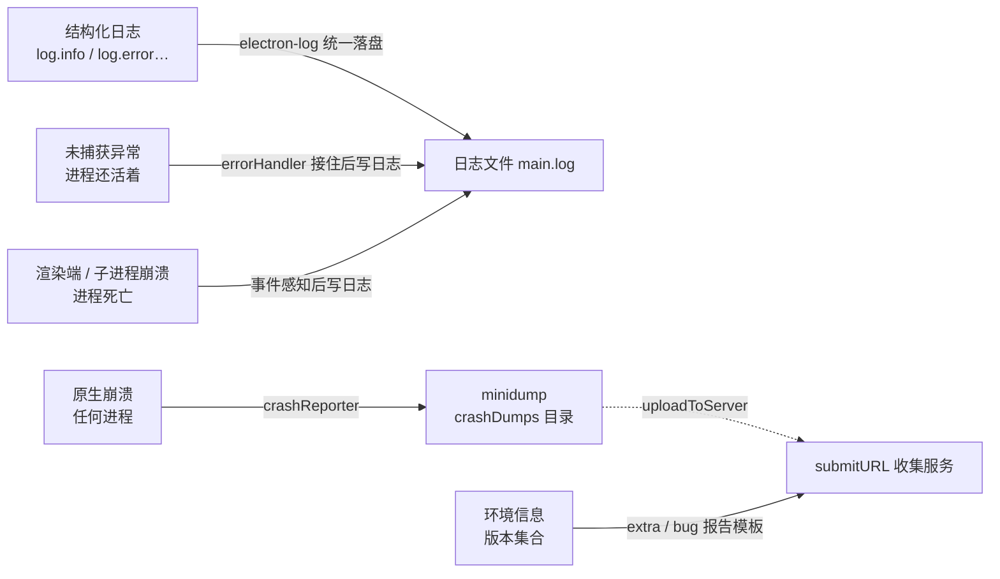

import { Meta } from '@storybook/addon-docs/blocks';

<Meta id="logging-crashes" title="工程化/日志与崩溃收集" name="Docs" />

# 日志与崩溃收集

「[调试](?path=/docs/debugging--docs)」一课说过：开发期日志跟着进程走——主进程的 `console.log` 进终端，渲染端与 preload 进窗口 DevTools。这套安排在打包后全部失效：**用户手上没有终端，也没有打开着的 DevTools**，应用照常运行，错误却发生在你看不见的地方。本课的任务是把开发期"碰巧可见"的信息，变成生产期"必然可回收"的数据。

先建立本课的核心模型。生产期要回收的信号有三类，按**崩溃瞬间代码还来不来得及反应**分级：应用自己写的**日志**走统一落盘；**未捕获异常**发生时进程还活着，代码来得及反应，在异常点捕获后写日志；**崩溃**发生时代码来不及反应，只能靠事件感知与 crashReporter 的 minidump。支撑这些信号的用户环境信息（版本集合）则作为 bug 报告模板与崩溃 extra 的公共底座。



| 信号 | 触发时机 | 感知或采集手段 | 落点 |
| --- | --- | --- | --- |
| 结构化日志 | 应用自己写 | electron-log（主/渲染统一） | 日志文件 `main.log` |
| 未捕获异常 | JS 出错，进程还活着 | `log.errorHandler.startCatching()` / `process.on('uncaughtException')` | 日志，主进程错误可弹窗 |
| 渲染端崩溃 | 渲染进程死亡 | `app.on('render-process-gone')`（事件语义见「[webContents](?path=/docs/webcontents--docs)」） | 日志 + minidump |
| 子进程崩溃 | GPU、utility 等意外退出 | `app.on('child-process-gone')` | 日志 + minidump |
| 原生崩溃 | 任何进程 | `crashReporter.start()` | `crashDumps` 目录 + `submitURL` |
| 环境信息 | 排查问题、随崩溃上报 | `app` / `process` 的版本信息集合 | bug 报告模板 + extra |

## 快速上手

沿用「[接入 TypeScript](?path=/docs/typescript-setup--docs)」的 Forge + Vite + TS 项目，三步把两端日志统一落盘：

```bash
npm install electron-log
```

```ts
// src/main.ts —— 尽早调用，且先于创建任何窗口
import log from 'electron-log/main';

log.initialize(); // 打通渲染端经 IPC 汇聚到主进程的链路
log.info('主进程日志');
```

```ts
// src/renderer.ts —— 渲染端换用 /renderer 入口
import log from 'electron-log/renderer';

log.info('渲染进程日志');
```

启动后核对三个观察点：

1. 开发期终端能看到主进程那一行——主进程的 console transport 仍在往 stdout 写；打包后这一路自然消失。
2. 打开日志文件（macOS 为 `~/Library/Logs/<应用名>/main.log`，Windows 为 `%APPDATA%\<应用名>\logs\main.log`，Linux 为 `~/.config/<应用名>/logs/main.log`）：**两行都在**——渲染端的消息经 IPC 交汇到主进程，由主进程统一写入文件与控制台，文件只有一份。
3. 拿不准实际路径时，在主进程打印 `log.transports.file.getFile().path` 自证。

## 日志落盘

electron-log 的模型一句话讲完：默认 logger 是一个单例，每次 `log.info()` 同时流经多个 transport——console 写终端与 DevTools，file 写日志文件，IPC 负责两端互通。`log.initialize()` 在主进程装好 IPC 桥，渲染端的 `electron-log/renderer` 把消息发回主进程，再由主进程统一写文件。所以**日志库只在主进程配置落盘**，渲染端只需要换入口。

### 主进程与渲染进程统一接入

```ts
// src/main.ts（参考实现在本课目录 logger.ts）
import log from 'electron-log/main';

log.initialize(); // 必须先于窗口创建，渲染端第一条日志才能送达

// 文件传输的默认级别是 'silly'（全量），生产期按需收紧
log.transports.file.level = 'info';
// 单文件默认上限 1048576 字节（1 MB），写满后整体轮转为 main.old.log；设 0 关闭轮转
log.transports.file.maxSize = 5 * 1024 * 1024;
```

默认文件路径与 `app.getPath('logs')` 的默认目录一致、文件名 `main.log`：

| 平台 | 默认日志文件 |
| --- | --- |
| macOS | `~/Library/Logs/<应用名>/main.log` |
| Windows | `%APPDATA%\<应用名>\logs\main.log` |
| Linux | `~/.config/<应用名>/logs/main.log` |

需要自定义位置时改 `resolvePathFn`，`variables.electronDefaultDir` 就是 `app.getPath('logs')`：

```ts
log.transports.file.resolvePathFn = (variables) =>
  path.join(variables.electronDefaultDir, variables.fileName);
```

默认行格式为 `[{y}-{m}-{d} {h}:{i}:{s}.{ms}] [{level}] {text}`，带时间戳与级别，本身就是可 grep 的结构化文本；配套工具：`log.transports.file.readAllLogs()` 读全部日志内容，`getFile().clear()` 清空当前文件。

### 级别与 scope

日志级别从重到轻共六档，调用哪个方法就是哪个级别：

| 级别 | 用途惯例 |
| --- | --- |
| `error` | 失败、崩溃、需要人工介入 |
| `warn` | 可恢复的异常、降级 |
| `info` | 关键路径节点（启动、加载完成、配置变更） |
| `verbose` | 详细流程 |
| `debug` / `silly` | 开发期细节，生产期一般被过滤 |

`scope` 给日志加来源标签，按模块划分归属，排查时先看标签定位代码区域：

```ts
const dbLog = log.scope('db');
dbLog.info('已连接');
// 输出：12:12:21.962 (db) › 已连接
```

落盘量用级别控制，而不是删调用：file transport 默认 `silly` 全量记录，生产期设 `log.transports.file.level = 'info'` 后，`verbose` 及以下不再写文件；单个 transport 设 `level = false` 可整体关闭。

## 异常与崩溃

异常与崩溃共用一道分级判断：**崩溃瞬间代码还来不来得及反应**。来得及的是 JS 层未捕获异常——进程还活着，异常点就是现场，能拿到完整 JS 堆栈；来不及但进程死亡有事件可感知的是渲染端与子进程崩溃——能拿到 `reason` 与 `exitCode`，但拿不到现场；既没有 JS 异常也没有事件的原生崩溃（主进程段错误、GPU 进程崩溃等）只有 minidump 能留下进程内存快照，配合符号文件还原原生调用栈。三层互相补充，不互相替代。

### 未捕获异常

主进程是完整的 Node.js 环境，未捕获异常走 Node 语义：**不注册监听器时，默认行为是打印堆栈并退出**——开发期死在终端里看得见，打包后 Electron 会弹出"A JavaScript error occurred in the main process"对话框（electron-log 的错误处理正是按这套 Electron 逻辑设计的，`showDialog` 默认 `true` 时只在主进程错误时弹窗）。注册 `uncaughtException` 监听器会**取消这个默认崩溃**，所以处理器里不要试图继续正常运行——崩溃点之后的状态已不可信，Node 文档的建议是只做同步记录与清理，然后退出：

```ts
process.on('uncaughtException', (error) => {
  log.error('主进程未捕获异常', error);
  app.quit(); // 记录后退出，不带病运行
});
// 现代 Node（15+）对未处理的 Promise rejection 同样默认按抛错退出处理
process.on('unhandledRejection', (reason) => {
  log.warn('未处理的 Promise rejection', reason);
});
```

渲染端的未捕获异常不会崩窗口，但同样要回收。electron-log 的 `errorHandler` 把两端一起兜住——主进程与渲染进程**各自调用一次** `startCatching()`，未捕获异常与未处理的 rejection 都会写进日志：

```ts
log.errorHandler.startCatching({
  showDialog: false, // 默认 true：仅主进程错误弹窗；渲染端错误与 rejection 从不弹窗
  onError({ error, processType, versions }) {
    // 返回 false 会跳过默认处理；这里保留默认写日志，只附加业务动作
    if (processType === 'renderer') return;
    reportToServer(error, versions); // versions 含 app / electron / os
  },
});
```

`onError` 的参数里带 `createIssue(url, queryParams)`，可以把错误信息拼成查询参数直接打开一个 issue 预填页；需要手动处理某个错误时用 `log.errorHandler.handle(error)`，停止捕获用 `stopCatching()`。

### 渲染端与子进程崩溃

进程死亡来不及执行任何代码，感知靠主进程的事件。`render-process-gone` 的事件语义、`details.reason` / `details.exitCode` 的分类与恢复动作，「[webContents](?path=/docs/webcontents--docs)」一课已经讲过——这里只做接线：挂在 `app` 上一次收全部窗口，在处理器里把崩溃写进日志；崩溃本身的 minidump 由 crashReporter 另行收集，两者叠加不冲突：

```ts
app.on('render-process-gone', (_event, webContents, details) => {
  log.error('渲染进程退出', {
    reason: details.reason,
    exitCode: details.exitCode,
    url: webContents.getURL(),
  });
});
```

子进程（GPU、utility 等）意外消失走 `app.on('child-process-gone')`，`details.type` 区分进程种类，`reason` 取值包括 `crashed`、`oom`、`killed`、`launch-failed` 等——注意它**不包含渲染进程**，渲染端只走上面的事件：

```ts
app.on('child-process-gone', (_event, details) => {
  log.error('子进程退出', { type: details.type, reason: details.reason, exitCode: details.exitCode });
});
```

想先省事再细化，可以只开 `log.eventLogger.startLogging()`：它把 `render-process-gone`、`preload-error`、`certificate-error` 等 Electron 事件自动写进日志，之后再按需换成自己的处理器补充上报动作。

### 崩溃上报：crashReporter 与 minidump

crashReporter 是唯一能接到**原生崩溃**现场的手段：它基于 Chromium Crashpad，在任何进程崩溃时收集 minidump（崩溃瞬间的内存快照），按配置落盘与上传。接线只有一次 `start()`，但有严格的时机约束：**在应用启动最早处调用，建议放在 `app.whenReady()` 之前，且先于创建任何窗口**——晚于它启动的渲染进程不会被监控；一旦启动无法停止；Electron 10 起它只在主进程可用，渲染进程里调用已废弃。

```ts
import { crashReporter } from 'electron';

crashReporter.start({
  // 收集服务的接收端点；uploadToServer 为 false 时可省略
  submitURL: 'https://crash.example.com/post',
  // 默认 true；false 时仍收集并保存在本地，只是不上传
  uploadToServer: true,
  // 随所有进程崩溃上报的环境信息（见「用户环境信息」一节）
  globalExtra: collectEnvInfo(),
});
```

| 选项 | 默认值 | 要点 |
| --- | --- | --- |
| `submitURL` | 无 | 上传端点，`uploadToServer` 为 `false` 时可省 |
| `uploadToServer` | `true` | 运行期可用 `setUploadToServer()` 按用户偏好开关 |
| `compress` | `true` | 请求体 gzip；关掉它而上传仍开着是废弃用法 |
| `extra` | 无 | 字符串键值，**只进主进程**的崩溃报告 |
| `globalExtra` | 无 | 进**所有进程**的崩溃报告，`start` 之后不可再改 |
| `rateLimit` | `false` | `true` 时每小时最多上传 1 次，超限报告仍存本地 |
| `ignoreSystemCrashHandler` | `false` | 仅 macOS/Linux 有效 |

服务端契约：crashReporter 向 `submitURL` 发 **multipart/form-data** 的 POST，固定字段包括 `ver`（Electron 版本）、`platform`、`process_type`（`browser` / `renderer`）、`guid`、`_version`（package.json 版本）、`_productName`、`prod`，minidump 本体在 `upload_file_minidump` 字段里，另附 `globalExtra` 与崩溃进程的 extra；`compress` 开着时请求体带 `Content-Encoding: gzip`。**服务端响应体就是这条报告的 id**，可用于回执关联。

自定义参数的规则要记三条：extra 是 `Record<string, string>`，键最长 39 字节、值最长 20320 字节，超长键直接忽略、超长值截断；主进程用 `crashReporter.addExtraParameter(key, value)` 附加崩溃瞬间的上下文（`extra` 只进主进程崩溃，渲染端崩溃最常见，所以环境信息放 `globalExtra`）；`utilityProcess` 创建的进程没有附加参数的 API，只有 `globalExtra` 能到达它们的报告。

落点与查询：报告存在 `app.getPath('crashDumps')` 目录（要在 `start` 之前用 `app.setPath('crashDumps', ...)` 才能改位置）；`getUploadedReports()` 名字有误导——它返回磁盘上**全部**报告，未上传（含上传失败与被限流）的报告 `id` 为空，筛选已上传要按 `id` 非空过滤；`getLastCrashReport()` 同理。范围边界：Mac App Store 构建会整体停用这个模块，方法可调用但什么都不做。

没有收集服务也能起步：`submitURL` 不配、`uploadToServer: false`，minidump 照样落盘，用户按指引把 `crashDumps` 目录下的文件发给你即可。接入 Sentry 等第三方崩溃收集服务时，用它们提供的 `submitURL` 与官方 SDK 配置即可，具体接法属于其他主题，本课不展开。验证整条链路用 `process.crash()`——让主进程主线程真实崩溃一次，核对 `crashDumps` 出现新文件、服务端收到 POST（触发入口参考本课目录 `crash-reporter.ts`）。

## 用户环境信息

崩溃报告与 bug 报告都要回答同一个问题："跑在什么环境"。`_version`、`ver` 等固定字段之外，应用自身的版本与运行环境要靠 extra 带上去；用户手写 issue 时，给一份现成模板最省事。做法是把字段收进一个函数，作为崩溃 extra 与 bug 模板的单一来源（参考实现在本课目录 `env-info.ts`）：

| 字段 | 来源 | 边界 |
| --- | --- | --- |
| 应用版本 | `app.getVersion()` | package.json 没写 version 时回退到可执行文件的版本 |
| 运行时版本 | `process.versions.electron` / `.chrome` / `.node` | 排查"是不是版本引入的"第一依据 |
| 平台与架构 | `process.platform` / `process.arch` | — |
| 系统版本 | `process.getSystemVersion()` | macOS 上给真实系统版本；`os.release()` 给的是内核版本 |
| 语言与地区 | `app.getLocale()` / `app.getLocaleCountryCode()` | 前者须在 `ready` 后调用；后者可能为空字符串 |
| 进程类型 | `process.type` | `browser` / `renderer` / `utility` 等，标明信息来自哪一侧 |

```ts
import { app } from 'electron';

export function collectEnvInfo(): Record<string, string> {
  return {
    appVersion: app.getVersion(),
    electron: process.versions.electron ?? '',
    chrome: process.versions.chrome ?? '',
    node: process.versions.node ?? '',
    platform: process.platform,
    arch: process.arch,
    osVersion: process.getSystemVersion(),
    locale: app.getLocale(),
    country: app.getLocaleCountryCode(),
    processType: process.type ?? 'browser',
  };
}
```

这份记录全是字符串，可直接填入 crashReporter 的 `globalExtra`（受 39 / 20320 字节限制），也可渲染成 Markdown 列表贴进 issue。这些都属于公开的设备与版本信息，不含个人标识；即便如此，上传前告知用户、上传开关交给用户偏好仍是惯例（`setUploadToServer()` + `rateLimit`）。

## 最佳实践

- **三层信号都接，缺口互补。** `errorHandler` 只接 JS 异常，事件只报"进程死了"，crashReporter 才有原生现场——只接一层，每层都会漏掉另外两层的问题。接线顺序：`log.initialize()` → `errorHandler.startCatching()` → 事件监听 → `crashReporter.start()`，全部在 `ready` 前后尽早完成。
- **级别与 scope 先约定再写日志。** 按模块 `scope`、按严重度选级别、生产期文件级别收到 `info`；把所有信息都写成 `info` 的日志文件，排查时等于没有级别。
- **日志与 extra 都不放敏感信息。** 日志文件是用户磁盘上的明文，extra 随报告明文上传；路径、URL、ID 可以进，token、文件内容不能进。
- **环境信息单一来源。** 一个 `collectEnvInfo()` 同时供给 `globalExtra` 与 bug 报告模板，别维护两份版本清单；注意 `app.getLocale()` 的 `ready` 时机约束。
- **上传开关交给用户。** `uploadToServer` 默认开着，配合 `setUploadToServer()` 与 `rateLimit` 做成用户偏好；没有收集服务时先用本地 `crashDumps` 起步，不必为了"有上报"而引入服务。

## 常见问题

- 打包后找不到日志文件
  先确认应用名怎么解析：默认路径里的 `<应用名>` 取自 package.json 的 `productName`（优先）或 `name`，开发期与打包后的应用名可能不同。最直接的自证是在主进程打印 `log.transports.file.getFile().path`；自定义过 `resolvePathFn` 的以它为准。
- 注册了 `uncaughtException` 处理器后进程不崩了，但继续跑出各种诡异状态
  处理动作：处理器里只做同步的记录与清理，然后 `app.quit()` 或 `process.exit()`，不要吞掉异常继续正常运行。判断依据是 Node 语义——注册监听器本身就取消了"崩溃退出"这个默认行为，崩溃点之后的进程状态已不可信；用 electron-log 的 `errorHandler` 可以省去这套手工处理。
- `submitURL` 配了，服务端却没收到崩溃报告
  按顺序核对：本地 `app.getPath('crashDumps')` 里是否已生成报告（没有则先查 `start` 是否早于窗口创建）；`uploadToServer` 是否为 `true`；服务端是否按 multipart/form-data 解析了 `upload_file_minidump` 字段；`compress` 默认 `true` 时请求体是 gzip，服务端要能解压；`rateLimit` 为 `true` 时每小时最多上传 1 次。整条链路用 `process.crash()` 主动制造一次崩溃来验证。
- 渲染端的 `log.info` 没写进文件
  两个前置：主进程调用了 `log.initialize()` 且早于创建窗口；渲染端用的是 `electron-log/renderer` 入口而不是 `electron-log/main`。都满足仍没有，确认这条日志真的执行到了——渲染端代码的报错本身会走 `errorHandler`，先在日志里找渲染端的异常记录。

## 总结回顾

摘要：

打包后的应用没有终端和 DevTools，开发期的日志落点全部失效，需要主动搭建回收通道。日志用 electron-log：主进程 `log.initialize()` 装好 IPC 桥，渲染端换 `electron-log/renderer` 入口，两端消息由主进程统一写进 `main.log`（默认路径与 `app.getPath('logs')` 一致，1 MB 轮转 `main.old.log`），级别六级、`scope` 分模块、文件级别按生产需求收紧。未捕获异常走 Node 语义：注册 `uncaughtException` 监听器会取消默认崩溃，处理器只做记录清理后退出；electron-log 的 `errorHandler.startCatching()` 在主/渲染两端兜住异常与 rejection，`showDialog` 默认只在主进程错误时弹窗。进程死亡来不及执行代码：渲染端 `render-process-gone`（事件语义见 webContents 课）与子进程 `child-process-gone` 在主进程感知并写日志；原生崩溃的现场只有 crashReporter 的 minidump 能留——`start()` 要在 ready 前且先于窗口创建，向 `submitURL` 发 multipart/form-data（`upload_file_minidump` 字段），extra 键值受 39 / 20320 字节限制，环境信息放 `globalExtra` 才能覆盖渲染端崩溃，没有服务时可先本地落盘。用户环境信息收进一个 `collectEnvInfo()`，同时充当 bug 报告模板与崩溃 extra。

一句话：

> 开发期的信息是"碰巧可见"，生产期的信息必须"必然可回收"——日志统一落盘、异常接住再退、崩溃靠事件与 minidump，环境信息随报告带走。

知识要点：

- 打包后为什么"看不见"错误？日志、异常、崩溃三类信号各靠什么手段回收？
- electron-log 里主/渲染两端日志怎样统一落盘？默认文件在哪、写满 1 MB 后发生什么？
- 六个级别分别什么惯例？`scope` 怎么用？生产期怎样收紧文件输出量？
- 注册 `uncaughtException` 监听器后默认行为发生了什么变化？`errorHandler` 的 `showDialog` / `onError` 各管什么？
- `render-process-gone` 挂在 `app` 上与挂在 `webContents` 上的差别？`child-process-gone` 管哪些进程、不管哪些？
- `crashReporter.start()` 为什么要在 `ready` 之前、先于窗口创建？服务端收到哪些字段？
- `extra` 与 `globalExtra` 的差别和大小限制是什么？没有收集服务时崩溃报告去了哪？
- 用户环境信息收集哪些字段？哪些字段有调用时机约束？怎样验证整条崩溃上报链路？

## 参考资料

- [Electron API：crashReporter](https://www.electronjs.org/docs/latest/api/crash-reporter)
  本课主要依据：`start` 的时机约束与各选项默认值、服务端收到的 multipart 字段清单、extra 键值 39 / 20320 字节限制、`globalExtra` 的作用范围与不可变性、`crashDumps` 目录、`getUploadedReports` 返回全部报告的语义、Mac App Store 构建停用模块的边界、`process.crash()` 测试方式。
- [electron-log（GitHub README）](https://github.com/megahertz/electron-log)
  `log.initialize()` 与主/渲染双入口、渲染端经 IPC 汇聚主进程统一落盘、三平台默认路径、默认行格式、六个级别、`scope`、`eventLogger` 可捕获的事件清单。
- [electron-log：File transport](https://github.com/megahertz/electron-log/blob/master/docs/transports/file.md)
  `maxSize` 默认 1048576 与 `.old.log` 轮转、`resolvePathFn` 与 `electronDefaultDir`、`readAllLogs()` / `getFile()`、`sync` 与 `writeOptions` 默认值。
- [electron-log：Catching errors](https://github.com/megahertz/electron-log/blob/master/docs/errors.md)
  `startCatching` 需在主/渲染两端各自调用、`showDialog` 默认 `true` 且仅主进程错误弹窗、`onError` 参数（`createIssue` / `error` / `processType` / `versions`）与返回 `false` 跳过处理的语义。
- [Electron API：process](https://www.electronjs.org/docs/latest/api/process)
  `process.crash()` / `process.hang()`、`process.type` 取值、`process.getSystemVersion()` 与 `os.release()` 在 macOS 上的差异、`process.versions.electron` / `.chrome`。
- [Electron API：app](https://www.electronjs.org/docs/latest/api/app)
  `getPath('logs')` / `getPath('crashDumps')` 与 `setAppLogsPath` 默认值、`getVersion()` 的回退行为、`getLocale()` 的 `ready` 时机约束、`getLocaleCountryCode()` 可能返回空串、`child-process-gone` 与 `render-process-gone` 事件及 `details` 字段。
- [Node.js 文档：process 事件](https://nodejs.org/api/process.html#event-uncaughtexception)
  `uncaughtException` / `unhandledRejection` 的 Node 侧语义：注册监听器取消默认崩溃、处理器内只做记录清理后退出的官方建议。
