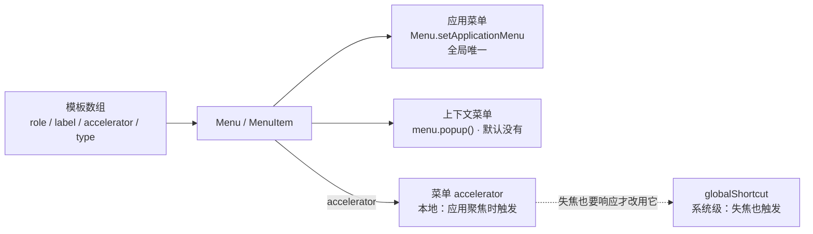

import { Canvas, Controls, Meta } from '@storybook/addon-docs/blocks';

import * as MenusStories from './menus.stories';

<Meta of={MenusStories} name="Docs" />

# 菜单

菜单是桌面应用最原生的命令入口：应用菜单（菜单栏）管全局命令，上下文菜单（右键）管就地操作。Electron 里两者是同一套 `Menu` / `MenuItem` API 的两种挂载形态——`Menu.setApplicationMenu` 把一个 `Menu` 挂成全局唯一的应用菜单，`menu.popup()` 把一个 `Menu` 弹成上下文菜单。菜单项的核心输入是 `role`：预定义行为自带标签和快捷键，指定 role 时 `click` 被忽略。不写任何菜单代码时 Electron 会自动创建一份标准默认菜单，而一旦 `setApplicationMenu` 就整体替换——默认菜单里的快捷键要靠 role 带回来。快捷键分两级：菜单项上的 `accelerator` 是本地快捷键（应用聚焦时触发），`globalShortcut` 向操作系统注册系统级快捷键（失焦也触发）。读完你应能预测：不写菜单代码时菜单栏有什么、换了自定义菜单后 reload 快捷键还在不在、右键为什么不弹菜单、一个快捷键该挂在菜单上还是 globalShortcut 上。



关键回查项（完整语义见正文与参考资料）：

| 回查项 | 值 | 备注 |
| --- | --- | --- |
| `Menu.setApplicationMenu(menu)` | 设置全局唯一的应用菜单 | macOS 系统菜单栏；Windows/Linux 每个窗口顶部 |
| 默认菜单 | 应用不设置时自动创建 | 标准项 File / Edit / View / Window |
| 抑制默认菜单 | `Menu.setApplicationMenu(null)` | Windows/Linux 同时移除窗口菜单栏 |
| `Menu.buildFromTemplate(template)` | 模板数组一次性构建 Menu | 顶层项必须是 submenu |
| `role` | 预定义行为 | 自带 label 与 accelerator；指定时 click 被忽略 |
| `type` | `normal` / `separator` / `submenu` / `checkbox` / `radio` | checkbox 点击翻转；radio 相邻互斥 |
| `menu.popup(options)` | 弹出上下文菜单 | 默认弹在光标处；`x` / `y` 必须成对 |
| `accelerator` | 本地快捷键 | 应用聚焦时才触发 |
| `globalShortcut` | 系统级快捷键 | 失焦也触发；本课只作对比说明 |

## 快速上手

沿用前面课程用 Forge 创建的项目（`src/index.js` + `src/index.html`，见「[安装](?path=/docs/install--docs)」），三步把默认菜单换成自定义菜单。完整参考实现在本课目录的 `application-menu.js`。

1. 在 `src/index.js` 的 `require` 之后（模块顶层，官方教程的写法）定义模板并设置应用菜单：

   ```js
   const { app, BrowserWindow, Menu } = require('electron');

   const isMac = process.platform === 'darwin';

   const template = [
     // macOS 第一个子菜单永远是应用名菜单，用 appMenu role 填充标准项
     ...(isMac ? [{ role: 'appMenu' }] : []),
     { role: 'fileMenu' },
     { role: 'editMenu' },
     {
       label: '选项',
       submenu: [
         {
           label: '欢迎语',
           accelerator: 'CommandOrControl+Shift+W',
           click: () => console.log('[menu] 欢迎语被点击'),
         },
         { type: 'separator' },
         { label: '自动换行', type: 'checkbox', checked: true },
       ],
     },
     { role: 'viewMenu' },
   ];

   // 模板一次性构建 Menu，再设置成全局唯一的应用菜单
   Menu.setApplicationMenu(Menu.buildFromTemplate(template));
   ```

2. 在运行 start 的终端输入 `rs` 重启（主进程改动，规则见「[第一次运行](?path=/docs/first-run--docs)」）。
3. 逐项核对：

   - **菜单栏被替换**——macOS 菜单栏变成「应用名 / File / Edit / 选项 / View」，Windows/Linux 是窗口顶部一行菜单；
   - **macOS 第一个菜单的标题是应用名**，不是模板里写的任何 label——第一个子菜单的标签永远是应用名，这是官方行为（见「macOS」一节）；
   - **点「欢迎语」**——运行 start 的终端出现 `[menu] 欢迎语被点击`：click 在主进程执行；
   - **按 `Cmd+Shift+W`**（Windows/Linux 为 `Ctrl+Shift+W`）——同样触发：`CommandOrControl` 在两平台分别解析为 `Cmd` 与 `Ctrl`；
   - **「自动换行」**——点一下打勾、再点取消，重新打开菜单勾选状态保持：checkbox 的翻转语义，状态存在 MenuItem 实例上。

## 应用菜单：setApplicationMenu

一个应用同一时刻只有一个应用菜单，这是与上下文菜单最根本的区别。平台呈现不同：macOS 的菜单在系统菜单栏（屏幕顶部），由原生 AppKit 渲染；Windows/Linux 的菜单显示在**每个窗口顶部**，随窗口走。

三个入口动作：

- **不设置**——默认菜单自动创建，含 File / Edit / View / Window 标准项（「[应用生命周期](?path=/docs/app-lifecycle--docs)」里"File 菜单自带 Quit 角色"说的就是它）；
- **`setApplicationMenu(menu)`**——整体替换默认菜单，随时可再调用换菜单；
- **`setApplicationMenu(null)`**——抑制默认菜单，Windows/Linux 还会移除窗口顶部的菜单栏（自绘标题栏的应用常用，配合「[无边框窗口](?path=/docs/frameless-windows--docs)」）。

托盘菜单、macOS 的 Dock 菜单是同一套 API 的其他挂载形态，托盘见「[托盘](?path=/docs/tray--docs)」，本课不展开。

运行期取回与修改：`Menu.getApplicationMenu()` 返回当前应用菜单。边界：返回的实例**不支持动态增删菜单项**，但实例属性可以动态改——运行期灰置、勾选某个菜单项就用它（配合 `id` 属性给菜单项命名）：

```js
const menu = Menu.getApplicationMenu();
menu.getMenuItemById('auto-wrap').checked = false;
menu.getMenuItemById('export').enabled = false; // 灰置，下次打开菜单生效
```

### macOS：应用名菜单与 appMenu role

macOS 应用菜单的第一个子菜单是应用名菜单，官方行为很明确：**第一个子菜单的标签永远是应用名**（`app.name`，默认取自 package.json 的 name）——你给这一项写的 label 不会显示。惯例做法是模板第一项用 appMenu role 填充，它一次性带出 About、Services、Hide、Quit 等标准项：

```js
const template = [
  // macOS 才有应用名菜单，其他平台不需要这一项
  ...(isMac ? [{ role: 'appMenu' }] : []),
  // 后面的项两平台通用
];
```

可观察证据：快速上手——macOS 菜单栏第一个菜单显示应用名，展开是 About / Services / Hide / Quit 全套标准项；Windows/Linux 上没有这个菜单。

边界：macOS 上指定了 role 的菜单项，**label 和 accelerator 之外的选项全部被忽略**（官方明文）——想给 role 项配 icon、改 enabled 都不生效。

### Windows/Linux：窗口顶部菜单

`setApplicationMenu` 的菜单成为每个窗口的顶部菜单；窗口级还可以单独处理：`win.setMenu(menu)` 给某个窗口换不同的菜单，`win.removeMenu()` 移除某个窗口的菜单栏。

这个平台还有两个专属细节：

- **`&` 助记符**——顶层项 label 里的 `&` 生成 Alt 加速键：`&File` 生成 `Alt+F` 打开菜单并给 F 加下划线；想显示字面的 `&` 写 `&&`。macOS 无此语义。
- **File 菜单放 Quit**——官方重建默认菜单的示例里，File 菜单在 macOS 用 `close` 角色、其余平台用 `quit` 角色；这就是"应用菜单 Quit 开箱即用"的出处（见「[应用生命周期](?path=/docs/app-lifecycle--docs)」）。

## 菜单项：role、type 与子菜单

模板数组里的每一项是一个 `MenuItemConstructorOptions`，五个关键输入：

| 输入 | 作用 | 默认与要点 |
| --- | --- | --- |
| `label` | 显示文字 | 非 separator 项必须有 label：手写，或由 role 继承 |
| `role` | 预定义行为 | 指定时 click 被忽略；自带 label 与 accelerator |
| `accelerator` | 快捷键 | role 自带标准值；只在想覆盖时写 |
| `type` | 外观与行为 | 默认 `normal`；带 `submenu` 自动成为 `submenu` 类型 |
| `submenu` | 子菜单 | 嵌套数组或 Menu 实例 |

自定义行为的入口是 `click(menuItem, window, event)`：`window` 是发起菜单的窗口，应用无窗口时为 `undefined`。菜单对象属于主进程模块，click 与日志都落在运行 `npm start` 的终端。

### role：预定义行为

官方建议：能匹配标准命令的项一律用 role，而不是自己在 click 里实现——role 映射原生行为（macOS 上直接映射 AppKit 动作），自带平台文案与标准快捷键。role 字符串大小写不敏感（`toggleDevTools` 与 `toggledevtools` 等价）。

常用 role 回查表（完整清单见参考资料 MenuItem）：

| 分组 | role | 备注 |
| --- | --- | --- |
| 编辑类 | `undo` `redo` `cut` `copy` `paste` `pasteAndMatchStyle` `delete` `selectAll` | 作用于聚焦的页面文本 |
| 窗口与视图类 | `minimize` `close` `quit` `about` `reload` `forceReload` `toggleDevTools` `togglefullscreen` `resetZoom` `zoomIn` `zoomOut` `toggleSpellChecker` | `quit` 退出应用；`about` 打开关于面板 |
| 整菜单类 | `fileMenu` `editMenu` `viewMenu` `windowMenu` `appMenu` `help` | 一次带出一整个标准子菜单；`appMenu` 仅 macOS；`help` 在 macOS 的 Help 菜单自带搜索栏 |
| macOS 专属 | `hide` `hideOthers` `unhide` `front` `zoom` `services` `recentDocuments` `clearRecentDocuments` `startSpeaking` `stopSpeaking` `shareMenu` 等 | 映射 AppKit 动作，其他平台无意义；`shareMenu` 需配 `sharingItem` |

指定 role 时 `click` 被忽略——官方语义是"role 定义了菜单项的行为，指定时忽略 click 属性"。role 与 click 二选一，见常见问题。

### type：checkbox、radio 与分隔线

类型决定菜单项的外观与点击行为，全部取值：`normal`（默认）、`separator`、`submenu`、`checkbox`、`radio`（另有 `header`、`palette` 仅 macOS 14+，本课不展开）。自定义类型的三条规则：

- **checkbox**——点击翻转 `checked`，初始状态用 `checked: true` 声明；
- **radio**——点击把自己的 `checked` 置 true，并熄灭**同组**的其他 radio。同组的定义是官方规则：同一层子菜单里相邻、中间没有被分隔线隔开的 radio 项；
- **separator**——`{ type: 'separator' }` 声明一条分隔线；它既是视觉分隔，也是 radio 的分组边界。

下面的模拟在浏览器里复现这些模板规则（真实 Electron 无法在浏览器运行）：左区是模板代码，右区是 `buildFromTemplate` 构建出的菜单，点击菜单项对照两侧行为。

<Canvas of={MenusStories.Interactive} />
<Controls of={MenusStories.Interactive} />

| 操作 | 可观察证据 |
| --- | --- |
| 点「中字号」 | 它选中、「小字号」熄灭：radio 同组互斥 |
| 打开「radio 组插分隔线」再点「大字号」 | 只有它选中、「中字号」保持：分隔线把相邻组断开 |
| 点「自动换行」 | 勾选翻转：checkbox 的切换语义 |
| 「平台」切到 Windows | 「复制」的快捷键从 ⌘C 变 Ctrl+C：role 自带快捷键按平台显示 |
| 打开 Show code | 看到该 Canvas 实际执行的 `menu-template-sim.ts` |

### 子菜单与模板定位

`submenu` 的值可以是 `MenuItemConstructorOptions[]`（自动按模板构建）或现成的 Menu 实例；带 `submenu` 的项自动成为 submenu 类型。应用菜单的**顶层项必须是 submenu**——菜单栏的每一项都是一个下拉菜单：

```js
{
  label: '字号',
  submenu: [
    { label: '放大', role: 'zoomIn' },
    { label: '缩小', role: 'zoomOut' },
  ],
}
```

两种构建方式等价：`Menu.buildFromTemplate([...])` 一次成型，或 `new Menu()` 后逐个 `menu.append(new MenuItem({...}))`——教程对照示例给出的两条路，模板写法省样板。

项的顺序默认按数组排；需要精确控制时给项命名 `id`，用 `before` / `after` 插到指定 id 项的前面 / 后面（引用的 id 不存在时插到末尾），`beforeGroupContaining` / `afterGroupContaining` 以组为单位定位——这组定位选项主要服务构建期拼装，运行期增删项是不支持的（见「应用菜单」的 getApplicationMenu 边界）。

## 上下文菜单：popup

与浏览器最大的差异先说清：**Electron 默认不提供任何右键菜单**——官方教程原话是 No context menu will appear by default in Electron，输入框右键也没有。要上下文菜单，就监听右键事件，在处理器里 `menu.popup()` 弹出。

菜单对象始终在主进程构建（`Menu` 是主进程模块）。触发路径有两条：渲染端监听 DOM `contextmenu` 事件、经 IPC 通知主进程弹出；或主进程直接监听 `webContents` 的 `context-menu` 事件。菜单结构、role 与模板规则与上一节完全相同，变的只是"什么时候弹、弹在哪"。

### 渲染端 contextmenu 事件经 IPC

三段链路，完整参考实现在本课目录的 `context-menu-preload.js` 与 `context-menu-main.js`。

第 1 步，preload 把「打开菜单」包装成页面的具名动词（通道名与 `ipcRenderer` 不出 preload，原则见「[预加载脚本](?path=/docs/preload--docs)」）：

```js
// src/preload.js
const { contextBridge, ipcRenderer } = require('electron');

contextBridge.exposeInMainWorld('contextMenu', {
  open: (payload) => ipcRenderer.send('context-menu:open', payload),
});
```

第 2 步，页面监听 DOM `contextmenu`，阻止默认并通知主进程：

```html
<script>
  window.addEventListener('contextmenu', (event) => {
    event.preventDefault();
    // 需要时把点击上下文（坐标等）作为普通数据一起传
    window.contextMenu.open({ x: event.clientX, y: event.clientY });
  });
</script>
```

第 3 步，主进程收到消息后构建并弹出：

```js
// src/index.js
const { ipcMain, Menu, BrowserWindow } = require('electron');

ipcMain.on('context-menu:open', (event) => {
  const editMenu = Menu.buildFromTemplate([
    { role: 'copy' },
    { role: 'cut' },
    { role: 'paste' },
    { role: 'selectAll' },
  ]);
  editMenu.popup({
    window: BrowserWindow.fromWebContents(event.sender), // 从事件找回发起窗口
  });
});
```

可观察证据：右键页面任意位置弹出编辑菜单；popup 不传 `x` / `y` 时默认弹在当前光标位置，所以第 2 步传不传坐标都不影响弹出位置——坐标是给"不止响应鼠标"的场景留的。IPC 的通道模型见「[IPC 概念](?path=/docs/ipc-basics--docs)」，本课只需要 `send` 单向触发。

边界：`event.preventDefault()` 阻止的是事件的默认行为——Electron 本来就没有默认菜单，保留它与 Web 开发习惯一致，删掉也不影响 popup。

### 主进程 context-menu 事件

另一条路径不需要页面配合：主进程直接监听 `webContents` 的 `context-menu` 事件，回调的 `params` 带着右键发生处的完整上下文，适合全页面统一接管、按场景定制：

```js
// src/index.js：createWindow 里、窗口创建之后注册
mainWindow.webContents.on('context-menu', (_event, params) => {
  const template = [];

  // 可编辑元素或选中文本：给编辑角色项
  if (params.isEditable || params.selectionText) {
    template.push({ role: 'copy' }, { role: 'cut' }, { type: 'separator' });
  }
  // 链接：给打开项（shell.openExternal 见「打开外部资源」）
  if (params.linkURL) {
    template.push({
      label: '打开链接',
      click: () => shell.openExternal(params.linkURL),
    });
  }

  if (template.length > 0) {
    Menu.buildFromTemplate(template).popup({ window: mainWindow });
  }
});
```

params 高频字段回查（完整清单见参考资料 webContents）：

| 字段 | 含义 |
| --- | --- |
| `x` / `y` | 右键发生处的坐标 |
| `isEditable` | 右键处是否可编辑（输入框之类） |
| `selectionText` | 选中的文本，无选中为空 |
| `linkURL` | 右键处所在链接的地址 |
| `srcURL` / `mediaType` | 图片、音视频等媒体元素的源地址 / 类型 |
| `editFlags` | 渲染端对能否 undo / cut / copy / paste 等的判断布尔值 |
| `misspelledWord` / `dictionarySuggestions` | 拼写错误词与建议替换，配合拼写检查做纠正菜单 |

两条路径怎么选：组件自治、只有特定区域要自定义菜单——渲染端路径（页面最清楚自己的交互语义）；全页面统一接管、要按链接 / 图片 / 输入框细分——主进程路径（params 信息全，不用页面逐个监听）。

macOS 补充：popup 时传 `frame: params.frame` 才能启用 Writing Tools 等系统级特性（官方教程给出的写法）。

### popup 的参数与边界

| 参数 | 说明 |
| --- | --- |
| `window` | 弹在哪个窗口；默认聚焦窗口 |
| `x` / `y` | 弹出位置；默认当前光标位置；**必须成对声明** |
| `positioningItem` | 仅 macOS：指定光标下的菜单项索引，默认 -1 |
| `callback` | 菜单关闭时调用 |
| `frame` | 传 WebFrameMain 以启用 macOS Writing Tools 等；通常传 `params.frame` |

配套能力：`menu.closePopup([window])` 主动关闭；菜单实例有 `menu-will-show` / `menu-will-close` 事件，分别在弹出与关闭时触发。上下文菜单与托盘菜单共用 popup 这套行为，托盘的挂法见「[托盘](?path=/docs/tray--docs)」。

## 快捷键：accelerator 与 globalShortcut

快捷键按触发范围分两级，分工的判断只有一句：**失焦时要不要响应？**不要——挂菜单项的 `accelerator`（本地快捷键，应用聚焦时触发，还直接显示在菜单上，可发现性好）；要——用 `globalShortcut.register` 向操作系统注册（系统级，失焦也触发，代价是全局占用与冲突处理）。应用内命令一律用前者。

### accelerator 语法

一条 accelerator 是"多个修饰键 + 单个键码"的字符串，用 `+` 连接，大小写不敏感：`CommandOrControl+Shift+W`。跨平台的关键是 `CommandOrControl`——macOS 解析为 `Cmd`，Windows/Linux 解析为 `Ctrl`，快速上手的第 4 个观察点验证过。

修饰键回查表（官方给出的平台映射）：

| 修饰键 | macOS | Windows / Linux |
| --- | --- | --- |
| `CommandOrControl`（`CmdOrCtrl`） | ⌘ Cmd | Ctrl |
| `Command` / `Cmd` | ⌘ Cmd | 无效 |
| `Control` / `Ctrl` | ^ Control | Ctrl |
| `Alt` | ⌥ Option | Alt |
| `Option` | ⌥ Option | 无效 |
| `Super`（`Meta`） | ⌘ Cmd | ⊞ Windows |

官方建议跨平台只用 `CommandOrControl` 和 `Alt`——`Cmd`、`Option` 在 Windows/Linux 上无效。键码常用值：`0`-`9`、`A`-`Z`、`F1`-`F24`、`Plus`、`Space`、`Tab`、`Backspace`、`Delete`、`Insert`、`Return`（`Enter`）、四个方向键、`Home` / `End`、`PageUp` / `PageDown`、`Escape`（`Esc`）、音量与媒体键、小键盘 `num0`-`num9` 等，完整清单见参考资料 Keyboard Shortcuts。

role 自带标准 accelerator（`copy` 自带 `CommandOrControl+C`），所以 label 和 accelerator 只在想覆盖时才写。本地快捷键还有两个值得记住的边界：

- **菜单项隐藏后快捷键仍然生效**——官方明示的行为；macOS 可以用 `acceleratorWorksWhenHidden: false` 关掉（Windows/Linux 上隐藏项的快捷键始终生效）。
- Windows/Linux 上 `registerAccelerator: false` 让快捷键**只显示在菜单上、不实际注册**——键位让给别处（比如页面自己的键盘监听）时不选它。

不进菜单、也不需要系统级的第三类键位，官方教程给的出口是在渲染端监听 `keydown`，或主进程用 `before-input-event` 拦截；细节见 Keyboard Shortcuts 教程（参考资料）。

### globalShortcut：系统级注册

官方定位一句话：向操作系统注册/注销全局快捷键。最小用法（含官方示例的两个要点：检查返回值、退出前注销）：

```js
const { app, globalShortcut } = require('electron');

app.whenReady().then(() => {
  // 返回 boolean：组合键被其他应用占用时静默失败（返回 false，不抛错）
  const ok = globalShortcut.register('CommandOrControl+Alt+M', () => {
    console.log('[global] 失焦也会触发');
  });
  console.log(`[global] 注册${ok ? '成功' : '失败（组合键被占用）'}`);
});

app.on('will-quit', () => {
  globalShortcut.unregisterAll(); // 官方示例：退出前注销
});
```

与菜单 accelerator 的分工对照：

| | 菜单 accelerator | globalShortcut |
| --- | --- | --- |
| 触发范围 | 应用聚焦时 | 全系统，失焦也触发 |
| 注册位置 | 菜单项属性 | 向操作系统申请 |
| 可发现性 | 直接显示在菜单上 | 用户不可见 |
| 冲突处理 | 应用内自洽 | 被占用时静默失败（`register` 返回 false） |
| 生命周期 | 随应用退出失效 | 建议 `will-quit` 里 `unregisterAll` |
| 平台注意 | — | macOS 非 QWERTY 布局有已知 bug；Linux Wayland 经 portal 注册 |

边界三条：注册必须发生在 app `ready` 之后（模块能力约束）；macOS 上对非 QWERTY 键盘布局有长期未解的 bug（electron/electron#19747）；Linux Wayland 下经 GlobalShortcuts portal 注册，GNOME 会弹首次授权对话框。与它相邻的"应用不在前台时被触达"主题——协议深链、单实例锁——见「[深链与单实例](?path=/docs/deep-links--docs)」。

## 最佳实践

- **role 优先，click 只补自定义行为。** 匹配标准命令的项一律给 role：原生行为、平台文案、标准快捷键免费获得；指定 role 后再写 click，click 不会执行。
- **模板按平台组合，macOS 以 appMenu 开头。** `...(isMac ? [{ role: 'appMenu' }] : [])` 放模板第一项；平台差异项用展开运算符按需插入（File 菜单 close / quit 之差是典型）。
- **上下文菜单内容跟着触发上下文走。** 全局统一接管用主进程 `context-menu` 事件、按 params 定制；组件自治用渲染端经 IPC、payload 由页面给。静态菜单可构建一次反复 popup；按 params 动态显隐的菜单每次现建模板最省心。
- **快捷键先问"失焦要不要响应"。** 不要就挂菜单 accelerator（可发现、无冲突）；要再用 globalShortcut，检查 `register` 返回值，`will-quit` 里 `unregisterAll`。

## 常见问题

- 换了自定义菜单后 reload、DevTools、退出的快捷键全没了
  默认菜单被 `setApplicationMenu` 整体替换，默认项连同快捷键一起消失。模板里用 role 带回：`{ role: 'viewMenu' }`（reload / toggleDevTools / 缩放）、`{ role: 'fileMenu' }`（含 Quit），或单项 `{ role: 'toggleDevTools' }`。
- macOS 上第一个菜单的标题不是模板里写的 label
  官方行为：应用菜单第一个子菜单的标签永远是应用名（`app.name`）。第一个位置放 `{ role: 'appMenu' }` 填标准项即可，别指望改它的标题。
- 右键没有任何菜单弹出
  Electron 默认不提供右键菜单。按「上下文菜单」一节挂链路：渲染端 `contextmenu` 经 IPC，或主进程 `context-menu` 事件 + `popup`。
- 菜单项写了 click，点击却不执行
  该项同时指定了 role：role 的预定义行为优先，click 被忽略（官方语义）。要自定义行为就别给 role。
- radio 菜单项全组一起动，或完全不互斥
  radio 互斥只作用于"相邻"项：同一层子菜单、中间没有被分隔线隔开。用 `{ type: 'separator' }` 断组（对照本页模拟）。
- `globalShortcut.register` 返回 false，或注册后按键没反应
  组合键已被其他应用占用时注册静默失败（不抛错，返回 false）——换个组合键；确认注册发生在 app `ready` 之后；macOS 上非 QWERTY 键盘布局有已知 bug（electron/electron#19747）。
- 菜单 accelerator 按了没反应
  本地快捷键只在应用聚焦时触发——点一下窗口再按；Windows/Linux 上检查该项是否设了 `registerAccelerator: false`（只显示不注册）。

## 总结回顾

摘要：

Electron 只有一套 `Menu` / `MenuItem` API：`Menu.setApplicationMenu` 把菜单挂成全局唯一的应用菜单——不设置时自动创建默认菜单、传 `null` 抑制；macOS 呈现在系统菜单栏（第一个子菜单永远是应用名，惯例用 `appMenu` role 填充），Windows/Linux 呈现在每个窗口顶部（`&` 助记符、`win.setMenu` / `win.removeMenu`）。`menu.popup()` 把菜单弹成上下文菜单——默认没有任何右键菜单，靠渲染端 `contextmenu` 事件经 IPC、或主进程 `context-menu` 事件的 `params` 触发与定制。菜单项的核心是 role：预定义行为自带标签与快捷键、优先于 click，macOS 上指定 role 时 label 与 accelerator 之外的选项全部被忽略；`type` 决定行为，radio 的互斥只在"相邻、未被分隔线隔开"的范围内生效；子菜单用 `submenu` 嵌套，`id` 加 `before` / `after` 控制定位，运行期只能改实例属性、不能增删项。快捷键分两级：菜单 `accelerator` 是本地快捷键（应用聚焦时触发，`CommandOrControl` 按平台解析为 `Cmd` 或 `Ctrl`，隐藏的菜单项快捷键仍生效），`globalShortcut` 是系统级注册（失焦也触发、被占用静默失败、退出前注销）。

一句话：

> 一套 Menu API 两种挂载——`setApplicationMenu` 挂唯一的应用菜单、`popup` 弹按需的上下文菜单；菜单项靠 role 继承原生行为与快捷键，快捷键按"失焦要不要响应"分给 accelerator 或 globalShortcut。

知识要点：

- 应用菜单和上下文菜单分别怎么挂载？各自的生命周期是什么？
- 不设置菜单、设置菜单、`setApplicationMenu(null)` 三种情况下菜单栏各是什么？
- role 给菜单项带来什么？它与 click 的关系？macOS 上有什么额外边界？
- checkbox 与 radio 的行为规则是什么？radio 的"相邻分组"怎么界定？
- macOS 与 Windows/Linux 的应用菜单各有哪些平台细节（应用名菜单、`&` 助记符、`win.setMenu`）？
- 上下文菜单的两条触发路径怎么写？`popup` 的坐标、回调与 `frame` 参数怎么用？
- accelerator 的语法与平台映射是什么？本地快捷键什么时候触发、菜单项隐藏后还生效吗？
- 什么场景才需要 globalShortcut？注册失败、退出清理、平台坑各怎么处理？

## 参考资料

- [Electron 教程：Menus](https://www.electronjs.org/docs/latest/tutorial/menus)
  role 分类清单与大小写不敏感、类型规则（radio 相邻分组、separator 断组）、非 separator 项必须有 label、程序化定位（id / before / after）、macOS 上 role 忽略其他选项的边界。
- [Electron 教程：Application Menu](https://www.electronjs.org/docs/latest/tutorial/application-menu)
  手动重建默认菜单的官方模板（File 菜单 close / quit 之差）、`appMenu` role 与 macOS 应用名行为、`win.setMenu` / `win.removeMenu`、`help` role 的 macOS 搜索栏注解。
- [Electron 教程：Context Menu](https://www.electronjs.org/docs/latest/tutorial/context-menu)
  "默认无右键菜单"原文、主进程 `context-menu` 事件与渲染端 `contextmenu` 经 IPC 两条路径、popup 传 `params.frame` 启用 macOS Writing Tools。
- [Electron 教程：Keyboard Shortcuts](https://www.electronjs.org/docs/latest/tutorial/keyboard-shortcuts)
  accelerator 语法定义与大小写不敏感、修饰键平台映射表、本地/全局快捷键之分、`acceleratorWorksWhenHidden` 与 `registerAccelerator`、`before-input-event`、globalShortcut 的 macOS QWERTY bug。
- [Electron API：Menu](https://www.electronjs.org/docs/latest/api/menu)
  `setApplicationMenu` / `getApplicationMenu` / `buildFromTemplate` / `popup` / `closePopup` 签名、默认菜单自动创建与 `null` 的效果、动态增删项不受支持、Windows/Linux 的 `&` 助记符、`menu-will-show` / `menu-will-close` 事件。
- [Electron API：MenuItem](https://www.electronjs.org/docs/latest/api/menu-item)
  构造选项全表、role 全清单、"指定 role 时忽略 click"、enabled / visible / checked 等动态属性、`registerAccelerator`（Win/Linux）与 `acceleratorWorksWhenHidden`（macOS）。
- [Electron API：globalShortcut](https://www.electronjs.org/docs/latest/api/global-shortcut)
  `register` / `registerAll` / `isRegistered` / `unregister` / `unregisterAll`、ready 之前不可用、被占用静默失败、Wayland portal 与 macOS 媒体键注解、退出前注销的官方示例。
- [Electron API：webContents](https://www.electronjs.org/docs/latest/api/web-contents)
  `context-menu` 事件与 `params` 字段（x / y、isEditable、selectionText、linkURL、editFlags、dictionarySuggestions 等）。
- [electron/electron#19747](https://github.com/electron/electron/issues/19747)
  globalShortcut 在非 QWERTY 键盘布局失效的已知问题。
