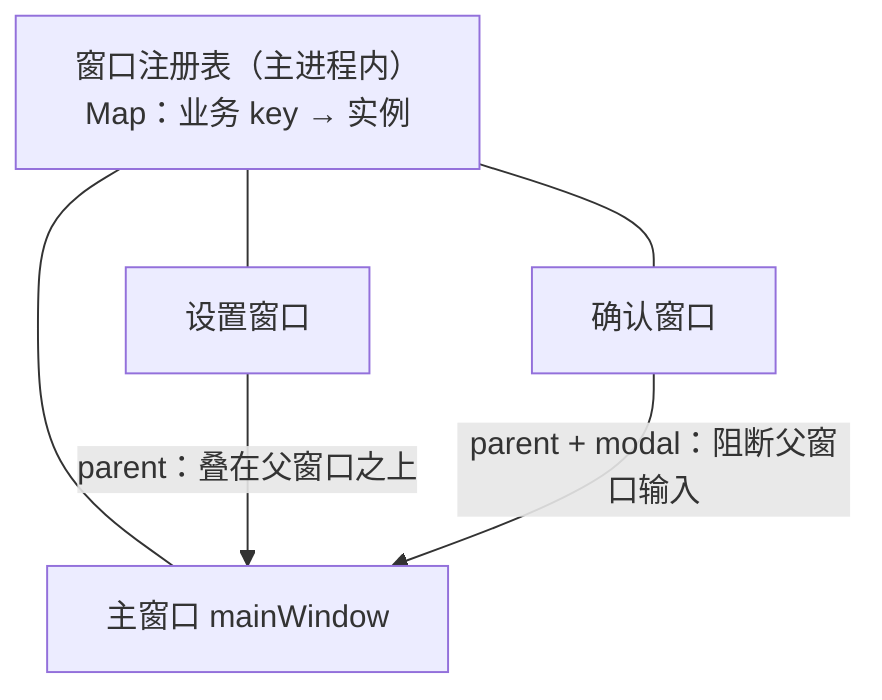

import { Meta } from '@storybook/addon-docs/blocks';

<Meta id="multi-window" title="窗口/多窗口" name="Docs" />

# 多窗口

一个 Electron 应用很少只有一个窗口：设置、关于、确认对话框、多文档编辑，都是同一个进程里并存的多个 `BrowserWindow`。这一课把窗口从「一个对象」升级为「一个集合」：创建动作仍然是「创建窗口」讲的 `new BrowserWindow(options)`，真正的新问题是管理——窗口会不断创建和销毁，你持有的引用集合必须随之登记与清理，否则就会在遍历时撞上 `Object has been destroyed`；同时窗口之间可以声明 `parent` 与 `modal` 关系，决定谁叠在谁之上、谁打开期间阻断谁的输入。读完你应能预测：再点一次「设置」菜单会发生什么、模态窗口打开时点主窗口会怎样、这套关系在 Linux 上靠不靠得住。

本课沿用 2.1 已讲的窗口创建骨架与 `closed` 置空惯例，不重讲 options。窗口之间怎么互发消息是通信问题，见[渲染进程间通信](?path=/docs/ipc-between-renderers--docs)；最后一个窗口关闭后应用退不退出，见[应用生命周期](?path=/docs/app-lifecycle--docs)；渲染页面里 `window.open` 与链接打开新窗口的拦截，见[导航与弹窗控制](?path=/docs/navigation-control--docs)。

窗口集合与窗口关系分属两层，本课的两条主线：



关系与集合 API 速查（默认值与官方文档核对）：

| 名称 | 类别 | 默认值 / 返回 | 用途 |
| --- | --- | --- | --- |
| `parent` | 构造选项 | `null` | 传入另一个 `BrowserWindow`，本窗口成为其子窗口，永远叠在父窗口之上 |
| `modal` | 构造选项 | `false` | 模态窗口：在父子关系之上阻断父窗口输入；仅在子窗口上生效，须与 `parent` 同设 |
| `BrowserWindow.getAllWindows()` | 静态方法 | `BrowserWindow[]` | 当前应用所有打开的窗口 |
| `win.getParentWindow()` | 实例方法 | `BrowserWindow \| null` | 本窗口的父窗口；顶层窗口返回 `null` |
| `win.getChildWindows()` | 实例方法 | `BrowserWindow[]` | 本窗口的所有子窗口 |
| `win.setParentWindow(parent)` | 实例方法 | — | 运行期改挂父窗口；传 `null` 变回顶层窗口 |

## 快速上手

沿用前面课程用 Forge 创建的项目。把本课目录的 `settings.html` 拷进 `src/`（任意简单页面即可，本课观察的是窗口关系而非内容），然后打开 `src/index.js`，在 2.1 的窗口骨架上补一个设置子窗口（完整对照实现在本课目录的 `parent-modal.js`）：

```js
const createWindow = () => {
  const mainWindow = new BrowserWindow({
    width: 900,
    height: 620,
    show: false,
    autoHideMenuBar: true,
    webPreferences: {
      preload: path.join(__dirname, 'preload.js'),
    },
  });

  mainWindow.once('ready-to-show', () => {
    mainWindow.show();
    openSettingsWindow(mainWindow); // 主窗口显示后，打开它的子窗口
  });

  mainWindow.loadFile(path.join(__dirname, 'index.html'));
};

const openSettingsWindow = (parentWindow) => {
  const settingsWindow = new BrowserWindow({
    width: 360,
    height: 480,
    parent: parentWindow, // 声明子窗口关系
    show: false,
  });

  settingsWindow.once('ready-to-show', () => {
    settingsWindow.show();
  });

  settingsWindow.loadFile(path.join(__dirname, 'settings.html'));
};
```

`src/index.js` 属于主进程，在运行 start 的终端输入 `rs` 重启应用（见「第一次运行」），逐项核对可观察结果：

1. **两个窗口都在，且设置窗口永远叠在主窗口之上**——来回切换焦点，设置窗口不会被主窗口盖住，这是 `parent` 声明的层级归属。
2. **macOS 上拖动主窗口，设置窗口跟着走**；Windows/Linux 上它原地不动——子窗口跟随父窗口移动是 macOS 独有行为。
3. **关闭设置窗口，主窗口与应用不受影响**——窗口集合少了一个成员而已。集合怎么跟着这次销毁保持一致，就是下一节的主题。

## 窗口集合管理

窗口是会销毁的资源。单窗口时一个模块级变量加 `closed` 置空就够（2.1 的惯例）；窗口一多，问题变成三件事：**谁持有引用、按什么找窗口、销毁时怎么清理**。管理窗口集合有两个互补的入口：自己的注册表（按业务身份登记）和框架的查询 API（按存活状态查询），下面各用一节讲清分工。

### 引用容器

`getAllWindows()` 只回答「现在开着哪几个」，回答不了「哪个是设置窗口」——业务身份只有你自己知道。引用容器就是一个 `Map`：key 用业务名（`'main'`、`'settings'`），value 是窗口实例。纪律只有两条：**创建即登记，`closed` 即注销**——注销写在每个窗口的 `closed` 事件里，漏掉一个就是遍历时报 `Object has been destroyed` 的幽灵引用：

```js
const windows = new Map(); // 业务 key → BrowserWindow 实例

function createWindow(key, options) {
  const win = new BrowserWindow(options);
  windows.set(key, win); // 创建即登记
  win.on('closed', () => {
    windows.delete(key); // closed 即注销，防止幽灵引用
  });
  return win;
}
```

两个细节让容器可靠：取用入口统一走带 `isDestroyed()` 兜底的 `getWindow()`，防御注册表与真实状态短暂不一致；把 `new`、登记、注销封装进一个 `createWindow(key, options)`，让三步永远成对出现——散落在各处的 `new BrowserWindow()` 是幽灵引用的主要来源。完整参考实现在本课目录的 `window-registry.js`。

可观察证据：关掉设置窗口后再 `getWindow('settings')`，得到 `undefined` 而不是一个已销毁的实例；遍历 `listWindows()` 不会撞上 `Object has been destroyed`。

### 运行期查询与改挂

框架侧也维护着一份实时窗口集合，和你的注册表互补：

```js
BrowserWindow.getAllWindows(); // 当前所有打开的窗口
win.getParentWindow();         // 父窗口，顶层窗口返回 null
win.getChildWindows();         // win 的所有子窗口
win.setParentWindow(null);     // 改挂为顶层窗口
```

三个查询的分工：`getAllWindows()` 回答「应用现在开着几个窗口」，`getChildWindows()` / `getParentWindow()` 回答「谁挂在谁下面」——后两者读的就是 `parent` 关系。`setParentWindow()` 运行期改挂父子关系，传 `null` 变回顶层窗口；窗口角色动态变化的场景才用得上它，多数应用只需要创建时声明。

可观察证据：Forge 模板 `src/index.js` 的 `activate` 回调就在用这份集合——macOS 上关掉所有窗口后点 Dock，`BrowserWindow.getAllWindows().length === 0` 成立，于是重建主窗口。在主进程把这些调用的结果打印到终端，数量会随窗口开关同步变化。这套模板逻辑的完整语义（`window-all-closed`、`activate`）见[应用生命周期](?path=/docs/app-lifecycle--docs)。

## 父子与模态窗口

`parent` 与 `modal` 都是创建时声明的选项，描述窗口之间的属主关系：`parent` 建立归属——子窗口叠在父窗口之上；`modal` 在归属之上加一层输入阻断——模态窗口打开期间父窗口不可交互，官方对模态的定义就是一句话：模态窗口是「会禁用父窗口」的子窗口。两点共同边界：**关系只作用于显示与输入层，不替你管理生命周期**；`modal` 离开 `parent` 不生效，要模态必须两者同设。macOS 的模态窗口会以 sheet 形式附着在父窗口（属主）上——后面[文件与对话框](?path=/docs/dialog-files--docs)里的对话框 API 也是把窗口作为属主传入，属主决定了对话框出现在哪个窗口上。

### parent：子窗口

创建子窗口只需在 options 里多一个 `parent`：

```js
const child = new BrowserWindow({
  width: 360,
  height: 240,
  parent: mainWindow, // 子窗口：永远叠在 mainWindow 之上
});
```

层级规则只有一条：**子窗口永远显示在父窗口之上**，切换焦点也不会被父窗口盖住。位置跟随分平台：macOS 上父窗口移动时子窗口保持相对位置跟着走，Windows/Linux 上子窗口不动——快速上手第 2 条就是对照证据。父窗口先关闭时子窗口的行为，官方文档没有承诺：不要依赖框架替你收尾，注册表的 `closed` 清理对每个窗口独立生效。`show: false` + `ready-to-show` 延迟显示的惯例对子窗口同样适用（2.1 已讲）。

### modal：模态子窗口

模态窗口在 `parent` 之上追加 `modal: true`：

```js
const modal = new BrowserWindow({
  width: 360,
  height: 200,
  parent: mainWindow, // 模态的前提：必须是子窗口
  modal: true,
});
```

三种平台表现预期各不相同：

- **macOS：** 模态窗口以 sheet 形式从父窗口滑出并附着在父窗口上，父窗口在它关闭前不可交互。
- **Windows：** 经典模态——模态窗口打开期间父窗口不可交互、不可获得焦点。
- **Linux：** 官方文档明确模态窗口的类型会被改为 dialog，且许多桌面环境不支持隐藏模态窗口——模态效果在这些环境不保证成立，跨平台产品要按降级预期设计。

另两个边界：`modal` 是构造选项，创建后没有对应 setter，「暂时阻断」与「恢复」不能靠改 `modal`——非模态窗口要临时禁用交互，用 `win.setEnabled(false)` 手动控制父窗口，这也是 Linux 上需要确定性阻断时的替代做法。对照 `parent-modal.js` 里 `openChildWindow` 与 `openModalWindow` 两个函数运行，可以核对两种窗口在同一父窗口上的全部差异。

## 最佳实践

- **需要单例的窗口先查再开。** 设置、关于这类窗口重复打开只会堆叠窗口、分裂状态：已存在就 `focus()`，不存在才创建。代价是注册表里要按 key 判重；多文档、多标签这类确实要多实例的场景反过来，每个实例各自登记 key。判定写在调用方，两行就够：

  ```js
  const existing = getWindow('settings');
  if (existing) {
    existing.focus(); // 已经开着，聚焦即可
  } else {
    createWindow('settings', { width: 360, height: 480 });
  }
  ```

- **业务身份自己记，`getAllWindows()` 只当存活清单。** 它返回的数组里没有「哪个是设置窗口」的信息，按用途找窗口走 `getWindow(key)`；`getAllWindows()` 适合数量判断、全员广播这类与身份无关的操作。两套入口混用着找窗口，是最容易写出脆弱代码的地方。
- **创建与清理写在一处。** 把 `new`、登记、`closed` 注销封进唯一的 `createWindow`，新的窗口种类只是多一行调用；绕过它直接 `new` 的窗口不会进注册表，之后每次按 key 查找、每次遍历都要为它写特判。
- **模态与非模态按流程选。** 必须先完成才能继续的短流程（确认、保存、登录）用 `modal`；可并行的辅助窗口（查找、调色板、 inspector）用普通子窗口。跨平台一致性要求高时，用 `setEnabled` 手动阻断父窗口，不依赖各平台的模态实现。

## 常见问题

- 遍历窗口集合时抛 `Object has been destroyed`，或对已关窗口调 `focus()` 没反应
  说明集合里留了幽灵引用——窗口销毁了，引用还在。处理动作：注销写在每个窗口的 `closed` 里；所有取用走带 `isDestroyed()` 兜底的 `getWindow()`；临时用 `getAllWindows()` 时现取现用，不长期缓存返回的数组。
- Linux 上设置了 `modal: true` 却没有模态效果，或窗口表现成了对话框
  平台限制：Linux 上模态窗口的类型会被改为 dialog，模态效果不保证成立。处理动作：不依赖 Linux 原生模态，需要确定性阻断时用 `parentWindow.setEnabled(false)` 禁用父窗口、模态窗口的 `closed` 里 `setEnabled(true)` 恢复。
- 关掉了主窗口，应用还在后台跑（Dock / 任务栏图标还在）
  这是 `window-all-closed` 的正常语义：所有窗口都关闭才触发，多窗口下主窗口先关不等于应用该退出。要把「关主窗口」等同于退出，需要自己在关闭逻辑里处理，跨平台退出行为见[应用生命周期](?path=/docs/app-lifecycle--docs)。

## 总结回顾

摘要：

多窗口应用的创建动作与单窗口相同，新问题在集合与关系。集合管理有两个互补入口：自己的注册表用 `Map` 按业务 key 登记，纪律是创建即登记、`closed` 即注销，取用带 `isDestroyed()` 兜底；框架的 `getAllWindows()` 返回当前所有打开的窗口，Forge 模板就用它的 `length` 判断是否要重建窗口。窗口关系在创建时用选项声明：`parent` 让子窗口永远叠在父窗口之上（macOS 还会跟随父窗口移动，Windows/Linux 不会），`modal` 在父子关系上追加输入阻断——官方定义是「禁用父窗口」的子窗口，macOS 上以 sheet 附着，Linux 上降级为 dialog、效果不保证。这些关系只作用于显示与输入层，窗口的生死与清理始终是注册表自己的事。

一句话：

> 多窗口的实质是把窗口当集合管理：创建即登记、`closed` 即注销；`parent` 与 `modal` 只是创建时声明的显示层关系，不替你管理生命周期。

知识要点：

- 单窗口的「一个变量」在多窗口下不够用，引用容器要解决哪三件事？
- 登记与清理分别发生在什么时机？漏掉清理的症状是什么？
- `getAllWindows()` 与自有注册表各回答什么问题？Forge 模板在哪里用到了前者？
- `parent` 给窗口带来哪些行为？位置跟随在哪些平台成立？
- `modal` 为什么必须与 `parent` 同设？macOS / Windows / Linux 上各表现如何？
- 父窗口关闭时子窗口的行为文档有没有承诺？清理靠什么保证？
- 「设置窗口只开一个」的判定写在哪里？

## 参考资料

- [Electron 文档 — BrowserWindow](https://www.electronjs.org/docs/latest/api/browser-window)
  本课 API 事实的主要来源：Parent and child windows 与 Modal windows 的定义、`getAllWindows()` / `getParentWindow()` / `getChildWindows()` / `setParentWindow()`、macOS 子窗口跟随父窗口移动、macOS sheet 与 Linux 模态类型改为 dialog 的平台说明、`closed` 事件后应移除引用的要求。
- [Electron 文档 — BaseWindowOptions](https://www.electronjs.org/docs/latest/api/structures/base-window-options)
  `parent` 默认 `null`、`modal` 默认 `false` 且仅在子窗口上生效的默认值出处。
